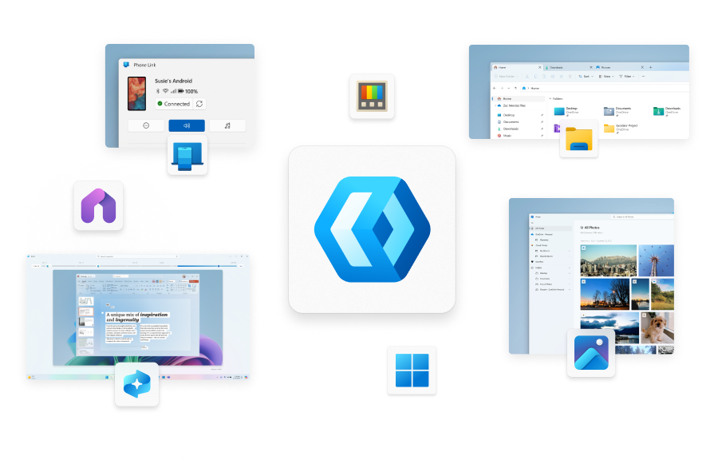

<h1 align="center">
    WinUI 3
</h1>

  

<h3 align="center">
  <a href="https://aka.ms/windev">About WinUI</a>
   · 
  <a href="https://github.com/microsoft/microsoft-ui-xaml/tree/winui3/release/1.5-stable">Source code</a>
   · 
  <a href="https://learn.microsoft.com/windows/apps/desktop/">Documentation</a>
   · 
  <a href="https://aka.ms/winui-releasenotes">Release notes</a>
</h3>

WinUI is a user interface layer that contains modern controls and styles for building Windows apps. The current generation is WinUI 3, which ships as part of the [Windows App SDK](https://aka.ms/winappsdk).

- **Modern UI:** WinUI embodies Fluent Design to enable intuitive, accessible, and powerful experiences and the latest user interface patterns.
- **Developers in control:** Use .NET with C# or C++ to write apps that run great on x86, x64 and ARM.
- **Optimized for modern experiences & hardware:** Create performant experiences with WinUI that are optimized for modern hardware.
- **Part of the Windows App SDK:** The [Windows App SDK](https://aka.ms/winappsdk) is a set of libraries, frameworks, components, and tools that you can use in your apps to access powerful Windows platform functionality from all kinds of apps on many versions of Windows. The Windows App SDK combines the powers of Win32 native applications alongside modern API usage techniques, so your apps light up everywhere your users are.
- **Powers key experiences in Windows:** Windows experiences and apps are built with WinUI. Its rich control set and styles make it easy to develop high-quality experiences used by millions every day.

 

## 📋 Getting started with WinUI

For WinUI, your app's users must be on Windows 10 1809 - Build 17763 or newer (including Windows Insider Previews).

The full documentation of WinUI can be found on [Microsoft Learn](https://learn.microsoft.com/windows/apps/desktop/):
- [Get started with WinUI](https://learn.microsoft.com/windows/apps/get-started/start-here)
- [Build your first WinUI app](https://learn.microsoft.com/windows/apps/how-tos/hello-world-winui3)
- [WinUI & Windows App SDK samples](https://github.com/microsoft/WindowsAppSDK-Samples)
- [WinUI source code](https://github.com/microsoft/microsoft-ui-xaml/tree/winui3/release/1.5-stable)

 

## 🖼️ WinUI 3 Gallery
Make sure to also check out the [WinUI 3 Gallery](https://aka.ms/winui-gallery), our interactive sample experience showing everything you can do with WinUI.

 

## 📺 WinUI Community Call
The WinUI Community Call is your opportunity to learn about WinUI and to engage with the WinUI team and community. Join us online on YouTube at the [Windows Developer channel](https://www.youtube.com/playlist?list=PLI_J2v67C23ZqsolUDaHoFkF1GKvGrttB).

 

## 📢 Contributing to WinUI

The WinUI team welcomes your feedback! To understand how we handle incoming feature requests and bugs, please see our [contribution handling](docs/contribution_handling.md) guidelines.

For information on how to contribute, please see [Contributing to WinUI](CONTRIBUTING.md).

 

## 🛣️ Roadmap

For info on the WinUI release schedule and high level plans please see the [WinUI Roadmap](https://aka.ms/winappsdk/plans).

 

## 🔧 WinUI 2 (for UWP)
WinUI 2 is a library of controls that provides Microsoft UI controls and features for [UWP apps](https://docs.microsoft.com/windows/uwp/index). Learn more about WinUI 2 [here](https://aka.ms/winui2) or download the source code [here](https://github.com/microsoft/microsoft-ui-xaml/tree/winui2/main).

You can get the WinUI 2 Gallery [on the Microsoft Store](https://www.microsoft.com/store/productId/9MSVH128X2ZT?ocid=pdpshare) and see the source code [here](https://github.com/microsoft/WinUI-Gallery/tree/winui2).
 

### Data/Telemetry

This project collects usage data and sends it to Microsoft to help improve our products and services. Note, however, that no data collection is performed when using your private builds.

### Code of Conduct

This project has adopted the [Microsoft Open Source Code of Conduct](https://opensource.microsoft.com/codeofconduct/).

For more information see the [Code of Conduct FAQ](https://opensource.microsoft.com/codeofconduct/faq/) or
contact [opencode@microsoft.com](mailto:opencode@microsoft.com) with any additional questions or comments.
