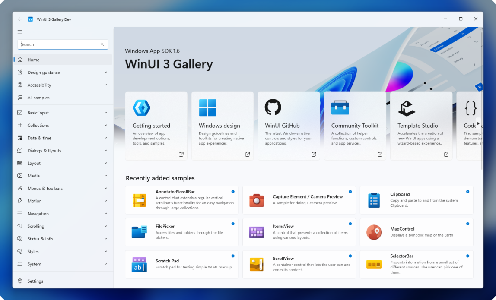

<h1 align="center">
    WinUI
</h1>

  The modern native UI framework for Windows

  
  

<h3 align="center">
 <a href="https://developer.windows.com">About WinUI</a>
   · 
  <a href="https://aka.ms/winui-docs">Documentation</a>
   · 
  <a href="https://aka.ms/winui-releasenotes">Release notes</a>
   · 
  <a href="https://microsoft.com">Contribute</a>
</h3>

WinUI is a user interface layer that contains modern controls and styles for building Windows apps. It ships as part of the [Windows App SDK](https://aka.ms/winappsdk).

- **Modern UI:** WinUI embodies Fluent Design to enable intuitive, accessible, and powerful experiences and the latest user interface patterns..
- **Unmatched native performance:** powered by a highly optimized C++ core that delivers blistering performance, long battery life, and responsive interactivity. Its lower system utilization allows it to run on a wider range of hardware, ensuring your sophisticated workloads run with ease.
- **Developers in control:** WinUI will never force you to update - you choose when to adopt a new version, while being ensured that your app will work great on all supported Windows version. Use C# or C++ to build great apps!
- **Built for modern Windows:** Future-proof your app with WinUI. With 1.5 billion devices running Windows 10 and Windows 11, WinUI continually expands to meet the needs of every modern device. Many of Microsoft's own most-used industry applications already use WinUI today.
- **Part of the Windows App SDK family:** The [Windows App SDK](https://aka.ms/winappsdk) is a set of libraries, frameworks, components, and tools that you can use in your apps to access powerful Windows platform functionality from all kinds of apps on many versions of Windows. The Windows App SDK combines the powers of Win32 native applications alongside modern API usage techniques, so your apps light up everywhere your users are. 

 

## 📋 Getting started with WinUI

For WinUI, your app's users must be on Windows 10 1809 - Build 17763 or newer (including Windows Insider Previews).

The full documentation of WinUI can be found on [Microsoft Learn][docs]:
- [Setup the required developer tools][setup]
- [Creating your first Hello World app][hello-world]
- [Check out the WinUI samples][samples]

[setup]: https://aka.ms/winui-setup
[hello-world]: https://aka.ms/winui-helloworld
[docs]: https://aka.ms/winui-docs
[samples]: https://aka.ms/winui-docs

 

## 🖼️ WinUI Gallery
Make sure to also check out the [WinUI Gallery][winui-gallery], our interactive sample experience showing everything you can do with WinUI.

[winui-gallery]: https://aka.ms/winui-gallery

 

## 📺 WinUI Community Call
The WinUI Community Call is your monthly opportunity to learn about WinUI and to engage with the WinUI team and community. You can watch them online here on YouTube at the [Windows Developer channel](https://www.youtube.com/channel/UCzLbHrU7U3cUDNQWWAqjceA).

 

## 📢 Contributing to WinUI

The WinUI team welcomes your feedback! To understand how we handle incoming feature requests and bugs, please see our [contribution handling](docs/contribution_handling.md) guidelines.

For information on how to contribute, please see [Contributing to WinUI](CONTRIBUTING.md).

 

## 🛣️ Roadmap

For info on the WinUI release schedule and high level plans please see the [WinUI Roadmap](docs/roadmap.md).

 

## 🔧 WinUI 2 (for UWP)
WinUI 2 is a library of controls that provides Microsoft UI controls and features for [UWP apps](https://docs.microsoft.com/windows/uwp/index). Learn more about WinUI 2 [here](https://aka.ms/winui2).

 

### Data/Telemetry

This project collects usage data and sends it to Microsoft to help improve our products and services. Note, however, that no data collection is performed when using your private builds.

### Code of Conduct

This project has adopted the [Microsoft Open Source Code of Conduct](https://opensource.microsoft.com/codeofconduct/).

For more information see the [Code of Conduct FAQ](https://opensource.microsoft.com/codeofconduct/faq/) or
contact [opencode@microsoft.com](mailto:opencode@microsoft.com) with any additional questions or comments.