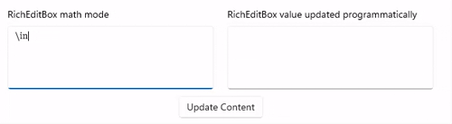

Enabling math mode in RichEditBox
===

# Background

WinUI3's
[RichEditBox](https://learn.microsoft.com/en-us/windows/windows-app-sdk/api/winrt/microsoft.ui.xaml.controls.richeditbox?view=windows-app-sdk-1.6)
is backed by a
[RichEditTextDocument](https://learn.microsoft.com/en-us/windows/windows-app-sdk/api/winrt/microsoft.ui.text.richedittextdocument?view=windows-app-sdk-1.6)
that holds the content of xaml control.
* RichEditTextDocument allows application to interact with the text content through a set of APIs
like GetText, SetText, Undo, Redo etc.
* Windows SDK too has a
[RichEditBox](https://learn.microsoft.com/en-us/uwp/api/windows.ui.xaml.controls.richeditbox?view=winrt-26100) 
control that is backed by platform's
[RichEditTextDocument](https://learn.microsoft.com/en-us/uwp/api/windows.ui.text.richedittextdocument?view=winrt-26100).
This RichEditTextDocument supports setting mode of the document to Math allowing user to interact
with text in richer mathematical representation through
[RichEditTextDocument.SetMathMode](https://learn.microsoft.com/en-us/uwp/api/windows.ui.text.richedittextdocument.setmathmode?view=winrt-26100#windows-ui-text-richedittextdocument-setmathmode(windows-ui-text-richeditmathmode))
API for UWP apps.
* Windows SDK's RichEditTextDocument also offers SetMath and GetMath APIs which allow apps to
interact with user input in
[MathML 3.0](https://www.w3.org/Math/) content.

These three APIs are currently not available on WinUI3's RichEditTextDocument. To enable math mode
support in WinUI3's RichEditBox, these 4 APIs are being added in RichEditTextDocument:
* RichEditMathMode RichEditTextDocument.GetMathMode()
* RichEditTextDocument.SetMathMode(RichEditMathMode mode)
* RichEditTextDocument.GetMathML(out String value)
* RichEditTextDocument.SetMathML(String value)

The new APIs will be authored in Microsoft.UI.Text.ITextDocument2 interface which will be inherited
exclusively by RichEditTextDocument (Similar to existing ITextDocument). Windows SDK's
RichEditTextDocument provides SetMathMode method to enable math mode, WinUI3 will provide
GetMathMode and SetMathMode methods. The GetMath and SetMath APIs are uplifted to GetMathML and
SetMathML, respectively, to indicate their association with the MathML format.


### Spec Notes:
* GetMathML method provides the result from out parameter instead of returning value, this
is to keep consistency with existing RichEditTextDocument.GetText API in the same type.
* GetMathMode and SetMathMode are created as methods instead of single property as updating made
mode will clear the existing content of RichEditBox and Undo stack.
* [Microsoft.UI.Text.RichEditMathMode](https://learn.microsoft.com/en-us/windows/windows-app-sdk/api/winrt/microsoft.ui.text.richeditmathmode?view=windows-app-sdk-1.6)
is an existing publicly available enum.


## Examples

### Enabling math mode

To enable math mode in RichEditBox, a WinUI3 app call SetMathMode API on RichEditBox's TextDocument
property with RichEditMathMode.MathOnly value. After enabling math mode user can type in one or
more equations using
[UnicodeMath](https://www.unicode.org/notes/tn28/UTN28-PlainTextMath-v3.1.pdf) 
as shown in below examples:
```csharp
// richEditBox is the name of the RichEditBox control added in Xaml
richEditBox.TextDocument.SetMathMode(Microsoft.UI.Text.RichEditMathMode.MathOnly);
```

Example 1: When user types in `sin^2 x + cos^2 x = 1` expression in math mode enabled RichEditBox,
'^2' expression evaluates in 2 being added in the power of `sin` and `cos`:


RichEditBox does not evaluate input text if math mode is not enabled:


Example 2: When a user types the expression `tan x = sinx/cosx` in a Math mode-enabled RichEditBox,
the '/' character is interpreted as the division operator, results in `sinx` divided by `cosx`
visual:


### Disabling math mode

The math mode in RichEditBox can be disabled with following API call:
```csharp
// MathMode of RichEditTextDocument can be set to either MathOnly or NoMath. MathMode is disabled
// by default i.e. NoMath
richEditBox.TextDocument.SetMathMode(Microsoft.UI.Text.RichEditMathMode.NoMath);
```

### GetMathML API example

App can get the math content in Mathematical Markup Language (MathML 3.0) format using GetMathML API
on RichEditTextDocument if required:
```csharp
// MathML content will be stored in out string variable
richEditBox.TextDocument.GetMathML(out String mathML);
```
Content in RichEditBox:


For above content GetMathML API returns below MathML content:
```xml
<mml:math xmlns:mml="http://www.w3.org/1998/Math/MathML" display="block">
    <mml:mi mathcolor="#000000">y</mml:mi>
    <mml:mo mathcolor="#000000">=</mml:mo>
    <mml:msup>
        <mml:mrow>
            <mml:mi mathcolor="#000000">x</mml:mi>
        </mml:mrow>
        <mml:mrow>
            <mml:mn mathcolor="#000000">2</mml:mn>
        </mml:mrow>
    </mml:msup>
</mml:math>
```

### SetMathML API example

App can also set MathML content in RichEditBox programmatically using RichEditTextDocument.SetMathML
API:
```csharp
// mathML in this example will be a MathML formatted string
richEditBox.TextDocument.SetMathML(mathML);
```
For example if you initialize mathML string with this mathML content:
```xml
<mml:math xmlns:mml="http://www.w3.org/1998/Math/MathML" display="block">
    <mml:msup>
        <mml:mrow>
            <mml:mi mathcolor="#000000">x</mml:mi>
        </mml:mrow>
        <mml:mrow>
            <mml:mn mathcolor="#000000">3</mml:mn>
        </mml:mrow>
    </mml:msup>
    <mml:mo mathcolor="#000000">+</mml:mo>
    <mml:mi mathcolor="#000000">y</mml:mi>
    <mml:mo mathcolor="#000000">&#x3E;</mml:mo>
    <mml:mn mathcolor="#000000">5</mml:mn>
</mml:math>
```
and call SetMathML API then content in RichEditBox will be updated as below:


### GetText and SetText APIs with Math Mode
Apps can call existing `RichEditTextDocument.GetText` and `RichEditTextDocument.SetText` APIs on a
math mode enabled RichEditBox with limited options:
* GetText API can only be called with TextGetOptions.FormatRtf option which will return Rtf string.
* Calling GetText API with options other than FormatRtf will return `E_INVALIDARG` error code.
* SetText API can be called with existing TextSetOptions.

Apps can also provide a valid Rtf string and update the content of RichEditBox using SetText API
programmatically. For example in the following visual, on the click of button GetText method is
called on first RichEditBox's RichEditTextDocument with option FormatRtf and SetText method is
called on second math mode enabled RichEditBox with FormatRtf and the content returned by previous
GetText call:




# API Pages

## RichEditTextDocument class

```csharp
class RichEditTextDocument
{
    // Existing APIs
    // ...

    // New APIs
    Microsoft.UI.Text.RichEditMathMode GetMathMode();
    void SetMathMode(Microsoft.UI.Text.RichEditMathMode mode);
    void GetMathML(out String value);
    void SetMathML(String value);
}
```


## RichEditTextDocument.GetMathMode method

This method returns RichEditMathMode, it can either be NoMath or MathOnly. Apps can use this API to
know the current mode of the RichEditBox.

## RichEditTextDocument.SetMathMode method

It configures a `RichEditBox` to interpret input based on the specified math mode. By default,
`RichEditBox` does not interpret input as math operations. Math mode enables users to have
[UnicodeMath](https://www.unicode.org/notes/tn28/UTN28-PlainTextMath-v3.1.pdf)
input automatically recognized and converted to MathML while being received.
* Calling this method with `RichEditMathMode.MathOnly` enables math mode in the `RichEditBox`
and with `RichEditMathMode.NoMath` disables math mode.
* Apps can use `GetMathML` and `SetMathML` APIs in conjuction with `SetMathMode` method,
to get and update the content in `RichEditBox` respectively.
* Changing math mode from MathOnly to NoMath or from NoMath to MathOnly will clear the current
content and Undo stack of the RichEditBox.
* In math mode, `RichEditBox` would show content in `Cambria Math` font format.
* The existing `GetText` and `SetText` APIs remain functional in Math mode with limited options.

## RichEditTextDocument.GetMathML method

This method retrieves the `RichEditBox` content as MathML string. Call this method if an app needs
to know the content of `RichEditBox` when the math mode is set to `MathOnly`. Calling GetMathML API
without math mode will throw an HRESULT error with error code `E_INVALIDARG`.

## RichEditTextDocument.SetMathML method

Use this method to programmatically update the `RichEditBox` content when mode is set to `MathOnly`
by passing `value` parameter which represent MathML formatted string.
* SetMathML API overwrites the existing content of RichEditBox.
* If the value passed as parameter is not a properly formatted MathML string than this API returns
`E_INVALIDARG` and the content of RichEditBox becomes empty in this case.
* Calling SetMathML API without math mode will throw an HRESULT error with error code `E_INVALIDARG`.

# API Details

```csharp
namespace Microsoft.UI.Text
{
    // Existing enum
    enum RichEditMathMode
    {
        NoMath,
        MathOnly,
    };

    [exclusiveto(RichEditTextDocument)]
    [webhosthidden]
    interface ITextDocument2
    {
        Microsoft.UI.Text.RichEditMathMode GetMathMode();
        void SetMathMode(Microsoft.UI.Text.RichEditMathMode mode);
        void GetMathML(out String value);
        void SetMathML(String value);
    };

    [webhosthidden]
    runtimeclass RichEditTextDocument
    {
        // Existing Interface
        // ...

        // New Interface
        interface Microsoft.UI.Text.ITextDocument2;
    };
}
```
