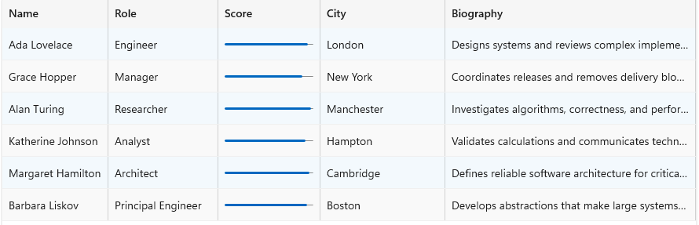
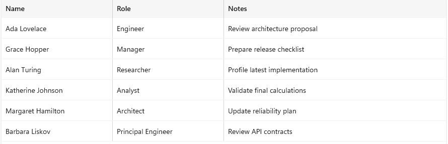
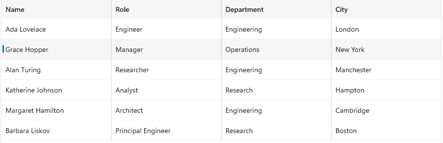
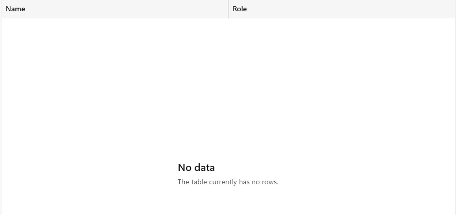

TableView
===

# Background

`TableView` is a tabular control for WinUI 3. It displays an `ItemsSource` as rows and uses a
developer-defined `Columns` collection to create the cells in each row.

The control is intended for data-heavy application experiences such as a process list, file list,
people directory, or results view. It provides the common behaviors needed by those experiences:

- Text and template columns.
- Pixel, Auto, and Star column widths.
- Row virtualization.
- Column headers and grid lines.
- Row density and alternating row backgrounds.
- Frozen leading columns.
- Single row selection.
- Opt-in cell editing.
- Column sorting and resizing.
- Filtering, sorting, and grouping through `TableViewSource`.
- Per-cell tooltips.
- UI Automation support for the table, rows, cells, headers, grouping, selection, and editing.

`TableView` is not intended to be a spreadsheet or a complete replacement for `DataGrid`. It
focuses on presenting and interacting with a moderate number of columns over a potentially large
number of rows.

Rows are virtualized with `ItemsRepeater`. Only the rows needed for the viewport and its cache are
realized. Columns are not virtualized. This design is appropriate for tables with a small or
moderate number of columns, such as 5 to 50 columns.

# Conceptual pages (How To)

## How to use TableView

Create a `TableView`, provide an items source, and add one column for each value that should appear
in a row. The column collection is the content property of `TableView`, so columns can be declared
directly in XAML or added from code.

### Create a basic table

```xaml
<tv:TableView x:Name="Table" />
```

```csharp
public ObservableCollection<Person> People { get; } =
[
    new Person { Name = "Ada", Role = "Engineer" },
    new Person { Name = "Grace", Role = "Manager" },
];

var nameColumn = new TableViewTextColumn
{
    Header = "Name",
    Binding = new Binding
    {
        Path = new PropertyPath(nameof(Person.Name))
    },
    Width = new GridLength(1, GridUnitType.Auto),
};

var roleColumn = new TableViewTextColumn
{
    Header = "Role",
    Binding = new Binding
    {
        Path = new PropertyPath(nameof(Person.Role))
    },
    Width = new GridLength(1, GridUnitType.Star),
};

Table.Columns.Add(nameColumn);
Table.Columns.Add(roleColumn);
Table.ItemsSource = People;
```

`TableViewTextColumn.Binding` is a normal XAML `Binding`. The generated text cell inherits the row
item as its data context, so the binding path is evaluated against the item represented by that row.

### Choose column widths

`TableViewColumn.Width` is a `GridLength` and supports Pixel, Auto, and Star sizing.

| Width | Behavior |
|---|---|
| Pixel | Uses the specified number of pixels. |
| Auto | Sizes to the widest realized header or cell. It can grow when wider content is realized. |
| Star | Receives a proportional share of the remaining viewport width. |

The following table combines all three width kinds:

```csharp
Table.Columns.Add(new TableViewTextColumn
{
    Header = "Name",
    Binding = new Binding { Path = new PropertyPath(nameof(Person.Name)) },
    Width = new GridLength(1, GridUnitType.Auto),
});

Table.Columns.Add(new TableViewTextColumn
{
    Header = "Role",
    Binding = new Binding { Path = new PropertyPath(nameof(Person.Role)) },
    Width = new GridLength(120, GridUnitType.Pixel),
});

Table.Columns.Add(new TableViewTemplateColumn
{
    Header = "Score",
    CellTemplate = (DataTemplate)Application.Current.Resources["ScoreCell"],
    Width = new GridLength(120, GridUnitType.Pixel),
});

Table.Columns.Add(new TableViewTextColumn
{
    Header = "City",
    Binding = new Binding { Path = new PropertyPath(nameof(Person.City)) },
    Width = new GridLength(1, GridUnitType.Star),
});

Table.Columns.Add(new TableViewTextColumn
{
    Header = "Biography",
    Binding = new Binding { Path = new PropertyPath(nameof(Person.Biography)) },
    Width = new GridLength(2, GridUnitType.Star),
});
```

In this example, the Name column sizes to its realized content. Role and Score use fixed widths.
City and Bio divide the remaining space in a 1 to 2 ratio.

`MinWidth` and `MaxWidth` constrain every width mode:

```csharp
nameColumn.MinWidth = 120;
nameColumn.MaxWidth = 240;
```

`ActualWidth` reports the resolved width after the width mode and constraints have been applied.

### Display custom cell content

Use `TableViewTemplateColumn` when a cell needs more than text. This example uses a `ProgressBar`
to display a score:

```xaml
<DataTemplate x:Key="ScoreCell">
    <Grid Padding="8,2">
        <ProgressBar
            Minimum="0"
            Maximum="100"
            Value="{Binding Score}"
            Height="6"
            VerticalAlignment="Center" />
    </Grid>
</DataTemplate>
```

```csharp
var scoreColumn = new TableViewTemplateColumn
{
    Header = "Score",
    CellTemplate = (DataTemplate)Application.Current.Resources["ScoreCell"],
    Width = new GridLength(120, GridUnitType.Pixel),
};

Table.Columns.Add(scoreColumn);
```

A template column with no `CellTemplate` displays an empty cell. It does not use
`dataItem.ToString()` as a fallback.



### Edit cells

TableView is read-only by default. Set `IsReadOnly` to `false` to enable editing:

```csharp
Table.IsReadOnly = false;
```

A `TableViewTextColumn` creates a `TextBox` editor automatically. The editor uses the column's
binding and writes the new value when the edit is committed.

Use `CellEditingTemplate` to provide a custom editor. This example uses a display template and a
separate editing template for a Notes column:

```xaml
<DataTemplate x:Key="NotesCell">
    <TextBlock
        Text="{Binding Notes}"
        Margin="8,4"
        VerticalAlignment="Center" />
</DataTemplate>

<DataTemplate x:Key="NotesEditCell">
    <TextBox
        Text="{Binding Notes, Mode=TwoWay}"
        VerticalAlignment="Center" />
</DataTemplate>
```

```csharp
var notesColumn = new TableViewTemplateColumn
{
    Header = "Notes",
    CellTemplate = (DataTemplate)Application.Current.Resources["NotesCell"],
    CellEditingTemplate =
        (DataTemplate)Application.Current.Resources["NotesEditCell"],
    Width = new GridLength(1, GridUnitType.Auto),
};
```

Use classic `{Binding}` in an editing template. TableView locates those binding expressions when it
commits the editor. Compiled `{x:Bind}` expressions are not discoverable through that mechanism.

The following input starts or closes an edit:

| Input | Behavior |
|---|---|
| Double-click or double-tap a cell | Starts editing that cell. |
| F2 | Starts editing the current cell. |
| Enter | Commits the edit. |
| Escape | Cancels the edit. |
| Move focus away from the cell | Commits the edit. |

`BeginningEdit` can stop an editor from opening. `CellEditEnding` can stop an editor from closing.
Both events are synchronous. Set `Cancel` before the event handler returns.

```csharp
private void OnCellEditEnding(
    TableView sender,
    TableViewCellEditEndingEventArgs args)
{
    if (args.EditAction == TableViewEditAction.Commit &&
        args.Item is Person person &&
        string.IsNullOrWhiteSpace(person.Name))
    {
        args.Cancel = true;
    }
}
```

`CommitEdit()` and `CancelEdit()` allow the application to close the active cell editor.
`IsEditing` reports whether an edit is active.



### Select rows

`SelectionMode` defaults to `Single`. Set it to `None` when the table should not allow selection.

```csharp
Table.Select(0);

bool isSelected = Table.IsSelected(0);

Table.Deselect(Table.SelectedIndex);

Table.DeselectAll();
```

`SelectedItem` and `SelectedIndex` are read-only. Selection is changed through the methods above or
through pointer and keyboard input.

```csharp
private void Table_SelectionChanged(
    TableView sender,
    SelectionChangedEventArgs args)
{
    var selectedItem = sender.SelectedItem as Person;
    var selectedIndex = sender.SelectedIndex;
}
```

Selection follows the item rather than the item's current index. If an item is inserted above the
selected item, the same item remains selected and `SelectedIndex` changes without raising
`SelectionChanged`. If the selected item is removed, selection is cleared.



### Configure headers, grid lines, density, and row backgrounds

```csharp
Table.HeadersVisibility = TableViewHeadersVisibility.Column;
Table.GridLinesVisibility = TableViewGridLinesVisibility.All;
Table.Density = TableViewDensity.Compact;

Table.RowBackground =
    new SolidColorBrush(Color.FromArgb(24, 0, 120, 215));

Table.AlternatingRowBackground =
    new SolidColorBrush(Color.FromArgb(20, 128, 128, 128));
```

Use `HeaderTemplate` or `HeaderTemplateSelector` to customize a column header. When both are set,
`HeaderTemplateSelector` takes precedence.

### Freeze leading columns

Set `FrozenEdge` to `Leading` on a contiguous group of columns starting at the first column:

```csharp
nameColumn.FrozenEdge = TableViewFrozenEdge.Leading;
```

The frozen columns stay visible while the rest of the table scrolls horizontally. A later column
marked `Leading` is not frozen if an unfrozen visible column appears before it. `Trailing` is
reserved for future trailing-edge freezing.

### Show an empty state

Use `EmptyTemplate` to display content when `ItemsSource` is null or contains no rows:

```xaml
<DataTemplate x:Key="EmptyState">
    <StackPanel
        HorizontalAlignment="Center"
        VerticalAlignment="Center"
        Spacing="6">
        <TextBlock Text="No data" FontSize="20" />
        <TextBlock Text="The table currently has no rows." Opacity="0.7" />
    </StackPanel>
</DataTemplate>
```

```csharp
Table.EmptyTemplate =
    (DataTemplate)Application.Current.Resources["EmptyState"];
```



### Sort columns

Set `CanUserSortColumns` to enable or disable header-driven sorting for the table. `CanSort` can
disable sorting for an individual column.

For a `TableViewTextColumn`, the binding path is used as the sort member path when
`SortMemberPath` is empty. Other column types should set `SortMemberPath` or provide a
`CustomSortComparer`.

```xaml
<tv:TableViewTextColumn
    Header="Last name"
    Binding="{Binding LastName}"
    SortMemberPath="LastName" />
```

```csharp
PeopleTable.SortByColumn(lastNameColumn, SortDirection.Ascending);
PeopleTable.ToggleSortDirection(lastNameColumn);
PeopleTable.ClearSort();
```

`SortCycle` controls whether header invocation cycles between ascending and descending, or includes
an unsorted step.

The active sort state lives on the column, as `TableViewColumn.SortDirection`. There is no
control-level sort-column property; `Sorted` hands the application the column that changed, and a
null column there means the sort was cleared. This matches the way a WPF `DataGrid` keeps sort
state on its columns.

There are two sorting paths:

- When `ItemsSource` is a `TableViewSource`, TableView updates the shaped view directly.
  `Sorting` is raised before the update and `Sorted` is raised after it. An application that wants
  to own the ordering can handle `Sorting` and set `Cancel` to `true`, which suppresses the reshape,
  the column's sort direction, the header indicator, and the `Sorted` event.
- When `ItemsSource` is a plain collection, TableView still sorts out of the box by ordering an
  internal projection over that collection. The bound collection is never reordered.

### Sort with a custom comparer

Some orderings cannot be expressed by a single property path. A league standings table, for
example, ranks each row by points, then by goal difference, then by goals scored, and finally by
team name for a stable result. Supply that ordering with a `CustomSortComparer`. It takes
precedence over `SortMemberPath`, so the column sorts entirely through the comparer.

`ITableViewSortComparer` is an interface rather than a delegate, so a comparer can be declared as a
XAML resource or assigned in code.

```csharp
public sealed class StandingsRankComparer : ITableViewSortComparer
{
    public int Compare(object left, object right)
    {
        if (left is not LeagueTeam a || right is not LeagueTeam b)
        {
            return 0;
        }

        int byPoints = b.Points.CompareTo(a.Points);
        if (byPoints != 0)
        {
            return byPoints;
        }

        int byGoalDifference = b.GoalDifference.CompareTo(a.GoalDifference);
        if (byGoalDifference != 0)
        {
            return byGoalDifference;
        }

        int byGoalsFor = b.GoalsFor.CompareTo(a.GoalsFor);
        if (byGoalsFor != 0)
        {
            return byGoalsFor;
        }

        return string.CompareOrdinal(a.Team, b.Team);
    }
}
```

```csharp
standingColumn.CustomSortComparer = new StandingsRankComparer();
StandingsTable.SortByColumn(standingColumn, SortDirection.Ascending);
```

The control ranks the rows once through the comparer, then sorts on the resulting integer ranks.
Reversing the column direction reverses those ranks without calling the comparer again.

### Compose a multi-axis sort with TableViewSource

Header interaction is single-column: applying a new sort clears the previous one. When several sort
keys are needed at once, call `Sort` on a `TableViewSource` once for each key. The first key you
declare is the primary sort, and each later key breaks ties within the previous one. This is the
same precedence order that `SortDescriptions` uses on a WPF `DataGrid`.

```csharp
var source = TableViewSource.From(people);
PeopleTable.ItemsSource = source;

source
    .Sort(item => ((Person)item).Department, SortDirection.Ascending)
    .Sort(item => ((Person)item).LastName, SortDirection.Ascending);
```

Rows are ordered by department first, and people within a department are ordered by last name.
Re-sorting a key that is already active keeps its place in the precedence order. Passing
`SortDirection.None` for a key removes that axis, so setting every key to `None` leaves the source
unsorted.

### Filter and group rows with TableViewSource

`TableViewSource` provides a fluent shaping surface over an existing collection. Keep one
`TableViewSource` assigned to the table and change its shape in place.

```csharp
ObservableCollection<Person> people =
[
    new Person
    {
        Name = "Ada Lovelace",
        LastName = "Lovelace",
        Role = "Engineer",
        Department = "Engineering",
    },
    new Person
    {
        Name = "Grace Hopper",
        LastName = "Hopper",
        Role = "Manager",
        Department = "Operations",
    },
    new Person
    {
        Name = "Alan Turing",
        LastName = "Turing",
        Role = "Researcher",
        Department = "Engineering",
    },
];

var source = TableViewSource.From(people);
PeopleTable.ItemsSource = source;
source.GroupBy(item => ((Person)item).Department);
```

Grouped rows appear under a header for each key, and each header shows the group's item count.


Filtering and sorting can be combined with grouping:

```csharp
source
    .Filter(item => ((Person)item).Department == "Engineering")
    .Sort(
        item => ((Person)item).LastName,
        SortDirection.Ascending)
    .GroupBy(item => ((Person)item).Department);
```

Each call changes the retained source and returns that source, which allows fluent chaining.

Use `ClearFilter()`, `ClearSort()`, and `ClearGroupBy()` to remove shaping operations:

```csharp
source.ClearFilter()
      .ClearSort()
      .ClearGroupBy();
```

Grouped rows use `GroupHeaderTemplate` for their content. TableView supplies the expand and
collapse chrome around that content.

```xaml
<tv:TableView x:Name="PeopleTable">
    <tv:TableView.GroupHeaderTemplate>
        <DataTemplate>
            <StackPanel Orientation="Horizontal" Spacing="8">
                <TextBlock Text="{Binding KeyText}" FontWeight="SemiBold" />
                <TextBlock Text="{Binding ItemCountText}" Opacity="0.7" />
            </StackPanel>
        </DataTemplate>
    </tv:TableView.GroupHeaderTemplate>
</tv:TableView>
```

Use `ExpandAllGroups()` and `CollapseAllGroups()` to change every group's expansion state.

Each group header's data context is a `TableViewGroupInfo`. Bind to `KeyText` and `ItemCountText`
for culture-formatted text, or to `Key`, `ItemCount`, and `IsExpanded` for the raw values.

Because one source is retained and reshaped in place, turning grouping on and off is just another
call on the same source. Bind the source once, then switch shape at runtime:

```csharp
if (groupingEnabled)
{
    source.GroupBy(item => ((Person)item).Department);
}
else
{
    source.ClearGroupBy();
}
```

#### Group by a reference-type key

`GroupBy` derives a stable identity for each group key so that groups keep their expansion state
across a reshape. Value-type keys (`String`, `Int32`, `Int64`, `Guid`, `Boolean`, and enums) supply
that identity automatically. A reference-type key has no built-in identity, so use the second
`GroupBy` overload to provide one:

```csharp
source.GroupBy(
    item => ((Person)item).Manager,
    key => ((Employee)key).Email);
```

The first selector produces the group key, and the second produces a stable string identity for that
key. Passing `null` for the identity selector selects the built-in value-type identity.

### Resize columns

Column resizing is enabled by default. Set `CanUserResizeColumns` to `false` to disable it for the
whole table. Set `CanResize` to `false` to keep a specific column fixed.

```csharp
Table.CanUserResizeColumns = true;
nameColumn.CanResize = true;
scoreColumn.CanResize = false;
```

Users can drag the resize affordance at the end of a column header. A focused, resizable header can
also be resized with the Left and Right arrow keys. Shift uses a larger keyboard step.

Resizing sets the column to a pixel width. If a resize gesture is canceled, the original authored
`GridLength` is restored, including Auto or Star.

### Provide cell tooltips

`CellToolTipRequested` lets an application supply tooltip content for each realized cell. The
event is opt-in. When no handler is attached, TableView performs no per-cell tooltip work.

```csharp
private void OnCellToolTipRequested(
    TableView sender,
    TableViewCellToolTipRequestedEventArgs args)
{
    if (args.Item is Person person && args.Column == nameColumn)
    {
        args.Content = person.Name;
    }
}
```

`Content` can be text, a UI element, or a configured `ToolTip`. Set `ToolTipHelpText` when non-text
content needs a text equivalent for assistive technology.

Call `InvalidateCellToolTips()` when tooltip data changes independently of the row item or columns.
The control then requests tooltip content again for realized cells.

# API Pages

## TableView class

Represents a virtualized tabular control that displays items as rows and developer-defined columns
as cells.

`TableView` derives from `Microsoft.UI.Xaml.Controls.Control`. `Columns` is its content property.

### TableView data and presentation properties

| Property | Type | Default | Description |
|---|---|---|---|
| `ItemsSource` | `Object` | `null` | The row source. A supported collection or `TableViewSource` can be assigned. |
| `Columns` | `IVector<TableViewColumn>` | Empty | The columns displayed by the table. |
| `HeadersVisibility` | `TableViewHeadersVisibility` | `Column` | Controls whether the column-header band is visible. |
| `GridLinesVisibility` | `TableViewGridLinesVisibility` | `All` | Controls horizontal and vertical grid lines. |
| `Density` | `TableViewDensity` | `Standard` | Controls built-in row height and cell padding. |
| `RowBackground` | `Brush` | `null` | The background used for rows. |
| `AlternatingRowBackground` | `Brush` | `null` | The background used for alternating rows. |
| `EmptyTemplate` | `DataTemplate` | `null` | Content shown when there are no rows. |
| `GroupHeaderTemplate` | `DataTemplate` | `null` | Content shown inside each group-header container. |

### TableView editing properties

| Property | Type | Default | Description |
|---|---|---|---|
| `IsReadOnly` | `Boolean` | `true` | Disables editing for the whole table when `true`. |
| `IsEditing` | `Boolean` | `false` | Reports whether a cell editor is active. Read-only. |

### TableView selection properties

| Property | Type | Default | Description |
|---|---|---|---|
| `SelectionMode` | `TableViewSelectionMode` | `Single` | Enables single row selection or disables selection. |
| `SelectedItem` | `Object` | `null` | The selected data item. Read-only. |
| `SelectedIndex` | `Int32` | `-1` | The selected row index, or `-1`. Read-only. |

### TableView sorting and resizing properties

| Property | Type | Default | Description |
|---|---|---|---|
| `CanUserSortColumns` | `Boolean` | `true` | Enables header-driven sorting. Programmatic sorting remains available when `false`. |
| `CanUserResizeColumns` | `Boolean` | `true` | Enables pointer and keyboard column resizing. |

### TableView methods

| Method | Returns | Description |
|---|---|---|
| `CommitEdit()` | `Boolean` | Commits and closes the active cell editor. |
| `CancelEdit()` | `Boolean` | Cancels and closes the active cell editor. |
| `Select(Int32 index)` | `void` | Selects the row at `index`. A negative index clears selection. |
| `Deselect(Int32 index)` | `void` | Deselects the row when it is currently selected. |
| `IsSelected(Int32 index)` | `Boolean` | Returns whether the row is selected. |
| `DeselectAll()` | `void` | Clears selection. |
| `SortByColumn(TableViewColumn column, SortDirection direction)` | `Boolean` | Applies the requested single-column sort. |
| `ToggleSortDirection(TableViewColumn column)` | `Boolean` | Advances the column through `SortCycle`. |
| `ClearSort()` | `Boolean` | Clears the active sort. |
| `ExpandAllGroups()` | `void` | Expands every group. |
| `CollapseAllGroups()` | `void` | Collapses every group. |
| `InvalidateCellToolTips()` | `void` | Requests tooltip content again for realized cells. |

### TableView events

| Event | Event arguments | Description |
|---|---|---|
| `BeginningEdit` | `TableViewBeginningEditEventArgs` | Raised before a cell editor opens. |
| `CellEditEnding` | `TableViewCellEditEndingEventArgs` | Raised before a cell editor commits or cancels. |
| `SelectionChanged` | `SelectionChangedEventArgs` | Raised after the selected item changes. |
| `Sorting` | `TableViewSortingEventArgs` | Raised before TableView applies a sort. Cancel it to own the ordering. |
| `Sorted` | `TableViewSortedEventArgs` | Raised after sort state has been applied. |
| `CellToolTipRequested` | `TableViewCellToolTipRequestedEventArgs` | Requests tooltip content for a realized cell. |

### TableView template parts

| Part | Type | Description |
|---|---|---|
| `PART_HeaderRow` | `FrameworkElement` | Root of the column-header band. |
| `PART_HeaderHost` | `Panel` | Receives the generated column-header elements. |
| `PART_RowsRepeater` | `ItemsRepeater` | Hosts virtualized row containers. |
| `PART_EmptyStatePresenter` | `ContentControl` | Hosts `EmptyTemplate`. Optional. |

## TableViewColumn class

Represents the base class for a TableView column. It derives from `DependencyObject` and uses
`Header` as its content property.

| Property | Type | Default | Description |
|---|---|---|---|
| `Header` | `Object` | `null` | The column-header content. |
| `HeaderTemplate` | `DataTemplate` | `null` | The template used to display the header. |
| `HeaderTemplateSelector` | `DataTemplateSelector` | `null` | Selects the header template. Takes precedence over `HeaderTemplate`. |
| `Width` | `GridLength` | `120` pixels | The authored Pixel, Auto, or Star width. |
| `MinWidth` | `Double` | `20` | The minimum resolved width. |
| `MaxWidth` | `Double` | Positive infinity | The maximum resolved width. |
| `ActualWidth` | `Double` | `120` | The resolved width. Read-only. |
| `FrozenEdge` | `TableViewFrozenEdge` | `None` | Freezes the column at a supported table edge. |
| `Visibility` | `Visibility` | `Visible` | Shows or hides the column. |
| `IsReadOnly` | `Boolean` | `false` | Prevents editing this column. |
| `CellEditingTemplate` | `DataTemplate` | `null` | Provides the cell editor. |
| `CanSort` | `Boolean` | `true` | Enables header-driven sorting for this column. |
| `SortMemberPath` | `String` | Empty | The row-item property used as the sort key. |
| `CustomSortComparer` | `ITableViewSortComparer` | `null` | Provides custom item ordering. Takes precedence over `SortMemberPath`. |
| `SortDirection` | `SortDirection` | `None` | Reports this column's active sort direction. Read-only. |
| `SortCycle` | `TableViewSortCycle` | `AscendingDescending` | The direction sequence repeated header clicks walk for this column. |
| `CanResize` | `Boolean` | `true` | Enables user resizing for this column. |

| Method | Description |
|---|---|
| `GenerateElement(Object dataItem)` | Creates the display element for a cell. |
| `GenerateElementCore(Object dataItem)` | Overridable display-element factory for derived columns. |
| `GetSortMemberPathCore()` | Returns the effective sort member path. |

## TableViewTextColumn class

Represents a column that displays bound text and provides a built-in text editor.

`TableViewTextColumn` derives from `TableViewColumn`.

| Property | Type | Description |
|---|---|---|
| `Binding` | `Microsoft.UI.Xaml.Data.Binding` | The binding applied to the generated `TextBlock` and text editor. This is a CLR property, not a dependency property. |

When `SortMemberPath` is empty, `GetSortMemberPathCore()` returns `Binding.Path.Path`.

## TableViewTemplateColumn class

Represents a column whose display content is provided by a data template.

`TableViewTemplateColumn` derives from `TableViewColumn`.

| Property | Type | Default | Description |
|---|---|---|---|
| `CellTemplate` | `DataTemplate` | `null` | Creates the display content for each cell. |

`CellEditingTemplate` is inherited from `TableViewColumn`.

## TableViewSource class

Represents a shapeable view over an existing items collection.

Create a source with `TableViewSource.From(items)`. Assign the returned object directly to
`TableView.ItemsSource`.

| Member | Returns | Description |
|---|---|---|
| `From(Object items)` | `TableViewSource` | Creates a source over a supported collection. |
| `Filter(TableViewPredicate predicate)` | `TableViewSource` | Replaces the active filter. |
| `ClearFilter()` | `TableViewSource` | Removes the active filter. |
| `Sort(TableViewKeySelector key, SortDirection direction)` | `TableViewSource` | Adds or replaces a sort axis. `SortDirection.None` removes that key's axis. |
| `ClearSort()` | `TableViewSource` | Removes all sort axes. |
| `GroupBy(TableViewKeySelector key)` | `TableViewSource` | Groups rows by the selected key. |
| `GroupBy(TableViewKeySelector key, TableViewIdentitySelector groupIdentitySelector)` | `TableViewSource` | Groups rows and supplies a stable string identity for each group key. `groupIdentitySelector` is optional; passing `null` selects the built-in value-type group identity. |
| `ClearGroupBy()` | `TableViewSource` | Removes grouping. |

`TableViewSource` is UI-thread affine. Call its shaping methods from the UI thread. Source
collection notifications can be marshaled to the UI thread by the implementation.

A null source, predicate, or selector is invalid and produces `E_INVALIDARG`.

Rows use object identity. Two different item objects with identical property values remain two
different rows. This allows sorting, filtering, grouping, selection, and editing to work with
duplicate-looking data.

## TableViewGroupInfo class

Provides the data context for a group header.

| Property | Type | Description |
|---|---|---|
| `Key` | `Object` | The value produced by the group key selector. |
| `ItemCount` | `Int32` | The number of data rows in the group. |
| `Level` | `Int32` | The group level. This release uses level 0. |
| `IsExpandable` | `Boolean` | Whether the group can be expanded or collapsed. |
| `IsExpanded` | `Boolean` | Whether the group is expanded. |
| `KeyText` | `String` | Culture-formatted text for `Key`. |
| `ItemCountText` | `String` | Culture-formatted text for `ItemCount`. |

`TableViewGroupInfo` implements `INotifyPropertyChanged`.

## TableViewGroupHeader class

Represents a generated group-header container. It derives from `ContentControl`.

| Property | Type | Description |
|---|---|---|
| `IsExpanded` | `Boolean` | Gets or sets the expansion state. |
| `IsExpandable` | `Boolean` | Gets or sets whether expansion is available. |

| Event | Description |
|---|---|
| `ToggleRequested` | Raised when the user requests an expansion-state change. |

The default template provides the expander chrome. `TableView.GroupHeaderTemplate` supplies only
the content displayed beside that chrome.

## TableViewRow class

Represents a realized data-row container. It derives from `Control`.

| Property | Type | Default | Description |
|---|---|---|---|
| `IsSelected` | `Boolean` | `false` | Reports whether the row is selected. Read-only. |

### TableViewRow template parts

| Part | Type | Description |
|---|---|---|
| `PART_RootBorder` | `Border` | Draws row chrome and state backgrounds. |
| `PART_CellsHost` | `Panel` | Hosts the generated cells. |
| `PART_CellForegroundPresenter` | `ContentPresenter` | Applies selected-state foreground to inheriting cell content. |
| `PART_SelectionIndicator` | `UIElement` | Draws the selected-row indicator. |

## Event argument classes

| Type | Members |
|---|---|
| `TableViewBeginningEditEventArgs` | `Item`, `Column`, `Cancel` |
| `TableViewCellEditEndingEventArgs` | `Item`, `Column`, `EditAction`, `Cancel` |
| `TableViewSortingEventArgs` | `Column`, `Direction`, `Cancel` |
| `TableViewSortedEventArgs` | `Column`, `Direction` |
| `TableViewCellToolTipRequestedEventArgs` | `Item`, `Column`, `Content`, `ToolTipHelpText` |
| `TableViewGroupHeaderToggleRequestedEventArgs` | `GroupKey` |

## Enum types

### TableViewFrozenEdge

| Value | Numeric value | Description |
|---|---:|---|
| `None` | 0 | The column scrolls normally. |
| `Leading` | 1 | The column is frozen at the leading edge. |
| `Trailing` | 2 | Reserved for trailing-edge freezing. |

### TableViewHeadersVisibility

| Value | Numeric value | Description |
|---|---:|---|
| `None` | 0 | Hides column headers. |
| `Column` | 1 | Shows column headers. |

### TableViewGridLinesVisibility

| Value | Numeric value | Description |
|---|---:|---|
| `All` | 0 | Shows horizontal and vertical grid lines. |
| `Horizontal` | 1 | Shows horizontal grid lines. |
| `None` | 2 | Hides all grid lines. |
| `Vertical` | 3 | Shows vertical grid lines. |

### TableViewDensity

| Value | Numeric value | Description |
|---|---:|---|
| `Compact` | 0 | Uses compact row height and padding. |
| `Standard` | 1 | Uses standard row height and padding. |
| `Comfortable` | 2 | Uses comfortable row height and padding. |

### TableViewSelectionMode

| Value | Numeric value | Description |
|---|---:|---|
| `None` | 0 | Disables selection. |
| `Single` | 1 | Allows one selected row. |

### TableViewEditAction

| Value | Numeric value | Description |
|---|---:|---|
| `Commit` | 0 | The edit is closing by committing its value. |
| `Cancel` | 1 | The edit is closing without committing its value. |

### TableViewSortCycle

| Value | Numeric value | Description |
|---|---:|---|
| `AscendingDescending` | 0 | Cycles between ascending and descending. |
| `AscendingDescendingNone` | 1 | Adds an unsorted state to the cycle. |

### SortDirection

| Value | Numeric value | Description |
|---|---:|---|
| `None` | 0 | No sort is applied. |
| `Ascending` | 1 | Values are ordered from lower to higher. |
| `Descending` | 2 | Values are ordered from higher to lower. |

## Automation peer classes

| Peer | Supported provider interfaces |
|---|---|
| `TableViewAutomationPeer` | `ISelectionProvider`, `IGridProvider`, `ITableProvider`, `IItemContainerProvider` |
| `TableViewRowAutomationPeer` | `ISelectionItemProvider` |
| `TableViewColumnHeaderAutomationPeer` | `IInvokeProvider` |
| `TableViewCellAutomationPeer` | `IGridItemProvider`, `ITableItemProvider`, `IValueProvider` |
| `TableViewGroupHeaderAutomationPeer` | `IExpandCollapseProvider`, `IGridItemProvider` |

# API Details

```c# (but really MIDL3)
namespace Microsoft.UI.Xaml.Controls.Tabular
{
    enum TableViewFrozenEdge
    {
        None = 0,
        Leading = 1,
        Trailing = 2,
    };

    [flags]
    enum TableViewHeadersVisibility
    {
        None = 0,
        Column = 1,
    };

    enum TableViewGridLinesVisibility
    {
        All = 0,
        Horizontal = 1,
        None = 2,
        Vertical = 3,
    };

    enum TableViewDensity
    {
        Compact = 0,
        Standard = 1,
        Comfortable = 2,
    };

    enum TableViewSelectionMode
    {
        None = 0,
        Single = 1,
    };

    enum TableViewEditAction
    {
        Commit = 0,
        Cancel = 1,
    };

    enum TableViewSortCycle
    {
        AscendingDescending = 0,
        AscendingDescendingNone = 1,
    };

    enum SortDirection
    {
        None = 0,
        Ascending = 1,
        Descending = 2,
    };

    delegate Boolean TableViewPredicate(Object item);
    delegate Object TableViewKeySelector(Object item);
    delegate String TableViewIdentitySelector(Object item);

    interface ITableViewSortComparer
    {
        Int32 Compare(Object left, Object right);
    };

    runtimeclass TableViewBeginningEditEventArgs
    {
        Object Item { get; };
        TableViewColumn Column { get; };
        Boolean Cancel;
    };

    runtimeclass TableViewCellEditEndingEventArgs
    {
        Object Item { get; };
        TableViewColumn Column { get; };
        TableViewEditAction EditAction { get; };
        Boolean Cancel;
    };

    runtimeclass TableViewSortingEventArgs
    {
        TableViewColumn Column { get; };
        SortDirection Direction { get; };
        Boolean Cancel;
    };

    runtimeclass TableViewSortedEventArgs
    {
        TableViewColumn Column { get; };
        SortDirection Direction { get; };
    };

    runtimeclass TableViewCellToolTipRequestedEventArgs
    {
        Object Item { get; };
        TableViewColumn Column { get; };
        Object Content;
        String ToolTipHelpText;
    };

    [contentproperty("Header")]
    unsealed runtimeclass TableViewColumn : Microsoft.UI.Xaml.DependencyObject
    {
        TableViewColumn();

        Object Header;
        Microsoft.UI.Xaml.DataTemplate HeaderTemplate;
        Microsoft.UI.Xaml.Controls.DataTemplateSelector HeaderTemplateSelector;

        Microsoft.UI.Xaml.GridLength Width;
        Double MinWidth;
        Double MaxWidth;
        Double ActualWidth { get; };

        TableViewFrozenEdge FrozenEdge;
        Microsoft.UI.Xaml.Visibility Visibility;

        Boolean IsReadOnly;
        Microsoft.UI.Xaml.DataTemplate CellEditingTemplate;

        Boolean CanSort;
        String SortMemberPath;
        ITableViewSortComparer CustomSortComparer;
        SortDirection SortDirection { get; };
        TableViewSortCycle SortCycle;

        Boolean CanResize;

        Microsoft.UI.Xaml.FrameworkElement GenerateElement(Object dataItem);
        overridable Microsoft.UI.Xaml.FrameworkElement GenerateElementCore(Object dataItem);
        overridable String GetSortMemberPathCore();
    };

    unsealed runtimeclass TableViewTextColumn : TableViewColumn
    {
        TableViewTextColumn();
        Microsoft.UI.Xaml.Data.Binding Binding;
    };

    unsealed runtimeclass TableViewTemplateColumn : TableViewColumn
    {
        TableViewTemplateColumn();
        Microsoft.UI.Xaml.DataTemplate CellTemplate;
    };

    runtimeclass TableViewSource
    {
        static TableViewSource From(Object items);

        TableViewSource Filter(TableViewPredicate predicate);
        TableViewSource ClearFilter();

        TableViewSource Sort(
            TableViewKeySelector key,
            SortDirection direction);
        TableViewSource ClearSort();

        TableViewSource GroupBy(TableViewKeySelector key);
        TableViewSource GroupBy(
            TableViewKeySelector key,
            TableViewIdentitySelector groupIdentitySelector);
        TableViewSource ClearGroupBy();
    };

    runtimeclass TableViewGroupInfo :
        Microsoft.UI.Xaml.Data.INotifyPropertyChanged
    {
        Object Key { get; };
        Int32 ItemCount { get; };
        Int32 Level { get; };
        Boolean IsExpandable { get; };
        Boolean IsExpanded { get; };
        String KeyText { get; };
        String ItemCountText { get; };
    };

    runtimeclass TableViewGroupHeaderToggleRequestedEventArgs
    {
        Object GroupKey { get; };
    };

    unsealed runtimeclass TableViewGroupHeader :
        Microsoft.UI.Xaml.Controls.ContentControl
    {
        TableViewGroupHeader();

        Boolean IsExpanded;
        Boolean IsExpandable;

        event Windows.Foundation.TypedEventHandler<
            TableViewGroupHeader,
            TableViewGroupHeaderToggleRequestedEventArgs> ToggleRequested;
    };

    unsealed runtimeclass TableViewRow :
        Microsoft.UI.Xaml.Controls.Control
    {
        TableViewRow();
        Boolean IsSelected { get; };
    };

    [contentproperty("Columns")]
    unsealed runtimeclass TableView :
        Microsoft.UI.Xaml.Controls.Control
    {
        TableView();

        Object ItemsSource;
        Windows.Foundation.Collections.IVector<TableViewColumn> Columns { get; };

        TableViewHeadersVisibility HeadersVisibility;
        TableViewGridLinesVisibility GridLinesVisibility;
        TableViewDensity Density;
        Microsoft.UI.Xaml.Media.Brush RowBackground;
        Microsoft.UI.Xaml.Media.Brush AlternatingRowBackground;
        Microsoft.UI.Xaml.DataTemplate EmptyTemplate;
        Microsoft.UI.Xaml.DataTemplate GroupHeaderTemplate;

        Boolean IsReadOnly;
        Boolean IsEditing { get; };
        Boolean CommitEdit();
        Boolean CancelEdit();

        event Windows.Foundation.TypedEventHandler<
            TableView,
            TableViewBeginningEditEventArgs> BeginningEdit;

        event Windows.Foundation.TypedEventHandler<
            TableView,
            TableViewCellEditEndingEventArgs> CellEditEnding;

        TableViewSelectionMode SelectionMode;
        Object SelectedItem { get; };
        Int32 SelectedIndex { get; };

        void Select(Int32 index);
        void Deselect(Int32 index);
        Boolean IsSelected(Int32 index);
        void DeselectAll();

        event Windows.Foundation.TypedEventHandler<
            TableView,
            Microsoft.UI.Xaml.Controls.SelectionChangedEventArgs>
            SelectionChanged;

        Boolean CanUserSortColumns;

        Boolean SortByColumn(
            TableViewColumn column,
            SortDirection direction);
        Boolean ToggleSortDirection(TableViewColumn column);
        Boolean ClearSort();

        event Windows.Foundation.TypedEventHandler<
            TableView,
            TableViewSortingEventArgs> Sorting;

        event Windows.Foundation.TypedEventHandler<
            TableView,
            TableViewSortedEventArgs> Sorted;

        Boolean CanUserResizeColumns;

        void ExpandAllGroups();
        void CollapseAllGroups();

        event Windows.Foundation.TypedEventHandler<
            TableView,
            TableViewCellToolTipRequestedEventArgs>
            CellToolTipRequested;

        void InvalidateCellToolTips();
    };
}
```

# Appendix

## Keyboard and pointer behavior

| Input | Behavior |
|---|---|
| Click or tap a row | Selects the row on release when selection is enabled. |
| Up or Down | Moves to the previous or next row. Selection follows focus in single-selection mode. |
| Home or End | Moves to the first or last row. |
| Page Up or Page Down | Moves by approximately one viewport. |
| Ctrl plus a navigation key | Moves focus without changing selection. |
| Space | Selects the focused row. |
| Ctrl plus Space | Toggles the focused row in single-selection mode. |
| Double-click or double-tap a cell | Starts editing the cell. |
| F2 | Starts editing the current cell. |
| Enter while editing | Commits the cell edit. |
| Escape while editing | Cancels the cell edit. |
| Invoke a sortable header | Advances that column through `SortCycle`. |
| Drag a resizable header edge | Resizes the column. |
| Left or Right on a focused resizable header | Resizes the column by one keyboard increment. |
| Shift plus Left or Right | Resizes by the larger keyboard increment. |

An active editor owns its keyboard input. Row navigation does not move the editor out of the
realization window.

## Editing model

Editing is cell-scoped. `CommitEdit()` writes the active editor's value to the data item.
`CancelEdit()` discards the pending editor value.

The built-in text editor uses `UpdateSourceTrigger=Explicit`. This keeps the pending value in the
editor until TableView accepts the commit. It also allows Escape or `CancelEdit()` to close the
editor without first modifying the data item.

There is no row-level edit transaction in this version. Committing one cell updates the item
immediately.

## Sorting model

Only one TableView column is the active sort column. `SortByColumn` clears the previous column's
sort state before applying the new state.

The shaping engine can internally order more than one sort axis for composition with grouping, but
the TableView control exposes a single-column sort interaction.

## Grouping model

Grouping is single-level. The row axis contains both data rows and generated group-header rows.
Group headers do not represent application data items and are not included in data-item sorting or
selection.

Collapsing a group hides its data rows without removing them from the shaped data set.

## Out of scope

- Multiple and extended row selection.
- Marquee selection.
- Public multi-column sort interaction.
- Column virtualization.
- Row headers.
- Spreadsheet-style cell ranges and formulas.
- Hierarchy deeper than the supported grouping and hierarchy model.
