Window placement persistence
===

- [Window placement persistence](#window-placement-persistence)
- [1. Background](#1-background)
- [2. Conceptual](#2-conceptual)
  - [2.1. Scenarios](#21-scenarios)
    - [2.1.1. Reopen a window where you left it](#211-reopen-a-window-where-you-left-it)
    - [2.1.2. Bring an off-screen window back into view](#212-bring-an-off-screen-window-back-into-view)
    - [2.1.3. Keep a familiar position and size after display scaling changes](#213-keep-a-familiar-position-and-size-after-display-scaling-changes)
    - [2.1.4. Avoid a taskbar whose position has changed](#214-avoid-a-taskbar-whose-position-has-changed)
    - [2.1.5. Keep a window on its display after monitors are rearranged](#215-keep-a-window-on-its-display-after-monitors-are-rearranged)
    - [2.1.6. Choose an available display when a monitor is removed](#216-choose-an-available-display-when-a-monitor-is-removed)
    - [2.1.7. Cascade additional instances instead of stacking their title bars](#217-cascade-additional-instances-instead-of-stacking-their-title-bars)
    - [2.1.8. Use the display from which the user launches the app](#218-use-the-display-from-which-the-user-launches-the-app)
    - [2.1.9. Open minimized or maximized on request (deferred)](#219-open-minimized-or-maximized-on-request-deferred)
    - [2.1.10. Reopen a snapped window after the available space changes](#2110-reopen-a-snapped-window-after-the-available-space-changes)
    - [2.1.11. Reopen a maximized window](#2111-reopen-a-maximized-window)
    - [2.1.12. Reopen after the app was in full-screen mode](#2112-reopen-after-the-app-was-in-full-screen-mode)
    - [2.1.13. Reopen in full-screen and return to a maximized window](#2113-reopen-in-full-screen-and-return-to-a-maximized-window)
    - [2.1.14. Return to the previous virtual desktop after an app restart](#2114-return-to-the-previous-virtual-desktop-after-an-app-restart)
    - [2.1.15. Preserve minimization only for an application restart](#2115-preserve-minimization-only-for-an-application-restart)
    - [2.1.16. Restart without taking focus](#2116-restart-without-taking-focus)
    - [2.1.17. Reopen multiple windows at their own locations](#2117-reopen-multiple-windows-at-their-own-locations)
    - [2.1.18. Open a toolbar beside the main window](#2118-open-a-toolbar-beside-the-main-window)
  - [2.2. Restore your app after an app or system restart](#22-restore-your-app-after-an-app-or-system-restart)
- [3. Examples](#3-examples)
  - [3.1. Enable automatic placement persistence](#31-enable-automatic-placement-persistence)
  - [3.2. Recommended new-project starter code](#32-recommended-new-project-starter-code)
  - [3.3. Restore windows after an app or system restart](#33-restore-windows-after-an-app-or-system-restart)
  - [3.4. Load and edit a saved placement](#34-load-and-edit-a-saved-placement)
  - [3.5. Store placement yourself](#35-store-placement-yourself)
  - [3.6. Cascade windows without automatic storage](#36-cascade-windows-without-automatic-storage)
  - [3.7. Prepare placement before opening in full-screen](#37-prepare-placement-before-opening-in-full-screen)
  - [3.8. Hide and reveal a window without requesting activation](#38-hide-and-reveal-a-window-without-requesting-activation)
  - [3.9. Choose an initial fallback size](#39-choose-an-initial-fallback-size)
- [4. API Pages](#4-api-pages)
  - [4.1. Window.PersistPlacementId property](#41-windowpersistplacementid-property)
  - [4.2. Window.PreventAutomaticPlacementPersistence property](#42-windowpreventautomaticplacementpersistence-property)
    - [4.2.1. Automatic saving](#421-automatic-saving)
  - [4.3. Window.TryGetPlacement method](#43-windowtrygetplacement-method)
  - [4.4. Window.TryApplyInitialPlacement method](#44-windowtryapplyinitialplacement-method)
  - [4.5. Window.Show methods](#45-windowshow-methods)
    - [4.5.1. Before first display](#451-before-first-display)
    - [4.5.2. After first display](#452-after-first-display)
    - [4.5.3. Activation and nested calls](#453-activation-and-nested-calls)
  - [4.6. Window.Hide method](#46-windowhide-method)
  - [4.7. WindowPlacement class](#47-windowplacement-class)
  - [4.8. WindowPlacement constructor](#48-windowplacement-constructor)
    - [4.8.1. Placement validity](#481-placement-validity)
  - [4.9. WindowPlacement.LoadForPersistPlacementId method](#49-windowplacementloadforpersistplacementid-method)
  - [4.10. Other WindowPlacement members](#410-other-windowplacement-members)
  - [4.11. WindowShowOptions class](#411-windowshowoptions-class)
  - [4.12. WindowPlacementState enum](#412-windowplacementstate-enum)
  - [4.13. WindowShowReason enum](#413-windowshowreason-enum)
  - [4.14. WindowCascadeBehavior enum](#414-windowcascadebehavior-enum)
- [5. API Details](#5-api-details)
- [6. Appendix](#6-appendix)
  - [6.1. Default application data for apps without package identity](#61-default-application-data-for-apps-without-package-identity)
  - [6.2. PlacementEx integration considerations](#62-placementex-integration-considerations)
    - [6.2.1. Hidden and non-activating placement](#621-hidden-and-non-activating-placement)
    - [6.2.2. Shared policy and caller choices](#622-shared-policy-and-caller-choices)
    - [6.2.3. Placement fidelity and presenter ownership](#623-placement-fidelity-and-presenter-ownership)
    - [6.2.4. Independent package and versioning contract](#624-independent-package-and-versioning-contract)
    - [6.2.5. Storage and capture lifecycle](#625-storage-and-capture-lifecycle)


# 1. Background

Reopening windows at their previous size and position is a commonly requested feature for
WinUI apps. Apps can implement placement persistence themselves or use a third-party library
such as WinUIEx.

This is a gap/regression for apps moving from UWP to WinUI3, since UWP CoreWindow does have
logic for automatically saving and loading its size from the previous app session.

This proposal adds placement persistence directly to WinUI. Apps can opt in to automatic
persistence through `Window.PersistPlacementId`, or capture and apply placement explicitly
when they manage storage or startup behavior themselves.

# 2. Conceptual

When users reopen your app, they often expect its windows to return to their previous size
and position. To support this behavior, you need to save and restore each window's placement.
You also need to account for changes to the displays, scaling, and available screen space
rather than simply reuse saved coordinates.

WinUI lets you opt in to **automatic window placement persistence**. When you enable it,
WinUI attempts to save a window's position, size, and placement state when the window closes.
When your app creates and displays that window in a later session, WinUI uses the saved
placement and adjusts it for the current display environment. You still decide which windows
your app creates and when to show them.

The placement APIs in this proposal are in the `Microsoft.UI.Xaml` namespace.

A "window placement" describes a window's position, size, and state (normal, maximized,
snapped, or minimized), along with the display environment. For a minimized window, it also
includes the state to return to when restored. Visibility, activation, full-screen mode,
and compact-overlay mode are separate from placement. A snapped window occupies a region
selected through Windows snapping, such as one half of a display.

The "first display" means the first time the window is shown. Automatic placement persistence
requires that first display to use `Window.Show` or `Window.Activate`. Hiding a window does
not make a later display its first display.

If your app has one window, you can enable automatic placement persistence by setting a
stable, non-empty `PersistPlacementId` before you first show the window. Use the same
identifier each time you create that window. You can set it in your window's XAML:

```xaml
<Window
    x:Class="MyApp.MainWindow"
    xmlns="http://schemas.microsoft.com/winfx/2006/xaml/presentation"
    xmlns:x="http://schemas.microsoft.com/winfx/2006/xaml"
    PersistPlacementId="MyMainAppWindow" />
```

Create and activate the window as usual. Alternatively, set the identifier in code before
calling `Activate()` or `Show()`:

```csharp
myWindow.PersistPlacementId = "MyMainAppWindow";
myWindow.Activate();
```

If your desktop app has package identity, you only need to set `PersistPlacementId` to enable
automatic placement persistence. You do not need to handle window-close events or manage
placement storage yourself.

You do not need to fully package your app in MSIX. A
[package with external location](https://learn.microsoft.com/windows/apps/desktop/modernize/grant-identity-to-nonpackaged-apps),
also called a sparse package, can grant your app package identity.

If your app does not have package identity, this proposal expects you to configure its default
`ApplicationData` with the planned Windows App SDK API
`ApplicationData.SetDefaultForUnpackaged` before you load placement or first show your
windows. WinUI can then use that default application data for automatic placement storage.
See the [dependency note](#61-default-application-data-for-apps-without-package-identity)
in the appendix.

You can also manage placement storage yourself. Capture placement with `TryGetPlacement`,
save and load it using your app's storage, and supply the loaded `WindowPlacement` through
`WindowShowOptions.Placement` when you first show the window. WinUI makes the same display
adjustments when you supply placement yourself.

The "Scenarios" section below explains how WinUI handles specific situations and how you can use
additional options to control your app's launch, restart, and other behavior.

## 2.1. Scenarios

WinUI remembers where you left a window and adapts its placement to the displays available
when you reopen your app. These scenarios explain what the user sees first, then describe
the APIs and important limits.

The images show the user's displays just before close and when the app next opens. They
illustrate the concept, not exact pixel coordinates. Dashed outlines show remembered window
positions or a disconnected display, not additional open windows.

**Shared API setup**

Set a stable, non-empty `PersistPlacementId` before you first show the window:

```csharp
window.PersistPlacementId = "MainWindow";
window.Show();
```

When you enable automatic placement persistence, your first parameterless `Show()` or
`Activate()` call uses `WindowShowReason.Default` and ignores launch-monitor hints. Use
`Show(options)` to choose launch or restart behavior, as the scenario notes describe.
See [API Pages](#4-api-pages) for the full API requirements.

### 2.1.1. Reopen a window where you left it

When you close a normal window and reopen your app with the same display setup, WinUI
restores the window's previous size and position.

**API notes**

Use the shared API setup above. You do not need to calculate window bounds or handle
window-close events.

### 2.1.2. Bring an off-screen window back into view

If the display layout changes, a remembered window position might fall off-screen. WinUI
brings the window back into view and, when possible, resizes it to fit.

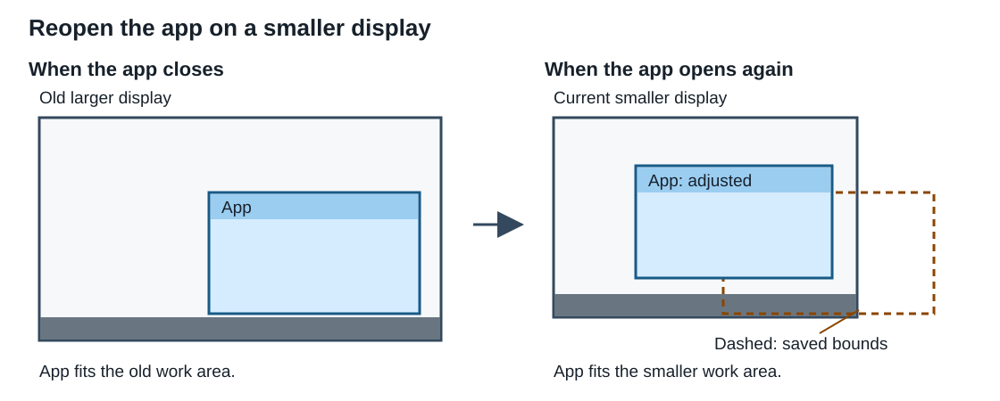

**API notes**

WinUI makes this adjustment during initial placement, whether it loads placement automatically
or your app supplies `WindowShowOptions.Placement`. It fits normal bounds to the selected
display's work area.

WinUI respects the window's current resizing and minimum-size constraints. A fixed-size
window or a minimum size larger than the work area can prevent a complete fit.

### 2.1.3. Keep a familiar position and size after display scaling changes

When display scaling changes, WinUI keeps the window in approximately the same position and
at the same apparent size from the user's point of view.

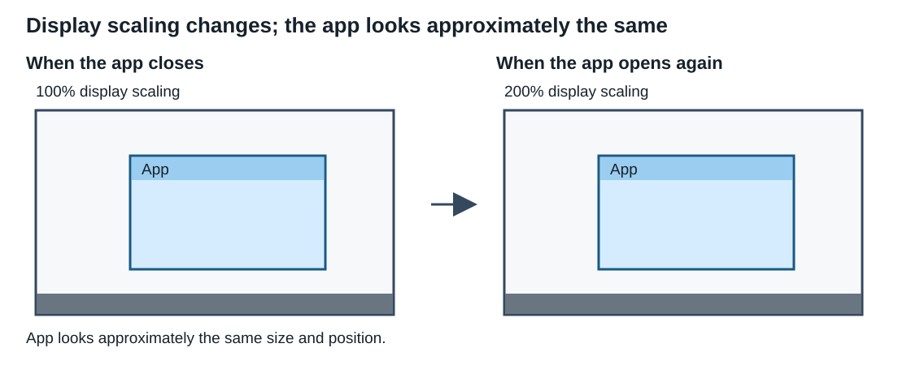

**API notes**

WinUI uses the saved DPI and work area to adjust placement during initial placement. It
adjusts the normal size to preserve approximately the same logical size.

For example, an 800 by 600 physical-pixel window at 96 DPI (100% scale) has a nominal target
size of 1600 by 1200 physical pixels at 192 DPI (200% scale). The image illustrates the user's
view, not a physical-pixel scale drawing.

WinUI adapts position to the target display's geometry and work area rather than simply
multiplying coordinates by the DPI ratio. Work-area limits, current size constraints, rounding,
and window-frame calculations can change the final bounds.

### 2.1.4. Avoid a taskbar whose position has changed

If the taskbar moves or changes size, WinUI adjusts the window so that the taskbar does not
cover it, when the window can fit.

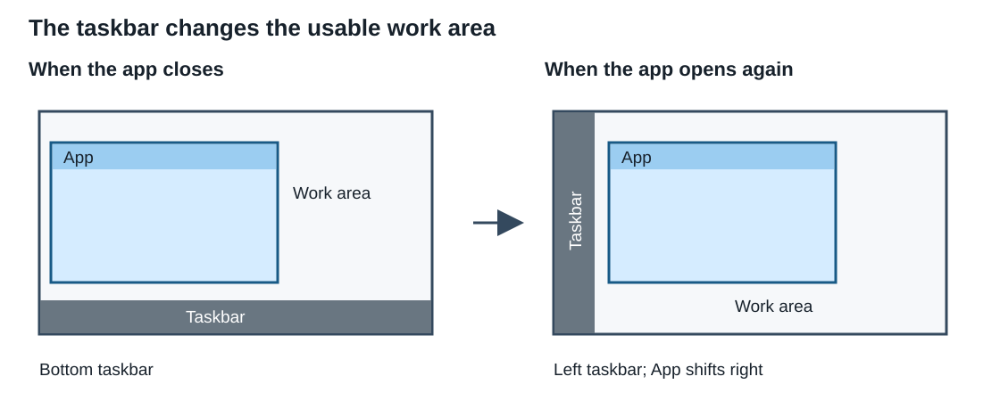

**API notes**

WinUI makes this adjustment during initial placement. It uses the current work area, which
excludes space that the taskbar and other reserved areas occupy. Your app does not need to
detect the taskbar change itself.

WinUI still respects the window's current size constraints, which can prevent a complete fit.

### 2.1.5. Keep a window on its display after monitors are rearranged

When you rearrange displays or change the primary display, WinUI tries to reopen your app
on the display it used before.

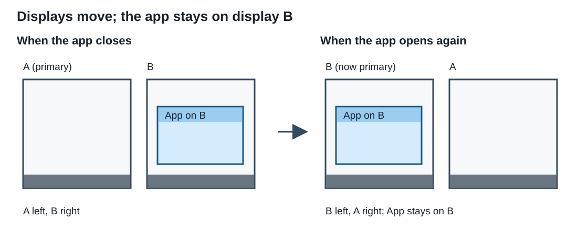

**API notes**

WinUI first tries to match the saved `DisplayDeviceName`. If it finds a match, it keeps the
window on that display and adapts placement to its current position, work area, and DPI.

The display device name does not permanently identify a physical device. WinUI cannot
guarantee a match. If it finds no match, it chooses an available display as the next section
describes.

### 2.1.6. Choose an available display when a monitor is removed

If you disconnect the display your app used before, WinUI reopens the window on an available
display and adjusts it to fit when possible.

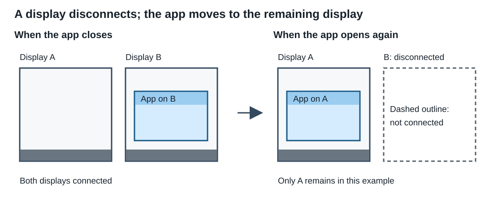

**API notes**

If WinUI cannot match the saved display, it chooses the connected display with the largest
intersection with the saved normal rectangle, or the nearest display if none intersects.
It does not always choose the primary display. WinUI then adjusts placement for that display's
work area and DPI.

When WinUI later saves the relocated window successfully, it replaces the previous record.
WinUI keeps one placement per identifier, not a history for each monitor layout. Reconnecting
a monitor does not move a running window back to its old position.

### 2.1.7. Cascade additional instances instead of stacking their title bars

When you open more copies of your app, WinUI can offset their windows so that their title
bars do not sit directly on top of one another.

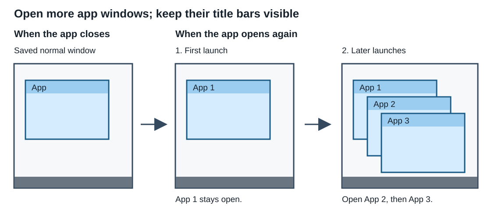

**API notes**

Use the same `PersistPlacementId` to group the windows. For apps with package identity,
windows in the group must also belong to the same application. WinUI can use an eligible
open window's placement instead of the saved record.

The default `WindowCascadeBehavior.Automatic` allows cascading when you enable automatic
persistence with a non-empty identifier and supply no explicit placement. The first reopened
window must stay open to serve as a source for later windows. Set `CascadeBehavior` to
`WindowCascadeBehavior.Disabled` to prevent the new window from cascading.

WinUI cannot guarantee non-overlap. Maximized or snapped windows can still overlap, and
simultaneous launches can select the same position.

### 2.1.8. Use the display from which the user launches the app

When you start a new app process from a display's taskbar, WinUI can open its window on that
display instead of the display it used before.

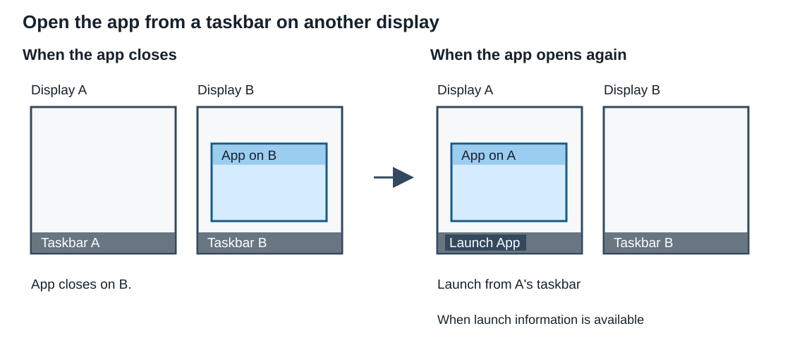

**API notes**

Set `Reason = WindowShowReason.Launch` on the initial `Show` request. WinUI then lets a valid
monitor hint from the Windows shell take precedence over the saved monitor.

If the shell supplies no valid hint, WinUI uses the same monitor selection as `Default`.
Calling `Activate()` or opening the first window does not select launch policy.

For process launches from the taskbar or a jump list, Windows supplies this monitor hint in
`STARTUPINFO.hStdOutput`, as described in the
[STARTUPINFO documentation](https://learn.microsoft.com/windows/win32/api/processthreadsapi/ns-processthreadsapi-startupinfow).

This hint describes the current process's original launch, not a later launch redirected to
that process. See [WindowShowReason](#413-windowshowreason-enum) for guidance on additional
windows.

### 2.1.9. Open minimized or maximized on request (deferred)

You can launch an app with a request to open minimized or maximized rather than reuse its
remembered state. This scenario shows the requested behavior; the proposal does not yet
specify how WinUI handles it.

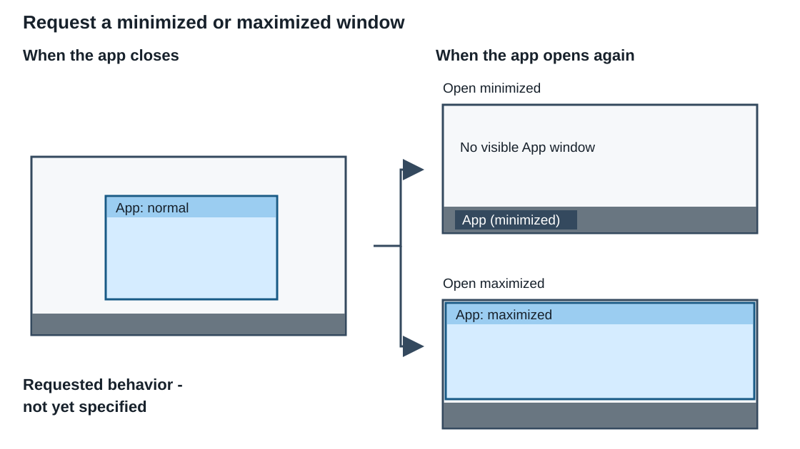

**API notes**

Windows startup information can carry requests such as `start /min` or `start /max`. Those
requests differ from the state in saved placement. The proposal does not define how launcher
commands merge with that state. `WindowShowReason.Launch` selects monitor policy, not
launcher-command handling.

_Spec note: We have deferred this scenario, not requested that WinUI suppress existing Windows
startup behavior. We still need to decide how that behavior interacts with saved placement
and non-activating display._

### 2.1.10. Reopen a snapped window after the available space changes

When you close a snapped window, WinUI tries to reopen it in the same snapped position.
If the available space changes, WinUI adjusts the window to that space.

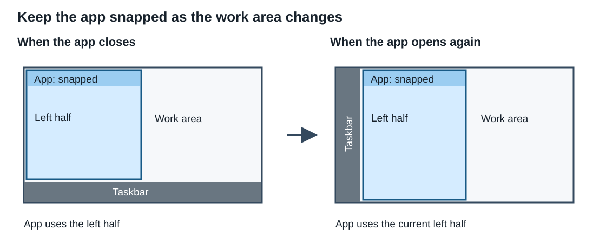

**API notes**

WinUI saves both `NormalRect` and `SnapRect`. It uses `SnapRect` for the visible snapped
frame and keeps `NormalRect` for restoring the window out of snap.

WinUI adjusts the snapped bounds relative to the current work-area edges, subject to system
snapping support and current window constraints. It restores only this window, not a snap
group or other apps' windows. If the target cannot accept the snapped placement, WinUI uses
normal placement.

### 2.1.11. Reopen a maximized window

When you close a maximized window, WinUI reopens it maximized. If you then restore the window,
WinUI uses its remembered normal size and position.

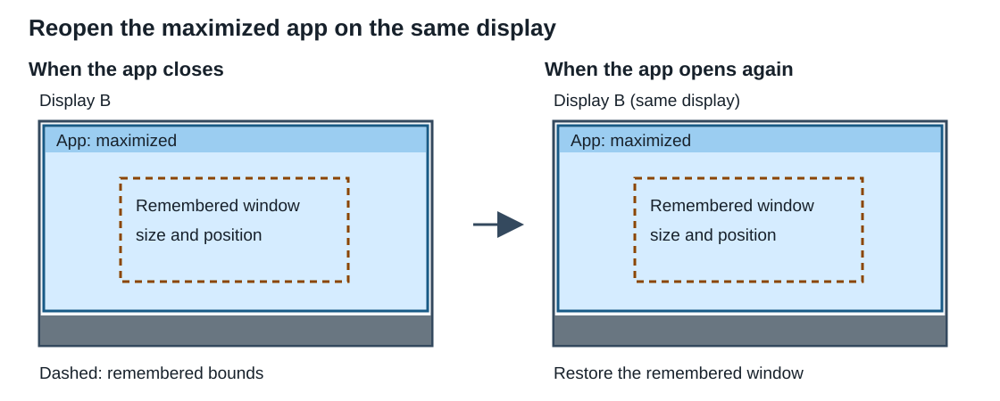

**API notes**

WinUI saves the maximized state and `NormalRect`, then adapts both to the current display
environment. It keeps the window on the saved display when it can match that display, unless
launch policy selects another one.

WinUI does not discard the normal rectangle when you maximize a window. It uses those bounds
when you restore the window from maximization.

### 2.1.12. Reopen after the app was in full-screen mode

WinUI remembers the windowed placement, not full-screen mode. Your app chooses whether to
enter full-screen again when it reopens.

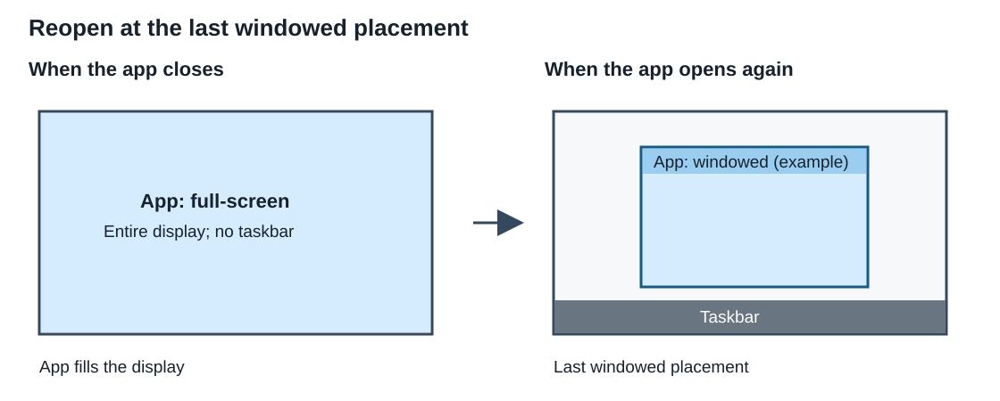

**API notes**

Your app selects full-screen or compact-overlay presenters explicitly. WinUI captures and
saves the most recent valid windowed placement, including its normal bounds and maximized
or snapped state. The image uses a window whose last windowed state was normal.

If no valid windowed placement exists, `TryGetPlacement` returns `false` and WinUI skips
automatic saving. If your app selects full-screen or compact-overlay before first display,
WinUI skips initial placement and keeps that presenter. Switching back afterward does not
run initial placement again.

### 2.1.13. Reopen in full-screen and return to a maximized window

You maximize a window on display B, enter full-screen, and close it. When you reopen your
app with the same display setup, you can reopen the window directly in full-screen on B,
without briefly showing a windowed frame.

When you leave full-screen, the window returns to maximized on B. If you then restore it
from maximization, the window goes back to its normal size and position.

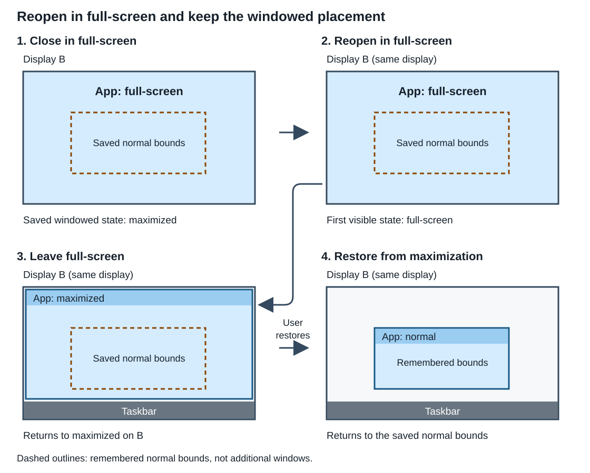

**API notes**

Your app decides whether to open the window in full-screen. WinUI does not automatically
open it in full-screen for you. To open in full-screen:

1. Before you first show the window, call `TryApplyInitialPlacement` while the window still
   uses its overlapped presenter.
2. Select the full-screen presenter.
3. Call `Show` with `SkipInitialPlacement = true`.

Preparing placement first preserves both the saved maximized state and its normal restore
bounds. Switching back to the overlapped presenter returns to that prepared windowed state.

### 2.1.14. Return to the previous virtual desktop after an app restart

When you launch your app normally, it opens on the desktop you currently use. When the app
restarts after an update or system restart, WinUI can return its windows to their previous
virtual desktops without switching you away from your current desktop.

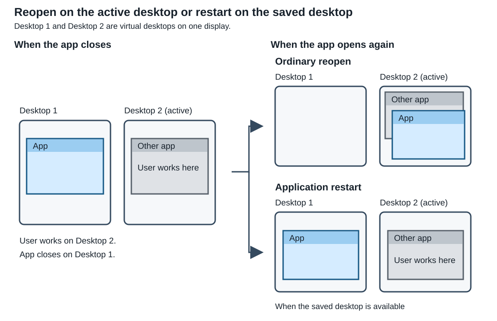

**API notes**

Use `Reason = WindowShowReason.ApplicationRestart` on each initial `Show` request when your
app reconstructs its windows. WinUI then attempts to restore each saved `VirtualDesktopId`.
`Default` and `Launch` ignore that identifier.

WinUI cannot guarantee virtual-desktop restoration. The identifier can be missing or out of
date. If the saved desktop no longer exists or the move fails, WinUI leaves the window on
its current desktop.

Your app detects restart launches and recreates its windows; WinUI does not do those tasks
automatically.

### 2.1.15. Preserve minimization only for an application restart

When you launch your app normally, WinUI restores a minimized window so you can see it.
When your app restarts after an update or system restart, WinUI can keep the window minimized.

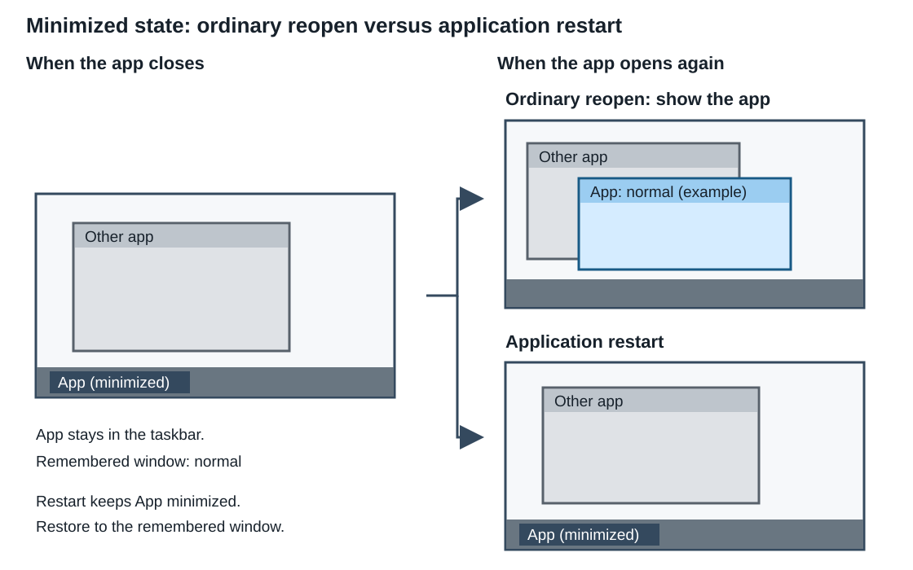

**API notes**

Use `Reason = WindowShowReason.ApplicationRestart` to preserve minimization and the recorded
restore target. With `Default` or `Launch`, WinUI instead uses that restore target: normal,
maximized, or snapped when supported.

The image uses a window minimized from normal. This policy concerns saved state, not explicit
launcher requests such as `start /min`.

### 2.1.16. Restart without taking focus

When your app restarts, WinUI can reopen its windows without taking focus from the app you
currently use.

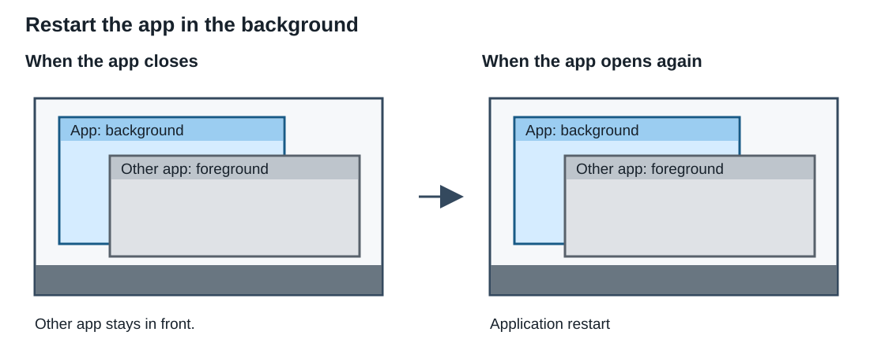

**API notes**

Use `Reason = WindowShowReason.ApplicationRestart` on the initial `Show` request. WinUI
suppresses activation regardless of `DoNotActivate` and disables cascading. Your app can
deliberately call `Activate()` afterward.

If you prepare restart placement while hidden with `TryApplyInitialPlacement`, the later
`Show` does not retain that request's reason. Set both `SkipInitialPlacement = true` and
`DoNotActivate = true` on that `Show` to keep the prepared placement without requesting
activation.

This policy prevents an activation request from the restart operation. It does not lock
foreground focus against other activation requests.

### 2.1.17. Reopen multiple windows at their own locations

An app such as a browser can have several independent windows, each with its own tabs or
documents. When you close and reopen the app, it can recreate those windows and restore
each one to its own size and position.

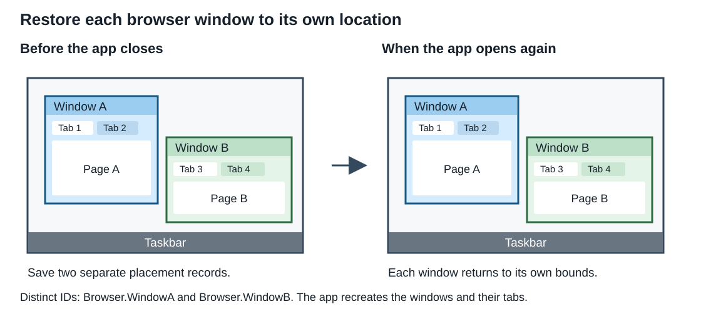

**API notes**

Give each window a stable, distinct `PersistPlacementId`, such as `Browser.WindowA` and
`Browser.WindowB`. Save those identifiers with your app's window inventory, then reuse them
when recreating the windows. Call `Window.Show` or `Window.Activate` for each window's first
display. With automatic persistence enabled, WinUI loads and saves their placements
independently.

The different identifiers also keep these two windows out of each other's cascade group.
This differs from [Section 2.1.7](#217-cascade-additional-instances-instead-of-stacking-their-title-bars),
where windows share an identifier and cascade from an open instance.

Your app stores the window inventory and restores the tabs or documents; WinUI does not
create the windows or save their content. See
[Section 3.3](#33-restore-windows-after-an-app-or-system-restart) for a window-inventory example.

### 2.1.18. Open a toolbar beside the main window

An app can restore its main window, then open a separate toolbar beside it without
requesting activation for the toolbar. If the main window's placement changes to fit the
available displays, the app can position the toolbar beside the adjusted main window
rather than restore the toolbar to an independent saved location.

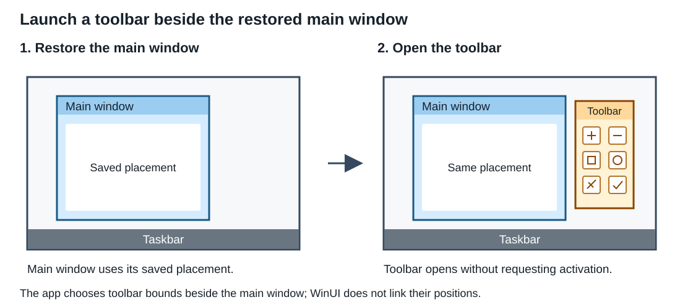

**API notes**

Show the main window first. Use its actual `AppWindow.Position` and `AppWindow.Size` to
choose toolbar bounds that fit the display's work area. Capture the display context with
`TryGetPlacement`, then construct a `WindowPlacement` with the toolbar bounds and the
captured `WorkArea` and `Dpi`.

For this app-managed layout, set the toolbar's `PreventAutomaticPlacementPersistence` to
`true`. Show it with the constructed placement, `CascadeBehavior = Disabled`, and
`DoNotActivate = true`. This prevents an independent saved placement or cascade offset from
replacing the app's chosen layout.

The diagram shows a normal main window. Your app decides where to place the toolbar if the
main window is maximized or snapped, or there is not enough space beside it. Placement
persistence does not establish window ownership, link the windows' lifetimes, or keep the
toolbar following the main window after launch.

## 2.2. Restore your app after an app or system restart

When your app restarts, you can restore its windows without treating the restart as a new
user launch. Your app handles the restart and recreates its session; you can configure WinUI
to restore each window's placement.

Keep your own record of which windows and documents to reopen, including each window's
`PersistPlacementId`. Detect restart launches and save your session data regularly. WinUI
remembers window placements, but does not store your window list or document contents.

Use `Reason = WindowShowReason.ApplicationRestart` on each recreated window's first `Show`
call. This policy preserves saved minimization, attempts virtual-desktop restoration, and
suppresses cascading and activation. It selects placement behavior; it does not register
your app for restart, start another process, or recover your documents.

See [Section 3.3](#33-restore-windows-after-an-app-or-system-restart) for the registration, relaunch, and
window-recreation examples.

# 3. Examples

The C# examples use the following namespaces:

```csharp
using System;
using System.Diagnostics;
using Microsoft.UI.Windowing;
using Microsoft.UI.Xaml;
using Windows.Graphics;
```

Each example is separate. `MainWindow` is your app's `Window` subclass; its constructor
creates an overlapped window without showing or activating it. Keep track of the windows
your app creates, and call the `Window` methods on their UI thread.

The automatic-storage examples require your app's default application data, as described
in [Section 2](#2-conceptual).

For a typical single-window app, start with the
[recommended new-project starter code](#32-recommended-new-project-starter-code).

## 3.1. Enable automatic placement persistence

Set a stable identifier before you first show the window. WinUI restores placement when
you show it and attempts to save placement when it closes.

```csharp
var window = new MainWindow();
window.PersistPlacementId = "Contoso.MyApp.MainWindow";
window.Show();
```

Use a different identifier for each window whose placement you want to remember
independently. This example uses `Default` placement policy, which ignores launch-monitor
hints. `Activate()` uses the same policy for initial placement. For startup with a
launch-monitor preference, use `Show` with `Reason = Launch`, as shown in
[Section 3.2](#32-recommended-new-project-starter-code).

## 3.2. Recommended new-project starter code

For a new single-window app, declare the window's stable identifier in `MainWindow.xaml`
and choose launch behavior in `App.xaml.cs`.

**MainWindow.xaml**

```xaml
<Window
    x:Class="MyApp.MainWindow"
    xmlns="http://schemas.microsoft.com/winfx/2006/xaml/presentation"
    xmlns:x="http://schemas.microsoft.com/winfx/2006/xaml"
    PersistPlacementId="MainWindow">
    <!-- Keep the window's existing content here. -->
</Window>
```

The existing `MainWindow` constructor applies the identifier when it calls
`InitializeComponent()`. `App.OnLaunched` then creates the window and calls `Show` with
`Reason = WindowShowReason.Launch`:

**App.xaml.cs**

```csharp
using Microsoft.UI.Xaml;

namespace MyApp;

public partial class App : Application
{
    private Window? _window;

    public App()
    {
        InitializeComponent();
    }

    protected override void OnLaunched(LaunchActivatedEventArgs args)
    {
        _window = new MainWindow();
        _window.Show(new WindowShowOptions
        {
            Reason = WindowShowReason.Launch,
        });
    }
}
```

The field retains the window. Keep the identifier stable across app sessions and versions.
This example chooses `Launch` to prefer a valid monitor hint from the process's original
launch. If you do not want that preference, use parameterless `Show()` or `Activate()`; both
use `Default` for initial placement and still enable automatic placement persistence.
Apps that support restart handling should instead select
`ApplicationRestart` for their restart path, as shown in
[Section 3.3](#33-restore-windows-after-an-app-or-system-restart).

**Changes from the current template**

The current template's `App.OnLaunched` creates a `MainWindow` and calls `_window.Activate()`.
The proposed template makes two changes:

| Current template | Proposed template |
|---|---|
| `MainWindow.xaml` does not declare a placement identifier. | Add `PersistPlacementId` to the `Window` root to enable automatic placement persistence. |
| `App.OnLaunched` calls `Activate()` for first display. | Call `Show` with `Reason = Launch` to apply placement and prefer a valid launch-monitor hint. |

Keep the existing window content, `_window` field, and constructors' `InitializeComponent()`
calls. With the default application data available, no app-managed placement storage or
window-close handler is needed.

On normal startup, `Show` still requests activation by default; do not follow it with
`Activate()`. This replacement is for first display. Keep `Activate()` when you need to
restore a minimized window or request activation of an existing window.

## 3.3. Restore windows after an app or system restart

This restart-only example uses [CsWin32](https://microsoft.github.io/CsWin32/docs/getting-started.html).
Add these helpers to your existing `App` class.

**App.xaml.cs (restart helpers)**

```csharp
// Add Microsoft.Windows.CsWin32 to the project and RegisterApplicationRestart
// to NativeMethods.txt. Allow unsafe blocks for the generated code.
using System;
using System.Collections.Generic;
using Microsoft.UI.Xaml;
using Windows.Win32;

namespace MyApp;

public partial class App : Application
{
    // This argument is app-defined, not a Windows or WinUI option.
    // For an updater-controlled restart: save session data, close windows normally
    // so WinUI can save placement, finish the update, and relaunch with this argument.
    // AppInstance.Restart is immediate: it neither installs updates nor runs normal
    // close/save. Save app data and placement first, and handle its failure result.
    private const string RestoreSessionArgument = "--restore-session";

    // Retain the recreated windows for this session.
    private readonly List<Window> _windows = new();

    // Call during startup to register for future system-update restarts.
    // An app/updater-controlled relaunch does not require this registration.
    private static void RegisterForSystemRestart()
    {
        PInvoke.RegisterApplicationRestart(RestoreSessionArgument, 0).ThrowOnFailure();
    }

    // Call from OnLaunched. A false result leaves your normal launch path unchanged.
    // A true result means this helper has handled the restart launch.
    private bool TryRestoreSessionAfterRestart()
    {
        // These are process-startup arguments. For redirected activations, inspect
        // the activation arguments in your existing handler instead.
        if (Array.IndexOf(Environment.GetCommandLineArgs(), RestoreSessionArgument) < 0)
        {
            return false;
        }

        foreach (var savedWindow in LoadSavedWindowInventory())
        {
            var window = new MainWindow
            {
                PersistPlacementId = savedWindow.PlacementId,
                Title = savedWindow.Title,
            };

            // Restore document contents or other app state here, before showing.
            _windows.Add(window);
            // Preserve minimization, attempt saved-desktop restoration, and suppress
            // cascading and activation. Do not follow with Activate unless you want
            // to restore a minimized window and request activation.
            window.Show(new WindowShowOptions
            {
                Reason = WindowShowReason.ApplicationRestart,
            });
        }

        return true;
    }

    private sealed record SavedWindow(string PlacementId, string Title);

    private static SavedWindow[] LoadSavedWindowInventory()
    {
        // Demo records only: load your app's saved window inventory instead.
        // Reuse the original placement IDs. Save the inventory and documents
        // regularly; WinUI stores placements, not the window list or content.
        return new[]
        {
            new SavedWindow("Contoso.MyApp.MainWindow", "MyApp"),
            new SavedWindow("Contoso.MyApp.NotesWindow", "MyApp - Notes"),
        };
    }
}
```

See [Windows restart registration](https://learn.microsoft.com/windows/win32/recovery/registering-for-application-restart)
and [`AppInstance.Restart`](https://learn.microsoft.com/windows/apps/windows-app-sdk/applifecycle/applifecycle-restart)
for their requirements.

## 3.4. Load and edit a saved placement

Use `LoadForPersistPlacementId` when you want to inspect or edit WinUI's saved placement
before showing a window. This example requests a normal, non-snapped window instead of
the saved state and disables cascading for this operation.

```csharp
var window = new MainWindow();
window.PersistPlacementId = "Contoso.MyApp.MainWindow";

var placement = WindowPlacement.LoadForPersistPlacementId(window.PersistPlacementId);
var options = new WindowShowOptions
{
    CascadeBehavior = WindowCascadeBehavior.Disabled,
};

if (placement is not null)
{
    placement.State = WindowPlacementState.Normal;
    placement.SnapRect = null;
    options.Placement = placement;
}

window.Show(options);
```

Editing the loaded object does not change the saved record. Supplying it through
`Placement` replaces automatic source selection for this operation; it does not disable
future automatic saving.

If loading returns null, the example leaves `Placement` unset and uses ordinary placement
selection. Other loading failures propagate as exceptions; handle them through your app's
error-reporting code rather than treating them as a missing record.

## 3.5. Store placement yourself

If you use your own storage, set `PreventAutomaticPlacementPersistence = true` before
you first show the window. Capture all placement fields, including the saved display
environment, rather than saving only the window rectangle.

This example uses an app-defined record to keep those fields together:

```csharp
// PlacementRecord is an example app data type, not a Windows or WinUI type.
public sealed record PlacementRecord(
    RectInt32 NormalRect,
    RectInt32 WorkArea,
    int Dpi,
    WindowPlacementState State,
    RectInt32? SnapRect,
    string DisplayDeviceName,
    Guid? VirtualDesktopId);
```

Given an open `window`, capture placement from your app's session-save code before you
close it:

```csharp
if (window.TryGetPlacement(out var placement))
{
    var record = new PlacementRecord(
        placement.NormalRect,
        placement.WorkArea,
        placement.Dpi,
        placement.State,
        placement.SnapRect,
        placement.DisplayDeviceName,
        placement.VirtualDesktopId);

    // SavePlacementRecord is an example app function, not a Windows or WinUI API.
    SavePlacementRecord(documentId, record);
}
else
{
    Trace.TraceWarning("No windowed placement is available to save.");
}
```

`documentId` is your app's stable document identifier. `SavePlacementRecord` serializes
the record in your own store. If capture is unavailable, this example reports it and leaves
any previous record unchanged.

When you recreate the window, load your record and construct a `WindowPlacement`:

```csharp
var window = new MainWindow();
window.PersistPlacementId = $"Contoso.MyApp.Document.{documentId}";
window.PreventAutomaticPlacementPersistence = true;

// LoadPlacementRecord is an example app function, not a Windows or WinUI API.
var record = LoadPlacementRecord(documentId);
var options = new WindowShowOptions
{
    CascadeBehavior = WindowCascadeBehavior.Disabled,
};

if (record is not null)
{
    options.Placement = new WindowPlacement(record.NormalRect, record.WorkArea, record.Dpi)
    {
        State = record.State,
        SnapRect = record.SnapRect,
        DisplayDeviceName = record.DisplayDeviceName,
        VirtualDesktopId = record.VirtualDesktopId,
    };
}

window.Show(options);
```

`LoadPlacementRecord` returns a `PlacementRecord`, or null if no record exists. Your storage
functions should report storage or data errors through your app's error-handling code.
Without a record, the example shows the new window without restoring a placement.

Keep the saved rectangles, work area, and DPI unchanged when loading. They describe the
display environment at capture, not the current environment; WinUI adjusts placement
when you apply it. Preserve `SnapRect` for `Snapped` and `MinimizedFromSnapped` states.
For a restart, set `Reason = WindowShowReason.ApplicationRestart` on the options, as in
[Section 3.3](#33-restore-windows-after-an-app-or-system-restart), to preserve saved minimization and
attempt virtual-desktop restoration.

## 3.6. Cascade windows without automatic storage

You can use an identifier to group related windows even when you do not want WinUI to
load or save their placement. `Enabled` allows cascading independently of automatic
persistence.

```csharp
var window = new MainWindow();
window.PersistPlacementId = "Contoso.MyApp.ToolWindow";
window.PreventAutomaticPlacementPersistence = true;
window.Show(new WindowShowOptions
{
    CascadeBehavior = WindowCascadeBehavior.Enabled,
});
```

If an eligible window in the same group is open, WinUI can use its placement and offset
the new window. Otherwise, this example shows the window without restoring a placement.
The ordinary automatic-persistence example uses `WindowCascadeBehavior.Automatic` by
default.

## 3.7. Prepare placement before opening in full-screen

Apply the saved windowed placement while the window is still hidden and uses its
overlapped presenter. Then select full-screen and skip a second initial-placement
operation when you reveal it.

```csharp
var window = new MainWindow();
window.PersistPlacementId = "Contoso.MyApp.MainWindow";

bool applied = window.TryApplyInitialPlacement(new WindowShowOptions
{
    CascadeBehavior = WindowCascadeBehavior.Disabled,
});
if (!applied)
{
    Trace.TraceWarning("Initial placement was not fully applied; using the resulting placement.");
}

window.AppWindow.SetPresenter(AppWindowPresenterKind.FullScreen);
window.Show(new WindowShowOptions
{
    SkipInitialPlacement = true,
});
```

This example still opens in full-screen if hidden preparation returns `false`. It accepts
the resulting placement, including any partial changes. `TryApplyInitialPlacement` does
not show or activate the window, and does not enroll it for automatic saving; the first
`Show` establishes that eligibility.

When your app decides to leave full-screen, switch back to the overlapped presenter:

```csharp
window.AppWindow.SetPresenter(AppWindowPresenterKind.Overlapped);
```

If preparation succeeded, the window returns to its prepared windowed state, which can be
maximized rather than normal. See
[Section 2.1.13](#2113-reopen-in-full-screen-and-return-to-a-maximized-window)
for the maximized-return scenario.

## 3.8. Hide and reveal a window without requesting activation

Given an open `window`, hide it without closing it:

```csharp
window.Hide();
```

When you want to reveal it without requesting activation, call:

```csharp
window.Show(new WindowShowOptions
{
    DoNotActivate = true,
});
```

The window keeps its current placement. Hiding does not save placement or make the next
`Show` an initial-placement operation. If the window is minimized, `Show` leaves it
minimized; use `Activate()` when you want to restore it and request activation.

## 3.9. Choose an initial fallback size

Set an initial size before you first show the window. WinUI uses that size if no explicit,
related-window, or saved placement is selected. A selected placement takes precedence.

```csharp
var window = new MainWindow();
window.AppWindow.Resize(new SizeInt32(800, 600));
window.PersistPlacementId = "Contoso.MyApp.MainWindow";
window.Show();
```

`AppWindow.Resize` uses outer-window dimensions in physical pixels. These example values
are not a DPI-independent size. If your app chooses a logical default size, convert it to
physical pixels using the window's DPI before calling `Resize`.

The separate, experimental `Window.Width` and `Window.Height` properties, when available,
set restored client size in DIPs. They are not additions in this proposal. Values assigned
before first display also supply the fallback size.

The initial size is a fallback, not a minimum or maximum. WinUI still respects the current
window's size constraints when adapting a selected placement.

Sizing calls after first display follow their normal behavior. WinUI does not continuously
reapply the selected placement.

# 4. API Pages

Call the `Window` members on the UI thread that owns the window, before it closes. Calls on
the wrong thread or after close report the corresponding `Window` API error. Methods whose
names begin with `Try` can still report these programming errors.

You can use `WindowPlacement` and `WindowShowOptions` from any thread. Individual property
access is thread-safe, but a series of assignments is not a single transaction. Finish related
edits before passing either object to a method. Each operation takes a consistent snapshot of
each object; later edits do not change that operation. The options object and its referenced
placement are snapshotted separately, not as one combined transaction.

`Show(options)` and `TryApplyInitialPlacement(options)` require non-null options, including
after first display and during nested calls. A null argument reports `E_INVALIDARG` before
thread, closed-window, or window-type checks. In .NET, `E_INVALIDARG` becomes
`ArgumentException`. Other reported errors retain their HRESULT, the error code exposed by
Windows Runtime APIs.

## 4.1. Window.PersistPlacementId property

Gets or sets the identifier used to save this window's placement and group it with related windows.

The default is an empty string. Assigning null is equivalent to assigning an empty string.
An empty identifier disables automatic placement persistence and cascade grouping for this
window.

To enable automatic persistence, set a non-empty identifier before first display through
`Window.Show` or `Window.Activate` and leave `PreventAutomaticPlacementPersistence` at its default
value of `false`. Leaving only the Boolean at `false` does not enable persistence.

Identifiers are case-sensitive and are not normalized for Unicode. Use a stable identifier
across app sessions. Windows that use the same identifier within the same application's store
share one saved placement record; the last successful save replaces the previous record.

The identifier also defines a **cascade group**. Cascading offsets a new window from an eligible
open window in the group so that their title bars are not directly on top of each other.
For apps with package identity, grouped windows must belong to the same application, but can
be in different processes. Unrelated apps without package identity that use the same identifier
can join the same group, so use an app-specific identifier if your app has no package identity.

Use different identifiers for windows whose placements you want to remember independently.
There are no separate identifiers for storage and cascading.

Setting this property does not move the window, read or write saved data, or change
`PreventAutomaticPlacementPersistence`. You can set the two properties in either order.

## 4.2. Window.PreventAutomaticPlacementPersistence property

Gets or sets whether to prevent automatic loading and saving of this window's placement.

The default is `false`. Setting this property to `true` prevents automatic loading and saving,
but leaves the identifier available for cascading.

Leaving this property at `false` does not enable automatic persistence by itself. You must
also set a non-empty `PersistPlacementId`, which defaults to an empty string.

Setting this property does not move the window, read or write saved data, or change
`PersistPlacementId`.

Automatic storage uses `Microsoft.Windows.Storage.ApplicationData.GetDefault()` to obtain
your app's default application data. For apps with package identity, Windows provides that
default. This includes apps that use a package with external location; full MSIX packaging
is not required. Apps in the same package have separate placement stores.

For apps without package identity, this proposal depends on the planned Windows App SDK API
`ApplicationData.SetDefaultForUnpackaged` to configure default application data before
placement loading or saving. If automatic storage is unavailable, you can capture and
supply placement, but must provide your own storage to persist it.

Saved placement is local to the current user and computer; it is not synchronized between
devices.

### 4.2.1. Automatic saving

To enable automatic saving, set a non-empty `PersistPlacementId` and leave
`PreventAutomaticPlacementPersistence` set to `false` before the window's first display through
`Window.Show` or `Window.Activate`. That first display establishes the window's eligibility
for future automatic saves. It does not save placement immediately.

If those properties are not configured at first display, changing them afterward does not
enable automatic saving for that window. Showing a window first through `AppWindow` or a
native Windows API also bypasses this setup; a later `Window.Show` or `Window.Activate` does
not enable automatic saving.

For a window that became eligible at first display, setting this property to `true` or
clearing the identifier suspends future saves. Setting the Boolean back to `false` and
providing a non-empty identifier resumes saving under the current identifier.

WinUI attempts to save placement after the `Window.Closed` event has been raised and all
handlers have returned, if the close has not been canceled (`WindowEventArgs.Handled` is
`false`). The save occurs before window teardown and uses the placement and persistence
settings at that time, including changes made by the handlers. WinUI does not wait for
asynchronous work started by a handler. A canceled close does not save.

WinUI also attempts to save during window destruction and confirmed Windows session shutdown.
Moving, resizing, hiding, and capturing the window do not save placement. A window that has
never been displayed does not save; a previously displayed window can still save after it
has been hidden.

Saved placement is a cache, not permanent application data. These APIs do not report whether
an automatic save succeeded. Do not rely on saving during a crash or forced termination.

## 4.3. Window.TryGetPlacement method

Captures the window's placement in an independent, editable `WindowPlacement` object.

```csharp
public bool TryGetPlacement(out WindowPlacement placement);
```

Returns `true` and sets `placement` to a valid object when capture succeeds. Returns `false`
and sets `placement` to null when capture is unavailable.

For a standard desktop window, capture uses its current geometry and last meaningful placement
state, including while the window is hidden. In full-screen or compact-overlay mode, capture
uses the last complete, valid standard-window snapshot. If no such snapshot exists, the method
returns `false`.

The captured placement does not record full-screen mode, compact-overlay mode, visibility,
or activation. Editing it does not change the window.

Capture does not read or write saved placement, move the window, or enable automatic saving.

## 4.4. Window.TryApplyInitialPlacement method

Applies placement before the window's first display, without showing or activating the window.

```csharp
public bool TryApplyInitialPlacement(WindowShowOptions options);
```

Pass a non-null `WindowShowOptions`. The method uses the same placement selection and reason
policy as an initial `Show(options)` call, but leaves the window hidden and never requests
activation. You can call it more than once before first display. It does not enable automatic
saving or complete the initial-placement phase.

Returns `true` only if an explicit placement, a related window's placement, or saved placement
was selected and successfully applied. Returns `false` in these cases:

| Condition | Result |
|---|---|
| The window has already been displayed. | No initial placement is applied. |
| A placement operation is already running for this window. | The nested request is ignored. |
| No usable placement source is available. | Adjusting fallback geometry alone does not count as success. |
| The window's display mode does not support placement. | No successful placement is reported. |
| Applying the selected placement fails. | Partial placement changes can remain. |

Application is not all-or-nothing. If it fails after making changes, the method does not undo
those changes. The window remains hidden.

A later first `Show()` or `Activate()` runs placement selection again and can replace the
prepared placement. To reveal the resulting placement without selecting it again, pass
`SkipInitialPlacement = true` to `Show`. `Activate()` has no skip option.

For example, given a new `Window` named `window`, this code accepts the resulting placement
even if the hidden attempt returns `false`, then reveals it without requesting activation:

```csharp
window.PersistPlacementId = "MainWindow";
bool applied = window.TryApplyInitialPlacement(new WindowShowOptions());
window.Show(new WindowShowOptions
{
    SkipInitialPlacement = true,
    DoNotActivate = true,
});
```

See the [full-screen scenario](#2113-reopen-in-full-screen-and-return-to-a-maximized-window)
for preparing windowed placement before selecting the full-screen presenter.

## 4.5. Window.Show methods

Shows the window, applying initial placement options if the window has not been displayed before.

```csharp
public void Show();
public void Show(WindowShowOptions options);
```

`Show()` uses default options, including `Reason = WindowShowReason.Default`, which ignores
launch-monitor hints. `Show(options)` requires a non-null `WindowShowOptions`.

### 4.5.1. Before first display

Unless `SkipInitialPlacement` is `true`, WinUI selects placement in this order:

1. Use `options.Placement` if it is non-null.
2. Otherwise, use an eligible open window in the same cascade group if cascading is allowed.
3. Otherwise, load saved placement if `PreventAutomaticPlacementPersistence` is `false` and
   `PersistPlacementId` is non-empty.
4. If no usable source is available, use default Windows placement, with any size or
   position changes your app makes before first display.

To change fallback bounds, use `AppWindow.Resize` or `AppWindow.Move`, or set `Window.Width`
and `Window.Height` when available. Selected placement takes precedence over the fallback
size. See [Section 3.9](#39-choose-an-initial-fallback-size) for sizing units and constraints.

WinUI adjusts the selected or fallback placement for current displays and window constraints.
[Reason](#413-windowshowreason-enum) controls launch and restart policy;
[CascadeBehavior](#414-windowcascadebehavior-enum) controls position offsets, including
cascading with explicit placement.

`SkipInitialPlacement = true` shows the window at its current placement without selecting or
adjusting initial placement.

If application fails, WinUI still attempts to show the window under the activation rules
below, without selecting another placement source. First display ends the initial-placement
phase regardless of success; hiding does not reopen it.

Supplying or skipping placement does not disable automatic saving. See
[Section 4.2](#42-windowpreventautomaticplacementpersistence-property) for save eligibility.

### 4.5.2. After first display

Only `DoNotActivate` is read. `Placement`, `Reason`, `CascadeBehavior`, and
`SkipInitialPlacement` are ignored, including invalid values in those fields.

| Current visibility | Behavior |
|---|---|
| Visible, including while minimized | No effect. |
| Hidden | Shows the current placement, including minimization. Requests activation only if the window is not minimized and `DoNotActivate` is `false`. |

Use `Activate()` to restore a minimized window and request activation.

### 4.5.3. Activation and nested calls

`DoNotActivate = true` prevents the call from requesting activation. On first display,
`Reason = ApplicationRestart` also prevents activation, regardless of `DoNotActivate`.
An activation request does not guarantee that Windows will give the window foreground focus.

On first display, `Activate()` selects placement when automatic persistence is enabled,
using `Reason = Default`, `CascadeBehavior = Automatic`, and no explicit placement.

During initial placement, nested `Show`, `Activate`, and `Hide` calls are ignored after
API-use checks; nested `TryApplyInitialPlacement` returns `false`. Closing the window stops
further placement and display work.

`Show` does not report placement or automatic-save success. Otherwise valid calls on
non-desktop or framework dummy windows report `E_NOTIMPL` without display, placement,
persistence, or audio side effects.

## 4.6. Window.Hide method

Hides the window without closing it or saving its placement.

```csharp
public void Hide();
```

The window and its XAML content remain alive. Hiding does not make the window eligible for
initial placement again. If the window is already hidden, the method has no effect.

Use `Show` to reveal the window with its current placement. Use `Activate` to restore it if
minimized and request activation.

Calls made during an initial placement operation are ignored after the required API-use
checks. Otherwise valid calls on non-desktop or framework dummy windows report `E_NOTIMPL`
without display, placement, persistence, or audio side effects.

## 4.7. WindowPlacement class

Represents an editable copy of a window's placement and saved display environment.

The object is independent of any live window or saved record. Editing it does not move a
window or write saved data. To use the edited placement, assign it to
`WindowShowOptions.Placement` and pass the options to an initial placement operation.

Rectangles use physical pixels in the coordinate space spanning all displays. For example,
a display to the left of the primary display can have negative coordinates. These coordinates
are not XAML logical units, client-area bounds, or Win32 workspace coordinates.

`NormalRect` describes the outer window bounds, including the title bar and borders.
`SnapRect` describes the snapped visible frame, excluding invisible resize borders.
`WorkArea` is the saved display's usable rectangle, excluding areas reserved for items such
as the taskbar. `Dpi` records the saved display scale in dots per inch.

Keep the rectangles, work area, and DPI together when storing or constructing placement.
WinUI uses the saved display environment to adjust placement for current displays; restoration
does not guarantee the same physical pixels on a different display.

## 4.8. WindowPlacement constructor

Initializes placement from normal window bounds, a display work area, and DPI.

```csharp
public WindowPlacement(
    Windows.Graphics.RectInt32 normalRect,
    Windows.Graphics.RectInt32 workArea,
    int dpi);
```

The constructor sets these properties:

| Property | Initial value |
|---|---|
| `NormalRect` | `normalRect` |
| `WorkArea` | `workArea` |
| `Dpi` | `dpi` |
| `State` | `WindowPlacementState.Normal` |
| `SnapRect` | null |
| `DisplayDeviceName` | Empty string |
| `VirtualDesktopId` | null |

The constructor validates the required geometry and DPI without inspecting currently
connected displays or moving a window. Invalid arguments report `E_INVALIDARG`.

### 4.8.1. Placement validity

Property setters allow temporarily invalid combinations while you edit an object. An eligible
initial placement request validates a complete snapshot before making changes:

| Data | Requirement |
|---|---|
| `NormalRect` and `WorkArea` | Positive width and height. `NormalRect` must have a positive-area intersection with the saved `WorkArea`. |
| `SnapRect`, when present | Positive width and height, even if `State` does not use snapping. |
| Every rectangle | Its right and bottom edges, computed from position and size, must fit in signed 32-bit coordinates. |
| `Dpi` | At least 96. |
| `State` | A defined `WindowPlacementState` value. `Snapped` and `MinimizedFromSnapped` require a non-null `SnapRect`. |
| `DisplayDeviceName` | Empty, or at most 31 UTF-16 code units with no embedded NUL character. |

These checks validate saved data, not whether the saved display or virtual desktop still
exists. In particular, `NormalRect` must intersect the saved work area, not a currently
connected display.

`SnapRect` is not used when applying other states, but a supplied rectangle must still be
valid. Setting `State` to `Normal` requests a normal, non-minimized window without snapping.

## 4.9. WindowPlacement.LoadForPersistPlacementId method

Loads saved placement for the specified identifier without creating or changing a window.

This synchronous method can run on any thread. It returns an independent `WindowPlacement`
object containing the saved data, without adjusting it for current displays.

The method uses the calling application's placement store. It does not select a related
window, apply placement, write saved data, or enable automatic saving.

Null and empty identifiers report `E_INVALIDARG`. This differs from
`Window.PersistPlacementId`, where an empty identifier is valid and disables persistence.

Returns null in these cases:

| Condition |
|---|
| Automatic storage is unavailable or inaccessible. |
| No saved record exists for the identifier. |
| Saved data is invalid or uses an unsupported version. |

Other failures are reported with their original HRESULT. For example, allocation failure
reports `E_OUTOFMEMORY` rather than returning null. .NET and C++/WinRT expose these failures
as exceptions.

Automatic restoration handles storage failures without requiring you to catch them. When
you call this method directly, handle both its null result and its possible exceptions.

Editing the returned placement changes neither a live window nor the saved record.
To use the edited placement, supply it in `WindowShowOptions.Placement`.

## 4.10. Other WindowPlacement members

All of these properties are editable.

| Member | Description |
|---|---|
| `NormalRect` | Outer window bounds for the normal, non-snapped state, in physical pixels. |
| `WorkArea` | Saved display's usable rectangle associated with the saved window geometry, in physical pixels. |
| `Dpi` | Saved display scale, in dots per inch. |
| `State` | Placement and minimization state, including the state to use when restored from minimization. |
| `SnapRect` | Optional snapped visible-frame bounds, in physical pixels, excluding invisible resize borders. |
| `DisplayDeviceName` | Optional GDI display name. It is not a permanent physical-device identifier. |
| `VirtualDesktopId` | Optional identifier for a Windows virtual desktop. |

Null `DisplayDeviceName` is treated as an empty string. `VirtualDesktopId` can be null;
`Guid.Empty` is treated as no virtual-desktop identifier when placement is accepted.

Property setters allow temporarily invalid combinations. The operation that uses the
placement validates the complete value.

## 4.11. WindowShowOptions class

Specifies placement and display choices for one window operation.

Create an options object with its parameterless constructor, then set the properties you
need. The window does not retain the options for later calls.

| Member | Default | Description |
|---|---|---|
| `Placement` | null | Placement supplied by your app instead of automatic source selection. |
| `Reason` | `WindowShowReason.Default` | Policy for ordinary display, launch, or application restart. |
| `CascadeBehavior` | `WindowCascadeBehavior.Automatic` | Whether initial placement can cascade from a related window. |
| `DoNotActivate` | `false` | Prevents this `Show` call from requesting activation when `true`. |
| `SkipInitialPlacement` | `false` | Shows the window at its current placement without selecting or applying initial placement when `true`. |

Null `Placement` means no explicit placement was supplied. It does not disable automatic
restoration. To disable automatic loading and saving, set
`Window.PreventAutomaticPlacementPersistence` to `true`.

`Placement` retains a reference to the assigned object, not a copy of its fields. An operation
snapshots the placement when it uses the options and does not modify either supplied object.

`SkipInitialPlacement` applies only to the first `Show`. It does not disable future automatic
saves. For an eligible initial request, either of these combinations reports `E_INVALIDARG`:

| Invalid combination | Why |
|---|---|
| `SkipInitialPlacement = true` and non-null `Placement` | The request cannot both skip placement and supply placement. |
| `SkipInitialPlacement = true` passed to `TryApplyInitialPlacement` | The hidden operation exists to apply placement, not display the window. |

Invalid placement and undefined `Reason` or `CascadeBehavior` values also report `E_INVALIDARG`
before side effects. Property setters do not validate the enum values. Eligible initial
requests validate them even if the selected policy suppresses the corresponding action.

After first display, `Show(options)` reads only `DoNotActivate`. A late
`TryApplyInitialPlacement` returns `false`. Nested display and placement calls are ignored
as described above. In each case, ignored option fields are not validated, but null options,
wrong-thread calls, and calls after close still report errors.

## 4.12. WindowPlacementState enum

Specifies a window's placement and minimization state, including the state to use when restored.

Each value combines normal, maximized, or snapped placement with whether the window is
minimized. Choose one value. This is not a flags enum; do not combine its values.

| Value | Numeric value | Minimized? | Placement when not minimized |
|---|---|---|---|
| `Normal` | 0 | No | Normal |
| `Maximized` | 1 | No | Maximized |
| `Minimized` | 2 | Yes | Normal |
| `Snapped` | 3 | No | Snapped to `SnapRect` |
| `MinimizedFromMaximized` | 4 | Yes | Maximized |
| `MinimizedFromSnapped` | 5 | Yes | Snapped to `SnapRect` |

`Snapped` and `MinimizedFromSnapped` require a non-null `SnapRect`.
For a placement you construct or edit, the value specifies the requested state and restore
target. It does not describe a sequence of states that the window must have passed through.
The request's `Reason` can change how minimization is applied, and current system capabilities
can require snapped placement to fall back to normal placement.

Visibility, activation, full-screen mode, and compact-overlay mode are not represented by
this enum. Control visibility and activation through display operations and their options.
Select full-screen or compact-overlay mode separately.

## 4.13. WindowShowReason enum

Specifies how an initial placement operation treats placement state and launch information.

For minimized placement, the **restore target** is its recorded normal, maximized, or snapped
state.

| Value | Numeric value | Initial placement policy |
|---|---|---|
| `Default` | 0 | Uses the restore target rather than preserving minimization. |
| `Launch` | 1 | Uses the restore target and prefers a valid monitor hint from the process's original launch. |
| `ApplicationRestart` | 2 | Preserves minimization and attempts virtual-desktop restoration. |

`Default` and `Launch` ignore the saved virtual-desktop identifier. Both use the configured
`CascadeBehavior` and `DoNotActivate` settings. `Default` ignores launch-monitor hints.

`Launch` opts in to the Windows shell's monitor hint for the current process's original
launch. Redirected activations and later window creation do not update that hint. Use
`Default` for additional windows unless they should use the original launch hint.

If no valid hint is available, `Launch` uses the same monitor selection as `Default`.
Parameterless `Show()` and initial placement through `Activate()` use `Default`, so they
ignore launch-monitor hints. WinUI does not infer `Launch` from window creation order; set
the reason explicitly when you want launch policy.

`ApplicationRestart` attempts to return a window to its saved virtual desktop without
switching the user's active desktop. If the desktop no longer exists or the move fails,
the window stays on its current desktop. The reason does not register your app for restart
or recreate its windows; your app handles those tasks.

`ApplicationRestart` ignores launch-monitor hints and suppresses cascading and activation,
regardless of `CascadeBehavior` and `DoNotActivate`. Minimized windows retain their recorded
restore target.

These policies apply during initial placement, not later `Show` calls. When initial placement
is skipped, only the reason's activation restriction applies. A hidden preparation call
does not carry its reason into a later reveal. To reveal without requesting activation,
set `DoNotActivate = true` on that `Show` call.

The restart reason does not impose a lifetime activation restriction. You can call
`Activate()` afterward to restore a minimized window and request activation.

## 4.14. WindowCascadeBehavior enum

Controls whether WinUI uses an existing window in the same cascade group to position a
new window. Cascading offsets the new window's normal bounds down and to the right, with
adjustments for the display's work area.

| Value | Numeric value | Behavior |
|---|---|---|
| `Automatic` | 0 | Allows cascading under the automatic-persistence conditions below. |
| `Enabled` | 1 | Allows cascading even without automatic persistence or with explicit placement. |
| `Disabled` | 2 | Prevents this operation from cascading. |

`Automatic` allows cascading when `PreventAutomaticPlacementPersistence` is `false`,
`PersistPlacementId` is non-empty, and no explicit placement is supplied. Automatic storage
does not have to be available.

Cascading always requires a non-empty `PersistPlacementId` and an eligible related window
in the same group.

A **cascade group** consists of windows with the same non-empty `PersistPlacementId`.
For apps with package identity, grouped windows must also belong to the same application,
but can be in different processes. Unrelated apps without package identity that use the same
identifier can join the same group, so use an app-specific identifier if your app has no
package identity.

When cascading is allowed and no explicit placement is supplied, WinUI uses an eligible
window's current placement instead of the saved record, including its size and placement
state. If several windows qualify, WinUI selects the topmost eligible window in Z order.
WinUI then applies the cascade offset and the request's initial placement policy.

WinUI selects and captures the source during initial placement through `Show` or
`TryApplyInitialPlacement`. If the user has moved or resized the source window, the new
window uses that updated placement, not the source's original position or last saved record.
Moving or resizing the source afterward does not automatically move or resize the new window.
A first `Show` after hidden preparation selects placement again unless
`SkipInitialPlacement` is `true`.

With `Enabled` and explicit placement, cascading changes only the position, using a related
window on the selected monitor. It does not replace the supplied placement.

`Disabled` prevents the current operation from cascading, but does not prevent this window
from serving as a placement source for another window.

`Reason = ApplicationRestart` and `SkipInitialPlacement = true` suppress cascading even when
`CascadeBehavior` is `Enabled`.

# 5. API Details

_Spec note: This proposal uses contract version 12 for review. The version may change before
shipping._

```cs (but really midl)
namespace Microsoft.UI.Xaml
{
    [contract(Microsoft.UI.Xaml.WinUIContract, 12)]
    [webhosthidden]
    enum WindowPlacementState
    {
        Normal = 0,
        Maximized = 1,
        Minimized = 2,
        Snapped = 3,
        MinimizedFromMaximized = 4,
        MinimizedFromSnapped = 5,
    };

    [contract(Microsoft.UI.Xaml.WinUIContract, 12)]
    [webhosthidden]
    enum WindowShowReason
    {
        Default = 0,
        Launch = 1,
        ApplicationRestart = 2,
    };

    [contract(Microsoft.UI.Xaml.WinUIContract, 12)]
    [webhosthidden]
    enum WindowCascadeBehavior
    {
        Automatic = 0,
        Enabled = 1,
        Disabled = 2,
    };

    // New runtimeclass.
    [contract(Microsoft.UI.Xaml.WinUIContract, 12)]
    [webhosthidden]
    [threading(both)]
    [marshaling_behavior(agile)]
    runtimeclass WindowPlacement
    {
        [method_name("CreateInstance")]
        WindowPlacement(
            Windows.Graphics.RectInt32 normalRect,
            Windows.Graphics.RectInt32 workArea,
            Int32 dpi);

        static WindowPlacement LoadForPersistPlacementId(String persistPlacementId);

        Windows.Graphics.RectInt32 NormalRect;
        Windows.Graphics.RectInt32 WorkArea;
        Int32 Dpi;
        WindowPlacementState State;
        Windows.Foundation.IReference<Windows.Graphics.RectInt32> SnapRect;
        String DisplayDeviceName;
        Windows.Foundation.IReference<Guid> VirtualDesktopId;
    };

    // New runtimeclass.
    [contract(Microsoft.UI.Xaml.WinUIContract, 12)]
    [webhosthidden]
    [threading(both)]
    [marshaling_behavior(agile)]
    runtimeclass WindowShowOptions
    {
        WindowShowOptions();

        WindowPlacement Placement;
        WindowShowReason Reason;
        WindowCascadeBehavior CascadeBehavior;
        Boolean DoNotActivate;
        Boolean SkipInitialPlacement;
    };

    // Existing runtimeclass.
    [contract(Microsoft.UI.Xaml.WinUIContract, 1)]
    [webhosthidden]
    unsealed runtimeclass Window
    {
        // Existing members are omitted.

        [contract(Microsoft.UI.Xaml.WinUIContract, 12)]
        {
            String PersistPlacementId;
            Boolean PreventAutomaticPlacementPersistence;

            Boolean TryGetPlacement(out WindowPlacement placement);
            Boolean TryApplyInitialPlacement(WindowShowOptions options);

            [method_name("Show"), default_overload]
            void Show();

            [method_name("ShowWithOptions")]
            void Show(WindowShowOptions options);

            void Hide();
        }
    };
}
```

# 6. Appendix

## 6.1. Default application data for apps without package identity

Automatic placement persistence for apps without package identity depends on the planned
Windows App SDK API `ApplicationData.SetDefaultForUnpackaged`. That API allows an app without
package identity to configure its default `ApplicationData`; WinUI must use that configured
default through `ApplicationData.GetDefault()` for placement storage.

Automatic storage without package identity requires both that API and WinUI integration with
the configured default. This spec records the dependency but does not define the API's
signature or shipping availability.


## 6.2. PlacementEx integration considerations

PlacementEx is intended to be a durable package that apps and frameworks can use independently
of WinUI. WinUI should consume its supported surface and reuse its placement engine. These are
the five main integration issues, in priority order.

### 6.2.1. Hidden and non-activating placement

Hidden preparation must not show the window or request activation, including during
application. Any backend used must meet the contract in
[Section 4.4](#44-windowtryapplyinitialplacement-method).
[Section 2.1.13](#2113-reopen-in-full-screen-and-return-to-a-maximized-window) requires
preparing maximized placement and its normal restore bounds before selecting full-screen.

**Implementation note:** The current WinUI prototype rejects hidden non-normal target states
in `WindowPlacementPolicy.cpp` and `WindowPlacementAdapter.cpp`, regardless of OS version.
PlacementEx's modern backend already provides separate controls for placement state,
visibility, and activation. WinUI's integration needs to support that combination and preserve
the prepared state across presenter transitions.

PlacementEx also provides a downlevel fallback using older Windows APIs and temporary cloaking.
The current WinUI implementation disables that fallback for hidden preparation. Whether the
fallback can meet the intended contract remains an implementation question, particularly
activation during cloaked maximization and observable visibility changes. This is not an
established incompatibility or a requirement to disable the fallback.

Resolve these implementation questions without changing the behavior in Section 2.1.13.
This spec does not require `ApplyWindowAction` or select a particular backend.

### 6.2.2. Shared policy and caller choices

Agree which policies PlacementEx guarantees for all consumers and which are caller choices.
WinUI should express its choices through supported package options rather than inherit every
default from the `PlacementParams` convenience helper.

The integration must account for `Default` versus `Launch`, deferred launcher min/max policy,
restart behavior, and grouping by `PersistPlacementId` rather than window class. Restart
policy must suppress cascading before source selection; setting a restart flag after a helper
has already selected a peer cannot undo that selection. Any differences from the guidance in
`RememberingWindowPositions.md` should be intentional and documented.

### 6.2.3. Placement fidelity and presenter ownership

The adapter must preserve normal bounds, snap bounds, DPI, display identity, and the restore
target of each minimized state. It must distinguish outer-window physical pixels, visible
snap-frame pixels, and logical client sizes. Use PlacementEx for geometry migration rather
than maintain a second implementation in WinUI.

WinUI and `AppWindow` own presenter transitions. Do not independently enter full-screen through
PlacementEx as well. Preserve the last windowed placement across full-screen and compact-overlay
transitions, including maximized state and normal restore bounds. Apply native changes to a
working copy so PlacementEx's mutable request data does not modify the app's supplied
`WindowPlacement`; after partial failure, capture actual state rather than assume the request
was fully applied.

### 6.2.4. Independent package and versioning contract

Define the package's supported API, build configurations, platform capabilities, and versioning
rules. WinUI must not depend on private fields or a WinUI-only fork of the package. Options
needed by WinUI, such as suppressing legacy fallback, should be supported choices for other
consumers too.

Keep optional serialization and virtual-desktop support independent of WinUI's build settings.
For a header-based distribution, compile-time options that change native data layout must be
consistent across translation units. Test the package independently of WinUI, and cover the
WinUI adapter and lifecycle separately.

### 6.2.5. Storage and capture lifecycle

PlacementEx can provide capture, serialization, and optional storage helpers without owning
WinUI's persistence policy. WinUI owns `PersistPlacementId`, application-scoped storage,
first-display eligibility, and save timing. Its storage integration must use the default
`ApplicationData` described in [Section 4.2](#42-windowpreventautomaticplacementpersistence-property),
including the dependency for apps without package identity.

Store versioned placement values, not raw native object layout or transient show/activation
flags. Capture while the window is valid and preserve the last windowed snapshot when its
current presenter cannot supply one. Virtual-desktop capture must also respect threading and
window-message constraints; use the package's capture options and obtain that metadata
separately when necessary.