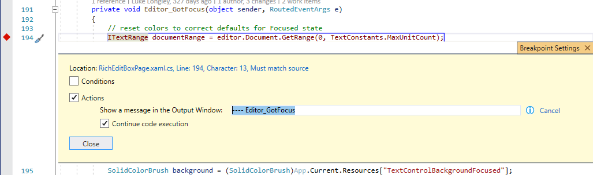
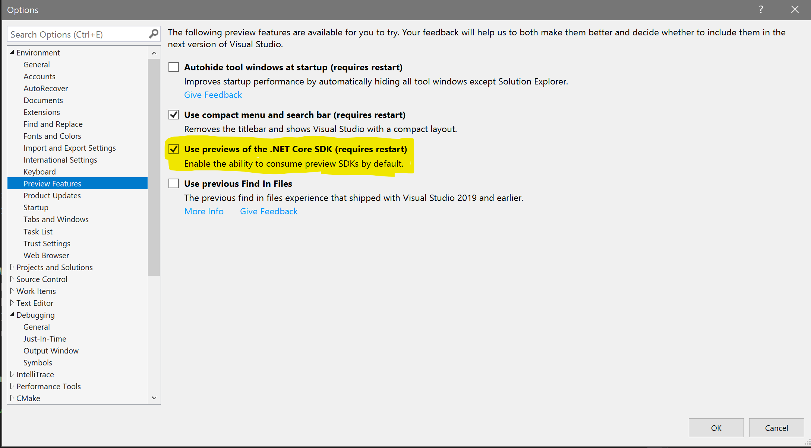

# Debugging Tips

## Table of Contents

- [Overview](#overview)
- [Visual Studio](#visual-studio)
  - [Tracing](#tracing)
  - [Debugger Visualizations](#debugger-visualizations)
  - [Loader Snaps](#loader-snaps)
- [WinDBG](#windbg)
  - [Debugging with dbgsrv](#debugging-with-dbgsrv)
    - [Setting up a process server](#setting-up-a-process-server)
    - [Connecting from clientside](#connecting-from-clientside)
  - [Time travel debugging](#time-travel-debugging)
  - [Debugging memory leaks in tests](#debugging-memory-leaks-in-tests)
  - [Event loop and conditional breakpoints](#event-loop-and-conditional-breakpoints)
    - [Automatically printing events as they are processed](#automatically-printing-events-as-they-are-processed)
- [Debugging WinUI Tests](#debugging-winui-tests)
- [Debugger Visualizations](#debugger-visualizations-1)
- [Working with .NET](#working-with-net)
  - [How to work with .NET6](#how-to-work-with-net6)
  - [Enable Preview .NET Core SDK in Visual Studio](#enable-preview-net-core-sdk-in-visual-studio)

## Overview

A lot of complexity in this project is due to the event-driven design and peer relationships between the DXaml and Core 
layers. It can be difficult to find a logical sequence of events that occur as the result of an action. Some actions 
occur so frequently it may be difficult to reproduce a problem if the debugger breaks prematurely.

**You are encouraged to update this guide if you have anything to add or amend.**

## Visual Studio

Generally speaking, debugging with VS is easier to configure and use.

### Tracing

The easiest way to determine a series of actions taken between elements is to set actions on a series of relevant 
breakpoints in Visual Studio, as demonstrated in the screenshot below.



The console output will display the message when the breakpoint is hit, but will not interrupt the ongoing action. You 
can also print the value of variables in this output to determine a set of conditions with which you *do* want to break.

### Debugger Visualizations

To visualize XAML types, such as xstring_ptr_view, install [Scripts\winui.natvis](../../Scripts/winui.natvis) by copying it 
to "%USERPROFILE%\My Documents\Visual Studio 2019\Visualizers" and restarting your debug session.

### Loader Snaps

[Loader snaps](https://docs.microsoft.com/en-us/windows-hardware/drivers/debugger/show-loader-snaps) are useful when 
debugging module load failures (DLL not found, ERROR_MOD_LOAD, etc.). Without loader snaps it is difficult or impossible 
to determine which module is missing and what other module was trying to load it.

Start the process you want to debug, making sure that "Stop at first statement" is enabled and private symbols are 
loaded. In the Watch window add: `ntdll.dll!LdrpDebugFlags`. Set the value to `1` and continue execution. Loader log 
will appear in Output window. 

## WinDBG

A ~~slightly~~ more complicated way is using WinDBG, which has the tradeoff of many more extensions and utilities.

To install WinDBG: https://learn.microsoft.com/en-us/windows-hardware/drivers/debugger/

For basic information regarding how to use WinDBG: https://learn.microsoft.com/en-us/windows-hardware/drivers/debugger/getting-started-with-windbg

WinDBG's syntax can be complex. For a list of common WinDBG commands: https://learn.microsoft.com/en-us/windows-hardware/drivers/debuggercmds/

### Debugging with dbgsrv
When debugging within a virtual machine, using WinDbg directly on the VM might
be inconvenient due to lag. Dbgsrv is useful since it allows you to run a
process server on the VM.

You can then connect from a WinDbg client on another machine, and attach to any
processes running on the VM. This is convenient when copying only a subset of
files over to the VM, such as TestPayload or a sample app, while still being
able to access symbols on the clientside/local machine.

For more information, search for "dbgsrv" under the Local Help section of
WinDbg. 

#### Setting up a process server
To start up a process server on the virtual machine, find the location of
`dbgsrv.exe`. Different versions can be found under
`C:\Users\[username]\AppData\Local\dbg\UI`. From there, run the following
command in an admin command prompt:
```
dbgsrv -t npipe:pipe=[pipeName]
```
When running this command, no response is a signal of success. You can confirm
that it's running by checking for dbgsrv.exe under Task Manager's Details
section. 

You should make `pipeName` a unique name for different process servers. This
example uses the named pipe protocol, but dbgsrv also supports other transport
protocols, such as TCP, COM Port, secure pipe (SPIPE), and secure sockets layer
(SSL). For more information on these, or on more parameters for dbgsrv, refer to
WinDbg's Local Help.

#### Connecting from clientside
From WinDbg, while not actively debugging, go to File > Connect to process
server. For named pipe protocol, enter the following in the dialog:
```
npipe:server=[Server],pipe=[pipeName]
```
`Server` will be the name or IP address of the machine on which the process
server is running.

Once the clientside is connected, you will be able to attach processes running
on the VM, and debug using WinDbg on the clientside as usual.

### Time travel debugging

A time travel trace saves the execution of a test or app, allowing you to easily step backward as well as
forward. This can be useful in the case of a bug that is difficult to reproduce, and can also be used for 
debugging memory leaks in tests (covered in the next section).

For more information on how to use TTD: https://learn.microsoft.com/en-us/windows-hardware/drivers/debugger/time-travel-debugging-overview

### Debugging memory leaks in tests

WinUI tests are designed to check for memory leaks while executing the test logic. This can lead to some unexpected 
failures. It also seems that the output text isn't helpful since the project was lifted from the Windows OS. Below is 
one example of test output with an attached debugger & sybmbols loaded (this output is more verbose than what the 
automated pipeline logs report).

```
memory.cpp[523]: Source '(null)', Value 0, Message Ignoring 151 blocks, 41004 bytes of static media allocations
memory.cpp[593]: Source '(null)', Value 0, Message =====================================
memory.cpp[594]: Source '(null)', Value 0, Message = Owned objects                     =
memory.cpp[595]: Source '(null)', Value 0, Message =====================================
...
memory.cpp[638]: Source '(null)', Value 0, Message =====================================
memory.cpp[639]: Source '(null)', Value 0, Message = Top Level objects (V1 algorithm)  =
memory.cpp[640]: Source '(null)', Value 0, Message =====================================
memory.cpp[641]: Source '(null)', Value 0, Message 
memory.cpp[260]: Source '(null)', Value 0, Message Top Level LEAK -- 0x1f263c87e90 OverrideXamlResourcePropertyBag
memory.cpp[1125]: Source '(null)', Value 0, Message Running top level leak finder V2 algorithm
memory.cpp[1126]: Source '(null)', Value 0, Message Scanning for min/max/count...
memory.cpp[1148]: Source '(null)', Value 0, Message min: 0x1f263c87e90 max: 0x1f263c87eb0 diff: 0x00000020 count: 1
memory.cpp[1189]: Source '(null)', Value 0, Message sorting done
memory.cpp[1320]: Source '(null)', Value 0, Message done building InboundLink reverse-map
memory.cpp[1348]: Source '(null)', Value 0, Message 
memory.cpp[1349]: Source '(null)', Value 0, Message =====================================
memory.cpp[1350]: Source '(null)', Value 0, Message = Top level blocks (V2 scan)        =
memory.cpp[1351]: Source '(null)', Value 0, Message =====================================
memory.cpp[1352]: Source '(null)', Value 0, Message 
memory.cpp[1373]: Source '(null)', Value 0, Message hardToTrack: 1 topLevelType: 2 incomingStrength: 3 outboundStrength: 0
memory.cpp[1373]: Source '(null)', Value 0, Message hardToTrack: 1 topLevelType: 2 incomingStrength: 3 outboundStrength: 1
memory.cpp[1373]: Source '(null)', Value 0, Message hardToTrack: 1 topLevelType: 2 incomingStrength: 3 outboundStrength: 2
memory.cpp[1373]: Source '(null)', Value 0, Message hardToTrack: 1 topLevelType: 2 incomingStrength: 3 outboundStrength: 3
memory.cpp[1373]: Source '(null)', Value 0, Message hardToTrack: 1 topLevelType: 2 incomingStrength: 2 outboundStrength: 0
...
memory.cpp[1373]: Source '(null)', Value 0, Message hardToTrack: 0 topLevelType: 1 incomingStrength: 1 outboundStrength: 1
memory.cpp[1373]: Source '(null)', Value 0, Message hardToTrack: 0 topLevelType: 1 incomingStrength: 1 outboundStrength: 2
memory.cpp[1373]: Source '(null)', Value 0, Message hardToTrack: 0 topLevelType: 1 incomingStrength: 1 outboundStrength: 3
memory.cpp[1373]: Source '(null)', Value 0, Message hardToTrack: 0 topLevelType: 1 incomingStrength: 0 outboundStrength: 0
memory.cpp[260]: Source '(null)', Value 0, Message Top Level LEAK -- 0x1f263c87e90 OverrideXamlResourcePropertyBag
memory.cpp[1373]: Source '(null)', Value 0, Message hardToTrack: 0 topLevelType: 1 incomingStrength: 0 outboundStrength: 1
memory.cpp[1373]: Source '(null)', Value 0, Message hardToTrack: 0 topLevelType: 1 incomingStrength: 0 outboundStrength: 2
memory.cpp[1373]: Source '(null)', Value 0, Message hardToTrack: 0 topLevelType: 1 incomingStrength: 0 outboundStrength: 3
memory.cpp[1380]: Source '(null)', Value 0, Message 
memory.cpp[1381]: Source '(null)', Value 0, Message ================================================================================================================
memory.cpp[1382]: Source '(null)', Value 0, Message = Top level blocks above are printed in order from least to most likely to be the real problem (V2 scan)       =
memory.cpp[1383]: Source '(null)', Value 0, Message = Start at the last block printed above and fix why it's leaking or why its marking is broken, re-run, repeat. =
memory.cpp[1384]: Source '(null)', Value 0, Message ================================================================================================================
memory.cpp[1385]: Source '(null)', Value 0, Message 
memory.cpp[350]: Source '(null)', Value 0, Message 
memory.cpp[354]: Source '(null)', Value 0, Message *** Leaked memory totals: 1 blocks, 32 bytes. ***
memory.cpp[355]: Source '(null)', Value 0, Message 
```

In this case `OverrideXamlResourcePropertyBag` is the only hint provided by the scan output. If you were to examine this
function you'd realize that this is more or less a dead end. Another less-obvious hint is the file memory.cpp, which we 
can examine to find the function `XcpCheckLeaks`.

Run the test in question. For help running tests, see [Testing FAQ](../testing/testing-FAQ.md). 
In this case, the test command used was: 

`te.exe test\Microsoft.UI.Xaml.Tests.External.Controls.TimePicker.dll /runas:UAP /select:"@Name='*TimePickerIntegrationTests::VerifyDefaultProperties'" /WaitForDebugger`

It may be useful to capture a time travel trace of the test, as memory addresses for objects will change over different runs. See [Time Travel Debugging](#time-travel-debugging) for more information.

Attach WinDBG to the running process and set a breakpoint in the above function using `bu Microsoft_UI_Xaml!XcpCheckLeaks`. 
When the breakpoint is first hit, we can move the breakpoint to within the logic that detects an actual problem. 
Technically, the first step can be skipped by opening memory.cpp directly, but if this is done before symbols are loaded 
for the `Microsoft_UI_Xaml` module it will add considerable time brute-force searching through each module for the 
location of the command we specify.

`memory.cpp:`
``` cpp
    // Start over and dump all the relevant information about the leaks.
    pHeader = g_RootCheckBlock.pNext;
    while (pHeader != &g_RootCheckBlock)
    {
        if (static_cast<void*>(pHeader+1) != static_cast<void*>(g_pCheckedMemoryChainLock))
        {
            if (!(pHeader->allocationClass & AllocationIgnoreLeak))
            {
                // Lookup the symbol of the VTable to help figure out what the object is
                ICallingMethod* pCallingMethods = NULL;                                         // set the breakpoint here!
                if (pHeader->cSize >= sizeof(void*))
                {
                    XUINT64 caller = (XUINT64) (((void**) (pHeader+1))[0]);
                    GetPALDebuggingServices()->GetCallerSourceLocations(1, &caller, &pCallingMethods);
                    if (pCallingMethods && pCallingMethods[0].szSymbolName)
                    {
                        // Since we are looking for VTables, just end the string at the first Colon.
                        WCHAR *pColon = xstrchr(pCallingMethods[0].szSymbolName, xstrlen(pCallingMethods[0].szSymbolName), L':');
                        if (pColon)
                        {
                            pColon[0] = L'\0';
                        }
                    }
                }
```

When this break point hits `pHeader` points to a leaked memory block:

```
0:007> dx -r1 ((Microsoft_UI_Xaml!DebugMemoryCheckBlock *)pHeader)
((Microsoft_UI_Xaml!DebugMemoryCheckBlock *)pHeader)                 : 0x1d73fcd41e0 [Type: DebugMemoryCheckBlock *]
    [+0x000] chXcpB           : 0x42726448706358 [Type: unsigned __int64]
    [+0x008] guard            [Type: unsigned short [32]]
    [+0x048] cSize            : 0x20 [Type: unsigned __int64]
    [+0x050] blockSignature   : 0xa6b0e1b1d486cdff [Type: unsigned __int64]
    [+0x058] pPrevious        : 0x1d73fcdb6b0 [Type: DebugMemoryCheckBlock *]
    [+0x060] pNext            : 0x1d73fcb71a0 [Type: DebugMemoryCheckBlock *]
    [+0x068] pTrailer         : 0x1d73fcd42c0 [Type: DebugMemoryCheckBlock *]
    [+0x070] pCallers         : 0x1d73fdb74f0 : 0x7ff8c0caf843 [Type: unsigned __int64 *]
    [+0x078] cCallers         : 0x20 [Type: unsigned int]
    [+0x07c] allocationClass  : 0x0 [Type: unsigned short]
    [+0x07e] fDeallocated     : 0x0 [Type: unsigned short]
    [+0x080] pAddRefHead      : 0x0 [Type: DebugAddRefList *]
    [+0x088] pAddRefTail      : 0x0 [Type: DebugAddRefList *]
    [+0x090] section          : 0x3e [Type: unsigned int]
    [+0x094] index            : 0x1cfb [Type: unsigned int]
    [+0x098] taggedPointers   : 0x1d73a5aa6e0 [Type: PointerStrengthTag *]
    [+0x0a0] inboundLinkList  : 0x0 [Type: InboundLink *]
    [+0x0a8] maxOutboundLinkStrength : LinkStrengthNone (0) [Type: LinkStrength]
    [+0x0ac] topLevelType     : TopLevelType_NotTopLevel (0) [Type: TopLevelType]
    [+0x0b0] isOnTraversalStack : false [Type: bool]
    [+0x0b1] isConsideredBefore : false [Type: bool]
    [+0x0b2] isHardToTrack    : false [Type: bool]
    [+0x0b8] chXcpE           : 0x45726448706358 [Type: unsigned __int64]
```

`cSize` represents the size of the leaked block. This may vary from leak to leak... but in this case, it is `0x20` (32 bytes), 
on an x86 machine this mould be 16 bytes for this particular issue.

`pCallers` is the allocation call stack. The memory leak code always allocates 64 bits for the stack addresses (even on x86). 
You can use `dqs` or `dps` to dump the stack with symbol names. If you are debugging on x64, you can use the more 
standard `dps` which dumps the memory using the architecture’s pointer size (the p). If you are debugging on an x86 
machine you will need to force it to 64 bits using `dqs`.

```
0:007> dps 0x000001d73fdb74f0
000001d7`3fdb74f0  00007ff8`c0caf843 Microsoft_UI_Xaml!ctl::Details::CreateWeakReference+0x13 [<repo-root>\dxaml\xcp\components\com\inc\WeakReferenceImpl.h @ 128]
000001d7`3fdb74f8  00007ff8`c0cb01bc Microsoft_UI_Xaml!ctl::ComBase::GetWeakReferenceImpl+0x7c [<repo-root>\dxaml\xcp\components\com\inc\ComBase.h @ 175]
000001d7`3fdb7500  00007ff8`c0cb00fd Microsoft_UI_Xaml!ctl::WeakReferenceSourceNoThreadId::GetWeakReference+0x1d [<repo-root>\dxaml\xcp\components\lifetime\lib\WeakReferenceSourceNoThreadId.cpp @ 114]
000001d7`3fdb7508  00007ff8`c0cb00cc Microsoft_UI_Xaml!ctl::interface_forwarder<IWeakReferenceSource,ctl::WeakReferenceSourceNoThreadId>::GetWeakReference+0x2c [<repo-root>\dxaml\xcp\components\lifetime\inc\WeakReferenceSourceNoThreadId.h @ 28]
000001d7`3fdb7510  00007ff8`c0866c72 Microsoft_UI_Xaml!ctl::AsWeak<DirectUI::Window>+0x192 [<repo-root>\dxaml\xcp\components\com\inc\ComPtr.h @ 776]
000001d7`3fdb7518  00007ff8`c0b281d9 Microsoft_UI_Xaml!DirectUI::TimePicker::OnLoaded+0x199 [<repo-root>\dxaml\xcp\dxaml\lib\TimePicker_Partial.cpp @ 113]
000001d7`3fdb7520  00007ff8`c0b1ce45 Microsoft_UI_Xaml!std::invoke<long (__cdecl DirectUI::TimePicker::*&)(IInspectable *,ABI::Microsoft::UI::Xaml::IRoutedEventArgs *),DirectUI::TimePicker * &,IInspectable *,ABI::Microsoft::UI::Xaml::IRoutedEventArgs *>+0x75 [C:\Program Files (x86)\Microsoft Visual Studio\2019\Enterprise\VC\Tools\MSVC\14.28.29910\include\type_traits @ 1615]
...
000001d7`3fdb7550  00007ff8`c0b3280c Microsoft_UI_Xaml!std::_Func_impl_no_alloc<std::_Binder<std::_Unforced,long (__cdecl DirectUI::TimePicker::*)(IInspectable *,ABI::Microsoft::UI::Xaml::IRoutedEventArgs *),DirectUI::TimePicker *,std::_Ph<1> const &,std::_Ph<2> const &>,long,IInspectable *,ABI::Microsoft::UI::Xaml::IRoutedEventArgs *>::_Do_call+0x4c [C:\Program Files (x86)\Microsoft Visual Studio\2019\Enterprise\VC\Tools\MSVC\14.28.29910\include\functional @ 939]
...
000001d7`3fdb7568  00007ff8`bf897a89 Microsoft_UI_Xaml!DirectUI::CRoutedEventSourceBase<DirectUI::IUntypedEventSource,ABI::Microsoft::UI::Xaml::IRoutedEventHandler,IInspectable,ABI::Microsoft::UI::Xaml::IRoutedEventArgs>::Raise+0x399 [<repo-root>\dxaml\xcp\dxaml\lib\JoltClasses.h @ 937]
``` 

From the first entry on the stack we know we are allocating a weak reference block, which is creating the leak.  Looking
further down, we see that this is occurring on line 113 in TimePicker::OnLoaded. Now we know enough information to 
re-run the tests with new breakpoints and debug the cause of the leak.

This particular issue related to the way that WeakReference allocates memory. More information (including a further 
write up) can be found on the [WeakRefPtr documentation](../design-notes/pointers.md#ctlweakrefptr).

### Event loop and conditional breakpoints

On the XAML side, `CEventManager::Raise` is used to drive the event loop. This is easily observed by setting a break 
point on a simple action and using `k` to print the stack

```
0:000> bu Microsoft_UI_Xaml!DirectUI::ButtonBase::OnClick
0:000> g
```
(button is clicked in the UI)

```
Breakpoint 0 hit
eax=00000000 ebx=0027116c ecx=26dfab30 edx=00000001 esi=007bc304 edi=00000415
eip=0b2c2650 esp=007bc2dc ebp=007bc2e8 iopl=0         nv up ei pl zr na pe nc
cs=0023  ss=002b  ds=002b  es=002b  fs=0053  gs=002b             efl=00200246
Microsoft_UI_Xaml!DirectUI::ButtonBase::OnClick:
0b2c2650 55              push    ebp

0:000> k
 # ChildEBP RetAddr      
00 007bc2e8 0b2d932c     Microsoft_UI_Xaml!DirectUI::ButtonBase::OnClick [<repo-root>\dxaml\xcp\dxaml\lib\ButtonBase_Partial.cpp @ 869] 
01 007bc2e8 0b2df837     Microsoft_UI_Xaml!DirectUI::ToggleButton::OnClick+0x5c [<repo-root>\dxaml\xcp\dxaml\lib\ToggleButton_Partial.cpp @ 182] 
02 007bc2fc 0b2c5a83     Microsoft_UI_Xaml!DirectUI::AppBarToggleButton::OnClick+0x77 [<repo-root>\dxaml\xcp\dxaml\lib\AppBarToggleButton_Partial.cpp @ 251] 
03 007bc324 0b2c520b     Microsoft_UI_Xaml!DirectUI::ButtonBase::PerformPointerUpAction+0xd3 [<repo-root>\dxaml\xcp\dxaml\lib\ButtonBase_Partial.cpp @ 788] 
04 007bc3ac 0a5dbe00     Microsoft_UI_Xaml!DirectUI::ButtonBase::OnPointerReleased+0x4db [<repo-root>\dxaml\xcp\dxaml\lib\ButtonBase_Partial.cpp @ 768] 
05 007bc3e4 0b25608c     Microsoft_UI_Xaml!DirectUI::ControlGenerated::OnPointerReleasedProtected+0x120 [<repo-root>\dxaml\xcp\dxaml\lib\winrtgeneratedclasses\Control.g.cpp @ 1407] 
06 007bc4cc 0af4b7ed     Microsoft_UI_Xaml!DirectUI::Control::FireEvent+0x28c [<repo-root>\dxaml\xcp\dxaml\lib\Control_Partial.cpp @ 248] 
07 007bc534 0af14969     Microsoft_UI_Xaml!DirectUI::DXamlCore::FireEvent+0x2fd [<repo-root>\dxaml\xcp\dxaml\lib\DXamlCore.cpp @ 1935] 
08 007bc554 0af15fc1     Microsoft_UI_Xaml!AgCoreCallbacks::FireEvent+0x29 [<repo-root>\dxaml\xcp\dxaml\lib\FxCallbacks.cpp @ 86] 
09 007bc574 09c4d991     Microsoft_UI_Xaml!FxCallbacks::JoltHelper_FireEvent+0x21 [<repo-root>\dxaml\xcp\dxaml\lib\FxCallbacks.cpp @ 890] 
0a 007bc5e8 0a0f0816     Microsoft_UI_Xaml!CCoreServices::CLR_FireEvent+0x1a1 [<repo-root>\dxaml\xcp\core\dll\xcpcore.cpp @ 3094] 
0b 007bc610 0ba0e76c     Microsoft_UI_Xaml!CommonBrowserHost::CLR_FireEvent+0x36 [<repo-root>\dxaml\xcp\control\common\shared\CommonBrowserHost.hpp @ 687] 
0c 007bc694 0a1b3290     Microsoft_UI_Xaml!CControlBase::ScriptCallback+0x20c [<repo-root>\dxaml\xcp\control\common\shared\controlbase.cpp @ 213] 
0d 007bc720 0a1b3400     Microsoft_UI_Xaml!CXcpDispatcher::OnScriptCallback+0x190 [<repo-root>\dxaml\xcp\win\shared\xcpwindow.cpp @ 1120] 
0e 007bc784 0a1b37e3     Microsoft_UI_Xaml!CXcpDispatcher::OnWindowMessage+0x90 [<repo-root>\dxaml\xcp\win\shared\xcpwindow.cpp @ 891] 
0f 007bc7b8 0a1b45d3     Microsoft_UI_Xaml!CXcpDispatcher::ProcessMessage+0x93 [<repo-root>\dxaml\xcp\win\shared\xcpwindow.cpp @ 727] 
10 007bc7e8 75e382e2     Microsoft_UI_Xaml!CXcpDispatcher::WindowProc+0x53 [<repo-root>\dxaml\xcp\win\shared\xcpwindow.cpp @ 664] 
11 007bc814 75e1776a     USER32!_InternalCallWinProc+0x2a 
12 (Inline) --------     USER32!InternalCallWinProc+0x1b 
13 007bc904 75e16e72     USER32!UserCallWinProcCheckWow+0x4aa 
14 007bc968 75e3e80c     USER32!SendMessageWorker+0x842
15 007bc98c 75e162b6     USER32!SendMessageInternal+0x2d
16 007bc9a8 0a1b3ef2     USER32!SendMessageW+0x46
17 007bc9c4 0a0f50fa     Microsoft_UI_Xaml!CXcpDispatcher::SendMessageW+0x22 [<repo-root>\dxaml\xcp\win\shared\xcpwindow.cpp @ 638] 
18 007bca1c 09ca0dfc     Microsoft_UI_Xaml!CXcpBrowserHost::SyncScriptCallbackRequest+0x18a [<repo-root>\dxaml\xcp\host\win\browserdesktop\WinBrowserHost.cpp @ 733] 
19 007bca6c 09ca081a     Microsoft_UI_Xaml!CEventManager::RaiseControlEvents+0xdc [<repo-root>\dxaml\xcp\core\dll\eventmgr.cpp @ 1125] 
1a 007bcb4c 09ca193a     Microsoft_UI_Xaml!CEventManager::Raise+0x2ca [<repo-root>\dxaml\xcp\core\dll\eventmgr.cpp @ 881] 
1b 007bcbb8 09ca1738     Microsoft_UI_Xaml!CEventManager::RaiseRoutedEventBubbling+0x10a [<repo-root>\dxaml\xcp\core\dll\eventmgr.cpp @ 1323] 
1c 007bcbf8 09ed972d     Microsoft_UI_Xaml!CEventManager::RaiseRoutedEvent+0x48 [<repo-root>\dxaml\xcp\core\dll\eventmgr.cpp @ 1233] 
1d 007bcc68 09ed4c22     Microsoft_UI_Xaml!CInputServices::RaiseDelayedPointerUpEvent+0x2ad [<repo-root>\dxaml\xcp\core\input\InputServices.cpp @ 2578] 
1e 007bcd30 09ed8cac     Microsoft_UI_Xaml!CInputServices::ProcessGestureInput+0x322 [<repo-root>\dxaml\xcp\core\input\InputServices.cpp @ 2329] 
1f 007bcd74 09c651c2     Microsoft_UI_Xaml!CInputServices::ProcessTouchInteractionCallback+0xcc [<repo-root>\dxaml\xcp\core\input\InputServices.cpp @ 2227] 
20 007bcd9c 0b92cb7b     Microsoft_UI_Xaml!CCoreServices::ProcessTouchInteractionCallback+0xe2 [<repo-root>\dxaml\xcp\core\dll\xcpcore.cpp @ 983] 
21 007bce7c 0b928f58     Microsoft_UI_Xaml!GestureRecognizerAdapter::OnTapped+0x1ab [<repo-root>\dxaml\xcp\components\gestures\export\GestureRecognizerAdapter.cpp @ 166] 
22 007bce98 0b92b55b     Microsoft_UI_Xaml!<lambda_dd3d8653348e55695c9f6ef7c590d5c1>::operator()+0x28 [<repo-root>\dxaml\xcp\components\gestures\export\GestureRecognizerAdapter.cpp @ 34] 
23 007bceb4 1ef050c8     Microsoft_UI_Xaml!Microsoft::WRL::Details::DelegateArgTraits<long (__stdcall ABI::Windows::Foundation::ITypedEventHandler_impl<ABI::Windows::Foundation::Internal::AggregateType<ABI::Microsoft::UI::Input::Experimental::ExpGestureRecognizer *,]

//COM layer and below omitted for brevity
```

#### Automatically printing events as they are processed

From this, we can see frame 0x1a `Microsoft_UI_Xaml!CEventManager::Raise` might be an interesting place to watch for 
events. This function takes in an `hEvent` param of type `KnownEventIndex`. Therefore, we can watch events as they occur 
and print the values of the `hEvent`.

This command will use the `dt` (display type) command on `hEvent` and immediately invoke a special `gc` command which 
tells the debugger to continue from a conditional.
Note: `+0x2e` chosen for entry after variable initialization.

`bp Microsoft_UI_Xaml!CEventManager::Raise+0x2e "dt hEvent;gc"`

Sample output:

```
 Local var @ 0x282e3e8 Type EventHandle
   +0x000 index            : b ( UIElement_PointerMoved )
Local var @ 0x282e3e8 Type EventHandle
   +0x000 index            : b ( UIElement_PointerMoved )
Local var @ 0x282e3e8 Type EventHandle
   +0x000 index            : b ( UIElement_PointerMoved )
Local var @ 0x282e3e8 Type EventHandle
   +0x000 index            : b ( UIElement_PointerMoved )
Local var @ 0x282e3e8 Type EventHandle
   +0x000 index            : b ( UIElement_PointerMoved )
...
Local var @ 0x282e3e8 Type EventHandle
   +0x000 index            : a ( UIElement_PointerPressed )
Local var @ 0x282c5b8 Type EventHandle
   +0x000 index            : 6e ( Timeline_Completed )
Local var @ 0x282e3e8 Type EventHandle
   +0x000 index            : a ( UIElement_PointerPressed )

Local var @ 0x282a8ec Type EventHandle
   +0x000 index            : c7 ( RichEditBox_TextChanged )
```

A conditional breakpoint can then be added to watch for an event we care about (`RichEditBox_TextChanged`, having value `0xc7`).

```
bp Microsoft_UI_Xaml!CEventManager::Raise+0x22 "j ( @@((int)hEvent.index)==0xc7 ) ''; 'gc'"
```

## Debugging WinUI Tests

When executing TAEF tests from the WinUI repo, in order to debug you want the test to wait for you to attach a debugger.
To aid debugging, the WinUI test infra supports a runtime flag that can be passed to taef: `/p:WaitForDebugger`. This 
will cause the test host to wait until a debugger has been attached before executing.

For the tests in MUXControls.Test.dll there are two processes at play during test execution; there is the test process that 
is executing the test code (te.processhost.exe) and there is the app process which has the UI and which has loaded Xaml 
(MUXControlsTestApp.exe). Since there are two processes, when debugging you need to know which process you want to 
attach to. The MUXC test infra supports two flags to allow test execution to wait until a debugger has been attached to 
either the test process or the app process. These are /p:WaitForDebugger and /p:WaitForAppDebugger respectively.

## Debugger Visualizations

To visualize XAML types, such as `xstring_ptr_view`, install [Scripts\winui.natvis](../../Scripts/winui.natvis) by copying 
it to `%USERPROFILE%\My Documents\Visual Studio 2019\Visualizers` and restarting your debug session.

## Working with .NET

### How to work with .NET6

As part of our build, we download and install the .NET6 SDK (to Program Files). We do this, primarily, so we can update
the .NET6 SDK as new things come online, without requiring developers to always install the SDK manually.

As part of the install, certain environment variables are set that will ensure when you build from the command line or 
from VS, that the installed one is used.
### Enable Preview .NET Core SDK in Visual Studio

By default, RTM Visual Studio won't use preview versions of the .NET SDK (not an issue for preview versiosn of VS). 
To override this, you need to enable this feature in Visual Studio by going to **Tools** -> **Options** -> 
**Environment** -> **Preview Features** -> **Use previews of the .NET Core SDK (requires restart)**. Your setting should
look like this:


