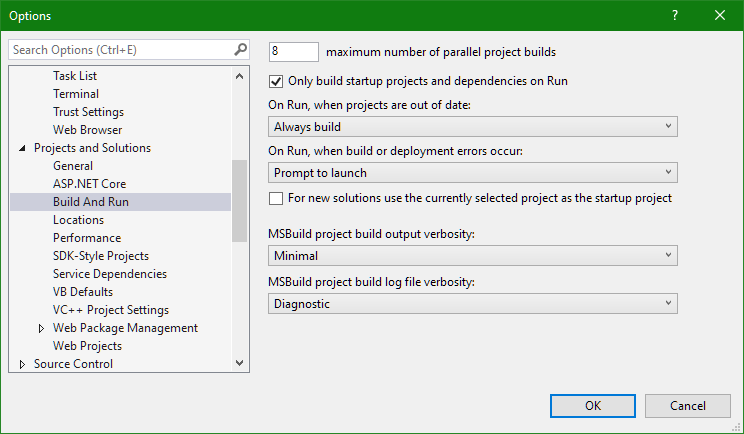
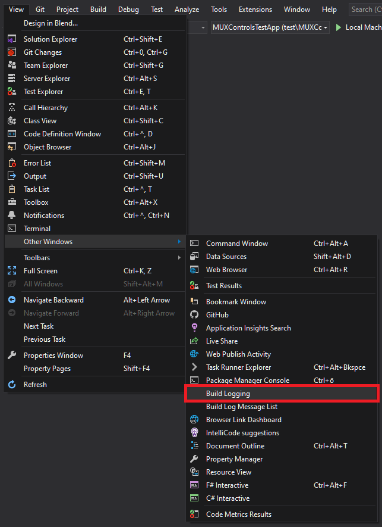
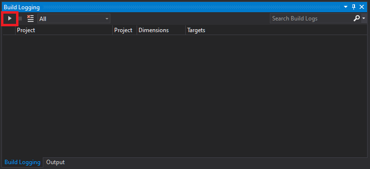

# Capturing binlogs
Capturing and providing binlog files can help with debugging build and packaging issues. In order to collect binlogs, please follow these steps:

Generally, it is encouraged to collect binlog files through the CLI of MSBuild as they tend to be easier to diagnose, but both methods of creating binlog files are fine.

## Collecting binlogs through Visual Studio
1. Download the **[VS Project System Tools extension](https://marketplace.visualstudio.com/items?itemName=VisualStudioProductTeam.ProjectSystemTools)**
2. Set the **Build Log File** verbosity to `Diagnostics`: `Tools->Options->Projects and Solutions->MSBuild project build log file verbosity`: 

3. Go to View->Other Windows->Build Logging: 

4. To start taking logs, press the play button: 

5. Run the steps that resulted in errors, e.g. building your project. The steps that failed show up as "Failed". Those files have the file extension ".binlog" and can be shared to help debugging build and packaging issues.

## Collection binlogs through the command line

To collect binlogs through the command line interface of MSBuild using the Visual Studio command line, you can use the `-bl` switch. Note that those commands should be used inside the Visual Studio command line.

For example, to build your solution in x86 release and collect binlogs, you can use the following:

`msbuild /p:Platform=x86 /p:Configuration=Release /bl`

If you encounter issues while creating app packages, you can use the following command to simulate collect binlogs:

`msbuild /p:AppxBundlePlatforms=x86 /p:Platform=x86 /p:Configuration=Release /p:BuildAppxUploadPackageForUap=true /bl`

In case of investigating build failures with the WinUI source code, please run the `devcmd.cmd` script at the root of the repository first.