# Spec: InfoBadge control

## Table of Contents

- [Background](#background)
  - [NavigationView Context](#navigationview-context)
- [Conceptual pages (How To)](#conceptual-pages-how-to)
  - [Dot InfoBadge](#dot-infobadge)
  - [Icon InfoBadge](#icon-infobadge)
  - [Numeric InfoBadge](#numeric-infobadge)
  - [Preset InfoBadge styles](#preset-infobadge-styles)
    - [List of style presets](#list-of-style-presets)
  - [How and when to use an InfoBadge](#how-and-when-to-use-an-infobadge)
    - [When to use an InfoBadge](#when-to-use-an-infobadge)
    - [When NOT to use an InfoBadge:](#when-not-to-use-an-infobadge)
  - [Using an InfoBadge in NavigationView](#using-an-infobadge-in-navigationview)
    - [Hierarchy and overflow](#hierarchy-and-overflow)
  - [Using an InfoBadge in another control](#using-an-infobadge-in-another-control)
  - [Changing, hiding, and switching between types of InfoBadge](#changing-hiding-and-switching-between-types-of-infobadge)
    - [Default behavior](#default-behavior)
  - [Accessibility](#accessibility)
  - [Examples](#examples)
    - [Create an InfoBadge](#create-an-infobadge)
    - [Placing an InfoBadge inside another control](#placing-an-infobadge-inside-another-control)
    - [Using InfoBadge with a style preset](#using-infobadge-with-a-style-preset)
    - [Increment a numeric InfoBadge in a NavigationView](#increment-a-numeric-infobadge-in-a-navigationview)
    - [Showing an InfoBadge that has a maximum value](#showing-an-infobadge-that-has-a-maximum-value)
    - [Hide a dot InfoBadge after its corresponding page has been clicked in NavigationView](#hide-a-dot-infobadge-after-its-corresponding-page-has-been-clicked-in-navigationview)
    - [Define an InfoBadge in code for a NavigationViewItem](#define-an-infobadge-in-code-for-a-navigationviewitem)
- [API Pages](#api-pages)
  - [InfoBadge class](#infobadge-class)
    - [Example](#example)
    - [Remarks](#remarks)
  - [InfoBadge.Value property](#infobadgevalue-property)
    - [Remarks](#remarks-1)
  - [InfoBadge.IconSource property](#infobadgeiconsource-property)
  - [NavigationViewItem.InfoBadge property](#navigationviewiteminfobadge-property)
  - [NavigationView.OverflowButtonInfoBadge property](#navigationviewoverflowbuttoninfobadge-property)
    - [Remarks](#remarks-2)
  - [NavigationView.OverflowItems](#navigationviewoverflowitems)
  - [New ThemeResources](#new-themeresources)
- [API Details](#api-details)
  - [InfoBadge API Details](#infobadge-api-details)
  - [NavigationViewItem API Details](#navigationviewitem-api-details)
  - [NavigationView API Details](#navigationview-api-details)
- [Appendix](#appendix)
  - [Accessibility Information](#accessibility-information)

## Background

A badge is a small piece of UI that usually displays a dot, number, or icon and serves to bring the 
user’s attention to where it’s placed, alerting them of something. In the example below, a badge 
with the number 9 is displayed on a Navigation item. 

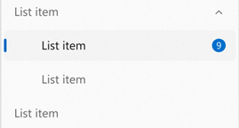

There is currently no built-in way to show badges in your WinUI app, and developers must create 
their own implementations. This blocks app developers from easily displaying notifications or 
indicating that new content is available, henceforth making a more difficult barrier to entry 
for a wide variety of app types that the WinUI platform should support (mail, messaging, social 
media). 

### NavigationView Context

`NavigationView` is the most common scenario in which InfoBadge will be used, and is the recommended 
way of displaying notifications/alerts that can be seen and accessed app-wide. In addition to this, 
NavigationView has a bit of a complicated architecture where it has multiple display modes, which 
poses a difficulty for developers looking to integrate InfoBadge into their NavigationView. For that
reason NavigationView items will have specific APIs to support badging. For InfoBadge placement in
all other controls and scenarios, developers will use the placement and positioning (`Margin`, 
`Alignment`, etc) APIs that are built into InfoBadge itself. 


## Conceptual pages (How To)

Badging is the least intrusive and most intuitive way to display notifications or bring focus to 
something within an app. An InfoBadge is a small piece of UI that can be added into an app and 
customized to display a number, icon, or a simple dot. **InfoBadge is built into NavigationView
but can also be added as a standalone element in the XAML tree, allowing you to place InfoBadge
into any control or piece of UI of your choosing.** When using an InfoBadge somewhere other than
NavigationView, you will be responsible for programmatically determining when to show/dismiss 
the InfoBadge and where to place the InfoBadge. An InfoBadge should be used to bring the user’s 
focus to an area – whether that be for notifications, indicating new content, or showing an alert.

There are three InfoBadge types that you can choose from - dot, icon, and numeric, as shown in 
order below.

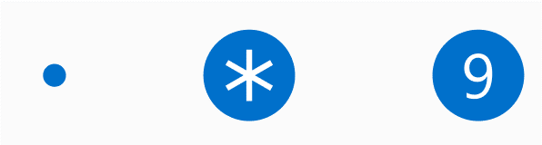

### Dot InfoBadge

The dot InfoBadge is a simple ellipse with a default size of 4px by 4px. It has no border, and is 
never meant to hold text or anything else inside of it. 

The dot InfoBadge should be used for general scenarios in which you want to guide the user’s focus 
towards the InfoBadge – i.e. indicating new content or updates are available.

### Icon InfoBadge

The icon InfoBadge is a 16px by 16px ellipse that holds an icon inside of it. InfoBadge has an 
`IconSource` property which provides flexibility for the types of supported icons.  

The icon InfoBadge should be used to send a quick message along with getting the user’s attention
– e.g. alerting the user that something non-blocking in the application has gone wrong, an extra
important update is available, or that something specific in the app is currently enabled (like a
countdown timer going). 

Note that if you'd like to use BitmapIcon for the `IconSource` of your InfoBadge, you are 
responsible for ensuring that the BitmapIcon fits inside of the InfoBadge (either by changing
the size of the icon, or changing the size of the InfoBadge). 
 
### Numeric InfoBadge

The numeric InfoBadge is also a 16px by 16px ellipse that holds a number inside of it. Numbers 
must be whole integers and must be greater than or equal to zero. The width of the ellipse will
automatically expand as the number grows to multiple digits, with a smooth animation. 

The numeric InfoBadge should be used for showing that there are a specific number of items that 
need attention – i.e. new emails/messages.

<!-- Spec note: Issue - we don't have a solid enough localization story to support non-Latin numbers, it's something we 
should look into. -->

### Preset InfoBadge styles

To help support the most common scenarios in which InfoBadges are used, WinUI provides built-in, 
preset InfoBadge styles. While you can customize your InfoBadge to use any color/icon/number 
combination that you desire, these built-in presets are a quick option to make sure that your 
InfoBadge is compliant with accessibility guidelines and is proportional in terms of icon and number sizing. 

<!-- Spec note: Issue - we don't have a solid enough localization story to support localizing colors or icons, this is 
something we should continue to investigate. -->

#### List of style presets

The following InfoBadge style presets each use one of the following colors for the background fill of the InfoBadge 
(the top row are the background colors to be used in light mode, the bottom row are the background colors to be used in 
dark mode):

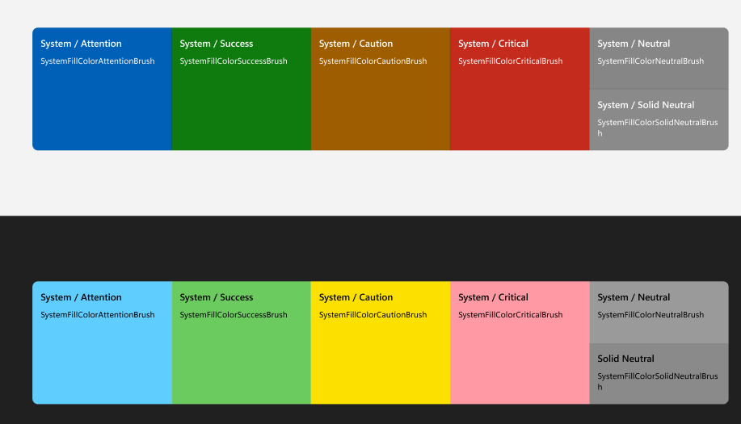

| Style Name | Color                   | Icon |
|---------------------------------|-------------------------|------|
| AttentionIconInfoBadgeStyle     | Attention/Informational ||
| InformationalIconInfoBadgeStyle | Attention/Informational | |
| SuccessIconInfoBadgeStyle       | Success                 ||
| CautionIconInfoBadgeStyle       | Caution                 |  |
| CriticalIconInfoBadgeStyle      | Critical                |      |
| AttentionNumericInfoBadgeStyle      | Attention/Informational | None |
| InformationalNumericInfoBadgeStyle  | Attention/Informational | None |
| SuccessNumericInfoBadgeStyle        | Success                 | None |
| CautionNumericInfoBadgeStyle        | Caution                 | None |
| CriticalNumericInfoBadgeStyle       | Critical                | None |
| AttentionDotInfoBadgeStyle      | Attention/Informational | None |
| InformationalDotInfoBadgeStyle  | Attention/Informational | None |
| SuccessDotInfoBadgeStyle        | Success                 | None |
| CautionDotInfoBadgeStyle        | Caution                 | None |
| CriticalDotInfoBadgeStyle       | Critical                | None |

To use a preset InfoBadge style, you'd use the following markup:

```xml
<InfoBadge Style="{ThemeResource AttentionIconInfoBadgeStyle}"/>
```

If a style is set on an InfoBadge and a conflicting property is also set, the property should overwrite the conflicting 
part of the style, but non-conflicting style elements will stay applied.

For example: if you apply the `CriticalIconInfoBadgeStyle` to an InfoBadge, but also set `InfoBadge.Value = 1`, you 
would end up with an InfoBadge that has the "Critical" background color but displays the number 1 inside of it, rather 
than displaying the preset icon.

### How and when to use an InfoBadge  

#### When to use an InfoBadge

An InfoBadge should be used when you want to bring the user’s focus to a certain area of your app
in an non-intrusive way. When an InfoBadge appears, it is meant to bring focus to an area and then 
let the user get back into their flow, giving them the choice of whether or not to look into the
details of why the InfoBadge appeared. InfoBadges should only represent messages that are 
dismissible and non-permanent – an InfoBadge should have specific rules as to when it can appear,
disappear, and/or change.  

Examples of appropriate InfoBadge usage:
* Indicating new messages have arrived
* Indicating new articles are available to read
* Indicating that there are new options available on a page
* Indicating that there might be an issue with an item on a certain page that does not block the app from functioning

#### When NOT to use an InfoBadge:

An InfoBadge should not be used to display critical errors or convey highly important messages that 
need immediate action. InfoBadges should not be used in cases where they need to be interacted with 
immediately to continue usage of the app. 

Examples of inappropriate InfoBadge usage:
* Indicating an urgent matter on a page within the app that needs to be addressed before continuing to use the app
* Appearing in an app with no way for the user to dismiss the InfoBadge
* Using the InfoBadge as a permanent way of bringing the user’s focus to an area, without a way for the user to dismiss 
the InfoBadge.
* Using an InfoBadge as a regular Icon or image in your app

### Using an InfoBadge in NavigationView

If you're using a NavigationView in your app, using InfoBadge in NavigationView is the 
recommended approach for showing app-wide notifications and alerts.
To enable or customize the InfoBadge on a NavigationViewItem, assign the 
`NavigationViewItem.InfoBadge` property to an InfoBadge object in your app.

In Left-Expanded mode, InfoBadge will appear right-aligned to the edge of the NavigationViewItem. 

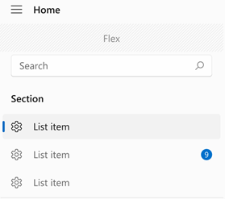

In Left-Compact mode, InfoBadge will appear overlayed on the top right corner of the icon. 

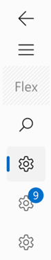

In Top mode, InfoBadge will be displayed aligned to the upper right hand corner of the overall item. 

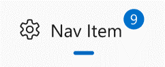

It is not recommended to use different types of InfoBadges in one NavigationView, e.g. attach a 
numeric InfoBadge to one NavigationViewItem and a dot InfoBadge to another NavigationViewItem in 
the same NavigationView.

#### Hierarchy and overflow

If you have a 
[hierarchical NavigationView](https://docs.microsoft.com/en-us/windows/uwp/design/controls-and-patterns/navigationview#hierarchical-navigation),
with `NavigationViewItems` nested in other `NavigationViewItems`, parent items will 
follow the same design/placement patterns as described above.

The parent NavigationViewItem and child NavigationViewItems will each have their own InfoBadge 
property, so you can bind the value of the parent’s InfoBadge to factors that determine that 
children’s InfoBadge values (such as showing the sum of the children's numeric InfoBadges on 
the parent's InfoBadge). 

The below image shows a hierarchical NavigationView with its `PaneDisplayMode` set to `Top`, where the 
top-level (parent) item shows a numeric InfoBadge. The app has set the parent item InfoBadge to 
represent what's being displayed in the child items' InfoBadges, as the child items are currently
not expanded (and therefore not visible).

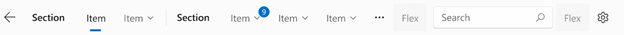

For overflow scenarios in a top-mode NavigationView (i.e. when the window size changes and 
NavigationView items are placed inside of the overflow menu), the overflow button has its own 
InfoBadge (`NavigationView.OverflowButtonInfoBadge`) that can be assigned and changed based on 
the InfoBadges that may be present on overflow items:

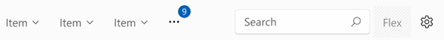

To access the list of items present in the overflow menu, use the `NavigationView.OverflowItems` 
collection. You can hook up to the `Changed` event for this collection to accurately check when items
are being moved into the overflow menu. Once you know which items are in the overflow menu, you can 
update the `NavigationView.OverflowButtonInfoBadge` to represent InfoBadge information/status on 
the overflow button itself while the overflow navigation items are hidden. 

<!-- Spec note: Issue - this process should be made easier/simpler in a future version of InfoBadge. -->

### Using an InfoBadge in another control

Use InfoBadge as you would any other control –- simply add the InfoBadge markup where you’d like it 
to appear. Since InfoBadge inherits from `Control`, it has all the built-in positioning properties 
such as margin, alignment, padding, and more which you can take advantage of to position your 
InfoBadge exactly where you want it. Once the InfoBadge is positioned, use the `IsOpen` property
to make the InfoBadge appear and disappear based on user actions, program logic, counters, etc.
Note that the `IsOpen` property is set to `true` by default.

If you’re placing an InfoBadge inside of another control, such as a Button or a ListViewItem, note
that it if the InfoBadge is placed to be visible past the bounding box of the parent control, it will
likely get cropped. So if your InfoBadge is inside of another control, it should not be placed past
the corners of the controls overall bounding box. 

Note that InfoBadge is a `UIElement` and therefore cannot be shared or used as a resource.

### Changing, hiding, and switching between types of InfoBadge

To show or hide an InfoBadge, simply set the `InfoBadge.Opacity` property to the appropriate 
value: `1.0` to show the InfoBadge, and `0` to hide the InfoBadge. On showing and hiding, the 
InfoBadge will animate.

You can change the icon or number displayed in an InfoBadge while it is being shown. Decrementing 
or incrementing a numeric InfoBadge based on user action can be achieved by setting/manipulating
the value of `InfoBadge.Value`. Changing the icon of an InfoBadge can be achieved by setting 
`InfoBadge.IconSource` to a new `IconSource` object. When changing icons, ensure that the new
icon is the same size as the old icon to avoid a jarring visual effect.

#### Default behavior

If neither `InfoBadge.Value` nor `InfoBadge.IconSource` are set, the InfoBadge defaults to showing
a dot. (Specifically if `Value` is set to -1 and `IconSource` is set to null, which are the default
values.) If both the `Value` and `IconSource` properties are set, the InfoBadge will honor the 
`Value` property and display a number value.  

In order to hide an InfoBadge once any of its properties have been set, the `Opacity` property will 
need to be set to `0`. 

You can also change the InfoBadge’s type while it is being shown. To change the type of InfoBadge, 
be sure that the current type’s corresponding property (`Value` or `IconSource`) is set to its 
default value (-1 or `null`), and set the new type’s property equal to an appropriate value. To 
change the type of InfoBadge from numeric or icon to a dot type InfoBadge, make sure that 
`InfoBadge.Value` is set to -1 and `InfoBadge.IconSource` is set to `null`. 

Depending on how you’ve positioned your InfoBadge, be aware that this may cause items to shift as 
the shape of the InfoBadge may change.

### Accessibility

The InfoBadge control does not have any accessibility built in to it, as the control is not 
focusable and cannot be interacted with. To ensure your app is fully accessible, we recommend the 
following:

* The parent element of the InfoBadge should be focusable and accessible by tab
* The parent element announces the InfoBadge to screenreaders
* The app sends a UIA notification when the InfoBadge appears for the first time
* The app sends a UIA notification when an InfoBadge disappears from the UI
* The app sends a UIA notification when a significant change has occurred with an existing InfoBadge
  * The definition of "significant change" is up to you as the individual developer. Examples 
    of this can include: an InfoBadge switching between different types, an InfoBadge changing 
    color to represent its status, or an InfoBadge's value exceeding a certain significant number.

To control what the parent element announces to screenreaders, you can use attached properties of the 
[AutomationProperties](https://docs.microsoft.com/uwp/api/windows.ui.xaml.automation.automationproperties?view=winrt-19041) 
class. For InfoBadge, it's recommended that you set either the `AutomationProperties.FullDescription` or 
`AutomationProperties.ItemStatus` attached properties on the parent element.

To send UIA notifications upon the InfoBadge's appearance or dismissal, you can use the 
[AutomationPeer.RaiseAutomationEvent](https://docs.microsoft.com/uwp/api/windows.ui.xaml.automation.peers.automationpeer.raiseautomationevent?view=winrt-20348) 
method.

### Examples

#### Create an InfoBadge

**Creating a dot InfoBadge**:
```xml
<InfoBadge />
```

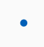

**Creating a numeric InfoBadge**:
```xml
<InfoBadge x:Name="emailInfoBadge" Value="{x:Bind numUnreadMail}"/>
```

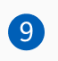

In most scenarios, you’ll want to bind the `Value` property of the InfoBadge to a changing integer 
value in your app’s backend so you can easily increment/decrement and show/hide the InfoBadge based
on that specific value. 

**Creating an Icon InfoBadge**:
```xml
<InfoBadge x:Name="SyncStatusInfoBadge">
    <InfoBadge.IconSource>
        <SymbolIconSource Symbol="Sync"/>
    </InfoBadge.IconSource>
</InfoBadge>
```
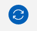

#### Placing an InfoBadge inside another control

Here’s a Button that has an InfoBadge placed in its upper right hand corner, with the badge layered 
on top of the content. This example can be applied to many controls other than Button as well -– it 
simply shows how to place, position, and show an InfoBadge inside of another WinUI control. 

```xml
<Button Padding="0" Width="200" Height="60" 
  HorizontalContentAlignment="Stretch" VerticalContentAlignment="Stretch">
    <Grid HorizontalAlignment="Stretch" VerticalAlignment="Stretch" Width="Auto" Height="Auto">
        <SymbolIcon Symbol="Sync" HorizontalAlignment="Center"></SymbolIcon>
        <InfoBadge Background="#C42B1C" HorizontalAlignment="Right" VerticalAlignment="Top">
            <InfoBadge.IconSource>
                <FontIconSource FontFamily="Segoe MDL2 Assets" Glyph="&#xF13C;"/>
            </InfoBadge.IconSource>
        </InfoBadge>
    </Grid>
</Button>
```

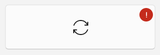

#### Using InfoBadge with a style preset

The markup below would create an InfoBadge that takes on the color and icon of the “Attention Icon”
preset style. 

```xml
<InfoBadge x:Name="InfoBadge1" Style="{ThemeResource AttentionIconInfoBadgeStyle}"/>
```


#### Increment a numeric InfoBadge in a NavigationView

Here’s a NavigationView that uses an InfoBadge to display the number of new emails in the inbox, and
increments the number shown in the InfoBadge when a new message is received. 

**XAML Markup:**
```xml
<NavigationView>
    <NavigationView.MenuItems>
        <NavigationViewItem Content="Home" Icon="Home"/>
        <NavigationViewItem Content="Account" Icon="Contact"/>
        <NavigationViewItem x:Name="InboxPage" Content="Inbox" Icon="Mail">
            <NavigationViewItem.InfoBadge>
                    <InfoBadge x:Name="bg1" Value="{x:Bind numUnreadMail, Mode=OneWay}" 
                               Opacity="{x:Bind ShowBadge, Mode=OneWay}"/>
            </NavigationViewItem.InfoBadge>
        </NavigationViewItem>
    </NavigationView.MenuItems> 
    <Frame x:Name="contentFrame" />
</NavigationView>
```

**C# code-behind:**

```csharp
IncomingMail numUnreadMail = new IncomingMail(); 
double ShowBadge = 0.0;

public void onNewMessageArrival(object sender, RoutedEventArgs msg){

    numUnreadMail += 1;
    
    //Show the InfoBadge if it's currently hidden
    if (ShowBadge == 0.0){
        ShowBadge = 1.0;
    }
}

public class IncomingMail : INotifyPropertyChanged
{

  private int _incomingMail;
  public int IncomingMail
  {
      get { return _incomingMail; }
      set { _incomingMail = value; PropertyChanged?.Invoke(nameof(IncomingMail)); }
  }

  public IncomingMail(){
      _incomingMail = 0;
  }

  public event PropertyChangedEventHandler PropertyChanged;
}
```

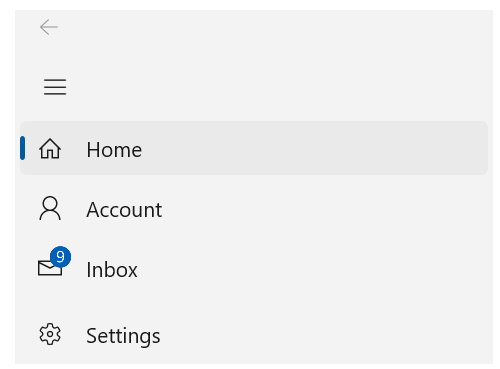

#### Showing an InfoBadge that has a maximum value

By default, InfoBadge does not have a max value and will not cut off or truncate numbers. However, this example tweaks 
the sample above and shows how to customize InfoBadge so that it displays "99+" when the number of unread emails goes 
above 99.

**XAML Markup:**
```xml
<NavigationView>
    <NavigationView.MenuItems>
        <NavigationViewItem Content="Home" Icon="Home"/>
        <NavigationViewItem Content="Account" Icon="Contact"/>
        <NavigationViewItem x:Name="InboxPage" Content="Inbox" Icon="Mail">
            <NavigationViewItem.InfoBadge>
                    <InfoBadge x:Name="bg1" IconSource="{x:Bind numUnread, Mode=OneWay}" 
                               Opacity="{x:Bind ShowBadge, Mode=OneWay}"/>
            </NavigationViewItem.InfoBadge>
        </NavigationViewItem>
    </NavigationView.MenuItems> 
    <Frame x:Name="contentFrame" />
</NavigationView>
```

**C# code-behind:**
```csharp
IncomingMail numUnreadMail = new IncomingMail(); 
double ShowBadge = 0.0;
FontIconSource numUnread = new FontIconSource
{
    FontFamily = new FontFamily("Segoe UI"),
    Glyph = Convert.ToString(numUnreadMail),
    FontSize = 12
};

public void onNewMessageArrival(object sender, RoutedEventArgs msg){

    numUnreadMail += 1;

    if (numUnreadMail > 99){
        numUnread.Glyph = "99+";
    }

    //Show the InfoBadge if it's currently hidden
    if (ShowBadge == 0.0){
        ShowBadge = 1.0;
    }
}

public class IncomingMail : INotifyPropertyChanged
{

  private int _incomingMail;
  public int IncomingMail
  {
      get { return _incomingMail; }
      set { _incomingMail = value; PropertyChanged?.Invoke(nameof(IncomingMail)); }
  }

  public IncomingMail(){
      _incomingMail = 0;
  }

  public event PropertyChangedEventHandler PropertyChanged;
}
```

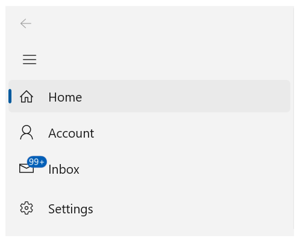

#### Hide a dot InfoBadge after its corresponding page has been clicked in NavigationView

This example shows a NavigationViewItem with a dot InfoBadge that gets closed (hidden) once the user 
navigates to the page being represented by the NavigationViewItem.

**XAML Markup:**
```xml
<NavigationView x:Name="nvSample">
    <NavigationView.MenuItems>
        <NavigationViewItem Content="Home" Icon="Home" Tag="Home" >
            <NavigationViewItem.InfoBadge>
                    <InfoBadge />
            </NavigationViewItem.InfoBadge>
            </NavigationViewItem>
        <NavigationViewItem  Content="Account" Icon="Contact" Tag="Contact" />
        <NavigationViewItem Content="Inbox" Icon="Mail" Tag="Mail" />
    <NavigationView.MenuItems>
    <Frame x:Name="contentFrame" />
</NavigationView>
 ```

**C# Code-behind:**
```csharp
// This function is called when any NavigationViewItem is clicked. 
private void NavView_ItemInvoked(NavigationView sender,
                                 NavigationViewItemInvokedEventArgs args)
{
    // Check if the Settings item was clicked:
    if (args.IsSettingsInvoked == true)
    {
        NavView_Navigate("settings", args.RecommendedNavigationTransitionInfo);
    }
    else if (args.InvokedItemContainer != null)
    {
        NavigationViewItem current = args.InvokedItemContainer as NavigationViewItem;
        // If the clicked NavigationViewItem had an InfoBadge showing, hide the InfoBadge. 
        if (current.InfoBadge.Opacity != 0.0){
                current.InfoBadge.Opacity = 0.0;
        }
 
        //Navigate to the appropriate page.
        var navItemTag = args.InvokedItemContainer.Tag.ToString();
        NavView_Navigate(navItemTag, args.RecommendedNavigationTransitionInfo);
    }
}
 ```

#### Define an InfoBadge in code for a NavigationViewItem

This example defines NavigationViewItems in code, and initializes and updates a numeric InfoBadge
that is shown when a message is received.

XAML Markup:

```xml
<muxc:NavigationView MenuItemsSource="navItems">
    <muxc:NavigationView.MenuItemTemplate>
        <DataTemplate x:DataType="local:CustomNavObject">
            <muxc:NavigationViewItem Content="{x:Bind Title}" Icon="{x:Bind ItemIcon}" 
                                     InfoBadge="{x:Bind ItemInfoBadge, Mode=OneWay}">
            </muxc:NavigationViewItem>
        </DataTemplate>
    </muxc:NavigationView.MenuItemTemplate>
</muxc:NavigationView>
```
 
C# Code-behind:

```csharp
public sealed partial class MainPage : Page
{
    public List<CustomNavObject> navItems = new List<CustomNavObject>();
    InfoBadge MailBadge = new InfoBadge();

    public MainPage()
    {
        this.InitializeComponent();

        
       // Initialize icons for NavigationView items
        SymbolIconSource HomeIcon = new SymbolIconSource 
        {
            Symbol = Symbol.Home
        };
        SymbolIconSource AcctIcon = new SymbolIconSource
        {
            Symbol = Symbol.Account
        };
        SymbolIconSource MailIcon = new SymbolIconSource 
        {
            Symbol = Symbol.Mail 
        };

        // Set up InfoBadge for the Mail item that is not visible on page load
        MailBadge.Value = 0;
        MailBadge.Opacity = 0;

        //Populate NavigationView
        navItems.Add(new CustomNavObject { Title = "Home", Tag = "home", ItemIcon = HomeIcon });
        navItems.Add(new CustomNavObject { Title = "Account", Tag = "acct", ItemIcon = AcctIcon });
        navItems.Add(new CustomNavObject { Title = "Mail", Tag = "mail", ItemIcon = MailIcon });
    }

    // This function is called when a new message is received.
    private void OnMessageReceived(string msg)
    {
        //Once a new message is received, update the InfoBadge being shown on the Mail navigation 
        // item. 
           MailBadge.Value +=1;
           MailBadge.Opacity = 1.0;
    }
}

public class CustomNavObject
{
    public string Title { get; set; }
    public string Tag { get; set; }
    public IconSource ItemIcon { get; set; }
    public InfoBadge ItemInfoBadge { get; set; }

    public CustomNavObject(string title, string tag, IconSource icon)
    {
        Title = title;
        Tag = tag;
        ItemIcon =  icon;
    }

    public CustomNavObject(string title, string tag, IconSource icon, InfoBadge badge)
    {
        Title = title;
        Tag = tag;
        ItemIcon =  icon;
        ItemInfoBadge = badge;
    }

}
```


## API Pages

### InfoBadge class

Represents a control that displays brief status as an icon, number, or dot. 

`public class InfoBadge : Control`  

#### Example

Here's an example of a simple InfoBadge that's set to display the number of unread emails:

```xml
<InfoBadge x:Name="emailInfoBadge" Value="{x:Bind numUnreadMail}"/>
```

#### Remarks

If neither `InfoBadge.Value` nor `InfoBadge.IconSource` are set to non-default values, the InfoBadge
defaults to showing a dot. If both of these properties are set, the value appears in a numeric 
InfoBadge.  The default value for `Value` is -1, and for `IconSource` is `null`.

In order to hide the InfoBadge, the `InfoBadge.Opacity` property needs to be set to `0`. 

### InfoBadge.Value property

Gets or sets the integer to be displayed in a numeric InfoBadge. Defaults to -1. 

` public int InfoBadge.Value { get; set; }`

#### Remarks

There is no maximum value for this property, but values must be greater than or equal to zero.
Any value less than -1 will result in an argument error. A value of -1 is considered the null value. 

The InfoBadge will continue to stretch to display large numbers, so ensure that your layout accounts 
for that if you expect to have large values displayed in an InfoBadge.

### InfoBadge.IconSource property

Gets or sets the icon to be used inside of the Icon InfoBadge.

`public IconSource InfoBadge.IconSource { get; set; }`

### NavigationViewItem.InfoBadge property

Gets or sets the InfoBadge object attached to the NavigationViewItem. 

`public InfoBadge NavigationViewItem.InfoBadge { get; set; }`

### NavigationView.OverflowButtonInfoBadge property

Gets or sets the InfoBadge to display on the NavigationView’s overflow button. 

`public InfoBadge NavigationView.OverflowButtonInfoBadge { get; set; }`

#### Remarks

The `NavigationView.OverflowButtonInfoBadge` is only displayed when the NavigationView has overflow items. Unlike a 
normal InfoBadge, this particular InfoBadge sets its `Opacity` property to `0` by default. So, this InfoBadge will not 
be visible unless you set the `Opacity` property to a number greater than 0 (preferably `1.0` for full opacity).

### NavigationView.OverflowItems 

Gets the collection of NavigationViewItems currently being shown in the overflow menu. 

`public ObservableCollection<object> NavigationView.OverflowItems { get; }`

### New ThemeResources

```xml
<Style x:Key="AttentionIconInfoBadgeStyle" TargetType="InfoBadge"></Style>
```

```xml
<Style x:Key="InformationalIconInfoBadgeStyle" TargetType="InfoBadge"></Style>
```

```xml
<Style x:Key="SuccessIconInfoBadgeStyle" TargetType="InfoBadge"></Style>
```

```xml
<Style x:Key="CautionIconInfoBadgeStyle" TargetType="InfoBadge"></Style>
```

```xml
<Style x:Key="CriticalIconInfoBadgeStyle" TargetType="InfoBadge"></Style>
```

```xml
<Style x:Key="AttentionDotInfoBadgeStyle" TargetType="InfoBadge"></Style>
```

```xml
<Style x:Key="InformationalDotInfoBadgeStyle" TargetType="InfoBadge"></Style>
```

```xml
<Style x:Key="SuccessDotInfoBadgeStyle" TargetType="InfoBadge"></Style>
```

```xml
<Style x:Key="CautionDotInfoBadgeStyle" TargetType="InfoBadge"></Style>
```

```xml
<Style x:Key="CriticalDotInfoBadgeStyle" TargetType="InfoBadge"></Style>
```

## API Details

### InfoBadge API Details

```csharp (but really MIDL3)
[MUX_PUBLIC]
[webhosthidden]
unsealed runtimeclass InfoBadge : Windows.UI.Xaml.Controls.Control
{
    InfoBadge();

    Microsoft.UI.Xaml.Controls.IconSource Icon { get; set; }
    int Value { get; set; }

    static Windows.UI.Xaml.DependencyProperty IconProperty { get; };
    static Windows.UI.Xaml.DependencyProperty ValueProperty { get; };
}
```

### NavigationViewItem API Details

```csharp
[MUX_PUBLIC]
[webhosthidden]
unsealed runtimeclass NavigationViewItem : NavigationViewItemBase
{
    NavigationViewItem();

    // Existing members have been excluded
    
    Microsoft.UI.Xaml.Controls.InfoBadge InfoBadge { get; set; }

    static Windows.UI.Xaml.DependencyProperty InfoBadgeProperty { get; }
}
```

### NavigationView API Details

```csharp
[MUX_PUBLIC]
[webhosthidden]
[MUX_PROPERTY_CHANGED_CALLBACK(TRUE)]
[MUX_PROPERTY_CHANGED_CALLBACK_METHODNAME("OnPropertyChanged")]
unsealed runtimeclass NavigationView : Windows.UI.Xaml.Controls.ContentControl
{
    NavigationView();

    // Existing members have been excluded

    Microsoft.UI.Xaml.Controls.InfoBadge OverflowButtonInfoBadge { get; set; }
    Windows.Foundation.Collections.IVectorView<Object> OverflowItems { get; }
    // Note: also implements Windows.Foundation.Collections.IObservableVector<Object>
    
    static Windows.UI.Xaml.DependencyProperty OverflowButtonInfoBadgeProperty { get; }
}
```

## Appendix

### Accessibility Information

The InfoBadge comes at a default size that meets accessibility requirements. Developers can 
customize many aspects of the InfoBadge including its height/width/color, etc. but it’s important
that the default InfoBadge adheres to our accessibility guidelines for size and color. 

The InfoBadge’s parent item should be focusable and accessible by tab. The InfoBadge itself should 
not be focusable as it cannot be directly interacted with, and InfoBadge should not block input. 
However, the recommended approach is for the parent item to announce InfoBadge as a part of its 
narrator announcement. 

NavigationView will have new built-in accessibility support for InfoBadge. When you're tabbing 
through a NavigationView and you land on a NavigationViewItem with an InfoBadge on it, the 
screenreader will announce that there is an InfoBadge on this item. If the InfoBadge in question
is numeric, the screenreader will announce the InfoBadge's value as well. 

The InfoBadge itself is not dismissible via click or other action. It is completely up to the 
developer to determine when to show and hide the InfoBadge. 

The default background color of an InfoBadge is set to SystemColorHighlightColor, which is the 
accent color. The number or icon inside of an InfoBadge has the foreground color set to 
SystemColorHighlightTextColor by default. These colors ensure that the InfoBadge will adhere
to high contrast accessibility guidelines.
