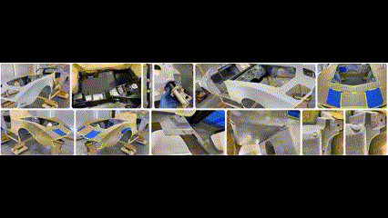
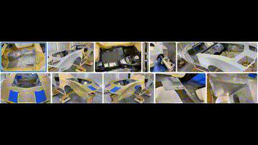
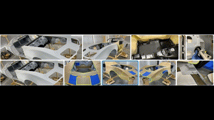
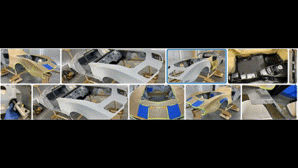

ItemCollectionTransitionProvider API spec
===

# Background

`ItemsView` allows the display of a collection of data objects,
organized according to a `Layout` object that controls how the corresponding `UIElement` containers are laid out visually. 

```xml
<ItemsView ItemsSource="{x:Bind Photos}">
    <ItemsView.Layout>
        <!-- Lay out photo objects in a 3-column Grid -->
        <UniformGridLayout MaxRowsOrColumns='3' />
    </ItemsView.Layout>
</ItemsView>
```

Currently, changes to the underlying data object collection cause instantaneous visual updates,
which can make it difficult for users to understand exactly what changes occurred in the collection.
To improve the user experience, the `ItemCollectionTransitionProvider` provides a way to specify 
how changes to the `UIElement` containers should be animated, 
to make it easier for users to see how the underlying collection has changed.

This spec adds a new `ItemTransitionProvider` property to `ItemsView` that allows you to specify 
a `ItemCollectionTransitionProvider` object to control transition animations on that control.
It also adds an `ItemTransitionProvider` property to `ItemsRepeater`, which is used internally by `ItemsView`.
Additionally, it adds a `CreateDefaultItemTransitionProvider` method to `Layout`,
which allows a layout object to provide a fallback transition to accompany it if you do not 
provide one explicitly on the `ItemsView` control.
Finally, this spec also defines the new `ItemCollectionTransitionProvider` class, 
as well as an implementation of it that will be returned from the implementation of
`CreateDefaultItemTransitionProvider` on `LinedFlowLayout`.


# Conceptual pages (How To)

The `ItemCollectionTransitionProvider` represents an object that
provides transition animations when the collection changes in an `ItemsView` control.

`LinedFlowLayoutItemCollectionTransitionProvider`, a derived class,
provides transition animations specifically designed to look appealing when combined with `LinedFlowLayout`.

C#
```cs
namespace PhotosApp
{
    public sealed partial class MainPage : Page
    {
        public MainPage()
        {
            this.InitializeComponent();

            this.Photos = new ObservableCollection<Photo>();
            PopulatePhotos();
        }

        public ObservableCollection<Photo> Photos
        {
            get;
            private set;
        }

        private void PopulatePhotos()
        {
            // Populates the this.Photos collection 
        }
    }
    
    public class Photo
    {
        public BitmapImage PhotoBitmapImage
        {
            get;
            set;
        }
    }
```

XAML
```xml
<Page
    x:Class="PhotosApp.MainPage"
    xmlns="http://schemas.microsoft.com/winfx/2006/xaml/presentation"
    xmlns:x="http://schemas.microsoft.com/winfx/2006/xaml"
    xmlns:local="using:PhotosApp">

    <ItemsView ItemsSource="{x:Bind Photos}">
        <ItemsView.ItemTemplate>
            <DataTemplate x:DataType="local:Photo">
                <ItemContainer>
                    <Image Source="{x:Bind PhotoBitmapImage, Mode=OneWay}"/>
                </ItemContainer>
            </DataTemplate>
        </ItemsView.ItemTemplate>
        <ItemsView.Layout>
            <!-- Instructs ItemsView to apply LinedFlowLayoutItemCollectionTransitionProvider -->
            <LinedFlowLayout />
        </ItemsView.Layout>
    </ItemsView>
</Page>
```


# API pages

## ItemsView.ItemTransitionProvider property

Represents a `ItemCollectionTransitionProvider` object that will be used to animate transitions to the `ItemsView`'s `ItemsRepeater`.
Will fall back to the return value of `CreateDefaultItemTransitionProvider` on the ItemsView's `Layout` object if no `ItemTransitionProvider` property value is provided.

C#
```cs
public ItemCollectionTransitionProvider ItemTransitionProvider { get; set; }
```

## ItemsRepeater.ItemTransitionProvider property

Represents a `ItemCollectionTransitionProvider` object that will be used to animate transitions to the `ItemsRepeater`'s collection.
Will fall back to the return value of `CreateDefaultItemTransitionProvider` on the `ItemsRepeater`'s `Layout` object if no `ItemTransitionProvider` property value is provided.

C#
```cs
public ItemCollectionTransitionProvider ItemTransitionProvider { get; set; }
```

## Layout.CreateDefaultItemTransitionProvider protected virtual method

Returns an `ItemCollectionTransitionProvider` that will be applied as the `ItemTransitionProvider` property
for the owning `ItemsView` if left unset.

C#
```cs
protected virtual ItemCollectionTransitionProvider CreateDefaultItemTransitionProvider();
```
## ItemCollectionTransitionTriggers enum

Flags enum that defines what triggered the collection transitions to occur.

Namespace: Microsoft.UI.Xaml.Controls

| **Name** | **Value** | **Description** |
|-|-|-|
| CollectionChangeAdd | 1 | A data object was added to a collection, causing transition animations to occur. |
| CollectionChangeRemove | 2 | A data object was removed from a collection, causing transition animations to occur. |
| CollectionChangeReset | 4 | A collection of data objects was significantly changed (e.g., reset to empty), causing transition animations to occur. |
| LayoutTransition | 8 | A layout transition occurred (e.g., window resized), causing transition animations to occur. |

C#
```cs
[Flags]
public enum ItemCollectionTransitionTriggers
{
    None = 0,
    CollectionChangeAdd = 1,
    CollectionChangeRemove = 2,
    CollectionChangeReset = 4,
    LayoutTransition = 8,
}
```

## ItemCollectionTransitionOperation enum

Enum that defines the type of transition operation that we want to animate.

Namespace: Microsoft.UI.Xaml.Controls

| **Name** | **Value** | **Description** |
|-|-|-|
| Add | 0 | A data object was added to the collection. |
| Remove | 1 | A data object was removed from the collection. |
| Move | 2 | A data object was moved to a different location in the collection. |

C#
```cs
enum ItemCollectionTransitionOperation
{
    Add = 0,
    Remove = 1,
    Move = 2
}
```

## ItemCollectionTransitionProgress class

Helper object returned by `ItemCollectionTransition.Start` that is associated with the transition
on which that method was called.  Provides a method to notify that a transition's animations have completed.
This class ensures that starting and completed are called in the correct order - you first call
`ItemCollectionTransition.Start` to let `ItemCollectionTransitionProvider` know that you'll be
animating this transition, and then you call `ItemCollectionTransitionProgress.Complete` to raise the
`ItemCollectionTransitionProvider.TransitionCompleted` event.  If you do not call `ItemCollectionTransition.Start`,
then `ItemCollectionTransitionProvider` will automatically raise `ItemCollectionTransitionProvider.TransitionCompleted`
synchronously, in order to ensure that every transition for which `ItemCollectionTransitionProvider.ShouldAnimate`
returns true has a corresponding `ItemCollectionTransitionProvider.TransitionCompleted` event.  This provides
future-proofing, since otherwise, for example, adding an additional operation to be animated will cause
`ItemCollectionTransitionProvider` derived classes that unconditionally return true in
`ItemCollectionTransitionProvider.ShouldAnimate` to then not raise a
`ItemCollectionTransitionProvider.TransitionCompleted` event, even though they reported that they would animated the transition.

## ItemCollectionTransitionProgress.Transition property

Represents the `ItemCollectionTransition` whose animations are in progress.

C#
```cs
public ItemCollectionTransition Transition { get; }
```

## ItemCollectionTransitionProgress.Element property

Represents the `UIElement` to be animated.

C#
```cs
public Microsoft.UI.Xaml.UIElement Element { get; }
```

## ItemCollectionTransitionProgress.Complete method

Raises the `TransitionCompleted` event on the `ItemCollectionTransitionProvider` that owns the associated
`ItemCollectionTransition`.  Should be arranged to be called in `ItemCollectionTransitionProvider.StartTransitions`
when the final animation for a given operation on a single `UIElement` completes.

C#
```cs
public void Complete();
```

## ItemCollectionTransition class

Represents a single transition to be visually animated.  The class contains the `UIElement` itself; the
`ItemCollectionTransitionOperation` corresponding to the reason why we want to animate the element;
and in the case of `ItemCollectionTransitionOperation.Move`, `Rect` properties representing the
old and new visual bounds of the element.

Namespace: Microsoft.UI.Xaml.Controls

C#
```cs
public class ItemCollectionTransition
```

## ItemCollectionTransition.Operation property

Represents the operation that is being animated.

C#
```cs
public ItemCollectionTransitionOperation Operation { get; }
```

## ItemCollectionTransition.OldBounds property

Represents the old visual bounds for the element, in the case of a `Move` operation.

C#
```cs
public Windows.Foundation.Rect OldBounds { get; }
```

## ItemCollectionTransition.NewBounds property

Represents the new visual bounds for the element, in the case of a `Move` operation.

C#
```cs
public Windows.Foundation.Rect NewBounds { get; }
```

## ItemCollectionTransition.HasStarted property

Represents whether or not a class deriving from `ItemCollectionTransitionProvider`
has started animations for this transition.

C#
```cs
public ItemCollectionTransition Transition { get; }
```

## ItemCollectionTransition.Start method

Should be called by a class deriving from `ItemCollectionTransitionProvider` in its `StartTransitions` method.
Notifies the `ItemCollectionTransitionProvider` that this transition will be animated.
If this method is not called on a `ItemCollectionTransition` by the time `ItemCollectionTransitionProvider.StartTransitions`
returns, the `ItemCollectionTransitionProvider` will automatically raise the `TransitionCompleted` event
to denote the fact that there are no animations for which to wait that are related to this transition. 

C#
```cs
public void Start();
```

## ItemCollectionTransitionCompletedEventArgs class

Represents the event args for the event raised when a transition has completed animating.

Namespace: Microsoft.UI.Xaml.Controls

C#
```cs
public class ItemCollectionTransitionCompletedEventArgs
```

## ItemCollectionTransitionCompletedEventArgs.Transition property

Represents the `ItemCollectionTransition` whose animations have completed.

C#
```cs
public ItemCollectionTransition Transition { get; }
```

## ItemCollectionTransitionCompletedEventArgs.Element property

Represents the `UIElement` that was animated.

C#
```cs
public Microsoft.UI.Xaml.UIElement Element { get; }
```

## ItemCollectionTransitionProvider class

Represents an object that provides transition animations when the collection changes in an `ItemsView` control.

`ItemCollectionTransitionProvider` itself is an abstract class; it must be extended by an implementation that
provides animations for data objects being added, removed, or moved.

Namespace: Microsoft.UI.Xaml.Controls

C#
```cs
public class ItemCollectionTransitionProvider
```

### Examples

C#
```cs
public class SampleItemCollectionTransitionProvider : ItemCollectionTransitionProvider
{
    public override bool ShouldAnimateCore(ItemCollectionTransition transition)
    {
        return true;
    }

    public override void StartTransitions(IList<ItemCollectionTransition> transitions)
    {
        IList<ItemCollectionTransition> addTransitions = transitions.Where(e => e.Operation == ItemCollectionTransitionOperation.Add).ToList();
        IList<ItemCollectionTransition> removeTransitions = transitions.Where(e => e.Operation == ItemCollectionTransitionOperation.Remove).ToList();
        IList<ItemCollectionTransition> moveTransitions = transitions.Where(e => e.Operation == ItemCollectionTransitionOperation.Move).ToList();

        StartAddTransitions(addTransitions, removeTransitions.Count > 0, moveTransitions.Count > 0);
        StartMoveTransitions(moveTransitions, removeTransitions.Count > 0);
        StartRemoveTransitions(removeTransitions);
    }

    private void StartAddTransitions(IList<ItemCollectionTransition> transitions, bool hasRemoveTransitions, bool hasMoveTransitions)
    {
        foreach (ItemCollectionTransition transition in transitions)
        {
            // If for whatever reason we don't want to animate, we can early-out.
            // ItemCollectionTransitionProvider will automatically raise TransitionCompleted
            // on any transitions for which we do not call ItemCollectionTransition.Start.
            if (AnimationsDisabled)
            {
                continue;
            }

            ItemCollectionTransitionProgress progress = transition.Start();

            Visual visual = ElementCompositionPreview.GetElementVisual(progress.Element);
            Compositor compositor = visual.Compositor();
            AnimationGroup animationGroup = compositor.CreateAnimationGroup();
            
            // Create an animation that animates opacity from 0 to 1.
            ScalarKeyFrameAnimation animation = compositor.CreateScalarKeyFrameAnimation();
            animation.InsertKeyFrame(0.0f, 0.0f);
            animation.InsertKeyFrame(1.0f, 1.0f);
            animation.Target = "Opacity";
            animation.Duration = TimeSpan.FromMilliseconds(250);
            animationGroup.Add(animation);

            double delayTimeMs = 0;
            
            // If we have hide or bounds change animations pending, we'll add a delay time to have this occur after those.
            if (hasRemoveTransitions)
            {
                delayTimeMs += 250;
            }

            if (hasMoveTransitions)
            {
                delayTimeMs += 250;
            }

            if (delayTimeMs > 0)
            {
                animation.DelayTime = TimeSpan.FromMilliseconds(delayTimeMs);
                animation.DelayBehavior = AnimationDelayBehavior.SetInitialValueBeforeDelay;
            }

            // Add it to a scoped batch, which allows you to add a Completed event.
            CompositionScopedBatch batch = compositor.CreateScopedBatch(CompositionBatchTypes.Animation);
            visual.StartAnimationGroup(animationGroup);
            batch.End();

            batch.Completed += ()
            {
                // Signal to event listeners that the add transition is now complete.
                progress.Complete();
            };
        }
    }

    private void StartRemoveTransitions(IList<ItemCollectionTransition> transitions)
    {
        foreach (ItemCollectionTransition transition in transitions)
        {
            ItemCollectionTransitionProgress progress = transition.Start();

            Visual visual = ElementCompositionPreview.GetElementVisual(progress.Element);

            // ...
            // Set up composition animations on visual to animate out the element, similar to the example in StartAddTransitions.
            // ...

            batch.Completed += ()
            {
                progress.Complete();
            };
        }
    }
    
    private void StartMoveTransitions(IList<ItemCollectionTransition> transitions, bool hasRemoveTransitions)
    {
        foreach (ItemCollectionTransition transition in transitions)
        {
            ItemCollectionTransitionProgress progress = transition.Start();

            Visual visual = ElementCompositionPreview.GetElementVisual(progress.Element);

            // ...
            // Set up composition animations on visual to animate it going from transition.OldBounds to transition.NewBounds,
            // similar to the example in StartAddTransitions.
            // ...

            batch.Completed += ()
            {
                progress.Complete();
            };
        }
    }
}
```

### Remarks

The `ItemCollectionTransitionProvider` class functions in three steps.

First, when either a collection change or a layout transition occurs on an `ItemsView` control,
the `ItemsView` queries its `ItemCollectionTransitionProvider` object to find whether it has any add, remove, 
or move animations that it wants to run in response. It does this using the `ShouldAnimate` method,
passing in the transition to be animated, the operation to animate, and the old and new bounds in the case of a
move operation.  This in turn will call into the `ShouldAnimateCore` protected virtual method that
deriving classes will override to answer the question.

Second, if the `ItemCollectionTransitionProvider` does have animations to run for a given transition,
then `ItemsView` calls `QueueTransition` to schedule the transition. This causes the base `ItemCollectionTransitionProvider` to add
an event handler to `CompositionTarget.Rendering`, which provides a callback before XAML renders pixels to the screen.
Within that event handler, `ItemCollectionTransitionProvider` then calls the `StartTransitions` method that
deriving classes will override to actually provide the associated composition animations.

Third, within its override of the virtual `StartTransitions` method, the class deriving from `ItemCollectionTransitionProvider` should call
`ItemCollectionTransition.Start` and then call or schedule a call to `ItemCollectionTransitionProgress.Complete`,
which will raise the `TransitionCompleted` event for that transition. Consumers such as `ItemsView` can use this event
to finalize the state of the animated `UIElement` objects.

It's important to note that the only knowledge necessary for the implementation of derived subclasses of
`ItemCollectionTransitionProvider` is that which is provided by the overridable methods.  Deriving from
`ItemCollectionTransitionProvider` and overriding those methods is all that is required to be able to be given
to an `ItemsView` and functioning as expected as a transition provider.

## ItemCollectionTransitionProvider.ShouldAnimate method

Called on a `ItemCollectionTransitionProvider` object when the state of a `UIElement`'s data object in a collection
has changed in a way that might cause it to be animated.
Delegates its implementation to the overridable `ShouldAnimateCore` method.
Returns a Boolean value representing whether or not this transition should be animated.

C#
```cs
public bool ShouldAnimate(ItemCollectionTransition transition);
```

## ItemCollectionTransitionProvider.ShouldAnimateCore protected virtual method

Called by `ShouldAnimate` as the implementation of the method.
Overridable by classes deriving from `ItemCollectionTransitionProvider`. Returns false if not overridden.

C#
```cs
protected virtual bool ShouldAnimateCore(ItemCollectionTransition transition);
```

## ItemCollectionTransitionProvider.QueueTransition method

Called on a `ItemCollectionTransitionProvider` object when a `UIElement` for a corresponding data object
wants an operation to be animated.
Adds an event handler to `CompositionTarget.Rendering` if one does not already exist, which will call
`StartTransitions` to actually set up the transition animations to be run.

C#
```cs
public void QueueTransition(ItemCollectionTransition transition);
```

## ItemCollectionTransitionProvider.StartTransitions protected virtual method

Called by the `CompositionTarget.Rendering` event handler set up by `QueueTransition`.
Sets up the animations for all of the transitions on which `QueueTransition` was called.
Overridable by classes deriving from `ItemCollectionTransitionProvider`.
Does nothing if not overridden.

C#
```cs
protected virtual void StartTransitions(IList<ItemCollectionTransition> elements);
```

## ItemCollectionTransitionProvider.TransitionCompleted event

The `ItemCollectionTransitionProvider` object raises this event in response to the
`ItemCollectionTransitionProgress.Complete` method. Denotes that an transition
on a specific `UIElement` has completed.

C#
```cs
public event TypedEventHandler<ItemCollectionTransitionProvider, ItemCollectionTransitionCompletedEventArgs> TransitionCompleted;
```


## LinedFlowLayoutItemCollectionTransitionProvider class

Represents an object that provides transition animations specifically designed to
look appealing when combined with `LinedFlowLayout`.

Namespace: Microsoft.UI.Xaml.Controls

C#
```cs
public class LinedFlowLayoutItemCollectionTransitionProvider : ItemCollectionTransitionProvider
```

### Examples

XAML
```xml
<Page ...>
    <ItemsView ...>
        <ItemsView.Layout>
            <!-- Instructs ItemsView to apply LinedFlowLayoutItemCollectionTransitionProvider -->
            <LinedFlowLayout />
        </ItemsView.Layout>
    </ItemsView>
</Page>
```

### Remarks

LinedFlowLayoutItemCollectionTransitionProvider provides four distinct transition animations:

#### Add transition

When an element is added to the owning `ItemsView`'s collection, the element is animated in by animating its scale from 0 to 1.



#### Remove transition

When an element is removed from the owning `ItemsView`'s collection, 
the element is animated out by animating its scale from 1 to 0.



#### Move transition (different y-position)

When an element's bounds change from one position to another position with a different y-position,
the element is first animated out at its old position by animating its scale from 1 to 0,
and is then animated in at its new position by animating its scale from 0 to 1.



#### Move transition (same y-position)

When an element's bounds change from one x-position to another x-position, with the y-position remaining the same,
the element's x-position is animated from its start position to its end position.




# API Details

```cs
namespace Microsoft.UI.Xaml.Controls
{
    unsealed runtimeclass ItemsView : Microsoft.UI.Xaml.Controls.Control
    {
        // existing APIs snipped

        ItemCollectionTransitionProvider ItemTransitionProvider;
    }
}
```

```cs
namespace Microsoft.UI.Xaml.Controls
{
    unsealed runtimeclass ItemsRepeater : Microsoft.UI.Xaml.FrameworkElement
    {
        // existing APIs snipped

        ItemCollectionTransitionProvider ItemTransitionProvider;
    }
}
```

```cs
namespace Microsoft.UI.Xaml.Controls
{
    unsealed runtimeclass Layout : Microsoft.UI.Xaml.DependencyObject
    {
        // existing APIs snipped

        overridable ItemCollectionTransitionProvider CreateDefaultItemTransitionProvider();
    }
}
```

```cs
namespace Microsoft.UI.Xaml.Controls
{
    [flags]
    enum ItemCollectionTransitionTriggers
    {
        CollectionChangeAdd = 1,
        CollectionChangeRemove = 2,
        CollectionChangeReset = 4,
        LayoutTransition = 8,
    };

    enum ItemCollectionTransitionOperation
    {
        Add = 0,
        Remove = 1,
        Move = 2
    };

    runtimeclass ItemCollectionTransitionProgress
    {
        ItemCollectionTransition Transition{ get; };
        Microsoft.UI.Xaml.UIElement Element{ get; };
        
        void Complete();
    }

    runtimeclass ItemCollectionTransition
    {
        ItemCollectionTransitionOperation Operation{ get; };
        ItemCollectionTransitionTriggers Triggers{ get; };
        Windows.Foundation.Rect OldBounds{ get; };
        Windows.Foundation.Rect NewBounds{ get; };
        Boolean HasStarted{ get; }

        ItemCollectionTransitionProgress Start();
    }

    runtimeclass ItemCollectionTransitionCompletedEventArgs
    {
        ItemCollectionTransition Transition{ get; };
        Microsoft.UI.Xaml.UIElement Element{ get; };
    }

    unsealed runtimeclass ItemCollectionTransitionProvider
    {
        ItemCollectionTransitionProvider();

        Boolean ShouldAnimate(ItemCollectionTransition transition);
        overridable Boolean ShouldAnimateCore(ItemCollectionTransition transition);

        void QueueTransition(ItemCollectionTransition transition);
        overridable void StartTransitions(Windows.Foundation.Collections.IVector<ItemCollectionTransition> transitions);

        event TypedEventHandler<ItemCollectionTransitionProvider, ItemCollectionTransitionCompletedEventArgs> 
                TransitionCompleted;
    }
}
```

```cs
namespace Microsoft.UI.Xaml.Controls
{
    unsealed runtimeclass LinedFlowLayoutItemCollectionTransitionProvider : Microsoft.UI.Xaml.Controls.ItemCollectionTransitionProvider
    {
        LinedFlowLayoutItemCollectionTransitionProvider();
    }
}
```
