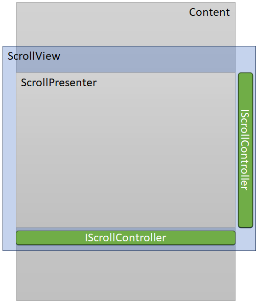
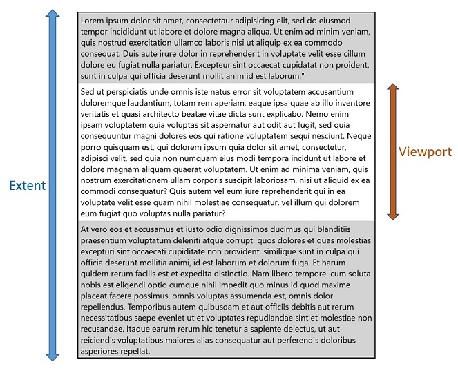
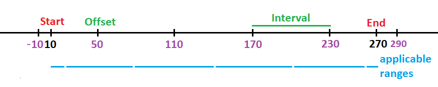
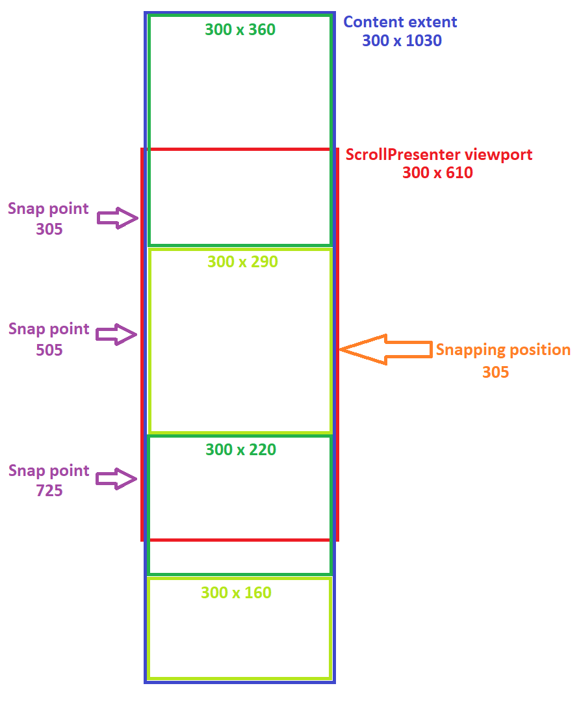
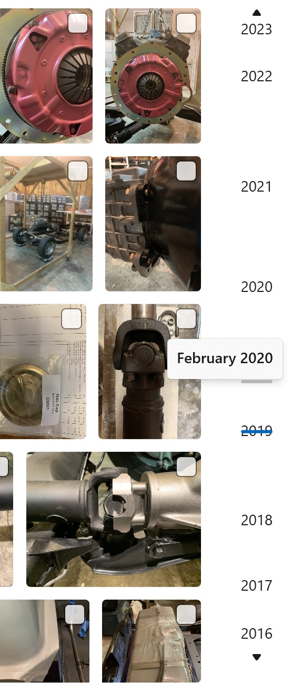
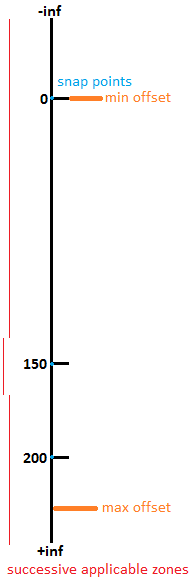

ScrollPresenter & IScrollController API spec
===

## Table of Contents

- [Background](#background)
- [Conceptual pages (How To)](#conceptual-pages-how-to)
  - [Overview](#overview)
  - [ScrollView versus ScrollPresenter](#scrollview-versus-scrollpresenter)
  - [Snap points examples](#snap-points-examples)
    - [Setting horizontal repeated snap points](#setting-horizontal-repeated-snap-points)
    - [Setting vertical irregular snap points](#setting-vertical-irregular-snap-points)
    - [Setting repeated zoom snap points](#setting-repeated-zoom-snap-points)
    - [Setting irregular zoom snap points](#setting-irregular-zoom-snap-points)
  - [Custom scroll controller example](#custom-scroll-controller-example)
  - [IScrollController overview](#iscrollcontroller-overview)
  - [ScrollPresenter and IScrollController division of responsibilities](#scrollpresenter-and-iscrollcontroller-division-of-responsibilities)
  - [Step-by-step ScrollPresenter and IScrollController interations when performing a scroll](#step-by-step-scrollpresenter-and-iscrollcontroller-interations-when-performing-a-scroll)
    - [Panning the ScrollPresenter content with touch/pen](#panning-the-scrollpresenter-content-with-touchpen)
    - [Panning the IScrollController thumb with touch/pen](#panning-the-iscrollcontroller-thumb-with-touchpen)
    - [Dragging the IScrollController thumb with mouse](#dragging-the-iscrollcontroller-thumb-with-mouse)
- [API pages](#api-pages)
  - [ScrollPresenter class](#scrollpresenter-class)
  - [ScrollPresenter.HorizontalSnapPoints property](#scrollpresenterhorizontalsnappoints-property)
    - [Property Value](#property-value)
    - [Example](#example)
  - [ScrollPresenter.VerticalSnapPoints property](#scrollpresenterverticalsnappoints-property)
    - [Property Value](#property-value-1)
    - [Example](#example-1)
  - [ScrollPresenter.ZoomSnapPoints property](#scrollpresenterzoomsnappoints-property)
    - [Property Value](#property-value-2)
    - [Example](#example-2)
  - [ScrollPresenter.HorizontalScrollController property](#scrollpresenterhorizontalscrollcontroller-property)
    - [Property Value](#property-value-3)
    - [Example](#example-3)
  - [ScrollPresenter.VerticalScrollController property](#scrollpresenterverticalscrollcontroller-property)
    - [Property Value](#property-value-4)
    - [Example](#example-4)
  - [IScrollController interface](#iscrollcontroller-interface)
  - [IScrollController.CanScroll property (Boolean)](#iscrollcontrollercanscroll-property-boolean)
    - [Remarks](#remarks)
  - [IScrollController.IsScrollingWithMouse property (Boolean)](#iscrollcontrollerisscrollingwithmouse-property-boolean)
    - [Remarks](#remarks-1)
  - [IScrollController.SetIsScrollable method](#iscrollcontrollersetisscrollable-method)
    - [Remarks](#remarks-2)
  - [IScrollController.SetValues method](#iscrollcontrollersetvalues-method)
    - [Remarks](#remarks-3)
  - [IScrollController.GetScrollAnimation method](#iscrollcontrollergetscrollanimation-method)
    - [Remarks](#remarks-4)
  - [IScrollController.NotifyRequestedScrollCompleted method](#iscrollcontrollernotifyrequestedscrollcompleted-method)
    - [Remarks](#remarks-5)
  - [IScrollController.CanScrollChanged event](#iscrollcontrollercanscrollchanged-event)
    - [Remarks](#remarks-6)
  - [IScrollController.IsScrollingWithMouseChanged event](#iscrollcontrollerisscrollingwithmousechanged-event)
    - [Remarks](#remarks-7)
  - [IScrollController.ScrollToRequested event](#iscrollcontrollerscrolltorequested-event)
    - [Remarks](#remarks-8)
  - [IScrollController.ScrollByRequested event](#iscrollcontrollerscrollbyrequested-event)
    - [Remarks](#remarks-9)
  - [IScrollController.AddScrollVelocityRequested event](#iscrollcontrolleraddscrollvelocityrequested-event)
    - [Remarks](#remarks-10)
  - [IScrollControllerPanningInfo interface](#iscrollcontrollerpanninginfo-interface)
  - [IScrollController.PanningInfo property (IScrollControllerPanningInfo)](#iscrollcontrollerpanninginfo-property-iscrollcontrollerpanninginfo)
    - [Property Value](#property-value-5)
  - [IScrollControllerPanningInfo.PanningElementAncestor property (UIElement)](#iscrollcontrollerpanninginfopanningelementancestor-property-uielement)
    - [Remarks](#remarks-11)
  - [IScrollControllerPanningInfo.IsRailEnabled property (Boolean)](#iscrollcontrollerpanninginfoisrailenabled-property-boolean)
    - [Remarks](#remarks-12)
  - [IScrollControllerPanningInfo.PanOrientation property (Orientation)](#iscrollcontrollerpanninginfopanorientation-property-orientation)
    - [Remarks](#remarks-13)
  - [IScrollControllerPanningInfo.SetPanningElementExpressionAnimationSources method](#iscrollcontrollerpanninginfosetpanningelementexpressionanimationsources-method)
    - [Remarks](#remarks-14)
  - [IScrollControllerPanningInfo.PanRequested event](#iscrollcontrollerpanninginfopanrequested-event)
    - [Remarks](#remarks-15)
  - [IScrollControllerPanningInfo.Changed event](#iscrollcontrollerpanninginfochanged-event)
    - [Remarks](#remarks-16)
  - [ScrollControllerScrollToRequestedEventArgs class](#scrollcontrollerscrolltorequestedeventargs-class)
  - [ScrollControllerScrollByRequestedEventArgs class](#scrollcontrollerscrollbyrequestedeventargs-class)
  - [ScrollControllerAddScrollVelocityRequestedEventArgs class](#scrollcontrolleraddscrollvelocityrequestedeventargs-class)
  - [ScrollControllerPanRequestedEventArgs class](#scrollcontrollerpanrequestedeventargs-class)
- [API Details](#api-details)
  - [Shared enumerations and structures between `ScrollView` and `ScrollPresenter`](#shared-enumerations-and-structures-between-scrollview-and-scrollpresenter)
  - [`ScrollPresenter` enumeration](#scrollpresenter-enumeration)
  - [Shared method argument classes between `ScrollView` and `ScrollPresenter`](#shared-method-argument-classes-between-scrollview-and-scrollpresenter)
  - [Shared event argument classes between `ScrollView` and `ScrollPresenter`](#shared-event-argument-classes-between-scrollview-and-scrollpresenter)
  - [Snap points related classes](#snap-points-related-classes)
  - [IScrollController interface and related classes](#iscrollcontroller-interface-and-related-classes)
  - [`ScrollPresenter` class](#scrollpresenter-class-1)
- [Appendix](#appendix)
  - [Related Documents](#related-documents)
  - [Sample IScrollController implementations](#sample-iscrollcontroller-implementations)
    - [IScrollController implementation without panning element](#iscrollcontroller-implementation-without-panning-element)
    - [Simple IScrollController implementation with a panning element](#simple-iscrollcontroller-implementation-with-a-panning-element)
    - [IScrollController implementation with a panning element](#iscrollcontroller-implementation-with-a-panning-element)
  - [Additional examples](#additional-examples)
    - [Setting vertical repeated snap points](#setting-vertical-repeated-snap-points)
    - [Using a custom IScrollController implementation in the ScrollView control template](#using-a-custom-iscrollcontroller-implementation-in-the-scrollview-control-template)
  - [Future Supported Features with known scenarios](#future-supported-features-with-known-scenarios)
    - [Support for optional snap points](#support-for-optional-snap-points)
    - [Example: Setting ScrollPresenter snap points with custom applicable range](#example-setting-scrollpresenter-snap-points-with-custom-applicable-range)
    - [Support for very large extents and offsets](#support-for-very-large-extents-and-offsets)

# Background

_Spec note:_
_Full Summary, Rationale, and High-Level Plan in the proposal on GitHub:
[A more flexible ScrollViewer](https://github.com/Microsoft/microsoft-ui-xaml/issues/108)._

Xaml has a
[ScrollViewer](https://docs.microsoft.com/windows/windows-app-sdk/api/winrt/Microsoft.UI.Xaml.Controls.ScrollViewer)
control that's use for scrolling large regions of content, such as
[ListView](https://docs.microsoft.com/windows/windows-app-sdk/api/winrt/Microsoft.UI.Xaml.Controls.ListView).
Behind `ScrollViewer` (but public) is typically a `ScrollContentPresenter` and two `ScrollBars`.
Behind those is `DManip` manipulation tech.

For example the following shows a large text block that wraps horizontally and scrolls vertically:

XAML
```xml
<Page xmlns="http://schemas.microsoft.com/winfx/2006/xaml/presentation">
    <ScrollViewer>
        <TextBlock Text="{x:Bind AllTheText}" TextWrapping="Wrap" />
    </ScrollViewer>
</Page>
```


`ScrollViewer` is being replaced by a new [`ScrollView`](ScrollView-spec.md) (note no "er" at the end).
Behind `ScrollView` (and again public) is typically a `ScrollPresenter` and `IScrollControllers`,
and these latter two are the subject of this spec.
Behind those, rather than `DManip`, is
[InteractionTracker](https://docs.microsoft.com/windows/windows-app-sdk/api/winrt/Microsoft.UI.Composition.Interactions.InteractionTracker)
manipulation tech.



|   | Current | New
-|-|-
Primary control | [ScrollViewer](https://docs.microsoft.com/uwp/api/Windows.UI.Xaml.Controls.ScrollViewer) | `ScrollView`
Primitive scroller | [ScrollContentPresenter](https://docs.microsoft.com/uwp/api/Windows.UI.Xaml.Controls.ScrollContentPresenter) | `ScrollPresenter` (this spec)
Scroller | [ScrollBar](https://docs.microsoft.com/windows/windows-app-sdk/api/winrt/Microsoft.UI.Xaml.Controls.Primitives.ScrollBar) | `IScrollController` (this spec)

`ScrollPresenter` is similar to the `ScrollContentPresenter` used in the old `ScrollViewer` control
template as it applies the clipping, translation and scaling of the `ScrollView` content.
It is present in the `ScrollView`'s default control template alongside the two `ScrollBar` controls.

Contrary to the old `ScrollContentPresenter` element though, the `ScrollPresenter` is a fully functional
and reusable primitive component with a public object model that is very similar to the `ScrollView`
object model.
In most cases, the `ScrollView` control merely forwards an API call to the identical API of its
inner `ScrollPresenter`.

The typical usage of a `ScrollPresenter` is that of a building block for a more complex control,
like the `ScrollView`.

Here the `ScrollPresenter` is used as part of a scrolling/zooming control which
employs custom UI widgets to control the translation and scale in lieu of two scrollbars.

XAML
```xml
<UserControl
    x:Class="AcmeApp.MyScroller"
    xmlns=http://schemas.microsoft.com/winfx/2006/xaml/presentation>
    <Grid>
        <ScrollPresenter x:Name="scrollPresenter"/>
        <acme:ScrollController x:Name="scrollController" HorizontalAlignment="Right"/>
        <acme:ZoomController x:Name="zoomController" HorizontalAlignment="Right" VerticalAlignment="Top"/>
    </Grid>
</UserControl>
```

It can be used as a top level element too, as in the following example.

XAML
```xml
<Page
    xmlns=http://schemas.microsoft.com/winfx/2006/xaml/presentation>
    <ScrollPresenter Width="500" Height="400" Background="Beige">
        <TextBlock Text="{x:Bind AllTheText}" TextWrapping="Wrap"/>
    </ScrollPresenter>
</Page>
```


# Conceptual pages (How To)

## Overview

`ScrollPresenter` is a container control that lets the user scroll (and pan), and zoom its content.

A `ScrollPresenter` enables content to be displayed in a smaller area than its actual size. The user
can use touch to pan and zoom the content, the mouse wheel to scroll it, or the Control key and mouse
wheel to zoom it.

The area that includes all of the content of the `ScrollPresenter` is the *extent*. The visible area of
the content is the *viewport*.



The `ScrollPresenter` can be used as a primitive building block for controls like the `ScrollView` which
adds the default user interaction widgets (scrollbars, scroll indicator, etc.) and policy.
Indeed the `ScrollView` defined in the [separate spec](ScrollView-spec.md) uses a `ScrollPresenter` as
part of its implementation (in its `ControlTemplate`).

Contrary to the `ScrollView`, which is a `Control`, the `ScrollPresenter` is a `FrameworkElement` and
as such it does not receive keyboard focus. Its parent `ScrollView` has the
built-in logic to decide whether to scroll the viewport or move focus in response to a key event.

The `ScrollPresenter` does not impose any particular policy.
Again it is the parent `ScrollView` that sets the properties on its inner `ScrollPresenter`
to values chosen to match common usage,
for example the basic `<ScrollView/>` is configured for vertical scrolling.


## ScrollView versus ScrollPresenter

This section lists the differences between the `ScrollPresenter` and `ScrollView` elements:

| **Characteristic**                                                   | **ScrollPresenter**                                         | **ScrollView**                                         |
|----------------------------------------------------------------------|-------------------------------------------------------------|--------------------------------------------------------|
| Namespace                                                            | Microsoft.UI.Xaml.Controls.Primitives                       | Microsoft.UI.Xaml.Controls                             |
| Base class                                                           | FrameworkElement                                            | Control                                                |
| Chrome                                                               | Has no chrome                                               | Has chrome with 2 scrollbars                           |
| Policy                                                               | Does not set policy (ex: no particular content orientation) | Sets policy (ex: default vertical content orientation) |
| Keyboard handling                                                    | No                                                          | Yes                                                    |
| IScrollAnchorProvider interface implementation                       | Yes                                                         | No                                                     |
| Background property                                                  | Yes                                                         | No                                                     |
| CurrentAnchor property                                               | No                                                          | Yes                                                    |
| ScrollBar visibility properties                                      | No                                                          | Yes                                                    |
| Horizontal/vertical IScrollController properties                     | Yes                                                         | No                                                     |
| RegisterAnchorCandidate/UnregisterAnchorCandidate methods            | No                                                          | Yes                                                    |
| ScrollPresenter + ScrollPresenterProperty dependency property        | No                                                          | Yes                                                    |
| Horizontal/vertical/zoom snap points collection properties           | Yes                                                         | No                                                     |


These are the APIs that are common between the two elements. The `ScrollView` simply delegates
those API calls to its inner `ScrollPresenter`.

| **Type**            | **Name**                             |
|---------------------|--------------------------------------|
| Property            | Content                              |
| Property            | ExpressionAnimationSources           |
| Property            | HorizontalOffset                     |
| Property            | VerticalOffset                       |
| Property            | ZoomFactor                           |
| Property            | ExtentWidth                          |
| Property            | ExtentHeight                         |
| Property            | ViewportWidth                        |
| Property            | ViewportHeight                       |
| Property            | ScrollableWidth                      |
| Property            | ScrollableHeight                     |
| Property            | ContentOrientation                   |
| Property            | HorizontalScrollChainMode            |
| Property            | VerticalScrollChainMode              |
| Property            | HorizontalScrollRailMode             |
| Property            | VerticalScrollRailMode               |
| Property            | HorizontalScrollMode                 |
| Property            | VerticalScrollMode                   |
| Property            | ComputedHorizontalScrollMode         |
| Property            | ComputedVerticalScrollMode           |
| Property            | ZoomChainMode                        |
| Property            | ZoomMode                             |
| Property            | IgnoredInputKinds                    |
| Property            | MinZoomFactor                        |
| Property            | MaxZoomFactor                        |
| Property            | State                                |
| Property            | HorizontalAnchorRatio                |
| Property            | VerticalAnchorRatio                  |
| Method              | ScrollTo                             |
| Method              | ScrollBy                             |
| Method              | AddScrollVelocity                    |
| Method              | ZoomTo                               |
| Method              | ZoomBy                               |
| Method              | AddZoomVelocity                      |
| Event               | ExtentChanged                        |
| Event               | StateChanged                         |
| Event               | ViewChanged                          |
| Event               | ScrollAnimationStarting              |
| Event               | ZoomAnimationStarting                |
| Event               | ScrollCompleted                      |
| Event               | ZoomCompleted                        |
| Event               | BringingIntoView                     |
| Event               | AnchorRequested                      |


This document will primarily focus on the `ScrollPresenter` aspects that are not present at the
`ScrollView` level. The [ScrollView spec](ScrollView-spec.md) can be referenced for the common APIs.

## Snap points examples

The `ScrollPresenter` element exposes three collections to set scroll and zoom snap points.
(A snap point is a position that is a natural stopping place for scrolling or zooming to land on.)

| **Type**                                                    | **Snap points collection** |
|-------------------------------------------------------------|----------------------------|
| Windows.Foundation.Collections.IVector<ScrollSnapPointBase> | HorizontalSnapPoints       |
| Windows.Foundation.Collections.IVector<ScrollSnapPointBase> | VerticalSnapPoints         |
| Windows.Foundation.Collections.IVector<ZoomSnapPointBase>   | ZoomSnapPoints             |

At the end of a scroll inertia (for example the scrolling that continues briefly after touch input),
the `ScrollPresenter`'s `HorizontalOffset` property will land at a value which depends on the
`HorizontalSnapPoints` collection (same for `VerticalOffset` and `VerticalSnapPoints`).
Likewise, at the end of a zoom inertia, the `ScrollPresenter`'s `ZoomFactor` property will land at
a value which depends on the `ZoomSnapPoints` collection.

Two types of scroll snap points exist, and they both derive from `ScrollSnapPointBase`: `ScrollSnapPoint`
and `RepeatedScrollSnapPoint`.

A `ScrollSnapPoint` is a single point characterized by an alignment and value.
The alignment enumeration of `Near`, `Center` or `Far` indicates where the snap point is located in
relation to the viewport.
For example, for a horizontal snap point, the `Near` alignment corresponds to the left edge of the viewport.
`Center` means the middle of the viewport, and finally `Far` means the right edge.

A `RepeatedScrollSnapPoint` defines multiple equidistant points.
It is characterized by an alignment, an interval, an offset, a start and end.
The interval determines the equidistance between two successive points.
The points are shifted from 0 by an amount defined by the offset.
The start and end define a domain in which the snap points are effective.
They are in relation to the near side of the scrollable content, and can be set to large
negative and positive values respectively to effectively define an infinite domain.

### Setting horizontal repeated snap points

In this example, a horizontal repeated snap point is defined at values -10, 50, 110, 170, 230 and 290.



The natural rest point is defined as the landing point after inertia if no snap points were present.
That natural rest point defines which snap point value is activated.
In this case, if the natural rest point is before the `start` 10 or after the `end` 270,
no snap point value is activated and inertia carries on without the influence of the repeated snap point.
If however the natural rest point is in the \[10, 270\] domain,
the closest snap point value to the natural rest point is activated.
For example if the natural rest point is 95, the final `HorizontalOffset` property will be 110 instead of 95.
Because the provided `alignment` is Near, the snap point values align with the left edge of the `ScrollPresenter`.
The applicable ranges, or attraction zones, of the snap point values -10, 50, 110, 170, 230, 290 are
respectively \[10, 20\], (20, 80\], (80, 140\], (140, 200\], (200, 260\] and (260, 270\].
If an activated horizontal snap point value is out-of-bounds, i.e. smaller than 0 or greater than `ScrollableWidth`,
the content will first animate to that out-of-bounds position then animate back to the closest in-bounds position.

Note that \[A, B\] identifies the numerical range A to B where A and B are included, while (A, B\] identifies a
range where A is excluded.

C#
```cs
RepeatedScrollSnapPoint snapPoint =
    new RepeatedScrollSnapPoint(
        offset: 50,
        interval: 60,
        start: 10,
        end: 270,
        alignment: ScrollSnapPointsAlignment.Near);
myScrollPresenter.HorizontalSnapPoints.Add(snapPoint);
```


### Setting vertical irregular snap points

This example showcases a vertical StackPanel in a `ScrollPresenter`.
That panel has 4 chidren elements of variable heights,
each of them being assigned a snap point so that their center snaps vertically to the center of the viewport
as much as possible.



The viewport is 610px tall, the 4 children are 360px, 290px, 220px and 160px tall.
Since the desired alignment is `Center`, the content snap points will align to the middle of the viewport,
at position 610/2=305px.
The ideal snap points for the 4 children are respectively at positions 180, 505, 760 and 950 from the top
of the `StackPanel`.
Without the restriction of the content staying in-bounds, the 4 children's center would align with the
viewport's center.
The content extent being 1030px tall, the `ScrollPresenter`'s `VerticalOffset` property can vary from 0 to
`ScrollableHeight` = 1030 - 610 = 420.
To avoid the content first animating out-of-bounds and then animating in-bounds,
the snap points can be moved to 305, 505, 725 and 725.
Only the second child is not affected by boundary restrictions.
The two last children get the same snap point at position 725.

C#
```cs
ScrollSnapPoint snapPoint1 = new ScrollSnapPoint(
    value: 305, alignment: ScrollSnapPointsAlignment.Center);

ScrollSnapPoint snapPoint2 = new ScrollSnapPoint(
    value: 505, alignment: ScrollSnapPointsAlignment.Center);

ScrollSnapPoint snapPoint3 = new ScrollSnapPoint(
    value: 725, alignment: ScrollSnapPointsAlignment.Center);

myScrollPresenter.VerticalSnapPoints.Add(snapPoint1);
myScrollPresenter.VerticalSnapPoints.Add(snapPoint2);
myScrollPresenter.VerticalSnapPoints.Add(snapPoint3);
```

The applicable ranges, or attraction zones, for snapPoint1,
snapPoint2 and snapPoint3 are (-inf, 405\], (405, 615\] and (615, +inf).
So for example, if the natural rest point at the beginning of an inertial phase is 600,
the `HorizontalOffset` will animate to the snap point 505 instead.


### Setting repeated zoom snap points

A `RepeatedZoomSnapPoint` is set on the `ScrollPresenter` in order to have its `ZoomFactor` snap to
values 0.1, 0.2, 0.3, etc... at the end of an inertial zoom.

C#
```cs
RepeatedZoomSnapPoint snapPoint =
    new RepeatedZoomSnapPoint(
        offset: 0,
        interval: 0.1,
        start: 0,
        end: myScrollPresenter.MaxZoomFactor);
myScrollPresenter.ZoomSnapPoints.Add(snapPoint);
```

### Setting irregular zoom snap points

In this case the goal is to set zoom snap points at values 0.15, 0.3, 0.6, 1.2, 2.4, 4.8 and 9.6.
Seven individual `ZoomSnapPoint` instances are added to the `ZoomSnapPoints` collection:

C#
```cs
for (double snapPointValue = 0.15; snapPointValue < 10.0; snapPointValue *= 2.0)
{
    myScrollPresenter.ZoomSnapPoints.Add(new ZoomSnapPoint(snapPointValue));
}
```


## Custom scroll controller example

The `ScrollPresenter`'s `HorizontalScrollController` and `VerticalScrollController` properties
allow the owning `ScrollView` control to use custom scrollbar widgets instead of the default
`ScrollBar` controls.

| **Type**                                                | **Scroll controller properties** |
|---------------------------------------------------------|----------------------------------|
| Microsoft.UI.Xaml.Controls.Primitives.IScrollController | HorizontalScrollController       |
| Microsoft.UI.Xaml.Controls.Primitives.IScrollController | VerticalScrollController         |

Those widgets need to implement the `IScrollController` interface which standardizes the communication
between the `ScrollPresenter` and its 2 scroll controllers.
In this example, the vertical `ScrollBar` found in a `ScrollView`'s default control template is hidden
and replaced with a timeline scrubber in a Photos Gallery application: an `AnnotatedScrollBar` control.
The `AnnotatedScrollBar` presents a timeline for the photos being scrolled through vertically.
The default horizontal `ScrollBar` is left intact.



`AnnotatedScrollBar.ScrollController` is a read-only property of type `IScrollController`.

C#
```cs
myScrollView.VerticalScrollBarVisibility = ScrollingScrollBarVisibility.Hidden;
myScrollView.ScrollPresenter.VerticalScrollController = myAnnotatedScrollBar.ScrollController;
```


## IScrollController overview

A component that implements the `IScrollController` interface can be hooked up with a `ScrollPresenter`
through the `ScrollPresenter.HorizontalScrollController` or `ScrollPresenter.VerticalScrollController`
property. At that point, it can participate in defining the scroll offset, either horizontal or vertical,
of that `ScrollPresenter`. The component can either have a UI or be linked to a UI piece.

`IScrollController` implementations fall into two buckets: the ones that support UI-thread-independent
panning, and those that do not. The former are characterized by returning a non-null
`IScrollController.PanningInfo.PanningElementAncestor` property value (of type `UIElement`). The latter
are characterized by returning a null `IScrollController.PanningInfo` or
`IScrollController.PanningInfo.PanningElementAncestor` property value.

A `IScrollController` typically includes a manipulatable UI piece, called thumb in the remainder of this
document, used to scroll the `ScrollPresenter` content.

A UI-thread-independent panning, once initiated, allows both the `ScrollPresenter` content and that thumb
to move in sync without the UI-thread's involvement.


## ScrollPresenter and IScrollController division of responsibilities

When UI-thread-independent panning is supported, as explained in the [overview](#iscrollcontroller-overview),
two Composition `IVisual` instances are involved:
- one for the manipulatable thumb,
- one for an ancestor element, called the thumb track in the remainder of this document.

The former remains internal to the `IScrollController` implementation, while the latter is handed off
to the `ScrollPresenter` via the `IScrollController.PanningInfo.PanningElementAncestor` property.

The Composition `InteractionTracker` component used behind the scene does not support using the same
`IVisual` instance for the manipulatable thumb and thumb track. Thus two `UIElement` instances must be
involved, one being an ancestor of the other.

The `ScrollPresenter` creates two `VisualInteractionSource` instances:
- one with the `IVisual` of its `Content` (of type `UIElement`),
- one with the `IVisual` of the `PanningElementAncestor` (the thumb track of type `UIElement`).

By calling `VisualInteractionSource.TryRedirectForManipulation`, one of those two can drive the panning:

- The user can either initiate a panning by touching the `Content` element - the first
`VisualInteractionSource` instance drives the pan.

- Or the user can initiate a panning by touching the `PanningElementAncestor` element (thumb track)
or its thumb child - the second `VisualInteractionSource` instance drives the pan. The
`IScrollController` implementation is in charge of defining which `UIElement` (thumb track or thumb)
needs to be touched to initiate a pan.

In short, whichever `VisualInteractionSource` instance calls `TryRedirectForManipulation` first to
track a pointer drives the pan.
The underlying `InteractionTracker` has a built-in feature and resulting user experience:

_Scenario A:_
- finger #1 starts a pan with `VisualInteractionSource` #1.
- finger #2 touches `VisualInteractionSource` #2 without moving.
Result: The `InteractionTracker` freezes its output transform while finger #2 is down.
- finger #2 is lifted.
Result: The `InteractionTracker` unfreezes its output transform and tracks finger #1 again.

_Scenario B:_
- finger #1 starts a pan with `VisualInteractionSource` #1.
- finger #2 touches `VisualInteractionSource` #2 and moves.
Result: The `InteractionTracker` permanently stops tracking both fingers #1 and #2.

In both scenarios, `VisualInteractionSource` #1 and `VisualInteractionSource` #2 can be associated
with the `Content` and `PanningElementAncestor` or vice-versa.

As far as dragging the scroll controller's thumb with the mouse is concerned, similar rules apply:
- While the user drags the thumb with the mouse, the `IScrollController.IsScrollingWithMouse` property
returns `True`. This prevents the `ScrollPresenter` from calling `VisualInteractionSource.TryRedirectForManipulation`
when the user contacts its `Content`. The finger or pen cannot interfere with the mouse-driven drag
because the drag started first.
- While the user pans the `ScrollPresenter.Content` (with a finger or pen contacting), any attempt
to drag the thumb with the mouse has no effect. Indeed, the underlying `InteractionTracker` has a
built-in feature that prevents offset change requests from having an effect while the content is
being panned.

Lets consider the horizontal scrolling orientation alone. The `ScrollPresenter`, `ScrollView` and
`IScrollController` responsibilities can be listed as follows:

`ScrollPresenter`:
- Creates a `VisualInteractionSource` instance for `ScrollPresenter.Content`.
- Sets it up based on `ComputedHorizontalScrollMode`, `HorizontalScrollRailMode` and `HorizontalScrollChainMode`.
- Creates a `VisualInteractionSource` instance for `IScrollController.PanningInfo.PanningElementAncestor`.
- Sets it up based on `IScrollController.PanningInfo.PanOrientation`, `IScrollController.PanningInfo.IsRailEnabled`.
- Creates a Composition `CompositionPropertySet` with 4 scalar properties and hands it off to the `IScrollController`
through `IScrollController.PanningInfo.SetPanningElementExpressionAnimationSources`.
  * The `InteractionTracker`'s `Position` animates an offset scalar.
  * The `InteractionTracker`'s `MinPosition` and `MaxPosition` animate minOffset and maxOffset scalars.
  * The fourth scalar, written by the `IScrollController`, is read to apply a relative speed of the
  `Content` compared to the finger movement over `PanningElementAncestor`.
- Invokes `VisualInteractionSource.TryRedirectForManipulation` when `IScrollController.PanningInfo.PanRequested`
is raised.
- Indicates whether scrolling through user gestures is enabled or not based on `ComputedHorizontalScrollMode`
via `IScrollController.SetIsScrollable`.
- Provides viewport & content sizing and offset information via `IScrollController.SetValues` which are used in
UI-thread-dependent scenarios and to compute the relative speed.
- Responds to `IScrollController`'s `ScrollToRequested`, `ScrollByRequested` and `AddScrollVelocityRequested`
events by:
  * potentially coalescing the request with a prior one, if it has not been handed off to the
  `InteractionTracker` yet.
  * providing a `correlationId` for the request.
  * asynchronously requesting an optional Composition animation to apply to a `ScrollToRequested`
  or `ScrollByRequested` animated scroll, via `IScrollController.GetScrollAnimation` (using the
  same `correlationId`).
  * handing off the request to the `InteractionTracker`.
  * notifying that the request completed via `IScrollController.NotifyRequestedScrollCompleted`
  (using the same `correlationId`).
- Initiates panning of its `Content` when it is contacted, unless `IScrollController.IsScrollingWithMouse`
returns `True`.

`ScrollView`:
- Listens to the `IScrollController.CanScrollChanged` event and reads `CanScroll` to re-evaluate its
`ComputedHorizontalScrollBarVisibility` property and potentially show/hide its
PART_HorizontalScrollBar and PART_ScrollBarsSeparator parts.
- Listens to the `IScrollController.IsScrollingWithMouseChanged` event and reads `IsScrollingWithMouse`
to manage its potential auto-hiding scroll controllers' visibility during a UI-thread-dependent scroll.


`IScrollController`:
- Indicates its ability to perform user gestures to scroll or pan through the `IScrollController.CanScroll`
property and `CanScrollChanged` event.
- Indicates whether it is performing a mouse-driven UI-thread-dependent scroll or not via the
`IScrollController.IsScrollingWithMouse` property and `IScrollController.IsScrollingWithMouseChanged`
event.
- Raises the `IScrollController`'s `ScrollToRequested`, `ScrollByRequested` or `AddScrollVelocityRequested`
event when the user drags the thumb, or clicks on buttons to perform small or large offset changes.
- As part of the `ScrollToRequested` and `ScrollByRequested` requests, it indicates:
  * whether it desires an animated scroll or a direct jump (The Windows Settings' application toggle
  labeled "Animation effects" may overwrite the preference for an animated scroll),
  * whether snap points must be applied or not. This allows different user gestures to apply or ignore
  snap points. For example, dragging the thumb typically ignores the snap points. But an `IScrollController`
  implementation UI may provide buttons to perform small or large offset increments which may opt into
  applying the snap points.
- Optionally customizes the default Composition animation applied by the `ScrollPresenter` when requesting
an animated scroll. Or optionally builds and provides a new Composition animation. The
`IScrollController.GetScrollAnimation` method is used for that purpose.
- When it does not support UI-thread-independent pans:
  * Handles the `IScrollController.SetValues` method calls to update the position and length of its thumb.
- When it supports UI-thread-independent pans:
  * Provides the thumb track element through the `IScrollController.PanningInfo.PanningElementAncestor`
  property.
  * Defines which UI element must be contacted to initiate a pan. It can be the thumb track (like in
  the `AnnotatedScrollBar` case) or the thumb in the more typical scrollbar case.
  * Requests a pan initiation by raising its `IScrollController.PanningInfo.PanRequested` event when
  that UI element is contacted with touch or pen.
  * Writes into the `CompositionPropertySet` scalar named `multiplierPropertyName` to indicate the relative
  speed between the finger over the scroll controller driving the pan and the `ScrollPresenter.Content`.
  That property set is provided by the `ScrollPresenter` through
  `IScrollController.PanningInfo.SetPanningElementExpressionAnimationSources`.
  The relative speed scalar must be updated whenever `IScrollController.SetValues` is invoked.
  * Creates a Composition expression animation to position its thumb based on the 4 scalars in the
  property set.


## Step-by-step ScrollPresenter and IScrollController interations when performing a scroll

The three sections below detail the sequence of events for common scenarios involving a `ScrollPresenter`
and linked `IScrollController`. For simplicity, the descriptions assume there is only an `IScrollController`
for the horizontal orientation. It is also assumed that the horizontal scroll controller supports
independent panning.

### Panning the ScrollPresenter content with touch/pen

- The user contacts the `ScrollPresenter.Content` `UIElement` with a finger or pen.
- `ScrollPresenter` checks if `HorizontalScrollController.IsScrollingWithMouse` is `True`.
The contact is ignored if it is, otherwise it calls
`VisualInteractionSource.TryRedirectForManipulation(PointerPoint)` for the `VisualInteractionSource`
associated with the `Content`'s `IVisual`.
- As the pointer moves, the `InteractionTracker` raises its `ValuesChanged` event which causes
the `ScrollPresenter` to invoke `HorizontalScrollController.SetValues(...)`. The scroll controller's
`SetValues` processing does not take any action in this case though.
- At the same time, the `CompositionPropertySet` previously handed off to the scroll controller
with `HorizontalScrollController.PanningInfo.SetPanningElementExpressionAnimationSources(...)`
has an animated offset scalar and a relative speed scalar that drive the Composition expression
animation positioning the scroll controller's thumb. The scroll controller built that animation
when processing the `SetPanningElementExpressionAnimationSources` call.
- Simultaneously, the `InteractionTracker`'s animated `Position` moves the `ScrollPresenter.Content`.
- User lifts the contact and both the `ScrollPresenter.Content` and thumb stop moving in sync.


### Panning the IScrollController thumb with touch/pen

- The user contacts the scroll controller's thumb. It raises the `IScrollController.PanningInfo.PanRequested`
event.
- The `ScrollPresenter` handles that event by invoking
`VisualInteractionSource.TryRedirectForManipulation(PointerPoint)` for the `VisualInteractionSource`
associated with the `HorizontalScrollController.PanningInfo.PanningElementAncestor`'s `IVisual`.
- As the pointer moves, the `InteractionTracker` raises its `ValuesChanged` event which causes
the `ScrollPresenter` to invoke `HorizontalScrollController.SetValues(...)`. The scroll controller's
`SetValues` processing does not take any action in this case though.
- At the same time, the `CompositionPropertySet` previously handed off to the scroll controller
with `HorizontalScrollController.PanningInfo.SetPanningElementExpressionAnimationSources(...)`
has an animated offset scalar and a relative speed scalar that drive the Composition expression
animation positioning the scroll controller's thumb. The scroll controller built that animation
when processing the `SetPanningElementExpressionAnimationSources` call.
- Simultaneously, the `InteractionTracker`'s animated `Position` moves the `ScrollPresenter.Content`.
- The user lifts the contact and both the `ScrollPresenter.Content` and thumb stop moving in sync.


### Dragging the IScrollController thumb with mouse

- The user presses the mouse pointer on the scroll controller's thumb. The scroll controller
processes the `UIElement.PointerPressed` event by setting `IScrollController.IsScrollingWithMouse`
to `True` and raising `IScrollController.IsScrollingWithMouseChanged`.
The scroll controller's thumb uses `UIElement.ManipulationMode` set to `ManipulationModes.TranslateX` to
track the mouse pointer movement.
- As the mouse pointer moves, the scroll controller processes `UIElement.ManipulationDelta` events
to raise `IScrollController.ScrollToRequested` events for the `ScrollPresenter`.
- The `ScrollPresenter` internally invokes `ScrollTo` to fulfill the scroll controller's request.
- The `InteractionTracker` raises its `ValuesChanged` event which causes the `ScrollPresenter` to
invoke `HorizontalScrollController.SetValues(...)`. The scroll controller's `SetValues` processing
does not take any action in this case though.
- At the same time, the `CompositionPropertySet` previously handed off to the scroll controller
with `HorizontalScrollController.PanningInfo.SetPanningElementExpressionAnimationSources(...)`
has an animated offset scalar and a relative speed scalar that drive the Composition expression
animation positioning the scroll controller's thumb. The scroll controller built that animation
when processing the `SetPanningElementExpressionAnimationSources` call.
- At the same time, the `InteractionTracker`'s animated `Position` moves the `ScrollPresenter.Content`
off the UI-thread.
- The user releases the left mouse button and `UIElement.ManipulationCompleted` is raised. The scroll
controller resets its `IScrollController.IsScrollingWithMouse` property and raises
`IScrollController.IsScrollingWithMouseChanged`.


# API pages

## ScrollPresenter class

Provides primitive scroll and zoom supports for content.

Namespace: Microsoft.UI.Xaml.Controls.Primitives

C#
```cs
public class ScrollPresenter : Microsoft.UI.Xaml.FrameworkElement, Microsoft.UI.Xaml.Controls.IScrollAnchorProvider
```

## ScrollPresenter.HorizontalSnapPoints property

Gets the collection of snap points affecting the `ScrollPresenter.HorizontalOffset` property.

C#
```cs
public System.Collections.Generic.IList<ScrollSnapPointBase> HorizontalSnapPoints { get; }
```

### Property Value

This collection is empty by default. Horizontal snap points cause the `HorizontalOffset` property to
settle at deterministic values at the end of inertia.

### Example

In this example, the `ScrollPresenter.HorizontalOffset` property lands at value 500.0 or 1500.0,
whichever is closest to the position where the content would have stopped without the presence of
snap points.

C#
```cs
ScrollSnapPoint snapPoint1 = new ScrollSnapPoint(value: 500.0, alignment: ScrollSnapPointsAlignment.Near);
ScrollSnapPoint snapPoint2 = new ScrollSnapPoint(value: 1500.0, alignment: ScrollSnapPointsAlignment.Near);

myScrollPresenter.HorizontalSnapPoints.Add(snapPoint1);
myScrollPresenter.HorizontalSnapPoints.Add(snapPoint2);
```


## ScrollPresenter.VerticalSnapPoints property

Gets the collection of snap points affecting the `ScrollPresenter.VerticalOffset` property.

C#
```cs
public System.Collections.Generic.IList<ScrollSnapPointBase> VerticalSnapPoints { get; }
```

### Property Value

This collection is empty by default. Vertical snap points cause the `VerticalOffset` property to
settle at deterministic values at the end of inertia.

### Example

In this example, the `ScrollPresenter.VerticalOffset` property lands at value 500.0 or 1500.0,
whichever is closest to the position where the content would have stopped without the presence of
snap points.

C#
```cs
ScrollSnapPoint snapPoint1 = new ScrollSnapPoint(value: 500.0, alignment: ScrollSnapPointsAlignment.Near);
ScrollSnapPoint snapPoint2 = new ScrollSnapPoint(value: 1500.0, alignment: ScrollSnapPointsAlignment.Near);

myScrollPresenter.VerticalSnapPoints.Add(snapPoint1);
myScrollPresenter.VerticalSnapPoints.Add(snapPoint2);
```


## ScrollPresenter.ZoomSnapPoints property

Gets the collection of snap points affecting the `ScrollPresenter.ZoomFactor` property.

C#
```cs
public System.Collections.Generic.IList<ZoomSnapPointBase> ZoomSnapPoints { get; }
```

### Property Value

This collection is empty by default.
Zoom snap points cause the `ZoomFactor` property to settle at deterministic values at the end of inertia.

### Example

In this example, the `ScrollPresenter.ZoomFactor` property lands at value 2.5 or 5.0,
whichever is closest to the zoom factor where the content would have stopped without the presence of snap points.

C#
```cs
ZoomSnapPoint snapPoint1 = new ZoomSnapPoint(value: 2.5);
ZoomSnapPoint snapPoint2 = new ZoomSnapPoint(value: 5.0);

myScrollPresenter.ZoomSnapPoints.Add(snapPoint1);
myScrollPresenter.ZoomSnapPoints.Add(snapPoint2);
```

## ScrollPresenter.HorizontalScrollController property

Gets or sets the `IScrollController` implementation that can drive the horizontal scrolling of the
`ScrollPresenter`.

C#
```cs
public IScrollController HorizontalScrollController { get; set; }
```

### Property Value

The component that implements `IScrollController` is typically a UI control like a
[ScrollBar](https://docs.microsoft.com/windows/windows-app-sdk/api/winrt/Microsoft.UI.Xaml.Controls.Primitives.ScrollBar)
the user can interact with to control the scrolling offset in one direction.
The default `HorizontalScrollController` property value is `null`.

### Example

C#
```cs
myScrollPresenter.HorizontalScrollController = myTimelineScrubber;
```

See [this section](#sample-iscrollController-implementations) for a couple of full `IScrollController`
implementation samples.

## ScrollPresenter.VerticalScrollController property

Gets or sets the `IScrollController` implementation that can drive the vertical scrolling of the
`ScrollPresenter`.

C#
```cs
public IScrollController VerticalScrollController { get; set; }
```

### Property Value

The component that implements `IScrollController` is typically a UI widget like a `ScrollBar` the
user can interact with to control the scrolling offset in one direction.
The default `VerticalScrollController` property value is `null`.

### Example

C#
```cs
myScrollPresenter.VerticalScrollController = myTimelineScrubber;
```

See [this section](#sample-iscrollController-implementations) for a couple of full `IScrollController`
implementation samples.


## IScrollController interface

The `ScrollPresenter` exposes two read-write properties of type `IScrollController` representing
optional scrollbar-like widgets that can participate in setting the scrolling offsets of the content.
Those widgets are the implementers of the `IScrollController` interface, while the `ScrollPresenter`
is the consumer.

Namespace: Microsoft.UI.Xaml.Controls.Primitives

Throughout the remainder of this interface description, the term `ScrollPresenter` is used,
but the consumer of the `IScrollController` interface is not necessarily a `ScrollPresenter`.
It may be some alternative scrolling control.

_Spec note:_
_By default the `ScrollView` control hosts two `ScrollBar` controls and it internally creates a bridge
between those scrollbars and its inner `ScrollPresenter` via the `IScrollController` interface.
This table shows when the `ScrollPresenter`'s potential snap points are applied when the user interacts
with those two scrollbars:_

| _User Action_                  | _OS animations turned on?_ | _Snap points applied?_ |
|--------------------------------|----------------------------|------------------------|
| _Clicking small change button_ | _Yes_                      | _Yes_                  |
| _Clicking large change button_ | _Yes_                      | _Yes_                  |
| _Dragging thumb_               | _Yes_                      | _No_                   |
| _Clicking small change button_ | _No_                       | _No_                   |
| _Clicking large change button_ | _No_                       | _No_                   |
| _Dragging thumb_               | _No_                       | _No_                   |


## IScrollController.CanScroll property (Boolean)

This read-only property indicates whether the user can perform scrolls or pans with the scroll controller.

C#
```cs
bool CanScroll { get; }
```

### Remarks

The scroll controller returns `False` for example when it is a disabled control, or is an adapter linked
to a disabled control.

When the `ScrollView`'s control template includes an `IScrollController` implementation, it accesses
this property to evaluate its `ComputedHorizontalScrollBarVisibility` and `ComputedVerticalScrollBarVisibility`
properties, as well as the visibility of its scroll controller separator element (Template
part named PART_ScrollBarsSeparator).
For example, when the `ScrollView.HorizontalScrollBarVisibility` property is `ScrollingScrollBarVisibility.Auto`
and the horizontal `IScrollController` implementation's `CanScroll` property returns `False`, the
`ComputedHorizontalScrollBarVisibility` property is set to `Visibility.Collapsed`.

The `IScrollController.CanScrollChanged` event must be raised when this property value changes.


## IScrollController.IsScrollingWithMouse property (Boolean)

This read-only property indicates whether the scroll controller is handling a mouse-driven scroll or not.

C#
```cs
bool IsScrollingWithMouse { get; }
```

### Remarks

A scroll controller may return `True` for example when the user is dragging a thumb with the mouse to
control the scrolling offset of the `ScrollPresenter`.

A UI-thread-independent pan performed with the [`PanningInfo`](#iscrollcontrollerpanninginfo-property-iscrollcontrollerpanninginfo)
property must not cause the `IsScrollingWithMouse` property to return `True` though. It would prevent
the user from being able to interrupt such a pan by touching the `ScrollPresenter`'s content.

The `ScrollView` control for example accesses this property to keep auto-hiding scroll controllers visible
during a user scroll.
(That auto-hiding behavior is dependent on the
[UISettings.AutoHideScrollBars](https://docs.microsoft.com/uwp/api/Windows.UI.ViewManagement.UISettings.AutoHideScrollBars)
property evaluation.)

When returning `True`, this property prevents the `ScrollPresenter` from initiating a new pan of its
content when the user touches it.

The `IScrollController.IsScrollingWithMouseChanged` event must be raised when this property value changes.


## IScrollController.SetIsScrollable method

Invoked to indicate whether the `ScrollPresenter` content is scrollable or not through user input.

C#
```cs
void SetIsScrollable(bool isScrollable)
```

### Remarks

For example, the `ScrollPresenter` calls `SetIsScrollable` with `isScrollable` set to `True` when
`ComputedHorizontalScrollMode` is `ScrollingScrollMode.Enabled` for a horizontal scroll controller
(or `ComputedVerticalScrollMode` is `ScrollingScrollMode.Enabled` for a vertical scroll controller).

An `IScrollController` implementation is expected to turn off its ability to scroll or pan through
user input when `isScrollable` is `False`.


## IScrollController.SetValues method

Invoked to provide dimension information to the scroll controller.

C#
```cs
void SetValues(double minOffset, double maxOffset, double offset, double viewportLength)
```

### Remarks

`minOffset` and `maxOffset` indicate the minimum and maximum offsets allowed for the relevant scrolling
orientation, at idle.
`offset` indicates the current offset value, which is not necessarily between those minimum and maximum
offsets because of overpan situations.
`viewportLength` indicates the length of the `ScrollPresenter`'s viewport.

The scroll controller can use those dimensions to adjust the length and position of a `UIElement`, for
example a draggable thumb.


## IScrollController.GetScrollAnimation method

Invoked to give the `IScrollController` the option of customizing the animation used to perform its
scroll request.

C#
```cs
CompositionAnimation GetScrollAnimation(
    int correlationId,
    Windows.Foundation.Numerics.Vector2 startPosition,
    Windows.Foundation.Numerics.Vector2 endPosition,
    Microsoft.UI.Composition.CompositionAnimation defaultAnimation)
```

### Remarks

The scroll controller can request a scroll that consumes a Composition animation by raising its
`ScrollToRequested` or `ScrollByRequested` event.
In response, the `ScrollPresenter` does not raise its `ScrollAnimationStarting` event.
Instead it invokes this `GetScrollAnimation` method asynchronously to give the scroll controller the
opportunity to customize the animation that is about to be launched.
The scroll controller is given the `correlationId` for the operation,
the current position of the content and default composition animation which is a `Vector3KeyFrameAnimation`
about to be launched by default.
The `correlationId` is the one provided earlier in `ScrollControllerScrollToRequestedEventArgs.CorrelationId`
or in `ScrollControllerScrollByRequestedEventArgs.CorrelationId`.
The scroll controller can then return:
- `null` or the `defaultAnimation`, unchanged or modified, to use that animation,
- or a brand-new custom animation.


## IScrollController.NotifyRequestedScrollCompleted method

Invoked to indicate that a scrolling operation initiated through a `ScrollToRequested`, `ScrollByRequested`
or `AddScrollVelocityRequested` event has completed.

C#
```cs
void NotifyRequestedScrollCompleted(int correlationId)
```

### Remarks

This method provides the operation's `correlationId` which was exposed earlier in
`ScrollControllerScrollToRequestedEventArgs.CorrelationId`, `ScrollControllerScrollByRequestedEventArgs.CorrelationId`
or `ScrollControllerAddScrollVelocityRequestedEventArgs.CorrelationId`.


## IScrollController.CanScrollChanged event

Event raised by the scroll controller when its `CanScroll` property value changes.

C#
```cs
event Windows.Foundation.TypedEventHandler<IScrollController, object> CanScrollChanged
```

### Remarks

The `ScrollView` control listens to this event to re-evaluate its `ComputedHorizontalScrollBarVisibility`
and `ComputedVerticalScrollBarVisibility` dependency properties, as well as the visibility of its scroll
controller separator element (Template part named PART_ScrollBarsSeparator).


## IScrollController.IsScrollingWithMouseChanged event

Event raised by the scroll controller when its `IsScrollingWithMouse` property value changes.

C#
```cs
event Windows.Foundation.TypedEventHandler<IScrollController, object> IsScrollingWithMouseChanged
```

### Remarks

The `ScrollView` control listens to this event to manage its potential auto-hiding scroll controllers'
visibility during a UI-thread-dependent mouse-driven scroll.

The auto-hiding behavior is set by the Windows Settings application's toggle labeled "Allows show scrollbars".


## IScrollController.ScrollToRequested event

Event raised by the scroll controller to request a scroll to a particular offset.

C#
```cs
event Windows.Foundation.TypedEventHandler<IScrollController, ScrollControllerScrollToRequestedEventArgs> ScrollToRequested
```

### Remarks

The `ScrollPresenter` handles the event and provides a correlation ID through
`ScrollControllerScrollToRequestedEventArgs.CorrelationId` for the operation that is about to start.
The scroll controller can for example make such a request when a thumb is dragged to a new position.

The `ScrollControllerScrollToRequestedEventArgs` instance provided with the `ScrollToRequested` event
exposes an `Options` property of type `Microsoft.UI.Xaml.Controls.ScrollingScrollOptions` that allows
the scroll controller to indicate whether an animated scroll is desired or not, and whether snap points
should be applied or not by the `ScrollPresenter`.

For example, when dragging the thumb of a built-in `ScrollView` scrollbar, the `ScrollToRequested` event
is raised with both animations and snap points disabled.

Different user gestures may apply or ignore snap points. An `IScrollController` implementation UI may
provide buttons to perform small or large offset increments which may opt into applying the snap points.

The `ScrollPresenter` responds to such a request by invoking its `ScrollTo` method internally.


## IScrollController.ScrollByRequested event

Event raised by the scroll controller to request a scroll by a particular offset delta.

C#
```cs
Windows.Foundation.TypedEventHandler<IScrollController, ScrollControllerScrollByRequestedEventArgs> ScrollByRequested
```

### Remarks

The scroll controller can request a scroll by a particular offset delta by raising its `ScrollByRequested`
event. The `ScrollPresenter` handles the event and provides a correlation ID through
`ScrollControllerScrollByRequestedEventArgs.CorrelationId` for the operation that is about to start.
The scroll controller can for example make such a request when a button is clicked to move a thumb
by an increment.

The `ScrollControllerScrollByRequestedEventArgs` instance provided with the `ScrollByRequested` event
exposes an `Options` property of type `Microsoft.UI.Xaml.Controls.ScrollingScrollOptions` that allows
the scroll controller to indicate whether an animated scroll is desired or not, and whether snap
points should be applied or not by the `ScrollPresenter`.

For example, when clicking an arrow button of a built-in `ScrollView` scrollbar, the `ScrollByRequested`
event is raised with both animations and snap points disabled when the "Animation effects" toggle
button is turned off in Windows' Settings application.

The `ScrollPresenter` responds to such a request by invoking its `ScrollBy` method internally.


## IScrollController.AddScrollVelocityRequested event

Event raised by the scroll controller to request a scroll velocity change.

C#
```cs
event Windows.Foundation.TypedEventHandler<IScrollController, ScrollControllerAddScrollVelocityRequestedEventArgs> AddScrollVelocityRequested
```

### Remarks

The scroll controller can request a scroll by adding velocity to the `ScrollPresenter` content through
the `AddScrollVelocityRequested` event.

For example, when clicking the track of a built-in `ScrollView` scrollbar, the `AddScrollVelocityRequested`
event is raised when the "Animation effects" toggle button is turned on in Windows' Settings application.

The `ScrollPresenter` responds to such a request by invoking its `AddScrollVelocity` method internally.


## IScrollControllerPanningInfo interface

Encapsulates all the APIs related to UI-thread-independent panning that an `IScrollController` implementation
may support.

Namespace: Microsoft.UI.Xaml.Controls.Primitives


## IScrollController.PanningInfo property (IScrollControllerPanningInfo)

Gets an `IScrollControllerPanningInfo` implementation or `null`.

C#
```cs
IScrollControllerPanningInfo PanningInfo { get; }
```

### Property Value

Returns `null` when the `IScrollController` instance does not and will never
support UI-thread-independent panning. Otherwise this property must return the same
`IScrollControllerPanningInfo` instance over the lifetime of the `IScrollController`.


## IScrollControllerPanningInfo.PanningElementAncestor property (UIElement)

This read-only property returns an ancestor of a `UIElement` that can be panned with touch off the
UI-thread like the `ScrollPresenter`'s content.

C#
```cs
Microsoft.UI.Xaml.UIElement PanningElementAncestor { get; }
```

### Remarks

A typical scrollbar-like implementation has a thumb that can be panned within a thumb track. In this
case the `PanningElementAncestor` property returns that thumb track.

An `IScrollControllerPanningInfo` implementation can return `null` instead of a `UIElement`, indicating
that none of the `IScrollController` UI pieces can be panned off the UI-thread. In that case, the
`ScrollPresenter` does not use the other `IScrollControllerPanningInfo` APIs: `IsRailEnabled`,
`PanOrientation` and `SetPanningElementExpressionAnimationSources`.


## IScrollControllerPanningInfo.IsRailEnabled property (Boolean)

This read-only property indicates whether the pannable child of the `UIElement` returned by the
`PanningElementAncestor` property must use railing during a UI-thread-independent pan.
Railing locks the movement of the element on one orientation, horizontal or vertical.

C#
```cs
bool IsRailEnabled { get; }
```

### Remarks

This property is only read when the `PanningElementAncestor` property returns a non-null `UIElement`.

This property is particularly useful when a single `PanningElementAncestor` child is pannable in both
directions to drive both the horizontal and vertical scrolling of the `ScrollPresenter`.


## IScrollControllerPanningInfo.PanOrientation property (Orientation)

This read-only property returns the panning orientation of the pannable child of the `UIElement`
returned by the `PanningElementAncestor` property.
If `Orientation.Horizontal` is returned, that child can be panned horizontally. Else it can be panned
vertically.

C#
```cs
Microsoft.UI.Xaml.Controls.Orientation PanOrientation { get; }
```

### Remarks

This property is only read when the `PanningElementAncestor` property returns a non-null `UIElement`.

This property allows for example a timeline control with a horizontally pannable thumb to drive
the vertical scrolling of the `ScrollPresenter`.


## IScrollControllerPanningInfo.SetPanningElementExpressionAnimationSources method

Invoked to provide information for expression animations used to support UI-thread-independent panning.

C#
```cs
void SetPanningElementExpressionAnimationSources(
    Microsoft.UI.Composition.CompositionPropertySet propertySet,
    string minOffsetPropertyName,
    string maxOffsetPropertyName,
    string offsetPropertyName,
    string multiplierPropertyName)
```

### Remarks

This method can be invoked to provide a `CompositionPropertySet` populated with 4 properties.

The scroll controller is meant to read 3 of those composition properties and write 1 of them.
The 3 readable scalar properties are identified by the names `minOffsetPropertyName`, `maxOffsetPropertyName`
and `offsetPropertyName` - they represent the minimum, maximum and current scrolling offset values.

The 1 writeable property is also a scalar one, identified by the provided `multiplierPropertyName`
name. The scroll controller is in charge of writing into this scalar property, providing a number
that represents the relative movement of the `PanningElementAncestor`'s child and `ScrollPresenter`
content. The property value represents a ratio. Both negative and positive ratios/multipliers are
supported.

For example, for a typical scrollbar thumb, the finger on the `PanningElementAncestor`'s child may go
down by 2 pixels, causing the `ScrollPresenter` content to go up by 10 pixels.
To achieve this, the scroll controller is expected to write -5.0f into the `multiplierPropertyName`
property. The `ScrollPresenter` consumes that `multiplierPropertyName` scalar property in expression
animations it builds internally to translate finger movement to content movement.

All 4 animated scalars can be used in the scroll controller's expression animations,
to position the `PanningElementAncestor`'s child `IVisual` for example.

This method is only invoked when the `PanningElementAncestor` property returns a non-null `UIElement`.


## IScrollControllerPanningInfo.PanRequested event

Event raised when the user attempts to initiate a UI-thread-independent pan, with touch or a pen, by
contacting the `UIElement` returned by the `PanningElementAncestor` property or one of its children.

C#
```cs
event Windows.Foundation.TypedEventHandler<IScrollControllerPanningInfo, ScrollControllerPanRequestedEventArgs> PanRequested
```

### Remarks

The `ScrollPresenter` sets the `ScrollControllerPanRequestedEventArgs.Handled` property to `True` when
it successfully initiated such a pan. This event is not meant to be raised when the `PanningElementAncestor`
property returns `null`.

_Spec note:_
_The `ScrollPresenter` invokes the [VisualInteractionSource.TryRedirectForManipulation(PointerPoint)](https://learn.microsoft.com/en-us/uwp/api/windows.ui.composition.interactions.visualinteractionsource.tryredirectformanipulation?view=winrt-22621)
method in response to the `PanRequested` event.
Due to a known issue, the request may be ignored and `ScrollControllerPanRequestedEventArgs.Handled` not set
to `True`._


## IScrollControllerPanningInfo.Changed event

Event raised when any `IScrollControllerPanningInfo` property changes.

C#
```cs
event Windows.Foundation.TypedEventHandler<IScrollControllerPanningInfo, Object> Changed
```

### Remarks

This event is expected to be raised by an `IScrollControllerPanningInfo` implementation after any
of its properties changes: `PanningElementAncestor`, `IsRailEnabled` or `PanOrientation`.


## ScrollControllerScrollToRequestedEventArgs class

Used by the `ScrollToRequested` event which is raised when the scroll controller requests a scroll
to a particular offset.

Namespace: Microsoft.UI.Xaml.Controls.Primitives

| **Member**                                 | **Type**                                          | **Description**                                                                                                                                |
|--------------------------------------------|---------------------------------------------------|------------------------------------------------------------------------------------------------------------------------------------------------|
| ScrollControllerScrollToRequestedEventArgs | ScrollControllerScrollToRequestedEventArgs        | Constructor with `offset` and `options` parameters invoked by the scroll controller.                                                           |
| Offset                                     | Double                                            | Gets the target offset.                                                                                                                        |
| Options                                    | Microsoft.UI.Xaml.Controls.ScrollingScrollOptions | Gets the options for the scroll operation which determine whether the scroll is animated or not and whether snap points are applied or not.    |
| CorrelationId                              | Int32                                             | Gets or sets the correlation ID associated with the offset change. This value is set by the `ScrollPresenter` which is fulfilling the request. |


## ScrollControllerScrollByRequestedEventArgs class

Used by the `ScrollByRequested` event which is raised when the scroll controller requests a scroll by
a particular offset delta.

Namespace: Microsoft.UI.Xaml.Controls.Primitives

| **Member**                                 | **Type**                                          | **Description**                                                                                                                                |
|--------------------------------------------|---------------------------------------------------|------------------------------------------------------------------------------------------------------------------------------------------------|
| ScrollControllerScrollByRequestedEventArgs | ScrollControllerScrollByRequestedEventArgs        | Constructor with `offsetDelta` and `options` parameters invoked by the scroll controller.                                                      |
| OffsetDelta                                | Double                                            | Gets the offset change requested. May be positive or negative.                                                                                 |
| Options                                    | Microsoft.UI.Xaml.Controls.ScrollingScrollOptions | Gets the options for the scroll operation which determine whether the scroll is animated or not and whether snap points are applied or not.    |
| CorrelationId                              | Int32                                             | Gets or sets the correlation ID associated with the offset change. This value is set by the `ScrollPresenter` which is fulfilling the request. |


## ScrollControllerAddScrollVelocityRequestedEventArgs class

Used by the `AddScrollVelocityRequested` event which is raised when the scroll controller requests a scroll by
adding velocity to the `ScrollPresenter` content.

Namespace: Microsoft.UI.Xaml.Controls.Primitives

| **Member**                                          | **Type**                                            | **Description**                                                                                                                                |
|-----------------------------------------------------|-----------------------------------------------------|------------------------------------------------------------------------------------------------------------------------------------------------|
| ScrollControllerAddScrollVelocityRequestedEventArgs | ScrollControllerAddScrollVelocityRequestedEventArgs | Constructor with `offsetVelocity` and `inertiaDecayRate` parameters invoked by the scroll controller.                                          |
| OffsetVelocity                                      | Single                                              | Gets the offset velocity change requested. May be positive or negative.                                                                        |
| InertiaDecayRate                                    | Windows.Foundation.IReference<Single>               | Gets the inertia decay rate, between 0.0 and 1.0, for the requested scroll operation. It affects the inertial velocity decrease (decay). The closer the value is to 1.0, the faster the deceleration. A value of 0.0 represents no decay and results in a constant velocity scroll. The returned value may be null which causes the default decay rate of 0.95 to be used. |
| CorrelationId                                       | Int32                                               | Gets or sets the correlation ID associated with the offset change. This value is set by the `ScrollPresenter` which is fulfilling the request. |


## ScrollControllerPanRequestedEventArgs class

Used by the `PanRequested` event which is raised when the scroll controller attempts to initiate
a UI-thread-independent pan, with touch or a pen, using the `UIElement` returned by the `PanningElementAncestor`
property or one of its children.

Namespace: Microsoft.UI.Xaml.Controls.Primitives

| **Member**                            | **Type**                              | **Description**
|---------------------------------------|---------------------------------------|----------------------------------------------------------------------------
| ScrollControllerPanRequestedEventArgs | ScrollControllerPanRequestedEventArgs | Constructor with `pointerPoint` parameter invoked by the scroll controller.
| PointerPoint                          | Microsoft.UI.Input.PointerPoint       | `Microsoft.UI.Input.PointerPoint` instance associated with the user gesture triggering the `PanRequested` event. A scroll controller may retrieve it from a `Microsoft.UI.Xaml.Input.PointerRoutedEventArgs` instance.
| Handled                               | Boolean                               | Gets or sets a value indicating whether the pan manipulation was successfully initiated or not. The `ScrollPresenter` sets this property while it processes the `PanRequested` event.


# API Details

## Shared enumerations and structures between `ScrollView` and `ScrollPresenter`

Because all these APIs are shared with the `ScrollView` control, they are not described in this document.
See the [ScrollView API spec](ScrollView-spec.md) for details.

```cs (but really MIDL3)
namespace Microsoft.UI.Xaml.Controls
{
    enum ScrollingContentOrientation
    {
        Vertical = 0,
        Horizontal = 1,
        None = 2,
        Both = 3,
    };

    enum ScrollingInteractionState
    {
        Idle = 0,
        Interaction = 1,
        Inertia = 2,
        Animation = 3,
    };

    enum ScrollingScrollMode
    {
        Enabled = 0,
        Disabled = 1,
        Auto = 2,
    };

    enum ScrollingZoomMode
    {
        Enabled = 0,
        Disabled = 1,
    };

    enum ScrollingChainMode
    {
        Auto = 0,
        Always = 1,
        Never = 2,
    };

    enum ScrollingRailMode
    {
        Enabled = 0,
        Disabled = 1,
    };

    [flags]
    enum ScrollingInputKinds
    {
        None = 0x00,
        Touch = 0x01,
        Pen = 0x02,
        MouseWheel = 0x04,
        Keyboard = 0x08,
        Gamepad = 0x10,
        All = 0xFFFFFFFF,
    };

    enum ScrollingAnimationMode
    {
        Disabled = 0,
        Enabled = 1,
        Auto = 2,
    };

    enum ScrollingSnapPointsMode
    {
        Default = 0,
        Ignore = 1,
    };
}
```

## `ScrollPresenter` enumeration

```cs (but really MIDL3)
namespace Microsoft.UI.Xaml.Controls.Primitives
{
    enum ScrollSnapPointsAlignment
    {
        Near = 0,
        Center = 1,
        Far = 2,
    };
}
```

## Shared method argument classes between `ScrollView` and `ScrollPresenter`

Because all these APIs are shared with the `ScrollView` control, they are not described in this document.
See the [ScrollView API spec](ScrollView-spec.md) for details.

```cs (but really MIDL3)
namespace Microsoft.UI.Xaml.Controls
{
    unsealed runtimeclass ScrollingScrollOptions
    {
        ScrollingScrollOptions(ScrollingAnimationMode animationMode);
        ScrollingScrollOptions(ScrollingAnimationMode animationMode, ScrollingSnapPointsMode snapPointsMode);

        ScrollingAnimationMode AnimationMode { get; set; };
        ScrollingSnapPointsMode SnapPointsMode { get; set; };
    }

    unsealed runtimeclass ScrollingZoomOptions
    {
        ScrollingZoomOptions(ScrollingAnimationMode animationMode);
        ScrollingZoomOptions(ScrollingAnimationMode animationMode, ScrollingSnapPointsMode snapPointsMode);

        ScrollingAnimationMode AnimationMode { get; set; };
        ScrollingSnapPointsMode SnapPointsMode { get; set; };
    }
}
```

## Shared event argument classes between `ScrollView` and `ScrollPresenter`

Because all these APIs are shared with the `ScrollView` control, they are not described in this document.
See the [ScrollView API spec](ScrollView-spec.md) for details.

```cs (but really MIDL3)
namespace Microsoft.UI.Xaml.Controls
{
    runtimeclass ScrollingScrollAnimationStartingEventArgs
    {
        Microsoft.UI.Composition.CompositionAnimation Animation { get; set; };
        Windows.Foundation.Numerics.Vector2 StartPosition { get; };
        Windows.Foundation.Numerics.Vector2 EndPosition { get; };
        Int32 CorrelationId { get; };
    }

    runtimeclass ScrollingZoomAnimationStartingEventArgs
    {
        Windows.Foundation.Numerics.Vector2 CenterPoint { get; };
        Single StartZoomFactor { get; };
        Single EndZoomFactor { get; };
        Microsoft.UI.Composition.CompositionAnimation Animation { get; set; };
        Int32 CorrelationId { get; };
    }

    runtimeclass ScrollingScrollCompletedEventArgs
    {
        Int32 CorrelationId { get; };
    }

    runtimeclass ScrollingZoomCompletedEventArgs
    {
        Int32 CorrelationId { get; };
    }

    runtimeclass ScrollingBringingIntoViewEventArgs
    {
        ScrollingSnapPointsMode SnapPointsMode { get; set; };
        Microsoft.UI.Xaml.BringIntoViewRequestedEventArgs RequestEventArgs { get; };
        Double TargetHorizontalOffset { get; };
        Double TargetVerticalOffset { get; };
        Int32 CorrelationId { get; };
        Boolean Cancel { get; set; };
    }

    runtimeclass ScrollingAnchorRequestedEventArgs
    {
        Windows.Foundation.Collections.IVector<Microsoft.UI.Xaml.UIElement> AnchorCandidates { get; };
        Microsoft.UI.Xaml.UIElement AnchorElement { get; set; };
    }
}
```

## Snap points related classes

```cs (but really MIDL3)
namespace Microsoft.UI.Xaml.Controls.Primitives
{
    unsealed runtimeclass SnapPointBase
    {
    }

    unsealed runtimeclass ScrollSnapPointBase
        : SnapPointBase
    {
        ScrollSnapPointsAlignment Alignment { get; };
    }

    unsealed runtimeclass ScrollSnapPoint
        : ScrollSnapPointBase
    {
        ScrollSnapPoint(
            Double value,
            ScrollSnapPointsAlignment alignment);

        Double Value { get; };
    }

    unsealed runtimeclass RepeatedScrollSnapPoint
        : ScrollSnapPointBase
    {
        RepeatedScrollSnapPoint(
            Double offset,
            Double interval,
            Double start,
            Double end,
            ScrollSnapPointsAlignment alignment);

        Double Offset { get; };
        Double Interval { get; };
        Double Start { get; };
        Double End { get; };
    }

    unsealed runtimeclass ZoomSnapPointBase
        : SnapPointBase
    {
    }

    unsealed runtimeclass ZoomSnapPoint
        : ZoomSnapPointBase
    {
        ZoomSnapPoint(
            Double value);

        Double Value { get; };
    }

    unsealed runtimeclass RepeatedZoomSnapPoint
        : ZoomSnapPointBase
    {
        RepeatedZoomSnapPoint(
            Double offset,
            Double interval,
            Double start,
            Double end);

        Double Offset { get; };
        Double Interval { get; };
        Double Start { get; };
        Double End { get; };
    }
}
```

## IScrollController interface and related classes

```cs (but really MIDL3)
namespace Microsoft.UI.Xaml.Controls.Primitives
{
    interface IScrollControllerPanningInfo
    {
        Boolean IsRailEnabled { get; };
        Microsoft.UI.Xaml.Controls.Orientation PanOrientation { get; };
        Microsoft.UI.Xaml.UIElement PanningElementAncestor { get; };

        void SetPanningElementExpressionAnimationSources(
            Microsoft.UI.Composition.CompositionPropertySet propertySet,
            String minOffsetPropertyName,
            String maxOffsetPropertyName,
            String offsetPropertyName,
            String multiplierPropertyName);

        event Windows.Foundation.TypedEventHandler<IScrollControllerPanningInfo, Object> Changed;
        event Windows.Foundation.TypedEventHandler<IScrollControllerPanningInfo, ScrollControllerPanRequestedEventArgs> PanRequested;
    }

    interface IScrollController
    {
        IScrollControllerPanningInfo PanningInfo { get; };
        Boolean CanScroll { get; };
        Boolean IsScrollingWithMouse { get; };

        void SetIsScrollable(
                Boolean isScrollable);
        void SetValues(
                Double minOffset,
                Double maxOffset,
                Double offset,
                Double viewportLength);
        Microsoft.UI.Composition.CompositionAnimation GetScrollAnimation(
                Int32 correlationId,
                Windows.Foundation.Numerics.Vector2 startPosition,
                Windows.Foundation.Numerics.Vector2 endPosition,
                Microsoft.UI.Composition.CompositionAnimation defaultAnimation);
        void NotifyRequestedScrollCompleted(
                Int32 correlationId);

        event Windows.Foundation.TypedEventHandler<IScrollController, Object> CanScrollChanged;
        event Windows.Foundation.TypedEventHandler<IScrollController, Object> IsScrollingWithMouseChanged;
        event Windows.Foundation.TypedEventHandler<IScrollController, ScrollControllerScrollToRequestedEventArgs> ScrollToRequested;
        event Windows.Foundation.TypedEventHandler<IScrollController, ScrollControllerScrollByRequestedEventArgs> ScrollByRequested;
        event Windows.Foundation.TypedEventHandler<IScrollController, ScrollControllerAddScrollVelocityRequestedEventArgs> AddScrollVelocityRequested;
    }

    runtimeclass ScrollControllerScrollToRequestedEventArgs
    {
        ScrollControllerScrollToRequestedEventArgs(Double offset, Microsoft.UI.Xaml.Controls.ScrollingScrollOptions options);

        Double Offset { get; };
        Microsoft.UI.Xaml.Controls.ScrollingScrollOptions Options { get; };
        Int32 CorrelationId { get; set; };
    }

    runtimeclass ScrollControllerScrollByRequestedEventArgs
    {
        ScrollControllerScrollByRequestedEventArgs(Double offsetDelta, Microsoft.UI.Xaml.Controls.ScrollingScrollOptions options);

        Double OffsetDelta { get; };
        Microsoft.UI.Xaml.Controls.ScrollingScrollOptions Options { get; };
        Int32 CorrelationId { get; set; };
    }

    runtimeclass ScrollControllerAddScrollVelocityRequestedEventArgs
    {
        ScrollControllerAddScrollVelocityRequestedEventArgs(Single offsetVelocity, Windows.Foundation.IReference<Single> inertiaDecayRate);

        Single OffsetVelocity { get; };
        Windows.Foundation.IReference<Single> InertiaDecayRate { get; };
        Int32 CorrelationId { get; set; };
    }

    runtimeclass ScrollControllerPanRequestedEventArgs
    {
        ScrollControllerPanRequestedEventArgs(Microsoft.UI.Input.PointerPoint pointerPoint);

        Microsoft.UI.Input.PointerPoint PointerPoint { get; };
        Boolean Handled { get; set; };
    }
}
```

## `ScrollPresenter` class

```cs (but really MIDL3)
namespace Microsoft.UI.Xaml.Controls.Primitives
{
    [contentproperty("Content")]
    unsealed runtimeclass ScrollPresenter
        : Microsoft.UI.Xaml.FrameworkElement,
        Microsoft.UI.Xaml.Controls.IScrollAnchorProvider
    {
        // APIs specific to the ScrollPresenter class
        ScrollPresenter();

        Microsoft.UI.Xaml.Media.Brush Background { get; set; };
        IScrollController HorizontalScrollController { get; set; };
        IScrollController VerticalScrollController { get; set; };
        Windows.Foundation.Collections.IVector<ScrollSnapPointBase> HorizontalSnapPoints { get; };
        Windows.Foundation.Collections.IVector<ScrollSnapPointBase> VerticalSnapPoints { get; };
        Windows.Foundation.Collections.IVector<ZoomSnapPointBase> ZoomSnapPoints { get; };

        static Microsoft.UI.Xaml.DependencyProperty BackgroundProperty { get; };


        // APIs shared with the ScrollView control and not described in this document.
        // See [ScrollView API spec](ScrollView-spec.md).
        Microsoft.UI.Xaml.UIElement Content { get; set; };
        Microsoft.UI.Composition.CompositionPropertySet ExpressionAnimationSources { get; };
        Double HorizontalOffset { get; };
        Double VerticalOffset { get; };
        Single ZoomFactor { get; };
        Double ExtentWidth { get; };
        Double ExtentHeight { get; };
        Double ViewportWidth { get; };
        Double ViewportHeight { get; };
        Double ScrollableWidth { get; };
        Double ScrollableHeight { get; };
        Microsoft.UI.Xaml.Controls.ScrollingContentOrientation ContentOrientation { get; set; };
        Microsoft.UI.Xaml.Controls.ScrollingChainMode HorizontalScrollChainMode { get; set; };
        Microsoft.UI.Xaml.Controls.ScrollingChainMode VerticalScrollChainMode { get; set; };
        Microsoft.UI.Xaml.Controls.ScrollingRailMode HorizontalScrollRailMode { get; set; };
        Microsoft.UI.Xaml.Controls.ScrollingRailMode VerticalScrollRailMode { get; set; };
        Microsoft.UI.Xaml.Controls.ScrollingScrollMode HorizontalScrollMode { get; set; };
        Microsoft.UI.Xaml.Controls.ScrollingScrollMode VerticalScrollMode { get; set; };
        Microsoft.UI.Xaml.Controls.ScrollingScrollMode ComputedHorizontalScrollMode { get; };
        Microsoft.UI.Xaml.Controls.ScrollingScrollMode ComputedVerticalScrollMode { get; };
        Microsoft.UI.Xaml.Controls.ScrollingChainMode ZoomChainMode { get; set; };
        Microsoft.UI.Xaml.Controls.ScrollingZoomMode ZoomMode { get; set; };
        Microsoft.UI.Xaml.Controls.ScrollingInputKinds IgnoredInputKinds { get; set; };
        Double MinZoomFactor { get; set; };
        Double MaxZoomFactor { get; set; };
        Microsoft.UI.Xaml.Controls.ScrollingInteractionState State { get; };
        Double HorizontalAnchorRatio { get; set; };
        Double VerticalAnchorRatio { get; set; };
        [method_name("ScrollTo")]
        Int32 ScrollTo(
            Double horizontalOffset,
            Double verticalOffset);
        [method_name("ScrollToWithOptions")]
        Int32 ScrollTo(
            Double horizontalOffset,
            Double verticalOffset,
            Microsoft.UI.Xaml.Controls.ScrollingScrollOptions options);
        [method_name("ScrollBy")]
        Int32 ScrollBy(
            Double horizontalOffsetDelta,
            Double verticalOffsetDelta);
        [method_name("ScrollByWithOptions")]
        Int32 ScrollBy(
            Double horizontalOffsetDelta,
            Double verticalOffsetDelta,
            Microsoft.UI.Xaml.Controls.ScrollingScrollOptions options);
        Int32 AddScrollVelocity(
            Windows.Foundation.Numerics.Vector2 offsetsVelocity,
            Windows.Foundation.IReference<Windows.Foundation.Numerics.Vector2> inertiaDecayRate);
        [method_name("ZoomTo")]
        Int32 ZoomTo(
            Single zoomFactor,
            Windows.Foundation.IReference<Windows.Foundation.Numerics.Vector2> centerPoint);
        [method_name("ZoomToWithOptions")]
        Int32 ZoomTo(
            Single zoomFactor,
            Windows.Foundation.IReference<Windows.Foundation.Numerics.Vector2> centerPoint,
            Microsoft.UI.Xaml.Controls.ScrollingZoomOptions options);
        [method_name("ZoomBy")]
        Int32 ZoomBy(
            Single zoomFactorDelta,
            Windows.Foundation.IReference<Windows.Foundation.Numerics.Vector2> centerPoint);
        [method_name("ZoomByWithOptions")]
        Int32 ZoomBy(
            Single zoomFactorDelta,
            Windows.Foundation.IReference<Windows.Foundation.Numerics.Vector2> centerPoint,
            Microsoft.UI.Xaml.Controls.ScrollingZoomOptions options);
        Int32 AddZoomVelocity(
            Single zoomFactorVelocity,
            Windows.Foundation.IReference<Windows.Foundation.Numerics.Vector2> centerPoint,
            Windows.Foundation.IReference<Single> inertiaDecayRate);

        event Windows.Foundation.TypedEventHandler<ScrollPresenter, Object> ExtentChanged;
        event Windows.Foundation.TypedEventHandler<ScrollPresenter, Object> StateChanged;
        event Windows.Foundation.TypedEventHandler<ScrollPresenter, Object> ViewChanged;
        event Windows.Foundation.TypedEventHandler<ScrollPresenter, Microsoft.UI.Xaml.Controls.ScrollingScrollAnimationStartingEventArgs> ScrollAnimationStarting;
        event Windows.Foundation.TypedEventHandler<ScrollPresenter, Microsoft.UI.Xaml.Controls.ScrollingZoomAnimationStartingEventArgs> ZoomAnimationStarting;
        event Windows.Foundation.TypedEventHandler<ScrollPresenter, Microsoft.UI.Xaml.Controls.ScrollingScrollCompletedEventArgs> ScrollCompleted;
        event Windows.Foundation.TypedEventHandler<ScrollPresenter, Microsoft.UI.Xaml.Controls.ScrollingZoomCompletedEventArgs> ZoomCompleted;
        event Windows.Foundation.TypedEventHandler<ScrollPresenter, Microsoft.UI.Xaml.Controls.ScrollingBringingIntoViewEventArgs> BringingIntoView;
        event Windows.Foundation.TypedEventHandler<ScrollPresenter, Microsoft.UI.Xaml.Controls.ScrollingAnchorRequestedEventArgs> AnchorRequested;

        static Microsoft.UI.Xaml.DependencyProperty ContentProperty { get; };
        static Microsoft.UI.Xaml.DependencyProperty ContentOrientationProperty { get; };
        static Microsoft.UI.Xaml.DependencyProperty HorizontalScrollChainModeProperty { get; };
        static Microsoft.UI.Xaml.DependencyProperty VerticalScrollChainModeProperty { get; };
        static Microsoft.UI.Xaml.DependencyProperty HorizontalScrollRailModeProperty { get; };
        static Microsoft.UI.Xaml.DependencyProperty VerticalScrollRailModeProperty { get; };
        static Microsoft.UI.Xaml.DependencyProperty HorizontalScrollModeProperty { get; };
        static Microsoft.UI.Xaml.DependencyProperty VerticalScrollModeProperty { get; };
        static Microsoft.UI.Xaml.DependencyProperty ComputedHorizontalScrollModeProperty { get; };
        static Microsoft.UI.Xaml.DependencyProperty ComputedVerticalScrollModeProperty { get; };
        static Microsoft.UI.Xaml.DependencyProperty ZoomChainModeProperty { get; };
        static Microsoft.UI.Xaml.DependencyProperty ZoomModeProperty { get; };
        static Microsoft.UI.Xaml.DependencyProperty IgnoredInputKindsProperty { get; };
        static Microsoft.UI.Xaml.DependencyProperty MinZoomFactorProperty { get; };
        static Microsoft.UI.Xaml.DependencyProperty MaxZoomFactorProperty { get; };
        static Microsoft.UI.Xaml.DependencyProperty HorizontalAnchorRatioProperty { get; };
        static Microsoft.UI.Xaml.DependencyProperty VerticalAnchorRatioProperty { get; };
    }
}
```

_Spec note:_
_MinZoomFactor and MaxZoomFactor are Double properties because they are read/write properties
that must be settable in XAML markup. A XAML parser bug prevents the use of Single by
non-framework properties.
See https://github.com/microsoft/microsoft-ui-xaml/issues/2048 and
https://social.msdn.microsoft.com/Forums/windowsapps/en-US/c2f54379-81ca-4b1f-b989-e87624bf74be/failed-to-create-a-single-from-the-text-1?forum=winappswithcsharp

ZoomFactor is a Single because it is read-only and we want to avoid double-to-float rounding
issues._


# Appendix

## Related Documents

| Document                       | URL                                       |
|--------------------------------|-------------------------------------------|
| Functional Specification       |                                           |
| `ScrollView` API Specification | [ScrollView API spec](ScrollView-spec.md) |


## Sample IScrollController implementations

### IScrollController implementation without panning element

The ScrollBarController class below is a sample implementation of the `IScrollController` interface
which uses a `ScrollBar` control internally. Its `PanningInfo` property returns `null`, so it does
not support UI-thread-independent scrolling of the `ScrollPresenter`'s content.

C#
```cs
public class ScrollBarController : IScrollController
{
    private ScrollBar scrollBar = null;
    private bool isScrollable = false;
    private int lastOffsetChangeCorrelationIdForScrollTo = -1;
    private int lastOffsetChangeCorrelationIdForScrollBy = -1;
    private int lastOffsetChangeCorrelationIdForAddScrollVelocity = -1;
    private int operationsCount = 0;
    private double lastScrollBarValue = 0.0;
    private double lastOffset = 0.0;

    public event TypedEventHandler<IScrollController, Object> CanScrollChanged;
    public event TypedEventHandler<IScrollController, Object> IsScrollingWithMouseChanged;
    public event TypedEventHandler<IScrollController, ScrollControllerScrollToRequestedEventArgs> ScrollToRequested;
    public event TypedEventHandler<IScrollController, ScrollControllerScrollByRequestedEventArgs> ScrollByRequested;
    public event TypedEventHandler<IScrollController, ScrollControllerAddScrollVelocityRequestedEventArgs> AddScrollVelocityRequested;

    public ScrollBarController(ScrollBar scrollBar)
    {
        this.scrollBar = scrollBar;

        scrollBar.SmallChange = 16.0;
        scrollBar.Scroll += ScrollBarScroll;
        scrollBar.RegisterPropertyChangedCallback(Control.IsEnabledProperty, new DependencyPropertyChangedCallback(ScrollBarPropertyChanged));
    }

    public IScrollControllerPanningInfo PanningInfo
    {
        get
        {
            // Returning null because this IScrollController implementation
            // does not support UI-thread-independent panning with touch or pen.
            return null;
        }
    }

    public bool CanScroll
    {
        get;
        private set;
    }

    public bool IsScrollingWithMouse
    {
        get;
        private set;
    }

    public void SetIsScrollable(bool isScrollable)
    {
        this.isScrollable = isScrollable;
        // CanScroll's evaluation depends on isScrollable.
        UpdateCanScroll();
    }

    public void SetValues(
        double minOffset,
        double maxOffset,
        double offset,
        double viewportLength)
    {
        if (maxOffset < minOffset)
        {
            throw new ArgumentOutOfRangeException("maxOffset cannot be smaller than minOffset.");
        }

        if (viewportLength < 0.0)
        {
            throw new ArgumentOutOfRangeException("viewportLength cannot be negative.");
        }

        offset = Math.Max(minOffset, offset);
        offset = Math.Min(maxOffset, offset);
        lastOffset = offset;

        if (minOffset < scrollBar.Minimum)
        {
            scrollBar.Minimum = minOffset;
        }

        if (maxOffset > scrollBar.Maximum)
        {
            scrollBar.Maximum = maxOffset;
        }

        // Because of property coercion applied by the ScrollBar
        // which guarantees Minimum <= Value <= Maximum,
        // the Minimum and Maximum values are assigned once more
        // to make sure their final values are correct.
        if (minOffset != scrollBar.Minimum)
        {
            scrollBar.Minimum = minOffset;
        }

        if (maxOffset != scrollBar.Maximum)
        {
            scrollBar.Maximum = maxOffset;
        }

        // Default amount to scroll when hitting the SmallIncrement/SmallDecrement buttons: 1/8 of the viewport length.
        // This amount can be overridden by setting the ScrollBar.SmallChange property to something else than double.NaN.
        const double c_defaultViewportToSmallChangeRatio = 8.0;

        scrollBar.ViewportSize = viewportLength;
        scrollBar.LargeChange = viewportLength;
        scrollBar.SmallChange = Math.Max(1.0, viewportLength / c_defaultViewportToSmallChangeRatio);

        // The ScrollBar Value is only updated when there is no operation in progress otherwise
        // the Scroll event handler, ScrollBarScroll, may initiate a new request impeding the
        // on-going operation.
        if (operationsCount == 0 || scrollBar.Value < minOffset || scrollBar.Value > maxOffset)
        {
            scrollBar.Value = offset;
            lastScrollBarValue = offset;
        }

        // Potentially changed ScrollBar.Minimum / ScrollBar.Maximum value(s) may have an effect
        // on the read-only IScrollController.CanScroll property.
        UpdateCanScroll();
    }

    public CompositionAnimation GetScrollAnimation(
        int correlationId,
        Vector2 startPosition,
        Vector2 endPosition,
        CompositionAnimation defaultAnimation)
    {
        // Returning null to use the default behavior.
        return null;
    }

    public void NotifyRequestedScrollCompleted(int correlationId)
    {
        operationsCount--;

        if (operationsCount == 0 && scrollBar.Value != lastOffset)
        {
            scrollBar.Value = lastOffset;
            lastScrollBarValue = lastOffset;
        }
    }

    private void ScrollBarScroll(object sender, ScrollEventArgs e)
    {
        ScrollEventType scrollEventType = e.ScrollEventType;

        if (!isScrollable && scrollEventType != ScrollEventType.ThumbPosition)
        {
            // This ScrollBar is not interactive. Restore its previous Value.
            scrollBar.Value = lastScrollBarValue;
            return;
        }

        switch (scrollEventType)
        {
            case ScrollEventType.First:
            case ScrollEventType.Last:
                {
                    break;
                }
            case ScrollEventType.EndScroll:
                {
                    if (IsScrollingWithMouse)
                    {
                        // Ending a mouse-driven thumb drag.
                        IsScrollingWithMouse = false;
                        RaiseIsScrollingWithMouseChanged();
                    }
                    break;
                }
            case ScrollEventType.LargeDecrement:
            case ScrollEventType.LargeIncrement:
            case ScrollEventType.SmallDecrement:
            case ScrollEventType.SmallIncrement:
            case ScrollEventType.ThumbPosition:
            case ScrollEventType.ThumbTrack:
                {
                    if (scrollEventType == ScrollEventType.ThumbTrack && !IsScrollingWithMouse)
                    {
                        // Starting a mouse-driven thumb drag.
                        IsScrollingWithMouse = true;
                        RaiseIsScrollingWithMouseChanged();
                    }

                    bool offsetChangeRequested = false;

                    if (scrollEventType == ScrollEventType.ThumbPosition ||
                        scrollEventType == ScrollEventType.ThumbTrack)
                    {
                        offsetChangeRequested = RaiseScrollToRequested(e.NewValue);
                    }
                    else
                    {
                        double offsetDelta = 0.0;

                        switch (scrollEventType)
                        {
                            case ScrollEventType.LargeDecrement:
                                offsetDelta = -Math.Min(lastScrollBarValue - scrollBar.Minimum, scrollBar.LargeChange);
                                break;
                            case ScrollEventType.LargeIncrement:
                                offsetDelta = Math.Min(scrollBar.Maximum - lastScrollBarValue, scrollBar.LargeChange);
                                break;
                            case ScrollEventType.SmallDecrement:
                                offsetDelta = -Math.Min(lastScrollBarValue - scrollBar.Minimum, scrollBar.SmallChange);
                                break;
                            case ScrollEventType.SmallIncrement:
                                offsetDelta = Math.Min(scrollBar.Maximum - lastScrollBarValue, scrollBar.SmallChange);
                                break;
                        }

                        const double c_minMaxEpsilon = 0.001;

                        // When the requested Value is near the Mininum or Maximum, include a little additional velocity
                        // to ensure the extreme value is reached.
                        if (e.NewValue - scrollBar.Minimum < c_minMaxEpsilon)
                        {
                            offsetDelta -= c_minMaxEpsilon;
                        }
                        else if (scrollBar.Maximum - e.NewValue < c_minMaxEpsilon)
                        {
                            offsetDelta += c_minMaxEpsilon;
                        }

                        if (new UISettings().AnimationsEnabled)
                        {
                            // OS animations are turned on, request an offset change in inertial mode.
                            offsetChangeRequested = RaiseAddScrollVelocityRequested(offsetDelta);
                        }
                        else
                        {
                            // OS animations are turned off, request a non-animated offset change.
                            offsetChangeRequested = RaiseScrollByRequested(offsetDelta);
                        }
                    }

                    if (!offsetChangeRequested)
                    {
                        // This request could not be initiated, restore the previous Value.
                        scrollBar.Value = lastScrollBarValue;
                    }
                    break;
                }
        }

        lastScrollBarValue = scrollBar.Value;
    }

    private void ScrollBarPropertyChanged(DependencyObject sender, DependencyProperty e)
    {
        if (e == Control.IsEnabledProperty)
        {
            // CanScroll's evaluation depends on IsEnabled.
            UpdateCanScroll();
        }
    }

    private void UpdateCanScroll()
    {
        bool oldCanScroll = CanScroll;

        CanScroll =
            scrollBar.IsEnabled &&
            scrollBar.Maximum > scrollBar.Minimum &&
            isScrollable;

        if (oldCanScroll != CanScroll)
        {
            RaiseCanScrollChanged();
        }
    }

    private void RaiseCanScrollChanged()
    {
        if (CanScrollChanged != null)
        {
            CanScrollChanged(this, null);
        }
    }

    private void RaiseIsScrollingWithMouseChanged()
    {
        if (IsScrollingWithMouseChanged != null)
        {
            IsScrollingWithMouseChanged(this, null);
        }
    }

    private bool RaiseScrollToRequested(double offset)
    {
        if (ScrollToRequested == null)
        {
            return false;
        }

        ScrollingScrollOptions options = new ScrollingScrollOptions(ScrollingAnimationMode.Disabled, ScrollingSnapPointsMode.Ignore);
        ScrollControllerScrollToRequestedEventArgs scrollToRequestedEventArgs = new ScrollControllerScrollToRequestedEventArgs(offset, options);

        ScrollToRequested(this, scrollToRequestedEventArgs);

        // The CorrelationId property was set by the ScrollToRequested event handler.
        // Typically it is set to a new unique value, but it may also be set to the ID
        // from the prior request. This occurs when a request is quickly raised before
        // the prior one was handed off to the Composition layer. The back-to-back requests
        // are then coalesced into a single operation handed off to the Composition layer.
        int correlationId = scrollToRequestedEventArgs.CorrelationId;

        if (correlationId != -1)
        {
            // Only increment operationsCount when the returned CorrelationId represents
            // a new request that was not coalesced with a pending request.
            if (correlationId != lastOffsetChangeCorrelationIdForScrollTo)
            {
                lastOffsetChangeCorrelationIdForScrollTo = correlationId;
                operationsCount++;
            }

            return true;
        }

        return false;
    }

    private bool RaiseScrollByRequested(double offsetDelta)
    {
        if (ScrollToRequested == null)
        {
            return false;
        }

        ScrollingScrollOptions options = new ScrollingScrollOptions(ScrollingAnimationMode.Disabled, ScrollingSnapPointsMode.Ignore);
        ScrollControllerScrollByRequestedEventArgs scrollByRequestedEventArgs = new ScrollControllerScrollByRequestedEventArgs(offsetDelta, options);

        ScrollByRequested(this, scrollByRequestedEventArgs);

        // The CorrelationId property was set by the ScrollByRequested event handler.
        // Typically it is set to a new unique value, but it may also be set to the ID
        // from the prior request. This occurs when a request is quickly raised before
        // the prior one was handed off to the Composition layer. The back-to-back requests
        // are then coalesced into a single operation handed off to the Composition layer.
        int correlationId = scrollByRequestedEventArgs.CorrelationId;

        if (correlationId != -1)
        {
            // Only increment operationsCount when the returned CorrelationId represents
            // a new request that was not coalesced with a pending request.
            if (correlationId != lastOffsetChangeCorrelationIdForScrollBy)
            {
                lastOffsetChangeCorrelationIdForScrollBy = correlationId;
                operationsCount++;
            }

            return true;
        }

        return false;
    }

    private bool RaiseAddScrollVelocityRequested(double offsetDelta)
    {
        if (AddScrollVelocityRequested == null)
        {
            return false;
        }

        // Minimum initial velocity required by InteractionTracker.TryUpdatePositionWithAdditionalVelocity to affect the Position.
        const double c_minimumVelocity = 30.0;

        // Inertia decay rate for SmallChange / LargeChange animated Value changes.
        const float c_inertiaDecayRate = 0.9995f;

        // Approximate additional velocity required with decay c_inertiaDecayRate to move offset by one pixel.
        const double c_velocityNeededPerPixel = 7.6;

        double offsetVelocity = operationsCount == 0 ? c_minimumVelocity : 0.0;

        if (offsetDelta < 0.0)
        {
            offsetVelocity *= -1;
        }
        offsetVelocity += offsetDelta * c_velocityNeededPerPixel;

        ScrollControllerAddScrollVelocityRequestedEventArgs addScrollVelocityRequestedEventArgs = new ScrollControllerAddScrollVelocityRequestedEventArgs((float)offsetVelocity, c_inertiaDecayRate);

        AddScrollVelocityRequested(this, addScrollVelocityRequestedEventArgs);

        // The CorrelationId property was set by the AddScrollVelocityRequested event handler.
        // Typically it is set to a new unique value, but it may also be set to the ID
        // from the prior request. This occurs when a request is quickly raised before
        // the prior one was handed off to the Composition layer. The back-to-back requests
        // are then coalesced into a single operation handed off to the Composition layer.
        int correlationId = addScrollVelocityRequestedEventArgs.CorrelationId;

        if (correlationId != -1)
        {
            // Only increment operationsCount when the returned CorrelationId represents
            // a new request that was not coalesced with a pending request.
            if (correlationId != lastOffsetChangeCorrelationIdForAddScrollVelocity)
            {
                lastOffsetChangeCorrelationIdForAddScrollVelocity = correlationId;
                operationsCount++;
            }

            return true;
        }

        return false;
    }
}
```


### Simple IScrollController implementation with a panning element

The SimpleVerticalCompositionScrollController class below is a simple implementation of the
`IScrollController` interface which supports UI-thread-independent scrolling of the
`ScrollPresenter`'s content by exposing a vertically pannable thumb.

C#
```cs
internal sealed class SimpleVerticalCompositionScrollControllerPanningInfo : IScrollControllerPanningInfo
{
    private DispatcherQueue dispatcherQueue = null;
    private CompositionPropertySet expressionAnimationSources = null;
    private ExpressionAnimation thumbOffsetAnimation = null;
    private Visual panningVisual = null;
    private FrameworkElement panningFrameworkElement = null;
    private UIElement panningElementAncestor = null;
    private string minOffsetPropertyName;
    private string maxOffsetPropertyName;
    private string offsetPropertyName;
    private string multiplierPropertyName;
    private double minOffset;
    private double maxOffset;

    public event TypedEventHandler<IScrollControllerPanningInfo, Object> Changed;
    public event TypedEventHandler<IScrollControllerPanningInfo, ScrollControllerPanRequestedEventArgs> PanRequested;

    internal SimpleVerticalCompositionScrollControllerPanningInfo(
        DispatcherQueue dispatcherQueue)
    {
        this.dispatcherQueue = dispatcherQueue;
    }

    // Returns the vertical thumb track, an ancestor of the pannable thumb.
    public UIElement PanningElementAncestor
    {
        get
        {
            return panningElementAncestor;
        }
        private set
        {
            if (panningElementAncestor != value)
            {
                panningElementAncestor = value;
                RaiseChanged();
            }
        }
    }

    // Thumb is locked on a vertical track.
    public bool IsRailEnabled
    {
        get
        {
            return true;
        }
    }

    // Thumb is pannable vertically.
    public Orientation PanOrientation
    {
        get
        {
            return Orientation.Vertical;
        }
    }

    public void SetPanningElementExpressionAnimationSources(
        CompositionPropertySet propertySet,
        string minOffsetPropertyName,
        string maxOffsetPropertyName,
        string offsetPropertyName,
        string multiplierPropertyName)
    {
        expressionAnimationSources = propertySet;
        if (expressionAnimationSources != null)
        {
            this.minOffsetPropertyName = minOffsetPropertyName.Trim();
            this.maxOffsetPropertyName = maxOffsetPropertyName.Trim();
            this.offsetPropertyName = offsetPropertyName.Trim();
            this.multiplierPropertyName = multiplierPropertyName.Trim();

            UpdatePanningElementOffsetMultiplier();

            if (thumbOffsetAnimation == null)
            {
                EnsureThumbAnimation();
                UpdateThumbExpression();
                StartThumbAnimation();
            }
        }
        else
        {
            minOffsetPropertyName =
            maxOffsetPropertyName =
            offsetPropertyName =
            multiplierPropertyName = string.Empty;
            thumbOffsetAnimation = null;
            StopThumbAnimation();
        }
    }

    internal void SetPanningFrameworkElement(FrameworkElement value)
    {
        if (panningFrameworkElement != value)
        {
            panningFrameworkElement = value;

            if (panningFrameworkElement == null)
            {
                StopThumbAnimation();

                panningVisual = null;

                PanningElementAncestor = null;
            }
            else
            {
                panningVisual = ElementCompositionPreview.GetElementVisual(panningFrameworkElement);
                ElementCompositionPreview.SetIsTranslationEnabled(panningFrameworkElement, true);
                StartThumbAnimation();

                PanningElementAncestor = panningFrameworkElement.Parent as UIElement;
            }
        }
    }

    // Evaluates the relative speed (mutiplier) between the IScrollController consumer content and
    // the pannable thumb. Then updates the expressionAnimationSources's multiplier scalar.
    internal void UpdatePanningElementOffsetMultiplier()
    {
        if (expressionAnimationSources != null && !string.IsNullOrWhiteSpace(multiplierPropertyName))
        {
            float panningVisualScrollMultiplier = PanningElementOffsetMultiplier;

            expressionAnimationSources.InsertScalar(multiplierPropertyName, panningVisualScrollMultiplier);
        }
    }

    // Updates the pannable thumb's height according to the dimensions given by IScrollController.SetValues(...)
    // and IScrollController's UI height.
    internal bool UpdatePanningFrameworkElementHeight(
        double minOffset,
        double maxOffset,
        double viewportLength)
    {
        this.minOffset = minOffset;
        this.maxOffset = maxOffset;

        if (panningFrameworkElement != null)
        {
            double parentHeight = 0.0;
            FrameworkElement parent = panningFrameworkElement.Parent as FrameworkElement;

            if (parent != null)
            {
                parentHeight = parent.ActualHeight;
            }

            double newHeight;
            if (viewportLength == 0.0)
            {
                newHeight = 40.0;
            }
            else
            {
                newHeight = Math.Max(Math.Min(40.0, parentHeight), viewportLength / (maxOffset - minOffset + viewportLength) * parentHeight);
            }
            if (newHeight != panningFrameworkElement.Height)
            {
                panningFrameworkElement.Height = newHeight;
                var ignored = dispatcherQueue.TryEnqueue(Microsoft.UI.Dispatching.DispatcherQueuePriority.Low, UpdatePanningElementOffsetMultiplier);
                return true;
            }
        }
        return false;
    }

    // Returns the multiplier between the IScrollController content movements and the
    // pannable thumb movements.
    private float PanningElementOffsetMultiplier
    {
        get
        {
            if (panningFrameworkElement != null)
            {
                panningFrameworkElement.UpdateLayout();

                double parentHeight = 0.0;
                double panningFrameworkElementHeight = panningFrameworkElement.ActualHeight;
                FrameworkElement parent = panningFrameworkElement.Parent as FrameworkElement;
                if (parent != null)
                {
                    parentHeight = parent.ActualHeight;
                }
                if (parentHeight != panningFrameworkElementHeight)
                {
                    return (float)((maxOffset - minOffset) / (panningFrameworkElementHeight - parentHeight));
                }
            }

            return 0.0f;
        }
    }

    internal void RaisePanRequested(PointerPoint pointerPoint)
    {
        if (PanRequested != null)
        {
            PanRequested(this, new ScrollControllerPanRequestedEventArgs(pointerPoint));
        }
    }

    private void StartThumbAnimation()
    {
        if (panningVisual != null && thumbOffsetAnimation != null)
        {
            panningVisual.StartAnimation("Translation.Y", thumbOffsetAnimation);
        }
    }

    private void StopThumbAnimation()
    {
        if (panningVisual != null)
        {
            panningVisual.StopAnimation("Translation.Y");
        }
    }

    // Creates the thumbOffsetAnimation Composition expression animation used to
    // position the vertical pannable thumb within its track.
    private void EnsureThumbAnimation()
    {
        if (thumbOffsetAnimation == null && expressionAnimationSources != null &&
            !string.IsNullOrWhiteSpace(multiplierPropertyName) &&
            !string.IsNullOrWhiteSpace(offsetPropertyName) &&
            !string.IsNullOrWhiteSpace(minOffsetPropertyName) &&
            !string.IsNullOrWhiteSpace(maxOffsetPropertyName))
        {
            thumbOffsetAnimation = expressionAnimationSources.Compositor.CreateExpressionAnimation();
            thumbOffsetAnimation.SetReferenceParameter("sources", expressionAnimationSources);
        }
    }

    // Updates the thumbOffsetAnimation Composition expression animation using the PropertySet provided
    // in the SetPanningElementExpressionAnimationSources call.
    private void UpdateThumbExpression()
    {
        if (thumbOffsetAnimation != null)
        {
            thumbOffsetAnimation.Expression =
                "min(sources." + maxOffsetPropertyName + ",max(sources." + minOffsetPropertyName + ",sources." + offsetPropertyName + "))/(-sources." + multiplierPropertyName + ")";
        }
    }

    private void RaiseChanged()
    {
        if (Changed != null)
        {
            Changed(this, null);
        }
    }
}

public sealed class SimpleVerticalCompositionScrollController : Control, IScrollController
{
    private Dictionary<int, double> operations = new Dictionary<int, double>();
    private SimpleVerticalCompositionScrollControllerPanningInfo panningInfo = null;
    private FrameworkElement panningFrameworkElement = null;
    private bool isScrollable = false;
    private double minOffset = 0.0;
    private double maxOffset = 0.0;
    private double offset = 0.0;
    private double offsetTarget = 0.0;
    private double viewportLength = 0.0;
    private double preManipulationThumbOffset = 0.0;

    public SimpleVerticalCompositionScrollController()
    {
        DefaultStyleKey = typeof(SimpleVerticalCompositionScrollController);
        panningInfo = new SimpleVerticalCompositionScrollControllerPanningInfo(DispatcherQueue);
        IsEnabledChanged += SimpleVerticalCompositionScrollController_IsEnabledChanged;
        SizeChanged += SimpleVerticalCompositionScrollController_SizeChanged;
    }

    protected override void OnApplyTemplate()
    {
        UnhookHandlers();

        base.OnApplyTemplate();

        UIElement thumb = GetTemplateChild("Thumb") as UIElement;
        panningFrameworkElement = thumb as FrameworkElement;

        if (panningFrameworkElement != null)
        {
            // Setting up the pannable thumb for mouse-driven drags.
            panningFrameworkElement.ManipulationMode = ManipulationModes.TranslateY;
            panningFrameworkElement.PointerPressed += PanningFrameworkElement_PointerPressed;
            panningFrameworkElement.ManipulationStarting += PanningFrameworkElement_ManipulationStarting;
            panningFrameworkElement.ManipulationDelta += PanningFrameworkElement_ManipulationDelta;
            panningFrameworkElement.ManipulationCompleted += PanningFrameworkElement_ManipulationCompleted;

            UIElement parent = panningFrameworkElement.Parent as UIElement;

            if (parent != null)
            {
                parent.PointerPressed += Parent_PointerPressed;
                panningInfo.SetPanningFrameworkElement(panningFrameworkElement);
            }
        }
        else
        {
            panningInfo.SetPanningFrameworkElement(null);
        }
    }

    public void SetIsScrollable(bool isScrollable)
    {
        this.isScrollable = isScrollable;
        // CanScroll's evaluation depends on isScrollable.
        UpdateCanScroll();
    }

    public void SetValues(double minOffset, double maxOffset, double offset, double viewportLength)
    {
        if (maxOffset < minOffset)
        {
            throw new ArgumentOutOfRangeException("maxOffset");
        }

        if (viewportLength < 0.0)
        {
            throw new ArgumentOutOfRangeException("viewportLength");
        }

        offset = Math.Max(minOffset, offset);
        offset = Math.Min(maxOffset, offset);

        if (operations.Count == 0)
        {
            offsetTarget = offset;
        }
        else
        {
            offsetTarget = Math.Max(minOffset, offsetTarget);
            offsetTarget = Math.Min(maxOffset, offsetTarget);
        }

        bool updatePanningFrameworkElementHeight =
            this.minOffset != minOffset ||
            this.maxOffset != maxOffset ||
            this.viewportLength != viewportLength;

        this.minOffset = minOffset;
        this.offset = offset;
        this.maxOffset = maxOffset;
        this.viewportLength = viewportLength;

        if (updatePanningFrameworkElementHeight && !panningInfo.UpdatePanningFrameworkElementHeight(minOffset, maxOffset, viewportLength))
        {
            panningInfo.UpdatePanningElementOffsetMultiplier();
        }

        // Potentially changed minOffset / maxOffset value(s) may have an effect
        // on the read-only IScrollController.CanScroll property.
        UpdateCanScroll();
    }

    public CompositionAnimation GetScrollAnimation(
        int correlationId,
        Vector2 startPosition,
        Vector2 endPosition,
        CompositionAnimation defaultAnimation)
    {
        // Returning null to use the default behavior.
        return null;
    }

    public void NotifyRequestedScrollCompleted(int correlationId)
    {
        if (operations.ContainsKey(correlationId))
        {
            operations.Remove(correlationId);
        }
    }

    public IScrollControllerPanningInfo PanningInfo
    {
        get
        {
            // Returning non-null instance because this IScrollController implementation
            // supports UI-thread-independent panning with touch or pen.
            return panningInfo;
        }
    }

    public bool CanScroll
    {
        get;
        private set;
    }

    public bool IsScrollingWithMouse
    {
        get;
        private set;
    }

    public event TypedEventHandler<IScrollController, Object> CanScrollChanged;
    public event TypedEventHandler<IScrollController, Object> IsScrollingWithMouseChanged;
    public event TypedEventHandler<IScrollController, ScrollControllerScrollToRequestedEventArgs> ScrollToRequested;
    public event TypedEventHandler<IScrollController, ScrollControllerScrollByRequestedEventArgs> ScrollByRequested;
    public event TypedEventHandler<IScrollController, ScrollControllerAddScrollVelocityRequestedEventArgs> AddScrollVelocityRequested;

    private void RaiseCanScrollChanged()
    {
        if (CanScrollChanged != null)
        {
            CanScrollChanged(this, null);
        }
    }

    private void RaiseIsScrollingWithMouseChanged()
    {
        if (IsScrollingWithMouseChanged != null)
        {
            IsScrollingWithMouseChanged(this, null);
        }
    }

    private int RaiseScrollToRequested(double offset, ScrollingAnimationMode animationMode)
    {
        if (ScrollToRequested != null)
        {
            ScrollControllerScrollToRequestedEventArgs e =
                new ScrollControllerScrollToRequestedEventArgs(
                    offset,
                    new ScrollingScrollOptions(animationMode, ScrollingSnapPointsMode.Ignore));
            ScrollToRequested(this, e);
            return e.CorrelationId;
        }

        return -1;
    }

    private int RaiseScrollByRequested(double offsetDelta, ScrollingAnimationMode animationMode)
    {
        if (ScrollByRequested != null)
        {
            ScrollControllerScrollByRequestedEventArgs e =
                new ScrollControllerScrollByRequestedEventArgs(
                    offsetDelta,
                    new ScrollingScrollOptions(animationMode, ScrollingSnapPointsMode.Ignore));
            ScrollByRequested(this, e);
            return e.CorrelationId;
        }

        return -1;
    }

    private int RaiseAddScrollVelocityRequested(float offsetVelocity, float? inertiaDecayRate)
    {
        if (AddScrollVelocityRequested != null)
        {
            ScrollControllerAddScrollVelocityRequestedEventArgs e =
                new ScrollControllerAddScrollVelocityRequestedEventArgs(
                    offsetVelocity,
                    inertiaDecayRate);
            AddScrollVelocityRequested(this, e);
            return e.CorrelationId;
        }

        return -1;
    }

    private void PanningFrameworkElement_PointerPressed(object sender, Microsoft.UI.Xaml.Input.PointerRoutedEventArgs e)
    {
        if (!CanScroll)
            return;

        switch (e.Pointer.PointerDeviceType)
        {
            case Microsoft.UI.Input.PointerDeviceType.Touch:
            case Microsoft.UI.Input.PointerDeviceType.Pen:
                // Attempt an UI-thread-independent pan.
                panningInfo.RaisePanRequested(e.GetCurrentPoint(null));
                break;
            case Microsoft.UI.Input.PointerDeviceType.Mouse:
                if (!IsScrollingWithMouse)
                {
                    // Starting a mouse-driven thumb drag.
                    IsScrollingWithMouse = true;
                    RaiseIsScrollingWithMouseChanged();
                }
                break;
        }
    }

    private void PanningFrameworkElement_ManipulationStarting(object sender, ManipulationStartingRoutedEventArgs e)
    {
        if (IsScrollingWithMouse)
        {
            preManipulationThumbOffset = ThumbOffset;
        }
    }

    private void PanningFrameworkElement_ManipulationDelta(object sender, ManipulationDeltaRoutedEventArgs e)
    {
        if (IsScrollingWithMouse)
        {
            double targetThumbOffset = preManipulationThumbOffset + e.Cumulative.Translation.Y;
            double scrollPresenterOffset = ScrollPresenterOffsetFromThumbOffset(targetThumbOffset);

            int offsetChangeCorrelationId = RaiseScrollToRequested(
                scrollPresenterOffset, ScrollingAnimationMode.Disabled);
        }
    }

    private void PanningFrameworkElement_ManipulationCompleted(object sender, ManipulationCompletedRoutedEventArgs e)
    {
        if (IsScrollingWithMouse)
        {
            // Ending a mouse-driven thumb drag.
            IsScrollingWithMouse = false;
            RaiseIsScrollingWithMouseChanged();
        }
    }

    private void UnhookHandlers()
    {
        if (panningFrameworkElement != null)
        {
            panningFrameworkElement.PointerPressed -= PanningFrameworkElement_PointerPressed;
            panningFrameworkElement.ManipulationStarting -= PanningFrameworkElement_ManipulationStarting;
            panningFrameworkElement.ManipulationDelta -= PanteractionFrameworkElement_ManipulationDelta;
            panningFrameworkElement.ManipulationCompleted -= PanningFrameworkElement_ManipulationCompleted;

            UIElement parent = panningFrameworkElement.Parent as UIElement;
            if (parent != null)
            {
                parent.PointerPressed -= Parent_PointerPressed;
            }
        }
    }

    private void UpdateCanScroll()
    {
        bool oldCanScroll = CanScroll;

        CanScroll = maxOffset > minOffset && isScrollable && IsEnabled;

        if (oldCanScroll != CanScroll)
        {
            RaiseCanScrollChanged();
        }
    }

    // Returns the thumb offset within the track based on values provided in SetValues(...).
    private double ThumbOffset
    {
        get
        {
            if (panningFrameworkElement != null)
            {
                double parentHeight = 0.0;
                FrameworkElement parent = panningFrameworkElement.Parent as FrameworkElement;
                if (parent != null)
                {
                    parentHeight = parent.ActualHeight;
                }
                if (maxOffset != minOffset)
                {
                    return (offset - minOffset) / (maxOffset - minOffset) * (parentHeight - panningFrameworkElement.Height);
                }
            }

            return 0.0;
        }
    }

    private double ScrollPresenterOffsetFromThumbOffset(double thumbOffset)
    {
        double scrollPresenterOffset = 0.0;

        if (panningFrameworkElement != null)
        {
            double parentHeight = 0.0;
            double panningFrameworkElementHeight = panningFrameworkElement.ActualHeight;
            FrameworkElement parent = panningFrameworkElement.Parent as FrameworkElement;
            if (parent != null)
            {
                parentHeight = parent.ActualHeight;
            }
            if (parentHeight != panningFrameworkElementHeight)
            {
                scrollPresenterOffset = thumbOffset * (maxOffset - minOffset) / (parentHeight - panningFrameworkElementHeight);
            }
        }

        return scrollPresenterOffset;
    }

    private void SimpleVerticalCompositionScrollController_SizeChanged(object sender, SizeChangedEventArgs e)
    {
        panningInfo.UpdatePanningFrameworkElementHeight(minOffset, maxOffset, viewportLength);
    }

    private void SimpleVerticalCompositionScrollController_IsEnabledChanged(object sender, DependencyPropertyChangedEventArgs e)
    {
        // CanScroll's evaluation depends on IsEnabled.
        UpdateCanScroll();
    }

    private void Parent_PointerPressed(object sender, PointerRoutedEventArgs e)
    {
        if (!CanScroll)
            return;

        Point pt = e.GetCurrentPoint(sender as UIElement).Position;
        double relativeOffsetChange = 0.0;

        if (pt.Y < ThumbOffset)
        {
            relativeOffsetChange = -viewportLength;
        }
        else if (pt.Y > ThumbOffset + panningFrameworkElement.ActualHeight)
        {
            relativeOffsetChange = viewportLength;
        }
        else
        {
            return;
        }

        double newOffsetTarget = offsetTarget + relativeOffsetChange;
        newOffsetTarget = Math.Max(minOffset, newOffsetTarget);
        newOffsetTarget = Math.Min(maxOffset, newOffsetTarget);
        offsetTarget = newOffsetTarget;

        int offsetChangeCorrelationId = RaiseScrollToRequested(offsetTarget, ScrollingAnimationMode.Auto);
        if (offsetChangeCorrelationId != -1 && !operations.ContainsKey(offsetChangeCorrelationId))
        {
            operations.Add(offsetChangeCorrelationId, offsetTarget);
        }
    }
}
```


### IScrollController implementation with a panning element

The CompositionScrollController class below is a sample implementation of the `IScrollController`
interface which supports UI-thread-independent scrolling of the `ScrollPresenter`'s content by
exposing a pannable thumb.
It is similar to the SimpleVerticalCompositionScrollController sample above, but includes an
Orientation property so an instance can handle either the horizontal direction or the vertical,
and it also provides a custom animation in the GetScrollAnimation method.

C#
```cs
internal sealed class CompositionScrollControllerPanningInfo : IScrollControllerPanningInfo
{
    private DispatcherQueue dispatcherQueue = null;
    private CompositionPropertySet expressionAnimationSources = null;
    private ExpressionAnimation thumbOffsetAnimation = null;
    private Visual panningVisual = null;
    private FrameworkElement panningFrameworkElement = null;
    private UIElement panningElementAncestor = null;
    private Orientation panOrientation = Orientation.Vertical;
    private bool isRailEnabled = true;
    private string minOffsetPropertyName;
    private string maxOffsetPropertyName;
    private string offsetPropertyName;
    private string multiplierPropertyName;
    private double minOffset;
    private double maxOffset;

    public event TypedEventHandler<IScrollControllerPanningInfo, Object> Changed;
    public event TypedEventHandler<IScrollControllerPanningInfo, ScrollControllerPanRequestedEventArgs> PanRequested;

    // Returns the thumb track, an ancestor of the pannable thumb.
    public UIElement PanningElementAncestor
    {
        get
        {
            return panningElementAncestor;
        }
        private set
        {
            if (panningElementAncestor != value)
            {
                panningElementAncestor = value;
                RaiseChanged();
            }
        }
    }

    // Returns True when the pannable thumb is locked on a track.
    public bool IsRailEnabled
    {
        get
        {
            return isRailEnabled;
        }
        internal set
        {
            if (isRailEnabled != value)
            {
                isRailEnabled = value;
                RaiseChanged();
            }
        }
    }

    public Orientation PanOrientation
    {
        get
        {
            return panOrientation;
        }
        internal set
        {
            if (panOrientation != value)
            {
                panOrientation = value;
                RaiseChanged();
            }
        }
    }

    public void SetPanningElementExpressionAnimationSources(
        CompositionPropertySet propertySet,
        string minOffsetPropertyName,
        string maxOffsetPropertyName,
        string offsetPropertyName,
        string multiplierPropertyName)
    {
        expressionAnimationSources = propertySet;
        if (expressionAnimationSources != null)
        {
            this.minOffsetPropertyName = minOffsetPropertyName.Trim();
            this.maxOffsetPropertyName = maxOffsetPropertyName.Trim();
            this.offsetPropertyName = offsetPropertyName.Trim();
            this.multiplierPropertyName = multiplierPropertyName.Trim();

            UpdatePanningElementOffsetMultiplier();

            if (thumbOffsetAnimation == null)
            {
                EnsureThumbAnimation();
                UpdateThumbExpression();
                StartThumbAnimation();
            }
        }
        else
        {
            minOffsetPropertyName =
            maxOffsetPropertyName =
            offsetPropertyName =
            multiplierPropertyName = string.Empty;
            thumbOffsetAnimation = null;
            StopThumbAnimation();
        }
    }

    internal CompositionScrollControllerPanningInfo(
        DispatcherQueue dispatcherQueue,
        bool isRailEnabled,
        Orientation panOrientation)
    {
        this.dispatcherQueue = dispatcherQueue;
        this.IsRailEnabled = isRailEnabled;
        this.PanOrientation = panOrientation;
    }

    internal void SetPanningFrameworkElement(FrameworkElement value)
    {
        if (panningFrameworkElement != value)
        {
            panningFrameworkElement = value;

            if (panningFrameworkElement == null)
            {
                panningVisual = null;

                PanningElementAncestor = null;
            }
            else
            {
                panningVisual = ElementCompositionPreview.GetElementVisual(panningFrameworkElement);
                ElementCompositionPreview.SetIsTranslationEnabled(panningFrameworkElement, true);

                PanningElementAncestor = panningFrameworkElement.Parent as UIElement;
            }
        }
    }

    // Evaluates the relative speed (mutiplier) between the IScrollController consumer content and
    // the pannable thumb. Then updates the expressionAnimationSources's multiplier scalar.
    internal void UpdatePanningElementOffsetMultiplier()
    {
        if (expressionAnimationSources != null && !string.IsNullOrWhiteSpace(multiplierPropertyName))
        {
            float panningVisualScrollMultiplier = PanningElementOffsetMultiplier;

            expressionAnimationSources.InsertScalar(multiplierPropertyName, panningVisualScrollMultiplier);
        }
    }

    // Updates the pannable thumb's length according to the dimensions given by IScrollController.SetValues(...)
    // and IScrollController's UI size.
    internal bool UpdatePanningFrameworkElementLength(
        double minOffset,
        double maxOffset,
        double viewportLength)
    {
        this.minOffset = minOffset;
        this.maxOffset = maxOffset;

        if (panningFrameworkElement != null)
        {
            double parentWidth = 0.0;
            double parentHeight = 0.0;
            FrameworkElement parent = panningFrameworkElement.Parent as FrameworkElement;

            if (parent != null)
            {
                parentWidth = parent.ActualWidth;
                parentHeight = parent.ActualHeight;
            }

            if (panOrientation == Orientation.Horizontal)
            {
                double newWidth;
                if (viewportLength == 0.0)
                {
                    newWidth = 40.0;
                }
                else
                {
                    newWidth = Math.Max(Math.Min(40.0, parentWidth), viewportLength / (maxOffset - minOffset + viewportLength) * parentWidth);
                }
                if (newWidth != panningFrameworkElement.Width)
                {
                    panningFrameworkElement.Width = newWidth;
                    var ignored = dispatcherQueue.TryEnqueue(Microsoft.UI.Dispatching.DispatcherQueuePriority.Low, UpdatePanningElementOffsetMultiplier);
                    return true;
                }
            }
            else
            {
                double newHeight;
                if (viewportLength == 0.0)
                {
                    newHeight = 40.0;
                }
                else
                {
                    newHeight = Math.Max(Math.Min(40.0, parentHeight), viewportLength / (maxOffset - minOffset + viewportLength) * parentHeight);
                }
                if (newHeight != panningFrameworkElement.Height)
                {
                    panningFrameworkElement.Height = newHeight;
                    var ignored = dispatcherQueue.TryEnqueue(Microsoft.UI.Dispatching.DispatcherQueuePriority.Low, UpdatePanningElementOffsetMultiplier);
                    return true;
                }
            }
        }
        return false;
    }

    internal void StartThumbAnimation()
    {
        if (panningVisual != null && thumbOffsetAnimation != null)
        {
            if (panOrientation == Orientation.Horizontal)
            {
                panningVisual.StartAnimation("Translation.X", thumbOffsetAnimation);
            }
            else
            {
                panningVisual.StartAnimation("Translation.Y", thumbOffsetAnimation);
            }
        }
    }

    internal void StopThumbAnimation()
    {
        if (panningVisual != null)
        {
            if (panOrientation == Orientation.Horizontal)
            {
                panningVisual.StopAnimation("Translation.X");
            }
            else
            {
                panningVisual.StopAnimation("Translation.Y");
            }
        }
    }

    internal void RaisePanRequested(PointerPoint pointerPoint)
    {
        if (PanRequested != null)
        {
            PanRequested(this, new ScrollControllerPanRequestedEventArgs(pointerPoint));
        }
    }

    // Returns the multiplier between the IScrollController content movements and the
    // pannable thumb movements.
    private float PanningElementOffsetMultiplier
    {
        get
        {
            if (panningFrameworkElement != null)
            {
                panningFrameworkElement.UpdateLayout();

                double parentLength = 0.0;
                double panningFrameworkElementLength = panOrientation == Orientation.Horizontal ? panningFrameworkElement.ActualWidth : panningFrameworkElement.ActualHeight;
                FrameworkElement parent = panningFrameworkElement.Parent as FrameworkElement;
                if (parent != null)
                {
                    parentLength = panOrientation == Orientation.Horizontal ? parent.ActualWidth : parent.ActualHeight;
                }
                if (parentLength != panningFrameworkElementLength)
                {
                    return (float)((maxOffset - minOffset) / (panningFrameworkElementLength - parentLength));
                }
            }

            return 0.0f;
        }
    }

    // Creates the thumbOffsetAnimation Composition expression animation used to
    // position the vertical pannable thumb within its track.
    private void EnsureThumbAnimation()
    {
        if (thumbOffsetAnimation == null && expressionAnimationSources != null &&
            !string.IsNullOrWhiteSpace(multiplierPropertyName) &&
            !string.IsNullOrWhiteSpace(offsetPropertyName) &&
            !string.IsNullOrWhiteSpace(minOffsetPropertyName) &&
            !string.IsNullOrWhiteSpace(maxOffsetPropertyName))
        {
            thumbOffsetAnimation = expressionAnimationSources.Compositor.CreateExpressionAnimation();
            thumbOffsetAnimation.SetReferenceParameter("sources", expressionAnimationSources);
        }
    }

    // Updates the thumbOffsetAnimation Composition expression animation using the PropertySet provided
    // in the SetPanningElementExpressionAnimationSources call.
    private void UpdateThumbExpression()
    {
        if (thumbOffsetAnimation != null)
        {
            thumbOffsetAnimation.Expression =
                "min(sources." + maxOffsetPropertyName + ",max(sources." + minOffsetPropertyName + ",sources." + offsetPropertyName + "))/(-sources." + multiplierPropertyName + ")";
        }
    }

    private void RaiseChanged()
    {
        if (Changed != null)
        {
            Changed(this, null);
        }
    }
}

public sealed class CompositionScrollController : Control, IScrollController
{
    private const float SmallChangeAdditionalVelocity = 144.0f;
    private const float SmallChangeInertiaDecayRate = 0.975f;

    private CompositionScrollControllerPanningInfo panningInfo = null;
    private Dictionary<int, double> operations = new Dictionary<int, double>();
    private UIElement horizontalGrid = null;
    private UIElement verticalGrid = null;
    private UIElement horizontalThumb = null;
    private UIElement verticalThumb = null;
    private FrameworkElement panningFrameworkElement = null;
    private RepeatButton horizontalDecrementRepeatButton = null;
    private RepeatButton verticalDecrementRepeatButton = null;
    private RepeatButton horizontalIncrementRepeatButton = null;
    private RepeatButton verticalIncrementRepeatButton = null;
    private Orientation orientation = Orientation.Vertical;
    private bool isScrollable = false;
    private double minOffset = 0.0;
    private double maxOffset = 0.0;
    private double offset = 0.0;
    private double offsetTarget = 0.0;
    private double viewportLength = 0.0;
    private double preManipulationThumbOffset = 0.0;

    public CompositionScrollController()
    {
        this.DefaultStyleKey = typeof(CompositionScrollController);
        panningInfo = new CompositionScrollControllerPanningInfo(DispatcherQueue, true, orientation);
        OverriddenOffsetChangeDuration = TimeSpan.MinValue;
        IsEnabledChanged += CompositionScrollController_IsEnabledChanged;
        SizeChanged += CompositionScrollController_SizeChanged;
    }

    protected override void OnApplyTemplate()
    {
        UnhookHandlers();

        base.OnApplyTemplate();

        horizontalGrid = GetTemplateChild("HorizontalGrid") as UIElement;
        verticalGrid = GetTemplateChild("VerticalGrid") as UIElement;
        horizontalThumb = GetTemplateChild("HorizontalThumb") as UIElement;
        verticalThumb = GetTemplateChild("VerticalThumb") as UIElement;
        horizontalDecrementRepeatButton = GetTemplateChild("HorizontalDecrementRepeatButton") as RepeatButton;
        verticalDecrementRepeatButton = GetTemplateChild("VerticalDecrementRepeatButton") as RepeatButton;
        horizontalIncrementRepeatButton = GetTemplateChild("HorizontalIncrementRepeatButton") as RepeatButton;
        verticalIncrementRepeatButton = GetTemplateChild("VerticalIncrementRepeatButton") as RepeatButton;

        UpdateOrientation();
    }

    public TimeSpan OverriddenOffsetChangeDuration
    {
        get;
        set;
    }

    public Orientation Orientation
    {
        get
        {
            return orientation;
        }
        set
        {
            if (orientation != value)
            {
                UnhookHandlers();
                panningInfo.StopThumbAnimation(orientation);
                orientation = value;
                UpdateOrientation();
            }
        }
    }

    public void SetIsScrollable(bool isScrollable)
    {
        this.isScrollable = isScrollable;
        // CanScroll's evaluation depends on isScrollable.
        UpdateCanScroll();
    }

    public void SetValues(double minOffset, double maxOffset, double offset, double viewportLength)
    {
        if (maxOffset < minOffset)
        {
            throw new ArgumentOutOfRangeException("maxOffset");
        }

        if (viewportLength < 0.0)
        {
            throw new ArgumentOutOfRangeException("viewportLength");
        }

        offset = Math.Max(minOffset, offset);
        offset = Math.Min(maxOffset, offset);

        if (operations.Count == 0)
        {
            offsetTarget = offset;
        }
        else
        {
            offsetTarget = Math.Max(minOffset, offsetTarget);
            offsetTarget = Math.Min(maxOffset, offsetTarget);
        }

        bool updatePanningFrameworkElementLength =
            this.minOffset != minOffset ||
            this.maxOffset != maxOffset ||
            this.viewportLength != viewportLength;

        this.minOffset = minOffset;
        this.offset = offset;
        this.maxOffset = maxOffset;
        this.viewportLength = viewportLength;

        if (updatePanningFrameworkElementLength && !panningInfo.UpdatePanningFrameworkElementLength(minOffset, maxOffset, viewportLength))
        {
            panningInfo.UpdatePanningElementOffsetMultiplier();
        }

        // Potentially changed minOffset / maxOffset value(s) may have an effect
        // on the read-only IScrollController.CanScroll property.
        UpdateCanScroll();
    }

    // Builds a custom Vector3KeyFrameAnimation animation that the ScrollPresenter applies when an animated offset change
    // is requested by the CompositionScrollController.
    public CompositionAnimation GetScrollAnimation(
        int correlationId,
        Vector2 startPosition,
        Vector2 endPosition,
        CompositionAnimation defaultAnimation)
    {
        Vector3KeyFrameAnimation stockKeyFrameAnimation = defaultAnimation as Vector3KeyFrameAnimation;

        if (stockKeyFrameAnimation != null)
        {
            Vector3KeyFrameAnimation customKeyFrameAnimation = stockKeyFrameAnimation;
            float positionTarget = (float)operations[correlationId];
            float otherOrientationPosition = orientation == Orientation.Horizontal ? startPosition.Y : startPosition.X;

            customKeyFrameAnimation = stockKeyFrameAnimation.Compositor.CreateVector3KeyFrameAnimation();
            float deltaPosition = (float)(positionTarget - offset);

            CubicBezierEasingFunction cubicBezierStart = stockKeyFrameAnimation.Compositor.CreateCubicBezierEasingFunction(
                new Vector2(1.0f, 0.0f),
                new Vector2(1.0f, 0.0f));

            StepEasingFunction step = stockKeyFrameAnimation.Compositor.CreateStepEasingFunction(1);

            CubicBezierEasingFunction cubicBezierEnd = stockKeyFrameAnimation.Compositor.CreateCubicBezierEasingFunction(
                new Vector2(0.0f, 1.0f),
                new Vector2(0.0f, 1.0f));

            if (orientation == Orientation.Horizontal)
            {
                customKeyFrameAnimation.InsertKeyFrame(
                    0.499999f,
                    new Vector3(positionTarget - 0.9f * deltaPosition, otherOrientationPosition, 0.0f),
                    cubicBezierStart);
                customKeyFrameAnimation.InsertKeyFrame(
                    0.5f,
                    new Vector3(positionTarget - 0.1f * deltaPosition, otherOrientationPosition, 0.0f),
                    step);
                customKeyFrameAnimation.InsertKeyFrame(
                    1.0f,
                    new Vector3(positionTarget, otherOrientationPosition, 0.0f),
                    cubicBezierEnd);
            }
            else
            {
                customKeyFrameAnimation.InsertKeyFrame(
                    0.499999f,
                    new Vector3(otherOrientationPosition, positionTarget - 0.9f * deltaPosition, 0.0f),
                    cubicBezierStart);
                customKeyFrameAnimation.InsertKeyFrame(
                    0.5f,
                    new Vector3(otherOrientationPosition, positionTarget - 0.1f * deltaPosition, 0.0f),
                    step);
                customKeyFrameAnimation.InsertKeyFrame(
                    1.0f,
                    new Vector3(otherOrientationPosition, positionTarget, 0.0f),
                    cubicBezierEnd);
            }
            customKeyFrameAnimation.Duration = stockKeyFrameAnimation.Duration;

            if (OverriddenOffsetChangeDuration != TimeSpan.MinValue)
            {
                customKeyFrameAnimation.Duration = OverriddenOffsetChangeDuration;
            }

            return customKeyFrameAnimation;
        }

        return null;
    }

    public void NotifyRequestedScrollCompleted(int correlationId)
    {
        if (operations.ContainsKey(correlationId))
        {
            operations.Remove(correlationId);
        }
    }

    public IScrollControllerPanningInfo PanningInfo
    {
        get
        {
            // Returning non-null instance because this IScrollController implementation
            // supports UI-thread-independent panning with touch or pen.
            return panningInfo;
        }
    }

    public bool CanScroll
    {
        get;
        private set;
    }

    public bool IsScrollingWithMouse
    {
        get;
        private set;
    }

    public event TypedEventHandler<IScrollController, Object> CanScrollChanged;
    public event TypedEventHandler<IScrollController, Object> IsScrollingWithMouseChanged;
    public event TypedEventHandler<IScrollController, ScrollControllerScrollToRequestedEventArgs> ScrollToRequested;
    public event TypedEventHandler<IScrollController, ScrollControllerScrollByRequestedEventArgs> ScrollByRequested;
    public event TypedEventHandler<IScrollController, ScrollControllerAddScrollVelocityRequestedEventArgs> AddScrollVelocityRequested;

    private void RaiseCanScrollChanged()
    {
        if (CanScrollChanged != null)
        {
            CanScrollChanged(this, null);
        }
    }

    private void RaiseIsScrollingWithMouseChanged()
    {
        if (IsScrollingWithMouseChanged != null)
        {
            IsScrollingWithMouseChanged(this, null);
        }
    }

    private int RaiseScrollToRequested(double offset, ScrollingAnimationMode animationMode)
    {
        if (ScrollToRequested != null)
        {
            ScrollControllerScrollToRequestedEventArgs e =
                new ScrollControllerScrollToRequestedEventArgs(
                    offset,
                    new ScrollingScrollOptions(animationMode, ScrollingSnapPointsMode.Ignore));
            ScrollToRequested(this, e);
            return e.CorrelationId;
        }

        return -1;
    }

    private int RaiseScrollByRequested(double offsetDelta, ScrollingAnimationMode animationMode)
    {
        if (ScrollByRequested != null)
        {
            ScrollControllerScrollByRequestedEventArgs e =
                new ScrollControllerScrollByRequestedEventArgs(
                    offsetDelta,
                    new ScrollingScrollOptions(animationMode, ScrollingSnapPointsMode.Ignore));
            ScrollByRequested(this, e);
            return e.CorrelationId;
        }

        return -1;
    }

    private int RaiseAddScrollVelocityRequested(float offsetVelocity, float? inertiaDecayRate)
    {
        if (AddScrollVelocityRequested != null)
        {
            ScrollControllerAddScrollVelocityRequestedEventArgs e =
                new ScrollControllerAddScrollVelocityRequestedEventArgs(
                    offsetVelocity,
                    inertiaDecayRate);
            AddScrollVelocityRequested(this, e);
            return e.CorrelationId;
        }

        return -1;
    }

    private void PanningFrameworkElement_PointerPressed(object sender, Microsoft.UI.Xaml.Input.PointerRoutedEventArgs e)
    {
        if (!CanScroll)
            return;

        switch (e.Pointer.PointerDeviceType)
        {
            case Microsoft.UI.Input.PointerDeviceType.Touch:
            case Microsoft.UI.Input.PointerDeviceType.Pen:
                // Attempt an UI-thread-independent pan.
                panningInfo.RaisePanRequested(e.GetCurrentPoint(null));
                break;
            case Microsoft.UI.Input.PointerDeviceType.Mouse:
                if (!IsScrollingWithMouse)
                {
                    // Starting a mouse-driven thumb drag.
                    IsScrollingWithMouse = true;
                    RaiseIsScrollingWithMouseChanged();
                }
                break;
        }
    }

    private void PanningFrameworkElement_ManipulationStarting(object sender, ManipulationStartingRoutedEventArgs e)
    {
        if (IsScrollingWithMouse)
        {
            preManipulationThumbOffset = Orientation == Orientation.Horizontal ? HorizontalThumbOffset : VerticalThumbOffset;
        }
    }

    private void PanningFrameworkElement_ManipulationDelta(object sender, ManipulationDeltaRoutedEventArgs e)
    {
        if (IsScrollingWithMouse)
        {
            double targetThumbOffset = preManipulationThumbOffset + (Orientation == Orientation.Horizontal ? e.Cumulative.Translation.X : e.Cumulative.Translation.Y);
            double scrollPresenterOffset = ScrollPresenterOffsetFromThumbOffset(targetThumbOffset);

            int offsetChangeCorrelationId = RaiseScrollToRequested(
                scrollPresenterOffset, ScrollingAnimationMode.Disabled);
        }
    }

    private void PanningFrameworkElement_ManipulationCompleted(object sender, ManipulationCompletedRoutedEventArgs e)
    {
        if (IsScrollingWithMouse)
        {
            // Ending a mouse-driven thumb drag.
            IsScrollingWithMouse = false;
            RaiseIsScrollingWithMouseChanged();
        }
    }

    private void UnhookHandlers()
    {
        if (horizontalDecrementRepeatButton != null)
        {
            horizontalDecrementRepeatButton.Click -= DecrementRepeatButton_Click;
        }

        if (horizontalIncrementRepeatButton != null)
        {
            horizontalIncrementRepeatButton.Click -= IncrementRepeatButton_Click;
        }

        if (verticalDecrementRepeatButton != null)
        {
            verticalDecrementRepeatButton.Click -= DecrementRepeatButton_Click;
        }

        if (verticalIncrementRepeatButton != null)
        {
            verticalIncrementRepeatButton.Click -= IncrementRepeatButton_Click;
        }

        if (panningFrameworkElement != null)
        {
            panningFrameworkElement.PointerPressed -= PanningFrameworkElement_PointerPressed;
            panningFrameworkElement.ManipulationStarting -= PanningFrameworkElement_ManipulationStarting;
            panningFrameworkElement.ManipulationDelta -= PanningFrameworkElement_ManipulationDelta;
            panningFrameworkElement.ManipulationCompleted -= PanningFrameworkElement_ManipulationCompleted;

            UIElement parent = panningFrameworkElement.Parent as UIElement;
            if (parent != null)
            {
                parent.PointerPressed -= Parent_PointerPressed;
            }
        }
    }

    private void UpdateCanScroll()
    {
        bool oldCanScroll = CanScroll;

        CanScroll = maxOffset > minOffset && isScrollable && IsEnabled;

        if (oldCanScroll != CanScroll)
        {
            RaiseCanScrollChanged();
        }
    }

    private void UpdateOrientation()
    {
        panningFrameworkElement = null;

        if (Orientation == Orientation.Horizontal)
        {
            if (horizontalGrid != null)
                horizontalGrid.Visibility = Visibility.Visible;
            if (verticalGrid != null)
                verticalGrid.Visibility = Visibility.Collapsed;
            panningFrameworkElement = horizontalThumb as FrameworkElement;
            if (panningFrameworkElement != null)
            {
                panningFrameworkElement.ManipulationMode = ManipulationModes.TranslateX;
            }

            if (horizontalDecrementRepeatButton != null)
            {
                horizontalDecrementRepeatButton.Click += DecrementRepeatButton_Click;
            }

            if (horizontalIncrementRepeatButton != null)
            {
                horizontalIncrementRepeatButton.Click += IncrementRepeatButton_Click;
            }
        }
        else
        {
            if (verticalGrid != null)
                verticalGrid.Visibility = Visibility.Visible;
            if (horizontalGrid != null)
                horizontalGrid.Visibility = Visibility.Collapsed;
            panningFrameworkElement = verticalThumb as FrameworkElement;
            if (panningFrameworkElement != null)
            {
                panningFrameworkElement.ManipulationMode = ManipulationModes.TranslateY;
            }

            if (verticalDecrementRepeatButton != null)
            {
                verticalDecrementRepeatButton.Click += DecrementRepeatButton_Click;
            }

            if (verticalIncrementRepeatButton != null)
            {
                verticalIncrementRepeatButton.Click += IncrementRepeatButton_Click;
            }
        }

        panningInfo.PanOrientation = Orientation;

        if (panningFrameworkElement != null)
        {
            // Setting up the pannable thumb for mouse-driven drags.
            panningFrameworkElement.PointerPressed += PanningFrameworkElement_PointerPressed;
            panningFrameworkElement.ManipulationStarting += PanningFrameworkElement_ManipulationStarting;
            panningFrameworkElement.ManipulationDelta += PanningFrameworkElement_ManipulationDelta;
            panningFrameworkElement.ManipulationCompleted += PanningFrameworkElement_ManipulationCompleted;

            UIElement parent = panningFrameworkElement.Parent as UIElement;

            if (parent != null)
            {
                parent.PointerPressed += Parent_PointerPressed;
                panningInfo.SetPanningFrameworkElement(panningFrameworkElement);
                panningInfo.StartThumbAnimation();
            }
        }
        else
        {
            panningInfo.SetPanningFrameworkElement(null);
        }
    }

    private void DecrementRepeatButton_Click(object sender, RoutedEventArgs e)
    {
        if (!CanScroll)
            return;

        int offsetChangeCorrelationId =
            RaiseAddScrollVelocityRequested(-SmallChangeAdditionalVelocity, SmallChangeInertiaDecayRate);
    }

    private void IncrementRepeatButton_Click(object sender, RoutedEventArgs e)
    {
        if (!CanScroll)
            return;

        int offsetChangeCorrelationId =
            RaiseAddScrollVelocityRequested(SmallChangeAdditionalVelocity, SmallChangeInertiaDecayRate);
    }

    // Returns the thumb offset within the track based on values provided in SetValues(...),
    // when the Orientation is horizontal.
    private double HorizontalThumbOffset
    {
        get
        {
            if (panningFrameworkElement != null)
            {
                double parentWidth = 0.0;
                FrameworkElement parent = panningFrameworkElement.Parent as FrameworkElement;
                if (parent != null)
                {
                    parentWidth = parent.ActualWidth;
                }
                if (maxOffset != minOffset)
                {
                    return (offset - minOffset) / (maxOffset - minOffset) * (parentWidth - panningFrameworkElement.Width);
                }
            }

            return 0.0;
        }
    }

    // Returns the thumb offset within the track based on values provided in SetValues(...),
    // when the Orientation is vertical.
    private double VerticalThumbOffset
    {
        get
        {
            if (panningFrameworkElement != null)
            {
                double parentHeight = 0.0;
                FrameworkElement parent = panningFrameworkElement.Parent as FrameworkElement;
                if (parent != null)
                {
                    parentHeight = parent.ActualHeight;
                }
                if (maxOffset != minOffset)
                {
                    return (offset - minOffset) / (maxOffset - minOffset) * (parentHeight - panningFrameworkElement.Height);
                }
            }

            return 0.0;
        }
    }

    private double ScrollPresenterOffsetFromThumbOffset(double thumbOffset)
    {
        double scrollPresenterOffset = 0.0;

        if (panningFrameworkElement != null)
        {
            double parentLength = 0.0;
            double panningFrameworkElementLength = Orientation == Orientation.Horizontal ? panningFrameworkElement.ActualWidth : panningFrameworkElement.ActualHeight;
            FrameworkElement parent = panningFrameworkElement.Parent as FrameworkElement;
            if (parent != null)
            {
                parentLength = Orientation == Orientation.Horizontal ? parent.ActualWidth : parent.ActualHeight;
            }
            if (parentLength != panningFrameworkElementLength)
            {
                scrollPresenterOffset = thumbOffset * (maxOffset - minOffset) / (parentLength - panningFrameworkElementLength);
            }
        }

        return scrollPresenterOffset;
    }

    private void CompositionScrollController_SizeChanged(object sender, SizeChangedEventArgs e)
    {
        panningInfo.UpdatePanningFrameworkElementLength(minOffset, maxOffset, viewportLength);
    }

    private void CompositionScrollController_IsEnabledChanged(object sender, DependencyPropertyChangedEventArgs e)
    {
        // CanScroll's evaluation depends on IsEnabled.
        UpdateCanScroll();
    }

    private void Parent_PointerPressed(object sender, PointerRoutedEventArgs e)
    {
        if (!CanScroll)
            return;

        Point pt = e.GetCurrentPoint(sender as UIElement).Position;
        double relativeOffsetChange = 0.0;

        if (Orientation == Orientation.Horizontal)
        {
            if (pt.X < HorizontalThumbOffset)
            {
                relativeOffsetChange = -viewportLength;
            }
            else if (pt.X > HorizontalThumbOffset + panningFrameworkElement.ActualWidth)
            {
                relativeOffsetChange = viewportLength;
            }
            else
            {
                return;
            }
        }
        else
        {
            if (pt.Y < VerticalThumbOffset)
            {
                relativeOffsetChange = -viewportLength;
            }
            else if (pt.Y > VerticalThumbOffset + panningFrameworkElement.ActualHeight)
            {
                relativeOffsetChange = viewportLength;
            }
            else
            {
                return;
            }
        }

        double newOffsetTarget = offsetTarget + relativeOffsetChange;
        newOffsetTarget = Math.Max(minOffset, newOffsetTarget);
        newOffsetTarget = Math.Min(maxOffset, newOffsetTarget);
        offsetTarget = newOffsetTarget;

        int offsetChangeCorrelationId = RaiseScrollToRequested(offsetTarget, ScrollingAnimationMode.Auto);
        if (offsetChangeCorrelationId != -1 && !operations.ContainsKey(offsetChangeCorrelationId))
        {
            operations.Add(offsetChangeCorrelationId, offsetTarget);
        }
    }
}
```


## Additional examples

### Setting vertical repeated snap points

This example uses a vertical StackPanel in a `ScrollPresenter` with identically sized children.
All the children are 200px tall and the goal is to have their top edge snap at the top edge of the viewport.
A `RepeatedScrollSnapPoint` with Near alignment can be used for that purpose.

C#
```cs
RepeatedScrollSnapPoint snapPoint =
    new RepeatedScrollSnapPoint(
        offset: 0,
        interval: 200,
        start: 0,
        end: myScrollPresenter.Content.ActualSize.Y,
        alignment: ScrollSnapPointsAlignment.Near);
myScrollPresenter.VerticalSnapPoints.Add(snapPoint);
```

### Using a custom IScrollController implementation in the ScrollView control template

This is a concrete example of using a custom `IScrollController` implementation by re-templating
the `ScrollView` control.
The example uses an `AnnotatedScrollBar` control named "PART_VerticalScrollBar" instead of a vertical
`ScrollBar` in the custom `ScrollView` control template. This works because the `AnnotatedScrollBar`
control internally implements the `IScrollController` interface.

The `ScrollView` control sets the inner `ScrollPresenter.VerticalScrollController` property to that
custom implementation.

XAML
```xml
<Style x:Key="MyScrollViewStyle" TargetType="ScrollView">
  ...
  <Setter Property="Template">
    <Setter.Value>
      <ControlTemplate TargetType="controls:ScrollView">
        <Grid x:Name="PART_Root" RowDefinitions="*,Auto" ColumnDefinitions="*,Auto"
          BorderBrush="{TemplateBinding BorderBrush}" BorderThickness="{TemplateBinding BorderThickness}"
          CornerRadius="{TemplateBinding CornerRadius}">
          ...
          <ScrollPresenter x:Name="PART_ScrollPresenter" Grid.ColumnSpan="2" Grid.RowSpan="2"
            Background="{TemplateBinding Background}" Content="{TemplateBinding Content}" Margin="{TemplateBinding Padding}"
            ContentOrientation="{TemplateBinding ContentOrientation}" HorizontalScrollChainMode="{TemplateBinding HorizontalScrollChainMode}"
            HorizontalScrollMode="{TemplateBinding HorizontalScrollMode}" HorizontalScrollRailMode="{TemplateBinding HorizontalScrollRailMode}"
            VerticalScrollChainMode="{TemplateBinding VerticalScrollChainMode}" VerticalScrollMode="{TemplateBinding VerticalScrollMode}"
            VerticalScrollRailMode="{TemplateBinding VerticalScrollRailMode}" ZoomChainMode="{TemplateBinding ZoomChainMode}"
            ZoomMode="{TemplateBinding ZoomMode}" IgnoredInputKinds="{TemplateBinding IgnoredInputKinds}"
            MinZoomFactor="{TemplateBinding MinZoomFactor}" MaxZoomFactor="{TemplateBinding MaxZoomFactor}"
            HorizontalAnchorRatio="{TemplateBinding HorizontalAnchorRatio}" VerticalAnchorRatio="{TemplateBinding VerticalAnchorRatio}"/>
          <Grid Grid.Row="1" Visibility="{TemplateBinding ComputedHorizontalScrollBarVisibility}" Padding="{ThemeResource ScrollViewScrollBarsMargin}">
            <ScrollBar x:Name="PART_HorizontalScrollBar" Orientation="Horizontal"/>
          </Grid>
          <Grid Grid.Column="1" Visibility="{TemplateBinding ComputedVerticalScrollBarVisibility}" Padding="{ThemeResource ScrollViewScrollBarsMargin}">
            <AnnotatedScrollBar x:Name="PART_VerticalScrollBar"/>
          </Grid>
          <Border x:Name="PART_ScrollBarsSeparator" Grid.Row="1" Grid.Column="1" Opacity="0" Background="{ThemeResource ScrollViewScrollBarsSeparatorBackground}"/>
        </Grid>
      </ControlTemplate>
    </Setter.Value>
  </Setter>
</Style>
```

When there is a part named "PART_VerticalScrollBar" which implements `IScrollController`, it gets
automatically used by the `ScrollView` as the vertical scroll controller.


## Future Supported Features with known scenarios

These features have valid scenarios and should be considered for future releases.

### Support for optional snap points

The `ScrollPresenter` only supports one kind of snap points: mandatory. The old `ScrollViewer` also
supports optional snap points. This could be achieved by introducing the notion of ApplicableRange at
the SnapPointBase class level. The developer could optionally provide custom applicable ranges that
are smaller than the default ranges which result in mandatory snap points.

C#
```cs
unsealed runtimeclass SnapPointBase
{
    Double ApplicableRange { get; };
}

unsealed runtimeclass ScrollSnapPoint
    : ScrollSnapPointBase
{
    ScrollSnapPoint(
        Double value,
        Double applicableRange,
        ScrollSnapPointsAlignment alignment);

    ...
}

unsealed runtimeclass RepeatedScrollSnapPoint
    : ScrollSnapPointBase
{
    RepeatedScrollSnapPoint(
        Double offset,
        Double interval,
        Double start,
        Double end,
        Double applicableRange,
        ScrollSnapPointsAlignment alignment);

    ...
}

unsealed runtimeclass ZoomSnapPoint
    : ZoomSnapPointBase
{
    ZoomSnapPoint(
        Double value,
        Double applicableRange);

    ...
}

unsealed runtimeclass RepeatedZoomSnapPoint
    : ZoomSnapPointBase
{
    RepeatedZoomSnapPoint(
        Double offset,
        Double interval,
        Double start,
        Double end,
        Double applicableRange);

    ...
}
```

### Example: Setting ScrollPresenter snap points with custom applicable range

This feature would add a `ScrollSnapPoint` constructor with an additional `applicableRange` parameter:
     ScrollSnapPoint(
        Double value,
        Double applicableRange,
        ScrollSnapPointsAlignment alignment);

The concept of custom applicable range allows the implementation of optional snap points.

This example adds scrolling snap points at offsets 0, 100 and 200 for content that is
300 pixels large, with custom application ranges:

C#
```cs
ScrollSnapPoint snapPoint1 = new ScrollSnapPoint(
    value: 0, applicableRange: 140, alignment: ScrollSnapPointsAlignment.Near);

ScrollSnapPoint snapPoint2 = new ScrollSnapPoint(
    value: 100, applicableRange: 10, alignment: ScrollSnapPointsAlignment.Near);

ScrollSnapPoint snapPoint3 = new ScrollSnapPoint(
    value: 200, applicableRange: 40, alignment: ScrollSnapPointsAlignment.Near);

_scrollingPresenter.VerticalSnapPoints.Add(snapPoint1);

_scrollingPresenter.VerticalSnapPoints.Add(snapPoint2);

_scrollingPresenter.VerticalSnapPoints.Add(snapPoint3);
```



snapPoint1's applicable range: (-inf, 140\]

snapPoint2's applicable range: (140, 160\]

snapPoint3's applicable range: (160, +inf)


### Support for very large extents and offsets

Because the `ScrollPresenter`'s underlying `InteractionTracker` component uses floats to represent
extents and offsets, and passes them to DWM, float rounding issues are encountered when an extent
or offset gets into the millions.
We could introduce virtual offsets and extents as Doubles. This would allow the `InteractionTracker`,
`ScrollPresenter.ExpressionAnimationSources` and DWM to deal with reasonably small float numbers and
not run into rounding issues.

C#
```cs
unsealed runtimeclass Microsoft.UI.Xaml.Controls.Primittives.ScrollPresenter
    : Microsoft.UI.Xaml.FrameworkElement,
      Microsoft.UI.Xaml.Controls.IScrollAnchorProvider
{
    Double VirtualHorizontalOffset{ get; };
    Double VirtualVerticalOffset{ get; };
    Double VirtualExtentWidth{ get; };
    Double VirtualExtentHeight{ get; };

    void SetVirtualHorizontalValues(Double virtualOffset, Double virtualExtent);
    void SetVirtualVerticalValues(Double virtualOffset, Double virtualExtent);
}
```
