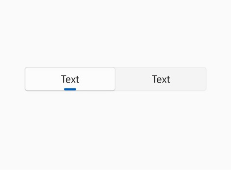
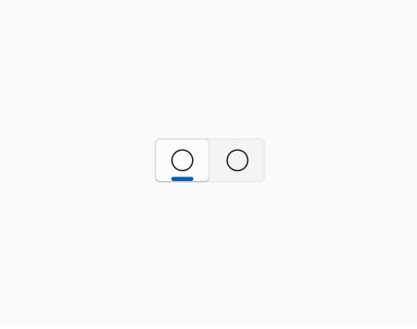
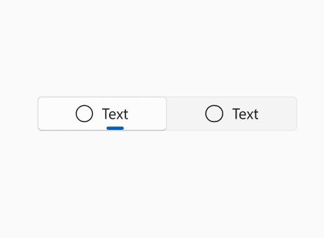

<!-- The purpose of this document is to describe the design and implementation of a new WinUI control.
This document contains architectural and implementation details that do not appear in the functional spec. -->

<!-- Audiences: Control feature crew to learn about the control, provide feedback -->
Segmented Functional Spec
===
*Control category: Basic Input*

# Background
Motivations for the Segmented controls include:
- Supporting File Explorer scenarios to change how files are represented (list, grid, table, etc.)
- Supporting photo gallery scenarios to change the layout of the photos (small, large, river, etc.)
- Top 3P request: [#2310](https://github.com/microsoft/microsoft-ui-xaml/issues/2310). *However*, this request includes both single and **multi-selection**. See [comment](https://github.com/microsoft/microsoft-ui-xaml/issues/2310#issuecomment-808427309) for proposal of the API to support multiple selection.
- Reaching parity with UI that exists in the Fluent design toolkit today but doesn't have a platform control that supports it

Similar controls to Segmented control include:

- NavigationView in 'Top' mode as they have a similar single-select visualization but differ in control complexity.
- PipsPager as they have the same single-selection behavior with an option selected by default. They differ in visualization and interaction options.
- RadioButtons as they have similar single-selection behavior but differ in visualization.
- Pivot as they have a similar single-selection visualization but Pivot navigates between different "pages" of content.

We explored combining the functionality of the Pivot control into the Segmented control but decided to let them standalone as single controls as there were differences in both visualizations *and* the interaction model. Going forward, we intend to introduce a separate control with the working title of **LiteNav** to replace the **Pivot** control as a single-selection control that switches content - with associated transition animations, specialized input interactions, and a different API model to support content in the control itself. 

# Description
The Segmented control is used to modify your content's appearance by switching between different views or configuring different settings. By default, a single option in the Segmented control is selected as the default configuration.

# Is this the right control?

Use a Segmented control to give the user a set of options to update how content is displayed in the application. Some examples include:
- Switching between different layouts in a photo gallery
- Changing the size of photos in a photo gallery
- Switching between RGB and HSV in a color picker

## When should a different control be used?

There are some scenarios where a Pivot/LiteNav, NavigationView, or PipsPager control may be more appropriate to use.

In scenarios where you want to *change* the content shown, a control that navigates between different pages of your application is recommended. 
- Use a Pivot/LiteNav when you want light-weight navigation between views or pages.
- Use a NavigationView when you want consistent, top-level navigation for your app.
- Use a PipsPager when you want your users to navigate through a linear set of views or pages.


### Is this the right Button?
*See [Button guidance](https://docs.microsoft.com/en-us/windows/apps/design/controls/radio-button#is-this-the-right-control) for more information about the various types of Buttons.*

For some scenarios, either a Segmented control or RadioButtons might work. To decide which control works better, follow these tips:
- Use a segmented control when a default option is selected by the app.
- Use a segmented control in compact and/or horizontal layouts
- Use radio buttons when when an option is not selected by default.


# Sample scenarios

<!-- Add key scenario examples with screenshots and sample markup/code 
some syntax that points to the file locally

Code samples should be in C# and/or C++/WinRT
-->

**Scenario 1: Segmented With Just Text**



```
<Segmented SelectionChanged=OnSelectionChanged>
     <SegmentedItem>Text</SegmentedItem>
     <SegmentedItem>Text</SegmentedItem>
</Segmented>
```

**Scenario 2: Segmented With Just Icons**



```
<Segmented SelectionChanged=OnSelectionChanged>
     <SegmentedItem Icon="Circle"></SegmentedItem>
     <SegmentedItem Icon="Circle"></SegmentedItem>
</Segmented>
```

**Scenario 3: Segmented With Icons and Text**



```
<Segmented SelectionChanged=OnSelectionChanged>
     <SegmentedItem Icon="Circle">Text</SegmentedItem>
     <SegmentedItem Icon="Circle">Text</SegmentedItem>
</Segmented>
```

**Scenario 4: Segmented With No SelectedIndex Specified**

Unlike RadioButtons, there is always one SegmentedItem selected by default (the leftmost SegmentedItem). <br>

If no SelectedIndex is specified, it defaults to 0.
```
<Segmented SelectionChanged=OnSelectionChanged>
     <SegmentedItem Content="Tile"></SegmentedItem>
     <SegmentedItem Content="River"></SegmentedItem>
     <SegmentedItem Content="Stacked"></SegmentedItem>
</Segmented>
```

```
Code Behind
private void PhotoCollectionSegmented_SelectionChanged(object sender, SelectionChangedEventArgs e)
{
     if (ControlOutput != null && sender is Segmented vs)
     {
          string view = vs.SelectedItem as string;
          switch (view)
          {
          case "Tile":
               // switch to Tile view 
               break;
          case "RiverFlow":
               // switch to RiverFlow view
               break;
          case "Stacked":
               // switch to Stacked view
               break;
          }
     }
}
```

# API Pages

## Segmented class

Represents a control that consists of a group of options from which one is selected.

_Spec note - Alternate descriptions considered:_
- *Represents a control that shows a group of related visual states for viewing the content of the page from which only a single option can be selected.*
- *One option out of many and specific visual affordances for it.*
- *From UISegmentedControl: A horizontal control that consists of multiple segments, each segment functioning as a discrete button.*

### Example
```XML
<Segmented>
     <SegmentedItem>Text1</SegmentedItem>
     <SegmentedItem>Text2</SegmentedItem>
     <SegmentedItem>Text3</SegmentedItem>
</Segmented>
```

## Segmented.SelectedIndex property

Gets or sets the index of the selected segmented item.

### Property Value

The index of the selected segmented item. The default is 0, which indicates that the first segmented item is selected.

### Remarks
> For more info, design guidance, and code examples, see 'Segmented'

SelectedItem and `SelectedIndex` are synchronized. Changing either property will result in a change to the other. Setting `SelectedIndex` to any value outside the range of the Items collection results in `SelectedItem` being `null`.


## Segmented.SelectedItem property

Gets or sets the selected SegmentedItem.

### Property Value
The selected SegmentedItem. The default is `null`.

### Remarks
> For more info, design guidance, and code examples, see 'Segmented'

SelectedItem and `SelectedIndex` are synchronized. Changing either property will result in a change to the other. Setting `SelectedIndex` to any value outside the range of the Items collection results in `SelectedItem` being `null`.


## Segmented.SelectionChanged event

Occurs when the currently selected item changes.

### Remarks

Handle the `SelectionChanged` event to take action when an option is chosen.

You can get the selected item from the control's SelectedItem property or from the or from the SelectionChangedEventArgs.AddedItems property. 
If you use the event args, there will only be one selected item, at index 0, so you could get the selected item like this:
 string colorName = e.AddedItems[0] as string;.

### Example

```XML
<!-- xmlns:muxc="using:Microsoft.UI.Xaml.Controls -->
<muxc:Segmented SelectionChanged="PhotoViewer_SelectionChanged">
    <SegmentedItem>Tile</SegmentedItem>
    <SegmentedItem>River</SegmentedItem>
    <SegmentedItem>Stacked</SegmentedItem>
</muxc:Segmented>

```

```csharp
private void PhotoViewer_SelectionChanged(object sender, SelectionChangedEventArgs e)
{
     if (ControlOutput != null && sender is Segmented vs)
     {
          string view = vs.SelectedItem as string;
          switch (view)
          {
          case "Tile":
               // switch to Tile view 
               break;
          case "RiverFlow":
               // switch to RiverFlow view
               break;
          case "Stacked":
               // switch to Stacked view
               break;
          }
     }
}
```

## SegmentedItem class

Represents the container for an item in a Segmented control.

### Example
```XML
<!-- xmlns:muxc="using:Microsoft.UI.Xaml.Controls -->
<muxc:Segmented SelectionChanged="PhotoViewer_SelectionChanged">
    <SegmentedItem>Tile</SegmentedItem>
    <SegmentedItem>River</SegmentedItem>
    <SegmentedItem>Stacked</SegmentedItem>
</muxc:Segmented>

```

## SegmentedItem.Icon property

Gets or sets the icon to appear next to the content in the SegmentedItem.

### Property Value
The icon to appear next to the content in the SegmentedItem. The default is `null`.

_Spec note: internal comment about this property that won't go into the public docs._

### Example
```XML
<SegmentedItem Icon="symbolName" .../>
...
```

### Remarks
You can assign a value from the Symbol enumeration, or a Unicode string that references a glyph in the Segoe MDL2 Assets font.

You can use the Character Map application that comes with Windows to browse the font's glyphs and find their Unicode values. 
Then, use the format "&#x/(UNICODE);" in XAML, or the format "\u/(UNICODE)" in code, 
where (UNICODE) is the value of the glyph that indicates the location in the font file.

The Segoe MDL2 Assets font ships with Windows 10, and new glyphs might be added in every release. 
You should verify that the Unicode value you choose is available in the minimum SDK build version your project targets.

The SegmentedItem will automatically set the following states on the AnimatedIcon:

- Normal
- PointerOver
- Pressed
- Selected
- PressedSelected
- PointerOverSelected

# API Details
_Spec note: Does not include an ItemsSource or ItemTemplate as the list of items is expected to be minimal and static._

_TODO:_
- _Doesn't support MVVM model, shouldn't have an understanding of a UIElement --> would change SelectedItem type to . Also add ItemsSource --> follow pattern._
- _Low sentiment from RadioButtons & TabView_

```csharp
namespace Prototypes
{

[MUX_PUBLIC]
[contentproperty ("Items")]
[webhosthidden]
unsealed runtimeclass Segmented : Microsoft.UI.Xaml.Controls.Control
{
     Segmented();

     IVector<Object> Items{ get; };

     [MUX_PROPERTY_CHANGED_CALLBACK(TRUE)]
     Object ItemsSource;

     [MUX_DEFAULT_VALUE("0")]
     [MUX_PROPERTY_CHANGED_CALLBACK(TRUE)]
     Int32 SelectedIndex;

     [MUX_PROPERTY_CHANGED_CALLBACK(TRUE)]
     Object SelectedItem;

     event Windows.Foundation.TypedEventHandler<Segmented, SegmentedSelectionChangedEventArgs> SelectionChanged;

     static Microsoft.UI.Xaml.DependencyProperty SelectedIndexProperty{ get; };
     static Microsoft.UI.Xaml.DependencyProperty SelectedItemProperty{ get; };
     static Microsoft.UI.Xaml.DependencyProperty ItemsProperty { get; };
}

[MUX_PUBLIC] 
[webhosthidden] 
[MUX_PROPERTY_CHANGED_CALLBACK(TRUE)] 
[MUX_PROPERTY_CHANGED_CALLBACK_METHODNAME  ("OnPropertyChanged")] 
(see footer appendix for discussion on extending from ItemContainer vs. RadioButton)
unsealed runtimeclass SegmentedItem : ItemContainer
{ 

     SegmentedItem();

     IconElement Icon;

    static Microsoft.UI.Xaml.DependencyProperty IconProperty{ get; };
}

```

# XAML markup considerations

## Visual groups and states

<!-- List the control's visual groups and their visual states. Groups must be orthogonal, i.e. two separate groups must not target the same UI element.
     For each visual groups, specify the default state.
     For each visual state, describe when it is entered. -->

### **Segmented**
### Visual group: CommonStates
#### Visual state: Normal
Entered when: The default state
#### Visual state: Disabled
Entered when: When the disabled property is true

### **SegmentedItem**
### Visual group: CommonStates
#### Visual state: Normal
Entered when: The default state is unselected
#### Visual state: Hover
Entered when: When mouse over
#### Visual state: Press
Entered when: On mouse press
#### Visual state: Selected
Entered when: On key up of press (item is selected)
#### Visual state: Disabled
Entered when: When the disabled property is true


## Theme resources

### **Segmented control**
| Resource                    | High-Contast | Light/Dark |  Description |
|--|--|--|--|
| SegmentedBackground |  SystemColorButtonFaceColor  |  ControlAltFillColorSecondaryBrush   |   Defines background for parent in all visual states |
| SegmentedBorderBrush |  SystemColorButtonFaceColor  | ControlStrokeColorDefaultBrush  |   Defines border brush for parent in all visual states|

### **SegmentedItem**
| Resource                    | High-Contast | Light/Dark |  Description |
|--|--|--|--|
| SegmentedItemBorderBrush |  SystemControlTransparentBrush  |  ControlFillColorTransparentBrush   |   Defines border brush for item |
| SegmentedItemBorderBrushHovered |  SystemControlTransparentBrush  | SubtleFillColorSecondaryBrush  |   Defines border brush for item when hovered |
| SegmentedItemBorderBrushPressed |  SystemControlTransparentBrush  |  SubtleFillColorTertiaryBrush  |   Defines border brush for item when pressed |
| SegmentedItemBorderBrushSelected |  SystemControlTransparentBrush  |  ControlStrokeColorDefaultBrush   |   Defines border brush for item when selected |
| SegmentedItemBorderBrushDisabled |  SystemControlTransparentBrush  |   ControlAltFillColorSecondaryBrush  |   Defines border brush for item when disabled |
| SegmentedItemForeground  | SystemColorButtonTextColor |    TextFillColorPrimaryBrush  |  Defines foreground for item  |
| SegmentedItemForegroundHovered  |  SystemColorHighlightTextColor  |    TextFillColorPrimaryBrush   |  Defines foreground for item  when hovered |
| SegmentedItemForegroundPressed  |  SystemColorHighlightTextColor  |    SubtleFillColorTertiaryBrush   |  Defines foreground for item when pressed |
| SegmentedItemForegroundSelected  | SystemColorHighlightTextColor  |   TextFillColorPrimaryBrush | Defines foreground for item when selected |
| SegmentedItemForegroundDisabled  | SystemColorGrayTextColor  |   TextFillColorDisabledBrush  | Defines foreground for item when disabled |
| SegmentedItemBackground  | SystemColorButtonFaceColor |    ControlFillColorTransparentBrush   |  Defines background for item  |
| SegmentedItemBackgroundHovered  | SystemColorHighlightColor   |   SubtleFillColorSecondaryBrush  |  Defines background for item when hovered |
| SegmentedItemBackgroundPressed  |  SystemColorHighlightColor  |  SubtleFillColorTertiaryBrush  | Defines background for item  when pressed |
| SegmentedItemBackgroundSelected  |  SystemColorHighlightColor |   ControlFillColorDefaultBrush    |  Defines background for item when selected |
| SegmentedItemBackgroundDisabled  | SystemColorButtonFaceColor  |    ControlFillColorDisabledBrush   | Defines background for item when disabled |
| SegmentedItemPillBackground  | SystemControlTransparentBrush |   AccentFillColorDefaultBrush   |  Defines pill visual fill for item  |

## Template settings

<!-- List & describe any template setting that the control uses.
     Example of template settings: CommandBarFlyoutCommandBarTemplateSettings -->
None.

## Deferred loading considerations

<!-- Consider if any component should be loaded on demand with x:DeferLoadStrategy="Lazy" -->
None.

# Accessibility considerations

<!-- This section covers all accessibility aspects of the control -->

## Automation peers

### Automation peer types

<!-- List the automation peer used by the various public components.
     Those may be pre-existing classes but are most likely custom.
     Example:
     winrt::AutomationPeer TabView::OnCreateAutomationPeer()
     {
          return winrt::make<TabViewAutomationPeer>(*this);
     }
-->
```
winrt::AutomationPeer Segmented::OnCreateAutomationPeer()
{

     return winrt::make<SegmentedAutomationPeer>(*this);

}
```

SegmentedItem automation peer inherits from ItemContainer.

### Automation peer implemented patterns

<!-- List the patterns implemented by each public automation peer type employed.
     Examples:
          BreadcrumbBarItemAutomationPeer supports pattern PatternInterface::Invoke.
          ToggleSplitButtonAutomationPeer supports patterns PatternInterface::ExpandCollapse and PatternInterface::Toggle.
-->

_Spec note: We are intentionally not supporting Invoke Pattern, since supporting both SelectionItem and Invoke was causing problems._ 
*See this Issue for more details: https://github.com/microsoft/microsoft-ui-xaml/issues/2702*

SegmentedAutomationPeer supports pattern PatternInterface :: SelectionItem (ISelectionItemProvider).
SegmentedItemAutomationPeer inherits pattern PatternInterface::CanSelect from ItemContainer. Each SegmentedItem needs to set CanSelect="true".

### Automation peer ClassName

<!-- For each automation peer, specify the string returned by GetClassNameCore.
     An automation peer typically returns the owning component's class name.
     Example: TabViewItemAutomationPeer returns "TabViewItem".
-->
SegmentedAutomationPeer returns "Segmented"
SegmentedItemAutomationPeer returns "ItemContainer" as it inherits from ItemContainer.

### Automation peer Name

<!-- For each automation peer, specify the string returned by GetNameCore.
     An automation peer typically returns a custom string.
     Example: TabViewItemAutomationPeer attempts to return its TabViewItem.Header as a string.
-->
SegmentedAutomationPeer does not return a string by default.
SegmentedItemAutomationPeer attempts to return its SegmentedItem.Content as a string.

### Automation peer ControlType

<!-- For each automation peer, specify the AutomationControlType returned by GetAutomationControlTypeCore.
     An automation peer needs to pick from a list of stock types in AutomationControlType.
     Example: TabViewItemAutomationPeer returns AutomationControlType::TabItem.
-->
No peer necessary for SegmentedItem as it depends on ItemContainer's.

## AutomationProperties

<!-- AutomationProperties's AccessibilityView -->
### AutomationProperties set in markup

<!-- List the AutomationProperties set on UI elements in the default control template -->

None.

*Question: Do either Segmented control or SegmentedItem need AccessibilityView or LandmarkType?*

### AutomationProperties set in code

<!-- List the AutomationProperties dynamically set on UI elements in code -->

SegmentedItem:
- AutomationProperties.Index
- AutomationProperties.Count

## Tooltip usage

<!-- List any tooltip usage for better accessibility -->
Display enlarged text/icon on hover in tooltip.

# Input handling

## Keyboard handling

### Function keys handling

<!-- Indicate how the control handles F1 ... F12 keystrokes.
     Special consideration for F2 to edit and Shift-F10 to show context menu.
 -->
None

### Keyboard accelerator handling

<!-- List any use of KeyboardAccelerator within the control, through the UIElement.KeyboardAccelerators property. -->
<!-- List any accelerator uses like Ctrl+A for Select All, etc... -->
None

### Navigation keys handling

<!-- Indicate how the control handles these keys, with or without modifiers Shift, Control, Alt:
  Left arrow
  Right arrow
  Up arrow
  Down arrow
  Page up
  Page down
  Home
  End

  Specify any use of UIElement.XYFocusKeyboardNavigation within the control.

  Specify any control behavior that might depend on a UIElement.XYFocusKeyboardNavigation value.
  Example: ScrollView's handling of navigation keys depends on its own XYFocusKeyboardNavigation setting.
 -->
**Left arrow:** Focus changes to the the next left SegmentedItem and if it is already at the leftmost it'll stay at the leftmost SegmentedItem. Selection follows focus.

**Right arrow:** Focus changes to the the next right SegmentedItem and if it is already at the rightmost it'll stay at the rightmost SegmentedItem. Selection follows focus.

**Home:** Focus changes to the leftmost SegmentedItem. Selection follows focus.

**End:** Focus changes to the rightmost SegmentedItem. Selection follows focus.

None for the rest.

### Tab key handling

#### Tabbing into and out of control behavior

<!-- Describe which UI sub-component receives keyboard focus. 
     Does the control cache which UI sub-component had focus when user tabbed out in order to restore that focus when tabbing back in? 
     Are there scenarios where tabbing out of the control is prohibited? (example: failing data validation)
     -->
When tabbing into a Segmented control, the currently selected SegmentedItem will gain focus. The group of SegmentedItems does not receive broad keyboard focus (e.g. the group of SegmentedItems does not receive a focus rectangle around them).

#### Tab cycle behavior

<!-- Specify UIElement.TabFocusNavigation, Control.IsTabStop, Control.TabIndex, Control.TabNavigation settings used on individual UI components of the control and the expected tabbing behavior -->
UIElement.TabFocusNavigation will only be once or local (default)
Control.TabNavigation will only be once or local (default)
Control.IsTabStop is true for the Segmented parent and false for SegmentedItem
Control.TabIndex will use default indexing

### Common special keys handling

<!-- Indicate how the Escape, Enter, Space keys are handled -->
None.

_Spec note: To consider - NavigationView Top does not show an interaction on space and selection doesn't follow focus, RadioButtons does show an interaction on space and selection follows focus_

## Gamepad handling

<!-- List handling of 
     GamepadDPadLeft, GamepadDPadRight
     GamepadDPadUp, GamepadDPadDown
     GamepadLeftThumbstickUp, GamepadLeftThumbstickDown
     GamepadLeftThumbstickLeft, GamepadLeftThumbstickRight
     GamepadRightThumbstickUp, GamepadRightThumbstickDown,
     GamepadRightThumbstickLeft, GamepadRightThumbstickRight,
     GamepadLeftShoulder, GamepadRightShoulder
     GamepadLeftTrigger, GamepadRightTrigger
     GamepadA, GamepadB
 -->
GamepadDPadLeft, GamepadRightThumbstickLeft, GamepadLeftTrigger: Focus changes to the the next left SegmentedItem and if it is already at the leftmost it'll stay at the leftmost SegmentedItem. Selection follows focus.

GamepadDPadRight, GamepadRightThumbstickRight, GamepadRightTrigger: Focus changes to the the next right SegmentedItem and if it is already at the rightmost it'll stay at the rightmost SegmentedItem. Selection follows focus.

None for the rest.

## Mouse handling

### Mouse buttons handling

<!-- List user actions that can be taken with the left, middle and right mouse buttons. Specify whether the action is taken on pointer down or up. -->
Left mouse button:
- hover
- key up (pointer up)
- press (pointer down)

### Mouse wheel handling

<!-- List user actions that can be taken while mouse-wheeling up and down.
     List user actions that can be taken while pushing the mouse wheel to the left or right.
 -->
None

## Pen handling

<!-- List user actions that can be taken with the pen. -->
Touch on pen should select corresponding SegmentedItem

## Touch handling

<!-- List user actions that can be taken with touch. 
     Specify actions for UIElement.Tapped, UIElement.RightTapped, UIElement.DoubleTapped.
     Any special behavior on touch hover?
-->
UIElement.Tapped should select corresponding SegmentedItem

No behavior for UIElement.Swipe, UIElement.DoubleTapped, and UIElement.RightTapped. 

## Drag and drop handling

<!-- Specify any behavior related to drag and drop operations. 
     - behavior as a drag source
     - behavior as a drop target
     - any edge scrolling behavior
-->
None

## Screen reader behavior

When a SegmentedItem receives focus (e.g. on tab or arrow navigation), announce: The default announcement for the SegmentedItem Content, "Selected", "{x index of item}/{n items in Segmented control}".

# Selection considerations

<!-- List applicable selection models:
     - none (no selection possible)
     - single selection
     - extended selection
     - multiple selection

     Describe user actions for each model.
     Describe use of selection anchor.
     Describe selection visuals when:
     - item has focus
     - item is anchor
     - control does not have focus
 -->
Single selection for Segmented control

Anchor and focus on SegmentedItem

_Note: Review to discuss what is needed here. Selection follows individual item focus, no group focus._

# Focus cues considerations

 <!-- Describe focus cues. Is UseSystemFocusVisuals used? -->
UseSystemFocusVisuals true (default no custom cues)

# ElementSoundPlayer considerations

<!-- Specify which user actions should play a sound with ElementSoundPlayer, and which ElementSoundKind to use. -->
None

# Data binding considerations

<!-- List properties that are typically set to a data source, like ItemsSource.
     List their supported source types: IEnumerable, IList, IEnumerable<T>, IList<T>, INotifyCollectionChanged, IBindingList, ICollectionView, IEditableCollection, ISupportIncrementalLoading, etc...
 -->
Segmented parent has a collection of SegmentedItem as a data source
Supported types TBD.

# Composition animation sources considerations

<!-- Consider exposing a public CompositionPropertySet property that can be used as a source for CompositionAnimation.
     Example: CompositionPropertySet ExpressionAnimationSources { get; } -->
SlidingAnimation for backplate
Pill animation

# Dev design link

<!-- Add a link to the dev design doc which uses the control_dev_design_template.md template -->
[Dev Spec](segmented-dev-spec.md)

# Appendix
<!-- Anything else that you want to write down for posterity, but 
that isn't necessary to understand the purpose and usage of the API.
For example, alternative designs that were considered but dropped. -->
Remaining Questions
1. Naming (Segmented vs. View Switcher)
   - ❓ Segmented
     - Pros
       - First name used and known across pm, dev, and design
       - Used throughout most documents on the control
     - Cons
         - Not a proper noun.
   - View Switcher
     - Pros
       - More intuitive as it states what its purpose is (switching between different views)
       - Among Regis, Karen, and I (the devs) we agreed on View Switcher
     - Cons
         - Assumes behavior that the control does not do - e.g. changing content.
  
2. Two controls vs. one control with two styles
   - Two controls
     - Pros
       - The controls have distinct use cases and avoids the issue of the user to use the control for the wrong purpose
       - May be more distinct differences with functionality and styling
         - Equal width sizing for Segmented, fit to content sizing for LiteNav
         - LiteNav could include the content area, include transitions etc. whereas Segmented does not have content and just hooks up to the app

   - One control
     - Pros
       - Lots of shared functionality and styling 
       - Less confusing and easy to mix up the two very similar controls

   - ✅ Shared base class between two different controls - Segmented & LiteNav
        - Pros of both two controls & one control.

3. Base Class (RadioButtons vs. ItemContainer)
   - RadioButtons
     - Pros
       - Built in accessibility that is desired
       - All the selection states and single selection
       - No duplicated code from mimicking RadioButtons

   - ✅ ItemContainer
     - Pros
       - More integrated into the future of WinUI3 with ItemsView, ItemContainer
       - Flexible and customizable
       - Doesn't expose the RadioButtons API 
         - Doesn't include unnecesssary aspects of RadioButtonsAPI (MaxColumns, HeaderProperty)
       - Less deep dependencies 
4. Content hosting
   - Content hosting
     - Pros
       - Better property alignment with content and control
   - ✅ No content hosting
     - Pros
       - Able to plug control anywhere
         - The UI isn't connected to the content
       - Disconnected from content flipping
       - Ease of use (don't need selection changed)
       - Captured in separate control, LiteNav.
5. Design (absolutely necessary vs. nice to have/an idea)
   - How does accessability look like?
     - Currently, has tabbing and keyboarding from ItemsRepeater
     - How does the design account for tabbing outline?
   - Are there scenarios where we need different orientations (horizontal vs. vertical)
   - Do we handle overflow cases?
   - How does the pill and backplate animation behave in Segmented (is sliding animation necessary)?
   - How does equal width sizing look like for Segmented (ex: if there's one that has a super long text)?
6. Multi-select
   - **Open question: Should Segmented support multi-select? *Why not?***
   *See https://developer.apple.com/design/human-interface-guidelines/components/selection-and-input/segmented-controls*