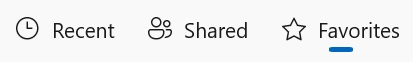

<!-- The purpose of this document is to describe the design and implementation of a new WinUI control.
This document contains architectural and implementation details that do not appear in the functional spec. -->

<!-- Audiences: Control feature crew to learn about the control, provide feedback -->
SelectorBar Functional Spec
===
*Control category: Basic Input*

# Background
Motivations for the SelectorBar control include:

- Supporting File Explorer scenarios to change categories of files displayed (Recent, Shared, Favorites, etc.).
- Offering a lightweight and more performant alternative to the Top NavigationView navigation mode. 
Top NavView is what we recommend after deprecating the Pivot control.
- Addressing a top 3rd-party request to replace the deprecated Pivot control. For discussions on Segmented and Pivot, 
refer to this thread: [#2310](https://github.com/microsoft/microsoft-ui-xaml/issues/2310).
- Achieving parity with UI elements existing in the Fluent design toolkit today but lacking a platform control that supports them.
- Matching the functionality of `Segmented`'s `PivotSegmentedStyle` in the Windows Community Toolkit.

_Spec note:_
_SelectorBar will be leveraging and implementing an inner ItemsView. SelectorBar will not be deriving from ItemsView 
since there is no multi-selection and we do not want to expose that API._

# Description
SelectorBar is used to modify the content shown by allowing users to select and switch between different sets of data. 
It is essentially a lightweight version of the Top NavigationView. 
By default, a single option is selected as the default configuration.

# Is this the right control?



Use SelectorBar when you want to change the content shown by selecting between a small number of options. 
Only one option can be selected at once. Some examples include:

- Switching between "Recent," "Shared," and "Favorites" pages, where each page displays a unique list of content.
- Switching between "All," "Unread," "Flagged," and "Urgent" pages, where each page displays a unique list of email items.

## When should a different control be used?

There are some scenarios where a NavigationView, RadioButtons, or PipsPager control may be more appropriate to use.

- Use SelectorBar when you need lightweight navigation between views or pages.
- Use NavigationView when you require consistent, top-level navigation for your app.
- Use PipsPager when you need regular pagination of your data.
- Use RadioButtons when an option is not selected by default, and context is unrelated to page navigation.


# Sample scenarios

## **Scenario: SelectorBar with Items collection and initial selection declared in XAML markup**


XAML
```xml
<SelectorBar x:Name="selectorBar" SelectionChanged="SelectorBar_SelectionChanged">
    <SelectorBarItem x:Name="liteNavItemRecent" Text="Recent" Icon="Recent"/>
    <SelectorBarItem x:Name="liteNavItemShared" Text="Shared" Icon="Share"/>
    <SelectorBarItem x:Name="liteNavItemFavorites" Text="Favorites" Icon="Favorite" IsSelected="True"/>
</SelectorBar>

<Frame x:Name="ContentFrame"/>
```

**C#**
```cs
private void SelectorBar_SelectionChanged(SelectorBar sender, SelectorBarSelectionChangedEventArgs args)
{
    SelectorBarItem item = sender.SelectedItem;
    System.Type pageType;

    if (item == liteNavItemRemote)
        pageType = typeof(PageRemote);
    else if (item == liteNavItemShared)
        pageType = typeof(PageShared);
    else
        pageType = typeof(PageFavorites);
        
    ContentFrame.Navigate(pageType);
}
```

# API Pages

## SelectorBar class

Represents a control that consists of a small group of options from which one is selected. 

Namespace: Microsoft.UI.Xaml.Controls

C#
```cs
public class SelectorBar : Control
```

## SelectorBar.Items property

Gets a list of `SelectorBarItem` instances currently represented by the `SelectorBar` control.

C#
```cs
public IVector<SelectorBarItem> Items { get; }
```

### Property Value
Represents the default content property of the `SelectorBar` control which can be populated in both XAML markup and code.

### Remarks
Items of this collection must consist of a collection of `SelectorBarItem`s or its sub-class.

_Spec note:_  
_The SelectorBar.Items property is fed into the inner ItemsView.ItemsSource property via a template binding in SelectorBar.xaml._


## SelectorBar.SelectedItem property

Gets or sets the currently selected item.

C#
```cs
public SelectorBarItem SelectedItem { get; set; }
```

### Property Value
Represents the selected `SelectorBarItem` in the `Items` list. The default is `null`.

### Remarks
Whenever the `SelectorBar` control gets focus and its `SelectedItem` is still `null`, that property is 
automatically set to the first focusable instance in the `Items` list, if any exists. In that case,
the `SelectionChanged` event gets raised as usual.

If `SelectedItem` is set to `null` while `SelectorBar` has focus, SelectorBar will have no item selected but stay focused.

Whenever the selected `SelectorBarItem` is removed from the `Items` list, the `SelectedItem` property is
automatically set to `null`.

Setting `SelectedItem` to an element not in the collection, or before the element is added to the collection throws an error.

_Spec notes:_
_Setting the selected `SelectorBarItem`'s `IsEnabled` to `False` does not affect the `SelectedItem` property._
_Neither does setting its `Visibility` to `Collapsed`._ 


## SelectorBar.SelectionChanged event

Occurs whenever selection changes, that is whenever the SelectedItem property has changed.

C#
```cs
public event EventHandler<SelectorBar, SelectorBarSelectionChangedEventArgs> SelectionChanged;
```

### Remark

This event is raised when an item is selected through one of multiple means:
- UI Automation,
- Tabbed focus (and a new item is selected),
- Left and right navigation within `SelectorBar`,
- `Tapped` event through mouse or touch, and
- Programmatic selection through `SelectorBar.SelectedItem` property.

_Spec notes:_
_Input is handled by `ItemContainer`, from which `SelectorBarItem` derives from.
Refer to input section for more details regarding focus and left / right navigation._

## SelectorBarItem class

Represents one of the items represented by the `SelectorBar` control. 

Namespace: Microsoft.UI.Xaml.Controls

C#
```cs
public class SelectorBarItem : ItemContainer
```

### Example

XAML
```xml
<SelectorBar x:Name="selectorBar" SelectionChanged="SelectorBar_SelectionChanged">
    <SelectorBarItem x:Name="liteNavItemRemote" Text="Remote" Icon="Remote"/>
    <SelectorBarItem x:Name="liteNavItemShared" Text="Shared" Icon="Shared"/>
    <SelectorBarItem x:Name="liteNavItemFavorites" Text="Favorites" Icon="Favorite" IsSelected="True"/>
</SelectorBar>
```


## SelectorBarItem.Text property

Gets or sets the item's textual label.

C#
```cs
public string Text { get; set; }
```

### Property Value
Represents the text associated with the item. The default is `null`.


## SelectorBarItem.Icon property

Gets or sets the item's icon.

C#
```cs
public IconElement Icon { get; set; }
```

### Property Value
Represents the icon associated with the item. The default is `null`.


## SelectorBarItemAutomationPeer Class

Exposes `SelectorBarItem` types to Microsoft UI Automation.

Namespace: Microsoft.UI.Xaml.Automation.Peers

```cs
public class SelectorBarItemAutomationPeer :  Microsoft.UI.Xaml.Automation.Peers.ItemContainerAutomationPeer
```

ItemContainerAutomationPeer implements `ISelectionItemProvider`, `IInvokeProvider`

_Spec note:_
_SelectorBarItemAutomationPeer::GetNameCore returns, in order of priority:_
* _The SelectorBarItem's AutomationProperties.Name,_
* _The SelectorBarItem's Text property value,_
* _The SelectorBarItem's Child property value textual representation,_
* _The localized version of SelectorBarItem._


# API Details

```cs (but really MIDL3)
namespace Microsoft.UI.Xaml.Controls
{
    [MUX_PUBLIC_V6]
    [webhosthidden]
    [MUX_PROPERTY_CHANGED_CALLBACK(TRUE)]
    [MUX_PROPERTY_CHANGED_CALLBACK_METHODNAME("OnPropertyChanged")]
    unsealed runtimeclass SelectorBarItem : Microsoft.UI.Xaml.Controls.ItemContainer
    {
        SelectorBarItem();

        String Text { get; set; };
        IconSource Icon { get; set; };

        static Microsoft.UI.Xaml.DependencyProperty TextProperty{ get; };
        static Microsoft.UI.Xaml.DependencyProperty IconProperty{ get; };
    }

    [MUX_PUBLIC_V6]
    [webhosthidden]
    [contentproperty("Items")]
    [MUX_PROPERTY_CHANGED_CALLBACK(TRUE)]
    [MUX_PROPERTY_CHANGED_CALLBACK_METHODNAME("OnPropertyChanged")]
    unsealed runtimeclass SelectorBar : Microsoft.UI.Xaml.Controls.Control
    {
        SelectorBar();

        Windows.Foundation.Collections.IVector<SelectorBarItem> Items { get; };
        SelectorBarItem SelectedItem { get; set; };

        event Windows.Foundation.TypedEventHandler<SelectorBar, SelectorBarSelectionChangedEventArgs> SelectionChanged;

        static Microsoft.UI.Xaml.DependencyProperty ItemsProperty{ get; };
        static Microsoft.UI.Xaml.DependencyProperty SelectedItemProperty{ get; };
    }

    runtimeclass SelectorBarSelectionChangedEventArgs
    {
    }
}

namespace Microsoft.UI.Xaml.Automation.Peers
{
    [MUX_PUBLIC_V6]
    [webhosthidden]
    unsealed runtimeclass SelectorBarItemAutomationPeer : Microsoft.UI.Xaml.Automation.Peers.ItemContainerAutomationPeer
    {
        [method_name("CreateInstanceWithOwner")]
        SelectorBarItemAutomationPeer(Microsoft.UI.Xaml.Controls.SelectorBarItem owner);
    }
}
```
# API REVIEW ENDS HERE
The rest of this document discusses functional and implementation details of the control and can be ignored for the
purposes of API Review.

# XAML markup considerations

## Visual groups and states

<!-- List the control's visual groups and their visual states. Groups must be orthogonal, i.e. two separate groups must not target the same UI element.
     For each visual groups, specify the default state.
     For each visual state, describe when it is entered. -->

### **SelectorBar**
### Visual group: CommonStates
#### Visual state: Normal
Entered when: The default state

### **SelectorBarItem**
### Visual group: Combined States
#### Visual state: UnselectedNormal (Default)
#### Visual state: UnselectedPointerOver
- Entered when mouse is hovering over control.
#### Visual state: UnselectedPressed
- Entered when mouse is pressed over control.
#### Visual state: SelectedNormal
- Entered when `IsSelected="true"`.
#### Visual state: SelectedPointerOver
- Entered when `IsSelected="true"` and when mouse is hovering over control.
#### Visual state: SelectedPressed
- Entered when `IsSelected="true"` and when mouse is pressed over control.

### Visual group: DisabledStates
#### Visual state: Enabled (Default)
#### Visual state: Disabled
- Entered when control `IsEnabled="false"`.


## Theme resources

### **SelectorBar control**
| Resource                    | High-Contast | Light/Dark |  Description |
|--|--|--|--|
| SelectorBarBackground |  SystemControlTransparentBrush  |  ControlFillColorTransparentBrush   |   Defines background for parent in all visual states |
| SelectorBarBorderBrush |  SystemControlTransparentBrush  | ControlFillColorTransparentBrush  |   Defines border brush for parent in all visual states|

### **SelectorBarItem**
| Resource                    | High-Contast | Light/Dark |  Description |
|--|--|--|--|
| SelectorBarItemBorderBrush |  SystemControlTransparentBrush  |  ControlFillColorTransparentBrush   |   Defines border brush for item |
| SelectorBarItemBorderBrushPointerOver |  SystemControlTransparentBrush  | ControlFillColorTransparentBrush  |   Defines border brush for item when hovered |
| SelectorBarItemBorderBrushPressed |  SystemControlTransparentBrush  |  ControlFillColorTransparentBrush  |   Defines border brush for item when pressed |
| SelectorBarItemBorderBrushSelected |  SystemControlTransparentBrush  |  ControlFillColorTransparentBrush   |   Defines border brush for item when selected |
| SelectorBarItemBorderBrushDisabled |  SystemControlTransparentBrush  |   ControlFillColorTransparentBrush  |   Defines border brush for item when disabled |
| SelectorBarItemForeground  | SystemColorButtonTextColor |    TextFillColorPrimaryBrush  |  Defines foreground for item  |
| SelectorBarItemForegroundPointerOver  |  SystemColorGrayTextColor  |    TextFillColorSecondaryBrush   |  Defines foreground for item  when hovered |
| SelectorBarItemForegroundPressed  |  SystemColorGrayTextColor  |    SubtleFillColorTertiaryBrush   |  Defines foreground for item when pressed |
| SelectorBarItemForegroundSelected  | SystemColorHighlightTextColor  |   TextFillColorPrimaryBrush | Defines foreground for item when selected |
| SelectorBarItemForegroundDisabled  | SystemColorGrayTextColor  |   TextFillColorDisabledBrush  | Defines foreground for item when disabled |
| SelectorBarItemBackground  | SystemControlTransparentBrush |    ControlFillColorTransparentBrush   |  Defines background for item  |
| SelectorBarItemBackgroundPointerOver | SystemControlTransparentBrush   |   ControlFillColorTransparentBrush  |  Defines background for item when hovered |
| SelectorBarItemBackgroundPressed  |  SystemControlTransparentBrush  |  ControlFillColorTransparentBrush  | Defines background for item  when pressed |
| SelectorBarItemBackgroundSelected  |  SystemControlTransparentBrush |   ControlFillColorTransparentBrush    |  Defines background for item when selected |
| SelectorBarItemBackgroundDisabled  | SystemControlTransparentBrush  |    ControlFillColorTransparentBrush   | Defines background for item when disabled |
| SelectorBarItemPillFill  | SystemColorHighlightColor |   AccentFillColorDefaultBrush   |  Defines pill visual fill for item  |
| SelectorBarItemDisabledPillFill  | AccentFillColorDisabledBrush |   AccentFillColorDisabledBrush   |  Defines pill visual fill for item when disabled  |

## Template settings

None.

## Deferred loading considerations

None.

# Accessibility considerations

## Automation peers

### Automation peer types

<!-- List the automation peer used by the various public components.
     Those may be pre-existing classes but are most likely custom.
     Example:
     winrt::AutomationPeer TabView::OnCreateAutomationPeer()
     {
          return winrt::make<TabViewAutomationPeer>(*this);
     }
-->
`SelectorBar` will depend on the implemted `ItemView`'s `ItemsViewAutomationPeer`.

`SelectorBarItem` implements `SelectorBarItemAutomationPeer` that derives from `ItemContainerAutomationPeer`. 
Refer to above section `SelectorBarItemAutomationPeer` Class.

### Automation peer implemented patterns

`SelectorBarItem` derives from `ItemContainerAutomationPeer`. `ItemContainerAutomationPeer` implements:
- ISelectionItemProvider
- IInvokeProvider

### Automation peer ClassName

<!-- For each automation peer, specify the string returned by GetClassNameCore.
     An automation peer typically returns the owning component's class name.
     Example: TabViewItemAutomationPeer returns "TabViewItem".
-->
`SelectorBar` returns "SelectorBar".
`SelectorBar` returns "SelectorBarItem".

### Automation peer Name

SelectorBar returns what is set for AutomationProperties.Name or the localized version of SelectorBar.

SelectorBarItemAutomationPeer::GetNameCore returns, in order of priority:
* The SelectorBarItem's AutomationProperties.Name,
* The SelectorBarItem's Text property value,
* The SelectorBarItem's Child property value textual representation,
* The localized version of SelectorBarItem.

### Automation peer ControlType

SelectorBar depends on `ItemsViewAutomationPeer`.

SelectorBar does not override `GetAutomationControlTypeCore`. 
ItemContainerAutomationPeer returns `AutomationControlType::ListItem`.

## AutomationProperties

### AutomationProperties set in markup

None.

### AutomationProperties set in code

None.

## Tooltip usage

If text in `SelectorBarItem` are truncated, tooltips will be should be added. 

_Spec note:_
_Since SelectorBarItem has a text property, should it handle truncation with Tooltip. 
What does AppBarButton with similar Icon and Text pattern do?_

# Input handling

## Keyboard handling

### Function keys handling

None.

### Keyboard accelerator handling

None.

### Navigation keys handling

SelectorBar will depend on `ItemsView` keyboard handling. The interactions are as follows:

**Left arrow:** Focus changes to the the next left item and if it is already at the leftmost 
it'll stay at the leftmost item. Selection follows focus.

**Right arrow:** Focus changes to the the next right item will depend on `ItemsView` keyboard handling. 
and if it is already at the rightmost it'll stay at the rightmost item. Selection follows focus.

**Home:** Focus changes to the leftmost item. Selection follows focus.

**End:** Focus changes to the rightmost item. Selection follows focus.

None for the rest.

### Tab key handling

#### Tabbing into and out of control behavior

When tabbing into a SelectorBar control, the currently selected item will gain focus. 
If no items are selected, the first focusable element will be selected and focused.

The group of items does not receive broad keyboard focus 
(e.g. SelectorBar itself does not receive a focus rectangle around it).

#### Tab cycle behavior

<!-- Specify UIElement.TabFocusNavigation, Control.IsTabStop, Control.TabIndex, Control.TabNavigation settings used on individual UI components of the control and the expected tabbing behavior -->
**SelectorBar:**
- UIElement.TabFocusNavigation: Once
- Control.TabNavigation: Once
- Control.IsTabStop: False
- Control.TabIndex: Default indexing

**SelectorBarItem:**
- UIElement.TabFocusNavigation: Local
- Control.TabNavigation: Local
- Control.IsTabStop: True
- Control.TabIndex: Default indexing

### Common special keys handling

None.

## Gamepad handling

GamepadDPadLeft, GamepadRightThumbstickLeft, GamepadLeftTrigger: 
Focus changes to the the next left item and if it is already at the leftmost it'll stay at the leftmost item. 
Selection follows focus.

GamepadDPadRight, GamepadRightThumbstickRight, GamepadRightTrigger: 
Focus changes to the the next right item and if it is already at the rightmost it'll stay at the rightmost item. 
Selection follows focus.

None for the rest.

## Mouse handling

_Spec note: Below is all handled internally by ItemContainer from which SelectorBarItem derives._

### Mouse buttons handling

Left mouse button:
- Hover
- Key up (pointer up)
- Press (pointer down)

### Mouse wheel handling

None

## Pen handling

Touch on pen should select corresponding item.

## Touch handling

UIElement.Tapped should select corresponding item. 

No behavior for UIElement.Swipe, UIElement.DoubleTapped, and UIElement.RightTapped. 

## Drag and drop handling

None

## Screen reader behavior

When an item receives focus (e.g. on tab or arrow navigation), announce:
"Selected", "{x index of item}/{n items in SelectorBar control}".

# Selection considerations

- Single Selection.
- Item focus is the default focus visual `UseSystemFocusVisuals`.
- Anchor is not applicable.

_Note: Review to discuss what is needed here. Selection follows individual item focus, no group focus._

# Focus cues considerations

UseSystemFocusVisuals true (default no custom cues)

# ElementSoundPlayer considerations

None

# Data binding considerations

`SelectorBar.Items` supports the `IVector` collection type, 
where the collection must consists of `SelectorBarItem`s and its sub-class.

`SelectorBar.Items` property is fed into `ItemsView.ItemsSource` that is contained within `SelectorBar`.

# Composition animation sources considerations

If the left and right slide pill animation is required, the same storyboard in left NavigationView will leveraged.

# Dev design link

TODO

# Appendix
<!-- Anything else that you want to write down for posterity, but 
that isn't necessary to understand the purpose and usage of the API.
For example, alternative designs that were considered but dropped. -->
Similar controls to SelectorBar include:

- NavigationView in 'Top' mode, as they share a similar single-select visualization but differ in control complexity. 
SelectorBar aims to offer a lightweight alternative to this scenario without handling content.
- PipsPager, as they exhibit the same single-selection behavior with an option selected by default. 
They differ in visualization and interaction options.
- RadioButtons, as they have similar single-selection behavior but differ in visualization.
- Segmented control: We explored combining the functionality of the SelectorBar control with the Segmented control but decided to 
let them stand alone as individual controls. There are differences in both visualizations and interaction models. 
The Segmented control serves to filter and manipulate a defined list, while SelectorBar switches 
and displays different content. Segmented will also provide a "touch-first" experience and may offer multiple selection.

_Spec note:_
_The touch-first experience and tentative multiple selection imply differing implementation details and are the main 
reasons for keeping the two controls separate._