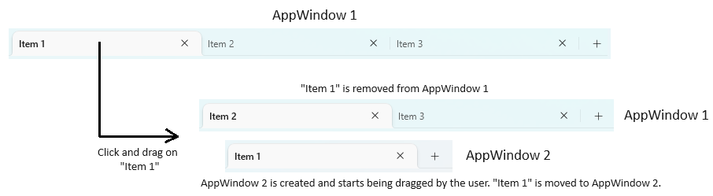
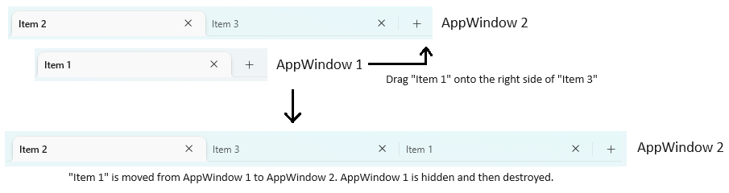

Tab Tear-Out spec
===

# Background

Applications such as Edge have an existing design paradigm where users can click and drag on a tab to tear the tab out into its own
window, or to connect the tab to another set of tabs in an existing window, in a smooth fashion that allows the user to continue to
drag the detached window without any delay or interruptions.  This is a highly intuitive way to interact with tabs and
windows that users have come to expect and desire, and multiple different Microsoft applications such as File Explorer and Terminal
would like to have the same pattern as well.  We want to generalize this pattern in XAML that enables this behavior and handles a
maximal amount of the tab tear-out logic.

There currently exist tab tear-out implementations in place in File Explorer and WinUI Gallery, but those are using the WinRT
drag-and-drop APIs, which require a drop on pointer released before any operations can be performed.  This is a significantly
worse experience in comparison - in Edge, for example, a user can tear out a tab and then drag it to the top to maximize it
in one smooth motion, whereas with the drag-and-drop APIs, a user must first drag and drop to even create the new window
in the first place, and then must perform a completely separate pointer action to interact with the new window in any way.

# Tab tear-out logic



To tear out a tab smoothly, we employ the window move-size loop.  The
[`TabViewItem`s](https://learn.microsoft.com/en-us/windows/windows-app-sdk/api/winrt/microsoft.ui.xaml.controls.tabviewitem?view=windows-app-sdk-1.4)
in a [`TabView`](https://learn.microsoft.com/en-us/windows/windows-app-sdk/api/winrt/microsoft.ui.xaml.controls.tabview?view=windows-app-sdk-1.4)
are designated as non-client caption areas, which signifies to Windows that clicking and dragging on them should move the window.
When we're about to move an existing window with a `TabView` designated as a non-client caption area, we request the application to
create a new window which is instead the recipient of the move-size loop.  This window is initially hidden and dragging reorders the
tab within the `TabView` as usual, until the user drags the tab outside of the bounds of the `TabView` control.  At that point, we
show the new window that is experiencing the move-size loop and shuttle the dragged tab.  This creates the effect for the user that
the tab appears to have been split off from the other tabs into its own window.



To drop a single torn out tab onto other tabs, we allow the user to click and drag on the tab to move its window until the user drags it
on top of a `TabView` in another window.  The `TabView` will then have a `TabsDropping` event raised on it to allow it to determine
whether it wants to accept the tab.  If it does, then we shuttle the tab to the second window and hide the original window, which allows
the user to continue to use its move-size loop to position the tab within the second window.  If the user drags outside the second window's
`TabView` control, we bring back the original window and move the tab back.  Otherwise, if the user releases the pointer with the tab still
in the second window's `TabView` control, we destroy the original window.

Shuttling tabs can be done either by moving the `TabViewItem`s themselves between `TabView`s, or by moving the data items.
The former will only work if both `TabView`s are on the same thread, whereas the latter will work in every case - however, the latter
will cause new UI elements to be created in the second `TabView`, which will require proper state handling on the part of the application
to ensure a seamless user experience.

**Note:** `TabView` currently supports only selecting or reordering a single tab, but Edge allows the user to Ctrl+click to select
multiple tabs, and users can then drag out these multi-selected tabs to their own window as a group.  Because that's a scenario XAML
may want to allow for in the future, the API designs to follow are future-proofed by not assuming that only a single tab can be torn
out at a time, even though at the time `TabView` only supports having a single tab selected.

# Full implementation

Most of the logic described above can be implemented either by `InputNonClientPointerSource` or by `TabView` and its `TabViewItems`,
but because neither of those have specific knowledge of the application in which it is hosted, there are points at which the application
will need to interface with them to fully implement tab tear-out end-to-end.  The full description of the implementation of tab tear-out
is as follows:

1. A Boolean property `AllowTabTearOut` will be added to `TabView` that will allow developers to specify that this `TabView`
should allow tab tear-out. A Boolean property `AllowTabDrop` will also be added that will allow developers to specify that this `TabView`
should be a valid drop target for torn-out tabs.  The `TabView` can determine in a `TabsDropping` event whether it wants to accept a tab
that is being dropped on it.
2. When that `TabView`'s tabs load, they will use an
[`InputNonClientPointerSource`](https://learn.microsoft.com/en-us/windows/windows-app-sdk/api/winrt/microsoft.ui.input.inputnonclientpointersource?view=windows-app-sdk-1.4)
to designate their screen bounds as non-client caption areas.
3. When the `InputNonClientPointerSource` is created, the `TabViewItem`s will attach to new move-size loop events added to
the `InputNonClientPointerSource` object.
4. A pointer press-and-drag on a non-client caption area will cause the `InputNonClientPointerSource` to begin the move-size loop.
The `InputNonClientPointerSource` will raise a new  `InputNonClientPointerSource.EnteringSizeMove` event that the `TabView` will handle
to ask if its owner wants to substitute a new window to receive the move-size loop.  In turn, the `TabView` will then raise an event
that the application will handle that notifies the application that a new `AppWindow` is being requested for tab tear-out.  The application
will create an `AppWindow` with an empty `TabView`, and then the `TabView` will assign the `AppWindow` to a property on the
`InputNonClientPointerSource`'s event args, allowing it to be the recipient of the move-size loop events.
7. `TabViewItem` will first respond to `InputNonClientPointerSource.EnteredSizeMove` by initializing its non-client tab-drag state machine
to say that the user is dragging within a `TabView`.
8. `TabViewItem` will then respond to `InputNonClientPointerSource.WindowPositionChanging` depending on the state of its non-client
tab-drag state machine:
     * If the user was dragging within a `TabView`...
        * ...and still is, then we will display a drag visual similar to the one shown for WinRT drag-drop API usage.
        * ...but has since dragged outside it, then the state machine will move to dragging outside a `TabView`, and the parent `TabView`
        will raise an event to inform the application that a tab has been torn out. The application must shuttle the selected tab from
        the current `TabView` to the empty `TabView` it created in the new `AppWindow`.  The new `AppWindow` will become visible after
        the event returns.
     * If the user was dragging outside a `TabView`...
        * ...and still is, then we will allow the `InputNonClientPointerSource.WindowPositionChanging` event to move the window without
        any special handling.
        * ...but has since dragged the tab over another `TabView` with `AllowTabDrop` set on it and the other `TabView` accepts the drop
        in its `TabsDropping` event, then the state machine will move to dragging within a `TabView`. The `AppWindow` being dragged will
        be hidden, and then the `TabView` being dropped onto will raise an event to inform the application that an external tab is being
        dropped onto it.  The application must respond to these events by adding the dropped tab to the second `TabView`.
9. Finally, `TabViewItem` will respond to `InputNonClientPointerSource.ExitedSizeMove` by cleaning up the non-client tab drag.  If there
is an `AppWindow` that has been hidden because its `TabView` was dropped on another `TabView`, it will be destroyed at this point.

# Layering

There are two different layers at play here, those being the `Microsoft.UI.Input` layer and the `Microsoft.UI.Xaml` layer.  The `TabView`
itself and its implementation of the concept of a tab control exists only in XAML, so the API additions centering around tabs specifically
are placed there.  However, making available the handling of the move-size loop via a window feature applies to anything using an `AppWindow`,
so the changes for that are placed in the `Microsoft.UI.Input` layer in the `InputNonClientPointerSource` type. There, they can be used
more broadly, not just by XAML applications, but by any applications that use an `AppWindow`.  The separate behavior at each layer is as follows:

## `Microsoft.UI.Input` layer

1. `InputNonClientPointerSource` attaches a window feature to the `AppWindow` for which it gets instantiated, which handles all non-client
pointer input window messages as well as all move-size loop window messages.
2. In response to `WM_NCHITTEST`, it returns the regions given to it by `InputNonClientPointerSource` consumers as non-client caption areas.
3. In response to `WM_NCLBUTTONDOWN`, it first calls the new event `EnteringSizeMove` to allow the application to provide a new `AppWindow`
at which to direct the move-size loop instead of the current one.
    * If it does, then the `InputNonClientPointerSource` will retrieve a `InputNonClientPointerSource` for that new window, will attach
    event handlers to forward its move-size loop events to the first `InputNonClientPointerSource`, and will start the move-size loop
    on that window, handling its move-size window messages.
    * If it does not, then the `InputNonClientPointerSource` will start the move-size loop on its current window and handle the move-size
    loop window messages for that window.
4. In response to `WM_ENTERSIZEMOVE`, `WM_WINDOWPOSCHANGING`, `WM_WINDOWPOSCHANGED`, and `WM_EXITSIZEMOVE`, it will raise the new events
`EnteredSizeMove`, `WindowPositionChanging`, `WindowPositionChanged`, and `ExitedSizeMove`, respectively.  This will allow consumers
to respond to the move-size loop as it progresses.

C++
```cpp
// Note: this is a proposed implementation in InputNonClientPointerSource; this is not app code that a consumer will need to write.
LRESULT InputNonClientPointerSourceWinRT::WindowProcedure(PFEATURECALL pfc, HWND hwnd, UINT message, WPARAM wParam, LPARAM lParam)
{
    switch (message)
    {
        // snip

        case WM_NCLBUTTONDOWN:
        {
            POINT screenPoint = {GET_X_LPARAM(lParam), GET_Y_LPARAM(lParam)};
            WindowId newWindowId = nullptr;

            if (MouseIsOverCaptionArea())
            {
                RaiseEnteringSizeMove(screenPoint, &newWindowId);
            }

            if (newWindowId.Value != 0)
            {
                // If we have a new window that was created to receive the move-size loop, we'll forward its move-size loop events to us.
                WRL::ComPtr<Microsoft::UI::Input::IInputNonClientPointerSourceStatics> statics;
                WRL::ComPtr<Microsoft::UI::Input::IInputNonClientPointerSource> nonClientPointerSource;
                statics->GetForWindowId(newWindowId, nonClientPointerSource.ReleaseAndGetAddressOf()));
                nonClientPointerSource.As(&m_newWindowNonClientPointerSource2);

                m_newWindowNonClientPointerSource2->add_EnteredSizeMove(
                    wil::MakeAgileCallbackNoThrow<EnteredSizeMoveEventHandler>(this, &InputNonClientPointerSourceWinRT::ForwardNewWindowEnteredSizeMove).Get(),
                    &m_newWindowEnteredSizeMoveToken);

                m_newWindowNonClientPointerSource2->add_WindowPositionChanging(
                    wil::MakeAgileCallbackNoThrow<WindowPositionChangingEventHandler>(this, &InputNonClientPointerSourceWinRT::ForwardNewWindowWindowPositionChanging).Get(),
                    &m_newWindowWindowPositionChangingToken);

                m_newWindowNonClientPointerSource2->add_WindowPositionChanged(
                    wil::MakeAgileCallbackNoThrow<WindowPositionChangedEventHandler>(this, &InputNonClientPointerSourceWinRT::ForwardNewWindowWindowPositionChanged).Get(),
                    &m_newWindowWindowPositionChangedToken);

                m_newWindowNonClientPointerSource2->add_ExitedSizeMove(
                    wil::MakeAgileCallbackNoThrow<ExitedSizeMoveEventHandler>(this, &InputNonClientPointerSourceWinRT::ForwardNewWindowExitedSizeMove).Get(),
                    &m_newWindowExitedSizeMoveToken);
            }

            break;
        }

        case WM_ENTERSIZEMOVE:
        case WM_WINDOWPOSCHANGING:
        case WM_WINDOWPOSCHANGED:
        case WM_EXITSIZEMOVE:
        case WM_CAPTURECHANGED:
        {
            DWORD msgPos = GetMessagePos();
            POINT screenPoint{ GET_X_LPARAM(msgPos), GET_Y_LPARAM(msgPos) };

            if (message == WM_ENTERSIZEMOVE)
            {
                m_inMoveSizeLoop = true;
                RaiseEnteredSizeMove(screenPoint);
            }
            else if (m_inMoveSizeLoop && message == WM_WINDOWPOSCHANGING)
            {
                // WM_WINDOWPOSCHANGING and WM_WINDOWPOSCHANGED are called many times during a move-size loop, so we'll cache the arg objects.
                if (!m_windowPositionChangingEventArgs)
                {
                    Microsoft::WRL::MakeAndInitialize<WindowPositionChangingEventArgs>(&m_windowPositionChangingEventArgs);
                }

                RaiseWindowPositionChanging(screenPoint, reinterpret_cast<WINDOWPOS*>(lParam));
            }
            else if (m_inMoveSizeLoop && message == WM_WINDOWPOSCHANGED)
            {
                // WM_WINDOWPOSCHANGING and WM_WINDOWPOSCHANGED are called many times during a move-size loop, so we'll cache the arg objects.
                if (!m_windowPositionChangedEventArgs)
                {
                    Microsoft::WRL::MakeAndInitialize<WindowPositionChangedEventArgs>(&m_windowPositionChangedEventArgs);
                }

                RaiseWindowPositionChanged(screenPoint, reinterpret_cast<WINDOWPOS*>(lParam));
            }
            // WM_CAPTURECHANGED can be sent instead of WM_EXITSIZEMOVE if the user or app cancels the move-size loop.
            else if (m_inMoveSizeLoop && (message == WM_EXITSIZEMOVE || message == WM_CAPTURECHANGED))
            {
                m_inMoveSizeLoop = false;
                RaiseExitedSizeMove(screenPoint);

                // If we were forwarding events from a new window, we'll stop doing so now.
                if (m_newWindowNonClientPointerSource2)
                {
                    RETURN_IF_FAILED(m_newWindowNonClientPointerSource2->remove_EnteredSizeMove(m_newWindowEnteredSizeMoveToken));
                    RETURN_IF_FAILED(m_newWindowNonClientPointerSource2->remove_WindowPositionChanging(m_newWindowWindowPositionChangingToken));
                    RETURN_IF_FAILED(m_newWindowNonClientPointerSource2->remove_WindowPositionChanged(m_newWindowWindowPositionChangedToken));
                    RETURN_IF_FAILED(m_newWindowNonClientPointerSource2->remove_ExitedSizeMove(m_newWindowExitedSizeMoveToken));
                    
                    m_newWindowNonClientPointerSource2 = nullptr;

                    m_windowPositionChangingEventArgs = nullptr;
                    m_windowPositionChangedEventArgs = nullptr;
                }
            }
            break;
        }
    }

    // snip
}
```

## `Microsoft.UI.Xaml` layer

1. When a `TabView` is denoted as `AllowTabTearOut = true`, its retrieves a shared instance of `InputNonClientPointerSource`
and adds event handlers to its `EnteringSizeMove`, `EnteredSizeMove`, `WindowPositionChanging`, and `ExitedSizeMove` events.
The `TabView`'s `TabViewItem`s use that `InputNonClientPointerSource` to designate their bounds as non-client caption areas.
2. In response to `EnteringSizeMove`, the `TabView` raises the event `TabsTearingOut` to allow the application to
create a new window and a new `TabView` to receive the torn out tab.  It passes along the window ID to the `InputNonClientPointerSource`.
3. In response to `EnteredSizeMove`, `WindowPositionChanging`, and `ExitedSizeMove`, the `TabView` proceeds through the tab
tear-out logic described in the [Full implementation](#full-implementation) section.

C++
```cpp
// Note: this is a proposed implementation in TabView; this is not app code that a consumer will need to write.
void TabView::OnLoaded(const winrt::IInspectable& sender, const winrt::RoutedEventArgs& args)
{
    winrt::InputNonClientPointerSource nonClientPointerSource =
        winrt::InputNonClientPointerSource::GetForWindowId(XamlRoot().ContentIslandEnvironment().AppWindowId());

    m_enteringSizeMoveRevoker = nonClientPointerSource.EnteringSizeMove(winrt::auto_revoke, { this, &TabView::OnEnteringSizeMove });
    m_enteredSizeMoveRevoker = nonClientPointerSource.EnteredSizeMove(winrt::auto_revoke, { this, &TabView::OnEnteredSizeMove });
    m_windowPositionChangingRevoker = nonClientPointerSource.WindowPositionChanging(winrt::auto_revoke, { this, &TabView::OnWindowPositionChanging });
    m_exitedSizeMoveRevoker = nonClientPointerSource.ExitedSizeMove(winrt::auto_revoke, { this, &TabView::OnExitedSizeMove });
}

void TabView::OnEnteringSizeMove(const winrt::InputNonClientPointerSource& sender, const winrt::TabViewEnteringSizeMoveEventArgs& args)
{
    winrt::TabViewTabsTearingOutEventArgs tearingOutArgs = winrt::make<TabViewTabsTearingOutEventArgs>();
    m_tabTornOutEventSource(*this, tearingOutArgs);

    m_newWindowId = tearingOutArgs.NewWindowId();
    args.NewWindowId(m_newWindowId);
}

void TabView::OnEnteredSizeMove(const winrt::InputNonClientPointerSource& sender, const winrt::TabViewEnteredSizeMoveEventArgs& args)
{
    // Initialize tab tear-out state machine.
}

void TabView::OnWindowPositionChanging(const winrt::InputNonClientPointerSource& sender, const winrt::TabViewWindowPositionChangingEventArgs& args)
{
    // Update tab tear-out state machine.
}

void TabView::OnExitedSizeMove(const winrt::InputNonClientPointerSource& sender, const winrt::TabViewExitedSizeMoveEventArgs& args)
{
    // Finalize tab tear-out state machine.
}
```

C++
```cpp
// Note: this is a proposed implementation in TabViewItem; this is not app code that a consumer will need to write.
void TabViewItem::OnLoaded(const winrt::IInspectable& sender, const winrt::RoutedEventArgs& args)
{
    if (const auto tabView = GetParentTabView())
    {
        if (tabView.AllowTabTearOut())
        {
            auto appWindowId = XamlRoot().ContentIslandEnvironment().AppWindowId();

            winrt::InputNonClientPointerSource nonClientPointerSource =
                winrt::InputNonClientPointerSource::GetForWindowId(appWindowId);
                
            winrt::ContentCoordinateConverter hostWindowContentCoordinateConverter =
                winrt::ContentCoordinateConverter::CreateForWindowId(XamlRoot().HostWindowId());
            winrt::ContentCoordinateConverter appWindowContentCoordinateConverter =
                winrt::ContentCoordinateConverter::CreateForWindowId(appWindowId);

            auto bounds = TransformToVisual(nullptr).TransformBounds({ 0, 0, ActualWidth(), ActualHeight() });
            auto screenBounds = hostWindowContentCoordinateConverter.ConvertLocalToScreen(bounds);
            auto appWindowBounds = appWindowContentCoordinateConverter.ConvertScreenToLocal(screenBounds);

            auto captionRects = nonClientPointerSource.GetRegionRects(winrt::NonClientRegionKind::Caption);

            captionRects.Append(winrt::RectInt32{
                static_cast<int>(appWindowBounds.X),
                static_cast<int>(appWindowBounds.Y),
                static_cast<int>(appWindowBounds.Width),
                static_cast<int>(appWindowBounds.Height)
            });

            nonClientPointerSource.SetRegionRects(winrt::NonClientRegionKind::Caption, captionRects);
        }
    }
}
```

# Application interaction

As described above, there are points where the application must perform some operations in order for everything to work end-to-end.
Both XAML island applications and WindowsAppSDK desktop applications must handle new `TabView` events to fully implement tab tear-out.
Code samples showing how applications will interact with XAML are as follows:

## Win32 application with XAML islands

C++
```cpp
m_tabView = TabView();
m_tabView.AllowTabTearOut(true);
m_tabView.AllowTabDrop(true);
m_tabView.TabItemsSource(m_stringList);

m_tabsTearingOutRevoker = m_tabView.TabsTearingOut(winrt::auto_revoke, { this, &MainWindow::TabsTearingOut });
m_tabsTornOutRevoker = m_tabView.TabsTornOut(winrt::auto_revoke, { this, &MainWindow::OnTabsTornOut });
m_tabsDroppingRevoker = m_tabView.TabsDropping(winrt::auto_revoke, { this, &MainWindow::OnTabsDropping });
m_tabsDroppedRevoker = m_tabView.TabsDropped(winrt::auto_revoke, { this, &MainWindow::OnTabsDropped });

m_desktopWindowXamlSource.Content(m_tabView);
```

C++
```cpp
void MainWindow::OnTabsTearingOut(TabView const&, TabViewTabsTearingOutEventArgs const& args)
{
    // We don't want to create a new window for tearing out if every tab is being torn out -
    // in that case, we just want to drag the window.
    if (sender.TabItems().Size() == args.Items().Size())
    {
        return;
    }

    HWND newWindowHwnd = MainWindow::CreateNewWindow(SW_HIDE, args.Items());
    args.NewWindowId(winrt::Microsoft::UI::GetWindowIdFromWindow(newWindowHwnd));
}

void MainWindow::OnTabsTornOut(TabView const&, TabViewTabsTornOutEventArgs const& args)
{
    // When tabs have been torn out of this TabView, we'll remove their data items to the TabView's TabItemsSource.
    for (uint32_t i = 0; i < args.Items().Size(); i++)
    {
        auto item = args.Items().GetAt(i);
        uint32_t index;
        if (m_stringList.IndexOf(item, index))
        {
            m_stringList.RemoveAt(index);
        }
    }
}

void MainWindow::OnTabsDropping(TabView const&, TabViewTabsDroppingEventArgs const& args)
{
    // This sample app only has the one TabView, so we know we'll always allow tabs to be dropped.
    // However, an app with multiple can check the contents of the new tabs in order to determine
    // whether the drop should be accepted.
    args.AllowDrop(true);
}

void MainWindow::OnTabsDropped(TabView const& sender, TabViewTabsDroppedEventArgs const& args)
{
    // When tabs have been dropped on this window's TabView, we'll add their data items to the TabView's TabItemsSource.
    for (uint32_t i = 0; i < args.Items().Size(); i++)
    {
        m_stringList.InsertAt(args.DropIndex() + i, args.Items().GetAt(i));
    }
}
```

## WindowsAppSDK desktop application

XAML
```xml
<!-- Note: the TabView does not necessarily need to be in the title bar; the non-client area can be anywhere. -->
<MainWindow ExtendsContentIntoTitleBar="True">
  <TabView x:Name="TabView"
    TabItemsSource={x:Bind StringList}
    AllowTabTearOut="True"
    AllowTabDrop="True"
    TabsTearingOut="OnTabsTearingOut"
    TabsTornOut="OnTabsTornOut"
    TabsDropping="OnTabsDropping"
    TabsDropped="OnTabsDropped">
    <!-- TabViewItems -->
  </TabView>
  <!-- ... -->
</MainWindow>
```

C#
```cs
void OnTabsTearingOut(TabView sender, TabViewTabsTearingOutEventArgs args)
{
    // We don't want to create a new window for tearing out if every tab is being torn out -
    // in that case, we just want to drag the window.
    if (sender.TabItems.Size == args.Items.Size)
    {
        return;
    }

    MainWindow newWindow = new();
    newWindow.StringList.AddRange(args.Items);

    args.NewWindowId = newWindow.AppWindow.Id;
}

void OnTabsTornOut(TabView sender, TabViewTabsTornOutEventArgs args)
{
    // When tabs have been torn out of this TabView, we'll remove their data items to the TabView's TabItemsSource.
    foreach (object item in args.Items)
    {
        uint32 index;
        if (this.StringList.IndexOf(item, index))
        {
            this.StringList.RemoveAt(index);
        }
    }
}

void OnTabsDropping(TabView sender, TabViewTabsDroppingEventArgs args)
{
    // This sample app only has the one TabView, so we know we'll always allow tabs to be dropped.
    // However, an app with multiple can check the contents of the new tabs in order to determine
    // whether the drop should be accepted.
    args.AllowDrop = true;
}

void OnTabsDropped(TabView sender, TabViewTabsDroppedEventArgs args)
{
    // When tabs have been dropped on this window's TabView, we'll add their data items to the TabView's TabItemsSource.
    for (uint i = 0; i < args.Items.Size; i++)
    {
        this.StringList.Insert(args.DropIndex + i, args.Items[i]);
    }
}
```

# API pages

## EnteringSizeMoveEventArgs class

Represents the args for the event raised prior to entering the move-size loop.

C#
```cs
public sealed class EnteringSizeMoveEventArgs
```

## EnteringSizeMoveEventArgs.ScreenPoint property

Represents the pointer position when we're about to enter the move-size loop.

C#
```cs
public PointInt32 ScreenPoint{ get; };
```

## EnteringSizeMoveEventArgs.NewWindowId property

Represents the new window ID for which to enter the move-size loop, if the application creates one.

C#
```cs
public Microsoft.UI.WindowId NewWindowId { get; set; }
```

## EnteredSizeMoveEventArgs class

Represents the args for the event raised in response to `WM_ENTERSIZEMOVE`.

C#
```cs
public sealed class EnteredSizeMoveEventArgs
```

## EnteredSizeMoveEventArgs.ScreenPoint property

Represents the pointer position when the `WM_ENTERSIZEMOVE` message came in.

C#
```cs
public PointInt32 ScreenPoint{ get; };
```

## WindowPositionChangingEventArgs class

Represents the args for the event raised in response to `WM_WINDOWPOSCHANGING`.

C#
```cs
public sealed class WindowPositionChangingEventArgs
```

## WindowPositionChangingEventArgs.ScreenPoint property

Represents the pointer position when the `WM_WINDOWPOSCHANGING` message came in.

C#
```cs
public PointInt32 ScreenPoint{ get; };
```

## WindowPositionChangingEventArgs.NewWindowPosition property

Represents the new position that the window will change to if nothing prevents it from moving.
Can be set to supply an alternate position instead.

C#
```cs
public RectInt32 NewWindowPosition { get; set; }
```

## WindowPositionChangingEventArgs.AllowWindowMove property

Represents a value indicating whether or not the window should be allowed to move.
Defaults to true; can be set to `false` to prevent the window move from happening.

C#
```cs
public bool AllowWindowMove { get; set; }

## WindowPositionChangingEventArgs.ShowWindow property

Represents a value indicating whether or not the window should be shown.
Defaults to the current state of the window; can be from `false` to `true`
to show the window, or from `true` to `false` to hide the window.

C#
```cs
public bool ShowWindow { get; set; }
```

## WindowPositionChangedEventArgs class

Represents the args for the event raised in response to `WM_WINDOWPOSCHANGED`.

C#
```cs
public sealed class WindowPositionChangedEventArgs
```

## WindowPositionChangedEventArgs.ScreenPoint property

Represents the pointer position when the `WM_WINDOWPOSCHANGED` message came in.

C#
```cs
public PointInt32 ScreenPoint{ get; };
```

## WindowPositionChangedEventArgs.NewWindowPosition property

Represents the new position that the window changed to.

C#
```cs
public RectInt32 NewWindowPosition { get; }
```

## ExitedSizeMoveEventArgs class

Represents the args for the event raised in response to `WM_EXITSIZEMOVE`.

C#
```cs
public sealed class ExitedSizeMoveEventArgs
```

## ExitedSizeMoveEventArgs.ScreenPoint property

Represents the pointer position when the `WM_EXITSIZEMOVE` message came in.

C#
```cs
public PointInt32 ScreenPoint{ get; };
```

## InputNonClientPointerSource.EnteringSizeMove event

Raised by `InputNonClientPointerSource` when they are about to start the move-size loop for a window.

C#
```cs
public event TypedEventHandler<InputNonClientPointerSource, EnteringSizeMoveEventArgs> EnteringSizeMove;
```

## InputNonClientPointerSource.EnteredSizeMove event

Raised by `InputNonClientPointerSource` when they receive a `WM_ENTERSIZEMOVE` windows message.

C#
```cs
public event TypedEventHandler<InputNonClientPointerSource, EnteredSizeMoveEventArgs> EnteredSizeMove;
```

## InputNonClientPointerSource.WindowPositionChanging event

Raised by `InputNonClientPointerSource` when they receive a `WM_WINDOWPOSCHANGING` windows message.

C#
```cs
public event TypedEventHandler<InputNonClientPointerSource, WindowPositionChangingEventArgs> WindowPositionChanging;
```

## InputNonClientPointerSource.WindowPositionChanged event

Raised by `InputNonClientPointerSource` when they receive a `WM_WINDOWPOSCHANGED` windows message.

C#
```cs
public event TypedEventHandler<InputNonClientPointerSource, WindowPositionChangedEventArgs> WindowPositionChanged;
```

## InputNonClientPointerSource.ExitedSizeMove event

Raised by `InputNonClientPointerSource` when they receive a `WM_EXITSIZEMOVE` windows message.

C#
```cs
public event TypedEventHandler<InputNonClientPointerSource, ExitedSizeMoveEventArgs> ExitedSizeMove;
```

## XamlRoot.HostWindowId property

Represents a the ID of the window that hosts the `XamlRoot`'s content.

C#
```cs
public Microsoft.UI.WindowId HostWindowId { get; }
```

## TabView.AllowTabTearOut property

Represents a value indicating whether or not tearing out tabs should be supported on this `TabView`.
If set to `true`, causes the `TabViewItems` to designate themselves as non-client caption areas,
preventing WinRT drag-and-drop APIs from being called, and instead causing non-client pointer
messages and move-size messages to come in.  Defaults to `false`.

C#
```cs
public bool AllowTabTearOut { get; set; }
```

## TabView.AllowTabDrop property

Represents a value indicating whether or not external tabs, from `TabView`s with `AllowTabTearOut` set to true,
should be able to dropped on this `TabView`.  Defaults to `false`.

C#
```cs
public bool AllowTabDrop { get; set; }
```

## TabViewTabsTearingOutEventArgs class

Represents the args for the event raised when a `TabViewItem` is about to be torn out from a `TabView`.

C#
```cs
public sealed class TabViewTabsTearingOutEventArgs
```

## TabViewTabsTearingOutEventArgs.Items property

Represents the data items held by the `TabViewItem`s that are about to be torn out.

C#
```cs
public IList<object> Items { get; }
```

## TabViewTabsTornOutEventArgs.Tabs property

Represents the `TabViewItem`s that are about to be torn out.

C#
```cs
public IList<TabViewItem> Tabs { get; }
```

## TabViewTabsTearingOutEventArgs.NewWindowId property

Represents the `WindowId` for the window into which the `TabViewItem` is about to be torn out into.

C#
```cs
public object Microsoft.UI.WindowId NewWindowId { get; }
```

## TabView.TabsTearingOut event

Raised for `TabView`s where one of their `TabViewItem`s is about to be torn out.
Prompts applications to create a new window in which to host the torn-out `TabViewItem`s.

C#
```cs
public event TypedEventHandler<TabView, TabViewTabsTearingOutEventArgs> TabsTearingOut;
```

## TabViewTabsTornOutEventArgs class

Represents the args for the event raised when a `TabViewItem` is torn out from a `TabView`.

C#
```cs
public sealed class TabViewTabsTornOutEventArgs
```

## TabViewTabsTornOutEventArgs.Items property

Represents the data items held by the `TabViewItem`s that have been torn out.

C#
```cs
public IList<object> Items { get; }
```

## TabViewTabsTornOutEventArgs.Tabs property

Represents the `TabViewItem`s that have been torn out.

C#
```cs
public IList<TabViewItem> Tabs { get; }
```

## TabView.TabsTornOut event

Raised for `TabView`s where one of their `TabViewItem`s has been torn out.
Provides a callback during which time applications should shuttle the torn-out
tab from the current `TabView` to the new `TabView`.

C#
```cs
public event TypedEventHandler<TabView, TabViewTabsTornOutEventArgs> TabsTornOut;
```

## TabViewTabsDroppingEventArgs class

Represents the args for the event raised when `TabViewItem`s are being dropped onto a `TabView`.

C#
```cs
public sealed class TabViewTabsDroppingEventArgs
```

## TabViewTabsDroppingEventArgs.Items property

Represents the data items held by the `TabViewItem`s that are being dropped.

C#
```cs
public IList<object> Items { get; }
```

## TabViewTabsDroppingEventArgs.Tabs property

Represents the `TabViewItem`s that are being dropped.

C#
```cs
public IList<TabViewItem> Tabs { get; }
```

## TabViewTabsDroppingEventArgs.DropIndex property

Represents the index at which the `TabViewItem`s to be dropped should be inserted into the `TabView`.

C#
```cs
public int DropIndex { get; }
```

## TabViewTabsDroppingEventArgs.AllowDrop property

Represents a value indicating whether or not to accept the `TabViewItem` being dropped.
Defaults to `false`; can be set to `true` to allow the drop.

C#
```cs
public bool AllowDrop { get; set; }
```

## TabView.TabsDropping event

Raised for `TabView`s where an external `TabViewItem` is being dropped onto this `TabView`.
Allows applications to specify whether they want to allow the drop to occur.

C#
```cs
public event TypedEventHandler<TabView, TabViewTabsDroppingEventArgs> TabsDropping;
```

## TabViewTabsDroppedEventArgs class

Represents the args for the event raised when a `TabViewItem` is dropped from an external `TabView`.

C#
```cs
public sealed class TabViewTabsDroppedEventArgs
```

## TabViewTabsDroppedEventArgs.Items property

Represents the data items held by the `TabViewItem`s that have been dropped.

C#
```cs
public IList<object> Items { get; }
```

## TabViewTabsDroppedEventArgs.Tabs property

Represents the `TabViewItem`s that have been dropped.

C#
```cs
public IList<TabViewItem> Tabs { get; }
```

## TabViewTabsDroppedEventArgs.DropIndex property

Represents the index at which the dropped `TabViewItem`s should be inserted into the `TabView`.

C#
```cs
public int DropIndex { get; }
```

## TabView.TabsDropped event

Raised for `TabView`s where an external `TabViewItem` has been dropped to this `TabView`.
Allows applications to add the new `TabViewItem`'s data item to this `TabView`.

C#
```cs
public event TypedEventHandler<TabView, TabViewTabsDroppedEventArgs> TabsDropped;
```

# API Details

```cs (but really MIDL3)
namespace Microsoft.UI.Input
{
    runtimeclass EnteringSizeMoveEventArgs
    {
        PointInt32 ScreenPoint{ get; };
        Microsoft.UI.WindowId NewWindowId;
    };

    runtimeclass EnteredSizeMoveEventArgs
    {
        PointInt32 ScreenPoint{ get; };
    };

    runtimeclass WindowPositionChangingEventArgs
    {
        PointInt32 ScreenPoint{ get; };
        RectInt32 NewWindowPosition;
        Boolean AllowWindowMove;
        Boolean ShowWindow;
    };

    runtimeclass WindowPositionChangedEventArgs
    {
        PointInt32 ScreenPoint{ get; };
        RectInt32 NewWindowPosition{ get; };
    };

    runtimeclass ExitingSizeMoveEventArgs
    {
        PointInt32 ScreenPoint{ get; };
    };

    runtimeclass InputNonClientPointerSource
    {
        // Existing APIs snipped
        
        event TypedEventHandler<InputNonClientPointerSource, SizeMoveEnteringEventArgs> EnteringSizeMove;
        event TypedEventHandler<InputNonClientPointerSource, SizeMoveEnteredEventArgs> EnteredSizeMove;
        event TypedEventHandler<InputNonClientPointerSource, WindowPositionChangingEventArgs> WindowPositionChanging;
        event TypedEventHandler<InputNonClientPointerSource, WindowPositionChangedEventArgs> WindowPositionChanged;
        event TypedEventHandler<InputNonClientPointerSource, SizeMoveExitedEventArgs> ExitedSizeMove;
    };
}

namespace Microsoft.UI.Xaml
{
    runtimeclass XamlRoot
    {
        // Existing APIs snipped.

        Microsoft.UI.WindowId HostWindowId{ get; };
    };
}

namespace Microsoft.UI.Xaml.Controls
{
    runtimeclass TabViewTabsTearingOutEventArgs
    {
        IVector<Object> Items { get; };
        IVector<TabViewItem> Tabs { get; };

        Microsoft.UI.WindowId NewWindowId;
    };

    runtimeclass TabViewTabsTornOutEventArgs
    {
        IVector<Object> Items { get; };
        IVector<TabViewItem> Tabs { get; };

        Microsoft.UI.WindowId NewWindowId;
    };

    runtimeclass TabViewTabsDroppingEventArgs
    {
        IVector<Object> Items { get; };
        IVector<TabViewItem> Tabs { get; };

        Int32 DropIndex { get; };
        Boolean AllowDrop;
    };

    runtimeclass TabViewTabsDroppedEventArgs
    {
        IVector<Object> Items { get; };
        IVector<TabViewItem> Tabs { get; };

        Int32 DropIndex { get; };
    };

    unsealed runtimeclass TabView : Microsoft.UI.Xaml.Controls.Control
    {
        // Existing APIs snipped.

        Boolean AllowTabTearOut;
        Boolean AllowTabDrop;

        event TypedEventHandler<TabView, TabViewTabsTearingOutEventArgs> TabsTearingOut;
        event TypedEventHandler<TabView, TabViewTabsTornOutEventArgs> TabsTornOut;
        event TypedEventHandler<TabView, TabViewTabsDroppingEventArgs> TabsDropping;
        event TypedEventHandler<TabView, TabViewTabsDroppedEventArgs> TabsDropped;
            
        static Microsoft.UI.Xaml.DependencyProperty AllowTabTearOutProperty{ get; };
        static Microsoft.UI.Xaml.DependencyProperty AllowTabDropProperty{ get; };
    };
}
```
