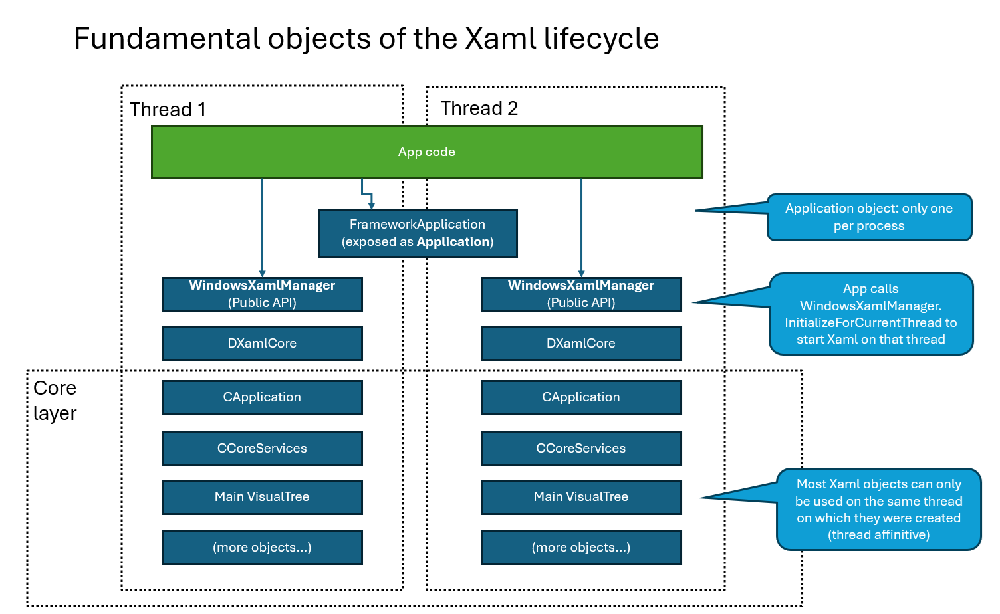

# Xaml App Model

## Table of Contents

- [Overview](#overview)
- [Xaml lifecycle objects](#xaml-lifecycle-objects)
- [Application object](#application-object)
  - [Code and breakpoints](#code-and-breakpoints)
  - [How does an Application object get created?](#how-does-an-application-object-get-created)
  - [Application.Start](#applicationstart)
  - [Unloading the DLL and process detach](#unloading-the-dll-and-process-detach)
- [WindowsXamlManager](#windowsxamlmanager)
  - [Timing the creation of the Application and the WindowsXamlManager](#timing-the-creation-of-the-application-and-the-windowsxamlmanager)
  - [Shutdown models: we could delete the old one](#shutdown-models-we-could-delete-the-old-one)
    - [WindowsXamlManager::XamlCore](#windowsxamlmanagerxamlcore)
- [Microsoft.UI.Xaml.Controls.dll (MUXC)](#microsoftuixamlcontrolsdll-muxc)
- [WinUI Desktop app vs Islands app](#winui-desktop-app-vs-islands-app)

## Overview

This document gives an overview of Xaml's app model. This covers Xaml desktop apps as well as island scenarios.

See also [startup-overview](startup-overview.md) and [xaml-shutdown](xaml-shutdown.md)

To understand this better, it can be very useful to create a blank WinUI3 app in the template, build it, and then
look at the code that was generated to manage the Application object, IXamlMetadataProvider, and Application.Resources.
See [desktop-app-walkthrough](./desktop-app-walkthrough.md).

This sample islands app may also be helpful: https://github.com/microsoft/WindowsAppSDK-Samples/tree/main/Samples/Islands

## Xaml lifecycle objects

Here's a high-level look at some objects that are fundamental to the Xaml lifecycle:



Key high-level ideas:
* There is only one **Application** object per process.
* The app is responsible for creating the Application object.
* To start Xaml on a thread, the app must call **WindowsXamlManager.InitializeForCurrentThread**
* Now, Xaml UIElements can be created and used on the thread.
* Most Xaml objects are **thread-affinitive**, meaning they can only be used on the same thread on which they were created.
* **DXamlCore** is an important Xaml object that tracks a lot of per-thread state.  It's in the DirectUI/DXaml layer.
* **CApplication** is per-thread even though DirectUI::FrameworkApplication is per process.
* **CCoreServices** is per-thread as well, and tracks a lot of per-thread state in the Xaml core layer.
* CCoreServices has a main **VisualTree** that manages the tree of Xaml UIElements for all Xaml content on that thread.

Let's look at some of these in more detail.

## Application object

The public `Microsoft.UI.Xaml.Application` ([docs](https://learn.microsoft.com/en-us/windows/windows-app-sdk/api/winrt/microsoft.ui.xaml.application))
type is meant to manage process-wide Xaml state.  If you try to create more than one in a process, you'll get an error.

Confusingly, even though Application seems like process-scoped object, some of its APIs have thread specific behavior!

Here are some key Application object APIs:
* `Current` property -- returns the one Application object that exists in the process, or null.
* `Start` method -- WinUI3 desktop apps call this to start the application object and run a message pump.
* `Resources` property -- collection to manage Xaml ResourceDictionaries for the thread on which its called.
* `OnLaunched` override -- called as Xaml starts up on a new thread.  ⚠️ It's probably a weird accident that this is called
on every thread that starts Xaml, this behavior is not documented.

UWP-specific, recall UWP is only supported for Xaml tests:
* `OnActivated` -- UWP-only, not supported.
* `OnSuspend/OnResume` -- UWP-only, not supported.

### Code and breakpoints

Here's where we can see the code that runs when apps call Application.Current:

``` cs
// App code
var app = Application.Current;
```

``` cpp
// FrameworkApplication_partial.cpp
using namespace DirectUI;
// A per-process FrameworkApplication instance, used for Application.Current. Xaml has a reference on this object.
static FrameworkApplication* g_pApplication = NULL;

// Implementation of Application.Current
_Check_return_ HRESULT FrameworkApplicationFactory::get_CurrentImpl(_Outptr_result_maybenull_ xaml::IApplication** ppValue)
{
    FrameworkApplication* pInstance = FrameworkApplication::GetCurrentNoRef();

    if (pInstance)
    {
        IFC_RETURN(ctl::do_query_interface(*ppValue, pInstance));
    }
    else
    {
        *ppValue = nullptr;
    }

    return S_OK;
}

FrameworkApplication* FrameworkApplication::GetCurrentNoRef()
{
    CApplicationLock lock;

    return g_pApplication;
}
```
It's pretty simple, there's just a global **g_pApplication** object that we return.  The lock ensures
it's safe to call from other threads.

But look at the Application.Resources implementation below.  Here we return an object that's thread specific!

``` cpp
// (Implementation of Application.Resources)
_Check_return_ HRESULT FrameworkApplication::get_ResourcesImpl(_Outptr_ xaml::IResourceDictionary** pValue)
{
    HRESULT hr = S_OK;
    CValue value;

    // get_Resources can only be called from a UI thread where we have initialized DXamlCore.
    IFC(DXamlServices::IsDXamlCoreInitialized() ? S_OK : RPC_E_WRONG_THREAD);

    // Note we're doing something a little unusual here.
    // Instead of getting a property tied to this object, we're using the internal CApplication handle
    // to get its resources. So this property ends up being a per-thread property, exposed on a global object.
    IFC(CoreImports::DependencyObject_GetValue(
        DXamlCore::GetCurrent()->GetCoreAppHandle(),
        MetadataAPI::GetDependencyPropertyByIndex(KnownPropertyIndex::Application_Resources),
        &value));

    IFC(CValueBoxer::UnboxObjectValue(&value, MetadataAPI::GetClassInfoByIndex(
        KnownTypeIndex::ResourceDictionary), __uuidof(xaml::IResourceDictionary),
        reinterpret_cast<void**>(pValue)));

Cleanup:
    RRETURN(hr);
}
```

A few notes here:
* That call to DXamlServices::IsDXamlCoreInitialized will only return true when Xaml is running on the thread.
* DXamlCore::GetCurrent() is the same, it will return the DXamlCore on the thread if Xaml is running on the thread.

### How does an Application object get created?

There are several ways to initialize `Application::Current`:

1. **Explicitly by the app.**  This is by far the most common way, we may want to even delete the others.
   The app would instantiate a `Application` (the `FrameworkApplication` class in Xaml) or an
   app-derived subclass, and Xaml's
   `FrameworkApplication::Initialize` (in `dxaml/xcp/dxaml/lib/FrameworkApplication_Partial.cpp`)
   would register it as the global g_pApplication variable, to be returned by `Application::Current`. This object would
   be ready to go when Xaml initializes in `WindowsXamlManager::XamlCore::Initialize`.

2. **Implicitly by Xaml.** If the app starts Xaml on a thread by calling WindowsXamlManager.InitializeForCurrentThread
    but has not created an Application object, Xaml will create a default Application object.
    `WindowsXamlManager::XamlCore::Initialize` will create an instance of
    `FrameworkApplication` and Xaml will keep it alive on behalf of the app.
    Note: only very simple Xaml scenes will work in this configuration (full control libraries may not load properly).

3. **Kept alive by the app and reused by Xaml.**
   Xaml will release its reference on the global Application when it deinitializes (i.e. the last WindowsXamlManager
   goes away). However, the app is free to hold on to its Application object and keep it alive beyond the lifetime of
   Xaml. If the app reinitializes Xaml while holding on to the Application, Xaml should reuse the previous Application
   object as `Application::Current`. This case is tricky and requires Xaml keeping an eye on the previous
   `Application::Current` instance via a weak pointer even after deinitializing.

When Xaml deinitializes, it will release its reference to the `Application.Current` object and clear it. If the app
wants to reuse it, it's up to the app to take a reference on it and keep it alive.

### Application.Start

WinUI3 Desktop apps call Application.Start.  This cause Xaml to run a message pump on behalf of the app.

Islands-based apps typically do not call Application.Start, they just create the Application object and handle
everything else themselves.

### Unloading the DLL and process detach

Microsoft.UI.Xaml.dll does not currently support getting unloaded from a process.  It hasn't been a priority for
customers and we haven't invested time into it.

``` cpp
// Microsoft.ui.xaml.dll will never report to COM that it's ready to be unloaded.
__control_entrypoint(DllExport)
STDAPI
DllCanUnloadNow()
{
    return S_FALSE;
}
```

But, during process shutdown there's still some cleanup logic that runs when the DLL gets unloaded.

``` cpp
extern "C"
BOOL WINAPI
DllMain(
    _In_ HINSTANCE hinstDLL,
    _In_ unsigned int fdwReason,
    _In_opt_ void *
)
{
    BOOL fRetVal = TRUE;
    // Perform actions based on the reason for calling.
    switch( fdwReason )
    {
//...
        case DLL_PROCESS_DETACH:
            DeinitializeDll();
            break;

        case DLL_THREAD_DETACH:
            IGNOREHR(ErrorContextThreadDeinit());
            IGNOREHR(WarningContextThreadDeinit());
            break;
    }

    return fRetVal;
}

```

This DeinitializeDll function does some final cleanup.

⚠️ It's fairly common for apps to see crashes here if they haven't cleaned up properly yet.

If you hit a crash during DeinitializeDll, some things to look at:
* For System Xaml, ensure proper island shutdown and cleanup.
* For WinUI3, make sure you call DispatcherQueueController.ShutdownQueue on each thread where Xaml was loaded.

## WindowsXamlManager
Call `WindowsXamlManager.InitializeForCurrentThread()` when you want to start up the Xaml runtime on that thread.
Xaml will shut down on that thread when the DispatcherQueue shuts down (in the DispatcherQueue.FrameworkShutdownStarting
event).

To start a WindowsXamlManager, you first must start a DispatcherQueue on the thread.  See [xaml-islands-and-dispatcherqueue.md](xaml-islands/xaml-islands-and-dispatcherqueue.md)
for more detail.

### Timing the creation of the Application and the WindowsXamlManager
The startup of the Application object and the creation of the WindowsXamlManager object often need to be intertwined
in a funny way.  

* If you initialize the WindowsXamlManager _before_ you create the Application object, Xaml will create the "default"
Application object on the app's behalf, and this will almost always be the wrong thing. 
* If you initialize the WindowsXamlManager _after_ you create the Application object, you'll likely get a crash because
cppwinrt and the Xaml code gen will trigger a call to Application.LoadComponent.  This will fail because Xaml's not
running on the thread yet.

So, generally apps initialize a WindowsXamlManager as the App is being created, like this:

``` cpp
    struct App : AppT<App>
    {
        App()
            : m_windowsXamlManager(winrt::Microsoft::UI::Xaml::Hosting::WindowsXamlManager::InitializeForCurrentThread())
        { }

        void OnLaunched(winrt::Microsoft::UI::Xaml::LaunchActivatedEventArgs const&);

    private:
        winrt::Microsoft::UI::Xaml::Hosting::WindowsXamlManager m_windowsXamlManager{ nullptr };
    };
```

### Shutdown models: we could delete the old one

The WindowsXamlManager implementation is probably more complex than it needs to be.

We made a change in WinAppSDK 1.5 to improve shutdown, but we kept the old path available in case the new one caused problems.

Look for **GetCurrentShutdownModel** to see the differences between the old model and the new one.

#### WindowsXamlManager::XamlCore

We created the WindowsXamlManager::XamlCore type to track per-thread state for WindowsXamlManager.
But in the new shutdown model, there can only be one WindowsXamlManager on each thread anyway.
So, we could probably delete the old model and we wouldn't really need XamlCore anymore, we could
fold that code into WindowsXamlManager.

## Microsoft.UI.Xaml.Controls.dll (MUXC)

Xaml is not very useful without Microsoft.UI.Xaml.Controls.dll.  Even a simple TextBox won't work correctly if MUXC isn't
properly configured.

To wire up MUXC properly we need to do two things:
* Create a MUXC `XamlControlsXamlMetaDataProvider` object and use it to help implement the `IXamlMetadataProvider` interface.
This allows the Xaml parser to find and understand the MUXC types when it sees them in Xaml.
* Add a `XamlControlsResources` object to the App's Resources ResourceDictionary.

For any real-world app, you should be able to see the app doing both these things.  It's almost always in code generated
automatically at built time.


## WinUI Desktop app vs Islands app

We usually talk about two different types of WinUI3 apps:
* **WinUI Desktop app**
  * This is an app created by using one of the Visual Studio WinUI 3 "new project" templates.
  * The app will call Application.Start, which runs a message pump for the app.
  * The app will create a Xaml Window to show its UI.
* **Islands app**
  * This is any win32 app that wants to load a XamlIsland somewhere into its scene graph.
  * There's no Visual Studio template to make an islands app.  That's because the main scenario for islands is that
  you use them in an _existing_ app.
  * The app will be running its own message pump, so it won't call Application.Start.
  * The app should call ContentPreTranslateMessage in its message pump so that the WinAppSDK UI stack gets a crack
at the messages.  (OR, the app can call DispatcherQueue.RunEventLoop to run the message pump, and this will automatically
make that call).
  * The app will use the XamlIsland or DesktopWindowXamlSource API to host Xaml content in its UI.
  * The app _may_ use a Xaml Window if it wants.

|  | Desktop App | Island App |
|--|-------------|------------|
| **What's the purpose of this kind of app?** | The app wants to use only WinUI3 for its UI. | The developer has an existing app and she wants to add some WinUI3 content. |
| **How do I create this kind of app?** | Use one of the Visual Studio "new project" templates. | Start with an existing app. |
| **Who runs the message pump?** | Xaml does, when the app calls Application.Start. | The app does. |
| **How is the Xaml content hosted?** | Typically in a Xaml Window created by the app. | Typically in an island (XamlIsland or DesktopWindowXamlSource) hosted in an HWND the app owns. |

For a look at how desktop apps work, see [desktop-app-walkthrough.md](./desktop-app-walkthrough.md).

For info about how to hook up an island to an existing win32 app, see [simpleislandapp](https://learn.microsoft.com/en-us/samples/microsoft/windowsappsdk-samples/simpleislandapp/).

Also see [xaml-window](./xaml-window.md).


