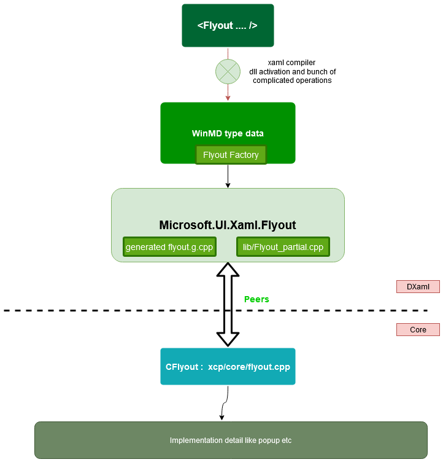

# Journey of a control

## Table of Contents

- [Overview](#overview)
- [Compiler and type identification](#compiler-and-type-identification)
- [DXaml](#dxaml)
- [Core](#core)

## Overview

From a classical architectural point of view, every control is made up of three sections:
1. syntax and type identification
2. DXaml layer
3. Core layer

It is important to note that newer controls which are part of WinUI2 don't follow this pattern.

The description onwards will talk of MUX controls only. If the code does `new Flyout()` instead of defining it in Xaml 
markup like `<Flyout />`, some of the above steps gets skipped.

## Compiler and type identification

XAML compiler -> WinMD activation -> `DllGetActivationFactory` (dllentry.cpp) -> `FlyoutFactory` -> `Flyout`

Parsing XAML markup syntax happens as follows:
1. The XAML Compiler identifies the type.
2. The particular type is then identified in WinMD file and activation is performed to get a Flyout type. See the 
   [Xaml Compiler](./xamlcompiler.md) writeup for more details.

## DXaml

This part is the interface to the implementation of the control `Flyout`. The contents reside in the `xcp/dxaml` 
folder. The `Microsoft.UI.Xaml.Flyout` control is created by combining two files: `flyout.g.cpp` and `Flyout_partial.cpp`.
`Flyout.g.cpp` contains the getters and setters for the properties. Since that part of code requires a lot of boilerplate 
code, a [code generator](./codegen.md) is used to create this for all controls.

`Flyout_partial.cpp` handles the implementation part. It maintains internal states of the control and also handles 
communication with its peer in the Core. If a control is implemented using an even more base control like Flyout is 
implemented using a Popup, that will be done here.

## Core

The core part of the control resides in `xcp/core`. For Flyouts, the `CFlyout` class (in 
[`flyout.cpp`](../../dxaml/xcp/core/core/elements/flyout.cpp)) is the core layer peer of `Flyout_partial` and handles 
the implementation details of the control. It is the place where its distinct 
identity as a control is lost and it becomes part of the inner components. It interacts with DXaml Core. It takes care 
of lifetime operations and entering and leaving visual tree.

For more information on these layers, see [DXaml vs Core layers](./dxamlvscore.md).