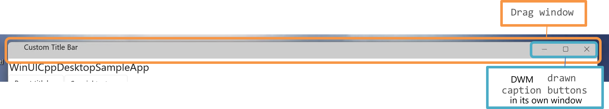

# Custom title bar for WinUI 3

## Table of Contents

- [Problem Description](#problem-description)
- [Solution](#solution)
    - [Implementation](#implementation)
      - [Advantage of using glass window](#advantage-of-using-glass-window)
  - [API and examples](#api-and-examples)
      - [User provided title bar example:](#user-provided-title-bar-example)
      - [Default title bar example:](#default-title-bar-example)
  - [Theming](#theming)
- [WinUI 3 custom titlebar + Appwindow titlebar](#winui-3-custom-titlebar--appwindow-titlebar)
- [Glossary](#glossary)
- [References](#references)

With this feature, app developer can use her own custom UI element as a
title bar instead of a system provided one. This allows app developer to
create title bar which is cohesive with rest of the app's design. It
also frees up real estate on top of the app which can be utilized for
app content.

This document captures the current state of the feature, especially answers the following questions :  
-   What is WinUI title bar feature?

-   Why is it needed?

-   How to use this feature?

-   Implementation details

-   Limitations and feature gaps

# Problem Description 

This feature is a response to customer request to customize the app at
the title bar area. This is primarily driven by 2 kinds of reasons:

1.  System provided title bar doesn't blend with the style guide
    followed by the app

2.  App developers want to use real estate of title bar area for drawing
    app content like a "Share" button

App developers can use publicly available Win32 APIs to address these
pain points, however, it requires extensive knowledge and experience of
Win32 APIs. It is also difficult to develop a solution which works with
most general use case scenarios.

# Solution

WinUI title bar is created to solve the above mentioned cases. Without it, customers can achieve similar
results by using Win32 apis, but it will require a lot of code from customers' end and may not accurately
work in different scenarios like touch or accessibility. System XAML (UWP) already has title bar feature
and customers moving to WinUI 3 will expect similar functionality. Hence, it is required to provide a framework level
feature which the customers can just use and get the right title bar solution which will work for all kinds of scenarios.

### Implementation

The implementation is to use hide system provided title bar and add a
glass window exactly on top of main app window (with highest z-order
than main app window) for title bar operations. Feature uses Win32
public APIs only.

Steps it follows:

1.  Hide system provided title bar by extending the client area to non-client area
    by calling `DefWindowProc(m_topLevelWindow, WM_NCCALCSIZE, wParam, lParam)` with
    client area dimensions. This moves the client area up to occupy non-client area part too.

2.  Draw a transparent window (or "glass window") at the top part of the
    app extending from left side to the right side of the app, occupying
    the same space as system title bar (which has been hidden).
    In context of custom titlebar, it is called Drag window.
    It has the highest z-order among the app windows. There can be mutiple of these drag windows.

3. Draw another window on top-right corner (top-left in case of RTL app) which hosts
   min/max/close buttons. 

4.  Drag window captures any pointer input on it and invokes actions on
    main window below at the same coordinates. For example: click on
    Drag window above minimize button invokes mouse click on the xaml
    button below which acts as minimize button. System
    menus also work in a similar way. When user right clicks on any part of drag window,
    system menu is shown at app's window at the same coordinates.
   
    In case of overlap of drag window and caption buttons' window, hit-testing precendence is provided to 
    caption button windows. This ensures caption buttons are always clickable, no matter the 
    drag window configuration.



#### Advantage of using glass window

Doing the glass window concept has multiple advantages and overcomes
technical challenges unique to WinUI app windows. WinUI HWNDs uses
another kind of glass window for input filtering. The Xaml controls are
not drawn on main app HWND. They are drawn in child HWND
*`DesktopChildSiteBridge`*. The main app HWND acts as a glass window which
captures all the input and filters all `WM_*` messages coming to it. It
also handles communicating these WM messages to child window by raising
its own special events. The top level HWND filters out all `WM_NC*` non
client area messages, especially `WM_NCHITTEST` (reason is beyond scope of
this document) . As a result, any child window doesn't receive any NC
messages and as a result, cannot perform the system title bar operations
like drag, or click, or responding correct codes to `WM_NCHITTEST` on its
own.

Drag window solves this problem. Despite being another child window, it
is hosted highest in z-order for an app. It can receive all input in its
area before it can go through the Input Bridge Window. It then
communicates it to the app window below.

It also returns correct hit test results based on what is below it in
the app window. For example: if a mouse is over an area in glass window
below which app window has WinUI drawn maximize button, it returns
`HTMAXBUTTON`. It aids default input handling by providing the right NC
information to input stack and helps in showing Snap flyout and tooltips
correctly. The HWND gets better pointer support especially around
corners for resizing, dragging.

Since drag window is highest in z-order, any windowed popup will need to be higher in z-order than
drag window to properly work. WinUI currently doesn't support windowed popups.

System context menu works with custom title bar as it works with system provided one, through right click on titlebar
region or `Alt + Space` keyboard shortcut.

## API and examples

WinUI title bar introduces 2 new apis:

-   [Window.ExtendsContentIntoTitle
    bar](https://docs.microsoft.com/en-us/windows/winui/api/microsoft.ui.xaml.window.extendscontentintotitlebar?view=winui-3.0#microsoft-ui-xaml-window-extendscontentintotitlebar)

    ` public bool ExtendsContentIntoTitle bar { get; set; } `
    
    It is used to enable WinUI title bar in runtime. On setting it to
    true, it hides the system title bar, starts showing a WinUI title
    bar. It is meant to be used in conjunction with `Window.SetTitleBar`.

    To get system title bar, set the property to false again.

-   [Window.SetTitlebar
    ](https://docs.microsoft.com/en-us/windows/winui/api/microsoft.ui.xaml.window.settitlebar?view=winui-3.0#microsoft-ui-xaml-window-settitlebar(microsoft-ui-xaml-uielement))
    
    ` public void SetTitlebar (UIElement titlebar); `

    The customer provides a uielement from the app' content such as a
    grid or stackpanel to act as a custom title bar. This api takes that
    `UIElement` and creates a drag window of its width at top right edge of main app HWND, starting at UIElement's X coordinates and ending at the right edge of the main app HWND. This starts acting as a title bar for the app.

    If no `UIElement` is provided, the app allocates a small space of size 46 points on
    the left side of WinUI drawn caption buttons to act as "fallback" title
    bar. This is not a recommended way to use the apis.

```xaml
<StackPanel x:Name="myTitleBar"  Height="32"  HorizontalAlignment="Stretch"  VerticalAlignment="Top" >
...
</StackPanel>
```
#### User provided title bar example:

```c#
Window window = myTitleBar();

window.ExtendsContentIntoTitlebar = true;

window.SetTitlebar(uielement);
```

Min/max/close buttons are clickable and act as their system provided counterparts.
Rest of the region is draggable and acts as title bar.

<br/>

#### Default title bar example:

```c#
Window window = myTitleBar();

window.ExtendsContentIntoTitlebar = true;

window.SetTitlebar(null); // optional line as null is default value
```
Similar to first case but without any UIElement to define its dimensions.
The entire non-client area is made into dragging region. Its height and width cannot be modified.

## Theming

The min/max/close buttons follow Window.Content's ActualTheme property for its deciding its theme.

Since in this implementation, all parts, including the title bar area
are performed by WinUI, the customer can use a rich variety of options
to customize the title bar area.
Since the drag areas are transparent, tthe non-client area can be themed by theming the app content underneath it.
If one is using a UIElement as titlebar, one can stylize the title bar area by setting Background color to `UIElement` which is set as title bar. 

For theming caption buttons, one can refer to appwindow titlebar
[options](https://learn.microsoft.com/en-us/windows/windows-app-sdk/api/winrt/microsoft.ui.windowing.appwindowtitlebar?view=windows-app-sdk-1.2#properties) 

# WinUI 3 custom titlebar + Appwindow titlebar
The WinUI 3 custom titlebar is a wrapper over Appwindow titlebar implementation which itself calls to 
 `Microsoft.UI.Input.InputNonClientPointerSource` apis for performing non-client operations.
All 3 set of apis work well with each other and a **mix-and-match** approach is recommended where higher level common operations
are handled by WinUI 3 apis and lower level specialized operations are handled by appwindow and InputNonClientPointerSource apis.
For example, one can call `Window.ExtendsContentIntoTitle` + `InputNonClientPointerSource.ConfigureRegion(CAPTION)` 
multiple drag regions in a xaml app. This provide maximum flexibility to developers on how they want to use a custom titlebar.
Only care needed is that `Window.SetTitlebar` api and `InputNonClientPointerSource.ConfigureRegion(CAPTION)` for drag region should not 
be called together. Drag regions get defined by both apis and may overwrite each other's configuration. One should choose one of them
and call that only.

> `InputNonClientPointerSource.ConfigureRegion` apis are not dpi-aware and require additional code for xaml rects.
They also don't resize when window size changes so more user code will be needed to adjust drag regions' dimensions whenever window size
changes.
# Glossary

-   System Title bar -- The title bar which Windows OS provides to every
    HWND, by default.

-   WinUI Title bar -- The recommended way of using this feature where
    customer provides an UI element which will act as title bar

-   WinUI Fallback Title bar -- the non-recommended way of using this
    feature where user doesn't provide any UIElement or calls
    SetTitlebar() with null params

-   Customers -- The app developers which use WinUI framework to build
    apps; they are our customers

-   End customers -- The users of the apps created by customers

-   Xaml controls/buttons -- Control created using WinUI framework,
    different from Win32 native control

-   Drag window -- A type of glass window used for implementing title bar

-   Glass window -- A transparent window which shows through contents of
    HWND below but captures all input appearing on that. They can then
    forward it to HWND below. To an end user, it is neither visible nor
    it shows its presence.

-   Main app window / HWND -- It refers to HWND which is user visible
    and represents the app. It is only applicable to single HWND apps.
    In the case of multi-window apps, one can use Main app windows term
    for collectively referring to all user visible HWNDs.


# References

-   WinUI Title bar developer design notes: See [customtitlebar.md](customtitlebar.md)

-   Microsoft docs on [ExtendsContentIntoTitle
    bar](https://learn.microsoft.com/en-us/windows/windows-app-sdk/api/winrt/microsoft.ui.xaml.window.extendscontentintotitlebar)
    and [SetTitle
    bar](https://learn.microsoft.com/en-us/windows/windows-app-sdk/api/winrt/microsoft.ui.xaml.window.settitlebar)
