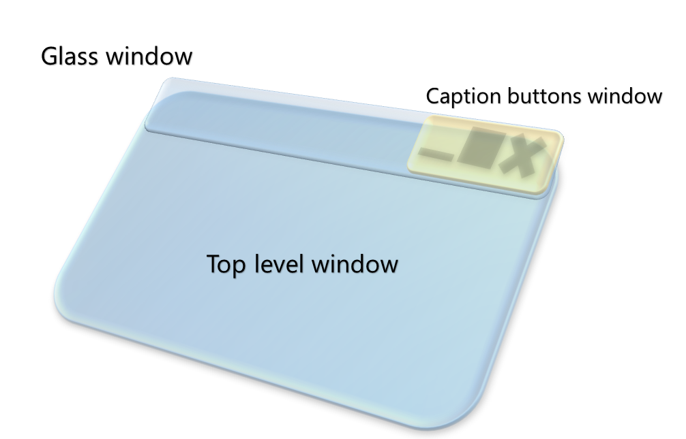
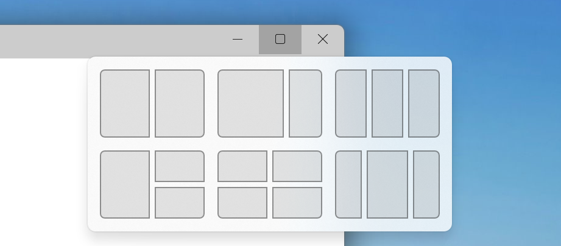
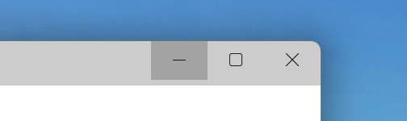
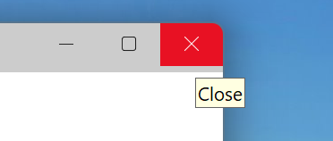

# Custom Title Bar

## Table of Contents

- [Under the hood](#under-the-hood)
  - [Glass window: concept](#glass-window-concept)
  - [Glass window: implementation](#glass-window-implementation)
  - [Min/Max/Close buttons and dragging](#minmaxclose-buttons-and-dragging)
  - [NCHITTEST behavior](#nchittest-behavior)
  - [Files](#files)

WinUI allows an app developer to use her own custom UI element as a title bar instead of a system provided one. More 
details can be found in the public documentation for 
[Window.SetTitleBar()](https://learn.microsoft.com/en-us/windows/windows-app-sdk/api/winrt/microsoft.ui.xaml.window.settitlebar?view=windows-app-sdk-1.2).
[Spec document](./customtitlebar-spec.md)
## Under the hood

The implementation of this feature involves 3 important parts:
1. Hide system drawn title bar from app's main window
2. Create another window on top of main window which acts as a **glass window**. 
Creating this glass window is the secret sauce to get custom title bar working. It is an important concept which is 
used in multiple areas of WinUI (like InputSite's BridgeWindow).
3. Create another small window which draws min/max/close caption buttons and handles their hit-testing responses.

Parts 2. and 3. are done by calling `Microsoft.UI.Input.InputNonClientPointerSource` apis.

### Glass window: concept

Conceptually, a glass window is a top level window which doesn't draw anything on it and hence, is visually 
transparent. However, it captures user input and does processing on it. From an end-user point of view, it is 
invisible. An example illustrates this:

> Setup: your main window has a button which shows a message when clicked. You can have a glass window on top of the 
> button so when the user clicks on the glass window, the code manually triggers the button click. From a user's POV, 
> she is clicking on the button but internally, the user's mouse click never reached there. It was captured and handled 
> by the glass window above the button's area.

This can be used in many powerful ways. Implementing a custom title bar is a good example of this.

### Glass window: implementation

In the custom title bar scenario, the glass window is created just above the custom UI element the developer is using 
as a title bar, and should have the same dimensions as the UI element. It can be any width or height.

We hide the system title bar by handling the `WM_NCCALCSIZE` message to extend the client area over the non-client 
area.

 

In the default case, WinUI 3 custom titlebar uses 2 special windows -
first one is a glass window which covers the entire non client regin i.e. titlebar region
and provides dragging capability, second one draws min/max/close caption buttons and places
it at top right corner (top left for RTL cases), above any dragging glass window window in hit testing z-order. 

User code can create any number of glass windows for multiple drag regions. The api creates as many glass windows per drag region
and uses [`SetWindowRgn`](https://learn.microsoft.com/en-us/windows/win32/api/winuser/nf-winuser-setwindowrgn) to cut holes
and allow interactive controls like buttons to be placed in them. See `Microsoft.UI.Input.InputNonClientPointerSource` implementation
for details.
### Min/Max/Close buttons and dragging

The glass window captures the input to perform the drag operation when mouse drag happens. When a drag operation 
happens on the glass window, the code moves the main window around accordingly. From a user's point of view, dragging 
of main window is happening (without system title bar being present) with no information of glass window acting as a 
mediator. Similarly for resize operations. Such a workaround is needed because we cannot directly do drag operations on 
the main window. Non-client messages (NC messages) are needed for such operations to work but they never reach the main 
window and are filtered  by InputSite's Bridge Window (more on this later). Glass window provides a good workaround 
solution for it.

### NCHITTEST behavior

There is an **input sink** provided by Input that covers the entire main HWND and captures all input coming to it. Xaml 
doesn't draw to the main HWND, but rather a child Hwnd called `BridgeWindow` provided by the input sink. The input sink 
captures all input and transfers it to the `BridgeWindow`.

The input sink intentionally filters out NC ("non-client") messages by design. 
Therefore, messages such as [WM_NCHITTEST](https://docs.microsoft.com/en-us/windows/win32/inputdev/wm-nchittest) never 
reach Xaml code and get eaten up. In order to work around this, we leverage the existing "glass window" (called the 
**drag** window) and extend it over the min/max/close caption buttons. These min/max/close buttons are regular buttons
(though hosted in their own separate window)
which are hooked up to perform same operations as the system provided min/max/close buttons (as they were 
removed along with system title bar). Now the glass window covers up the entire width of Xaml app's window and is 
acting over entire non-client area.

When a `WM_NCHITTEST` request comes for the drag window, we take the pointer coordinates and match them against the 
Xaml window. If the pointer is over any of the caption buttons, we return their respective hit test message: 
`HTMAXBUTTON`, `HTMINBUTTON`, `HTCLOSE`. Snap flyout starts working this way.

We do the same thing with mouse move for hover and click. If mouse move or pointer down coordinates occur on the 
drag window exactly above the caption buttons in the Xaml window, we send the appropriate response to the Xaml 
window to do hover or click on that respective button. The appropriate Xaml functions are called to change the visual 
state of the buttons. The appropriate mouse leave events are also handled so all these events get cancelled on mouse 
leave.

### Files

The custom title bar feature is internally a control named **`WindowChrome`** and files are named accordingly.
The drag regions are provided by calling `Microsoft.UI.Input.InputNonClientPointerSource` apis which handle the
heavy lifting of creating glass windows, caption button windows and handling and responding to `NCHITTEST` messages by the OS.

* `WindowChrome` Control:
  * Dxaml layer: [`dxaml/xcp/dxaml/lib/WindowChrome_Partial.cpp`](../../dxaml/xcp/dxaml/lib/WindowChrome_Partial.cpp)
  * Core layer: [`dxaml/xcp/components/WindowChrome/CWindowChrome.cpp`](../../dxaml/xcp/components/WindowChrome/CWindowChrome.cpp)
* InputNonClientPointerSource: See the Windows App SDK documentation for this API.
