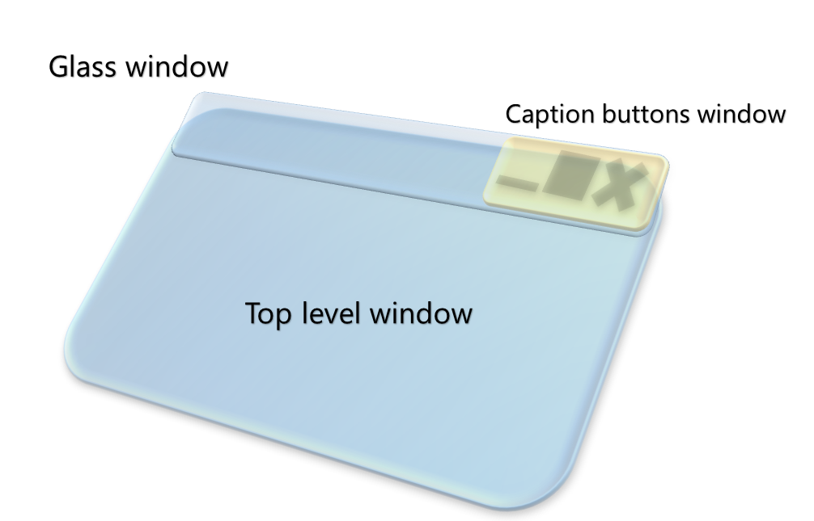
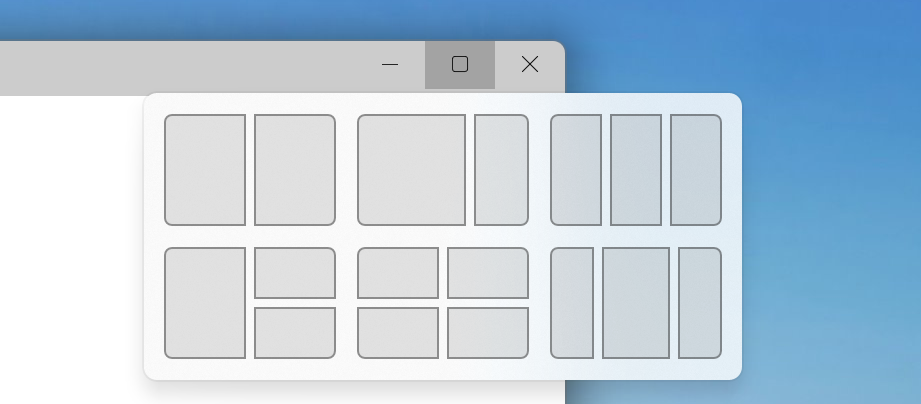
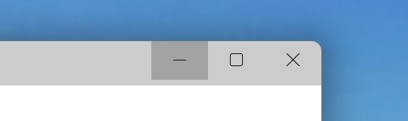
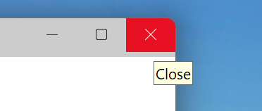

# Custom Title Bar

## Table of Contents

- [Under the hood](#under-the-hood)
  - [Glass window: concept](#glass-window-concept)
  - [Glass window: implementation](#glass-window-implementation)
  - [Client area and top border](#client-area-and-top-border)
  - [Min/Max/Close buttons and dragging](#minmaxclose-buttons-and-dragging)
  - [NCHITTEST behavior](#nchittest-behavior)
  - [Files](#files)

WinUI allows an app developer to use her own custom UI element as a title bar instead of a system provided one. More 
details can be found in the public documentation for 
[Window.SetTitleBar()](https://learn.microsoft.com/windows/windows-app-sdk/api/winrt/microsoft.ui.xaml.window.settitlebar).
[Spec document](./customtitlebar-spec.md)
## Under the hood

The current implementation has 3 important parts:
1. AppWindow hides the system-drawn title bar and extends the client area.
2. `Microsoft.UI.Input.InputNonClientPointerSource` provides a transparent **glass window** for caption drag regions.
3. AppWindow provides the system min/max/close caption controls.

AppWindow and `InputNonClientPointerSource` are Windows App SDK components whose implementations are outside this repository.

### Glass window: concept

Conceptually, a glass window is a top level window which doesn't draw anything on it and hence, is visually 
transparent. However, it captures user input and does processing on it. From an end-user point of view, it is 
invisible. An example illustrates this:

> Setup: your main window has a button which shows a message when clicked. You can have a glass window on top of the 
> button so when the user clicks on the glass window, the code manually triggers the button click. From a user's POV, 
> she is clicking on the button but internally, the user's mouse click never reached there. It was captured and handled 
> by the glass window above the button's area.

This can be used in many powerful ways. Implementing a custom title bar is a good example of this.

### Glass window: implementation

In the custom title bar scenario, WinUI registers the custom title-bar element's bounds as a caption region with
`InputNonClientPointerSource`.

The Windows App SDK windowing layer hides the system title bar by handling `WM_NCCALCSIZE` to extend the client area
over the non-client area.

 

The Windows App SDK implementation uses a glass window for drag regions and a separate window for caption controls.
It owns their z-order and places the caption controls at the top-right corner (top-left for RTL).

Apps can register multiple caption rectangles and leave interactive XAML elements outside those regions. See the public
[`InputNonClientPointerSource`](https://learn.microsoft.com/windows/windows-app-sdk/api/winrt/microsoft.ui.input.inputnonclientpointersource)
documentation for the supported API behavior.

### Client area and top border

Windows normally divides a top-level window into a non-client area containing
the caption and resize frame, and a client area containing app content.

Windows sends
[`WM_NCCALCSIZE`](https://learn.microsoft.com/windows/win32/winmsg/wm-nccalcsize)
when it needs the client rectangle. When `wParam` is `TRUE`,
`NCCALCSIZE_PARAMS.rgrc[0]` is an input/output value. On entry it contains the
proposed outer window rectangle. Before returning, the handler replaces it with
the rectangle that should become the client area.

The return value does not contain the client rectangle. Returning zero selects
the default preservation behavior, which aligns the old client area with the
upper-left corner of the new client area. Windows reads the new client rectangle
from the updated `rgrc[0]`.

When content extends into the title bar, the Windows App SDK windowing layer
keeps the top of the proposed window rectangle instead of accepting the caption
inset calculated by `DefWindowProc`. The former caption region therefore becomes
client area. The AppWindow implementation that performs this calculation is
outside this repository.

```text
Normal window

+---------------------------+
| native caption            | non-client
+---------------------------+
| app client area           | client
+---------------------------+

Content extended into title bar

+---------------------------+ client y=0
| former caption area       | client
| app client area           |
+---------------------------+
```

`DesktopWindowImpl` hosts the XAML tree in a private
`Microsoft.UI.Content.DesktopChildSiteBridge` HWND. For a normal,
non-maximized window using `Window.ExtendsContentIntoTitleBar`,
`CWindowChrome` positions that child HWND at client y=1 and reduces its height
by one physical pixel:

```text
+---------------------------+ client y=0
| row reserved for DWM      | 1 physical pixel
+---------------------------+ client y=1
| DesktopChildSiteBridge    |
| WinUI content             |
+---------------------------+
```

The reserved row prevents the composition island and the native top border from
claiming the same pixel. On Windows 11, DWM draws the native top border in this
row, followed immediately by WinUI content. Windows 10 does not compose this
row identically when the top-level HWND has an opaque GDI redirection surface.

The visible one-pixel row is not the complete resize target. Windows uses its
DPI-aware resize-frame metrics to provide a larger top resize target.

#### Windows 10 frame workaround

The optional change `AlignExtendsContentIntoTitleBarBehavior` makes both ECITB
entry points reserve the same row. On systems where
`DWMWA_VISIBLE_FRAME_BORDER_THICKNESS` is unsupported, WinUI also extends the DWM
frame into the client area. The top margin comes from `AdjustWindowRectExForDpi`
using the window's styles and DPI. It is the standard caption/resize-frame
height, not the visible border height or an additional offset for XAML.

This follows Windows Terminal's
[`_UpdateFrameMargins` workaround](https://github.com/microsoft/terminal/blob/0b94a7ea041a0b67f13ac281a645a82e077e4578/src/cascadia/WindowsTerminal/NonClientIslandWindow.cpp#L884-L943).
On Windows 10 1809, extending only one pixel exposes the untinted backdrop in
the inactive top row; extending the standard top-frame height makes that row
match the side borders. This is precedent for the selected margin, not a claim
that it is the minimum working value. Frame extension can also change the
colors of other borders: in the observed light-frame configuration, active
borders become white even though only the top margin is nonzero.

For a top-level HWND with a GDI redirection surface, `WM_ERASEBKGND` retains the
normal background fill and paints the reserved row with the stock `BLACK_BRUSH`.
This exposes the DWM frame as described in
[Custom Window Frame Using DWM](https://learn.microsoft.com/windows/win32/dwm/customframe).
It does not require a buffered-paint bitmap or explicit alpha writes. HWNDs
with `WS_EX_NOREDIRECTIONBITMAP` skip this GDI workaround. The margins remain
top-only rather than requesting whole-client frame rendering with negative
values.

### Min/Max/Close buttons and dragging

`CWindowChrome` converts the custom title-bar bounds from XAML logical coordinates to physical client coordinates and
registers them with `InputNonClientPointerSource` as caption regions. The Windows App SDK then provides standard dragging
behavior. The min/max/close buttons remain AppWindow caption controls.

### NCHITTEST behavior

XAML renders through the child `DesktopChildSiteBridge`, not directly into the top-level HWND, so the XAML island does
not provide top-level non-client hit testing. WinUI identifies caption rectangles through
`InputNonClientPointerSource.SetRegionRects`. The Windows App SDK handles the underlying non-client input and coordinates
it with AppWindow caption controls, including maximize-button Snap Layouts behavior.







### Files

The WinUI side of the custom title-bar feature is internally represented by a control named **`WindowChrome`**.
Drag regions are registered through `Microsoft.UI.Input.InputNonClientPointerSource`; AppWindow and the Windows App SDK
own the underlying non-client input and caption-control implementation.

* `WindowChrome` Control:
  * Dxaml layer: [`dxaml/xcp/dxaml/lib/WindowChrome_Partial.cpp`](../../dxaml/xcp/dxaml/lib/WindowChrome_Partial.cpp)
  * Core layer: [`dxaml/xcp/components/WindowChrome/CWindowChrome.cpp`](../../dxaml/xcp/components/WindowChrome/CWindowChrome.cpp)
* Top-level HWND and window messages:
  [`dxaml/xcp/dxaml/lib/DesktopWindowImpl.cpp`](../../dxaml/xcp/dxaml/lib/DesktopWindowImpl.cpp)
* InputNonClientPointerSource:
  [Windows App SDK API documentation](https://learn.microsoft.com/windows/windows-app-sdk/api/winrt/microsoft.ui.input.inputnonclientpointersource)
* AppWindowTitleBar:
  [Windows App SDK API documentation](https://learn.microsoft.com/windows/windows-app-sdk/api/winrt/microsoft.ui.windowing.appwindowtitlebar)
