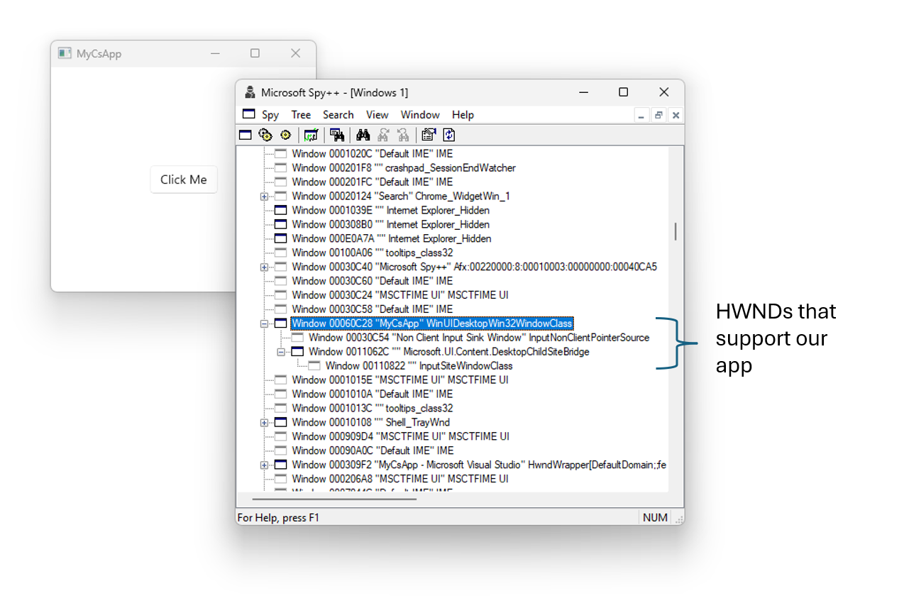
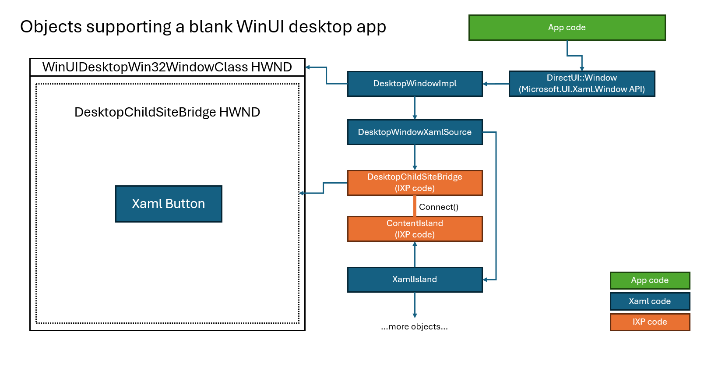

# Inspecting a WinUI Desktop app

## Table of Contents

- [Creating a WinUI Desktop C# app from VS template](#creating-a-winui-desktop-c-app-from-vs-template)
- [Startup](#startup)
- [Supporting Microsoft.UI.Xaml.Controls.dll](#supporting-microsoftuixamlcontrolsdll)
- [The HWND tree](#the-hwnd-tree)
  - [Inspecting the app with Spy++](#inspecting-the-app-with-spy)
  - [HWNDs and Supporting Objects](#hwnds-and-supporting-objects)
- [Creating a window on a new thread](#creating-a-window-on-a-new-thread)
  - [Starting a new thread and initialing Xaml on it](#starting-a-new-thread-and-initialing-xaml-on-it)
  - [Why does this create another MainWindow?](#why-does-this-create-another-mainwindow)
  - [Creating a different Window for that thread](#creating-a-different-window-for-that-thread)

In this doc, we will:
* Create a C# WinUI Desktop app and see how it works.
* Make it a multi-threaded app by creating a new thread and opening a new Window on it.

Here's some supporting md files that describe some of this in more detail:
* [app-model.md](app-model.md)
* [startup-overview.md](startup-overview.md)

## Creating a WinUI Desktop C# app from VS template

To follow along, create a new app by doing this:
* Launch Visual Studio
* File | New Project...
* Use the "Blank app, Packaged (WinUI 3 in Desktop)" C# VS template.  (I named mine "MyCsApp")
* After it loads, right click the solution and select "Manage NuGet packages for Solution..."
* Change the version of WindowsAppSDK to a 1.7 version (such as 1.7.250109001-experimental2)

Create and run the app, you'll get a window that contains a button that says "Click me".

## Startup

Recall from [app-model.md](app-model.md) we need a few things to start up Xaml:
* We need to create an **Application** object.
* We need to initialize a **WindowsXamlManager** object.

Let's look at the Main function in this generated cs file:

``` cs
// Generated file: App.g.i.cs
#if !DISABLE_XAML_GENERATED_MAIN
    /// <summary>
    /// Program class
    /// </summary>
    public static class Program
    {
        [global::System.CodeDom.Compiler.GeneratedCodeAttribute("Microsoft.UI.Xaml.Markup.Compiler"," 3.0.0.2501")]
        [global::System.Diagnostics.DebuggerNonUserCodeAttribute()]
        [global::System.STAThreadAttribute]
        static void Main(string[] args)
        {
            global::WinRT.ComWrappersSupport.InitializeComWrappers();
            global::Microsoft.UI.Xaml.Application.Start((p) => {
                var context = new global::Microsoft.UI.Dispatching.DispatcherQueueSynchronizationContext(
                    global::Microsoft.UI.Dispatching.DispatcherQueue.GetForCurrentThread());
                global::System.Threading.SynchronizationContext.SetSynchronizationContext(context);
                new App();
            });
        }
    }
#endif
```

Note a few things:
* I can define `DISABLE_XAML_GENERATED_MAIN` if I want to write my own "Main".
* This is an STA thread.
* We call `Application.Start`, which will run a message pump for us.  (Note that island-based apps don't do this).
* Inside that Start callback, I create my App object (this is our custom Xaml Application)

When we call Application.Start, Xaml does some things for us:
* It runs a DisaptcherQueue (recall this is needed to initialize a WindowsXamlManager)
* It initializes a WindowsXamlManager (recall this is needed to use Xaml on the thread)

Here's a useful function to step through:

``` cpp
// File: FrameworkApplication_Partial.cpp (in microsoft.ui.xaml.dll)
/* static */ _Check_return_ HRESULT FrameworkApplication::StartDesktop()
{
    ctl::ComPtr<ApplicationInitializationCallbackParams> pParams;
    ctl::ComPtr<xaml::Hosting::IWindowsXamlManagerStatics> windowsXamlManagerFactory;
    ctl::ComPtr<xaml::Hosting::IWindowsXamlManager> windowsXamlManager;

    wrl::ComPtr<msy::IDispatcherQueueControllerStatics> dispatcherQueueControllerStatics;
    wrl::ComPtr<msy::IDispatcherQueueController> dispatcherQueueController;
    wrl::ComPtr<msy::IDispatcherQueueController2> dispatcherQueueController2;

    IFCFAILFAST(wf::GetActivationFactory(
        wrl::Wrappers::HStringReference(RuntimeClass_Microsoft_UI_Dispatching_DispatcherQueueController).Get(),
        &dispatcherQueueControllerStatics));
    IFCFAILFAST(dispatcherQueueControllerStatics->CreateOnCurrentThread(&dispatcherQueueController));
    IFCFAILFAST(dispatcherQueueController.As(&dispatcherQueueController2));
```

Here we've created our DispatcherQueueController and started it on the thread.

``` cpp
    // init Jupiter for this thread
    IFC_RETURN(DXamlCore::Initialize(InitializationType::IslandsOnly));
```

This above call to DXamlCore::Initialize ends up initialing our DXamlCore thread-local storage. This allows
DXamlCore::GetCurrent to work.

> Why is the InitializationType "IslandsOnly"?  Today this basically means "not UWP".  Since the WinUI Desktop
app uses islands for its UI, to most of Xaml internally it just looks like we're running to support islands.

``` cpp

    // By spec, when an app initializes Xaml for use in a WinUI Desktop scenario, DispatcherShutdownMode
    // defaults to "OnLastWindowClose".
    DXamlCore::GetCurrent()->SetDispatcherShutdownMode(xaml::DispatcherShutdownMode_OnLastWindowClose);
```

As the comment says, here we configure Xaml so that it will post a quit message when the last Xaml window
closes.  (the default shutdown mode is that Xaml does not post a quit message).

``` cpp
    //  Invoke the ApplicationInitialization callback set by FrameworkApplication::StartImpl
    if (g_spApplicationInitializationCallback)
    {
        // Invoke the callback, usually to create a custom Application object instance
        IFCFAILFAST(ctl::ComObject<ApplicationInitializationCallbackParams>::CreateInstance(&pParams));
        IFCFAILFAST(g_spApplicationInitializationCallback->Invoke(pParams.Get()));
        g_spApplicationInitializationCallback.Reset();
    }
```

Remember that callback we passed into Application.Start in our Main function?  Here's where we call that.

``` cpp
    // Create WindowsXamlManager (WindowsXamlManager::Initialize will call FrameworkApplication::StartOnCurrentThread())
    IFCFAILFAST(ctl::GetActivationFactory(wrl_wrappers::HStringReference(
        RuntimeClass_Microsoft_UI_Xaml_Hosting_WindowsXamlManager).Get(), &windowsXamlManagerFactory));
    IFCFAILFAST(windowsXamlManagerFactory->InitializeForCurrentThread(&windowsXamlManager));
```

And now we initialize the WindowsXamlManager, which will kick off a bunch of its own initialization.
(recall that we needed to start the DispatcherQueue and create the Application before doing this)

``` cpp
    // We must have an XAML application instance at this point
    if(FrameworkApplication::GetCurrentNoRef() == nullptr)
    {
        XAML_FAIL_FAST();
    }
```

This above code ensures that the app created the Application object in its callback.

``` cpp
    //  Start the main WinUI Desktop message loop
    FrameworkApplication::RunDesktopWindowMessageLoop();
```

This call to RunDesktopWindowMessageLoop will keep running until it gets a quit message.

``` cpp
    // During this call, Xaml will synchronously shutdown on the thread in the
    // DispatcherQueue.FrameworkShutdownStarting event handler.
    IFCFAILFAST(dispatcherQueueController2->ShutdownQueue());

    return S_OK;
}
```

And we call ShutdownQueue to make sure everything on the thread gets cleaned up nicely.

## Supporting Microsoft.UI.Xaml.Controls.dll

Recall from [app-model.md](app-model.md) that we need to do some special things to make sure MUXC can
work correctly.
 * Ensure the app's IXamlMetadataProvider implementation will use MUXC's XamlControlsXamlMetaDataProvider.
 * Add MUXC's XamlControlsResources to the Application ResourceDictionary.

It takes some digging but we can see XamlControlsXamlMetaDataProvider getting set to an "_otherProviders" object:

``` cs
// XamlTypeInfo.g.cs (generated file)
    provider = new global::Microsoft.UI.Xaml.XamlTypeInfo.XamlControlsXamlMetaDataProvider() as global::Microsoft.UI.Xaml.Markup.IXamlMetadataProvider;
    otherProviders.Add(provider); 
    _otherProviders = otherProviders;
```

We can see this is used by the implementation of XamlTypeInfoProvider.GetXamlTypeByName (also in XamlTypeInfo.g.cs).

And that the generated class XamlMetaDataProvider implements IXamlMetadataProvider, and uses this XamlTypeInfoProvider
type:

``` cs
// XamlTypeInfo.g.cs (generated file)
public sealed partial class XamlMetaDataProvider : global::Microsoft.UI.Xaml.Markup.IXamlMetadataProvider
{
    private global::MyCsApp.MyCsApp_XamlTypeInfo.XamlTypeInfoProvider _provider = null;

```

And finally we can see that our App object uses that **XamlMetaDataProvider** object for **GetXamlType**, which is 
a method of **IXamlMetadataProvider**.

``` cs
// XamlTypeInfo.g.cs (generated file)
public partial class App : global::Microsoft.UI.Xaml.Markup.IXamlMetadataProvider
{
    [global::System.CodeDom.Compiler.GeneratedCodeAttribute("Microsoft.UI.Xaml.Markup.Compiler"," 3.0.0.2501")]
    private global::MyCsApp.MyCsApp_XamlTypeInfo.XamlMetaDataProvider __appProvider;

    [global::System.CodeDom.Compiler.GeneratedCodeAttribute("Microsoft.UI.Xaml.Markup.Compiler"," 3.0.0.2501")]
    [global::System.Diagnostics.DebuggerNonUserCodeAttribute()]
    private global::MyCsApp.MyCsApp_XamlTypeInfo.XamlMetaDataProvider _AppProvider
    {
        get
        {
            if (__appProvider == null)
            {
                __appProvider = new global::MyCsApp.MyCsApp_XamlTypeInfo.XamlMetaDataProvider();
            }
            return __appProvider;
        }
    }

    /// <summary>
    /// GetXamlType(Type)
    /// </summary>
    [global::System.CodeDom.Compiler.GeneratedCodeAttribute("Microsoft.UI.Xaml.Markup.Compiler"," 3.0.0.2501")]
    [global::System.Diagnostics.DebuggerNonUserCodeAttribute()]
    public global::Microsoft.UI.Xaml.Markup.IXamlType GetXamlType(global::System.Type type)
    {
        return _AppProvider.GetXamlType(type);
    }
```

And we can see in App.xaml that we are indeed putting XamlControlsResources into the App's ResourceDictionary.

``` xml
<?xml version="1.0" encoding="utf-8"?>
<Application
    x:Class="MyCsApp.App"
    xmlns="http://schemas.microsoft.com/winfx/2006/xaml/presentation"
    xmlns:x="http://schemas.microsoft.com/winfx/2006/xaml"
    xmlns:local="using:MyCsApp">
    <Application.Resources>
        <ResourceDictionary>
            <ResourceDictionary.MergedDictionaries>
                <XamlControlsResources xmlns="using:Microsoft.UI.Xaml.Controls" />
                <!-- Other merged dictionaries here -->
            </ResourceDictionary.MergedDictionaries>
            <!-- Other app resources here -->
        </ResourceDictionary>
    </Application.Resources>
</Application>

```


## The HWND tree

### Inspecting the app with Spy++

If you run Spy++ and point it at the test app, you'll see something like this:



Here's the app's HWND tree:

```
* "MyCsApp" WinUIDesktopWin32WindowClass
  * "Non Client Input Sink Window" InputNonClientPointerSource
  * "" Microsoft.UI.Content.DesktopChildSiteBridge
    * "" InputSiteWindowClass
```

Here's what they do:
* **WinUIDesktopWin32WindowClass** is the top-level HWND.  The Xaml Window object creates it, manages it, and owns it. It also creates a DesktopWindowXamlSource to connect the Xaml content.
* **InputNonClientPointerSource** is an IXP HWND for handling input to the non-client area.  This is an invisible 0x0 HWND.
* **DesktopChildSiteBridge** is the HWND managed by the IXP DesktopChildSiteBridge object.  Recall that DesktopWindowXamlSource
creates a DesktopChildSiteBridge to connect the Xaml content to the HWND tree.
* **InputSiteWindowClass** is an invisible 0x0 HWND that is an implementation detail.  IXP code uses it to handle focus
and keyboard input.

### HWNDs and Supporting Objects

Here's a look at which objects are owning the two visible HWNDs:



## Creating a window on a new thread 

Let's look at how we can run Xaml on a second thread.

### Starting a new thread and initialing Xaml on it

Here, we change the myButton_Click handler to start a new thread:

``` cs
// MainWindow.xaml.cs (app code)
private void myButton_Click(object sender, RoutedEventArgs e)
{
    myButton.Content = "Clicked";

    var thread = new Thread(() =>
    {
        // First, we need to start the DispatcherQueue.
        DispatcherQueueController dqc = DispatcherQueueController.CreateOnCurrentThread();

        // We don't need to create an Application object because we've already created it,
        // and there can only be one per process.

        // Start up Xaml on the thread.
        WindowsXamlManager.InitializeForCurrentThread();

        // Run the "event loop", or "message pump".  This won't return until it gets a quit message.
        dqc.DispatcherQueue.RunEventLoop();

        // Clean everything up before the thread exits.
        dqc.ShutdownQueue();
    });
    thread.Start();
}
```

This is the basic boilerplate code for starting Xaml on a thread.

### Why does this create another MainWindow?

But it doesn't actually do anything, right?

Funny, it actually does!  Recall that:
* **Every time Xaml starts on a thread, the Application.OnLaunched function is called**

And our OnLaunched function looks like this:

``` cs
// App.xaml.cs (app code)
protected override void OnLaunched(Microsoft.UI.Xaml.LaunchActivatedEventArgs args)
{
    m_window = new MainWindow();
    m_window.Activate();
}
```

So, on that new thread where it doesn't _look_ like we're doing anything, we actually create and activate a new
copy of MainWindow!

Let's have a look at the stack when we hit OnLaunched on our new thread:

```
1. MyCsApp.dll!MyCsApp.App.OnLaunched
```
That's our app's definition of OnLaunched.
```
2. Microsoft.WinUI.dll!Microsoft.UI.Xaml.Application.Microsoft.UI.Xaml.IApplicationOverrides.OnLaunched
3. Microsoft.WinUI.dll!ABI.Microsoft.UI.Xaml.IApplicationOverrides.Do_Abi_OnLaunched_0
```
In 2-3 the managed projection assembly for Xaml, Microsoft.WinUI.dll, is calling the OnLaunched override.
```
4. Microsoft.ui.xaml.dll!DirectUI::FrameworkApplicationGenerated::OnLaunchedProtected
5. Microsoft.ui.xaml.dll!DirectUI::FrameworkApplication::InvokeOnLaunchActivated
6. Microsoft.ui.xaml.dll!DirectUI::FrameworkApplication::StartOnCurrentThreadImpl
7. Microsoft.ui.xaml.dll!DirectUI::FrameworkApplicationGenerated::StartOnCurrentThread
```
XamlCore::Initialize calls FrameworkApplication::StartOnCurrentThread.  This is where we can see
how FrameworkApplication is a confusing type.  There is only one FrameworkApplication per process,
so it's not really "starting up" -- it already went through its startup process when the app first ran.
So, "StartOnCurrentThread" really means something like "initialize Xaml on the current thread".
```
8. Microsoft.ui.xaml.dll!DirectUI::WindowsXamlManager::XamlCore::Initialize
9. Microsoft.ui.xaml.dll!DirectUI::WindowsXamlManager::Initialize
10. Microsoft.ui.xaml.dll!ctl::ComObjectBase::CreateInstanceBase
11. Microsoft.ui.xaml.dll!ctl::ComObject<DirectUI::WindowsXamlManager>::CreateInstance
12. Microsoft.ui.xaml.dll!ctl::ComObject<DirectUI::WindowsXamlManager>::CreateInstance
13. Microsoft.ui.xaml.dll!ctl::make<DirectUI::WindowsXamlManager>
14. Microsoft.ui.xaml.dll!DirectUI::WindowsXamlManagerFactory::InitializeForCurrentThreadImpl
15. Microsoft.ui.xaml.dll!DirectUI::WindowsXamlManagerFactory::InitializeForCurrentThread
```
In 8-15 Xaml is handling that WindowsXamlManager.InitializeForCurrentThread call.  Internally, WindowsXamlManager uses
a XamlCore type to help track its state.
```
16. Microsoft.WinUI.dll!ABI.Microsoft.UI.Xaml.Hosting.IWindowsXamlManagerStaticsMethods.InitializeForCurrentThread
17. Microsoft.WinUI.dll!Microsoft.UI.Xaml.Hosting.WindowsXamlManager.InitializeForCurrentThread
```
16-17 is the managed projection of WindowsXamlManager.InitializeForCurrentThread.
```
18. MyCsApp.dll!MyCsApp.MainWindow.myButton_Click.AnonymousMethod__1_0
```
18 is the lambda in our app for the secondary thread.
```
19. System.Private.CoreLib.dll!System.Threading.ExecutionContext.RunInternal
20. kernel32.dll!BaseThreadInitThunk
...
```

### Creating a different Window for that thread

That's not really want we want, we can change this to create the window only the first time through:

``` cs
// App.xaml.cs (app code)
protected override void OnLaunched(Microsoft.UI.Xaml.LaunchActivatedEventArgs args)
{
    // This function gets called whenever Xaml is initialized on a new thread, but
    // we really only want to create and show the MainWindow on the main thread.
    if (m_window != null)
    {
        return;
    }
    m_window = new MainWindow();
    m_window.Activate();
}
```

And now let's modify the code on our new thread to show a different Window, to make it clear that we can:

``` cs
    // First, we need to start the DispatcherQueue.
    DispatcherQueueController dqc = DispatcherQueueController.CreateOnCurrentThread();

    // We don't need to create an Application object because we've already created it,
    // and there can only be one per process.

    // Start up Xaml on the thread.
    WindowsXamlManager.InitializeForCurrentThread();

    dqc.DispatcherQueue.TryEnqueue(() =>
    {
        // Create some basic Xaml content and show it on a new Window.
        var button = new Button() { Content = "Hello from another thread!" };
        button.Click += (s, e) => { button.Content = "Clicked"; };
        var root = new Grid();
        root.Children.Add(button);
        Window window = new Window();
        window.Content = root;
        window.Activate();
        
        // When this window is closed, we want to exit the event loop.
        window.Closed += (s, e) =>
        {
            dqc.DispatcherQueue.EnqueueEventLoopExit();
        };
        // We could also do this by setting:
        // Application.Current.DispatcherShutdownMode = DispatcherShutdownMode.OnLastWindowClose;
    });

    // Run the "event loop", or "message pump".  This won't return until it gets a quit message.
    dqc.DispatcherQueue.RunEventLoop();

    // Clean everything up before the thread exits.
    dqc.ShutdownQueue();
```
Note:
* Now we have two windows visible in our app, each running on its own thread.
* Application.DispatcherShutdownMode is thread-specific, and it defaults to ExplicitShutdown on each thread.
The first thread we started Xaml on set DispatcherShutdownMode to OnLastWindowClose, but this one is still ExplicitShutdown
unless we change it.
* That call to EnqueueEventLoopExit() will cause RunEventLoop() to return.
