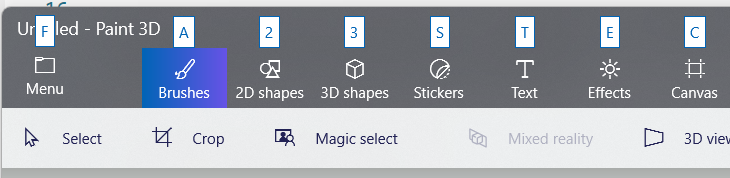

AccessKeyManager.EnterDisplayMode
===

# Background

Access keys are in "display mode" when showing the key tip that can be used to invoke a command.
For example in Paint3D (the "F", "A", "2", etc):



You typically go into display mode by pressing the `Alt` key and
leave it by pressing `Alt` again or by pressing `Escape`.

[More info on access keys](https://learn.microsoft.com/en-us/windows/apps/design/input/access-keys.)

There's also an API to _exit_ display mode programmatically
([AccessKeyManager.ExitDisplayMode](https://docs.microsoft.com/windows/windows-app-sdk/api/winrt/Microsoft.UI.Xaml.Input.AccessKeyManager.ExitDisplayMode)),
but no API to enter it.
The enter case is added in this spec.

_Spec note: the immediate need for this is for File Explorer to show access keys on context menus.
The scenario is: the user opens a context menu with the keyboard (e.g. the AppsMenu key),
and the access key tips need to show up automatically; not waiting for the `Alt` key to be pressed.
To accomplish this, `EnterDisplayMode` is called._


# API Pages

## AccessKeyManager.EnterDisplayMode class

Call this method to display access keys for the current focused element of the provided root.
The scope cannot be null.

This call has no effect if the scope is already in display mode.
If another scope is in display mode, it will be exited.

After calling this, the
[AccessKeyManager.IsDisplayModeEnabled](https://docs.microsoft.com/windows/windows-app-sdk/api/winrt/Microsoft.UI.Xaml.Input.AccessKeyManager.IsDisplayModeEnabled)
property will be `true`.

In the following example code in a Xaml window enters display mode,
using the XamlRoot of its content

```xml
<Window>
    <Grid x:Name="_root">
    ...
```

```cs
public sealed partial class MainWindow : Window
{
    void EnterDisplayMode()
    {
        AccessKeyManager.EnterDisplayMode(_root.XamlRoot);
    }

```

# API Details

```cs
static runtimeclass AccessKeyManager
{
    {
        static void EnterDisplayMode(Microsoft.UI.Xaml.XamlRoot scope);
    }
}
```
