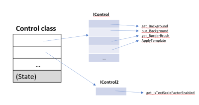

# WinUI3 APIs and FastAbi

## Table of Contents

  - [Background](#background)
  - [Fast ABI](#fast-abi)
  - [FastABI with a Class hierarchy](#fastabi-with-a-class-hierarchy)
- [WinUI Fast ABI plan](#winui-fast-abi-plan)
  - [Steps](#steps)

## Background

In WinRT APIs, a class is mostly a metadata concept, implemented as a set of interfaces. The metadata describes what 
interfaces a class implements. Beyond metadata, about the only runtime representation of a class is the 
[IInspectable.GetRuntimeClassName](https://docs.microsoft.com/en-us/windows/win32/api/inspectable/nf-inspectable-iinspectable-getruntimeclassname) 
method.

When new members are added to existing classes, binary compatibility is maintained by adding the new members as a new 
interface. So when Xaml added a Header property to `ComboBox`, it was defined and implemented on the `IComboBox2` 
interface. Language projections (C# and C++/WinRT) hide all of this and make all members across all the interfaces 
appear as if they're members directly on the class.

Early on we tried to avoid numbers, so instead of `IButton2` there's `IButtonWithFlyout` (which added the 
`Button.Flyout` property). But now we use incrementing numbers. The current record holder is 
[PackageManager](https://docs.microsoft.com/uwp/api/Windows.Management.Deployment.PackageManager),
which is up to `IPackageManager10`.

An object -- an instance of a class -- has a pointer to each interface vtable, which has pointers to each member 
implementation. So the more interfaces a class has, the bigger every one of its object instances are in memory, due to 
all the pointers the object instance has to have to its interface vtables.



And when a class has a base, each of the classes in the hierarchy has its own multiple interfaces. For example, a 
`Button` instance has to point to roughly two dozen WinRT interface vtables (plus a few COM interface vtables):

* `IButton`
* `IButtonWithFlyout`
* `IButtonBase`
* `IContentControl`, `IContentControl2`
* `IControl` ... `IControl7`
* `IFrameworkElement` ... `IFrameworkElement7`
* `IUIElement` ... `IUIElement10`
* `IDependencyObject`, `IDependencyObject2`
* (Plus interfaces for virtuals and protecteds)

There are a couple of performance problems with this. First is a working set hit of each WinRT object instance 
requiring another vtable pointer every time a new API is added to it. Another is that with all of those interfaces, 
there's a lot of `QueryInterface` going on.

## Fast ABI

WinRT's FastAbi is a feature to help with this. With this feature enabled during build, rather than adding new members 
to a class on a new interface, they get appended to the end of the existing interface. So the `Widget` object need only 
have a pointer to the `IWidget` vtable, and not `IWidget2`, `IWidget3`, etc...

You opt a class in to FastABI support by setting the `[fastabi]` attribute (which requires setting `/fastabi` on the 
Midl compiler command line).

Now adding `Header` to `ComboBox` looks like:

```cs
[contract(WinUIContract,1)]
[fastabi(WinUIContract,1)]
runtimeclass ComboBox : ItemsControl
{
    public bool IsDropDownOpen
    public bool IsEditable { get; }
    ...

    [contract(WinUIContract,2)]
    {
        public object Header;
    }
}
```

This produces a WinRT interface like:

```cs
interface IComboBox
{
    public bool IsDropDownOpen
    public bool IsEditable { get; }
    ...

    public object Header;
}
```

The version on the `[fastabi]` attribute indicates at what version of the class the FastABI pattern started support. So 
if a class is introduced in V1 and `[fastabi]` is added in V3, then the default interface will include all but the V2 
members.

This all works as long as the language projection understands it, such as C++/WinRT. For languages that don't 
understand it, the object needs to support the default ABI pattern, meaning that there actually is an `IComboBox2` that 
`ComboBox` needs to be QI'able for:

```cs
interface IComboBox2
{
    public object Header;
}
```

> No support yet for FastABI in cs/winrt? Verify and open an Issue. **TODO**

The naïve way to support that would be for the `ComboBox` instance to have all the possible vtable pointers again, 
which would eliminate the perf benefit. Instead, the 2/3/4 interfaces can be implemented using tear-offs. With tear-off 
interfaces, there's no working set overhead unless/until code actually QIs for the interface.

## FastABI with a Class hierarchy

Fast ABI has one more feature that's useful for class hierarchies. Note that all the members declared by `ComboBox` can 
be on the one `IComboBox`, but `ComboBox` derives from `ItemsControl`, and it has the `IItemsControl` interface. And 
then there's `IControl`, `IFrameworkElement`, etc.

So object instances will still have multiple WinRT vtable pointers, one for each class. But that list is now only one 
per class, and no longer grows over time. (There are also interfaces for the protected and overrides pattern, for 
classes that have protected or virtual members.)

That would still make it necessary for consumers of the class the QI to  he different interfaces. For example QI to 
`IComboBox` to access the `Header` property, then QI to `IItemsControl` to access the `ItemsSource` property.

To eliminate these QIs, FastABI has one more feature: the default interface of an unsealed (aka composable) class gets 
a member at the end of its vtable named `base_BaseClassName`, which returns a raw pointer (not ref-counted) to the 
default interface of the base. This  member is not part of the projected WinRT API, it's only visible to low-level ABI 
consumer code of the class (such as the generated c++/winrt code).

For example, adding `[fastabi]` to ComboBox causes `IComboBox` to get a `base_ItemsControl` member that returns a raw 
pointer to the `IItemsControl` interface.

Note that this is added as the last member at the end of the vtable, and consequently the attribute can be put onto the 
class in a release after the class is introduced. This is possible because the `[fastabi]` attribute includes a version specifier. See below for the full `ComboBox` example.

# WinUI Fast ABI plan

For WinUI3 we  "flattened" all (most?) interfaces. For example, all seven of the 
`IComboBox` interfaces got collected into one interface (with a new IID). So the perf issue of per-version interfaces 
isn't an issue, and nothing further is being done for WinUI3.0.

After 3.0, we don't want to start up with the 2/3/4 interfaces again, so when we need to add APIs to an existing class 
we'll use FastABI by setting the `[fastabi]` attribute.

Recall that adding the `[fastabi]` attribute on an unsealed class immediately changes its default interface, by adding 
the `base_BaseName` member. The attribute is versioned, though, so that there's no confusion.

Using the `ComboBox.Header` example (a new member in V2), we'd have something like:

```cs
[contract(WinUIContract,1)]
[fastabi(WinUIContract,2)]
runtimeclass ComboBox : ItemsControl
{
    public bool IsDropDownOpen
    public bool IsEditable { get;}
    ...

    [contract(WinUIContract,2)]
    {
        public object Header;
    }
}
```

This will create an actual `IComboBox` ABI interface with:

```cpp
namespace Microsoft {namespace UI {namespace Xaml {namespace Controls {
    IComboBox : public IInspectable
    {
    public:
        /* [propget] */virtual HRESULT STDMETHODCALLTYPE get_IsDropDownOpen(
            /* [out, retval] */__RPC__out ::boolean * value
            ) = 0;
        /* [propput] */virtual HRESULT STDMETHODCALLTYPE put_IsDropDownOpen(
            /* [in] */::boolean value
            ) = 0;
        /* [propget] */virtual HRESULT STDMETHODCALLTYPE get_IsEditable(
            /* [out, retval] */__RPC__out ::boolean * value
            ) = 0;
        /* [propput] */virtual HRESULT STDMETHODCALLTYPE put_IsEditable(
            /* [in] */::boolean value
            ) = 0;

        ...

        // End of V1 interface

        // The V2 interface gets the base_ItemsControl special member because
        // the [fastabi] attribute was added in V2
        IItemsControl* base_ItemsControl() = 0;

        // V2 members 
        /* [propget] */virtual HRESULT STDMETHODCALLTYPE get_Header(
            /* [out, retval] */__RPC__deref_out_opt IInspectable * * value
            ) = 0;
        /* [propput] */virtual HRESULT STDMETHODCALLTYPE put_Header(
            /* [in] */__RPC__in_opt IInspectable * value
            ) = 0;

        // V3, V4, ... members will be added here

    }
}}}}
```

And `IComboBox2` (for older language projections):

```cpp
namespace Microsoft {namespace UI {namespace Xaml {namespace Controls {
    IComboBox2 : public IInspectable
    {
    public:
        /* [propget] */virtual HRESULT STDMETHODCALLTYPE get_Header(
            /* [out, retval] */__RPC__deref_out_opt IInspectable * * value
            ) = 0;
        /* [propput] */virtual HRESULT STDMETHODCALLTYPE put_Header(
            /* [in] */__RPC__in_opt IInspectable * value
            ) = 0;
    }
}}}}
```

## Steps

WinUI 3.0 (aka "V1") isn't implementing FastABI due to time on the schedule. It would be beneficial to do so, due to 
the `base_Base` special member, but there's no object instance size benefit since the interfaces have been flattened.

The steps to adopting and implementing fastabi in WinUI after 3.0:
* Implement a tear-off solution
    * This isn't necessary for code such as Xaml/MUXC, which is implemented with cpp/winrt;
     it's built in to the language projection
    * WRL has an implementation?
    * For Xaml/DXaml, adapt an existing implementation to the ctl template library
    * Add some kind of checking, maybe a test hook, to validate that the tear-off code never happens unexpectedly
* For new classes, set `[fastabi]`
* For new members on V1 classes, set `[fastabi(2)]`
* Wherever possible, use the base_BaseClass special method
