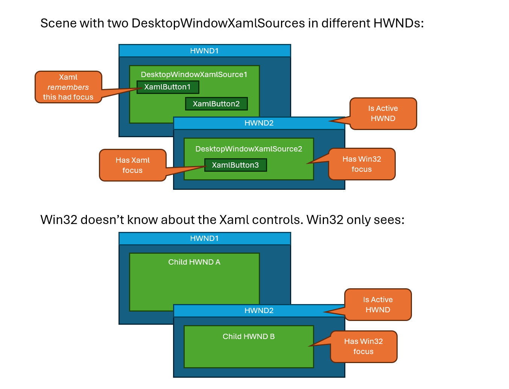
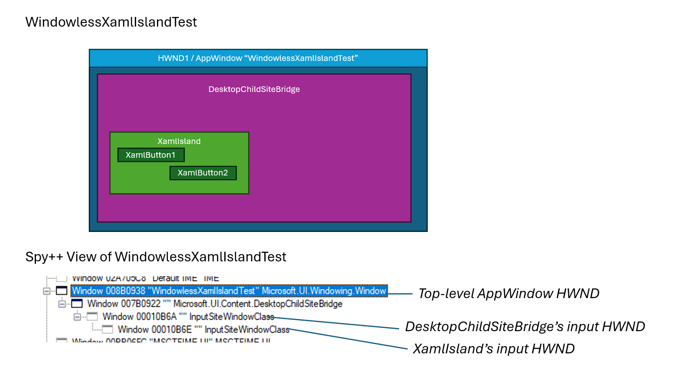
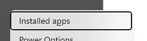

# Focus in WinUI 3

## Table of Contents

- [Focus and keyboard](#focus-and-keyboard)
- [Win32 focus & Xaml Focus](#win32-focus--xaml-focus)
  - [Win32 focus](#win32-focus)
  - [Xaml focus](#xaml-focus)
  - [How Win32 focus and Xaml focus are integrated](#how-win32-focus-and-xaml-focus-are-integrated)
    - [When a Xaml island gets Win32 focus, Xaml tries to set Xaml focus to a Xaml element.](#when-a-xaml-island-gets-win32-focus-xaml-tries-to-set-xaml-focus-to-a-xaml-element)
    - [When the app programatically sets Xaml focus to a Xaml element, Xaml sets win32 focus to the island that contains that element.](#when-the-app-programatically-sets-xaml-focus-to-a-xaml-element-xaml-sets-win32-focus-to-the-island-that-contains-that-element)
    - [When a Xaml island loses Win32 focus, the focused element in that island loses Xaml focus.](#when-a-xaml-island-loses-win32-focus-the-focused-element-in-that-island-loses-xaml-focus)
    - [Each Xaml Island remembers what Xaml element last had focus.](#each-xaml-island-remembers-what-xaml-element-last-had-focus)
  - [Example of Win32 focus and Xaml focus](#example-of-win32-focus-and-xaml-focus)
  - [What about Windowless Xaml Islands?](#what-about-windowless-xaml-islands)
  - [What about WinUI Desktop apps?](#what-about-winui-desktop-apps)
  - [Debugging](#debugging)
- [WPF Focus Concepts NOT Adopted: Logical Focus and Focus Scopes](#wpf-focus-concepts-not-adopted-logical-focus-and-focus-scopes)
- [WebView2 input](#webview2-input)
- [Text input](#text-input)
- [Windowed Popups](#windowed-popups)
  - [Light Dismiss](#light-dismiss)
- [Focus rectangle / Focus rect](#focus-rectangle--focus-rect)
- [Tab navigation](#tab-navigation)
- [XYFocus](#xyfocus)
- [Focus APIs](#focus-apis)
  - [FocusManager API](#focusmanager-api)
  - [The Multi-Tree / XamlRoot problem](#the-multi-tree--xamlroot-problem)
  - [UIElement and Control focus APIs](#uielement-and-control-focus-apis)
- [Wish list](#wish-list)

## Focus and keyboard

The concept of focus is tied to keyboard input. Pointer input doesn't need a concept of focus, because hit testing will
detect what hwnd/element the pointer is over and direct it to the correct place. Keyboard, however, doesn't come with a
hit test. When somebody presses "a" on the keyboard, it's not obvious who should get the keystroke. Focus solves that
problem.

For more details see the [Keyboard Focus and
Activation](https://learn.microsoft.com/en-us/windows/win32/inputdev/about-keyboard-input#keyboard-focus-and-activation)
section of the Keyboard Input Overview article.

## Win32 focus & Xaml Focus

The term "focus" is overloaded. Win32 has a concept of focus (e.g. this hwnd has focus and keystroke events should be
delivered to it), and separately Xaml has a concept of focus (e.g. this `Button` should get the keystroke events sent to
Xaml). Xaml's concept of focus builds on top of Win32 focus and provides finer granularity.

### Win32 focus

Win32 focus is Windows' (user32) idea of what has focus, that's been around since the early days of Windows.  (see above link)

``` cpp
    // Set Win32 focus to an HWND "myHwnd"
    ::SetFocus(myHwnd);
```

Win32 focus also has implications for text input, because Xaml relies on other components for its `TextBox` controls to
work correctly. More on that below.

**Activation**: Also note that only one top-level HWND on a thread can be **active** at a time.  The active top-level HWND
is the top-level HWND for the child HWND that has Win32 Focus.

### Xaml focus

Since Xaml's controls aren't each backed by HWNDs, Xaml keeps track of which Xaml control has focus.  We call this "Xaml focus".

Like Win32 focus, Xaml focus is for answering the question "when keyboard input happens, what Xaml control should it go to?".
Each Xaml island has at most one Xaml element inside that has Xaml focus.

Xaml's
[`UIElement.Focus`](https://learn.microsoft.com/en-us/windows/windows-app-sdk/api/winrt/microsoft.ui.xaml.uielement.focus)
method actually takes a `FocusState` param that includes Pointer and Programmatic focus. These values only indicate
_how_ the UIElement obtained focus.  It still only affects keyboard input.

``` cpp
    // Set Xaml focus to a Button named "myButton" (cpp/winrt)
    // The "Pointer" FocusState means that focus was set because of Pointer input.
    // (This causes Xaml to not show the focus rectangle)
    myButton().Focus(winrt::FocusState::Pointer);
```

### How Win32 focus and Xaml focus are integrated

Let's discuss a few specific ways Win32 focus and Xaml focus work together.

#### When a Xaml island gets Win32 focus, Xaml tries to set Xaml focus to a Xaml element.

You can observe this behavior by doing this:
* Run an app like WinUI Gallery
* Setting a breakpoint on `Microsoft_UI_Xaml!CFocusManager::SetWindowFocus`
* Use "alt+tab" to activate the WinUI Gallery window

If you step through the function, you'll arrive at this code, which is raising the FocusManager.GotFocus
event to the app:

```cpp
_Check_return_ HRESULT CFocusManager::SetWindowFocus(
    _In_ const bool isFocused,
    _In_ const bool isShiftDown)
{
    // ...
        // Raise the FocusManagerGotFocus event to the focus manager asynchronously
        m_pCoreService->GetEventManager()->Raise(
            EventHandle(KnownEventIndex::FocusManager_GotFocus),
            true, /*bRefire*/
            nullptr, /*sender, passing null because this is a static event*/
            spFocusManagerGotFocusEventArgs.get());
```

Here's what the callstack looks like at this point:

```
00 Microsoft_UI_Xaml!CFocusManager::SetWindowFocus
01 Microsoft_UI_Xaml!ContentRootInput::ActivationManager::ProcessFocusInput
02 Microsoft_UI_Xaml!CInputManager::ProcessFocusInput
03 Microsoft_UI_Xaml!CInputServices::ProcessInput
04 Microsoft_UI_Xaml!CCoreServices::ProcessInput
05 Microsoft_UI_Xaml!CXcpBrowserHost::HandleInputMessage
06 Microsoft_UI_Xaml!CJupiterControl::HandleGenericMessage
07 Microsoft_UI_Xaml!CJupiterControl::HandleWindowMessage
08 Microsoft_UI_Xaml!CJupiterWindow::ProcessFocusEvents
09 Microsoft_UI_Xaml!CJupiterWindow::OnIslandGotFocus
0a Microsoft_UI_Xaml!CXamlIslandRoot::OnIslandGotFocus // Xaml is getting the InputFocusController.GotFocus event
0b Microsoft_UI_Xaml!CXamlIslandRoot::SubscribeToInputKeyboardSourceEvents::__l44::<lambda_6>::operator() 
0c Microsoft_UI_Xaml!Details::DelegateArgTraits<...>::Invoke
...
16 Microsoft_UI_Input!InputFocusControllerWinRT::OnGotFocusEvent_Callback
17 Microsoft_UI_Input!InputFocusControllerWinRT::OnWindowMessage_Callback
...
21 Microsoft_UI_Input!InputSiteHwndWinRT::MessageHandler
22 Microsoft_UI_Input!InputSiteHwndWinRT::WndProcStatic_NoLock // Input is getting win32 WM_SETFOCUS message on its WndProc
...
37 Microsoft_UI_Windowing_Core!EnterContextAndProcessWindowMessage
38 USER32!UserCallWinProcCheckWow   // The win32 WM_SETFOCUS is raised
39 USER32!DispatchClientMessage
3a USER32!__fnDWORD
...
3c <Win32 SetFocus system call>    // The actual Win32 SetFocus is called
3d Microsoft_UI_Input!InputSiteHwndWinRT::SetFocus_Callback::__l2::<lambda_...>::operator()
...
42 Microsoft_UI_Input!InputFocusControllerWinRT::TrySetFocus_Callback
43 Microsoft_UI_Input!InputFocusControllerWinRT::Api::TrySetFocus
44 Microsoft_UI_Xaml!CXamlIslandRoot::TrySetFocus
45 Microsoft_UI_Xaml!DirectUI::XamlIslandRootGenerated::TrySetFocus
46 Microsoft_UI_Xaml!DirectUI::DesktopWindowImpl::SetFocusToContentIsland // When the Desktop Window gets activated,
                                                                         // we immediately focus its DesktopWindowXamlSource
47 Microsoft_UI_Xaml!DirectUI::DesktopWindowImpl::OnActivate
48 Microsoft_UI_Xaml!DirectUI::DesktopWindowImpl::OnMessage
49 Microsoft_UI_Xaml!BaseWindow<DirectUI::DesktopWindowImpl>::WndProc // Xaml's Desktop Window is getting a WM_ACTIVATE
4a USER32!UserCallWinProcCheckWow
4b USER32!CallWindowProcAorW
4c USER32!CallWindowProcW
4d Microsoft_UI_Windowing_Core!Core::YieldAndCall::WndProc::__l2::<lambda_fc4>::operator()
...
82 Microsoft_UI_Windowing_Core!EnterContextAndProcessWindowMessage
83 USER32!UserCallWinProcCheckWow
84 USER32!CallWindowProcAorW
...
8e USER32!GetMessageW
8f Microsoft_UI_Xaml!DirectUI::FrameworkApplication::RunDesktopWindowMessageLoop // Message loop runs indefinitely
90 Microsoft_UI_Xaml!DirectUI::FrameworkApplication::StartDesktop
91 Microsoft_UI_Xaml!DirectUI::FrameworkApplicationFactory::StartImpl
92 Microsoft_UI_Xaml!DirectUI::FrameworkApplicationFactory::Start
93 Microsoft_WinUI!ABI.Microsoft.UI.Xaml.IApplicationStaticsMethods.Start
94 Microsoft_WinUI!Microsoft.UI.Xaml.Application.Start
95 WinUIGallery!WinUIGallery.Program.Main
...
a7 hostfxr!hostfxr_main_startupinfo
a8 WinUIGallery_exe!exe_start
a9 WinUIGallery_exe!wmain
aa WinUIGallery_exe!invoke_main
ab WinUIGallery_exe!__scrt_common_main_seh
ac KERNEL32!BaseThreadInitThunk
...
```

Notice how on the stack we can see that the Xaml Desktop Window is getting a WM_ACTIVATE message.  When it gets that
message, it immediately sets focus to its DesktopWindowXamlSource.

#### When the app programatically sets Xaml focus to a Xaml element, Xaml sets win32 focus to the island that contains that element.

You can see this in focusmgr.cpp in UpdateFocus.  When focus changes, we update m_pFocusedElement to point to the new
focused element, and then immediately set win32 focus:

``` cpp
CFocusManager::UpdateFocus(_In_ const FocusMovement& movement)
{
    // ...
    // Update the focused control
    m_pFocusedElement = pNewFocus;
    AddRefInterface(m_pFocusedElement);
    m_realFocusStateForFocusedElement = nonCoercedFocusState;

    if (ShouldSetWindowFocus(movement))
    {
        // Note: This ultimately calls IInputKeyboardSource2::TrySetFocus...
        m_contentRoot.GetFocusAdapter().SetFocus();
    }
```

#### When a Xaml island loses Win32 focus, the focused element in that island loses Xaml focus.

Here's what happens when an island's HWND loses focus:

* Win32 sends WM_KILLFOCUS message to HWND at IXP layer, indicating it's lost focus.
  * IXP stack raises a InputFocusController.LostFocus to Xaml.
    * Xaml routes this through JupiterWindow/JupiterControl layers.
      * Xaml SYNCHRONOUSLY raises a UIElement.LosingFocus to app.
        * App handles UIElement.LosingFocus
      * Xaml queues an asynchronous UIElement.LostFocus event.
* Xaml ASYNCHRONOUSLY raises a UIElement.LostFocus event.
  * App handles UIElement.LostFocus

Here's what a callstack looks like in Visual Studio when Xaml is raising the UIElement.LosingFocus event
to the app (App97) synchronously:

```
App97.dll!App97.MainWindow.focusButton_LosingFocus 	
Microsoft.WinUI.dll!...
Microsoft.Windows.SDK.NET.dll!...
Microsoft.ui.xaml.dll!DirectUI::CRoutedEventSourceBase<...>::Raise 	
Microsoft.ui.xaml.dll!DirectUI::CRoutedEventSourceBase<...>::UntypedRaise 	
Microsoft.ui.xaml.dll!DirectUI::DependencyObject::FireEvent 	
Microsoft.ui.xaml.dll!DirectUI::DXamlCore::FireEvent 	
Microsoft.ui.xaml.dll!AgCoreCallbacks::FireEvent 	
Microsoft.ui.xaml.dll!FxCallbacks::JoltHelper_FireEvent 	
Microsoft.ui.xaml.dll!CCoreServices::CLR_FireEvent 	
Microsoft.ui.xaml.dll!CommonBrowserHost::CLR_FireEvent 	
Microsoft.ui.xaml.dll!CControlBase::ScriptCallback 	
Microsoft.ui.xaml.dll!CXcpDispatcher::OnScriptCallback 	
Microsoft.ui.xaml.dll!CXcpDispatcher::OnWindowMessage 	
Microsoft.ui.xaml.dll!CXcpDispatcher::ProcessMessage 	
Microsoft.ui.xaml.dll!CXcpDispatcher::WindowProc
user32.dll!UserCallWinProcCheckWow 	
user32.dll!SendMessageWorker 	
user32.dll!SendMessageInternal 	
user32.dll!SendMessageW 	
Microsoft.ui.xaml.dll!CXcpDispatcher::SendMessageW // Xaml sends a Win32 Message to itself (we don't do this anymore)
Microsoft.ui.xaml.dll!CXcpBrowserHost::SyncScriptCallbackRequest
Microsoft.ui.xaml.dll!CEventManager::RaiseHelper 	
Microsoft.ui.xaml.dll!CEventManager::Raise 	
Microsoft.ui.xaml.dll!CEventManager::RaiseRoutedEventBubbling 	
Microsoft.ui.xaml.dll!CEventManager::RaiseRoutedEvent 	
Microsoft.ui.xaml.dll!CFocusManager::RaiseChangingFocusEvent<CLosingFocusEventArgs> 	
Microsoft.ui.xaml.dll!CFocusManager::RaiseAndProcessGettingAndLosingFocusEvents 	
Microsoft.ui.xaml.dll!CFocusManager::SetWindowFocus 	
Microsoft.ui.xaml.dll!ContentRootInput::ActivationManager::ProcessFocusInput 	
Microsoft.ui.xaml.dll!CInputManager::ProcessFocusInput 	
Microsoft.ui.xaml.dll!CInputServices::ProcessInput 	
Microsoft.ui.xaml.dll!CCoreServices::ProcessInput 	
Microsoft.ui.xaml.dll!CXcpBrowserHost::HandleInputMessage 	
Microsoft.ui.xaml.dll!CJupiterControl::HandleGenericMessage 	
Microsoft.ui.xaml.dll!CJupiterControl::HandleWindowMessage 	
Microsoft.ui.xaml.dll!CJupiterWindow::ProcessFocusEvents 	
Microsoft.ui.xaml.dll!CJupiterWindow::OnIslandLostFocus 	
Microsoft.ui.xaml.dll!CXamlIslandRoot::OnIslandLostFocus // Xaml is getting the LostFocus event from Input
Microsoft.ui.xaml.dll!CXamlIslandRoot::SubscribeToInputKeyboardSourceEvents::__l52::<lambda_7>::operator 	
Microsoft.ui.xaml.dll!Microsoft::WRL::Details::DelegateArgTraits<long  	
Microsoft.UI.Input.dll!Microsoft::WRL::Details::CreateAgileHelper::__l2::<lambda_1>::operator 	
... // Input is getting a win32 WM_KILLFOCUS message
Microsoft.UI.Input.dll!WindowsMessageDeliveryInputSiteWinRT::Private::OnWindowMessage_Callback	
Microsoft.UI.Input.dll!WindowsMessageDeliveryAdapter::ProcessWindowMessage_NoLock 	
Microsoft.UI.Input.dll!WindowsMessageDeliveryAdapter::StaticSubclassWndProc_NoLock 	
Microsoft.UI.Input.dll!WindowsMessageDeliveryAdapter::s_FeatureProc 	
Microsoft.UI.Windowing.Core.dll!Core::YieldAndCall::FeatureProc 	
Microsoft.UI.Windowing.Core.dll!Windowing::ExternalFeature::FeatureProc 	
Microsoft.UI.Windowing.Core.dll!Windowing::FeatureCallContext::CallNextHandler 	
Microsoft.UI.Windowing.Core.dll!Windowing::FeatureCallManager::CallFeatureChain 	
Microsoft.UI.Windowing.Core.dll!Windowing::Window::ProcessMessage 	
Microsoft.UI.Windowing.Core.dll!Windowing::Window::ProcessWindowMessage 	
Microsoft.UI.Windowing.Core.dll!EnterContextAndProcessWindowMessage 	
user32.dll!UserCallWinProcCheckWow 	
user32.dll!DispatchClientMessage 	
user32.dll!__fnDWORD 	
...
user32.dll!GetMessageW 	
Microsoft.ui.xaml.dll!DirectUI::FrameworkApplication::RunDesktopWindowMessageLoop // Xaml message pump runs indefinitely
Microsoft.ui.xaml.dll!DirectUI::FrameworkApplication::StartDesktop 	
Microsoft.ui.xaml.dll!DirectUI::FrameworkApplicationFactory::StartImpl 	
Microsoft.ui.xaml.dll!DirectUI::FrameworkApplicationFactory::Start 	
Microsoft.WinUI.dll!ABI.Microsoft.UI.Xaml.IApplicationStaticsMethods.Start 	
Microsoft.WinUI.dll!Microsoft.UI.Xaml.Application.Start 	
App97.dll!App97.Program.Main 	
...
hostfxr.dll!hostfxr_main_startupinfo 	
App97.exe!exe_start 	
App97.exe!wmain 	
App97.exe!invoke_main 	
App97.exe!__scrt_common_main_seh 	
kernel32.dll!00007fffeef5e8d7	Unknown
...
```

#### Each Xaml Island remembers what Xaml element last had focus.

Each island has its own **CFocusManager**.  Each CFocusManager keeps track of the last element to have focus.

``` cpp
// Inside Xaml, this is where we track which element has Xaml focus:
class CFocusManager {
    // ...
    // The element that currently has focus.
    CDependencyObject *m_pFocusedElement;
    // The element for which we draw the focus rect.  Sometimes the focused element
    // wants to draw the focus rect on the child element (see IsTemplateFocusTarget)
    xref_ptr<CDependencyObject> m_focusTarget;
    // The element that represents the actual focus rectangle itself.
    xref::weakref_ptr<CUIElement> m_focusRectangleUIElement;
    // ...
};

// But also, each UIElement remembers if it has focus:
// file: uielement.h
DirectUI::FocusState GetFocusState() const
{
    // Perf:  Avoid overhead of GetValueByIndex if the effective value is not actually set
    if (IsEffectiveValueInSparseStorage(KnownPropertyIndex::UIElement_FocusState))
    {
        CValue result;
        VERIFYHR(GetValueByIndex(KnownPropertyIndex::UIElement_FocusState, &result));
        return static_cast<DirectUI::FocusState>(result.AsEnum());
    }
    return DirectUI::FocusState::Unfocused;
}
```

> Why is m_pFocusedElement a DependencyObject?  You'll notice that Xaml sometimes seems confused about what kind of object(s)
can have focus.  At one point focus only was really only for UIElements, but some non-UIElements had
could take focus as well (e.g., `Hyperlink`).  So we'd started tracking focus using a DependencyObject which
covered both cases.  But you can still see different assumptions in various parts of the code.

When an app calls **Control.Focus()** to set Xaml focus to a Xaml element, the Xaml runtime will often also set Win32 focus
to the island's HWND.  Again, see **CFocusManager::ShouldSetWindowFocus** for when that will and won't happen.

One important thing related to Win32 focus is the `IInputKeyboardSource2::LostFocus` event. This is an event raised by a
Content object that lets Xaml know when its island has lost keyboard focus. Under the covers, this event is hooked up
directly to the [WM_KILLFOCUS](https://learn.microsoft.com/en-us/windows/win32/inputdev/wm-killfocus)
message
delivered to the internal hwnd backing the ContentSite. Hence it requires that the internal hwnd has Win32 focus first.
There is currently no code at the Content layer to automatically set focus on this internal hwnd, so it requires callers
(like Xaml) to call
`IInputKeyboardSource2::TrySetFocus`
first to take focus manually.

Xaml has two
places
that call into TrySetFocus - one from `CFocusManager::UpdateFocus`, and another from
`ContentRootInput::PointerInputProcessor::ProcessPointerInput`. See `dxaml/xcp/components/ContentRoot/PointerInputProcessor.cpp`.

Note that there are also times when we don't want to put
focus on the hwnd if explicit requested or for things like light dismiss - see
`CFocusManager::ShouldSetWindowFocus` (in `dxaml/xcp/core/dll/focusmgr.cpp`).


### Example of Win32 focus and Xaml focus

Here's a sample app to show what could be happening in an app:



Assume:
* All these HWNDs are on the same thread.

Note that:
* There can only be one HWND per thread with Win32 focus.
* Win32 focus stops at the DWXS boundary, it doesn't know what's inside.  It can only put focus on the DesktopWindowXamlSource's HWND.
* Even when a DesktopWindowXamlSource loses focus, it still remembers which Xaml element had focus last time.  But the Xaml
app will still see the LostFocus event get raised.


### What about Windowless Xaml Islands?

But wait -- we talked about DesktopWindowXamlSource, and a DesktopWindowXamlSource always has an HWND back it.  But what
about the Windowless XamlIsland scenario?  In this case, there may not be an HWND for it.

It's an implementation detail, but even in this case there will be a special HWND for each island.  There's an invisible 0x0 HWND
with window class "InputSiteWindowClass" that helps focus and input happen.

Here's a diagram of the WindowlessXamlIslandTest (see other MD files for more information about this test):




### What about WinUI Desktop apps?

Remember that a WinUI Desktop app is just a top-level window managed by DesktopWindowImpl with one big
DesktopWindowXamlSource inside.  So, all these concepts and rules apply the same.

The DesktopWindowImpl sets Win32 focus to the DesktopWindowXamlSource whenever it gets activated.
Well, it actually keeps track of the last child window that has focus in m_lastFocusedWindowHandle.

``` cpp
// File: DesktopWindowImpl.cpp
_Check_return_ HRESULT DesktopWindowImpl::OnActivate(WPARAM wParam, LPARAM lParam)
{
    // https://learn.microsoft.com/en-us/windows/win32/inputdev/wm-activate
    // higher bits mention if a window is minimized or not. non -zero value indicates that it is minimized.
    const bool isWindowMinimized = HIWORD(wParam) != 0;

    // Fire the Window Activated event for Xaml listeners
    // Don't raise xaml activation events if window is minimized
    if (!isWindowMinimized && WA_ACTIVE == LOWORD(wParam))
    {
        // WA_ACTIVE  : The window has been activated programmatically.
        IFC_RETURN(RaiseWindowActivatedEvent(xaml::WindowActivationState_CodeActivated));
    }
    else if (!isWindowMinimized && WA_CLICKACTIVE == LOWORD(wParam))
    {
        // WA_CLICKACTIVE : The window has been activated by pointer.
        IFC_RETURN(RaiseWindowActivatedEvent(xaml::WindowActivationState_PointerActivated));
    }
    else if (WA_INACTIVE == LOWORD(wParam))
    {
        if (!isWindowMinimized)
        {
            // Save the handle of the child window that currently has Focus.  The child
            // window will be given focus the next time this window is activated.
            // if triggered by window minimize, GetFocus returns null
            HWND hwndFocus = ::GetFocus();

            if (hwndFocus && IsChild(m_hwnd.get(), hwndFocus))
            {
                m_lastFocusedWindowHandle = hwndFocus;
            }
        }

        IFC_RETURN(RaiseWindowActivatedEvent(xaml::WindowActivationState_Deactivated));
    }
    //
    // If the window has been activated and is not minimized, set focus on the last child window
    // that had focus.  If that child window is the composition island, restore focus.
    //
    if (!isWindowMinimized && (WA_INACTIVE != LOWORD(wParam)))
    {
        // Set the focus to the child window that last had focus when this window was deactivated.
        // also enters when on such deactivation cases where m_lastFocusedWindowHandle didn't get set like in case of window minimize
        if (m_lastFocusedWindowHandle == nullptr || (m_lastFocusedWindowHandle == CInputServices::GetUnderlyingInputHwndFromIslandInputSite(m_islandInputSite.Get())))
        {
            // If focus is being set back on the island, set window focus to it and restore focus position.
            SetFocusToContentIsland();

            // WasFocusMoved may be false, but no action is required
            ctl::ComPtr<xaml_hosting::IXamlSourceFocusNavigationResult> spResult;
            IFCFAILFAST(RestoreFocus(&spResult));
        }
        else
        {
            ::SetFocus(m_lastFocusedWindowHandle);
        }
    }
// ...
```

Note also you can launch the WinUI Gallery app, navigate to "multiple windows", and click "Create new window"
to create a new Xaml Window on the same thread for quick-and-dirty testing.

### Debugging

Handy breakpoints:
```
// Called whenever Xaml focus changes or thinks about changing:
microsoft_ui_xaml!CFocusManager::UpdateFocus
// Set the focus state for an element:
microsoft_ui_xaml!CUIElement::UpdateFocusState
// "Plugin focus" is talking about the island's focus ("plugin" for historical reasons)
microsoft_ui_xaml!CFocusManager::SetPluginFocusStatus
// On what element should we draw the focus rect?
microsoft_ui_xaml!CFocusManager::GetFocusTarget
```

## WPF Focus Concepts NOT Adopted: Logical Focus and Focus Scopes

WPF had some focus concepts and mechanisms that haven't been ported to System Xaml nor WinUI3:
* Logical Focus
* Focus Scopes

When we need to add features, we usually look to WPF first to see if they have a similar feature set we should borrow... or at least
learn from.  WinUI custmers may want features like this in the future.

For more info, see [WPF Focus Overview](https://learn.microsoft.com/en-us/dotnet/desktop/wpf/advanced/focus-overview?view=netframeworkdesktop-4.8)

## WebView2 input

See the WebView2 documentation for details on WebView2 input handling.


## Text input

> Lots of todos:
> - Need a TextBox doc. We have an extensive TextBlock doc already.
> - Xaml's text input uses other components. What are they and what do they do? (RichEdit? TSF? Cicero? Are there
>   different code paths for different OSes?)
> - Does TextBox have an internal hwnd under the covers?
> - Lifted input problem: key messages don't come in on the UI thread, when some text component (Cicero?) requires it.
>   What problems did this cause (implications for IME)? How was it solved?

TextBoxBase handles key events at the Xaml level via
`CTextBoxBase::OnKeyDown` (in `dxaml/xcp/core/native/text/Controls/TextBoxBase.cpp`),
and responds by forwarding it to RichEdit via
[`ITextServices::TxSendMessage`](https://learn.microsoft.com/en-us/windows/win32/api/textserv/nf-textserv-itextservices-txsendmessage).

## Windowed Popups

As historical policy, Xaml's windowed popup hwnds (an explicit hwnd in system Xaml, now hidden inside the
PopupWindowSiteBridge in WinUI 3) never take focus. Focus stays with the main Xaml island's hwnd, and keyboard messages
(via the `IInputKeyboardSource2`'s WinRT events) are delivered there. Xaml will look at what control has Xaml focus and
route the key from there. It's possible that the currently focused Xaml control lives inside a windowed popup, in which
case it still gets the necessary key events through Xaml's own UIElement tree routing.

This "historical" part comes from back when Xaml had no concept of windowed popups, and all popups lived in the main
Xaml window. Back then key routing naturally went through the entire UIElement tree each time. When we added windowed
popups, it was easiest to keep that mechanism and route everything through entire island's UIElement tree. In a future
world we can allow popups hwnds to take focus themselves. It would require a change to Xaml to route keyboard events
through the windowed popup's subtree rather than the entire island's UIElement tree.

### Light Dismiss

Currently Xaml's light dismiss windowed popups rely on the
`IInputKeyboardSource2::LostFocus`
event to dismiss when a click lands outside Xaml. The calls stack ends up in
`Popup::OnXamlLostFocus` (in `dxaml/xcp/dxaml/lib/Popup_Partial.cpp`)
where we dismiss either the `FlyoutBase` or the `Popup` based on its light dismiss setting and its dismissal triggers.

This creates a dependency with Win32 focus. In order for light dismiss to work correctly, the main island must have
Win32 focus at the time the popup is opened.

Note that there's no good reason why light dismissing a popup involves the concept _keyboard_ focus. While some popups
require keyboard interaction, such as right clicking to open a context menu and navigating the items with the arrow
keys, other popups can be opened and light dismissed with the pointer without any clicks landing on anything that
interacts with the keyboard at all. This is just a convenient way to implement light dismiss using pieces that we
already have. In the long-term, we should be using Composition's own
`LightDismissPolicy`
object to handle light dismiss policy that happen outside the Xaml island.

## Focus rectangle / Focus rect

The focus rectangle is the rectangle Xaml draws to indicate focus:



Xaml draws the focus rect when the focused element's FocusState is "Keyboard".  If the user is using the keyboard,
we assume they probably want to see the focus rects!  

The app doesn't really have a good way to override this behavior, other than by setting the control's FocusState to
"Pointer".

Here's the code where we apply that logic:

``` cpp
// uielement.cpp
_Check_return_ HRESULT
CUIElement::UpdateFocusState(_In_ DirectUI::FocusState focusState)
{
    if (focusState != GetFocusState())
    {
        CValue value;
        value.Set(focusState);
        const CDependencyProperty *pFocusStateDP = GetPropertyByIndexInline(KnownPropertyIndex::UIElement_FocusState);
        IFC_RETURN(CDependencyObject::SetValue(pFocusStateDP, value));

        //If the keyboard is used to navigate to the element, then the focus rectangle should be displayed.
        //Conversely, the user shouldn't need to use the keyboard to remove the focus, so any act that would remove focus is acceptable.
        if (focusState == DirectUI::FocusState::Keyboard || focusState == DirectUI::FocusState::Unfocused)
        {
            const CDependencyProperty *pFocusProperty = this->GetPropertyByIndexInline(KnownPropertyIndex::UIElement_UseSystemFocusVisuals);
            CValue useSystemFocusVisualsValue;
            IFC_RETURN(this->GetValue(pFocusProperty, &useSystemFocusVisualsValue));

            //Check if the SystemFocusVisuals are enabled
            if (useSystemFocusVisualsValue.AsBool())
            {
                CUIElement* focusTargetDescendant = nullptr;

                if (OfTypeByIndex<KnownTypeIndex::Control>())
                {
                    CValue focusTargetDescendantValue;
                    const CDependencyProperty *pdp = this->GetPropertyByIndexInline(KnownPropertyIndex::Control_FocusTargetDescendant);

                    //Retrieve the FocusTargetDescendant from Sparse Storage
                    IFC_RETURN(this->GetValue(pdp, &focusTargetDescendantValue));
                    CDependencyObject* pDO = nullptr;
                    IFC_RETURN(DirectUI::CValueBoxer::UnwrapWeakRef(&focusTargetDescendantValue, pdp, &pDO));
                    focusTargetDescendant = do_pointer_cast<CUIElement>(pDO);
                }

                if (focusTargetDescendant != nullptr)
                {
                    CFocusManager* pFocusManager = VisualTree::GetFocusManagerForElement(this);
                    CUIElement::NWSetContentDirty(focusTargetDescendant, DirtyFlags::Render);
                    if (focusState == DirectUI::FocusState::Unfocused)
                    {
                        pFocusManager->SetFocusRectangleUIElement(nullptr);
                    }
                    else
                    {
                        pFocusManager->SetFocusRectangleUIElement(focusTargetDescendant);
                    }
                }
                else
                {
                    CUIElement::NWSetContentDirty(this, DirtyFlags::Render);
                }
            }
        }
    }
    return S_OK;
}
```


When Xaml detects that the user has been using the keyboard, it shows the focus rect so it's clear to the user where 
focus us.  But, there are likely problems with the logic that determines if the last input device was keyboard.
* Raising context menu with mouse or touch results in visible focus rect
* Annoying automatic focus box without using the keyboard

Search for WM_UPDATEUISTATE and WM_CHANGEUISTATE to see how Xaml asks windows what the last device type was.

## Tab navigation 

Xaml of course supports the user pressing tab and shift-tab to move keyboard focus around the app.

> Debugging: bp here to see Xaml calculating the tab stops: `microsoft_ui_xaml!CFocusManager::GetNextTabStop`

For Xaml Islands, the app must explicitly tell Xaml that focus is moving into an island.  And, Xaml raises an event to the app
when focus is leaving the island.  
* For how this works with a DesktopWindowXamlSource, see [here](xaml-islands/desktopwindowxamlsource.md)
* For XamlIslands, the API shape is still being worked out.


## XYFocus

Use arrow keys to move focus directionally around the app.  Was mostly for xbox, not used a lot today.

https://learn.microsoft.com/en-us/windows/windows-app-sdk/api/winrt/microsoft.ui.xaml.uielement.xyfocuskeyboardnavigation

>Question: Does MenuFlyout use XYFocus to handle the user using the up and down arrows to select different menu items?
No, this is handled by MenuFlyoutKeyPressProcess.h.

## Focus APIs

### FocusManager API
You can use the [`FocusManager`](https://learn.microsoft.com/en-us/windows/windows-app-sdk/api/winrt/microsoft.ui.xaml.input.focusmanager) API
to ask about and to manipulate focus in a few different ways.

This is not related to Xaml's internal FocusManager.  We have:
* Internal CFocusManager:  focusmgr.h/.cpp
* Public FocusManager: FocusManager_partial.h/.cpp

### The Multi-Tree / XamlRoot problem

FocusManager was created before Xaml supported multiple Xaml trees on the same thread.
Now that we do support this, some of the FocusManager APIs don't make sense anymore.

For example: **FocusManager.FindFirstFocusableElement(DependencyObject searchScope)** says this in the docs:

>searchScope: The root object from which to search. If null, the search scope is the current window.

That's a holdover from UWP.  In WinUI3, there's no concept of a "current window".  To make this function work,
the app needs to pass in a valid searchScope so Xaml knows where to look.

There is ongoing work to update FocusManager APIs to work better in win32 context now that UWP is unsupported.


### UIElement and Control focus APIs
There's also a bunch of focus APIs at the element level: `GotFocus`, `LostFocus`, `GettingFocus`, `LosingFocus`.
Also, `Control.Focus()`.


## Wish list

- How does focus work inside a popup?  E.g., the popup does not take win32 focus, the parent HWND keeps the focus.
- How does UseSystemFocusVisuals work?
- How do I debug a situation where the focus rect is unexpectedly visible or invisible?
- Walkthrough for focus-stealing bugs?