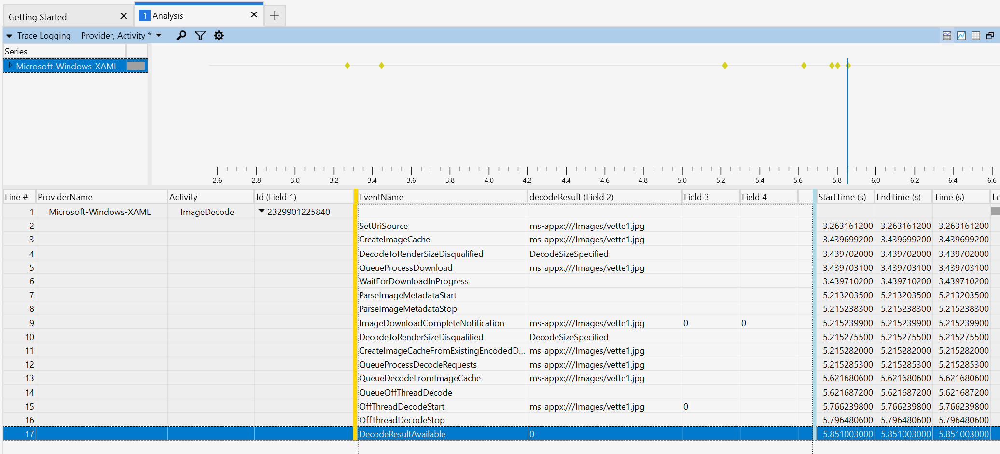

# Xaml Imaging

Xaml imaging is a complicated feature area with lots of history. This document explains the major concepts involved,
referencing code where appropriate.

## Table of Contents

- [Brass Tacks](#brass-tacks)
  - [ICompositionSurface](#icompositionsurface)
- [Stages of an image pipeline](#stages-of-an-image-pipeline)
  - [Download](#download)
  - [Metadata](#metadata)
  - [Decode](#decode)
    - [Background Decode](#background-decode)
  - [Upload](#upload)
    - [Background upload](#background-upload)
- [Other considerations](#other-considerations)
  - [Caching](#caching)
  - [Updating async operations](#updating-async-operations)
  - [Instrumentation](#instrumentation)
  - [Decode-to-render-size](#decode-to-render-size)
- [Specific imaging APIs](#specific-imaging-apis)
  - [BitmapImage](#bitmapimage)
  - [RenderTargetBitmap](#rendertargetbitmap)
  - [SoftwareBitmapSource](#softwarebitmapsource)
    - [Accepting a SoftwareBitmap](#accepting-a-softwarebitmap)
    - [Uploading on a background thread](#uploading-on-a-background-thread)
    - [Prefer uploading to ICompositionSurface directly](#prefer-uploading-to-icompositionsurface-directly)
    - [Notifying the app](#notifying-the-app)
  - [SurfaceImageSource and VirtualSurfaceImageSource](#surfaceimagesource-and-virtualsurfaceimagesource)
  - [SvgImageSource](#svgimagesource)
  - [WriteableBitmap](#writeablebitmap)
- [ETW events](#etw-events)
- [Future improvements](#future-improvements)
  - [New imaging pipeline](#new-imaging-pipeline)
  - [API notes](#api-notes)
- [Feature Word Salad/Wishlist](#feature-word-saladwishlist)

## Brass Tacks

Xaml renders its content* using Composition
[`Visual`](https://docs.microsoft.com/en-us/windows/winui/api/microsoft.ui.composition.visual?view=winui-3.0) objects.

> \* outside of hosting and interop scenarios.

The way to handle images using Composition is:
* A Composition
  [`SpriteVisual`](https://docs.microsoft.com/en-us/windows/winui/api/microsoft.ui.composition.spritevisual?view=winui-3.0),
  * with its
    [`SpriteVisual.Brush`](https://docs.microsoft.com/en-us/windows/winui/api/microsoft.ui.composition.spritevisual.brush?view=winui-3.0)
    hooked up to a Composition
    [`CompositionSurfaceBrush`](https://docs.microsoft.com/en-us/windows/winui/api/microsoft.ui.composition.compositionsurfacebrush?view=winui-3.0),
    * with its
      [`CompositionSurfaceBrush.Surface`](https://docs.microsoft.com/en-us/windows/winui/api/microsoft.ui.composition.compositionsurfacebrush.surface?view=winui-3.0)
      hooked up to a Composition
      [`ICompositionSurface`](https://docs.microsoft.com/en-us/windows/winui/api/microsoft.ui.composition.icompositionsurface?view=winui-3.0),
      * with the pixels inside.

Those `ICompositionSurface` objects are the [brass tacks](https://www.merriam-webster.com/dictionary/brass%20tacks) of
Xaml imaging. All this code exists to generate a `ICompositionSurface` with the pixels inside. Everything else is to
support generating this surface from multiple sources, or some optimization in the way that this surface is generated.

Imaging, more than other rendering/graphics features, deals a lot with caching and threading. This contributes to most
of the code complexity.


### ICompositionSurface

ICompositionSurface itself is a Composition interface for a surface. It's backed by multiple different concrete surface
types. See
[surfaces-overview.md](surfaces-overview.md)
for a more in-depth description of how Xaml deals with surfaces.

The imaging code frequently makes mentions of *hardware* surfaces and *software* surfaces. The difference is how these
surfaces are updated.
* Software surfaces are straightforward to use. They're just a buffer in system memory, plus metadata like the
  width/height. They can be updated by indexing into the buffer and setting values at any time, and they can read
  back from the buffer at any time.
* Hardware surfaces are more cryptic. They live in video memory, and access to them is gated behind APIs like
  [`ICompositionDrawingSurfaceInterop::BeginDraw`](https://docs.microsoft.com/en-us/windows/win32/api/windows.ui.composition.interop/nf-windows-ui-composition-interop-icompositiondrawingsurfaceinterop-begindraw)
  or
  [`ID3D11DeviceContext::Map`](https://docs.microsoft.com/en-us/windows/win32/api/d3d11/nf-d3d11-id3d11devicecontext-map).
  These APIs put the surface in a state where it can be updated, and return a pointer that can be used to write into the
  surface. After the update is complete, there's a matching API (like
  [`ICompositionDrawingSurfaceInterop::EndDraw`](https://docs.microsoft.com/en-us/windows/win32/api/windows.ui.composition.interop/nf-windows-ui-composition-interop-icompositiondrawingsurfaceinterop-enddraw)
  or
  [`ID3D11DeviceContext::Unmap`](https://docs.microsoft.com/en-us/windows/win32/api/d3d11/nf-d3d11-id3d11devicecontext-unmap))
  that commits the changes. The pointer returned from the "begin update" API is no longer valid to use after the "end
  update" API is called. These surfaces often also do not support reading contents back. Those that do can incur a
  significant performance penalty for doing so.

`ICompositionSurface` is a hardware surface.


## Stages of an image pipeline

There are 3 basic stages of the image pipeline:
1. Download - go from a [`Uri`](https://docs.microsoft.com/en-us/dotnet/api/system.uri?view=net-6.0) (a file in the app
   package, on disk, online, etc) to a stream
2. Metadata - read metadata about the image before decoding
3. Decode - go from a stream to a buffer of pixels
4. Upload - go from a buffer of pixels to an `ICompositionSurface`

Depending on the API, these steps may be skipped or modified. For example,
* The
  [`BitmapSource.SetSourceAsync(IRandomAccessStream)`](https://docs.microsoft.com/en-us/windows/winui/api/microsoft.ui.xaml.media.imaging.bitmapsource.setsourceasync?view=winui-3.0)
  method bypasses downloading entirely by directly providing the encoded image stream to Xaml.
* The
  [`SoftwareBitmapSource`](https://docs.microsoft.com/en-us/windows/winui/api/microsoft.ui.xaml.media.imaging.softwarebitmapsource?view=winui-3.0)
  class bypasses both the download and the decode and provides decoded pixels directly to Xaml.
* The
  [`WriteableBitmap`](https://docs.microsoft.com/en-us/windows/winui/api/microsoft.ui.xaml.media.imaging.writeablebitmap?view=winui-3.0)
  class allows the app to edit the pixels after the image has been decoded and will automatically upload the updated
  pixels.

API | Download | Decode | Upload | Details
--- | --- | --- | --- | ---
[`BitmapImage`](#bitmapimage) | optional<sup>1</sup> | yes | yes | Normal png/jpg/etc use cases. Supports animated gifs.
[`RenderTargetBitmap`](#rendertargetbitmap) | no | no | yes | Renders a `UIElement` tree directly into an `ICompositionSurface`. Also allows readback of pixels inside.
[`SoftwareBitmapSource`](#softwarebitmapsource) | no | no | yes | [`SoftwareBitmap`](https://docs.microsoft.com/en-us/uwp/api/windows.graphics.imaging.softwarebitmap?view=winrt-22000) interop API. Loads a `SoftwareBitmap` directly into an `ICompositionSurface`.
[`[Virtual]SurfaceImageSource`](#virtualsurfaceimagesource) | no | no | yes | DirectX interop API. Lets the app render into a [virtualized] `ICompositionSurface` with DirectX.
[`SvgImageSource`](#svgimagesource) | optional<sup>1</sup> | yes | yes | Displays SVG images
[`WriteableBitmap`](#writeablebitmap) | no | optional<sup>2</sup> | yes | Lets the app write into the pixels uploaded into the `ICompositionSurface`. Optionally decodes images.

> <sup>1</sup> Available if the
> [`BitmapImage.UriSource`](https://docs.microsoft.com/en-us/windows/winui/api/microsoft.ui.xaml.media.imaging.bitmapimage.urisource?view=winui-3.0)/[`SvgImageSource.UriSource`](https://docs.microsoft.com/en-us/windows/winui/api/microsoft.ui.xaml.media.imaging.svgimagesource.urisource?view=winui-3.0)
> property is used.
>
> <sup>2</sup> Available if the
> [`BitmapSource.SetSource`](https://docs.microsoft.com/en-us/windows/winui/api/microsoft.ui.xaml.media.imaging.bitmapsource.setsource?view=winui-3.0)/[`BitmapSource.SetSourceAsync`](https://docs.microsoft.com/en-us/windows/winui/api/microsoft.ui.xaml.media.imaging.bitmapsource.setsourceasync?view=winui-3.0)
> method is used.

The stages are discussed in more detail below.


### Download

"Download" is the stage that goes from a `Uri` to a stream with the encoded bits. It's a broad term and doesn't always
involve downloading a file over the internet. Many apps package images in their appx package and refer to them that way.

Download happens asynchronously on a background thread. The imaging code registers a callback with the download. When
the download completes, it calls back into
`ImageCache::GotDownloadResponse` (in `dxaml/xcp/components/imaging/ImageCache.cpp`)
via an
`ImageCacheDownloadResponseTask` (in `dxaml/xcp/components/imaging/ImageCacheDownloadResponseTask.cpp`).
We then get the encoded bits out and kick off the decode.

> todo
>
> Not understood well because we don't get bugs in this area.
>
> Are there ever async operations waiting on a download?
>
> When do we re-download again? Device lost?
>
> How are errors reported back?
>
> Is
> `ImageCache::Download`
> the only place that kicks off downloads? via
> `CCoreServices::UnsecureDownloadFromSite` (in `dxaml/xcp/core/dll/xcpcore.cpp`)?
> That can be async and is started in `ImageCache::TriggerProcessDecodeRequests`.
>
> What does the background thread do to download stuff?
>
>


### Metadata

"Metadata" is the stage that looks at the things like native image size. This can be thought of as the part of decoding
(because we're looking inside the encoded image that we downloaded) or separate from decoding (because we're not looking
at any pixel data). Regardless, it's something that happens separately from decoding, because it provides size
information that Xaml needs to run layout. The actual pixels themselves don't matter to layout - just the dimensions
(and aspect ratio, for cases of Uniform or UniformToFill stretch modes that preserve it) of the image matter.

There are a few entrypoints here:

1. `ImageProvider::GetImage` (in `dxaml/xcp/core/imaging/ImagingProvider/ImageProvider.cpp`)

   This method kicks off background decoding, provided that the metadata was parsed successfully (alternatively, if
we're doing a synchronous decode, it sets up the WIC decoder and copies pixels out right then and there). If the
metadata parse failed, then it notifies the `ImageSource` right away via a callback. Note that this has caused us
problems in the past, because one of the ways that an `ImageSource` responds to an error is to request another decode
right away, which gets us right back to this method and runs into another failure. This loops until we overflow the
stack.

   This is part of the old,
   pre-decode-to-render-size
   imaging code path. With decode-to-render-size enabled we'll try to look for cached image resources and kick off
   off-thread decoding directly via the `ImageCache`, skipping `ImageProvider`.

2. `CImageSource` (in `dxaml/xcp/core/core/elements/imagesource.cpp`)

   There are a couple places in `CImageSource` that looks at metadata.
   * `CImageSource::SetImageCache, which puts an ImageCache (could be a blank one from a cache miss or a hydrated one
     from a cache hit) in a `CImageSource`.
   * `CImageSource::OnImageViewUpdated`, which is called from `ImageViewBase::TriggerViewUpdated` when download completes,
     as well as from some places in `LoadedImageSurface`. This is part of the normal background decoding code path.


### Decode

"Decode" is the stage that goes from encoded bits to a decoded buffer. There are many formats for encoding images, like
png or jpg, and Xaml does not have code to do the decoding itself. Instead, we rely on the [Windows Imaging Component
(WIC)](https://docs.microsoft.com/en-us/windows/win32/wic/-wic-about-windows-imaging-codec)'s `IWICBitmapSource` class and
[`IWICBitmapSource::CopyPixels`](https://docs.microsoft.com/en-us/windows/win32/api/wincodec/nf-wincodec-iwicbitmapsource-copypixels)
function to do the decoding. Internally, WIC will look through the codecs installed on the system to find the
appropriate one to use for the encoded image that it was given.

Conceptually, the two important things are:
* Do we decode on the UI thread or a background worker thread? Doing this on a worker thread improves app
  responsiveness.
* Do we decode into a software surface that we keep around or a scratch buffer that we discard? Not keeping a software
  surface around reduces memory usage.

Xaml calls on WIC in two places. These correspond to decoding into a software surface (and keeping it around for upload
later) or a scratch buffer (and discarding it after immediately uploading):
* `CopyToSoftwareBitmap` (in `dxaml/xcp/components/imaging/ImagingUtility.cpp`),
  which decodes to a software surface. This surface is kept around and we do the upload
  later (see `dxaml/xcp/core/hw/hwtexturemgr.cpp`).
* `CopyToHardwareTiles`,
  which decodes to a temporary buffer. We immediately
  upload
  from this buffer to the `ICompositionSurface`.

Both of these "CopyTo" methods are helper methods to
`ImagingUtility::RealizeBitmapSource`,
which is itself called in two places. These correspond to decoding on the UI thread vs decoding on the background
thread:
* `ImagingProvider::GetImage` (in `dxaml/xcp/core/imaging/ImagingProvider/ImageProvider.cpp`),
  which is called on the UI thread.
* `AsyncImageDecoder::PresentAndProceedToNextFrame` (in `dxaml/xcp/components/imaging/AsyncImageDecoder.cpp`),
  which is called on a background thread.

So, in summary,

Function | Thread | Destination | Details
--- | --- | --- | ---
`CopyToSoftwareBitmap` called from `ImagingProvider::GetImage` | UI thread | Software surface
`CopyToHardwareTiles` called from `ImagingProvider::GetImage` | UI thread | scratch buffer
`CopyToSoftwareBitmap` called from `AsyncImageDecoder::PresentAndProceedToNextFrame` | Background thread | Software surface | todo - does this combination actually get used?
`CopyToHardwareTiles` called from `AsyncImageDecoder::PresentAndProceedToNextFrame` | Background thread | scratch buffer


#### Background Decode

> Thread communication constructs?
>
> Thread synchronization?


### Upload

"Upload" is the stage that goes from a decoded buffer to an `ICompositionSurface`. `ICompositionSurface` is a hardware
surface and access to it is gated behind APIs like
[`IDCompositionSurface::BeginDraw`](https://docs.microsoft.com/en-us/windows/win32/api/dcomp/nf-dcomp-idcompositionsurface-begindraw).
During upload, we call `BeginDraw`, copy into the surface, then call `EndDraw` to commit the update. The
`ICompositionSurface` is then loaded with the image and can be connected to a `CompositionSurfaceBrush` and a
`SpriteVisual`.

Like with decoding, the two important concepts are:
1. Do we upload on the UI thread or a background worker thread? Doing this on a worker thread improves app
   responsiveness.
2. Do we upload from a software surface or a scratch buffer? If we decoded to a software surface that's kept around then
   we can upload later at any time. If we decoded to a scratch buffer to reduce memory usage then we have to upload
   immediately.

Xaml does an upload in one of three places:

> four?

Function | Thread | Source | Details
--- | --- | --- | ---
`HWRgbTexture::UpdateTextureFromSoftware` | UI thread | Software surface | The oldest (and least optimized) code path
`AsyncCopyToSurfaceTask::CopyToHardwareSurfaces` | Background thread | Software surface | Used for `SoftwareBitmapSource` scenarios.
`CopyToHardwareTiles` called from `ImagingProvider::GetImage` | UI thread | Software surface | Happens immediately after decoding in the same function. todo - does this ever happen?
`CopyToHardwareTiles` called from `AsyncImageDecoder::PresentAndProceedToNextFrame` | Background thread | Scratch buffer | Happens immediately after decoding in the same function.

The mechanics of the upload process involves a lot of buffering. The `ICompositionSurface` has a BeginDraw/EndDraw API,
but Xaml keeps the updates in our `DCompSurface` and `HWRgbTexture` wrappers until the end of the frame when we actually
call BeginDraw/EndDraw. For the purposes of imaging, we can consider the upload to be committed after
`HWRgbTexture::Unlock(true)` (in `dxaml/xcp/core/hw/hwtexturemgr.cpp`)
is called. For more details about surface management, see
[surfaces-overview.md](surfaces-overview.md).

> Future aside:
>
> WinUI 3 currently uses a legacy `IDCompositionSurface` and wrap it in an `ICompositionSurface` wrapper using
> `CreateCompositionSurfaceForDCompositionSurface` (in `dxaml/xcp/plat/win/desktop/DCompSurface.cpp`).
> We should should complete the switch to WinRT composition and use a real `ICompositionSurface`. At that point we can
> switch to
> [`ICompositionDrawingSurfaceInterop::BeginDraw`](https://docs.microsoft.com/en-us/windows/win32/api/windows.ui.composition.interop/nf-windows-ui-composition-interop-icompositiondrawingsurfaceinterop-begindraw)
> and
> [`ICompositionDrawingSurfaceInterop::EndDraw`](https://docs.microsoft.com/en-us/windows/win32/api/windows.ui.composition.interop/nf-windows-ui-composition-interop-icompositiondrawingsurfaceinterop-enddraw).

> Future aside:
>
> `ICompositionDrawingSurfaceInterop` seems to be able to hold updates until [`Commit` is
> called](https://docs.microsoft.com/en-us/windows/uwp/composition/composition-native-interop):
> > When the application is done, it must call the EndDraw method. Only at that point are the new pixels available for
> > composition, but they still don't show up on screen until the next time all changes to the visual tree are
> > committed.
>
> So when we switch over to WinRT surfaces, we might not have to hold as many updates in Xaml anymore. We can just
> update the Composition surface whenever. There's still the perf consideration (putting the updates in a staging
> texture makes the copy faster?) and frame tearing consideration (having multiple BeginDraw/EndDraws that span multiple
> Commits might still cause tearing) though.


#### Background upload

Xaml will upload to a hardware surface in the background if we decoded in the background. In addition, there's a code
path that does only an upload on a background thread without a decode beforehand, used for SoftwareBitmapSource. The
sequence of events is this:

UI Thread:

1. `AsyncImageFactory::CopyAsync` (in `dxaml/xcp/components/imaging/AsyncImageFactory.cpp`)
   is the method called on the UI thread that schedules this background work.
2. `AsyncCopyToSurfaceTask` (in `dxaml/xcp/components/imaging/inc/AsyncCopyToSurfaceTask.h`)
   is the class that handles the background thread work. When it's created it takes a
   callback
   with an instance of the `CSoftwareBitmapSource` and its `CSoftwareBitmapSource::OnSoftwareBitmapImageAvailable`
   method for later. `AsyncImageWorkData` is a class that handles the data associated with the background thread upload.
3. The background thread work is queued through
   `CWinWorkItemFactory::CreateWorkItem`
   and `CWinWorkItem::Submit`, which calls
   `::SubmitThreadpoolWork` (in `dxaml/xcp/plat/win/browserdesktop/WinThreadPool.cpp`).

Background thread:

4. `CWinWorkItem::WorkCallback` is the background thread callback for the work. It calls through to
   `AsyncCopyToSurfaceTask::Execute` and
   `AsyncCopyToSurfaceTask::CopyOperation` (in `dxaml/xcp/components/imaging/AsyncCopyToSurfaceTask.cpp`),
   which decides between copying to software or hardware.
5. Once complete (successful or otherwise), `AsyncCopyToSurfaceTask::Execute` creates an instance of the
   `AsyncDecodeResponse`
   class to communicate back to the UI thread using the callback provided when it was created.
6. `ImageProviderDecodeHandlerTask::OnDecode` (in `dxaml/xcp/core/imaging/ImagingProvider/ImageProviderDecodeHandlerTask.cpp`)
   is called on the background thread to queue work back on the UI thread via `ImageTaskDispatcher::QueueTask` and
   `CCoreServices::ExecuteOnUIThread`.

UI thread:

7. `ImageProviderDecodeHandlerTask::Execute` runs on the UI thread later via
   `ImageTaskDispatcher::Execute` (in `dxaml/xcp/components/imaging/ImageTaskDispatcher.cpp`),
   and calls through to
   `CSoftwareBitmapSource::OnSoftwareBitmapImageAvailable` (in `dxaml/xcp/components/imaging/SoftwareBitmapSource.cpp`)
   to report completion. The background thread decode is finally complete.

> Future aside
>
> The classes and functions involved here can be simplified. There are currently two classes for thread synchronization:
> 1. `AsyncCopyToSurfaceTask`, which is queued on the UI thread and runs the background thread to do the upload, and
> 2. `ImageProviderDecodeHandlerTask`, which is queued on the background thread and runs on the UI thread to process the
>    result.
>
> CSoftwareBitmapSource never needs to have both of these things running or alive at the same time; it's either one or
> the other, so there's no need for them to be separate classes. These can be combined into a single class that has
> functions for queuing and running on both the UI and background threads. This simplifies the number of objects
> involved, and makes it easier to track the state of the background thread decode work.
>
> We also roll our own image task dispatcher on the UI thread in `ImageTaskDispatcher`. Can this be simplified to just
> go through the CoreMessaging timer instead?


## Other considerations


### Caching


### Updating async operations


### Instrumentation


### Decode-to-render-size


## Specific imaging APIs

This section describes the various types of
[`ImageSource`](https://docs.microsoft.com/en-us/windows/winui/api/microsoft.ui.xaml.media.imagesource?view=winui-3.0)
classes in the [`Microsoft.UI.Xaml.Media.Imaging`
namespace](https://docs.microsoft.com/en-us/windows/winui/api/microsoft.ui.xaml.media.imaging?view=winui-3.0).


### BitmapImage


### RenderTargetBitmap


### SoftwareBitmapSource

[`SoftwareBitmapSource`](https://docs.microsoft.com/en-us/windows/winui/api/microsoft.ui.xaml.media.imaging.softwarebitmapsource?view=winui-3.0)
is an API used to interop with the existing
[`SoftwareBitmap`](https://docs.microsoft.com/en-us/uwp/api/windows.graphics.imaging.softwarebitmap?view=winrt-22000)
class from the `Windows.Graphics.Imaging` namespace. Apps that use WIC may have `SoftwareBitmap` objects that they've
already decoded, and `SoftwareBitmapSource` lets them display those images in Xaml.

Since `SoftwareBitmap` represents decoded pixels, `SoftwareBitmapSource` doesn't have to worry at all about the download
or decode stages of the imaging pipeline. The only thing it needs to do is the upload. It does so on a background thread
whenever possible.

The basic functionality of `SoftwareBitmapSource` include:
1. Accept a `SoftwareBitmap` from the app and allow it to be used in a Xaml `ImageBrush`.
2. Do the upload of the `SoftwareBitmap` directly to an `ICompositionSurface` whenever possible. Do this on a background
   thread.
3. If a hardware surface isn't available, copy the `SoftwareBitmap` out to a software surface (again on a background
   thread) to be uploaded later (on the UI thread).
4. Notify the app via an `IAsyncAction` that the `SoftwareBitmap` has been set successfully, or that it has encountered
   an error.


#### Accepting a SoftwareBitmap

Apps will use
[`SoftwareBitmapSource.SetBitmapAsync`](https://docs.microsoft.com/en-us/windows/winui/api/microsoft.ui.xaml.media.imaging.softwarebitmapsource.setbitmapasync?view=winui-3.0)
to load a `SoftwareBitmap` into a `SoftwareBitmapSource`. This API returns an `IAsyncAction` immediately. Internally we
track the `IAsyncAction` that was handed back to the app in
`m_pAsyncAction`.

We also kick off an upload here and track its status. We sign up for a callback on
`CSoftwareBitmapSource::OnSoftwareBitmapImageAvailable`
whenever the background upload finishes (even if it finishes due to an error).


#### Uploading on a background thread

The `SetBitmapAsync` call goes through this stack to create an asynchronous task to decode on a background thread:

> `AsyncCopyToSurfaceTask::Create`<br/>
`AsyncImageFactory::CopyAsync`<br/>
`ImageProvider::CopyImage` - helper for SoftwareBitmapSource background thread copy operations<br/>
`CSoftwareBitmapSource::ReloadSource` - kicks off the upload on a background thread, sets the callback
function
once the upload is done<br/>
`CSoftwareBitmapSource::SetBitmap` - implementation of `SetBitmap`

Once the asynchronous task is submitted and executes, it goes through this stack:

> `AsyncCopyToSurfaceTask::CopyOperation` - calls out to `CopyToSoftwareSurface` or `CopyToHardwareSurfaces`<br/>
`AsyncCopyToSurfaceTask::Execute`


#### Prefer uploading to ICompositionSurface directly

The other important part of
`CSoftwareBitmapSource::ReloadSource`
is the call to
`CSoftwareBitmapSource::PrepareCopyParams` (in `dxaml/xcp/components/imaging/SoftwareBitmapSource.cpp`)
before the call to `CopyImage`. `PrepareCopyParams` is the place that determines whether we'll be uploading to a
hardware surface or a software surface. It will prefer a hardware
surface,
but if we were unable to allocate a hardware surface then we'll fall back to
software.

If we successfully allocated a hardware surface in `PrepareCopyParams`, we're not out of the woods yet. There's another
opportunity for things to fail during the background thread upload itself. `CopyToHardwareSurfaces` will call
`HWRgbTexture::LockRect`
to begin updating the `ICompositionSurface` inside. If the device for the underlying surface has been lost in the
meantime, this call will fail with a device lost error.

In this case, we can detect the device lost error in the
`CSoftwareBitmapSource::OnSoftwareBitmapImageAvailable`
callback and issue another background copy, this time to a software surface. If this `SoftwareBitmapSource` is connected
to an `ImageBrush` in the tree and used, the next UI thread frame will walk to the
`ImageBrush` (see `dxaml/xcp/core/hw/BaseContentRenderer.cpp`),
then the
`SoftwareBitmapSource` (see `dxaml/xcp/core/core/elements/imagesource.cpp`),
and begin an upload to an `ICompositionSurface` on the UI thread. This UI thread upload is one that we don't have to
worry about. If it encounters another device lost error, we'll recover as part of the UI thread's device lost recovery
code path and try to upload again from the same software surface that we still have.


#### Notifying the app

We handed back an `IAsyncAction` as soon as `SetBitmapAsync` returned, but we don't mark it as complete until we get a
callback at
`CSoftwareBitmapSource::OnSoftwareBitmapImageAvailable`.
If we get a call that an upload to a hardware surface failed with a device lost error, then we can try again with a
software surface and notify the app after that software upload completes.


### SurfaceImageSource and VirtualSurfaceImageSource


### SvgImageSource


### WriteableBitmap

## ETW events

Xaml's imaging events can now be seen in WPA's "Trace Logging" table, and you can now see a view like this:



For a given image, you'll be able to see points in time where:

* The source is set (`SetUriSource`)
* We start downloading (`QueueProcessDownload`, `WaitForDownloadInProgress`)
* The UI thread parses the encoded image's metadata (`ParseImageMetadataStart`, `ParseImageMetadataStop`)
* The UI thread receives the "download complete" notification (`ImageDownloadCompleteNotification`)
* The UI thread queues a UI thread work item to start decoding (`QueueProcessDecodeRequests`)
* The UI thread queues an off-thread decode (`QueueOffThreadDecode`)
* The off-thread decode itself (`OffThreadDecodeStart`, `OffThreadDecodeStop`)
* The UI thread notified that the decode is complete (`DecodeResultAvailable`)

The convenience here is that all image-related events are grouped together and can be separated on a per-image basis,
and it's easy to see the history of how an image goes through the pipeline. It's also easy to see where things get held
up. In the screenshot above there's an idle period from downloading at 3.439s to metadata parsing at 5.21s where nothing
is happening. This allows you to dig in further to see whether other images are also held up at this time, and to look
at other generic events/CPU info to see why there's a delay. In this case it was a very expensive hit testing pass that
kept the UI thread busy from 3.431s to 4.675s. This hit testing pass ran into many Measure/Arrange calls (presumably
from a hydrating ItemsRepeater) when it called UpdateLayout. Metadata parsing could not start until the UI thread was
free, and this delayed images showing up.

This is most of the imaging-related events, but not all of them. The major missing part is the off-thread download, the
surface upload, and more infrequent code paths like synchronous decoding on the UI thread.


## Future improvements

There are problems with images flickering when switching sources (Uri or stream). we should keep the old surface around
until a new hardware surface is ready to go.

### New imaging pipeline

Thought experiment for a new imaging pipeline:
* Explicit 4-stage process (download, metadata, decode, upload).
  * Stages can run independently. `BitmapSource.SetSourceAsync` and `SoftwareBitmapSource.SetBitmapAsync` provides a
    pre-downloaded stream already. `WriteableBitmap` can require an upload without a decode after the app writes some
    pixels.
* Can happen entirely off-thread. Notify the UI thread of download progress, metadata available, surface available.
  Block on the UI thread after metadata available in some circumstances (waiting for a decode size which hasn't been
  specified yet), but fewer synchronization points between image thread and UI thread in general.
  * Remove the `ImageTaskDispatcher`? CoreMessaging seems perfectly capable of scheduling and running work by itself.
    `ImageTaskDispatcher` would let Xaml control the relative priority and throttle back if the UI thread ticks are
    falling behind, but that's what CM priorities are for.
* A single stage can kick off multiple instances of successive stages. Specifically, one encoded image goes through
  download and metadata, and can kick off multiple decode stages for multiple decode sizes.
* Pipeline cache for looking up pipelines that are currently running. New requests can hop on an existing pipeline (or
  kick off a previously completed pipeline, in case of download image data already available).
  * This consolidates `ImageCache` and `SurfaceCache`. Also removes the need for an `ImageProvider` - the pipeline cache
    is the place you go to to get a pipeline.
* Remove the concept of views. Views were created to abstract change notification. Someone who cares about an image gets
  a view of it, and the view notifies them when it changes (e.g. downloaded image data is available). In practice this
  is too abstract and creates too many classes. `ImageSource` can listen to a pipeline directly. Use plain event
  listeners instead of interfaces with generic "OnImageViewUpdated" methods.
* DecodeToRenderSize needs to plug in after download (which doesn't necessarily for streams) and decode (where the size
  is needed). This feature is currently not enabled on streams.
* Animated gifs require decode and upload looping on a background thread, so a pipeline needs to be able to loop decode
  and upload. Does the UI thread need to be involved here? Will the thread keep decoding to new surfaces that the UI
  thread will pick up and connect to the tree, or can it atomically update the one that's already connected to the tree
  (then notify the UI thread to commit)?
* Debuggability - ETW events for running pipelines, debugger extensions for dumping and tracing pipelines that are
  running, pipelines that keep track of current state and what to do next, breadcrumbs between `ImageSource`, pipelines,
  and the pipeline cache, ways to see whether a pipeline is blocked on the UI thread
* Device-lost interop - does the pipeline take a weak ref on the device? Device-lost errors mean it can block at any
  stage beyond download. Does it revive itself or does it need the UI thread to kick off a separate pipeline? What's the
  policy for when the UI thread raises `ImageFailed` and when it silently swallows the error and tries to fix things
  itself?
* Produce `LoadedImageSurface` objects by default? What's the overhead here given that we have a Composition hardware
  surface already? Would better integrate them into the imaging pipeline and remove some redundant "hardware surface"
  abstractions (the LIS is the hardware surface).
* Remove `CMemorySurface` and switch to `SoftwareBitmap`?
* `SIS` and `VSIS` are exempt from the pipeline. `RTB` only care about the upload stage.

### API notes

* Add a `BitmapDecodeOptions` (or update BitmapCreateOptions) API? Values can be
None/DecodeToRenderSize/DecodeImmediately/Default (= DecodeToRenderSize). This allows apps to select decoding behavior.
It can be useful for an app to fully hydrate a BitmapImage and know that it will show up as soon as they put it in the
tree. Today they can't do that - they have to put it in the tree before we start downloading/decoding it.
* Why can't `WriteableBitmap` take a Uri? It's a `BitmapSource` so it doesn't have a `Uri` property, but conceptually
  what prevents us from just doing a download before the rest of the pipeline?


## Feature Word Salad/Wishlist

This is a list of all imaging-related features/keywords. It's used as a todo list for this doc, and as a list of things
to consider when we touch imaging code.

In no particular order:
```
Off-thread decode/background decode
Right-size decode/decode-to-render-size
DecodePixelWidth/Height
BitmapImage
WriteableBitmap
SoftwareBitmapSource
[Virtual]SurfaceImageSource
LoadedImageSurface
SVG
RenderTargetBitmap
Animated gif
Ignore image cache
ImageBrush
Tiling
Image
NineGrid
Dispose
Dpi
ImageOpened
Download progress
Natural image size for layout
Async operations
```

Implementation details word salad:
```
Software surface
Hardware surface
Virtual surface
OfferableSoftwareBitmap
HWTexture
HWTextureManager
ImageCache
ImageProvider
HWRgbTexture
A whole bunch of AsyncAsdf classes
```
