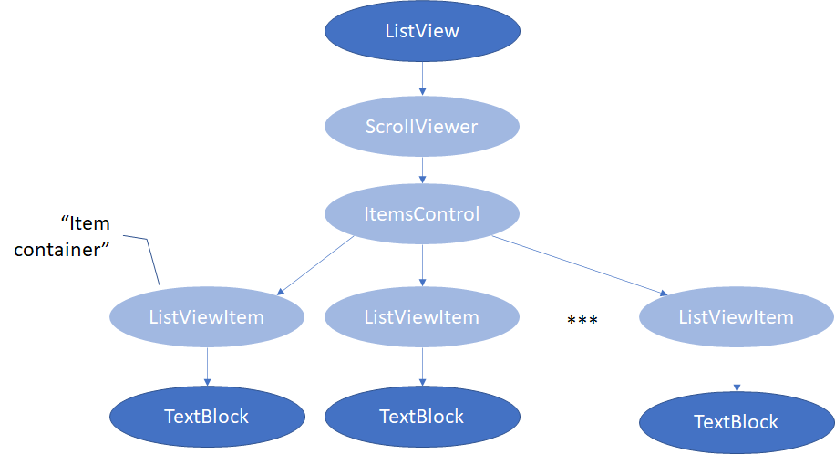
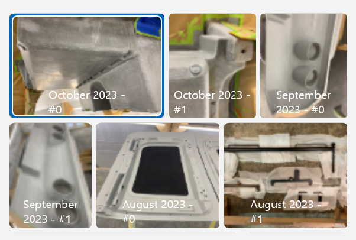
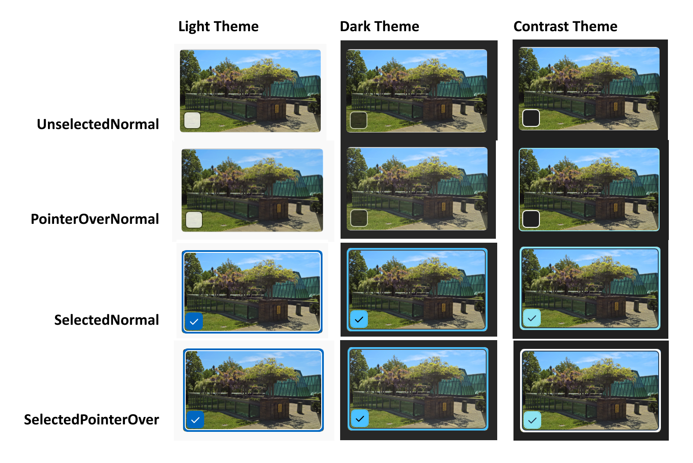
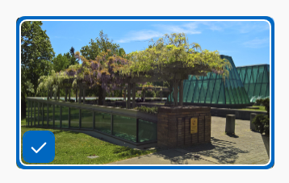
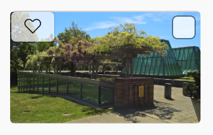
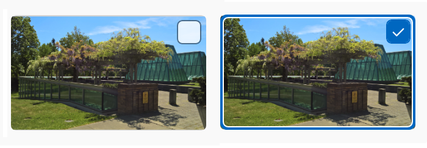

ItemContainer
===

# Background

Xaml's most commonly used list control is the
[ListView](https://docs.microsoft.com/windows/windows-app-sdk/api/winrt/Microsoft.UI.Xaml.Controls.ListView),
which displays a vertical list of items, typically using data binding.

This example shows the Person.FullName for each item in a `List<Person>`:

```xml
<ListView ItemsSource="{x:Bind People}">
    <ListView.ItemTemplate>
        <DataTemplate x:DataType="Person">
            <TextBlock Text="{x:Bind FullName}"/>
        </DataTemplate>
    </ListView.ItemTemplate>
</ListView>
```

The developer here is seeing only the `ListView` and the `TextBlock` APIs,
but there are actually several more objects that get generated:



The purpose of the `ListViewItem` object in this is to parent the
expanded `DataTemplate` (which in this case is just a `TextBlock`).
This role this `ListViewItem` is playing is called the "item container",
and while there is no actual item container type, the concept already exists, e.g. there's an
[ItemContainerStyle](https://docs.microsoft.com/windows/windows-app-sdk/api/winrt/Microsoft.UI.Xaml.Controls.ItemsControl.ItemContainerStyle).
API that puts a `Style` on whatever the actual item container type is for whatever list control.

We're introducing a new list control called `ItemsView`,
which is similar to a `ListView`, and similarly has an item container.
But now there's actually a concrete `ItemContainer` class, which is the purpose of this spec.

`ItemContainer` is a lightweight "container" with built in selection states and visuals.
The developer can easily wrap desired content with `ItemContainer` and use with `ItemsView` for
a collection control scenario.

_Spec Note: `ItemContainer` is meant to be a flexible building block with new APIs in planning to 
allow for use with other collection hosts, not just `ItemsView`.
As such, it is not named `ItemsViewItemContainer`._


# API pages


## ItemContainer class

The `ItemContainer` class represents an individual item in an `ItemsView` collection control.
It provides properties for customizing the appearance and content of the item.

Namespace: Microsoft.UI.Xaml.Controls

```cs
public class ItemContainer : Control
```



```xml
<ItemsView ItemsSource="{x:Bind Photos}">
    <ItemsView.ItemTemplate>
        <DataTemplate x:DataType="local:Photo">
            <ItemContainer>
                <Grid>
                    <Image Source="{x:Bind BitmapImage, Mode=OneWay}" />
                    <TextBlock Text="{x:Bind Text, Mode=OneWay}" />
                </Grid>
            </ItemContainer>
        </DataTemplate>
    </ItemsView.ItemTemplate>
</ItemsView>
```


## ItemContainer.Child property

Gets or sets the child element of the item, which can be any UIElement.
This is the content of the item.

_Spec note: There's precedent for the names `Content` and `Child` for this general case,
but this is `Child` because it's a UIElement type rather than Object type._

```cs
public Microsoft.UI.Xaml.UIElement Child{ get; set; };
```

## ItemContainer.IsSelected property

Gets or sets the selection state for an `ItemContainer` instance.

_Spec note: Updating the `IsSelected` state updates the ItemsView SelectionModel automatically, and vice versa._

```cs
public bool IsSelected { get; set; };
```

### Property Value

`bool` value that indicates whether the item is currently selected.
It toggles the selection visual's visibility. The default is `false`.


## ItemContainerAutomationPeer Class

Exposes `ItemContainer` types to Microsoft UI Automation.

_Spec note: this is just following standard pattern to have a `FooPeer` UIA API for each `Foo` control_

Namespace: Microsoft.UI.Xaml.Automation.Peers

```cs
public class ItemContainerAutomationPeer :  Microsoft.UI.Xaml.Automation.Peers.FrameworkElementAutomationPeer, Microsoft.UI.Xaml.Automation.Provider.ISelectionItemProvider, Microsoft.UI.Xaml.Automation.Provider.IInvokeProvider
```

Implements `ISelectionItemProvider`, `IInvokeProvider`


# API Details

```cs
namespace Microsoft.UI.Xaml.Controls
{

[MUX_PUBLIC]
[webhosthidden]
[contentproperty("Child")]
[MUX_PROPERTY_CHANGED_CALLBACK(TRUE)]
[MUX_PROPERTY_CHANGED_CALLBACK_METHODNAME("OnPropertyChanged")]
runtimeclass ItemContainer : Microsoft.UI.Xaml.Controls.Control
{
    ItemContainer();

    Microsoft.UI.Xaml.UIElement Child{ get; set; };

    [MUX_DEFAULT_VALUE("false")]
    Boolean IsSelected{ get; set; };

    static Microsoft.UI.Xaml.DependencyProperty ChildProperty{ get; };
    static Microsoft.UI.Xaml.DependencyProperty IsSelectedProperty{ get; };
    }
}

}

namespace Microsoft.UI.Xaml.Automation.Peers
{

[MUX_PUBLIC]
[webhosthidden]
unsealed runtimeclass ItemContainerAutomationPeer : Microsoft.UI.Xaml.Automation.Peers.FrameworkElementAutomationPeer, Microsoft.UI.Xaml.Automation.Provider.ISelectionItemProvider, Microsoft.UI.Xaml.Automation.Provider.IInvokeProvider
{
    ItemContainerAutomationPeer(Microsoft.UI.Xaml.Controls.ItemContainer owner);
}

}
```

# XAML markup considerations

## Visual groups and states

### Visual group: Combined States
#### Visual state: UnselectedNormal (Default)
#### Visual state: UnselectedPointerOver
- Entered when mouse is hovering over control.
#### Visual state: UnselectedPressed
- Entered when mouse is pressed over control.
#### Visual state: SelectedNormal
- Entered when `IsSelected="true"`.
#### Visual state: SelectedPointerOver
- Entered when `IsSelected="true"` and when mouse is hovering over control.
#### Visual state: SelectedPressed
- Entered when `IsSelected="true"` and when mouse is pressed over control.

### Visual group: SelectionStates
#### Visual state: Single (Default)
Entered when `SelectionMode` is set to `Single`.
#### Visual state: Multiple
Entered when `SelectionMode` is set to `Multiple`.

### Visual group: DisabledStates
#### Visual state: Enabled (Default)
#### Visual state: Disabled
- Entered when control is set to disabled.



## Theme resources

### Brushes

- ItemContainerBackground
- ItemContainerPointerOverBackground
- ItemContainerPressedBackground
- ItemContainerBorderBrush
- ItemContainerPointerOverBorderBrush
- ItemContainerPressedBorderBrush
- ItemContainerSelectedBackground
- ItemContainerSelectedPointerOverBackground
- ItemContainerSelectedPressedBackground
- ItemContainerSelectionVisualBackground
- ItemContainerSelectionVisualPointerOverBackground
- ItemContainerSelectionVisualPressedBackground
- ItemContainerSelectedInnerBorderBrush
- ItemContainerCheckBoxBackgroundUnchecked

### Other Resources
- `Double` ItemContainerDisabledOpacity
- `Double` ItemContainerCheckBoxMinWidth
- `Thickness` ItemContainerCheckBoxMargin
- `Thickness` ItemContainerSelectedInnerMargin
- `Thickness` ItemContainerSelectedInnerThickness
- `HorizontalAlignment` ItemContainerCheckBoxHorizontalAlignment
- `VerticalAlignment` ItemContainerCheckBoxVerticalAlignment

## Deferred loading considerations

- `PART_SelectionVisual`
- `PART_SelectionCheckBox`


# Appendix

**Note: The Appendix section is for notes and implementation details outside the API. 
This content won't be in the public docs.**


## File Explorer Requested Scenarios

### ItemContainer with Custom CheckBox Location, Actionable Button

Custom visuals can also be set on ItemContainer through xaml.

Overwrite exposed ThemeResource properties in xaml to customize `CheckBox` location.
Note that the CheckBox requires ItemsView to toggle its visibility.
Its visibility is set to false by default.



```xml
<ItemsView ItemsSource="{x:Bind Photos}">
    <ItemsView.ItemTemplate>
        <DataTemplate x:DataType="local:Photo">
            <ItemContainer 
                x:Name="CustomCheckBoxLocationItemContainer">
                <Image Source="Assets/scenics1.jpg"/>
                <ItemContainer.Resources>
                    <HorizontalAlignment x:Key="ItemContainerCheckBoxHorizontalAlignment">Left</HorizontalAlignment>
                    <VerticalAlignment x:Key="ItemContainerCheckBoxVerticalAlignment">Bottom</VerticalAlignment>
                </ItemContainer.Resources>
            </ItemContainer>
        </DataTemplate>
    </ItemsView.ItemTemplate>
</ItemsView>
```

Wrap actionable elements such as `ToggleButton` in ItemContainer.



```xml
<ItemsView ItemsSource="{x:Bind Photos}">
    <ItemsView.ItemTemplate>
        <DataTemplate x:DataType="local:Photo">
            <ItemContainer 
                x:Name="ItemContainerWithButton">
                <Grid>
                    <Image Source="Assets/scenics1.jpg"/>
                    <ToggleButton 
                        x:Name="HeartButton" 
                        Click="HeartButton_Click" 
                        ClickMode="Press" 
                        FontFamily="{ThemeResource SymbolThemeFontFamily}" 
                        Content="&#xEB51;" 
                        HorizontalAlignment="Right" 
                        VerticalAlignment="Top"/>
                    <Grid>
            </ItemContainer>
        </DataTemplate>
    </ItemsView.ItemTemplate>
</ItemsView>
```


## Future API Considerations


## **ItemContainer Class**

Future version of `ItemContainer` class with `UserCanSelect` and `UserCanInvoke` APIs.
These will allow more flexibility for enabling only certain containers in a collection,
such as disabled dates in a calendar.

```cs
namespace Microsoft.UI.Xaml
{

[MUX_PUBLIC]
[webhosthidden]
[contentproperty("Child")]
[MUX_PROPERTY_CHANGED_CALLBACK(TRUE)]
[MUX_PROPERTY_CHANGED_CALLBACK_METHODNAME("OnPropertyChanged")]
runtimeclass ItemContainer : Microsoft.UI.Xaml.Controls.Control
{
    ItemContainer();

    Microsoft.UI.Xaml.UIElement Child{ get; set; };

    [MUX_DEFAULT_VALUE("false")]
    Boolean IsSelected{ get; set; };

    static Microsoft.UI.Xaml.DependencyProperty ChildProperty{ get; };
    static Microsoft.UI.Xaml.DependencyProperty IsSelectedProperty{ get; };

    [MUX_PREVIEW]
    {
        [MUX_DEFAULT_VALUE("true")]
        Boolean UserCanSelect{ get; set; };

        [MUX_DEFAULT_VALUE("true")]
        Boolean UserCanInvoke{ get; set; };

        static Microsoft.UI.Xaml.DependencyProperty UserCanSelectProperty{ get; };
        static Microsoft.UI.Xaml.DependencyProperty UserCanInvokeProperty{ get; };
    }
}

}
```

### ItemContainer.UserCanSelect

Gets or sets a value indicating whether the user is allowed to select the item through
`ISelectionItemProvider.Select()`.
This does not overwrite setting selection state programmatically.

```cs
public bool UserCanSelect{ get; set; };
```

#### Property Value
`bool` value. If `false`, `ISelectionItemProvider` will not be implemented.

### ItemContainer.UserCanInvoke

Gets or sets a value indicating whether a user interaction will "invoke" the item and raise an `Interacted` event. 

```cs
public bool UserCanInvoke{ get; set; };
```

#### Property Value
`bool` value. If `false`, item cannot raise a `Interacted` event, and `IInvokeProvider` will not be implemented.

| Name | Type | Description |
|-|-|-|
| UserCanSelectProperty | DependencyProperty | Identifies the `UserCanSelect` dependency property.
| UserCanInvokeProperty | DependencyProperty | Identifies the `UserInvoke` dependency property.

## **IHostItemContainer Interface**

Exposing the `IHostItemContainer` interface will light up scenarios for custom collection hosts and containers.

```cs
namespace Microsoft.UI.Xaml.Controls.Primitives
{ 
    [MUX_INTERNAL]
    [webhosthidden]
    enum HostItemContainerSelectionMode
    {
        Single = 1,
        Multiple = 2,
        Extended = 3
    }

    [MUX_INTERNAL]
    [webhosthidden]
    interface IHostItemContainer
    {
        UIElement Child { get; set; };

        HostItemContainerSelectionMode SelectionMode { get; set; };

        Boolean IsSelected{ get; set; };
        event Windows.Foundation.TypedEventHandler<IHostItemContainer, Object> IsSelectedChanged;

        void SetHostUserCanSelect(bool value);
        Boolean GetEffectiveUserCanSelect();
    
        void SetHostUserCanInvoke(bool value);
        Boolean GetEffectiveUserCanInvoke();

        event Windows.Foundation.TypedEventHandler<IHostItemContainer, Object> AutomationInvoked; 
    }
}
```

ItemContainer will implement `IHostItemContainer` in its header file like so:

```cs
class ItemContainer :
    public ReferenceTracker<ItemContainer, winrt::implementation::ItemContainerT, winrt::Cloaked<IHostItemContainer>>,
    public ItemContainerProperties
```

## **IHostItemContainer2 Interface**

The `Interacted` event separated out to `IHostItemContainer2`.
The APIs in `IHostItemContainer` is a "necessity" while the Interacted event is for developer "convenience". 

The `Interacted` event bundles the pointer, touch, and keyboard events together so that
developers don't need to write separate event listeners for each event.
A future exercise is to establish how much code can be omitted for
the end developer and whether this event is needed at all. 

```cs
namespace Microsoft.UI.Xaml.Controls.Primitives
{ 
    [MUX_INTERNAL]
    [webhosthidden]
    enum HostItemContainerInteractionTrigger
    {
        PointerPressed,
        PointerReleased,
        Tap,
        DoubleTap,
        EnterKey,
        SpaceKey,
        AutomationInvoke
    }

    [MUX_INTERNAL]
    [webhosthidden]
    runtimeclass HostItemContainerInteractedEventArgs
    {
        Object OriginalSource { get; };
        HostItemContainerInteractionTrigger InteractionTrigger { get; };
    }

    [MUX_INTERNAL]
    interface IHostItemContainer2
    {   
        event Windows.Foundation.TypedEventHandler<IHostItemContainer2, HostItemContainerInteractedEventArgs> Interacted;
    }
}
```

### IHostItemContainer2.Interacted event

Occurs when the `IHostItemContainer2` is interacted by the user, such as by clicking or tapping on it.

```c#
public event EventHandler<HostItemContainerInteractedEventArgs> Interacted;
``` 

#### Remark

This event is typically bound to an event handler that toggles the `IsSelected` property.
Refer to code samples below.

### HostItemContainerInteractionTrigger enum

Defines different types of interaction triggers for `IHostItemContainer2`.

| Name | Description |
|-|-|
| PointerPressed | Invoked by `PointerPressed` event.
| PointerReleased | Invoked by `PointerReleased` event.
| Tap | Invoked by `Tapped` event.
| DoubleTap | Invoked by `DoubleTapped` event.
| EnterKey | Invoked by `Enter`, `KeyDown` event.
| SpaceKey | Invoked by `Space`, `KeyDown` event.
| AutomationInvoke | Invoked by automation `IInvokeProvider`.

### HostItemContainerInteractedEventArgs class

Provides data for the `IHostItemContainer2.Interacted` event.

### HostItemContainerInteractedEventArgs.InteractionTrigger property

Gets the type of interaction trigger that invoked the `IHostItemContainer2`. 

```cs
public HostItemContainerInteractionTrigger InteractionTrigger { get; };
```

### ItemContainerInvokedEventArgs.OriginalSource Property

Gets the object info that raised the `HostItemContainerInteractedEventArgs`.

```cs
public Object OriginalSource { get };
```

### HostItemContainer Interacted and Interaction Triggers Event Sample

```cs
// Cast element as IHostItemContainer2.
const auto hostItemContainer = element.try_as<winrt::IHostItemContainer2>();

// Attach Interacted event on element prepared.
hostItemContainer.Interacted({ this, &SampleCollectionControl::OnSampleCollectionControlHostItemContainerInteracted });

// Handle Interacted event. 
void SampleCollectionControl::OnSampleCollectionControlHostItemContainerInteracted(
    const winrt::IHostItemContainer2& hostItemContainer,
    const winrt::HostItemContainerInteractedEventArgs& args)
{
    auto const& interactionTrigger = args.InteractionTrigger();

    // Handle HostItemContainerInteractedEventArgs based on desired outcomes.
    switch (interactionTrigger)
    {
        // Toggle selection Tap and SpaceKey.
        case winrt::HostItemContainerInteractedEventArgs::Tap:
        case winrt::HostItemContainerInteractedEventArgs::SpaceKey:
        {
            // Process Selection.
            ProcessSelection(hostItemContainer);
            break;
        }

        case winrt::HostItemContainerInteractedEventArgs::PointerPressed:
        case winrt::HostItemContainerInteractedEventArgs::PointerReleased:
        {
            // Do nothing.
            break;
        }
        
        case winrt::HostItemContainerInteractedEventArgs::DoubleTap:
        case winrt::HostItemContainerInteractedEventArgs::EnterKey:
        case winrt::HostItemContainerInteractedEventArgs::AutomationInvoke:
        {
            // Process Invoke.
            ProcessInvoke(hostItemContainer);
            break;
        }
    }
}
```

### HostItemContainer.SelectionMode



```cs
// Set HostItemContainer.SelectionMode as elements are being prepared through ItemsRepeater.
void SampleCollectionControl::OnItemsRepeaterElementPrepared(
    const winrt::ItemsRepeater& itemsRepeater,
    const winrt::ItemsRepeaterElementPreparedEventArgs& args)
{
    if (const auto element = args.Element())
    {
        const auto index = args.Index();
        const auto hostItemContainer = element.try_as<winrt::IHostItemContainer>();

        if (hostItemContainer != nullptr)
        {
            winrt::HostItemContainerSelectionMode selectionMode = winrt::HostItemContainerSelectionMode::Single;

            // Check for desired selection mode on the collection control.
            switch (SelectionMode())
            {
                case winrt::SampleCollectionControlSelectionMode::Single:
                    selectionMode = winrt::HostItemContainerSelectionMode::Single;
                    break;
                case winrt::SampleCollectionControlSelectionMode::Extended:
                    selectionMode = winrt::HostItemContainerSelectionMode::Extended;
                    break;
                case winrt::SampleCollectionControlSelectionMode::Multiple:
                    selectionMode = winrt::HostItemContainerSelectionMode::Multiple;
                    break;
            }

            // Set desired SelectionMode on hostItemContainer.
            hostItemContainer.SelectionMode(selectionMode);
        }
    }
}
```

### HostItemContainer `SetHostUserCanSelect` and `SetHostUserCanInvoke`

`SetHostUserCanSelect` and `SetHostUserCanInvoke` methods can also be called through `OnItemsRepeaterElementPrepared`

```cs
    const auto hostItemContainer = element.try_as<winrt::IHostItemContainer>();

    // SetHostUserCanSelect.
    bool userCanSelect = SampleCollectionControlCanSelect();
    hostItemContainer.SetHostUserCanSelect(userCanSelect);

    // UserCanInvoke.
    bool userCanInvoke = SampleCollectionControlCanInvoke();
    hostItemContainer.SetHostUserCanInvoke(userCanInvoke);
```

### ItemContainer with Custom Host

```xml
    <StackPanel x:Name="MyCustomHost">
        <ItemContainer x:Name="First" Tapped="ItemContainer_Tapped">
            <Image Source="First.jpg"/>
        </ItemContainer>
        <ItemContainer x:Name="Second" Tapped="ItemContainer_Tapped">
            <Image Source="Second.jpg"/>
        </ItemContainer>
        <ItemContainer x:Name="Third" Tapped="ItemContainer_Tapped">
            <Image Source="Third.jpg"/>
        </ItemContainer>
    </StackPanel>
```

```cs
private void ItemContainer_Tapped(object sender, Microsoft.UI.Xaml.Input.TappedRoutedEventArgs e)
{
    var itemContainer = sender as ItemContainer;
    ProcessSingleSelection(itemContainer);
}

private void ProcessSingleSelection(ItemContainer itemContainer)
{
    foreach (ItemContainer child in mMCustomHost.Children)
    {
        if (child.Name = itemContainer.Name)
        {
            // Select ItemContainer that raised the Tapped event.
            child.IsSelected = true;
        }
        else
        {
            // Deselect the remaining ItemContainers.
            child.IsSelected = false;
        }
    }
}
```

If the developer wishes to implement a multiple selection scenario:

```cs

public Page()
{   
    this.InitializeComponenet();

    Loaded += Page_Loaded;
}

private void Page_Loaded(object sender, RoutedEventArgs e)
{
    foreach (var child in mMCustomHost.Children)
    {
        // Cast child as IHostItemContainer interface.
        var childAsIHostItemContainer = child as IHostItemContainer;

        // Set SelectionMode to Multipe to show the multiple selection checkox.
        childAsIHostItemContainer.SelectionMode = HostItemContainerSelectionMode.Multiple;
    }
}

private void ItemContainer_Tapped(object sender, Microsoft.UI.Xaml.Input.TappedRoutedEventArgs e)
{
    var itemContainer = sender as ItemContainer;
    ProcessMultipleSelection(itemContainer);
}

private void ProcessSingleSelection(ItemContainer itemContainer)
{
    itemContainer.IsSelected = itemContainer.IsSelected != true;
}
```

## Input handling

### Keyboard handling

#### Tab key handling

#### Tabbing into and out of control behavior

Tabs normally as a single element.

_spec notes:Tab handling is done at the ItemsView level.
Tab focus is given to last focused ItemContainer element, and navigation between the collection is with arrow  keys._

#### Tab cycle behavior

None - `ItemContainer` contains only one element.
If the developer has complex elements within `ItemContainer`, one can set customize the tab navigation on their end.

### Common special keys handling

Keyboard events are handled on the `ItemsView` side.

### Mouse handling

#### Mouse buttons handling

Mouse interactions are handled on the `ItemsView` side.

### Pen handling

Pen interactions are handled on the `ItemsView` side.

### Touch handling

Touch interactions are handled on the `ItemsView` side.

## Accessibility considerations

### High Contrast

See "Brushes" section for HC colors.

### Automation peers

#### Automation peer types & implemented patterns

Custom FrameworkElementAutomationPeer implmenting:
    - ISelectionItemProvider
    - IInvokeProvider

See idl section above for reference.

#### Automation peer ClassName

returns "ItemContainer"

#### Automation peer Name

returns string from markup `AutomationProperties.Name`, or default string `ItemContainer` if not specified.

#### Automation peer ControlType

returns `AutomationControlType::ListItem`

### AutomationProperties

### AutomationProperties set in code

Selection automation events (depending on `MultiSelectionMode`):
- `AutomationEvents::SelectionItemPatternOnElementAddedToSelection`
- `AutomationEvents::SelectionItemPatternOnElementSelected`
- `AutomationEvents::SelectionItemPatternOnElementRemovedFromSelection`

## Drag and drop handling

To be implemented.

## Selection considerations

Selection handling is done on `ItemsView` side.

## Focus cues considerations

Focus cues set to `UseSystemFocusVisuals`.