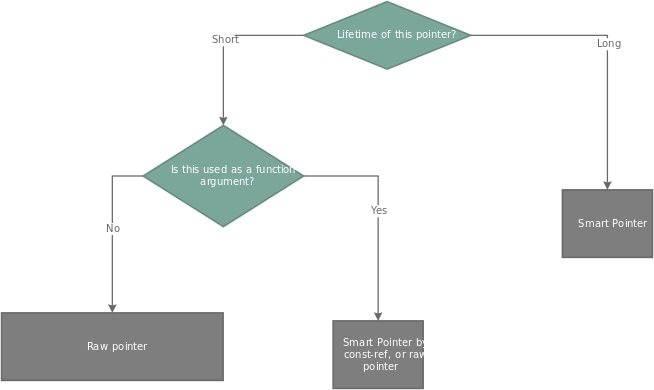
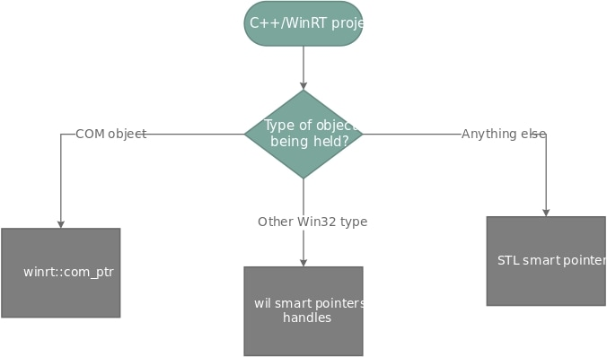
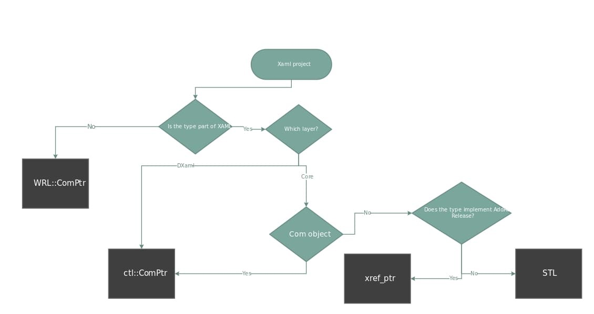

# Guide to WinUI codebase pointers

## Table of Contents

- [Public pointer libraries used](#public-pointer-libraries-used)
- [COM Pointers](#com-pointers)
  - [ctl::ComPtr](#ctlcomptr)
    - [Usage](#usage)
  - [WRL::ComPtr](#wrlcomptr)
  - [winrt::com_ptr](#winrtcom_ptr)
    - [Usage](#usage-1)
- [Other special pointers](#other-special-pointers)
  - [xref_ptr](#xref_ptr)
    - [Usage](#usage-2)
  - [TrackerPtr](#trackerptr)
  - [ctl::WeakRefPtr](#ctlweakrefptr)
    - [Usage](#usage-3)
    - [How WeakRefPtr works internally](#how-weakrefptr-works-internally)
  - [EventPtr](#eventptr)
    - [Usage](#usage-4)
- [Where to use which pointer?](#where-to-use-which-pointer)

## Public pointer libraries used

* [Windows Implementation Library](https://github.com/Microsoft/wil)   
* [C++ Standard Library (STL)](https://docs.microsoft.com/cpp/standard-library/cpp-standard-library-reference)    
* [Windows Runtime C++ Template Library (WRL)](https://docs.microsoft.com/cpp/cppcx/wrl/windows-runtime-cpp-template-library-wrl)

## COM Pointers

COM/WinRT objects are referenced using COM pointers. The section below is guide in using different COM pointers.

### ctl::ComPtr

The "ctl" layer is internal to WinUI. It's a port of portions of the 
[ActiveX Template Library](https://docs.microsoft.com/en-us/cpp/atl/active-template-library-atl-concepts?view=msvc-170) 
that was created during early Win8, before WRL existed.

* Default COM pointer throughout Dxaml and Core layers.
* Intrusive reference count based smart pointer. COM objects store their own ref counts so the ComPtr doesn’t have to 
  store it within itself.
* Specialized optimizations using WinUI internal type tables (compared to public library WRL::ComPtr)
* Can be treated like regular pointer for most of operations like calling object's function foo() can be done directly 
  and passing reference to COM pointer with &
* Bool operator overloaded, can be used directly in boolean cases like if statements. `==` and `!=` are also overloaded 
  but only for nullptr case or other pointers of same type. Doesn't work on comparing with raw pointers.

Files:  `ComPtr.h, Combase.h`

#### Usage

```c++
ctl::ComPtr<typeA> ptr(someOtherPointer);      // Construct and AddRef
// OR
ctl::ComPtr<typeA> ptr;  		// construct
ptr = someOtherPointer; 		// AddRef

ptr.Reset();             		  // Decrement the refcount on the COM object pointed and make this pointer as null
ptr.Get();                        // get the raw pointer to the COM object

// Get pointer to point to some other COM object :
&ptr 
// OR
ptr.ReleaseAndGetAddressOf();

// if object has a member function foo, it can be called directly
ptr->foo()

// Casting
ctl::ComPtr<typeB> ptr2;
ptr.As(&ptr2);        			// dynamic cast via QueryInterface
typeC* rawptr = ptr.Cast<typeC>();        // static cast

// Special functions :
// When handing over COM object (example : like across DLL boundary) without changing reference count
ptr.Attach(rawpointer);
ptr.Detach(); 

// overloaded boolean operator (no .Get() needed)
if (ptr)
if (!ptr)
```

### WRL::ComPtr

[ComPtr Class | Microsoft Docs](https://docs.microsoft.com/cpp/cppcx/wrl/comptr-class)

Very similar to ctl::ComPtr but part of public library. Used only for objects which need it  
Usage: exactly same as ctl::ComPtr except for `wrl::ComPtr`. Use the MSDN docs for more information.

### winrt::com_ptr

[winrt::com_ptr struct template | Microsoft Docs](https://docs.microsoft.com/uwp/cpp-ref-for-winrt/com-ptr)

* The COM pointer for the cpp/winrt projection WinRT objects.
* Used in controls folder layer and any external usage of WinUI framework.
  
#### Usage

```c++
winrt::com_ptr<winrt::typeA> ptr(rawpointer);     //construct and AddRef
ptr = rawpointer;     //AddRef

ptr.get();                 // get raw pointer
ptr.put();                    // get reference to ptr, allows it to point to other COM object
ptr.try_as<winrt::typeB>()   // dynamic cast
```

## Other special pointers

### xref_ptr

* Internal to WinUI.
* Used only in core layer for performance reasons
* Optimised pointer which does COM pointer like ref counting but for non-COM XAML objects in core layer as AddRef and 
  Release functions are not virtual functions. xref_ptr is templated and can make direct (compile type computed) calls for each type.

File: [`dxaml/xcp/components/base/inc/inc/xref_ptr.h`](../../dxaml/xcp/components/base/inc/inc/xref_ptr.h)

#### Usage
```c++
xref_ptr<type> ptr;    //declaration
ptr.init(raw_pointer);    //assignment

// OR
ptr = raw_pointer;  // using copy constructor

// OR
ptr = checked_cast<T>(raw_pointer);  //better as it does better checks to make sure object is a DO
```

### TrackerPtr

* Internal to WinUI.
* XAML types are exposed publically in language independent 
  [.winmd](https://docs.microsoft.com/uwp/winrt-cref/winmd-files) files which can then consumed by C#/WinRT apps (and 
  C++/WinRT). The GC of C# needs to know about internal references of these XAML types to prevent leaking. `TrackerPtr` 
  help in that area. They keep track of references of XAML types and this information is presented to C#’s GC for 
  cleanup decisions.   
* Used in a class member to denote persistent, strong references to an owned object. 
* Bool operator overloaded, can be used directly in boolean cases like if statements. `==` and `!=` are also overloaded but and works with raw pointers and `nullptr`
* A detailed discussion exists here: [XAML/C# Object Lifetime Design](./xaml-object-lifetime.md)

File: [`dxaml/xcp/components/lifetime/inc/TrackerPtr.h`](../../dxaml/xcp/components/lifetime/inc/TrackerPtr.h)

### ctl::WeakRefPtr

* Internal to WinUI
* Can be used to reference an object that implements 
  [IWeakReferenceSource](https://docs.microsoft.com/en-us/windows/win32/api/weakreference/nn-weakreference-iweakreferencesource)
* Analogous to [std::weak_ptr](https://en.cppreference.com/w/cpp/memory/weak_ptr) 
* Smart pointer that does not manage the ref count of the resource it points to, but still gets notified when that 
  resource is cleaned up, so it behaves as a nullptr than pointer to freed memory.
* Good alternative than dealing with raw pointer as it prevents dangling pointer issues

#### Usage

```c++
ctl::WeakRefPtr weakPtr;                        // construct
ctl::AsWeak(someOtherPointer, &weakPtr);        // store, but do not AddRef (side effects occur)
// OR
ctl::ComPtr<typeA> ptr(someOtherPointer);       // construct, AddRef
ctl::WeakRefPtr weakPtr;                        // construct
ctl::AsWeak(ptr.Get(), &weakPtr);               // store, but do not AddRef (side effects occur)
```

#### How WeakRefPtr works internally

The following text is taken from `WeakReferenceImpl.h`.

> To support storing, encoding and decoding reference-count/pointers regardless of the target platform.
> In a RuntimeClass, the refCount_ member can mean either
>    1. actual reference count
>    2. pointer to the weak reference object which holds the strong count
> 
> The member
>    1. If it is a count, the most significant bit will be OFF
>    2. If it is an encoded pointer to the weak reference, the most significant bit will be turned ON
> 
> To test which mode it is
>    1. Test for negative
>    2. If it is, it is an encoded pointer to the weak reference
>    3. If it is not, it is the actual reference count
> 
> To yield the encoded pointer
>    1. Test the value for negative
>    2. If it is, shift the value to the left and cast it to a WeakReferenceImpl*

From a debugging session which creates a `WeakRefPtr` from a `DirectUI::Window *`, just before the call to `ctl::AsWeak` is called, we can examine the `Window *`.

```c++
Window* window = nullptr;
IFC_RETURN(DXamlCore::GetCurrent()->GetAssociatedWindowNoRef(this, &window));
if (window)
{
    ctl::WeakRefPtr weakWindow;
    IFC_RETURN(ctl::AsWeak(window, &weakWindow));

    // ...
}
```

```
0:007> dx -r1 ((Microsoft_UI_Xaml!DirectUI::Window *)window)
((Microsoft_UI_Xaml!DirectUI::Window *)window)                 : 0x25debf25470 [Type: ctl::ComObject<DirectUI::Window> * (derived from DirectUI::Window *)]
    [+0x008] m_pControllingUnknown : 0x0 [Type: IInspectable *]
    [+0x020] m_inFinalRelease : false [Type: bool]
    [+0x021] m_ignoreReleases : false [Type: bool]
    [+0x022] m_disableLeakCheck : false [Type: bool]
    [+0x028] m_pUnkFTM        : 0x0 [Type: IUnknown *]
    [+0x030] refCount_        [Type: ctl::Details::ReferenceCountOrWeakReferencePointer]

    ... (lines removed for brevity)
```

Examining the `refCount_` property:

```
0:007> dx -r1 (*((Microsoft_UI_Xaml!ctl::Details::ReferenceCountOrWeakReferencePointer *)0x25debf254a0))
(*((Microsoft_UI_Xaml!ctl::Details::ReferenceCountOrWeakReferencePointer *)0x25debf254a0))                 [Type: ctl::Details::ReferenceCountOrWeakReferencePointer]
    [+0x000] refCount         : 0x3 [Type: unsigned __int64]
    [+0x000] rawValue         : 3 [Type: __int64]
    [+0x000] ifHighBitIsSetThenShiftLeftToYieldPointerToWeakReference : 0x3 [Type: void *]
```

Then, if we step over the line containing `ctl::AsWeak()` and rerun the last command

```
0:007> dx -r1 (*((Microsoft_UI_Xaml!ctl::Details::ReferenceCountOrWeakReferencePointer *)0x25debf254a0))
(*((Microsoft_UI_Xaml!ctl::Details::ReferenceCountOrWeakReferencePointer *)0x25debf254a0))                 [Type: ctl::Details::ReferenceCountOrWeakReferencePointer]
    [+0x000] refCount         : 0x8000012ef8c676c0 [Type: unsigned __int64]
    [+0x000] rawValue         : -9223370735600896320 [Type: __int64]
    [+0x000] ifHighBitIsSetThenShiftLeftToYieldPointerToWeakReference : 0x8000012ef8c676c0 [Type: void *]
```

Note that the high-order bit is now set. Perform a shift left of 1 bit to get the address of the weak reference block.

```
0:007> ?? 0x8000012ef8c676c0<<1
unsigned int64 0x0000025d`f18ced80
```

Then we can examine this memory address to peek into the reference semantics for this block.

```
0:007> dx -r1 ((Microsoft_UI_Xaml!ctl::Details::WeakReferenceImpl *)0x0000025d`f18ced80)
((Microsoft_UI_Xaml!ctl::Details::WeakReferenceImpl *)0x0000025d`f18ced80)                 : 0x25df18ced80 [Type: ctl::Details::WeakReferenceImpl *]
    [+0x008] m_cRef           : 0x2 [Type: unsigned long]
    [+0x010] m_cSourceRef     : 0x3 [Type: unsigned long]
    [+0x018] m_pSourceRef     : 0x25debf25488 [Type: ctl::ComBase *]
```

### EventPtr

* Smart pointer added that automates more of event handler management
* Takes care of token removal automatically  
* Easier and simpler than using token system
* New event types need to be added in the definition file given below

Files : `dxaml/xcp/dxaml/lib/EventCallbacks.h` and `dxaml/xcp/dxaml/lib/EventCallbacks.cpp`

#### Usage

```c++
ctl::EventPtr<fooEventCallback> fooEventHandler; // defined in EventCallbacks.h

// attach event handler
fooEventHandler.AttachEventHandler(rawpointer, 
  [this](IInspectable* sender, xaml::IRoutedEventArgs* args)
  {
      return S_OK;
});

// nothing else as detachment is automatic on exiting fooEventHandler scope
```

## Where to use which pointer? 

* General case applicable anywhere
 


* In a C++/WinRT project / controls folder


 
* In core and dxaml layers of WinUI codebase
 
 

* If a XAML type exists in codegen files (.g.h, .g.cpp), that means it is ready to be exposed in .winmd file. Make sure 
  it has a `TrackerPtr` type pointing to it (which the codegen will do automatically). The general rule within the 
  DXaml code layer is that class fields should be TrackerPtr and stack variables should be COM Ptr.
