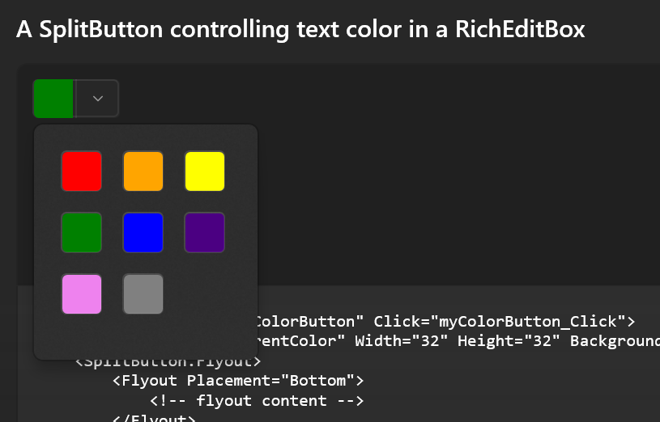
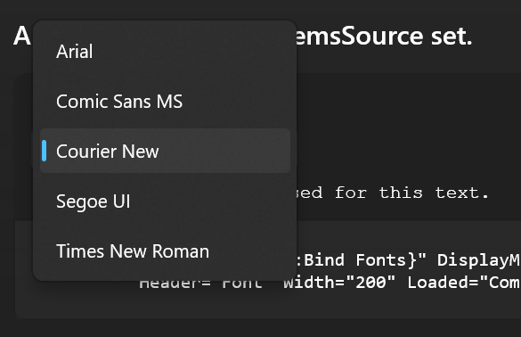
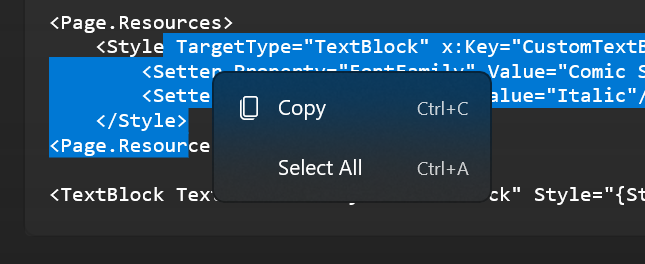
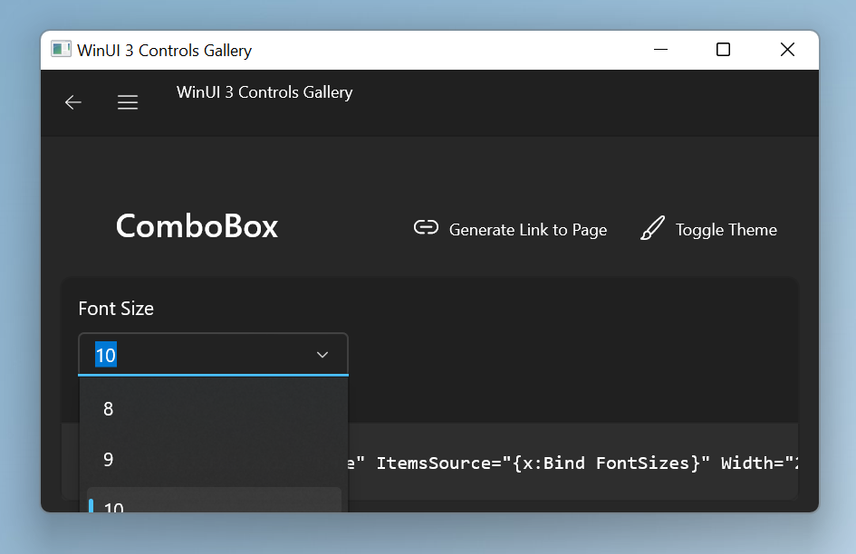
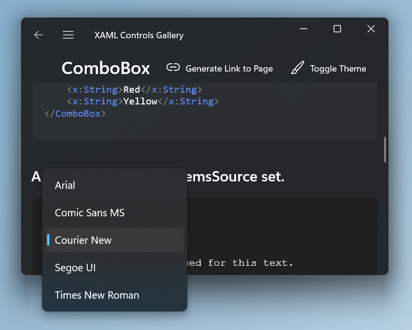

# Xaml Popups

## Table of Contents

- [Overview](#overview)
- [Parented vs parentless popups](#parented-vs-parentless-popups)
- [Composition](#composition)
- [Windowed popups](#windowed-popups)
  - [Positioning](#positioning)
  - [Nesting popups](#nesting-popups)
    - [Issues](#issues)
  - [Drop shadows](#drop-shadows)
  - [Input](#input)
  - [UIA](#uia)
  - [System backdrop](#system-backdrop)
    - [Restrictions](#restrictions)
    - [Activation](#activation)
  - [Entrance/exit animations](#entranceexit-animations)
  - [Usage](#usage)
- [Known bugs](#known-bugs)

## Overview

`Popup` elements are a way to break out of the natural z-order of the tree and to show an element on top of all other
elements.



The other mechanism for this is the
[Canvas.ZIndex](https://docs.microsoft.com/en-us/windows/winui/api/microsoft.ui.xaml.controls.canvas.zindex?view=winui-3.0)
([non-stub page from system
Xaml](https://docs.microsoft.com/en-us/uwp/api/windows.ui.xaml.controls.canvas.zindex?view=winrt-22000)) property, but
that property only acts in the scope of an element and its siblings, and cannot bring an element on top of its cousins
in the tree.

Internally, the Xaml rendering walk has no mechanisms to specify the global z-order of elements. The tree is rendered
 from left to right, with child elements on top of parent elements. Canvas.ZIndex only changes the order that an
element's children get visited.

So to support `Popup` rendering, Xaml has a hidden `PopupRoot` element off to the right of the main tree, which
guarantees that the `PopupRoot`'s children render on top of elements in the main tree. We then parent the `Popup`
contents to this hidden `PopupRoot`. As a result, the natural tree traversal order places `Popup` content on top of
everything else. Note that doing this messes with the logical tree, because a `Popup`'s
[Child](https://docs.microsoft.com/en-us/windows/winui/api/microsoft.ui.xaml.controls.primitives.popup.child?view=winui-3.0#microsoft-ui-xaml-controls-primitives-popup-child)
element is no longer parented to the `Popup`, but rather to the `PopupRoot`.


## Parented vs parentless popups

`Popup` comes in two types.

An app can put a `Popup` in the tree just like any other element. This lets it run layout with the main tree and gives
it a natural x,y coordinate. This is called a *parented* `Popup`, and is useful for scenarios like ComboBox dropdown
menus.



Alternatively, an app can new up a `Popup` without placing it in the tree and set IsOpen=true, creating a *parentless*
`Popup` that does its own layout in isolation and has no natural x,y coordinate. These are useful for scenarios like
dialog boxes or right-click context menus.



The big difference between these two is that a parented `Popup` inherits a transform from its position in the main tree.
This transform can contain an offset and a scale, and must be taken into account when rendering the `Popup` contents
tucked off to the side under the `PopupRoot`.

A parented `Popup` conceptually gets visited twice by the render walk. Once when we walk the main tree and reach the
`Popup` element rooted in the tree, and a second time when we walk the `PopupRoot` and reach the `Popup`'s contents.

The walk that reaches the `Popup` in the main tree naturally stops there. HWWalk::Render detects that the `Popup`
requires redirected drawing (i.e. we'll visit it later from another part of the tree) and skips
it.

The walk that reaches the `Popup` contents via the `PopupRoot` does so via
HWWalk::PopupRootRenderChildren.
We'll start at the open `Popup` and pick up the missing transforms via
CUIElement::GetRedirectionTransformsAndParentCompNode.

A parentless `Popup` is only visited when we walk the `PopupRoot`. We don't have any transforms to pick up so we render
it normally.

## Composition

`Popup` makes use of Composition's
[Visual::ParentForTransform](https://docs.microsoft.com/en-us/windows/winui/api/microsoft.ui.composition.visual.parentfortransform?view=winui-3.0)
property to make things work. When we pick up transforms to render a parented `Popup`, we only need to walk as far up as
the first UIElement backed by a Composition `Visual`. All transforms from that point up to the root of the tree can be
handled by setting `Visual::ParentForTransform`.

> Future aside:
>
> Xaml's `Popup` rendering walk was originally written without any support from IXP's APIs. We have room to simplify
> things greatly if we updated this code. The `Popup`'s parent is given a `Visual`, then the `Popup` specifies it as the
> ParentForTransform. There would be no walk up the tree and no transforms to collect. We would need code to make sure
> there's a `Visual` on the `Popup`'s parent if the `Popup` moves around the tree.

The `Popup` itself is marked as a redirection
element
and will have a comp node associated with it along with Composition `Visual`s. This gives a convenient place to parent
all Composition `Visual` content inside the `Popup`.

## Windowed popups

In addition to a parented or parentless `Popup`, we have an additional distinction of a *windowed* and *inline* `Popup`.
This exists to support the
[Popup.ShouldConstrainToRootBounds](https://docs.microsoft.com/en-us/windows/winui/api/microsoft.ui.xaml.controls.primitives.popup.shouldconstraintorootbounds?view=winui-3.0)
property.

An *inline* (or non-windowed) `Popup` renders inside the bounds of the Xaml window. If the `Popup` should extend outside
the window, then it gets clipped.



A *windowed* `Popup` is an implementation detail that allows it to extend outside Xaml's window bounds.



The name comes from the fact that in system Xaml this was done by hosting the `Popup`'s contents in a separate hwnd, or
window. In WinUI 3, this is implemented with an IXP
PopupWindowSiteBridge.
The `PopupWindowSiteBridge` internally creates an hwnd to host its content.

There is a hierarchy of objects inside the `PopupWindowSiteBridge` before we get to the `Visual` containing the `Popup`
contents:

* PopupWindowSiteBridge m_desktopPopupSiteBridge

  * ContentIsland
    m_contentIsland

    * Visual
      m_contentIslandRootVisual

      This is a hidden root Visual. It holds a transform that includes things like the root scale*. It also holds an
      optional debug
      visual
      that shows the bounds of the windowed `Popup`.

      * Visual
        m_animationRootVisual

        This is a Visual that has the entrance/exit animation attached. It's the parent of the popup content Visual,
        system backdrop Visual, and shadow Visual.

         * Visual
           m_systemBackdropPlacementVisual

           This is the `ContentExternalBackdropLink`'s `PlacementVisual`. Its world position and local clip will be
           mirrored over to the system Visual displaying the system backdrop. We place it in the tree under the
           animation root so that it gets animated by the entrance animation. We also apply a rounded corner clip on it
           so its square corners don't poke out behind the shadow of the rounded popup content. The rounded corner clip
           is collected by walking down the UIElement tree of the popup content. See
           `CPopup::ApplyRootRoundedCornerClipToSystemBackdrop`
           for details.

         * Visual
           m_publicRootVisual

           This is the `Visual` of the `Popup` and is set via
           CPopup::SetRootVisualForWindowedPopupWindow.

           * Note that the popup's shadow is drawn with a normal Xaml drop shadow
             Visual
             inside this subtree.


> Future aside:
>
> There are parts of the transform on m_contentIslandRootVisual that we can remove. For example, it contains a root scale,
> but that's always 1 now that the scale is always applied by the PopupWindowSiteBridge.

### Positioning

The position of a windowed `Popup` is trickier to apply than an inline `Popup` because of two factors:

1. The `ParentForTransform` API doesn't work across different IXP islands/site bridges. The main tree has a
   `DesktopChildSiteBridge`, and the windowed popup has a `PopupWindowSiteBridge`. We can't copy a transform
   in the main tree from the windowed popup.

This restriction means we won't be using `ParentForTransform` to position windowed popups. Instead, we'll calculate the
position of the anchor element and apply it manually as an offset.

2. We want to restrict the `Popup`'s hwnd to just the size of its content and position it at the offset of its content.
   Alternatives such as making a full-screen hwnd and positioning content in it at an offset causes problems with the
   `Popup` hwnd blocking clicks meant for Xaml or other windows on the desktop.

For a tree that looks like:

``` xml
<root>
  <a>
    <b>
      <Popup p>
        <c>
          <d>
        </c>
      </Popup>
    </b>
  </a>
</root>
```

`Popup` `p`'s content `c` should render with the transform `a-b-p-c`. This is also the offset that should be applied to
the `Popup`'s hwnd. Xaml rendering code will automatically produce a comp node (and a Composition Visual) for the popup
element, with its transform `p` already set on it, and a visual for the popup content with its transform `c` set on it.
If we just put these visuals inside the hwnd, we'll end up with the transform (a-b-p-c)-p-c. This double counts two
transforms and produces the wrong result. So we apply an undo transform under the hwnd to make sure the net transform is
what we want. We'll have

```
(a-b-p-c)-(c'-p')-(p)-(c) = a-b-p-c
 ^         ^       ^   ^
 |         |       |   +- transform on the Popup's child element
 |         |       |
 |         |       +- transform on the Popup's comp node
 |         |
 |         +- undo transform on the hidden root visual
 |
 +- applied by the hwnd

 where c' and p' are inverse transforms of c and p
```

This becomes trickier when RTL is involved. The summary there is that the hwnd's position describes its top-left corner,
but the transform that we want to apply describes the top-right corner. So we do the transform math as above to make
sure we have the right net transform inside the `Popup`, and we adjust the x offset set on the hwnd to account for the
width of the hwnd.

> Future aside:
>
> This is a lot of doing and undoing to get what amounts to 0. It would be simpler to change the Xaml render code such that
> we explicitly put an identity transform on the windowed popup comp node. Then we wouldn't have to cancel out anything.

### Nesting popups

Windowed popups also add complexity to nested popup scenarios.

If windowed popups are nested inside each other, there is no problem. Each layer of windowed popup will have its own
`PopupWindowSiteBridge`, and the Visuals inside each layer will go inside the respective `PopupWindowSiteBridge`. Each
windowed popup is positioned explicitly with x/y offsets.

If *inline* popups are nested inside windowed popups, we have a tricky situation. Normally inline popups render in the
main Xaml tree, but that's a problem in this case because it means content in the inline popup will be covered up by the
windowed popup that it's nested inside. Instead, we need to explicitly place the Visuals of the inner inline popup
inside the same `PopupWindowSiteBridge` that contains the outer windowed popup.

Moving the entire subtree of Visuals over to another IXP island creates problems. Xaml's incremental render walk expects
an element to have visuals in the main tree to act as references when rendering nearby elements, and if the inline popup
has no visuals in the main tree then that breaks the render walk.

We can use the same mechanism that already exists for windowed popups to accomplish this. Windowed popups use
_placeholder_ Visuals in the main Xaml tree to act as anchors and references for the incremental render walk. Inline
popups nested inside windowed popups will use a placeholder Visual in the main tree as well, so that elements around
them can correctly be rendered by the incremental walk. Their main tree of Visuals will be added to the
`PopupWindowSiteBridge` alongside the Visuals under the windowed popup.

This also allows nested inline popups to continue using `ParentForTransform`, since they're in the same tree as their
target Visuals (inside the windowed popup's subtree). Another convenient outcome is that the inner inlined popups don't
need to worry about calculating transforms and undo transforms like the windowed popups that they're nested in. They can
just copy the correct answer from the windowed popup using `ParentForTransform`.

#### Issues

Nested popups have other issues and quirks in their behavior.

The order that the nested popups are opened has an effect on how they render. The intuitive behavior is that a nested
popup requires its ancestor popups to all be open in order to be visible on screen itself, but this isn't what Xaml
does. Xaml allows a nested popup to be shown _even if its parent popup is closed_. In this case the nested popup behaves
as if it's a parentless popup, and respects only its own HorizontalOffset/VerticalOffset while ignoring all transforms
above it.

This unintuitive behavior continues when the parent popup is opened after the child popup. The intuitive behavior is for
the popups to respect their tree order, with the child rendering on top of the parent. The actual behavior is that the
relative z-order of popup is determined _entirely by the order in which they open_. In this case the parent popup opened
after its child popup, so the parent covers the child. This is the natural outcome of how popups are implemented in
code:
1. When a popup opens, its child gets parented to the CPopupRoot as the last child, and from there we render things in
   tree order.
2. The render walk stops when it encounters a CPopup element, and assumes that the contents of that popup are walked and
   rendered (if needed) via the CPopupRoot.

Taken together, these rules mean that when the parent popup opens, its content gets added to the CPopupRoot after the
child popup's child, so it gets walked later and covers the child. Also, when we reach the child popup in the parent
popup's tree, we don't walk into it and render it again.

There's more unintuitive behavior when windowed popups are thrown into the mix. As stated above, an inline popup nested
inside a windowed popup will render in that windowed popup's window (and escape the bounds of the main tree), but this
is the behavior only if the parent windowed popup is opened first. If the child is opened first, it behaves as a
parentless inline popup and gets clipped by the bounds of the main tree. If the windowed parent opens later, we don't
bother re-walking the child and reparenting it in the windowed popup's tree; the child stays as an inline popup clipped
by the bounds of the main tree.

### Drop shadows

WinUI 3's `Popup` elements have a drop shadow around them to be consistent with the look of Windows 11. This drop shadow
is drawn regardless of whether the `Popup` is windowed or inline. This is easy to do with an inline `Popup` - it's just
another `Visual` in the Xaml tree - but it's trickier with a windowed `Popup`. A windowed `Popup` creates
hwnds/`PopupWindowSiteBridge`s with tight bounds to fit the content inside the `Popup`, which leaves no room to draw the
drop shadow with an IXP `Visual`. Our workaround is to expand the size of the hwnd to leave room for a drop shadow
visual. The drawback here is that any mouse clicks landing in the drop shadow region get blocked by the windowed
`Popup`'s hwnd instead of making it through to the content underneath.

> Future aside:
>
> If IXP's PopupWindowSiteBridge could connect with DWM and draw a system drop shadow, it would give us behavior that
> matches drop shadows in other top-level hwnds. Specifically, the drop shadow wouldn't block any clicks. In addition to
> the cost to write this code, currently there are limitations to system drop shadows that prevent this from happening.
> For example, system drop shadows are only available with a couple of sizes, but the drop shadows on a `Popup` need to
> scale based on the Translation.Z property set on the `Popup` which produces a much wider range of sizes.

### Input

Pointer input coming in to a windowed `Popup` will land in the hwnd of the `Popup`, which is different from the hwnd
where the rest of the Xaml tree lives. Xaml then doesn't see the click, creating a problem.

OS Xaml has a simple solution to this. It just forwards all the pointer messages from the `Popup` hwnd's WndProc to the
hwnd of the main Xaml tree. A couple of things make this possible:
1. The pointer positions associated with pointer messages are all in screen space, so the main Xaml tree's hwnd can use
   pointer messages that are delivered to any hwnd. It will transform them into the coordinate space of the main tree's
   hwnd and pass them down the hit test walk.
2. The contents of the windowed `Popup` are attached to the main Xaml tree, so they can be reached by a normal hit test
   walk.

WinUI 3 doesn't use pointer messages directly. Instead, we get an `InputSite` for the
`ContentIsland`
and subscribe to WinRT events on it like
`PointerInputObserver::PointerMoved`.
Those WinRT events then come in to report the pointer position.

We do the same thing for the window of a windowed `Popup`. We get an `InputSite` for the
`ContentIsland`
and wrap it in an
`WindowedPopupInputSiteAdapter`
which subscribes to WinRT events like
`PointerInputObserver::PointerMoved`.
Those WinRT events then come in to report pointer positions.

The problem here is that assumption 1 no longer holds. IXP `InputSite`s do not deliver pointer positions in screen
space. Rather, they convert the point into the local space of the `InputSite`. So (0, 0) for the main Xaml tree means
the top-left corner of the main Xaml tree (assuming LTR), but (0, 0) for the windowed `Popup` means the top-left corner
of that `Popup`. We can't feed the coordinates received by the windowed `Popup` directly to the main Xaml tree because
the coordinate spaces don't match.

Luckily, IXP has the `PointerPoint::GetTransformedPoint` API that can transform points between coordinate spaces. Xaml
tracks the transform between the window of the `Popup` and the main Xaml tree, and calls `GetTransformedPoint` to
convert the coordinate
space
before feeding the point to the main Xaml tree. This allows hit testing to proceed on the main Xaml tree normally. This
creates some extra complexity in that Xaml must track the
transform
between the main Xaml tree window and the window of the `Popup`. Note that this transform is between the *window*
positions and not specifically the `Popup` position because the window may be larger than than the `Popup` due to extra
space for shadows or due to child non-windowed Popups which may extend outside the bounds of the ancestor windowed
`Popup`. Also note that the transform is between the top-left corner of the main Xaml window and the top-left corner of
the window of the `Popup` even in RTL, since RTL flipping of rendering and input happen in the Xaml layer, with (0, 0)
always being on-screen top-left from the IXP/input-system perspective.

> This likely creates a problem with DManip, which requires us to set everything up in advance then runs without asking
> Xaml for anything. We should test a ScrollViewer inside a windowed `Popup` in WinUI 3 to see whether there are bugs.

### UIA

UIA on a windowed `Popup` should work just like it does in an inline `Popup`. The fact that it's windowed is just an
implementation detail that lets it draw outside Xaml's bounds, and shouldn't affect the tree that UIA sees.

> The one possible exception to this is that we should report the bounds of the windowed `Popup`'s window so that a UIA
> click outside Xaml's bounds can still be routed back to the windowed `Popup`.

Implementation-wise, a windowed `Popup` uses a top-level hwnd. This hwnd is created explicitly in OS Xaml and WinUI 3's
IXP's `PopupWindowSiteBridge` creates this on our behalf in WinUI 3, but the hwnd is always top-level. We want UIA to
detect the windowed `Popup` as a child of Xaml rather than a top-level window. OS Xaml does this by specifying a parent
hwnd for the windowed `Popup`'s hwnd along with the `WS_POPUP` window style.

In island apps, the windowed `Popup` hwnd shows up as a child of the hwnd hosting OS Xaml: 

When the windowed `Popup`'s parent is removed, the windowed `Popup` hwnd shows up as a top-level window (a sibling to
the hwnd hosting OS Xaml): 

### System backdrop

See the Mica and Desktop
Acrylic
doc for details about the feature.

A windowed popup might want a system backdrop (i.e. desktop Acrylic or Mica) as a background. The Xaml API for this will
be the new `Microsoft::UI::Xaml::SystemBackdrop` type, which talks to Composition's
`Microsoft::UI::Composition::SystemBackdrops::SystemBackdropController` API under the covers. `Popup` will be given a
new `SystemBackdrop` property that accepts an object of type `MUX::SystemBackdrop` subclass (like a
`DesktopAcrylicBackdrop`), which the app can use to specify a system backdrop on the popup.

This new property will also need to extend to controls that use a `Popup`, like `FlyoutBase` (and `TeachingTip`?)
> Look up ShouldConstrainToRootBounds.

#### Restrictions

This property only has the proper effect when the popup is backed by a separate Composition target. Today that means a
windowed popup, which hosts a `ContentIsland` inside a `PopupWindowSiteBridge`. We want this property to work regardless
of the type of popup though, which gives us a couple of options:

1. Host inline popups in a Composition bridge/island as well. This is the long-term direction that we want to head
   towards anyway.

2. Write a fallback code path for inline popups to simulate desktop Acrylic using in-app Acrylic. This requires the
   `SystemBackdrop` to create a `CompositionEffectBrush` that implements in-app Acrylic, and for the `Popup` to insert a
   `SpriteVisual` in the tree filled with the `CompositionEffectBrush`. Note that popups don't normally draw anything in
   the tree - they rely on their child elements - and this workaround will require popup to render something as well.

Option 1 is simpler for Xaml and avoids having to write complicated throwaway code, but it requires a Composition
deliverable to be completed first.

#### Activation

Another important detail is around window activation. Acrylic has two modes - an active window shows the blurred glass
effect, while an inactive window falls back to a solid color. This is relevant to windowed popups because windowed
popups are backed by a window, separate from the main Xaml island. This means with a naive implementation, when the
windowed popup is activated, the main Xaml island becomes deactivated. Any desktop Acrylic effect on the main island
will fall back to a solid color, which isn't what we want.

So we need to explicitly account for this case. On the main Xaml island's focus lost handler, explicitly check that
focus hasn't shifted to a windowed popup under the main island. If it has, then we haven't truly lost focus, so don't
turn off the host backdrop effect on the main island's `SystemBackdropConfiguration`. We already do something like this
to not pass the focus lost notification to the windowed popup and have it close itself - see
`CXamlIslandRoot::OnIslandLostFocus`.

Note that another potential option is to share the `SystemBackdropConfiguration` object between the main Xaml island and
any windowed popup that it hosts. Since the host backdrop is enabled/disabled on a per `SystemBackdropConfiguration`
basis, sharing the same configuration object means the host backdrop effect of the main Xaml island and the windowed
popup will either both be on or both be off. We do not do this for a few reasons:

1. It doesn't save us any work. After sharing the same configuration object, the main Xaml island still has to
   explicitly look for hosted windowed popups when it loses focus. Otherwise we have a race between the main island
   thinking it lost focus and turning off the configuration object and the windowed popup receiving focus and turning on
   the same configuration object. If the main island loses that race, it will turn off host backdrop for the windowed
   popup as well.

2. It introduces extra work. Windowed popups can move between Xaml islands. Sharing the configuration object means we'll
   have to switch configuration objects if a popup moves between Xaml islands, or it can light up with the wrong window.

3. It produces incorrect behavior. Suppose there's a persistent windowed popup that stays open, and a main Xaml island.
   If the user clicks in the windowed popup, then both it and the main Xaml island should light up. But if the user
   clicks back in the main Xaml island, then the windowed popup loses focus and should fall back to a solid color. This
   requires separate `SystemBackdropConfiguration` objects to do.

### Entrance/exit animations

The `MenuFlyout` control uses windowed popups and comes with entrance animations where the entire popup slides into
view. The control uses a `MenuPopupThemeTransition` to do this animation, which it hooks up in
`MenuFlyout::PreparePopupThemeTransitionsAndShadows`
to the grandchild of the `Popup`. This creates problems with the rest of the tree, because the animated element isn't
high enough in the tree to cover the system backdrop Visual and the shadow Visual. Previously Xaml had no system
backdrops and worked around the shadow issue by hiding the shadow by default and fading it in after the transition
completes.

With the introduction of system backdrops, we have to solve this animation problem. We'll do this by taking the entrance
animation and applying it on a Visual higher up on the tree. Transitions themselves already have a step where they
retarget Storyboards -
`RewriteTransitionTargets`
will take the Storyboards generated by the transition and retarget them to a separate `CTransitionTarget`. A
`CTransitionTarget` is a place to gather additional transforms from a transition animation (we can't touch any public
properties on the `UIElement` in case the app is already using them). We'll use the same mechanism to detect
`MenuPopupThemeTransition`s targeting windowed popups, and retarget them to secret `CTransitionTarget` kept by the
windowed popup itself. The windowed popup then incorporates the animated transforms in this secret `CTransitionTarget`
into the root of its tree of Visuals.

### Usage

Controls that use windowed popups fall into two categories:
1. Controls that unconditionally use a windowed popup, like `ComboBox`. These always set
   `ShouldConstrainToRootBounds=false` on the `Popup`.
2. Controls that optionally use a windowed popup, like `FlyoutBase`. These expose a `ShouldConstrainToRootBounds`
   property and forward it to the `Popup`.

## Known bugs

Tabbing works incorrectly in popups
* Tab ordering is broken in Xaml, even with inline popups in system Xaml. You can't tab into an open popup to focus on a button inside.
* This affects windowed popup behavior as well, but that depends on the inline popup bug being fixed first.
