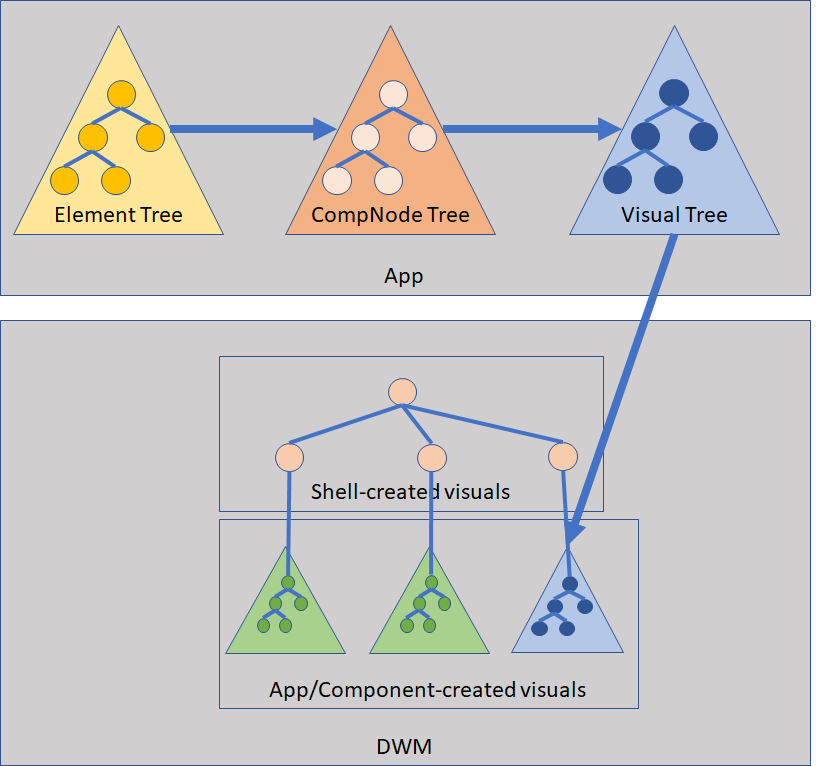
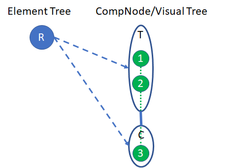
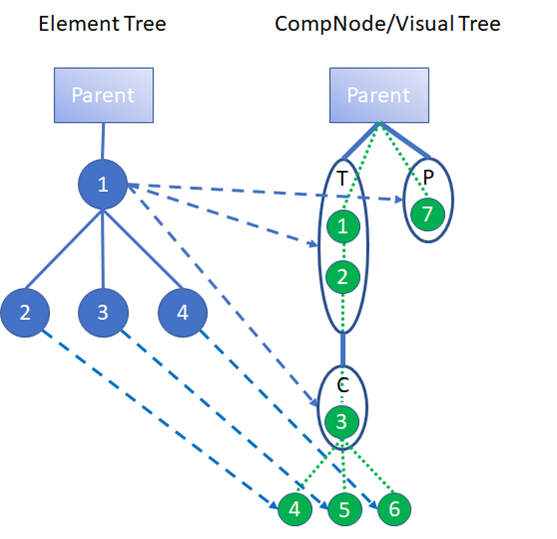
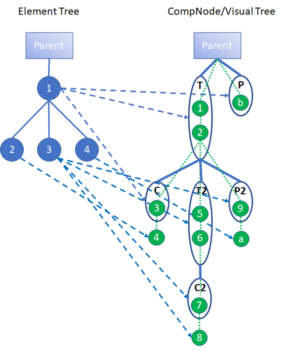

# XAML Rendering Architecture

## Table of Contents

- [Overview](#overview)
- [The evolution of XAML Rendering](#the-evolution-of-xaml-rendering)
  - [Silverlight](#silverlight)
  - [Primitive Composition](#primitive-composition)
  - [DComp on Primitive Composition](#dcomp-on-primitive-composition)
  - [Windows.UI.Composition / SpriteVisuals](#windowsuicomposition--spritevisuals)
- [Component Level View](#component-level-view)
- [Visual Tree Management](#visual-tree-management)
  - [The Big Picture](#the-big-picture)
  - [What is a Visual?](#what-is-a-visual)
  - [Mapping of UIElements to Visuals](#mapping-of-uielements-to-visuals)
- [Render Walk](#render-walk)
  - [Ticking](#ticking)
  - [Incremental Updates](#incremental-updates)
- [Anatomy of the CompNode and Visual trees](#anatomy-of-the-compnode-and-visual-trees)
  - [CompNodes](#compnodes)
  - [Base case: The "super-secret" RootVisual](#base-case-the-super-secret-rootvisual)
  - [Simple case](#simple-case)
  - [More Complex example:](#more-complex-example)
- [SpriteVisual Brushes](#spritevisual-brushes)
- [D3D Device/Surface Management](#d3d-devicesurface-management)
  - [SurfaceFactory, Surfaces, and Atlasing](#surfacefactory-surfaces-and-atlasing)
  - [Device Lost](#device-lost)
  - [Offer/Reclaim](#offerreclaim)
- [Independent Animations](#independent-animations)
- [Composition/D3D Interop](#compositiond3d-interop)
  - [Composition Interop](#composition-interop)
  - [D3D Interop](#d3d-interop)

## Overview

This document gives a high-level overview of how the XAML rendering engine works, primarily covering integration with 
the system compositor. 

XAML has multiple ways of rendering content: 
* “Live” Compositor content: This is the content that you see on screen when the XAML rendering engine runs in the most 
  typical rendering mode, which leverages the system compositor to render the content on screen. This is the focus of 
  this document.
* “Captured” content: XAML has multiple scenarios that involve capturing a bitmap representation of XAML content, most 
  notably the RenderTargetBitmap API. Capturing involves distinct techniques that borrow from live rendering but have 
  their own special nuances.
* Silverlight rendering engine: Interestingly, XAML has an entire rendering engine within the rendering engine, but this 
  engine is used for limited scenarios today.
* Printing: This is another interesting scenario that has unique requirements, and has its own dedicated rendering code 
  path.

## The evolution of XAML Rendering

### Silverlight

The version of XAML in use today (also known as “Jupiter”), is an offspring of the Silverlight codebase. The Silverlight 
rendering engine was written to be cross-platform and run in the web browser, so the architecture was based on a 
software implementation (i.e. no use of the GPU). Although this code is still part of Jupiter, it’s only used in limited 
scenarios today: 
* Shapes: The Silverlight rendering engine *was* used to render the Shape class and its sub-classes. Around the RS5 
  timeframe, work began on replacing this code with the same architecture used for composited 
  content.
* BitmapCache: This feature, enabled via UIElement.CacheMode = BitmapCache, flattens a sub-tree of content into a bitmap. 
  The Silverlight rendering engine is used to perform this flattening. This feature is no longer supported for apps 
  targeting RS4 or greater, and will someday be deprecated.

### Primitive Composition

In Windows 8, XAML rendering moved to an architecture known as “Primitive Composition”. XAML implemented its own 
compositor which rendered live content on a separate thread within the client process. This architecture introduced two 
key innovations: 
* Hardware Rendering: Since running cross-platform code in the browser was no longer necessary, Primitive Composition 
  leveraged the GPU. It also rendered in a very efficient way, by breaking the entire rendering scene-graph into 
  rectangular “primitives” which could be rendered together using a single shader (thus the name Primitive Composition), 
  producing performance gains over the Silverlight rendering engine. 
* Independent Animations: It added the ability to render and animate content independently from the UI thread. This 
  allows animations to run smoothly even if the UI thread is busy doing other work. Independent animations have evolved 
  over time but are still a fundamental part of rendering. See [Independent Animations](#independent-animations) 
  section below for more details.

This architecture is no longer part of the Jupiter codebase, but has many things in common with today’s architecture.

### DComp on Primitive Composition

In Windows 8.1, XAML shifted from rendering in a separate thread to rendering in a separate, central system compositor. 
This incarnation of the system compositor was known as DirectComposition, or DComp (a C++ API that has no WinRT 
projections). This architecture change was mostly mechanical, as we basically “taught” DComp how to implement Primitive 
Composition. The key distinctions of this change revolved around centralizing rendering: 
* Since actual rendering to the screen is done by a central process, the rendering scene-graph could be re-expressed in 
  pieces understood by this central entity, which removed multiple “airspace” issues faced by previous architectures. 
  For example, it became possible for the MediaPlayerElement control to contribute its video content to the overall composited 
  scene-graph as a fully supported element in the compositor – prior to this XAML could only support full screen video. 
* Innovations in composition can be handled by a single team and the benefits felt by all consumers of the compositor’s 
  API surface. This includes customers other than XAML such as the Web Platform and Office. 

The DComp-based architecture is still present in Jupiter today, but its usage is limited: 
* For live content, this code path is used for old apps (targeting TH2 or older) via an app-compat quirk.
* For the Visual Studio designer, central parts of this code path are used for older versions of Visual Studio 
  (VS 2015 or older). 
* For the RenderTargetBitmap feature, there are some scenarios where we use this code path for capturing content. 

See uses of `DCompTreeHost::ContainerVisualsEnabled()`, when this returns false, we’re using the DComp Primitive Composition code path. [**Note:** This only exists in the OS, not WinUI.]

### Windows.UI.Composition / SpriteVisuals

In RS1, XAML began the process of converting from DComp APIs to [Windows.UI.Composition](https://docs.microsoft.com/en-us/uwp/api/windows.ui.composition?view=winrt-22000), or WUC, the latest public version of the compositor APIs which do have WinRT projections. Although DComp is now considered “legacy”, it and WUC have a large amount of interoperability, which allowed XAML to incrementally adopt WUC APIs over several releases. This conversion was also somewhat mechanical, as the primary architecture to leverage the system compositor has not changed from Primitive Composition days. 

As of this writing, the bulk of OS XAML’s rendering code now uses WUC APIs (for apps that target RS1 or greater). The most notable difference from Primitive Composition is the introduction of the WUC [SpriteVisual](https://docs.microsoft.com/en-us/uwp/api/windows.ui.composition.spritevisual?view=winrt-22000), which has many new rendering capabilities, most of which are part of the “Fluent” design language. For WinUI 3, Xaml uses [Microsoft.UI.Composition](https://docs.microsoft.com/en-us/windows/winui/api/microsoft.ui.composition?view=winui-3.0).

See uses of `DCompTreeHost::SpriteVisualsEnabled()` in the OS code. When this returns true we’re using the SpriteVisuals code path.

## Component Level View

Here’s a high level component-level “layer cake” diagram of XAML’s rendering engine:
```
 ______________________________
|                              |
|             App              |
|______________________________|
    ________________________
   |                        |
   |          XAML          |
   |________________________|  
 _____________    _____________
|             |  |             |
|  WUC/DComp  |  |   D2D/D3D   |
|_____________|  |_____________|
```

At the top is app code, which is built on top of XAML APIs. Note that there are several ways an app can render content 
themselves through Composition and D3D interop features, in this case the app can “drop down” to the lower level APIs 
to produce content. 

XAML is built on top of both compositor APIs (WUC and DComp), and lower level graphics APIs (D2D and D3D). Key takeaways 
for how XAML uses these components: 
* The structure of the rendering scene-graph is described by a Visual tree, WUC/DComp APIs are used to create this tree. 
  As we’ll see in the next section, this tree is a lower-level representation, fundamentally different than the element 
  XAML tree apps build. The Visuals in this tree are sent to the DWM and rendered as the system compositor renders the 
  entire desktop. 
* XAML manages its own graphics resources through direct usage of D3D and D2D, particularly those resources that require 
  a video memory bitmap (for images, text, and shapes). XAML shares these resources with the system compositor. 

## Visual Tree Management

The most important thing to understand about live rendering is that XAML doesn’t actually render pixels on the screen, 
instead it builds a Visual tree which is rendered by the system compositor in another process, `DWM.exe` (the Desktop 
Window Manager). The diagram below shows the basic flow of how XAML builds the Visual tree, and a high-level view of the 
overall Visual tree managed by the DWM: 



### The Big Picture

The input to rendering is the XAML element tree, more specifically the tree of core elements (CUIElement). This core element should not be confused with the so-called “DXAML peer” (UIElement) which is what apps directly interface with. XAML walks the core element tree when necessary and produces/updates a Visual tree which is marshalled across a process boundary to the DWM. The DWM has a Visual tree representation of the entire desktop; the DWM renders this tree to produce what you see on screen. This overall Visual tree consists of Visuals created by the shell as well as Visuals created by other apps and components (as well as other content not shown which isn’t relevant to this doc).

You’ll also notice a third type of tree in the diagram above, known as the CompNode tree. This is an intermediate 
representation known only to XAML which helps XAML construct the final Visual tree. We’ll cover this tree in more detail 
[below](#compnodes).

The overall flow goes like this: **NOTE: This section is oudated, see TODOs.**
* XAML first walks the core element tree (See [HWWalk.cpp](../../dxaml/xcp/core/hw/hwwalk.cpp). This walk has 2 basic responsibilities: 
  * It produces/updates the CompNode tree. More specifically, it produces a series of “commands” that modify the CompNode tree (see various methods in [CompositorTreeHost.cpp](../../dxaml/xcp/core/hw/CompositorTreeHost.cpp). These commands are executed after the core tree walk.
  * It produces SpriteVisuals for elements that draw pixels on screen. Part of this process also involves generating “hardware realizations” for content that requires video memory textures (eg drawing text). Note that there is also a code path for producing the older Primitive Composition primitives. Both code paths share the same walking code and use an abstraction to decide which type of primitive to produce (see [IContentRenderer](../../dxaml/xcp/core/hw/ContentRenderer.h)).
* XAML then executes the CompNode tree commands that were enqueued (see CompositorTreeHost::ProcessFrame()). [**TODO** not a thing anymore -- Instead we use the compositor (SubmitRenderCommandsToCompositor)] This updates the CompNode tree, which internally updates the “spine” of the Visual tree. 
* XAML then walks the CompNode tree and updates many of the properties of the final Visual tree (see HWCompNode::UpdateTree()). 
* The updated Visual tree is marshalled to the DWM in a “batch”. Each batch of changes to the Visual tree is processed as a transactional unit in the DWM, meaning all changes are processed in the same frame of rendering in the DWM.

### What is a Visual?

By now it should be somewhat clear that the overall result of XAML’s rendering engine is to produce a Visual tree. If 
you don’t have any experience with Visuals I suggest browsing 
[this MSDN page](https://docs.microsoft.com/en-us/uwp/api/Windows.UI.Composition.Visual?view=winrt-22000) 
for background info. 

Briefly, a Visual is an object that represents a structural unit in a retained-mode
rendering scene-graph. Visuals carry properties, can draw content, and can have children (as well as other capabilities). 

A simple example of a Visual might be a SpriteVisual, where Size is [100,100], and Brush is a [CompositionColorBrush](https://docs.microsoft.com/en-us/windows/winui/api/microsoft.ui.composition.compositioncolorbrush?view=winui-3.0) set to Red. This draws a 100x100 red rectangle. 

Some more interesting aspects of Visuals that might help you understand their purpose and how they are used to represent 
a XAML tree: 
* The Visual tree is drawn depth-first, in a “pre-order” fashion. The content of a Visual is drawn before children, and 
  the sibling order of Visuals in a VisualCollection determines their relative z-order. 
* A Visual may or may not draw content. A Visual may only carry properties, or have children. 
* Most Visual properties are cumulative and affect the child subtree. For example, if 
  `Visual.RotationAngleInDegrees = 45`, this rotates the Visual and all of its children 45 degrees together, as a unit.

### Mapping of UIElements to Visuals 

Each XAML element has many properties, but only some of these properties are relevant to rendering: 
* Layout Size: Computed by layout, represents the size of the element in its local coordinate space. 
* Layout Offset: Computed by layout, represents the position of the element relative to its ancestor in the ancestor’s 
  coordinate space. 
* Render Transforms: There are multiple properties in this category, [UIElement.RenderTransform](https://docs.microsoft.com/en-us/windows/winui/api/microsoft.ui.xaml.uielement.rendertransform?view=winui-3.0) being the most common. All render transforms are combined together and produce a post-layout transformation of the element’s bounds. 
* Clip: There are multiple properties in this category, [UIElement.Clip](https://docs.microsoft.com/en-us/windows/winui/api/microsoft.ui.xaml.uielement.clip?view=winui-3.0) being the most common. The clip masks the area rendered by the element to the clip’s geometry (currently only rectangular clips are supported). 
* [Brushes](https://docs.microsoft.com/en-us/windows/winui/api/microsoft.ui.xaml.media.brush?view=winui-3.0): There are multiple properties in XAML that are of type Brush (eg [Panel.Background](https://docs.microsoft.com/en-us/windows/winui/api/microsoft.ui.xaml.controls.panel.background?view=winui-3.0)). The brush determines how to fill the bounds of the logical area described by the Brush. 
* [Opacity](https://docs.microsoft.com/en-us/windows/winui/api/microsoft.ui.xaml.uielement.opacity?view=winui-3.0): Determines the transparency of the element 

In addition to properties, each XAML element can have an arbitrary number of children. The children, as you might guess, 
are rendered “recursively” in a depth-first manner, through the formation of a Visual tree. A big part of the job of the 
XAML rendering engine is to translate XAML elements into Visuals, and map XAML element properties to Visual properties. 
You might think this is a straightforward mapping but it’s actually quite complex! 

First, it’s important to understand that the elements in the core element tree do not map 1:1 to Visuals. In general, 
Visuals are only created when necessary. The most important reasons XAML creates Visuals: 
* For elements that produce pixels on screen (typically through the use of a XAML Brush).
* For elements that are independently animating: Certain animations can be carried out independently from the UI thread, 
  typically by animating Visual properties in the compositor. 

In a typical XAML tree, many elements are “structural” and are only present to implement a specific type of layout on 
the element’s children (eg a `Grid` with null Background/BorderBrush), or may be present only to carry properties. These 
elements don’t require Visuals so XAML optimizes these away – creating a Visual for every element would have significant 
performance impact on the system compositor. 

It’s also possible that a single XAML element can produce more than one Visual. The typical reasons this happens: 
* Certain elements can generate more than one piece of content that produces pixels on screen. For example, Border can 
  produce 2 Visuals, 1 for Background and 1 for BorderBrush. 
* When a CompNode is required for a given element (more on this below).

## Render Walk

The process that carries out the above flow is known as the RenderWalk (see CCoreServices::RenderWalk()). The RenderWalk runs after layout has completed and the element tree has stabilized.   

### Ticking 

All of this occurs during the “Tick”, the mechanism XAML uses to schedule and execute an “frame” of work (see CXcpDispatcher::Tick()). The basic idea is that XAML wakes itself up in response to the app making API calls that require XAML to produce an updated frame. Many things happen during the tick, the most important of which are running layout, and then running the RenderWalk. 

### Incremental Updates 

The RenderWalk only runs when necessary, and can perform incremental updates of the Visual tree, through the use of “dirty flags” that indicate which branches of the element tree are dirty and require updating. Elements and Brushes mark themselves dirty for a variety of reasons, and there are multiple levels of “dirtiness” (see various methods in UIElementRenderWalk.cpp). Dirty flags propagate up the tree from the `CDependencyObject` that was marked dirty, allowing the RenderWalk to only walk dirty branches. For example an element’s content may be dirtied in response to the color of a brush changing, which only requires updating its own SpriteVisuals, or a bigger change may be made such as a change in scale factor (eg via usage of `UIElement.RenderTransform`), which requires updating itself and its entire subtree.

## Anatomy of the CompNode and Visual trees 

The makeup of the final Visual tree built by the RenderWalk is complex, as different Visuals are used for different 
purposes. I’ll break this down into sections which should help give you the overall view. 

### CompNodes 

As mentioned earlier, XAML builds an intermediate tree called the CompNode tree to help build the final Visual tree (see HWCompNode.h). The CompNode actually dates back to Windows 8 when XAML built its own compositor, and at that time the CompNode was analogous to the Visual. Today, the role of the CompNode is to wrap complex logic around setting up the Visual tree and setting Visual properties. So although CompNodes aren’t strictly required today, they are still useful 
as a layer of encapsulation. 

As shown above, the `CUIElement` tree generates a CompNode tree. A given `CUIElement` may or may not generate CompNodes in the CompNode tree. The primary reason for requiring a CompNode is for running independent animations – a CompNode is required while a given `CUIElement` is running 1 or more independent animations.  See CUIElement::RequiresComposition() for the complete list of reasons why a CUIElement will generate a CompNode. 

There are multiple types of CompNodes: 
* “Tree” node: A tree node can have child CompNodes, and also has the important role of mapping `CUIElement` properties to Visual properties. This mapping takes the form of multiple Visuals, forming the “spine” of the final Visual tree. These visuals do not draw content. There are multiple types of tree nodes (see HWCompTreeNode and derived types). The mapping of `CUIElement` properties to Visual properties is complex, see the Facades Dev Spec.
* “Content” node: A content node’s purpose is to carry the Visuals that draw the content of a `CUIElement` (see HWCompLeafNode). In the most common case, it also carries the content Visuals for the `CUIElement’s subtree (see HWCompRenderDataNode). A content node cannot have children CompNodes. XAML knows how to create multiple types of content nodes for different scenarios which should help illustrate how powerful the Visual-based architecture is. For example, the WebView element generates a content node that allows the Web Platform to parent their own Visuals underneath XAML’s Visuals. 

Whenever a `CUIElement` requires a CompNode, multiple CompNodes are actually generated in the CompNode tree. The general 
case requires 3 CompNodes: 
1. A TreeNode is required to carry `CUIElement`’s properties, and also serve as the parent for the ContentNode, as well as any child TreeNodes that might be created for child CUIElements. 
2. A ContentNode is required to carry the content of the `CUIElement` and its subtree. This CompNode is always the first child of the TreeNode. 
3. Another ContentNode called the “Post-Subgraph” node is required to carry the content of CUIElements in the so-called “right” subtree which draw higher in z-order. Thus this CompNode is always the next sibling of the TreeNode. 

This arrangement is a bit complex! What’s important to grasp here is that since the Compositor walks the Visual tree in 
z order and applies properties down the tree, we need to ensure the z order and properties are correctly preserved when 
creating Visuals by parenting the generated Visuals to the appropriate parent Visual. 

Let’s look at a couple examples to make it clearer.

### Base case: The "super-secret" RootVisual

XAML always creates a special `UIElement` at the very root of the XAML tree (RootVisual). Don’t let the name confuse you – this is a UIElement, not a Composition Visual.

Before diving into the CompNode tree created for the `RootVisual`, it’s worth mentioning here that the `RootVisual` also has several other special internal XAML elements as its children. Briefly:
* `PopupRoot`: This special hidden element serves as the parent for open Popups.
* `TransitionRoot`: This special hidden element serves as the parent for LayoutTransitionElements, animated elements that are part of the ThemeTransitions feature.
* `ConnectedAnimationRoot`: This special hidden element serves as the parent for Connected Animations.
* `FullWindowMediaRoot`: This special hidden element serves as the parent for the MediaPlayerElement when running in full-screen mode.
* `RootScrollViewer`: This element serves as the parent of the app-created XAML tree (and set as `Window.Content`). It’s there to help auto-scroll the focused element into view. Note that if `Window.Content` is set to a `Canvas`, there is no `RootScrollViewer`.

These special root elements partition the overall tree into “Z bands”, since the sibling order establishes z order. 
It’s worth mentioning that in “XAML Islands” mode, the story around roots gets more complicated. XAML Islands isn’t 
covered here.

The RootVisual generates a CompNode which is the parent of the overall XAML CompNode tree. Here’s a picture of the 
`CRootVisual` and the resulting CompNodes/Visuals that get generated:



On the left is the RootVisual and on the right are the CompNode tree and Visual tree that get generated. I’ve drawn the 
CompNode tree superimposed on top of the Visual tree as that is the easiest way to visualize what’s happening – the 
CompNodes form an “outer” CompNode tree (the blue ovals) which then generates an “inner” Visual tree (the green circles).

Here’s a description of what’s getting generated in this example:

The RootVisual R generates a TreeNode T and a child ContentNode C. In this special case the RootVisual does not generate 
a Post-Subgraph node because it’s not necessary.

TreeNode T generates two “spine” visuals which carry the properties of CRootVisual:
* Visual 1 is known as the “Prepend” visual – its role is mainly to carry any properties that may accumulate from ancestor XAML elements that don’t have dedicated CompNodes.  In this case there are no ancestor elements but the visual is still created, with default values.
* Visual 2 is known as the “Primary” visual – its role is to carry the visual properties of the XAML element (eg `UIElement.Opacity`).
* Note that in more advanced scenarios, a TreeNode can generate more than 2 spine visuals. For example, Theme Animations can animate “secret” properties that are carried by an extra Visual. These details aren’t covered here.

ContentNode C generates Visual 3. This node won’t draw any content, but exists solely to parent any SpriteVisuals drawn 
in RootVisual’s subtree. There isn’t any content in this example so there aren’t any SpriteVisuals.
For the next examples, let’s assume we always have a CRootVisual at the root of the XAML element tree which generates 
the CompNodes/Visuals shown above. To keep the diagrams simpler, I’ll show “Parent” as boxes.

### Simple case
Here’s a simple example of a XAML element tree where the root of this sub-tree requires a CompNode. Consider this markup:
``` xml
<StackPanel x:Name="Element1" CompositeMode="SourceOver">
  <Rectangle x:Name="Element2" Width="50" Height="50" Fill="Red"/>
  <Rectangle x:Name="Element3" Width="50" Height="50" Fill="Green"/>
  <Rectangle x:Name="Element4" Width="50" Height="50" Fill="Blue"/>
</StackPanel>
```

In this example the CompositeMode property causes Element1 to generate a CompNode as the system compositor is what 
handles all CompositeModes. If this property wasn’t set, no additional CompNode would be created, as we can simply 
parent the SpriteVisuals generated in this sub-tree directly underneath the ContentNode generated by the RootVisual 
described above.

Here’s a picture of the `CUIElement` tree and the resulting CompNode/Visual trees that get generated:



...and the rendering of this tree looks like this:


Here’s a description of the CompNodes/Visuals that this XAML tree generates:
Element 1 generates 3 CompNodes:  
* TreeNode T: This node generates 2 “spine” Visuals
  * Visual 1: Prepend Visual
  * Visual 2: Primary Visual
* ContentNode C: This node generates Visual 3, which will parent SpriteVisuals for Element1 and its subtree. 
* Post-Subgraph Node P: This node generates Visual 7, which will parent any SpriteVisuals that happen to be generated by 
  Element 1’s right subtree (there aren’t any in this example)

Elements 2, 3, and 4 generate SpriteVisuals 4, 5, and 6 to draw the red, green, and blue Rectangles. These SpriteVisuals 
all go underneath the ContentNode visual as they are part of Element1’s content subtree.

### More Complex example:
Let’s change our simple example to a slightly more complex configuration that requires nested CompNodes:
``` xml
<StackPanel x:Name="Element1" CompositeMode="SourceOver">
  <Rectangle x:Name="Element2" Width="50" Height="50" Fill="Red"/>
  <Rectangle x:Name="Element3" Width="50" Height="50" Fill="Green">
    <Rectangle.RenderTransform>
      <RotateTransform Angle="45"/>
    </Rectangle.RenderTransform>
  </Rectangle>
  <Rectangle x:Name="Element4" Width="50" Height="50" Fill="Blue"/>
</StackPanel>
```
This is the same Element tree structure as the simple example, only now Element3 also requires a CompNode. Here’s a 
picture of the CUIElement tree and the resulting CompNode/Visual trees that get generated:



...and the rendering of this tree looks like this:


The primary difference between this tree and the simpler tree in the earlier example is caused by the introduction of 
Element3’s CompNodes. Here we can see the so-called “tree splaying” algorithm in action. Since Element3 is rotated 
45 degrees, only the content underneath this node is rotated. But we also need to preserve the Z order of the Visuals.

Going from left to right through Element 2, 3, and 4, we see:
* Element2 parents its SpriteVisual (Visual 4) underneath Element1’s ContentNode (which is not rotated).
* Element3 gets its own TreeNode with a rotated Visual (Visual 6), and Element3 parents its SpriteVisual (Visual 8) 
  underneath Element3’s Content Node C2.
* Element4 parents its SpriteVisual (Visual a) underneath Element3’s Post-Subgraph node P2 (which is also not rotated, 
  and is higher in the Z order than Element 3’s Visuals).

This should help clarify why so many structural Visuals are required in the general case.

## SpriteVisual Brushes
The vast majority of elements in XAML apps that draw pixels on screen produce a SpriteVisual and one of several types of 
WUC Brushes to draw that content (see various methods in VisualContentRenderer.cpp). The WUC Brushes created by XAML 
carry out the rendering of the various types of XAML Brushes. See 
[this MSDN article](https://docs.microsoft.com/en-us/windows/uwp/composition/composition-brushes) for a nice description 
of the WUC brushes.

It’s important to call out that some types of WUC Brushes require a video memory bitmap while others do not. Bitmaps are 
the single biggest consumer of memory in XAML apps so XAML makes use of brushes that do not require bitmaps when possible.

Here’s a breakdown of the types of WUC brushes XAML uses:
* CompositionColorBrush: This is a solid color brush that simply fills the SpriteVisual with a solid color. This is a very common scenario (eg Panel.Background set to a SolidColorBrush). This type of brush does not require a video memory surface, so XAML saves significant amounts of video memory by using CompositionColorBrush.
* CompositionMaskBrush: This is a complex brush that takes a mask image and a second brush which fills the mask (typically a CompositionColorBrush). What’s important about this brush is that the mask is represented by an alpha-only video memory bitmap (the pixels only contain opacity values). This bitmap is typically 1-byte-per-pixel on modern drivers which saves significant memory, but it’s worth noting that on older drivers that don’t support the A8 pixel format, the alpha mask uses 4-bytes-per-pixel.  XAML uses MaskBrush in multiple scenarios, most importantly:
  * Text: The mask represents “shape” of the glyphs. See the [Text Architecture]() [./text-controls.md] doc for more details on text rendering. 
  * Shapes: The mask represents the shape (eg Ellipse). Today, the Silverlight rendering engine is used to generate the mask image, but it’s worth mentioning that in RS5 we plan on replacing this with a new type of Composition object that uses vector graphics.
* CompositionNineGridBrush: See [this MSDN article](https://docs.microsoft.com/en-us/uwp/api/Windows.UI.Composition.CompositionNineGridBrush?view=winrt-22000) which gives a nice description of the nine-grid brush’s behavior. XAML uses this type of brush for Border-like elements (with some restrictions), and also uses it when the Image.NineGrid property is in use.
* CompositionEffectBrush: This type of brush renders the SpriteVisual using a D3D shader effect. The XAML rendering engine doesn’t directly create these itself. Instead XAML allows the app to create their own CompositionEffectBrush and “plug in” the brush via the XamlCompositionBrushBase class. See [this MSDN article](https://docs.microsoft.com/en-us/uwp/api/windows.ui.xaml.media.xamlcompositionbrushbase?view=winrt-22000) for more details.
* CompositionSurfaceBrush:  This is a brush that fills the SpriteVisual with a video memory bitmap. XAML uses this type of brush for elements that render content with a XAML ImageBrush.
* CompositionLinearGradientBrush: This is a brush that fills a SpriteVisual with a linear gradient. Used for elements that render content with a XAML GradientBrush. This type of brush does not require a video memory bitmap.

## D3D Device/Surface Management

Since the primary job of XAML’s rendering engine is to offload actual rendering work to the system compositor by creating a Visual tree, you might think XAML has no need to use D3D itself. However this isn’t the case.

XAML does make use of D3D to generate video memory bitmaps (aka surfaces or textures). These surfaces are used as part of the WUC brushes that require surfaces, such as CompositionSurfaceBrush and CompositionMaskBrush. The system compositor cannot generate these surfaces as it doesn’t have the functionality to download/decode images, draw text, etc.  That functionality is provided by higher level frameworks such as XAML and WebPlat.

From a high level, XAML creates surfaces, with the help of WUC/DComp, and shares these surfaces with the system compositor.

### SurfaceFactory, Surfaces, and Atlasing

There are multiple aspects of managing surfaces and sharing them with the system compositor. WUC/DComp acts as a middle-man in this space by creating/managing surfaces on behalf of XAML via two families of APIs:
* SurfaceFactory: This is an object that is given access to the app’s D3D device and creates surfaces with this device when requested. XAML creates a primary SurfaceFactory for all the surfaces generated by XAML’s RenderWalk. XAML also creates secondary SurfaceFactories for an advanced D3D interop scenario (more on this in section on interop).
* Surface: This is an object that represents a video memory bitmap, and provides APIs to update the surface’s contents.  There are 2 distinct types of Composition Surfaces:
  * Non-Virtual: A non-virtual surface is guaranteed to have its backing surface in one contiguous block of video memory.  Non-virtual surfaces are limited in size – all graphics drivers enforce a limit known as the “max texture size” – this is the max size a surface can be in either dimension.
  * Virtual: Virtual surfaces are not limited to the max texture size restriction, and are internally broken into “tiles”.  The tiles backing a virtual surface are not guaranteed to live in contiguous blocks of video memory.

Both non-virtual and virtual surfaces provide the illusion that there is a single video memory bitmap per Surface. In reality, a Composition Surface (or the tiles of a virtual surface) typically shares its backing video memory with other Composition Surfaces through a technique called “atlasing”, which allocates a large texture (atlas) and carves out smaller allocations out of this atlas (see the [Atlasing patent](https://patents.google.com/patent/US20130067502A1/en) for more details). The SurfaceFactory is responsible for managing the atlases and packing them. The reason for atlasing is performance: graphics drivers are notoriously slow at allocating video memory, atlasing amortizes this cost over many small allocations.

Each sub-allocation out of an atlas requires a “gutter” pixel around it which carries a copy of the edges of the bitmap contents, this is needed in the case that a shader needs to sample just outside the bounds of the sub-allocation. This “extending of edges” behavior is normally provided by the graphics driver when no atlasing is used. WUC/DComp can automatically fill gutters but this is done using D3D operations, and this is expensive, so XAML has optimizations: For most cases XAML performs gutter copying in software as it’s copying to the surface, and for text XAML doesn’t bother with gutter copies and simply clears the gutters as in this case the lack of correctly filled gutters isn’t noticeable.
XAML has a single wrapper class, DCompSurface, that wraps both types of Composition Surfaces (see DCompSurface.cpp).

### Device Lost

The underlying video memory for Composition Surfaces is dependent on the D3D device. This device can be “lost” due to multiple situations, for example due to a TDR. When the device is lost, it must be re-created, and all surfaces that were created with the lost device are also considered lost and must be re-created. The SurfaceFactories also need to be re-created as they are permanently bound to a D3D device. However, Visuals, which aren’t dependent on the D3D device, do not technically need to be re-created. XAML recovers all lost surfaces but keeps much of the Visual tree intact when recovering.

XAML typically detects device lost during the RenderWalk as it’s using the device (see CCoreServices::HandleDeviceLost()). XAML can also be notified of a device lost while XAML is idle and not rendering anything (see CCoreServices::EnsureDeviceLostListener()), this notification path is also necessary as the device could be lost while DWM is rendering the desktop.

In order to re-create lost surfaces, the original contents used to generate those surfaces must be kept around persistently.  For elements that generate surfaces during the RenderWalk like TextBlock, the XAML element and its properties are the persistent storage and the surface can be re-generated by doing another RenderWalk, whereas for images, XAML keeps a copy of the original, encoded image (eg JPG contents) and must re-decode it when recovering.

The general flow of device lost recovery looks like this (see CCoreServices::RecoverFromDeviceLost()):
* All Surfaces/SurfaceFactories, and SpriteVisuals are released along with the D3D device.
* A new D3D device is created, along with new SurfaceFactories.
* The RenderWalk is invoked and forcefully walks the entire tree to generate new Surfaces and SpriteVisuals.
* Images are re-decoded asynchronously and will re-appear when they finish decoding.
* For customers that are using certain D3D interop features, XAML also raises the CompositionTarget.SurfaceContentsLost event, which allows users of those features to re-create custom content.

### Offer/Reclaim

When an app is minimized or suspended by the shell, none of the surfaces are visible on screen but continue to take significant amounts of video memory. To alleviate memory pressure in this scenario, XAML makes use of a nifty memory manager feature in Windows known as Offer/Reclaim. The way this feature works, memory can be offered back to the memory manager instead of being freed. If the system is under memory pressure, offered memory can be given to another process, otherwise, the memory can be almost instantly reclaimed later, with the contents still intact. Memory that was given to another process cannot be reclaimed and must be re-allocated and re-populated with contents, but at least this only happens when the system really needed the memory.

XAML offers its Composition Surfaces, and intermediate surfaces used by images, when the app window is hidden, or when an app is suspended (see CCoreServices::OnSuspend()). When becoming visible again or resuming, the surfaces are reclaimed, and any that fail to reclaim are re-created and re-populated (see CCoreServices::OnResume()). Unlike the device lost scenario, individual surfaces may fail to be reclaimed while others succeed.

## Independent Animations

This is one of the most powerful basic capability enabled by the Visual tree architecture. Since the Compositor owns the Visual tree and all its properties, it can do more than just render this tree, it can *animate* properties on these Visuals, and it can perform these animations *independently* (on a separate thread, or in the DWM process). This allows us to make strong performance guarantees about the animations: Even if the XAML UI thread is busy (running arbitrary app code, performing an expensive layout pass, etc), the DWM’s ability to animate and render is completely de-coupled from this activity.  Thus, an independent animation, once started, can still run at 60 fps.

Independent animations are limited to only those properties known to the Compositor (typically Visual properties).  This has several implications:
* Higher level properties that can only be computed by the framework (eg the complex laying out of runs of text) cannot be independently animated.
* In order to perform an independent animation, some set of Composition objects must be created.  These objects are typically created on demand, for performance reasons.
 
Conveniently, the UIElement properties that most apps want to animate are independently animatable, Opacity and RenderTransform being the most common. The [FrameworkElement.LayoutTransform](https://docs.microsoft.com/dotnet/api/System.Windows.FrameworkElement.LayoutTransform) feature of WPF is not supported in Xaml because it _can't_ be independently animated.

XAML has smarts built into Storyboard-based animations that detect which property is being animated.  If the property is independently animatable, the UIElement that owns the animating property will generate a CompNode and one of its Visuals will become the target for an independent animation.  The animation is described to the Compositor via WUC/DComp animation APIs (eg ScalarKeyframeAnimation).  The RenderWalk is responsible for creating these animations and sending them to the Compositor in the same batches that update the Visual tree.  Once sent to the Compositor, the animation is run in the DWM’s process.

Note that “dependent” animations are still supported in XAML today – these are Storyboard animations that target properties that cannot be independently animated (eg FrameworkElement.Width/Height).  These animations are run on the XAML UI thread and literally update the XAML properties.  You can probably imagine that this is bad for performance, and this is why we require the app to opt-in to dependent animations via the EnableDependentAnimation property.

Storyboard-based animations are not the only form of independent animation in XAML. Other forms of independent animation include:
* Using Composition interop: The app can gain access to a XAML element’s so-called “Hand-Off” Visual and directly target its properties with Composition animations. The app can also create its own Composition Visuals and animate them. See more below in Composition Interop. 
* DirectManipulation: The ScrollViewer control uses the DirectManipulation component, which independently animates the scroll position/zoom factor of the ScrollViewer’s content. This scenario is a bit special in that input is the source of the animation rather than time. Also in the case of DirectManipulation, the driving of the animation happens in a background thread within the client process rather than in the DWM.
* InteractionTracker: This is the next step in the evolution of DirectManipulation. The scenario is similar (independent scrolling/zooming) but is more general-purpose and was architected with more future-looking goals (not covered here).

## Composition/D3D Interop

XAML has several features that allow apps to “drop down” and directly use the lower level Composition/Graphics APIs to create custom content. These features fall into two categories:

### Composition Interop

XAML offers APIs that allow the app to “drop down” to Composition APIs and directly manipulate the underlying Visual tree generated by XAML. The current public APIs are exposed through the ElementCompositionPreview helper class, see [this MSFT blog post](https://blogs.windows.com/windowsdeveloper/2016/08/26/interop-between-xaml-and-the-visual-layer/) for a nice overview of the APIs and scenarios they enable. You may wonder about the name ElementCompositionPreview: As of this writing, these APIs are only a stepping stone to a more formalized set of APIs and will someday be deprecated.

Here’s a more in-depth look at how XAML supports these interop APIs:

`ElementCompositionPreview.GetElementVisual`

This API retrieves the so-called “Hand-Off” Visual for a XAML element and gives the app direct access to it.  The purpose of this Visual is to allow the app to set properties on it, most commonly to independently animate its properties, and thus animate XAML-created subtrees.  XAML does not allow the app to re-parent or modify the children of the Hand-Off Visual as this would create chaos (XAML owns the structure of this part of the Visual tree).

Recalling earlier details from the RenderWalk section, requesting this Visual requires the XAML element generate a CompNode, and the Visual returned to the app is the “Primary” Visual. XAML ensures this Visual is created on-demand, and once requested, it is kept persistently for the lifetime of the XAML element.

`ElementCompositionPreview.SetElementChildVisual`

This API takes a Visual created by the app (the so-called “Hand-In” Visual), and parents it into XAML’s Visual tree. The purpose of this API is to allow the app to create its own custom Visual subtree that is “spliced” into XAML’s overall Visual tree. Using this API also causes the XAML element to generate a CompNode, and XAML guarantees that the Hand-In Visual is always positioned as the highest Z ordered Visual underneath its Content node.

`PropertySet`

Composition has a construct known as a PropertySet which is basically a bag of properties. These properties can represent arbitrary values (eg the ScrollOffset of a ScrollViewer), and can be used as the input to Expression Animations, a very powerful and useful feature of Composition. XAML has multiple APIs in this category:
* ElementCompositionPreview.GetPointerPositionPropertySet: This PropertySet represents the position of the mouse pointer.
* ElementCompositionPreview.GetScrollViewerManipulationPropertySet: This PropertySet represents various scrolling/zooming related states on ScrollViewer.

`ElementCompositionPreview.SetImplicitShowAnimation/SetImplicitHideAnimation`

This API lets the app define a set of Composition animations that are played implicitly whenever the so-called “effective visibility” of the targeted UIElement changes (eg when it first enters the live tree). The animations that play target the “Primary” Visual of the UIElement and thus animate that UIElement and its subtree.

### D3D Interop

Some customers want to actually render pixels themselves using D3D (eg games). See [this MSDN article](https://docs.microsoft.com/en-us/windows/uwp/gaming/directx-and-xaml-interop) for a nice description of the D3D interop APIs and the scenarios they support. Here’s a brief overview of the APIs and how they relate to XAML’s rendering:

`SurfaceImageSource/VirtualSurfaceImageSource`

In this scenario the app creates a special type of ImageSource which is internally backed by a Composition Surface.  The APIs allow the app to draw to the underlying surface, while also allowing the ImageSource to be used wherever ImageSource’s are supported (eg on an ImageBrush set as a Panel.Background).  The RenderWalk knows how to incorporate these surfaces into the SpriteVisuals generated by the XAML elements using them, in a manner very similar to “normal” images.

`SwapChainPanel`

In this scenario the app creates a D3D SwapChain in order to draw to it at a very high frequency.  D3D SwapChains are supported as first-class citizens in the composition layer, which allows them to be composed with other Visual content.  Presentation of SwapChains through the Present API is handled out of band from Composition batches, so once XAML has setup the Visuals, the app can present without requiring XAML to perform a RenderWalk.  Today XAML handles SwapChain’s with a dedicated code path that’s different from the code path that handles Composition Surfaces.  SwapChainPanel always generates a CompNode, and XAML creates a special type of ContentNode for SwapChainPanel to hold the SwapChain (HWCompSwapChainNode).

In all D3D interop scenarios, the app creates their own D3D device and is responsible for managing this device, as well as responding to device lost, and handling the [CompositionTarget.SurfaceContentsLost](https://docs.microsoft.com/en-us/uwp/api/Windows.UI.Xaml.Media.CompositionTarget?view=winrt-22000) event.
