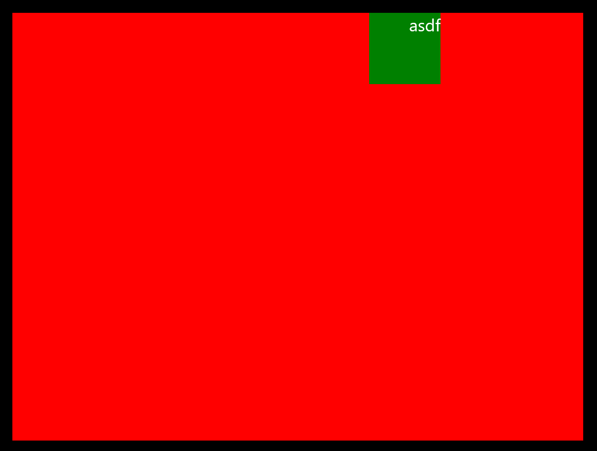
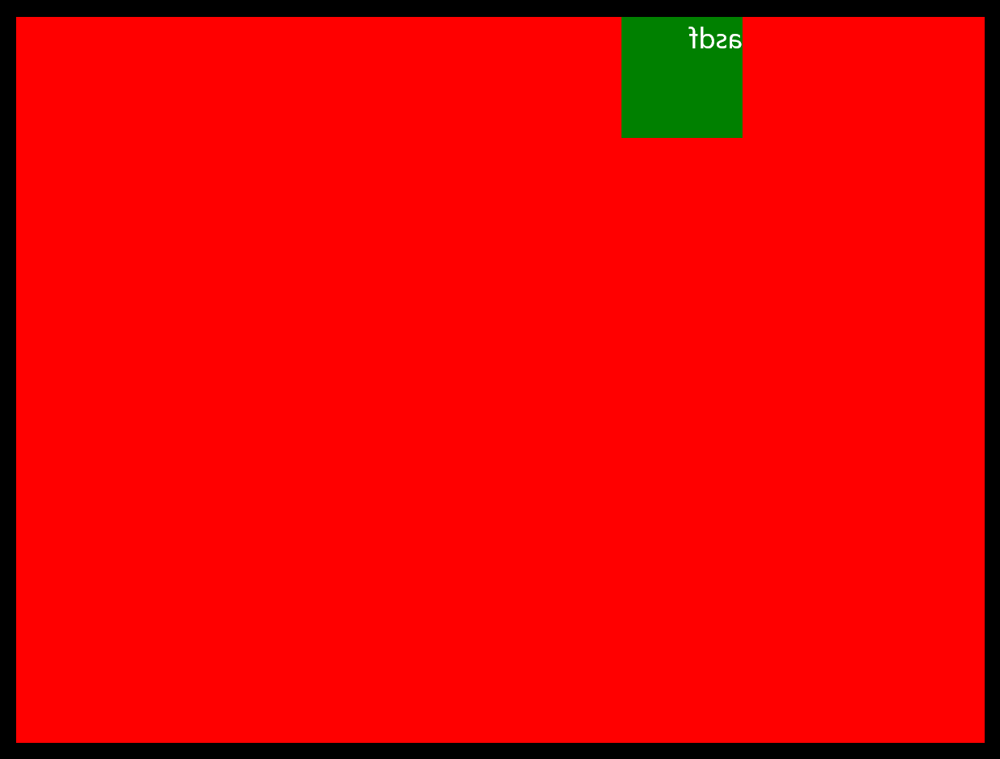

# Xaml RTL

## Table of Contents

- [Defining RTL for WinUI app](#defining-rtl-for-winui-app)
- [What can trigger UI Mirroring in RTL aware app and its scope](#what-can-trigger-ui-mirroring-in-rtl-aware-app-and-its-scope)
  - [Customer workflow proposal  (what the customer sees):](#customer-workflow-proposal--what-the-customer-sees)
  - [Xaml workflow proposal (what xaml sees and does)](#xaml-workflow-proposal-what-xaml-sees-and-does)
  - [Overriding the default behavior](#overriding-the-default-behavior)
    - [Xaml wants to override layout](#xaml-wants-to-override-layout)
    - [Customer wants to override layout](#customer-wants-to-override-layout)
- [Coordinate space in Xaml (WinUI 3)](#coordinate-space-in-xaml-winui-3)
- [RTL challenges and open issues](#rtl-challenges-and-open-issues)
  - [Xaml coordinate system issues](#xaml-coordinate-system-issues)
    - [Canvas](#canvas)
    - [Flow Direction transform](#flow-direction-transform)
    - [DComp backed visuals](#dcomp-backed-visuals)
    - [Accessibility](#accessibility)

This document is intended to capture all the observations for making WinUI 3's UI  RTL ready. The main audience is
any team member working on WinUI 3. It contains a proposal on how RTL should be enabled and how it would work. It
also outlines tasks, challenges and unresolved questions which need to be solved first. 

__IXP__ docs for reference: 
* Content Island doc (see Microsoft.UI.Content documentation)

* Content Island IDL (see Microsoft.UI.Content.idl in the WinAppSDK repo)


## Defining RTL for WinUI app

RTL of a window's content will be defined by the `FlowDirection` of top level element which is referenced by XamlRoot.Content.
`FlowDirection` property can be `LeftToRight` or `RightToLeft`. It is set as `LeftToRight` in default case.
Setting this  affects the arrangement of UI elements within that control and its children only.   
The RTLness or [*UI Mirroing*](https://learn.microsoft.com/en-us/globalization/localizability/mirroring-in-win32) of a window is entirely language agnostic and only defined by this property.
It will act as a source of truth for hosted Xaml content : desktop and island scenarios both.

## What can trigger UI Mirroring in RTL aware app and its scope

The host is responsible for setting a HWND to RTL by setting `WS_EX_LAYOUTRTL` on a HWND. This will cause Xaml content (as well as IXP Content Island)
to switch to RTL mode. `XamlRoot.Content's FlowDirection` changes to `RightToLeft` for RTL /UI Mirroring to take effect. The child HWNDs will inherit from
top level HWND, in default case, and follow the same logic flow.    
In case of WinUI destkop apps, the host is user app code which is using winui 3 framework. This change will be dynamic and
will respond to whenever `RTL` style is applied to HWND.

### Customer workflow proposal  (what the customer sees): 
1. Customer has the decision making ability to decide when to switch top level HWND to RTL. It can use code like this to determine that.

The example code can be : 

```C++
bool IsRTLLocale()
{
    LCID lcid = MAKELCID(::GetThreadUILanguage(), SORT_DEFAULT);
    wchar_t localeName[LOCALE_NAME_MAX_LENGTH];
    DWORD readingLayout = 0;
    ::LCIDToLocaleName(lcid, localeName, LOCALE_NAME_MAX_LENGTH, 0);
    ::GetLocaleInfoEx (localeName,
                       LOCALE_IREADINGLAYOUT | LOCALE_RETURN_NUMBER,
                       reinterpret_cast<wchar_t*>(&readingLayout),
                       sizeof(readingLayout) / sizeof(wchar_t));

    // Value of 1 indicates RTL language. See MSDN for LOCALE_IREADINGLAYOUT.
    // https://msdn.microsoft.com/en-us/library/windows/desktop/dd373806(v=vs.85).aspx
    return readingLayout == 1;
}

```
[`GetUserPreferredUILanguages`](https://learn.microsoft.com/en-us/windows/win32/api/winnls/nf-winnls-getuserpreferreduilanguages)
can be used alternatively. 
> *Xaml note : In order to ensure user gets the globalization right, we should provide good samples and guidelines for
> users to create good globalized app.

2. Once decided, the customer will apply `WS_EX_LAYOUTRTL` style to the top level HWND for RTL mode.   
Code example :  
```C++
    LONG_PTR exStyle = ::GetWindowLongPtrW(hwnd, GWL_EXSTYLE);
    ::SetWindowLongPtr(hwnd, GWL_EXSTYLE, (exStyle | WS_EX_LAYOUTRTL));
```

3. UI mirroring will take place and entire content of the HWND : titlebar buttons, Xaml controls in client area will be drawn right to left.
It will not have any effect on images or icons.    

> *Xaml note* : `XamlRoot.Content.FlowDirection` is source of truth for the customer to determine if Xaml content is in RTL mode.


### Xaml workflow proposal (what xaml sees and does)
1. As soon as customer sets RTL style on the HWND, the Content Island hosted on that HWND  :
    1) switch itself to RTL mode
    2) sets its `LayoutDirection` property to RTL
    3) raises `StateChanged` event
> *IXP question* : What all non-LayoutDirection cases where StateChanged event is fired ? 

2. Xaml code receives `StateChanged` event, updates the `FlowDirection` of XamlRoot.Content to `FlowDirection='RightToLeft'`, causing its entire
 UI to mirror to RTL.

> *Xaml note* : `ContentIsland.LayoutDirection` is the source of truth for Xaml code for checking if it is operating in RTL world. `XamlRoot.Content.FlowDirection` strictly follows
 its value and changes if it changes.

In default case, the RTL style of top leve HWND will be inherited by child HWNDs and same flow will happen for them. However, in cases where this inheritance doesn't take place
 (`WS_EX_NO­INHERIT­LAYOUT` style is set to child HWND), the child HWND as well its Xaml content and Content Island will continue to work in LTR mode and vice versa.

Xaml Island will behave similarly and there is no difference whether Xaml content is hosted in Desktop mode or in Island mode. 

### Overriding the default behavior
In case one needs to override the default behavior like Xaml Island case where host HWND is in RTL mode but you want the island to be in LTR mode,
it can be done by the following way.
> *Xaml note* : In most scenarios, customers who want RTL in their app should be using RTL style in HWND than using RTL override, as having RTL HWND will ensure that
> OS will treat it correctly, the system menu layout would be RTL, same with tooltips and accessibility support. Overriding is only for special scenarios as there
> could be unexpected behavior trying to get a LTR app to pose as a RTL app.  
#### **Xaml wants to override layout**
Xaml code can set `ContentIsland.LayoutDirectionOverride` to desired layout and it will change `ContentIsland.LayoutDirection` too, following the flow described above.
`XamlRoot.Content.FlowDirection` will update too.
#### **Customer wants to override layout**
There could be cases where customer wants to override default layout direction behavior. Good example would be Xaml Island hosted in HWND which should not
follow the hosting HWND's behavior.    
There isn't a good unambiguous customer facing process to do it. `ContentIsland.LayoutDirectionOverride` is not a public api. 

> *Xaml note* : If it is a xaml island inside a popup where you don't want to follow top level HWND's layout direction, no inheritance
> `WS_EX_NO­INHERIT­LAYOUT` style can be set which is described above.


> *Xaml task* : `XamlRoot.Content.FlowDirection` cannot not be used to override default `LayoutDirection` because this property doesn't have a value to
> denote unset/default state. Its default state is LeftToRight. Thus, using it will cause all sorts of confusion and wrong behavior.
> For example : Whenever a user with RTL HWND changes XamlRoot.Content to something new,
> it will accidentally override LayoutDirection because its default value is `LeftToRight` and Xaml cannot tell whether this value came as default or set
> explicitly by the user. Similar case when users upgrade to newer version of WinUI with RTL support turned on, they will see different behavior.
> We need a `FlowDirectionOverride` either as a new value in `FlowDirection` property or a separate `XamlRoot.Content` specific property. 


## Coordinate space in Xaml (WinUI 3)

Different coordinate system come to play in Xaml code. Let's see their effect in RTL.    
(RTL coordinate mode definition: origin switches to top right corner, x progresses from right to left. y progression is unchanged, top to botton.)  

* __OS coordinate system (client)__ - In RTL HWND, switches to RTL mode. Screen coordinate system remains in LTR (origin in top-left)
 but OS does necessary conversions whenever Screen &rarr; Client is conversion needed.

* __Input (IXP) coordinate system__ - It should be in RTL which is what PointerPoint also follows.
> *IXP task* : Ixp Input coordinate system does not switch to RTL. This is a bug which is being worked on. As a result, PointerPoint coordinates are wrong. 

* __DComp  output (IXP) coordinate system__ - It remains in LTR mode. As a result, all images and icons don't mirror even in RTL mode. 
 Point conversion is needed whenever a point is taken from DComp visual. 
 > *IXP task*  : Currently there exists a conversion issue where point in DComp coordinate space is incorrectly converted to 
 > screen coordinates, causing many RTL &rarr; LTR bugs.

* __Xaml coordinate space__ - It is the client coordinate system used by controls within Xaml. It switches to RTL mode too.


## RTL challenges and open issues
### Xaml coordinate system issues
#### Canvas

Xaml has the desired behavior in its APIs when talking to the app - in RTL mode, the origin `(0, 0)` is at the top-right
corner, and increasing the value of X goes to the left. Here's some sample RTL markup:

```xml
    <Canvas Width="800" Height="600" Background="Red" FlowDirection="RightToLeft">
        <Canvas Width="100" Height="100" Background="Green" Canvas.Left="200">
            <TextBlock FontSize="24" Text="asdf" Foreground="White"></TextBlock>
        </Canvas>
    </Canvas>
```

This looks like



The things to note:

- The red 800 wide `Canvas` is marked as RTL. The green 100 wide `Canvas` sits inside with a `Canvas.Left="200"`.
  There's a `TextBlock` inside that green `Canvas`.
- The green `Canvas` renders near the top-right corner, where the origin `(0, 0)` sits.
- `Canvas.Left` actually moves the green `Canvas` to the right. This property's name is misleading, but its behavior
  shows increasing the X coordinate moves things to the left.
- The `TextBlock` is aligned to the right side of its green `Canvas` due to RTL. The text still renders correctly (as
  opposed to being mirrored horizontally).

The point in yellow has these coordinates:

- Relative to the outer Canvas, X=200.
- Relative to the inner Canvas, X=0.
- Relative to the TextBlock, X=0. This is interesting because this follows the RTL coordinate system. The TextBlock
  itself is still RTL, even though the glyphs are rendering in LTR.

A `Popup` element (whether inline or windowed) behave just like any other `UIElement` for the purposes of RTL. It can
inherit `FlowDirection` from above in the tree, and it can have its own `FlowDirection`. Elements under the `Popup` can
inherit RTL through the `Popup` just like through any other `UIElement`.

#### Flow Direction transform
Xaml has different behavior when talking to IXP - even in RTL mode, the origin `(0, 0)` is at the top-left corner, and
increasing the value of X goes to the right.

This inconsistency in behavior between Xaml APIs (when talking to the app) and internal bookkeeping (when talking to
IXP) means Xaml needs code to compensate for the difference.

Xaml applies a flip transform at the root of its RTL subtrees. Note that this can happen at any element, because each
FrameworkElement has a
[FlowDirection](https://docs.microsoft.com/en-us/uwp/api/windows.ui.xaml.frameworkelement.flowdirection?view=winrt-22621)
property. This flip is a X scale by -1, as well as a translation, otherwise the content would be scaled into negative
space. This turns LTR layout into RTL layout.

This transform alone doesn't solve things. Just applying the flip produces this:



Note the mirrored text. There is an additional in-place flip for TextBlocks and images to get them showing correctly
again. Note that this in-place flip occurs at the leaf element; all the layout transforms exist above this in-place
flip.

Xaml has a couple of mechanisms for this leaf level flip:

1. The `CDependencyObject::IsRightToLeft` method specifies whether any given object should be RTL. This value is used by
   `CUIElement::GetLocalTransform` (via `CUIElement::GetShouldFlipRTL`) when determining the local transform used to
   render an element, and Xaml automatically adds an in-place flip as needed.

   Some types in Xaml hard code a `false` for `IsRightToLeft`:

   - `CMediaBase::IsRightToLeft` (which `CImage` derives from)
   - `CGlyphs::IsRightToLeft`
   - `CTextBoxView::IsRightToLeft`
   - `CRun::IsRightToLeft` - note that this is a `CDependencyObject` and not a `CUIElement`. This `IsRightToLeft`
     override doesn't expect to be called and asserts false.

2. `CTextBlock` does its own in-place flip via `CTextBlock::GetContentRenderTransform`. This method is called from
   `CTextBlock::HWRenderContent` during rendering, and will apply an in-place flip if needed to get the text rendering
   in LTR.

There's a third mechanism for `CFontIcon` that optionally always renders it in LTR. `CFontIcon` has the
`MirroredWhenRightToLeft` property that specifies whether it should be mirrored. If not, then
`CFontIcon::ApplyScaleTransformForFlowDirection` applies an in-place flip in RTL trees. Rather than plugging directly
into rendering or hit testing, `CFontIcon` just sets a transform on the element's `RenderTransform` property. Rendering
and hit testing then pick it up as any other RenderTransform.

#### DComp backed visuals 
Content Island's RTL behavior will have no effects on rendering or input inside the content bridge. Visuals will
still assume `(0, 0)` to be the top-left corner whether the bridge LTR or RTL. That makes things mostly easy for Xaml,
because it can continue with what it's already doing - flip for RTL inside the content bridge assuming `(0, 0)` is the
top-left corner.

> **IXP task**: IXP will still need to determine the affect of this on PopupWindowSiteBridges. Those have a
> `MoveAndResize` API that takes a `rect`. If the site bridge is in RTL mode, where's `(0, 0)` for this `rect`? As
> precedence, when you `::CreateWindow` to get an hwnd in a RTL OS, where is `(0, 0)`? **Xaml task**: Adjust
> `MoveAndResize` calls as needed.

There is a desire for consistent RTL behavior on the IXP side as well, much like how Xaml's public APIs behave. There
will be apps that build on only IXP visuals and content bridges without Xaml, and they'll want `(0, 0)` to refer to the
top-right corner of the content bridge when it's in RTL.

This presents a set of challenges for both Xaml and IXP.

> My recommendation is to do this work after the 1.2 wave. It's a moderate to significant amount of changes, and
> it's not needed for File Explorer or other Shell scenarios. This benefits customers who build on top of IXP APIs
> without involving Xaml, and IIUC IXP APIs aren't going to be made public yet for the 1.2 wave.

The biggest implication for Xaml is that Xaml can no longer count on `(0, 0)` to refer to the top-left corner. Instead,
Xaml will have to read the setting on the content bridge where the visual is rooted, and adjust appropriately. This
means undoing some of the mirroring that we used to do.

Note that this affects not only RTL scenarios, but LTR scenarios as well. If the content bridge is marked for RTL but
the app has declared an element to be `FlowDirection="LeftToRight"`, it's the LTR content that will need a flip
transform applied to them.

There is also the question of the in-place flip that Xaml does for text and images to keep them rendering LTR even in an
RTL tree. This is something that IXP may want to solve as well - should the leaf content in an RTL IXP island render
mirrored? If not, then IXP will need a feature to apply the in-place flip, which Xaml can take advantage of.

> This may end up being cheap for Xaml. I think Xaml isn't so much concerned that any given element is RTL. It's
> more concerned that any given element _has different RTL than its parent_. Whenever that's true, Xaml puts a flip
> transform in the tree. In that case, Xaml just needs to update its root UIElement to account for `(0, 0)` sometimes
> being on the right. All other elements down the tree can behave as they always have.

> **Xaml task**: This is Xaml work that needs to be costed for full RTL enablement.

One big problem in having IXP respect RTL-ness in its Visual tree is what to do for surface-backed content under RTL.
Xaml hits this scenario with its text and images.

A naive RTL implementation just puts a flip transform on the root. That has the effect of mirroring all surface-backed
content (e.g. text - see previous picture). This seems like undesireable behavior but it's up to IXP to make the call.

Assuming this isn't desirable behavior, Xaml's workaround is to do an additional in-place flip at the elements that
don't want to render mirrored - in Xaml's case text and images. Xaml has the benefit of knowing that text and
image-based content are all at the leaves of the tree, and don't have any child elements under them. This is not a safe
assumption for IXP - a SpriteVisual backed by a SurfaceBrush is still a ContainerVisual and can have child Visuals under
it. Doing an in-place flip for these SpriteVisuals will also inadvertently flip RTL-ness for all their children. This
flip would have to happen only on the surface-backed content of that individual SpriteVisual.

> **IXP task**: This is IXP work that needs to be costed for full RTL enablement.

#### Accessibility
Accessibility tools use screen space coordinates so they would work fine but it requires a final check
to see if the coordinates reported by tools are correct - pointer coordinates, xaml control coordinates etc.

> **Xaml task** : Verify that accessibility tools work correctly, especially when involving screen space coordinates
> and any of the local coordinates like input/output.