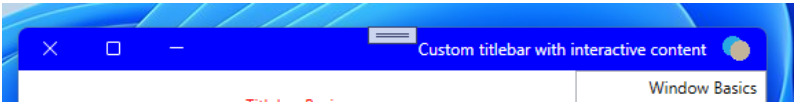

IXP RTL Layout
===
## Table of Contents

- [Problem Description](#problem-description)
- [Options and Proposals:](#options-and-proposals)
  - [1. Non-client titleBar area:](#1-non-client-titlebar-area)
    - [API changes proposal for FUTURE:](#api-changes-proposal-for-future)
  - [2. \[AppWindow\] TitleBar:](#2-appwindow-titlebar)
    - [A. \[AppWindow\] Client area rendering and extend into titleBar behavior:](#a-appwindow-client-area-rendering-and-extend-into-titlebar-behavior)
      - [Different presenters:](#different-presenters)
      - [Known Issues:](#known-issues)
  - [B. \[AppWindow\] Color Customized titleBar behavior:](#b-appwindow-color-customized-titlebar-behavior)
    - [AppWindow Title:](#appwindow-title)
    - [AppWindow Icon:](#appwindow-icon)
    - [AppWindow System menu:](#appwindow-system-menu)
  - [3. \[XAML\] Client area rendering and extend into titleBar behavior:](#3-xaml-client-area-rendering-and-extend-into-titlebar-behavior)
  - [4. PointerPoint coordinates:](#4-pointerpoint-coordinates)
    - [Work Item:](#work-item)
  - [5. Coordinate conversion APIs:](#5-coordinate-conversion-apis)
  - [6. Configure RTL property without using Win32 APIs to modify the child HWND’s style:](#6-configure-rtl-property-without-using-win32-apis-to-modify-the-child-hwnds-style)
    - [IContentSiteBridge interface:](#icontentsitebridge-interface)
      - [LayoutDirectionOverride property:](#layoutdirectionoverride-property)
  - [8. Process layout direction - FUTURE:  <br>](#8-process-layout-direction---future)

# Problem Description

This document describes how developers can use RTL layout for a Process, AppWindow and
ContentIsland.
1. Non-client titlebar area.
2. [AppWindow] TitleBar:
    - [AppWindow] Client area rendering and extend into titlebar behavior. - FUTURE
    - [AppWindow] Color customized titleBar. - FUTURE
3. [XAML] Client area rendering and extend into titlebar behavior.
4. PointerPoint coordinates should behave similarly for System Xaml (using Win32 input) and Lifted
XAML (using Lifted Input). @Fei's team involved here. 
5. Island's Coordinate conversion APIs from @Aden/@Tiberiu going to / from desktop coordinates. 
6. How to configure RTL properly without using Win32 APIs to modify the child HWND's style. 
7. What should we do about WS_EX_NOINHERITLAYOUT applying WS_EX_LAYOUTRTL on our window? See
[Extended Window Styles (Winuser.h) - Win32 apps](https://learn.microsoft.com/en-us/windows/win32/winmsg/extended-window-styles)
for details. 
8. Process layout direction.

# Options and Proposals:

## 1. Non-client titleBar area:
 
For non-client titleBar area, if we want to make the titleBar RTL my proposal is we can have API on
the AppWindow for IsLayoutDirectionRTL. If set to true, internally we set WS_EX_LAYOUTRTL on the
win32 window. If false, remove the style bit on win32 window. 

We follow the default win32 behavior:

|                  | Scenario       | Rule                               |
|------------------|----------------|------------------------------------|
| Top-level window | Owned window   | Remain LTR.                        |
| Top-level window | Unowned window | Follow Get­Process­Default­Layout.    |

Reference: [How does Windows decide whether a newly-created window should use LTR or RTL layout?]( https://devblogs.microsoft.com/oldnewthing/20220523-00/?p=106680)

“Important: Changing the mirroring style on the fly is not always the most efficient way of
implementing mirroring of windows. Many controls might not behave as expected and could be
improperly mirrored. Therefore, enabling mirroring of windows as they are initially created
remains the better approach.” <br>
Reference: [Mirroring in Win32 - Globalization | Microsoft Docs](https://learn.microsoft.com/en-us/globalization/localizability/mirroring-in-win32)

### API changes proposal for FUTURE:

```csharp
LIFTED_CONTRACT(1) 
LIFTED_RUNTIME_CLASS(AppWindow) 
{ 
  LIFTED_EXERIMENTAL 
  { 
    Boolean IsLayoutDirectionRTL; 
    Boolean IsLayoutNotInherited; 
      
    [method_name("CreateWithLayoutDirection")] 
    static AppWindow Create( 
 		  bool isLayoutDirectionRTL); 
        
    [method_name("CreateWithLayoutDirectionAndInheritance")] 
    static AppWindow Create(
     	bool isLayoutDirectionRTL, bool isLayoutNotInherited); 
   }
}
```

Known issues: 
- AppWindow TitleBar LeftInset RightInset should consider the app's primary language to check for RTL

## 2. [AppWindow] TitleBar:

### A. [AppWindow] Client area rendering and extend into titleBar behavior:

The proposal in #1 should work for this as well. The appearance of fully customized AppWindow
titleBar looks correct. Also, the caption buttons for AppWindow work correctly. I tried this in
both WinAppSDK WPF(Setting the FlowDirection=RightToLeft and verified that the window has
WS_EX_LAYOUTRTL bit set) and Win32 app. 

#### Different presenters:

Verified that the caption buttons appear correctly in different presenters i.e., CompactOverlay,
Fullscreen and Overlapped (with different configurations tool window, dialog, contextMenu,
mainWindow). 


#### Known Issues:

AppWindowTitleBar.SetDragRectangles does not work when FlowDirection=RightToLeft. 

In the scenario when ExtendsContentIntoTitleBar=true, the AppWindowTitleBar.SetDragRectangles does
not work as expected when WS_EX_LAYOUTRTL is set on the window. Due to this the custom titleBar is
not draggable. Observed this bug in Win32 as well as WPF app. 

## B. [AppWindow] Color Customized titleBar behavior:

### AppWindow Title:
 
Observed that if special characters are present at the beginning or end of English letters then
they are mirrored. See example below for more info: 

Ex scenario: 
Set title of AppWindow to ###AppWindow!!!

Result in RTL: !!!AppWindow### 

Result in LTR: ###AppWindow!!! 

Verified that AppWindow.SetTitle behavior is consistent with Win32 title behavior. 

Verified that for RTL languages like Hebrew the letters appear RightToLeft. But since English is
LTR the letters are not mirrored. So, no changes are necessary here. 

### AppWindow Icon:  
Is the titleBar Icon mirrored when the RTL layout is set on the window?  

The icon is not mirrored. It is the same as how it is in LTR. Verified this using default icon as
well as a custom Icon in WPF as well as Win32 app. So, no changes are necessary here. 

### AppWindow System menu: 

The System menu also appears RTL when the layout direction is RTL for both color customized 
titleBar as well as fully customized titleBar which is consistent with Win32 titleBar. So, no
changes are necessary here. 


## 3. [XAML] Client area rendering and extend into titleBar behavior:

## 4. PointerPoint coordinates: 

The behavior of PointerPoint is not consistent with Win32
WM_LBUTTONDOWN.
- WM_LBUTTONDOWN Behavior: 
RTL window: the client area origin (0, 0) is top right. 
LTR window: the client area origin (0, 0) is top left. 
I observed this behavior using a Win32 app. 

- Lifted PointerPoint.CurrentPoint behavior: 
For both RTL and LTR the client area origin (0,0) is top left. 
I observed this behavior using DrawingIsland InputPointerSource.PointerPressed event,
args.currentPoint when I set the layout of the top-level window to RTL as well as LTR.

Below is the work item to fix this inconsistency.

### Work Item:
Lifted pointer input should mirror coordinates when hosted in RTL HWND.

## 5. Coordinate conversion APIs:

I think if the PointerPoint coordinates work correctly then I assume the coordinate conversion APIs
should work since we use MapWindowPoints internally for coordinate conversions. Will verify this
once #4 is done. 

## 6. Configure RTL property without using Win32 APIs to modify the child HWND’s style:


```csharp
    LIFTED_EXPERIMENTAL 
    LIFTED_ENUM(LayoutDirection) 
    {
        LeftToRight,
        RightToLeft 
    }; 

    LIFTED_EXPERIMENTAL
    LIFTED_INTERFACE(IContentSiteBridge) requires Windows.Foundation.IClosable 
    {
        Windows.Foundation.IReference<LayoutDirection> LayoutDirectionOverride; 
    }

    LIFTED_EXPERIMENTAL 
    LIFTED_UNSEALED_RUNTIME_CLASS(ContentIsland) : Windows.Foundation.IClosable 
    {  
        LayoutDirection LayoutDirection { get; }; 
    }
```

### IContentSiteBridge interface:

A `IContentSiteBridge` provides information about the specific site hosting the `ContentIsland`,
which internally uses a `ContentSite` to communicate with the `ContentIsland`.

Implements:<br>
[`Windows.Foundation.IClosable`](https://docs.microsoft.com/en-us/uwp/api/windows.foundation.iclosable?view=winrt-22000).

#### LayoutDirectionOverride property:

Gets or sets the overridden layout direction. This will affect the `ContentIsland.LayoutDirection`.
By default, this property is null.  

1. PopupWindowSiteBridge LayoutDirectionOverride:<br>

    a. Behavior when LayoutDirectionOverride=null: In this case the popupWindowSiteBridge inherits
    the LayoutDirection from its owner (whoever created this popup). The owner can be
    desktopSiteBridge/another popupWindowSiteBridge(if nested). Also, later if the owner's
    layoutDirection is updated then this popupWindowSiteBridge's layoutDirection is updated to the
    same value. 
    
    b. Behavior when the LayoutDirectionOverride is set to explicit value (LeftToRight or
    RightToLeft): Updates this popups layoutDirection to the given value. Also, even if the
    owner’s LayoutDirection is changed in the future, the popupWindowSiteBridge's
    layoutDirection will be unaffected by those changes.     

2. DesktopChildSiteBridge LayoutDirectionOverride:<br>
    a. Behavior when the LayoutDirectionOverride is null: When the LayoutDirectionOverride is
    set to null, we have the standard Win32 behavior for Child window. 
    Reference: [How does Windows decide whether a newly created window should use LTR or RTL layout?](https://devblogs.microsoft.com/oldnewthing/20220523-00/?p=106680)

|  | Scenario     | Scenario                             | Rule                                 |
|--|--------------|--------------------------------------|--------------------------------------|
|  | Child window | Parent omits WS_EX_NO­INHERIT­LAYOUT   | Inherit WS_EX_LAYOUTRTL from parent. |
|  | Child window | Parent has WS_EX_NO­INHERIT­LAYOUT     | Remain LTR.                          |

    b. Behavior when the LayoutDirectionOverride is set to explicit value (LeftToRight or RightToLeft):
    The layoutDirection of this child window is updated. Also, if this window owns any
    popupWindowSiteBridges (whose layoutDirection is not overridden) then they are updated to
    this value as well.  
    
3. SystemVisualSiteBridge LayoutDirectionOverride: Currently we do not support this. 
    
4. CoreWindowSiteBridge LayoutDirectionOverride: Currently we do not support this as well. 

## 8. Process layout direction - FUTURE:  <br>

We should provide a way for developers to set the layout direction of the process which is a
wrapper for the following win32 API: <br>
- Setter property IsDefaultLayoutRTL equivalent: 
    [SetProcessDefaultLayout function (winuser.h) - Win32 apps](https://learn.microsoft.com/en-us/windows/win32/api/winuser/nf-winuser-setprocessdefaultlayout) 
- Getter property IsDefaultLayoutRTL equivalent:
    [GetProcessDefaultLayout function (winuser.h) - Win32 apps](https://learn.microsoft.com/en-us/windows/win32/api/winuser/nf-winuser-getprocessdefaultlayout)

“All windows created after the call will be mirrored, but existing windows are not affected.”
[“Window Features - Win32 apps](https://learn.microsoft.com/en-us/windows/win32/winmsg/window-features)

```csharp
LIFTED_EXPERIMENTAL
LIFTED_RUNTIME_CLASS(Process) 
{
    static bool IsDefaultLayoutRTL;
}  
```