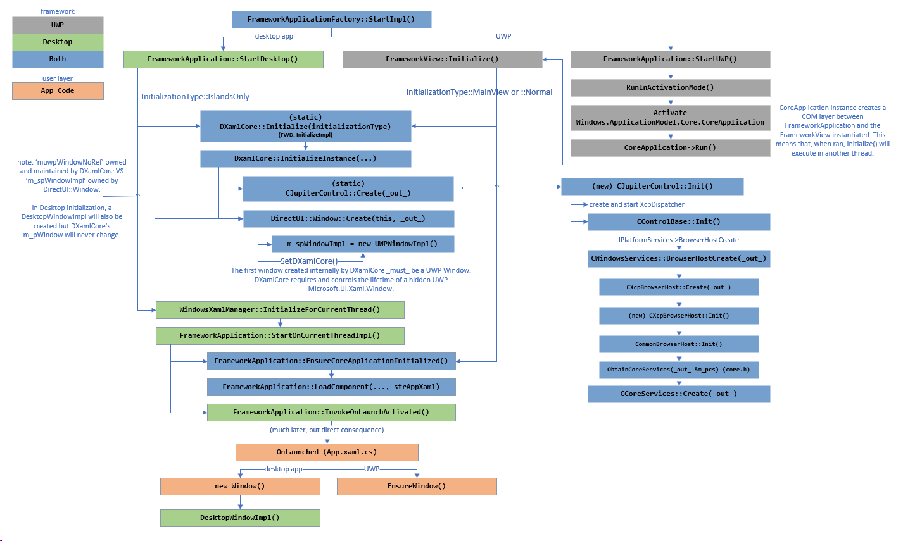

# Startup for Xaml

## Table of Contents

- [Overview](#overview)
- [DXamlCore initialization](#dxamlcore-initialization)
- [CJupiterWindow initialization](#cjupiterwindow-initialization)
- [Setting initial content](#setting-initial-content)
- [ApplicationStartupEventComplete](#applicationstartupeventcomplete)
- [Other](#other)
- [Startup Flow Diagram](#startup-flow-diagram)

## Overview

Startup for UWP and desktop shares some common elements. This can be considered the common root.

Note that UWP mode is not supported publicly, we only keep it running because tests still depend on it.

Refer to the [Startup Flow Diagram](#startup-flow-diagram) at the bottom of this page to see a graphical overview of the
important steps in the initialization process.

There are four pieces to startup:
  1. DXamlCore initialization (DirectUI::DXamlCore::InitializeImpl)
  2. CJupiterWindow initialization (DirectUI::DXamlCore::ConfigureJupiterWindow)
  3. Setting initial content (DirectUI::ContentManager::SetContent)
  4. Start the application (CCoreServices::StartApplication)

Each piece is triggered differently depending on whether we're running a UWP or a desktop app.

These are some helpful breakpoints for debugging through startup:

```
bu Microsoft_UI_Xaml!DirectUI::FrameworkApplicationFactory::StartImpl
bu Microsoft_UI_Xaml!DirectUI::FrameworkApplication::StartDesktop
bu Microsoft_UI_Xaml!DirectUI::FrameworkView::Initialize
bu Microsoft_UI_Xaml!DirectUI::DXamlCore::InitializeImpl
bu Microsoft_UI_Xaml!CJupiterControl::Create
bu Microsoft_UI_Xaml!CXcpBrowserHost::Create
bu Microsoft_UI_Xaml!CCoreServices::Create
bu Microsoft_UI_Xaml!CWindowRenderTarget::Create
bu Microsoft_UI_Xaml!CContentRoot::CContentRoot
bu Microsoft_UI_Xaml!DirectUI::Window::Create
bu Microsoft_UI_Xaml!DirectUI::UWPWindowImpl::UWPWindowImpl
bu Microsoft_UI_Xaml!DirectUI::DesktopWindowImpl::DesktopWindowImpl
bu Microsoft_UI_Xaml!CJupiterWindow::CJupiterWindow
bu Microsoft_UI_Xaml!DirectUI::WindowsXamlManager::Initialize
bu Microsoft_UI_Xaml!DirectUI::FrameworkApplication::InvokeOnLaunchActivated
bu Microsoft_UI_Xaml!DirectUI::ContentManager::SetContent
bu Microsoft_UI_Xaml!DirectUI::DesktopWindowXamlSource::Initialize
bu Microsoft_UI_Xaml!CXamlIslandRoot::CXamlIslandRoot
bu Microsoft_UI_Input!CompositionContentStatics::Create
bu Microsoft_UI_Input!DesktopWindowBridgeStatics::Create
bu Microsoft_UI_Input!DesktopWindowBridge::Connect
bu Microsoft_UI_Xaml!CXcpBrowserHost::FireApplicationStartupEventComplete
bu Microsoft_UI_Xaml!VisualTree::SetPublicRootVisual
```

If you need to debug in UWP mode, these might also be helpful:
```
bu Microsoft_UI_Input!CoreWindowBridgeStatics::Create
bu Microsoft_UI_Input!CoreWindowBridge::Connect
```

Note: The sections below refer to methods in Xaml code and their call trees. These aren't exact stack traces - they've
been simplified to capture the key methods. There will be more functions in between. The entries inside parentheses are
places of interest to set breakpoints.


## DXamlCore initialization

UWP kicks this off with two different threads. The thread that runs StartImpl will eventually call ICoreApplication::Run
with a FrameworkViewSource. That will create a view on another thread that does most of the work. That other thread then
becomes the UI thread for Xaml.

```
  1. (DirectUI::FrameworkApplicationFactory::StartImpl)
  2.     (DirectUI::FrameworkApplication::StartUWP)
  3.         (RunInActivationMode)
  4. Initialize FrameworkView on new UI thread (DirectUI::FrameworkView::Initialize)
  5.     (DirectUI::DXamlCore::InitializeInstance)
```

Desktop does this with a single thread, which is already the UI thread for the app. The UI thread calls here, which goes
to (DirectUI::FrameworkApplication::StartDesktop), which calls DXamlCore::Initialize directly.

```
  1. (DirectUI::FrameworkApplicationFactory::StartImpl)
  2.     (DirectUI::FrameworkApplication::StartDesktop)
  3.         (DirectUI::DXamlCore::InitializeInstance)
```

Once we're in DXamlCore::Initialize the code paths converge:

```
  1. (DirectUI::DXamlCore::InitializeInstance)
  2.     Creates and initializes CJupiterControl (CJupiterControl::Create/Init)
  3.         Creates and initializes CXcpDispatcher (CXcpDispatcher::Create/Init)
  4.             Creates message hwnd with CXcpDispatcher::WindowProc (CXcpDispatcher::Init)
  5.             Creates IDispatcherQueueTimer for requesting ticks (CXcpDispatcher::Init)
  6.         Creates and initializes CXcpBrowserHost (CXcpBrowserHost::Create/Init)
  7.             Creates and initializes CCoreServices (CCoreServices::Create)
  8.         Initializes null content (CXcpBrowserHost::put_EmptySource)
  9.             Creates and initializes CContentRoot (CContentRoot::CContentRoot)
 10.                 Creates and initializes VisualTree (it's inlined into CContentRoot)
 11.     Creates DirectUI::Window (DirectUI::Window::Create)
 12.         Creates DirectUI::UWPWindowImpl (DirectUI::UWPWindowImpl::UWPWindowImpl)
```

This same code runs for both UWP and desktop, but it's UWP-centric code. For example, the CContentRoot created in step 9
is created from CCoreServices::InitCoreWindowContentRoot and is meant to be used for a CoreWindow. Desktop apps don't
have a CoreWindow, so this CContentRoot is meaningless. The window created in step 11 also unconditionally creates a
UWPWindowImpl even for desktop apps. These UWP ties are due to legacy reasons - Xaml was initially UWP-only and was
later upgraded with Xaml islands. There are still places in the code that makes UWP assumptions, and these are places
for improvements as we continue converging our code paths.


## CJupiterWindow initialization

UWP gets its CJupiterWindow via (DirectUI::FrameworkView::SetWindow), which passes in an ICoreWindow.

```
  1. (DirectUI::FrameworkView::SetWindow)
  2.     Create CJupiterWindow with the hwnd (CJupiterWindow::CJupiterWindow)
  3.     Set CJupiterWindow on control (CJupiterControl::SetWindow)
```

Desktop apps don't have FrameworkViews or CoreWindows. Instead, the CJupiterWindow is created when we initialize the
WindowsXamlManager.

```
  1. DirectUI::FrameworkApplication::StartDesktop
  2.     Initialize WindowsXamlManager (DirectUI::WindowsXamlManager::Initialize)
  3.         (DirectUI::FrameworkApplication::StartOnCurrentThreadImpl)
  4.             CJupiterWindow::ConfigureJupiterWindow
```

This process leaves the CJupiterWindow with no hwnd inside.


## Setting initial content

Setting the initial content involves a call out to the app.

UWP goes through (DirectUI::FrameworkView::OnActivated).

```
  1. (DirectUI::FrameworkView::OnActivated)
  2.     Call out to app's OnLaunched override (DirectUI::FrameworkApplication::InvokeOnLaunchActivated)
  3.         VS boilerplate app code sets Window.Current.Content (DirectUI::UWPWindowImpl::put_ContentImpl)
  4.             (DirectUI::ContentManager::SetContent)
  5.                 (DirectUI::ContentManager::CreateRootScrollViewer)
  6.                 Queue ApplicationStartupEventComplete (CXcpBrowserHost::FireApplicationStartupEventComplete)
```

Desktop apps don't have FrameworkViews. Instead, they also use initialization of the WindowXamlManager to call out to
the app.

```
  1. DirectUI::FrameworkApplication::StartDesktop
  2.   Initialize WindowsXamlManager (DirectUI::WindowsXamlManager::Initialize)
  3.     (DirectUI::FrameworkApplication::StartOnCurrentThreadImpl)
  4.       Call out to app's OnLaunched override (DirectUI::FrameworkApplication::InvokeOnLaunchActivated)
```

In a desktop app, the app's Application.OnLaunched override will create a new Window, rather than just set
Window.Current.Content like UWPs. This is because there is no Window.Current for desktop apps - it's explicitly blocked
by WindowFactory::get_CurrentImpl. This follows the logic for Xaml island apps - when there are multiple islands,
there's no reliable definition for the "current" window.

Creating a new window is also needed for desktop apps because DXamlCore initialization never created a desktop window.
Instead, it created a placeholder UWPWindowImpl. It's this call from the app's OnLaunched that actually creates the
DesktopWindowImpl.

```
  4.       Call out to app's OnLaunched override (DirectUI::FrameworkApplication::InvokeOnLaunchActivated)
  5.         Create a window (DirectUI::Window::Window)
  6.           Create a DesktopWindowImpl (DirectUI::DesktopWindowImpl::DesktopWindowImpl)
  7.             Create the hwnd for the DesktopWindow (::CreateWindowEx)
```

The CreateWindowEx call also sets up the message pump and delivers an initial WM_NCCREATE message. That creates the
DesktopWindowXamlSource that hosts the island. This is also the part that creates all of the IXP hosting objects,
including the CompositionContent, InputSite, and DesktopWindowBridge.

```
  7.             Create the hwnd for the DesktopWindow (::CreateWindowEx)
  8.               (DirectUI::DesktopWindowImpl::OnCreate)
  9.                 Create DesktopWindowXamlSource (DirectUI::DesktopWindowXamlSource::Initialize)
 10.                   Create island (DirectUI::FrameworkApplication::CreateIslandWithContentBridgeImpl)
 11.                     Run missing Xaml initialization for UWPs (DirectUI::UWPWindowImpl::EnsureInitializedForIslands)
 12.                       Set placeholder root for UWP window (DirectUI::ContentManager::SetContent)
 13.                         Queue ApplicationStartupEventComplete (CXcpBrowserHost::FireApplicationStartupEventComplete)
 14.                     Create CXamlIslandRoot (CXamlIslandRoot::CXamlIslandRoot)
 15.                       Create IXP CompositionContent (CXamlIslandRoot::InitializeCommon)
 16.                       Create IXP InputSite (CXamlIslandRoot::InitializeInput)
 17.                 Create IXP DesktopWindowBridge and connect to CompositionContent (DirectUI::DesktopWindowXamlSource::AttachToWindow)
 18.                 Set DesktopWindowXamlSource content (DirectUI::DesktopWindowXamlSource::put_ContentImpl)
 19.                   Set island content (DirectUI::XamlIslandRoot::put_ContentImpl)
 20.                     Set content (DirectUI::ContentManager::SetContent)
 21.                       Create root scroll viewer (DirectUI::ContentManager::CreateRootScrollViewer)
```

Steps 14 to 17 deal with creating the IXP objects. Steps 11 to 13 take care of assumptions made by Xaml back when it
only ran UWPs. This importantly queues up the ApplicationStartupEventComplete message that Xaml relies on to build the
root of the visual tree. We also through ContentManager::SetContent twice - the first time to fill out the placeholder
UWPWindowImpl's content with a placeholder grid, and the second time to initialize the tree in the new desktop window.


## ApplicationStartupEventComplete

ApplicationStartupEventComplete is a message that Xaml queues for itself when it finishes startup. This code path is
shared between UWP and desktop apps, and finishes constructing the root of the Xaml tree.

```
  1. (CXcpBrowserHost::ApplicationStartupEventComplete)
  2.     (CCoreServices::StartApplication)
  3.         Build the root of the tree (VisualTree::SetPublicRootVisual)
```

This attaches the various roots under CRootVisual, including CXamlIslandRootCollection with all the islands and the
CRootScrollViewer for the main tree.


## Other

Another thing to note is that an IXP CoreWindowContentBridge/CompositionContent/InputSite exist for UWP apps as well.
These aren't created as part of the startup code path, but rather are created when we start ticking in
(CCoreServices::NWDrawTree) -> (DCompTreeHost::SetTargetWindowUWP). This code can be moved up to the initialization code
path to better match desktop apps.

## Startup Flow Diagram


