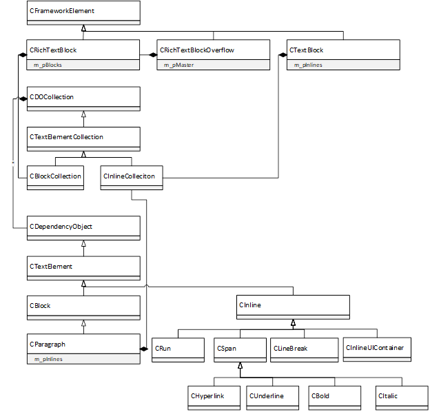
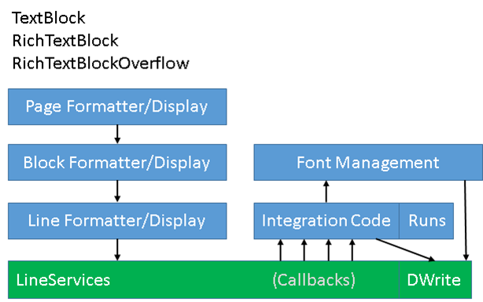
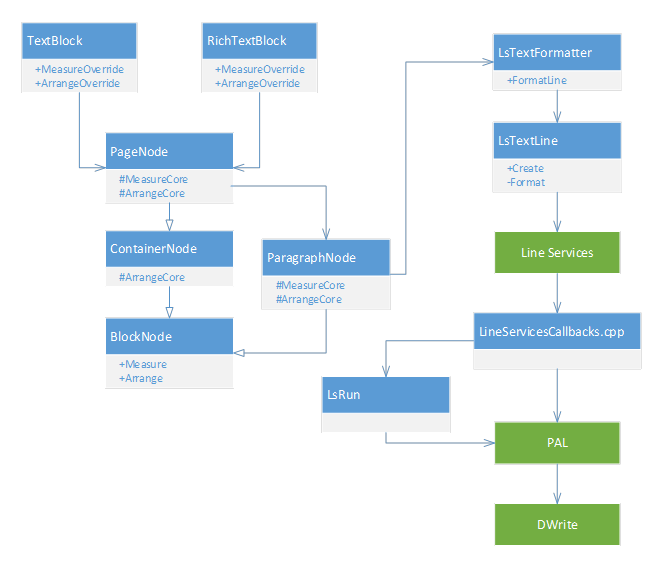
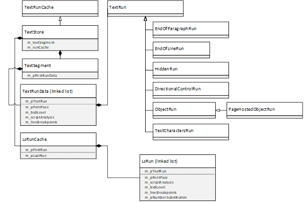
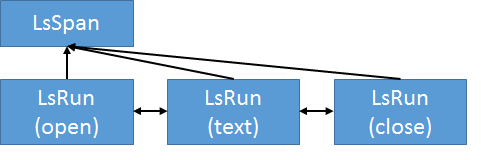
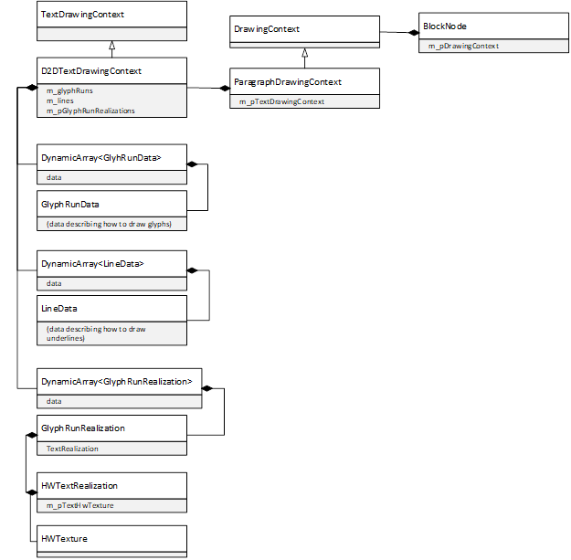
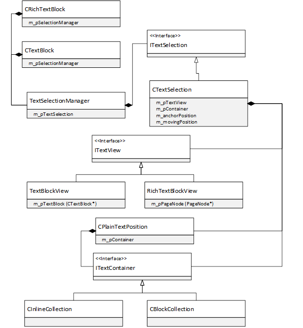
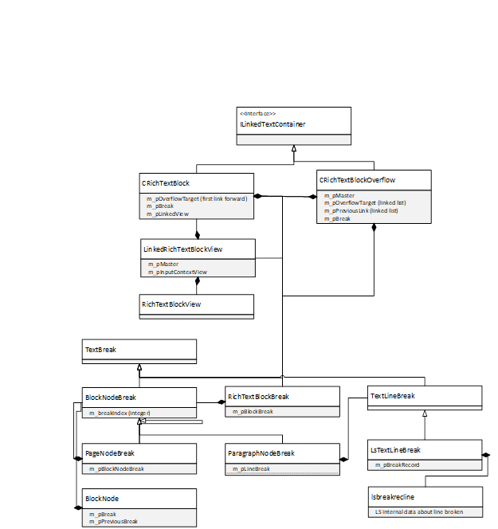
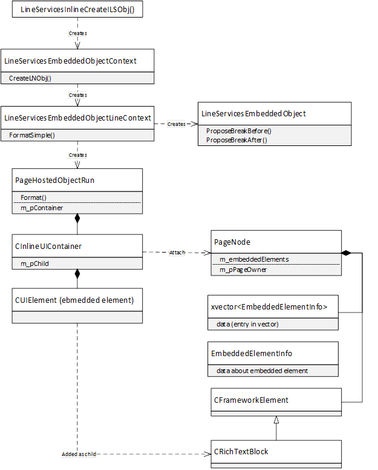
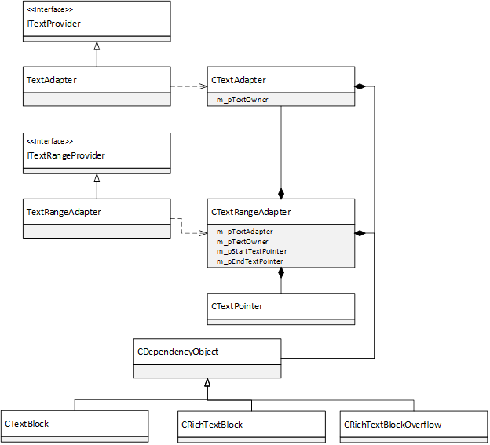

# Read-Only Text Controls Architecture

This document describes the architecture of XAML’s read-only text controls, and supporting functionality in the XAML
platform to make them fully functional in a XAML application.

<!-- When editing this TOC, I suggest setting tool to only use heading levels 2..3, otherwise there are too many headings -->
* [Brief Overview of XAML’s Text Controls from Component
  View](#brief-overview-of-xaml%E2%80%99s-text-controls-from-component-view)
* [Breif Overview of the Read-Only Text Controls](#breif-overview-of-the-read-only-text-controls)
  * [Blocks and Inlines](#blocks-and-inlines)
* [Read-Only Text Component Architecture Overview](#read-only-text-component-architecture-overview)
* [Formatting Details](#formatting-details)
  * [Font Management](#font-management)
  * [Page/Block Formatting](#page%2Fblock-formatting)
  * [Line, Block, and Page Breaks](#line%2C-block%2C-and-page-breaks)
  * [Line Formatting](#line-formatting)
  * [Reformatting of Lines due to wrapping/trimming](#reformatting-of-lines-due-to-wrapping%2Ftrimming)
* [Rendering Details](#rendering-details)
  * [Arrange Pass and generation of text meta-data](#arrange-pass-and-generation-of-text-meta-data)
  * [Render Walk(s)](#render-walk%28s%29)
* [Selection](#selection)
  * [User-Input driven selection](#user-input-driven-selection)
  * [Programmatic Selection](#programmatic-selection)
* [RichTextBlockOverflow](#richtextblockoverflow)
* [InlineUIContainer](#inlineuicontainer)
  * [Measure pass details](#measure-pass-details)
  * [Arrange pass details](#arrange-pass-details)
  * [Draw pass details](#draw-pass-details)
* [Accessibility (UIA)](#accessibility-%28uia%29)

## Brief Overview of XAML’s Text Controls from Component View

XAML actually has two different types of text controls:
```
  TextBox                 |   TextBlock
  RichEditBox             |   RichTextBlock
  PasswordBox             |   RichTextBlockOverflow
 _______________________  |  ___________________________
|        Editable       | | |       Non-Editable        |
|-----------------------| | |---------------------------|
|  RichEdit  |  DWrite  | | |  LineServices  |  DWrite  |
|_______________________| | |___________________________|
```

The editable controls, `TextBox`, `RichEditBox`, and `PasswordBox`, are all based on the `RichEdit` control, and
`DWrite` for rendering. `RichEdit` handles almost all of the heavy lifting for XAML and there is relatively little code
in the XAML platform for them. These controls are not the focus of this document and will not be discussed further.

The non-editable (read-only) controls, `TextBlock`, `RichTextBlock`, and `RichTextBlockOverflow`, are all backed by a
complex implementation, much of which is in the XAML platform itself, and is the focus of this document. The backbone of
this implementation leverages the LineServices component, which is primarily responsible for the layout of text, and
DWrite, which performs a variety of tasks, the most important of which is measuring and rendering the text.

## Brief Overview of the Read-Only Text Controls

There are a family of XAML elements that make up the set of text controls. Let’s start with the highest level ones:

* [TextBlock](https://docs.microsoft.com/en-us/windows/winui/api/microsoft.ui.xaml.controls.textblock): This control
supports the notion of a collection of inline elements which flow together to form a single “block”, which can be
conceptualized as a paragraph of content.

* [RichTextBlock](https://docs.microsoft.com/en-us/windows/winui/api/microsoft.ui.xaml.controls.richtextblock): This
control is strikingly similar to TextBlock but adds the concept of having multiple blocks instead of just one like
TextBlock has. Each block consists of a collection of inline elements which flow together like in TextBlock.
RichTextBlock also has some advanced features not present in TextBlock that will be called out explicitly below.

* [RichTextBlockOverflow](https://docs.microsoft.com/en-us/windows/winui/api/microsoft.ui.xaml.controls.richtextblockoverflow):
This control allows the content of a RichTextBlock to “overflow” into a RichTextBlockOverflow when the content does not
fit in the RichTextBlock. Formatting can end at an arbitrary place in the RichTextBlock and will pick up where it left
off in the RichTextBlockOverflow. RichTextBlockOverflows can be chained together.

* [Glyphs](https://docs.microsoft.com/en-us/windows/winui/api/microsoft.ui.xaml.documents.glyphs): This was not shown in
the component diagram above, as it is an outlier from the rest of the read-only controls. It is the most primitive of
all the text controls, it can display a single glyph run only. It has none of the fancier text layout capabilities that
the other text controls have. LineServices is not used to perform its layout. DWrite is used to measure/render the glyph
run. It will not be discussed further in this document.

Note that although I’ve called all these elements “controls”, they are not derived from the XAML Control class, they are
all derived from `FrameworkElement`, which is a lower-level element than Control. Primarily this means that they are not
templated and can't be set as the keyboard focus.

These elements can be instantiated in the XAML DOM in arbitrary places. The content of TextBlock/RichTextBlock is
supplied by creating lower-level text elements as their children, covered in the next section on Blocks and Inlines. The
one exception to this is that you can specify the content for a TextBlock via its Text property or its XML “content”,
eg:

`<TextBlock>This is the content of the TextBlock</TextBlock>`

### Overlap of TextBlock's Text and Inlines properties

The [TextBlock.Text](https://docs.microsoft.com/uwp/api/Microsoft.UI.Xaml.Controls.TextBlock.Text) property is really a
wrapper for the [TextBlock.Inlines](https://docs.microsoft.com/uwp/api/Microsoft.UI.Xaml.Controls.TextBlock.Inlines)
property. So the following are equivalent:

```xml
<TextBlock Text="Hello world"/>
```

and

```xml
<TextBlock>
  <TextBlock.Inlines>
    <Run>Hello world</Run>
  </TextBlock.Inlines>
</TextBlock>
```

They're not just equivalent in how they appear; they're equivalent programmatically as well. For example, after defining
this in markup where the second word appears bold:

```xml
<TextBlock x:Name="TB1">
    <Run>Hello</Run><Bold>world</Bold>
</TextBlock>
```

the plain text also shows up in the `Text` property:

```cs
Debug.Assert(TB1.Text == "Hello world");
```

Similarly, setting the `Text` property causes the `Inlines` property to have a single `Run` entry in it with the same
text.

In Xaml markup, `TextBlock`'s
[ContentPropertyAttribute](https://docs.microsoft.com/uwp/api/Microsoft.UI.Xaml.Markup.ContentPropertyAttribute) is
actually set to `Inlines`, and there are some conversions that automatically create a `Run` if you only specify a
string, and then that gets exposed from the `Text` property.

This overlap/wrapping of `Text` and `Inlines` was done in WPF in order to make `TextBlock` easier to use, and carried
into WinUI.

### Blocks and Inlines

As stated above, a `TextBlock` consists of a single block, which formats itself like a paragraph (you can draw a
rectangular box around the content). For TextBlock, the block is the TextBlock element itself.

`RichTextBlock` can have multiple blocks as children. This is accessed via the `Blocks` property, which is a
`BlockCollection`. A `BlockCollection` is a collection of Block elements. There is only one type of Block, `Paragraph`,
which encapsulates the block.

A `Paragraph` gives access to its child Inlines via the `Inlines` property, which is an `InlineCollection`. An
`InlineCollection` is a collection of `Inline` elements. Inline elements format themselves more like sentences as they
have a flow (either left-to-right or right-to-left), can wrap, and can be broken at the end of a line.

There are a number of types of Inline elements, the most basic of which is `Run`. The list of Inline types is covered
more below. First some examples of blocks and runs:

**Example 1:**

``` xml
<TextBlock>abc</TextBlock>
```
`TextBlock` has a single `Inline` in its
[TextBlock.Inlines](https://docs.microsoft.com/uwp/api/Microsoft.UI.Xaml.Controls.TextBlock.Inlines) `InlineCollection`,
the `Run` “abc”

**Example 2:**

``` xml
<TextBlock>
    <Run>Run1</Run>
    <Run>Run2</Run>
</TextBlock>
```
`TextBlock` has 2 Inlines in its `InlineCollection`, both are `Run`s (“Run1” and “Run2”). When displayed on screen this
would look like:

```
Run1Run2
```

**Example 3:**

``` xml
<RichTextBlock>
    <Paragraph>
        <Run>Run1</Run>
    </Paragraph>
    <Paragraph>
        <Run>Run2</Run>
    </Paragraph>
</RichTextBlock>
```
`RichTextBlock` has 2 Blocks (`Paragraphs`) in its `BlockCollection`, each has one `Inline` in its `InlineCollection`,
both are `Run`s (“Run1” and “Run2”).  When displayed on screen this would look like:

```
Run1
Run2
```

There are multiple types of Inline:

* [Run](https://docs.microsoft.com/en-us/windows/winui/api/microsoft.ui.xaml.documents.run): The most basic type of
  `Inline`, just a simple run of text.
* [LineBreak](https://docs.microsoft.com/en-us/windows/winui/api/microsoft.ui.xaml.documents.linebreak): Breaks the
   current line, causing the next `Inline` to be displayed on the next line.
* [Span](https://docs.microsoft.com/en-us/windows/winui/api/microsoft.ui.xaml.documents.span): Another collection class,
  has an `InlineCollection`. Also can specify content just like a `Run`. Useful for applying a common property to its
  children.
* [Underline](https://docs.microsoft.com/en-us/windows/winui/api/microsoft.ui.xaml.documents.underline): Derived from
  `Span`, also puts an underline under all the text.
* [Bold](https://docs.microsoft.com/en-us/windows/winui/api/microsoft.ui.xaml.documents.bold): Derived from `Span`, also
  makes the text bold.
* [Italic](https://docs.microsoft.com/en-us/windows/winui/api/microsoft.ui.xaml.documents.italic): Derived from `Span`,
  also makes the text italicized.
* [Hyperlink](https://docs.microsoft.com/en-us/windows/winui/api/microsoft.ui.xaml.documents.hyperlink): Derived from
  `Span`, also has HTML-like hyperlink behavior, allowing you to click on it and navigate to a URL.
* [InlineUIContainer](https://docs.microsoft.com/en-us/windows/winui/api/microsoft.ui.xaml.documents.inlineuicontainer):
  This is a special element that wraps an arbitrary UIElement and allows the UIElement to flow in the collection of
  inlines owned by a block. Note that `InlineUIContainer`s can only be inserted as the child of a `Paragraph` and is not
  allowed as the child of a `TextBlock`. `InlineUIContainer` will be covered in more detail later in this document.

Here’s a picture of the core object class hierarchy for these XAML elements:



Notice that `Paragraph` and `Inline` derive from `DependencyObject`, not `FrameworkElement`. This has some implications,
such as not being able to style these elements.

## Read-Only Text Component Architecture Overview

Let’s take a look at a slightly more detailed component level picture of the text architecture:



The 3 read-only text controls all follow the same basic design, consisting of several key pieces:

* **Page Level**: At the highest level is the notion of a “page” of content, which is a simple concept mapping to the
  entirety of the text control’s content. This concept of page should not be confused with physical pages (eg the pages
  of a book), the Page of one TextBlock may be completely different in size than that of another TextBlock.
* **Block level**: Each page has the notion of blocks which need to be formatted and displayed. A block abstraction is
  introduced at this level to wrap these blocks. `TextBlock` and `Paragraph` both use the same block abstraction in the
  block formatting/display code.
* **Line level**: Each block consists of a collection of lines which stack vertically to make up the content of the
  block. Not surprisingly, LineServices introduces the concept of a line. A line can be thought of as one of the lines
  that make up a paragraph. The line formatting code calls into LineServices to create these lines, and also calls into
  LineServices to display each line.
* **LineServices**: This is a third-party text-formatting engine used by XAML. LineServices is the engine that formats and
  displays lines. However LineServices itself is designed in such a way that it has little actual knowledge of the text
  it’s formatting or displaying. It defers this knowledge to its client, through the use of callbacks. XAML implements
  these callbacks.
* **Integration Code**: This is where all the LineServices callbacks are implemented. This code has many
  responsibilities, including script/bidi analysis and more, covered more below. XAML leverages DWrite heavily to
  perform these tasks. The primary responsibility of this code is to produce “runs”, which make up a line, another
  concept that LineServices introduces. There are many types of runs, but the most basic type of run is a sequence of
  characters that have the same formatting properties and can be displayed as a unit.
* **Font Management**: The set of fonts installed on the system, and fonts embedded into the XAML app are book-kept by a
  font management component. These fonts are a key participant in the process of formatting and displaying text.

Here’s a more detailed view of the components involved in formatting/displaying text, showing XAML objects and how they
interact with LineServices/DWrite:



## Formatting Details

By far the most complicated part of processing text is the “formatting” process. Formatting is typically done during the
Measure pass, although we will see later that formatting may be done during the Arrange pass as well.

The inputs to formatting are:

* The complete set of text content making up the control (ignoring `InlineUIContainer` for now, a special case). An
  abstraction, `TextSource`, provides runs of text to be formatted as they are requested by LineServices.
* Various XAML properties affecting the display of this content, including size, spacing, margin, flow direction,
  wrapping, trimming, typography features, etc. There are a large number of properties here that produce a huge matrix
  of behaviors. This document does not enumerate them all, but points out the ones that have the biggest effect on the
  architecture.
* The set of fonts used to display the text.

There are a number of outputs of formatting, the most important of which are:

* An array of `LineMetrics` objects, which contain vital information about each formatted line, including an
  `LsTextLine` object, which is used later to display each line. These objects are not cached for long, as soon as a
  line is displayed, it is released, to save memory. This means we may have to re-format lines at various times (eg
  during selection).
* A collection of `LsRun` objects for each line formatted which make up the runs of each line. These runs are cached by
  XAML and are also referenced internally by LineServices data structures, so that it knows what `LsRun`s make up each
  formatted line.

Note that many data structures involved when interacting with LineServices are opaque to LineServices, such as the
`LsRun` object. Only XAML understands these objects, LineServices book-keeps them and provides them at the appropriate
times during the formatting process.

### Font Management

**TBD:** Cover how we load the system font collection and ultimate font fallback, as well as how we load custom fonts
embedded into the appx package. Phone Blue has switched us from the hard-coded font fallback table to using DWrite, make
sure this is covered too.

### Page/Block Formatting

The highest level of formatting is at the page/block level. The page level is almost trivial so is included here. The
concept of block formatting is foreign to LineServices, XAML adds this concept on top of line formatting. It is fairly
straightforward, and consists of the following steps:

1. Formatting starts with the `PageNode`. Each text control has one `PageNode` that will format all the blocks owned by
   the control.
2. `PageNode` creates a `ParagraphNode` for each block to be formatted and formats it.
3. `ParagraphNode` creates and formats the lines that make up the block. A block will only produce one line if the
   `TextWrapping` property is set to `NoWrap`, which is the default. If `TextWrapping` is set to `Wrap` or
   `WrapWholeWords`, the block formatter will continue to create and format lines until:
   * There is no more content to format, OR
   * The amount of vertical space available has been exceeded (controlled by `Height` and `MaxHeight` properties), OR
   * The number of lines formatted exceeds the `MaxLines` property
4. After each line is formatted, it figures out how to place the line vertically according to the `LineStackingStrategy`
   property.

### Line, Block, and Page Breaks

As lines are formatted by the block formatting process described above, a line may be broken if it doesn’t fit in the
horizontal space provided (note that XAML does not support vertical formatting). In this case, LineServices creates a
“break record” that contains information about exactly where the line was broken.  This break record is saved by the
block formatter and used to start formatting a new line in the case that text is wrapping. It is given to LineServices
which can pick up where it left off on the next line.

This notion of breaking content and restarting the flow also applies to a special XAML object, `RichTextBlockOverflow`.
To support this, the concept of block and page breaks is introduced. What is important to understand is that line break
information is needed for all the controls to support wrapping text, but only `RichTextBlockOverflow` needs the higher
level break information (covered later).

### Line Formatting

Formatting individual lines is the most interesting part of formatting. LineServices drives the process of formatting a
line, but relies heavily on callbacks to participate in the process. The end result is the creation of an `LsTextLine`
and a set of `LsRun`s which make up the line.

For the purposes of this document, I will treat LineServices largely as a black box, this component is complex enough to
deserve its own architecture document.  What is important to understand is that LineServices has algorithms to fetch,
measure, and arrange runs on a line. The runs themselves are provided by XAML, along with information about the runs,
through callbacks into XAML. This section details what happens in those callbacks. Only the most important callbacks are
covered here, see
[LineServicesCallbacks.cpp](../../dxaml/xcp/core/text/RichTextServices/TextFormatter/lineservicescallbacks.cpp) if you
want to see the full set of callbacks XAML implements.

#### LineServicesFetchRun():

This is by far the most important of all the callbacks. LineServices calls this to fetch a run at a given character
position. Producing a run is surprisingly complex; it involves multiple different types of analysis (eg script and
bidi), all of which are necessary. Because of the large amount of processing required to produce a run, XAML does this
processing only once for the entire block and caches the results in an intermediate form before creating the actual runs
consumed by LineServices, in essence pre-processing the data ahead of future run requests. It also caches the runs
themselves, as LineServices may request the same run more than once as it formats a line.

Here’s a class-level picture of the objects involved in caching the intermediate run data and runs:



Each `ParagraphNode` has a `TextRunCache` which caches the runs for the paragraph. There are actually two caches:

* TextSegment: This stores the result of pre-processing all the text in the paragraph (covered in more detail below).
  This pre-processing is done the first time a run is requested for this paragraph. The result is a linked list of
  `TextRunData` objects, each wraps a `TextRun` object. There are multiple types of TextRuns, the most important of
  these is `TextCharactersRun`, which represents an actual run of text.
* LsRunCache: This caches the actual `LsRun` objects handed back to LineServices at the end of the
  `LineServicesFetchRun` callback. This cache is populated as unique runs are requested.

##### TextSegment Cache Population:

Population of the TextSegment cache goes as follows:

1. An initial population of the cache is performed by repeatedly requesting `TextRun` objects from the `ParagraphNode`'s
   `TextSource` at successive run positions until reaching the end-of-paragraph. There is only one type of TextSource,
   `ParagraphTextSource`, which works for both `Paragraph` elements and `TextBlock` elements. `ParagraphTextSource` will
   receive a pointer to characters from either a TextBlock’s `InlineCollection`, or from the `InlineCollection` of a
   `Paragraph`, where the actual text is stored, along with other information to help determine what type of run to
   create. `ParagraphTextSource` then decides which type of TextRun to create at the given character position, using the
   results from fetching a run from the underlying `InlineCollection`. These requests do not always return runs of text.
   As shown in the class diagram above, there are many types of `TextRun` objects:
   * EndOfParagraphRun: Marks the end of the block
   * EndOfLineRun: Created when certain UNICODE characters denoting a line break are encountered, or when closing the
     `LineBreak` XAML element (`LineBreak` takes 2 character positions, one to open, one to close).
   * HiddenRun: Created in multiple different situations:
     * At the start/end of an `InlineCollection` (there are 2 special character positions reserved at the start/end,
       these are called “reserved runs”)
     * At the start/end of an `Inline` (also called “reserved runs”)
     * If the paragraph is empty
     * When opening a `LineBreak` XAML element
     * When encountering CR or LF character
   * DirectionalControlRun: Created when the FlowDirection property causes a change in flow direction.
   * ObjectRun/PageHostedObjectRun: Created when an InlineUIContainer is encountered.
   * TextCharactersRun: Good-old-fashioned text
2. Script analysis is performed using DWrite’s `IDWriteTextAnalyzer::AnalyzeScript` API. This analyzes the characters
   and determines which scripts (eg Latin) are being used across which ranges of text in the runs.
3. Bidi analysis is performed using DWrite’s `IDWriteTextAnalyzer::AnalyzeBidi` API. This analyzes the characters and
   determines the “bidi levels”, which represents which ranges of text are left-to-right and which are right-to-left, as
   well as the levels of nesting (bidi levels increase as nesting increases).
4. Number substitution analysis is performed using DWrite’s `IDWriteTextAnalyzer::AnalyzeNumberSubstitution` API. This
   uses the Language property in combination with the Windows number substitution control panel setting, and determines
   which ranges of text contain digits, and which type of digit substitution is required, if any.
5. `TextRun`s are “itemized”, or split into smaller runs, based on the results of steps 2, 3, and 4. The idea is that
   if, say, the script changes within a run of text, that run must be split into smaller runs so that each run has the
   same script. The same applies to the other properties (bidi and number substitution).
6. Font fallback is performed. This analyzes the characters along with which font was specified, and uses a
   font-fallback data table to determine if a substitute font must be used to display any of the characters in the runs.
   Runs are split into smaller runs that require font fallback. Also note that digit substitution participates in this
   step, by translating digits appropriately into their alternate digit-substituted UNICODE code points if necessary
   before doing font fallback on those characters. Thus it is important that number substitution analysis be performed
   before font fallback, so we know which digits need to be substituted before doing font fallback on them. As of
   Windows Blue, XAML does its own font fallback lookup using its own data table, but Phone Blue has migrated off of
   this table and moved to DWrite. **TODO:** Cover details of font fallback.
7. Text complexity analysis is performed, largely leveraging DWrite’s `IDWriteTextAnalyzer::GetTextComplexity` API. This
   analyzes the characters and determines which ranges of text require shaping (“glyph” mode), and which can stay in
   “simple” mode. In glyph mode, characters are mapped to a set of glyphs that represent the glyphs that visually
   represent the run. This set of glyphs does not map 1:1 to the character code points. For example, certain groups of
   code points form “clusters”, it’s possible a single glyph is used to represent this cluster of characters. When in
   simple mode, there is a 1:1 mapping of each character to a single glyph, but when in glyph mode, there is a complex
   mapping between characters and glyphs. Glyph mode is much more expensive than simple mode. Runs that have a mix of
   simple and glyph mode are split into smaller runs. The following conditions require glyph mode:
   * Right-to-left text
   * Any typographic feature is turned on (see Typography XAML element)
   * Number substitution is being used
   * Surrogate pairs are present
   * Clusters are present
   * Combining marks are present
   * Complex script
8. Character spacing is adjusted at the boundaries of bidi level changes. Briefly, this fixes a problem that occurs when
   using the `CharacterSpacing` property, and there is mixed bidi text, by adjusting the character spacing at the bidi
   level boundaries as necessary.
9. Line breaking analysis is performed, using DWrite’s `IDWriteTextAnalyzer::AnalyzeLineBreakpoints` API. This analyzes
   the characters to find break opportunities when the text will not fit horizontally in the space provided. This
   generates an array of “break classes” that is used later. LineServices is actually responsible for breaking a line,
   and calls the XAML callback, `LineServicesGetBreakingClasses` to determine if it can break between two given
   characters (discussed further below). This callback uses the results of this analysis to return an appropriate value
   to LineServices.

At the end of this process, the `TextSegment` cache now has a linked list of `TextRunData` objects, each wrapping a
`TextRun`, and the list is in the same order as the runs occur in the character stream.

##### LsRunCache Population, creation of LsRuns and LsSpans:

After populating `TextSegment`’s cache, the `LsRunCache` is ready to be populated. Note that the `TextSegment` cache is
never actually searched, only the `LsRunCache` needs this capability. Although LineServices may request the same run
multiple times (eg when breaking a line), it makes a guarantee that it will always make the initial request for a given
run in the order of the runs, in other words, it will never jump forward to an arbitrary point. This simplifies the
algorithm for populating the `LsRunCache`.  If an `LsRun` is not found in the `LsRunCache`, it can easily be created
without searching the `TextSegment` cache. We simply book-keep a pointer to the first entry in the `TextSegment` cache,
and move this pointer forward as we create `LsRuns`.

Note that LineServices also tends to request runs in order. Because of this, we also optimize the `LsRunCache` for
sequential access by book-keeping the last requested run and beginning the search from that run.

The algorithm for fetching a run then looks like this:

```
Search the LsRunCache
If (run is not found)
{
    Populate TextSegment if necessary (on first request)
    Create an LsRun from the “current” position in the TextSegment cache, move current forward
    Cache LsRun in the LsRunCache
}
Return the LsRun
```

The `LsRun` data type is opaque to LineServices, it knows nothing about its structure. But some information is passed
back to LineServices to provide information about the run created, such as if the run is in simple/glyph mode, a pointer
to the actual characters, how many characters are in the run, etc. One field that deserves more explanation is the
`fetchruntype`, which tells LineServices what type of run we’re creating. This type is partially based on the type of
`TextRun` we created at this character position. There is a non-intuitive set of rules we use to set the various types:

* `fetchruntypeHidden`: The run is hidden (not rendered), and also takes no layout space. Used for HiddenRun, also used
  for control characters (except the Tab character) and directional control characters.
* `fetchruntypeText`: Used for good-old-fashioned TextCharactersRun, and EndOfLineRun
* `fetchruntypeLSObject`: Used to signify the beginning of a span (used for bidi, see below), or an `InlineUIContainer`
* `fetchruntypeCloseSpan`: Used at the end of a bidi span, and at the end of the paragraph

Note that there is a `fetchrunTypeOpenSpan`, for opening spans, but we use `fetchruntypeLSObject` for this instead. I
don’t understand why we do this. Beware there is some funky code around this.

At this point it becomes important to introduce the `LsSpan`. The above picture is not quite complete, as for a given
run request, we may actually create more than one `LsRun`, as well as possibly creating instances of a new type of
object, the `LsSpan`. An `LsSpan` is similar to a XAML Span in that it acts as the parent of a collection, thus forming
a span tree. However the `LsSpan` tree represents a different tree than the XAML `Span` tree, so be careful not to
confuse these two types of spans.

The `LsRun` collection is organized into a tree mostly because of bidi nesting. Not every `LsRun` consumes a character
position, there are special `LsRuns` that signify the start/stop of a bidi level changes, and these runs are given the
same character positions as the beginning/end of the runs of text themselves. These special runs have some information
in them (covered more below) that tell LineServices that a change in bidi level is occurring, and LineServices formats
the runs inside this bidi level in reverse from the previous level.

Because of this, a tree structure is introduced to disambiguate requests for the run at a given character position. Each
`LsRun` has a parent span (the containing `LsSpan`). There is also a “root” `LsSpan` for the `Paragraph` itself. (Spans are
also used for `InlineUIContainer`s.) When LineServices requests runs, in addition to supplying a requested character
position, it also supplies a parent span (the parent span of the desired run). Given these two things, the appropriate
run can be found.

The actual structure of the LsSpan tree, in conjunction with the `LsRun` linked list, is a bit funky and deserves some
explanation. The key thing to understand is that an `LsSpan` is a different object from the `LsRun`. The `LsSpan`s form
a tree, the `LsRun`s form a single linked list, and each `LsRun` has a pointer back to its parent span. When the bidi
level increases, a new `LsSpan` is created in the span tree and made the child of the `LsSpan` at the previous bidi
level. In addition, two `LsRun`s are created, one to “open” a new bidi level, and another to “close” the bidi level when
it goes back down.

The structure for the example of a single run of text at a higher bidi level looks like this:



The creation of these 3 runs requires LineServices to call the `LineServicesFetchRun` callback 3 times. The first time
we create the `LsSpan` and `LsRun` that opens the new bidi level, the second time we create the `LsRun` for the text,
and the third time we create the `LsRun` to close the bidi level. Note that the `LsSpan` object is also opaque to
LineServices. It works with something called a “span qualifier”, which is just a pointer to an `LsSpan`.

#### LineServicesGetBreakingClasses() and friends:

This callback is called once for each character of each text run, the result returned is two “breaking class” values,
which define under what conditions it is allowed to break a line before and after the given character. The breaking
class information was actually gathered earlier during `TextSegment` population (see previous section). There are two
cases here:

1. “Emergency breaking” mode: This mode is used only when the `TextTrimming` property is set to `CharacterEllipsis`. In
   this mode we provide no break opportunities and instead turn on another feature known as “forced break mode” – in
   this mode LineServices will force break a line as soon as is detects the characters don’t fit. This is turned on via
   a flag when we create the `LsRun`.
2. Non-Emergency-breaking mode: In this case we return the break information we stored away during `TextSegment`
   population. There are two possible values for the breaking class: `BreakAllowed` and `NoBreak`.

There are some really great comments in
[LineBreaking.cpp](../../dxaml/xcp/core/text/RichTextServices/UnicodeData/LineBreaking.cpp) that cover a lot of the
details about how we leverage DWrite for our line breaking and how LineServices does breaking as well, so I’ve pasted
them below:

```
//----------------------------------------------------------------------------------
// Strategy for leveraging DWrite line break information in Line Services
// ---------------------------------------------------------------------------------
//
// DWrite line breakpoint analysis returns an array of DWRITE_LINE_BREAKPOINT
// (aka PALText::LineBreakpoint) structs with break information for each character.
// In reality the break information is about each *pair* of characters, and so the
// information about a single character tells whether you can break before or after
// the character.  For any pair of characters, the first's breakConditionAfter will
// match the second's breakConditionBefore.  This may seem redundant, but it turns
// out to be useful.
//
// Line Services up front wants from us the raw breaking tables -- a BreakingTable
// where each entry is an index into the BreakingInfo.  This is because LS was
// designed for us to give them the unicode data tables and they expect to apply
// something like the Unicode Line Breaking Algorithm (http://www.unicode.org/reports/tr14).
// (In fairness, they were doing line breaking before the ULBA existed).
//
// However, this has some distinct disadvantages for us. First is that carrying along
// the unicode data tables requires that we bundle them in our dll (non-trivial
// binary size cost) and keep them up to date (extra maintenance overhead).  Second
// is that there are customizations in the ULBA that Line Services does not do, such
// as proper line breaking for Thai (which requires a dictionary to line break).
//
// Leveraging DWrite simplifies things for us, and returning the information in a
// form that LS expects is fairly straightforward.
//
// There are a few things to know about what LS asks us about:
//
// * LS will call us with GetBreakingClasses to query information about character
//   positions where it wants to know about break opportunities.  We return to LS
//   a "breaking class" for the break choice between this character and the previous
//   one ("pbrkclsFirst") and the break choice between this character and the next
//   one ("pbrkclsSecond").  Since DWrite has already done the heavy lifting, these
//   break classes are simply "is a break allowed between these two chars?".
//
// * LS won't call us for whitespace. They expect that they can make the decision
//   for us based on the breaking class of the trailing character's BreakingInfo
//   (which says fBreak and fBreakAcrossSpaces).  This is ok, we already knew if
//   a particular character was after a space (our breaking classes are very
//   contextual, obviously) so NoBreak doesn't break across spaces and BreakAllowed
//   does break across spaces.
//
// * LS will call us back with CanBreakBeforeChar/CanBreakAfterChar to translate
//   a breaking class to a break condition in the case that the character was
//   at the beginning or end of a run where LS doesn't know the adjacent character.
//   Again, because we gave all the text to DWrite we already know the answer
//   about the adjacent character so the breaking class can be directly translated
//   into an LS break condition.
//
// * An LS break condition is one of the following:
//   - "Can"   : Neutral break.  Break only happens if adjacent is "Please", but not with another "Can".
//   - "Please": Break allowed with adjacent, as long as adjacent is "Can" or "Please".
//   - "Never" : Break never allowed even with adjacent "Please".
//   - "Must"  : Always break regardless of adjacent.  LS strongly recommends NOT using this, so we do not.
//
// * We map DWrite's "can break" condition to "Please" and "don't break" condition
//   to "Never".  DWrite sometimes returns a "must break" (like before "\n") but
//   with how we use LS, we've already broken runs on these must break boundaries.
//   So in most cases we only see "can break" but, just in case, we map "must break"
//   to "Please" as well.
//
// * Inline objects don't participate in the breaking *class* scheme; they only get
//   to return an LS break condition.  In general we would like inline objects to
//   allow breaks before and after.  It's easy for an app to rescind the break opportunity
//   with a Word Joiner or other "Glue" character, but this is uncommon.  When asking
//   DWrite to analyze breakpoints we give character U+FFFC ("object replacement character")
//   and so our line break information for text adjacent to inline objects is really
//   where the decision about breaks with inline objects comes from.  Inline objects
//   are populated with breakBefore/breakAfter conditions that come from the text around
//   them during the layout, so in regards to breaking they behave the same as text.
//
// ---------------------------------------------------------------------------------
```
#### LineServicesGetRunCharacterWidths():

This callback is passed a text run, and the callback returns the widths of all the characters in the run individually,
without taking shaping into consideration. These character widths are really only used when the run is in “simple” mode,
in glyph mode these widths are only an estimate and don’t affect the actual positioning of glyphs.

A computation is done on each character in the run, and incorporates a number of aspects:

* Advances: The widths of the glyphs, retrieved via DWrite’s `IDWriteFontFace2::GetDesignGlyphAdvances` API. (Note:
  There’s some code in this area that uses a “GDI-compatible mode” to get the widths under certain circumstances, but
  this is dead code.)
* Kerning: Adjustments to the advances are made based on kerning information, if applicable, retrieved via DWrite’s
  `IDWriteFontFace2::GetKerningPairAdjustments` API.
* Character Spacing: If the `CharacterSpacing` property is set, adds space between the glyphs. Note that there is some
  special code here that adjusts based on character spaceability via DWrite’s
  `IDWriteTextAnalyzer1::GetJustificationOpportunities` API; characters that are not spaceable are not adjusted.

#### LineServicesDrawTextRun():

This callback is passed a text run, and is only called for text runs in simple mode. The callback is responsible for
rendering the run of text, which is handled by the `D2DTextDrawingContext` (covered below).

#### LineServicesGetRunTextMetrics():

This callback is passed a run, and the callback returns the line height, ascent, and descent of the font used for that
run, if the run is a text run, otherwise 0’s. Note that this doesn’t use the font from font fallback, it uses the font
family from the original font specified on the run, to generate uniform values across runs that use font fallback.

#### LineServicesGetGlyphs():

This callback is passed a text run that is flagged as being in glyph mode, and the callback returns glyph indices and
glyph properties via DWrite’s `IDWriteTextAnalyzer::GetGlyphs` API.

This callback is not called for runs in simple mode. If OpenType typographic features are being used on this run (by
using the attached `Typography` property), these are given to DWrite which has this support.

#### LineServicesGetGlyphPositions():

Works in conjunction with `LineServicesGetGlyphs`, to retrieve the offsets and widths of the glyphs in this run, via
DWrite’s `IDWriteTextAnalyzer::GetGlyphPlacements` API. OpenType features are also supported here. Character spacing
adjustments are also made here if the CharacterSpacing property is being used.

#### LineServicesDrawGlyphs():

This callback is passed a text run that is flagged as being in glyph mode. The callback is responsible for rendering the
run of text, also handled by the `D2DTextDrawingContext`.

#### LineServicesGetRunUnderlineInfo():

This callback is passed a text run flagged as having an underline, and the callback returns the offset/thickness of the
underline. (Underlines are not part of glyphs and are measured/drawn separately).

#### LineServicesDrawUnderline():

This callback is passed a text run flagged as having an underline, and the callback is responsible for drawing the
underline, also handled by the D2DTextDrawingContext.

#### LineServicesFetchTabs():

This callback is used for LineServices to request information about tabs. XAML only allows one “tab stop”, all tabs are
the same width, which is 4 * (default run) which is a default character from the font of the current paragraph being
formatted. Note that XAML has a whitespace collapsing feature in the parser, which is on by default, and causes tabs to
be reduced to a single space. This can be turned off by setting `xml:space=”preserve”` in the markup.

#### LineServicesInlineCreateILSObj():

This callback is used for LineServices to request an “object handler” that is used for creating embedded objects inside
the stream of text being formatted. We use this capability to support `InlineUIContainer`s (covered later).

### Reformatting of Lines due to wrapping/trimming

The text controls have several features that require XAML to format a line multiple times:

* `TextWrapping = “WrapWholeWords”`: In this case, if a line does not fit horizontally, the expected behavior is that
  the wrapping occur at a word boundary. This behavior is not implemented natively by LineServices, so the line
  formatting process detects when a line didn’t fit and re-formats the line, turning off the “forced break”
  functionality in LineServices. This causes LineServices to use the break opportunities provided by the
  `LineServicesGetBreakingClasses()` callback and break the line at the earliest break opportunity. This is done in the
  middle of the block formatting process, as the block formatter needs to continue formatting lines as they wrap.
* `TextTrimming`: This property only applies to the last line of text when `TextWrapping` is turned on (something other
  than `None`), or the single line of the block if `TextWrapping` is turned off. These cases are all handled during the
  Arrange pass, do not confuse this with what happens in the Measure pass as this is a different code path. The Arrange
  pass looks very similar to the Measure pass, going through the `PageNode` and `ParagraphNode`s that make up the
  paragraph. `ParagraphNode` looks at the lines that were previously formatted in the Measure pass and will reformat the
  appropriate lines that didn’t fit and require trimming. Note that although LineServices does have the concept of
  “ellipsis mode”, XAML does not use it. When an ellipsis is required, this is handled by XAML by subtracting away the
  size of the ellipsis and reformatting the line again using a combination of LineServices features for the 3 possible
  forms of trimming (not covered).

## Rendering Details

The rendering of text is actually split into two phases:

1. Data about what to render is saved during the Arrange pass. I’ll call this the “text meta-data”.
2. During the various types of render walks, the text meta-data is used to generate actual primitives. There are several
   different type of render walk to support the various XAML features (BitmapCache, RenderTargetBitmap, and Printing,
   all covered below).

XAML uses D2D to render text. Each `ParagraphNode` has a `D2DTextDrawingContext` which is used for both phases of text
rendering, stores all the text meta-data for each paragraph, as well as managing references to the actual primitives.

Here’s a picture of the class hierarchy:



### Arrange Pass and generation of text meta-data

The first phase of generating text meta-data starts with the Arrange pass. This phase goes through the same code path
discussed above used for re-formatting lines that were trimmed due to `TextTrimming`. As each of the `ParagraphNode`s is
doing its arranging, it calls into LineServices to draw each of the lines in the paragraph. LineServices figures out
which runs to draw and calls the drawing related callbacks discussed above to draw. To recap, there are 3 types of
content LineServices calls us to draw:

* Text runs in “simple” mode: In this case the `LineServicesDrawTextRun()` callback is called to draw the run of text.
  This callback calls into the DrawingContext’s `DrawGlyphRun()` API. Do not be confused by the fact that this API is
  called `DrawGlyphRun()`, as it doesn’t actually “draw” anything yet, only the meta-data for the glyph run is produced
  at this point. This makes its way over to the `D2DTextDrawingContext` and causes entry(s) to be inserted into the
  `m_glyphRuns` array. One bit of complication arises here in that selected portions of the run need to be drawn
  differently, and so the selected portions of the glyph run are split into separate entries. Another bit of
  complication arises due to the support of color fonts (aka color emoji): Glyph runs are further broken down into their
  color layer constituents, generating one entry per color layer in the `m_glyphRuns` array.
* Text runs in “glyph” mode: In this case the `LineServicesDrawGlyphs()` callback is called to draw the run of text.
  This case is very similar, the result is another call to `DrawingContext::DrawGlyphRun()` as at this point both types
  of runs have been reduced to glyph indices, positions, etc to draw.
* Underlines: In this case the `LineServicesDrawUnderline()` callback is called to draw the underline for a run. This
  calls the `DrawingContext::DrawLine()` API which makes its way over to the `D2DTextDrawingContext` and causes an entry
  to be inserted into the m_lines array.

At the end of the Arrange pass, the result is that every text element’s set of `ParagraphNode`s is now populated with
all the data needed to produce the different types of primitives required by the various types of render walks.

### Render Walk(s)

XAML performs multiple different flavors of render walk to produce content for different features. These render walks
occur after the Arrange pass has run, ensuring that the text meta-data is up to date and ready to render. One very
important thing to call out is that the text meta-data produced is now self-sufficient, no further dependencies on
LineServices are required to perform these render walks.

Much of the actual rendering details are not all that interesting from the perspective of the Text architecture – all of
XAML uses the same underlying mechanisms to produce the various types of primitives needed. There are some details about
how these primitives are generated specific to text that are covered. This will cover the different types of render walk
as it relates to text:

#### Hardware Rendering

The most common (and important) case is rendering text to be displayed on screen, which uses the “hardware render” code
path and generates hardware texture-based primitives that are sent to the compositor. (This is also known as the “HW”
code path as the methods all begin with “HW.) For text, these primitives make use of the alpha-mask capability. The text
is rendered to an alpha mask texture and this texture is used by the compositor at render time in the shader. The
important bits of text rendering relate to how this alpha mask texture is created.

The alpha mask textures that text use come from DComp surfaces. For hardware that supports the A8 pixel format, these
surfaces are backed by A8 textures (which are 8-bits per pixel), otherwise 32-bit textures are used. DWrite is used to
perform the rendering work, a hardware texture is used as the target surface on a D2D render target, and the hardware is
used to actually render the text.

The render walk itself traverses the `UIElement` tree and renders nodes that are marked as dirty. Rendering of the text
for text controls begins with the `HWRenderContent()` method. This is largely the same for all 3 text controls
(`TextBlock`, `RichTextBlock`, and `RichTextBlockOverflow`).

The process begins with rendering the selection highlights for any selection present. Note that this is an array of
rectangles, due to the possibility that the selection may wrap in the middle of a line, or span across
`RichTextBlockOverflow`s. This emits `Rectangle` primitives that are lower in z-order than the text, thus making the
selection rectangle appear beneath the text. Note that prior to Windows Blue, there were 2 code paths for rendering
selection, one for “normal” scenarios, and one for high contrast mode. The older “normal” code path rendered the
selection on top of the text, and the high contrast mode code path rendered the selection beneath the text. This was
changed in Blue to always work the same way, where the selection is beneath the text. Do not be confused by text
rendering code that deals with high contrast mode, all this does today is change the colors.

After rendering the selection highlight, it moves on to render the text. Note importantly that the upper portion of the
render walk will not encounter the `Paragraph` or `Inline`-based elements during this walk as these elements are not
`UIElements`, and thus are not in the `UIElement` tree. A totally separate code path is needed to walk through the text
control’s child blocks and inlines. This code path goes through the `PageNode`, then `BlockNodes`, then through
`DrawingContext` related classes (glossing over some details), we finally end up in `D2DTextDrawingContext::HWRender()`
which does the most interesting work to render text.

The `D2DTextDrawingContext` manages a “base realization” object whose sole purpose is to determine if we need to
re-generate primitives due to realization parameters changing. There are several rules followed to determine if
primitives should be re-generated:

* If the sub-pixel offset of the element on screen has changed (unless animation is happening). This is needed to keep
  text crisp when positioned at sub-pixel offsets. This check is specific to text.
* If the “realization scale” has changed (unless animation is happening). This is used to keep the text crisp when the
  overall scale transform to the element has changed. This is the exact same logic for all XAML elements.

If the base realization says to update, we clear out our previously cached text primitives and re-generate them.

The generation of text primitives has a few interesting things worth calling out:

* Glyph run textures are merged together, if possible, into a single texture, for better performance. This optimization
  was done in Blue. This means each paragraph may get its own DComp surface which is shared between all the runs in that
  paragraph. There are a couple conditions that break up the textures:
  * If the foreground brush changes between glyph runs
  * If the foreground brush is not a `SolidColorBrush` (for compat reasons)
* At a lower level, tiling code kicks in if the texture we’re rendering to is over a threshold of 2045 in either
  direction. This should be very uncommon. If it does happen, we render all the glyph runs into every tile.
* We allocate space in the DComp surface for gutters, but we don’t actually draw anything into the gutters, for
  performance reasons. Artifacts due to this are just not noticeable.

To actually render the text, we use the D2D `DrawGlyphRun` API, using data originating from the `m_glyphRuns` array. The
result is a set of hardware-based primitives which are cached in the `m_pGlyphRunRealizations` array.

After rendering the text, we render any underlines needed, which just generates `Rectangle` primitives.

After `HWRenderContent` is complete, the render walk walks into child elements (not important here). After that is
complete the “post-children” rendering is performed via the
`HWPostChildrenRender()`
method. All text controls implement this by checking for any Hyperlink controls that may be present under the text
control, if any have focus, then the focus rectangles are retrieved for them and rendered.

#### Software Rendering (BitmapCache)

The code for software rendering is used when the text controls are in a part of the tree with CacheMode property set to
“BitmapCache”. This follows a separate, but similar code path through the parts of the `UIElement` tree that are part of
the BitmapCache’d subtree. This is also known as the “NW” code path as the methods all begin with “NW”.

Besides the fact that the code follows a different set of calls beginning with “NW”, much of the overall process is the
same for software rendering and so is not covered here. The most important things to call out are:

* The exact same `m_glyphRuns` and `m_lines` arrays are used as inputs in the software code path. This insulates the
  rendering code from changes to the LineServices integration code.
* The optimizations done for hardware rendering are not done in software mode as the performance problems around
  textures are not nearly as problematic when using software textures.
* Instead of using a hardware surface, a WIC Bitmap is used as the D2D render target when rendering text. The same
  `DrawGlyphRun` API is used to render the text.
* Selection and underlines utilize the “path” support that the software rasterizer offers, which allows you to stroke
  and fill arbitrary paths.
* The final result of rendering is stored as an “edge list” in `m_edgeStores`. This is fed into the software rasterizer,
  just like all other software primitives (not covered).

#### Printing

XAML apps have support for printing, and text participates in this. A brief overview of printing features:

* Print Preview: XAML supports public APIs that lets the app display what will be printed in the Print Preview UI. This
  UI is part of the shell and has a contract with XAML that requires XAML to produce a DXGI surface to display in this
  UI.
* Printing: XAML supports public APIs that lets the app print portions of the XAML tree. XAML generates D2D CommandLists
  of the pages printed and sends them over to the Print Manager.

When printing part of the XAML tree, yet another code path is used. This one is confusingly named the “D2D” code path,
beware this doesn’t mean this is the only code path that uses D2D! Again, most of the process is exactly the same as the
other code paths and so isn’t covered. Things to call out about the printing code path:

* For printing, XAML creates a separate WARP device, and D2D device context, and creates a D2D CommandList as the target
  for rendering. All printing uses this device and produces a giant CommandList. The CommandList basically just records
  the D2D API calls, an actual target is specified later. The same drawing code is used for both Print Preview and
  actual printing, in that both produce a D2D CommandList. But for Print Preview, after drawing is complete, a DXGI
  surface is produced from the CommandList, whereas for printing, the CommandList itself is the final result. This means
  all the drawing code is totally unaware of whether or not it is being used for Print Preview or for actual printing.
* Again the same `m_glyphRuns` and `m_lines` arrays are used as inputs, solidifying that insulation layer between the
  integration code and the drawing code.
* Glyph Runs are drawn using the same `DrawGlyphRun` API
* Selection and underlines are drawn using the D2D `FillRectangle` API

#### RenderTargetBitmap

The `RenderTargetBitmap` object allows a XAML app to “snapshot” a portion of the XAML tree into a bitmap. This
functionality also performs a render walk, of the portion of the tree being snapshotted. This partial render walk uses
the same “hardware” render walk as described above, but with a special case for `RenderTargetBitmap`. When rendering to
a `RenderTargetBitmap`, the realization parameters may be different, due to the fact that we may be drawing only a
portion of the XAML tree to a bitmap. Because of this we may need to create a different set of realizations using
different realization parameters. The `D2DTextDrawingContext` has logic to detect when this is necessary, and creates
temporary realizations in this case. The temporary realizations are swapped in place of the “live tree” realizations for
the duration of rendering, then the original realizations are swapped back. This causes the text rendering code to draw
to a different set of DComp surfaces, with different realization parameters, but uses exactly the same “HW” render code
and is totally unaware of this swap.

## Selection

All of the text controls support selection, via user input (mouse, touch, and keyboard) as well as programmatic methods
(XAML public APIs as well as UIAutomation interfaces that provide accessibility and automation support). At the core, a
shared infrastructure is used to manage and control selection for all these scenarios.

### User-Input driven selection

Let’s start by examining the infrastructure that supports user-input initiated selection. Here’s a class diagram:



At the center of this is the `TextSelectionManager`. Every instance of a `TextBlock`/`RichTextBlock` has
`TextSelectionManager` instance which manages the selection for that control. Take careful note that for
`RichTextBlock`, selection can span across `RichTextBlockOverflow`s. The `TextSelectionManager` centralizes access to
the selection, and is the entry point for all user-input related processing related to selection.

The actual selection is stored in a `CTextSelection` which implements the `ITextSelection` interface.
`TextSelectionManager` creates and communicates with its `ITextSelection` to carry out all the various changes that can
happen to the selection as well as querying it about selection state at various times. The `CTextSelection` further
delegates selection related work to several objects/interfaces, `CPlainTextPosition`, `ITextView`, `ITextContainer`, and
`CTextBoxHelpers`.

The beginning and end of the selection are backed by a `CPlainTextPosition` instance. `CPlainTextPosition` represents a
single position in the text control, it has a grab-bag of functionality:

* It allows for querying of the logical position (represented as a character offset) and spatial position, which really
  is implemented by further delegation to the `ITextView` and `ITextContainer` instances.
* It has methods for moving the selection’s logical position, which is used extensively by the accessibility interfaces
  (covered more below). This is implemented mostly by further delegation to the `ITextContainer` instance.
* It has methods for querying for the logical and visual parent element.

`ITextView` allows the querying for spatial/logical properties of the text in the control. Both `TextBlock` and
`RichTextBlock` have implementations of this interface, and use the information about formatted blocks/lines to answer
these questions, and in some cases relies on LineServices as well, as this involves re-formatting lines that were
released after being drawn.

`ITextContainer` allows for the querying for textual information purely based on the logical positions of text in the
text stream and has no dependency on formatting information. Both `CInlineCollection` and `CBlockCollection` implement
this interface and answer these questions by traversing their collections, and recursing, down into the text runs
themselves as necessary.

`CTextBoxHelpers` has a large grab-bag of functionality, all implemented as static methods. The most important pieces of
functionality to mention here are the word-oriented methods that help implement the selection of whole words, finding
word boundaries, and navigation across words. There are actually two separate code paths, one for user-driven word
selection, and another that accessibility interfaces use.

The `TextSelectionManager` also manages the “gripper” UI widgets that a user can manipulate to change the selection.
Briefly, the `TextSelectionManager` owns these grippers and is responsible for updating their positions/visibility on
screen, as well as interacting with the “snapping calculator” component which has the knowledge about how to update the selection when the gripper moves, including
snapping the gripper-controlled selection to word/line boundaries.

The typical flow of updating the selection starts with user input being handled either by the gripper object being moved
around, or by newly initiated interactions on a text control (either the first tap/double-tap, or keyboard). All of this
funnels to the `TextSelectionManager` which then updates its selection with the help of the `ITextView` and
`ITextContainer` objects. An updated selection will result in the appropriate invalidation of the text control for
redraw, as well as raising the `SelectionChanged` event. The rendering of the “highlight rectangles” underneath the
selected text is also handled by `TextSelectionManager` as well, it provides the 3 flavors of rendering required for
hardware, software, and printing.

### Programmatic Selection

The public XAML APIs on `TextBlock`/`RichTextBlock` for querying for and setting the selection are mostly based on the
`TextPointer` object (aside from the `SelectedText` property which returns a string, and the `SelectAll()` method which
just selects everything). The selection start and end can be queried or set, both backed by a `TextPointer` instance.
`TextPointer` represents a single position in the text control, and has functionality that returns both logical position
information as well as spatial information. `TextPointer` is implemented in the core by a wrapper class,
`CTextPointerWrapper`.

`CTextPointerWrapper` is a fairly thin wrapper around `CPlainTextPosition` which does most of the real work. So at the
end of the day, the APIs that are used for programmatic selection are largely built on the same underlying functionality
used for UI-driven selection.

## RichTextBlockOverflow

We touched on this element already, this is a special text control that works in conjunction with `RichTextBlock`, that
allows content that overflows to flow into a series of linked `RichTextBlockOverflow` controls (RTBO for short). RTBO
has the notion of a `primary` `RichTextBlock` that is the actual owner of the content. You cannot add blocks or lines
directly to a RTBO. `RichTextBlock` has an optional “overflow target”, which is an instance of a RTBO. RTBO also has an
optional “overflow target”, forming the chain of content that potentially flows through all of them. The app is in
explicit control of how many RTBO’s they create, how they are linked together, and where they are located in the XAML
DOM.

Here’s a of the class hierarchy related to the support of RTBO:



Both `CRichTextBlock` and `CRichTextBlockOverflow` implement the `ILinkedTextContainer` interface, which adds the notion
that these two objects form a linked list, as well as notifying the chain when changes occur in breaks during formatting
so that the chain of objects can properly schedule themselves for reformatting and redraw.

A single `CRichTextBlock` serves as the primary and beginning of the linked list, as well as the owner of the actual
content to be formatted. Every CRichTextBlockOverflow has a pointer back to the primary, as well as links forward. In
addition, break information is stored in each object.

Earlier in the section on line, block, and page breaks, we saw that when the content doesn’t fit into a text control, we
save information about exactly where the content was broken. All text controls use the line breaking information when
handling wrapping text. In addition, all text controls save block and page break information, but these higher level
breaks are only used by RTBO.

When a RTBO goes through the formatting process, it formats the blocks owned by the primary `RichTextBlock` as RTBO does
not own its own blocks. It uses the break information (stored in `PageNodeBreak`) from its previous link in the chain to
know which block to start formatting from. During block formatting, the `BlockNodeBreak` has more information about
where in the block to start formatting from. And finally during line formatting, the `LsTextLineBreak`’s break record
contains information about where in the line to start formatting from. Other than the retrieval of break information
when necessary, the block and line formatting is exactly the same for all the text controls.

Another important thing RTBO must support is the illusion of having a single `ITextView`. Think of the linked list of
controls as a single distributed view of the content owned by the primary `RichTextBlock`. Each RTBO knows which blocks
it formatted and where they are on screen, but the primary `RichTextBlock` provides the overall view. What is interesting
about this is that queries for spatial information must span across the chain of controls. This is especially important
for selection which can span across the chain. To support this, the `CRichTextBlock` has an object,
`LinkedTextBlockView`, which implements the `ITextView` interface, and follows the chain of controls, aggregating the
results together.

## InlineUIContainer

This is a special XAML element that allows an arbitrary `UIElement` to be embedded into the middle of an
`InlineCollection`. Before the introduction of the `Hyperlink` element, `InlineUIContainer` was very useful for
embedding a `HyperlinkButton` into a text control, allowing hyperlinks to be placed into the text control.

`InlineUIContainer` has some limitations that should be called out:

* Mentioned earlier, an `InlineUIContainer` is derived from `Inilne`, and so can be part of `InlineCollection`s, but can
  only be inserted into `Paragraph`s. You cannot insert an `InlineUIContainer` into a `TextBlock`.
* From the perspective of text controls, an `InlineUIContainer` doesn’t actually have any text that the text controls
  know about. For example, if a selection includes an `InlineUIContainer`, the text range only includes two reserved
  runs and no content.
* `InlineUIContainer`s do participate in the line formatting process, but essentially get treated like 1 character. This
  greatly simplifies the process of formatting lines that contain `InlineUIContainer`s, but also makes them less useful.
  For example, even though an embedded `HyperlinkButton` has basically just text, the process of formatting the line
  that contains it does not have any knowledge of the inner text, thus a `HyperlinkButton` cannot be broken across lines
  (a big reason why we introduced the `Hyperlink` element).

LineServices has the notion of “object handlers”, which we leverage. Here’s a picture of the objects/flow:



We start by registering a single object handler callback with LineServices, `LineServicesInlineCreateILSObj()`, to
handled embedded `InlineUIContainer`s. This callback is the starting point for the creation of a number of other
LineServices helper objects:
* `LineServicesEmbeddedObjectContext`: One of these is created per `LsContext`, a single one of these exists per
  `LsTextFormatter`. It has one method, `CreateLNObject()`, which creates the `LineServicesEmbeddedObjectLineContext`
  object.
* `LineServicesEmbeddedObjectLineContext`: One of these is created per line that contains a run marked as having an
  embedded object. It has one method, `FormatSimple()`, which is called to format these runs (discussed more below).
* `LineServicesEmbeddedObject`: One of these is created per embedded object. It implements several callbacks to
  participate in formatting and displaying embedded objects. Note carefully that we do NOT use the display capability of
  this object (more on this below). We only use the callbacks that provide breaking class information. We allow breaks
  before and after the embedded element.

### Measure pass details

Earlier we discussed what happens when we create a `TextRun` and an `LsRun` for the various types of runs. Recall that
we create a `PageHostedObjectRun` for `InlineUIContainer`s, and when creating the `LsRun`, we set the `fetchrunType` to
`fetchruntypeLSObject`. We also set an `id` field, to the special id we used to register our object handler
(`TextEmbeddedObject`). This is how LineServices knows to call the `FormatSimple()` callback when actually formatting
these types of runs. This also explains why the callback is not called for reverse object opens, which also used
`fetchruntypeLSObject` as their `fetchrunType` -- they do not set the id to `TextEmbeddedObject`.

When LineServices calls the `FormatSimple()` callback to format an embedded object, we do several interesting things:

* We create the `LineServicesEmbeddedObject` for this object. Again this object is only used for returning breaking
  classes to LineServices.
* The `PageHostedObjectRun` is formatted. This in turn “attaches” its `CInlineUIContainer` to its host, the `PageNode`.
  `PageNode` adds an entry about the `InlineUIContainer` to a collection of embedded elements (discussed more later).
  Another very key thing that happens here is that the `CInlineUIContainer`’s child element – the “real” CUIElement
  being embedded – is added as a publically visible child of the parent RichTextBlock. This allows us to draw the
  `CUIElement` as a natural part of the render walk, and also allows apps access to the element.
* We measure the underlying `CUIElement` and return this size information to LineServices.

### Arrange pass details

Since LineServices does not have the notion of the Arrange pass, we have some special code to allow us to call `Arrange`
on the embedded `CUIElements`:

* During `ParagraphNode::ArrangeCore()`, position information is extracted about each `PageHostedObjectRun` and stored
  in the `PageNode`’s embedded element array. This also computes if the element is actually visible and book-keeps a
  visibility flag for each element.
* As we unwind to `PageNode::ArrangeCore()`, we call `Arrange` on each of the `CUIElement`s in the embedded element
  array. We also look at the visibility flag on the element, and if the element is not visible, we move the element to
  just outside the visible bounds of the containing element, causing it to get clipped away.

### Draw pass details

Since we add the embedded `CUIElement` to the live element tree, they will naturally get drawn during the render walk,
as children of the `RichTextBlock`. Recall that `Inline`s are not `CUIElement`s and are not normally in the `CUIElement`
tree.

## Accessibility (UIA)

The UIA accessibility interfaces provide another form of programmatic access to the text controls, used primarily for
assistive technologies such as Narrator. The UIA interfaces expose “UI patterns”, some of which are generic (eg
ItemContainer, which represents a container of items), and some which are specific (eg Text, and TextRange, used for
text). The XAML text controls support the Text and TextRange patterns (recently added in Blue).

Here’s the class hierarchy the Text and TextRange patterns in XAML:



At the public boundary, `TextAdapter` and `TextRangeAdapter` implement the `ITextProvider` and `ITextRangeProvider`
interfaces. Their implementations are backed by core objects, `CTextAdapter` and `CTextRangeAdapter`, which do the real
work. The two objects work together to provide the implementation of these two patterns on a single instance of a XAML
text control.

`CTextRangeAdapter` is the workhorse for both patterns, as the `ITextProvider` interface expresses itself via methods
that work with `ITextRangeProvider`s. A text range represents the start and end of a range of text, and is
(conveniently) implemented as two `CTextPointer` instances. In this way the accessibility interfaces build (mostly) on
core functionality already present for other scenarios and does not require much special code in the core (other than
the differences noted above in word navigation).

A large portion of the work `CTextRangeAdapter` does is around navigating around in units (eg words, lines, and
paragraphs), which heavily leverages the `CTextPointer`’s ability to march around the logical positions of the text
control. One of the complications that arises in this is that the logical positions in the document include those
“reserved runs” that have no real text, including those in the ranges makes for a bad “reading” experience (eg when
Narrator is using these interfaces plus text-to-speech to read the text to a blind user). So `CTextRangeAdapter` has
logic to detect and remove the reserved runs.

`CTextAdapter` and `CTextRangeAdapter` also provides spatially-oriented services, such as on-screen rectangles, the
ability to scroll a range into view, and the ability to query if a range is visible. These rely on the bounding
rectangles of the entire text control or range within the control. This requires information about the formatted lines,
and so may require LineServices to actually format lines to provide this information.
