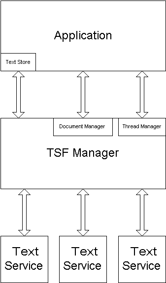

# TSF in WinUI3

## Table of Contents

- [Background](#background)
- [Status of TSF versions](#status-of-tsf-versions)
- [TSF configuration for WinUI3](#tsf-configuration-for-winui3)

## Background

The Text Services Framework (TSF) is a system for text input.
The TSF manager sits between the application (aka client) and text services.
Examples of text services are language input methods.

Xaml applications are TSF clients, most of the implementation for which
is in the Win32 RichEdit control that's used by TextBox/PasswordBox/RichEditBox.
(The "RichEdit" control is a non-Xaml control, used by the Xaml text editing controls,
also used by the Win32 EDIT controls. In Windows it's msftedit.dll, in WinUI3 it's WinUIEdit.dll.)

From the [TSF Architecture page](https://docs.microsoft.com/en-us/windows/win32/tsf/architecture):

For example, if you have a TextBox in a Xaml app and are typing with a US keyboard into it using a Japanese input method (text service):
* The actual text is stored in the Xaml app, in the RichEdit control, but the TSF manager and the input method are providing the text.
* As you type in English characters, the input method is showing a popup window with possible (Japanese) completions
* Also as you type, the input method is updating the text store with English characters, then removing those characters and replacing them with Japanese.

The touch keyboard ("SIP") is another example of a text service.

RichEdit allows for all of these services by being a TSF client. A Xaml application gets all of this by simply using a TextBox or other text edit control.

If a Xaml application uses a PasswordBox, the PasswordBox control configures the RichEdit control's TSF document to be used for a password. The TSF manager then knows to show all text as a "*" rather than its actual character.

If an application configures a TextBox to be numeric only (using the [TextBox.InputScope](https://docs.microsoft.com/uwp/api/Windows.UI.Xaml.Controls.TextBox.InputScope) property), the TSF document is configured to be numeric, and the touch keyboard (a TSF text service) responds by hiding the non-numeric keys.

## Status of TSF versions

There are two versions of TSF: TSF1 and TSF3. (TSF2 was used on Windows Phone). Different versions of TSF are supported in different places at different times:
* TSF3 in UWP requires RS3, although Xaml didn't switch to it until RS4, and to get there some bug fixes were required in TSF3. So for Xaml purposes TSF3 really requires RS4.
* TSF3 support is available for Desktop (Win32) apps starting in 19h1.
* TSF1 is not supported in UWP apps (until Mn?).
* Aneheim (Chromium-based Edge and WebView2) only supports TSF1.

TSF1 isn't officially supported  in UWP on previous OS versions. Much of it actually does work, but in prototyping it caused several Xaml regressions (for example PasswordBox doesn't receive input).

TSF3, on the other hand, isn't supported in Desktop applications. Again, it significantly works, but it relies on availability of a [CoreDispatcher](https://docs.microsoft.com/uwp/api/Windows.UI.Core.CoreDispatcher),
which doesn't exist in Desktop applications prior to 19h1 (also in RS5 but that was a Preview mode, so might not be reliable).

## TSF configuration for WinUI3

To balance all of these restrictions, TSF will be configured as follows for WinUI3:
* **TSF1** for Xaml text input controls in Desktop apps, to avoid the issue of TSF3 relying on CoreDispatcher.
* **TSF3** for Xaml text input controls in UWP apps, since that's the only version of TSF supported for all target versions of WinUI3.
* **TSF1** for the WebView2 control, which is a requirement for Chromium. 
Note that this means that a UWP app can have both TSF3 and TSF1 running.
(The TSF1 client for WebView2 runs in the Xaml process and forwards calls to the Anaheim process.)

> Note the risk that WebView2 will encounter an issue with TSF1 in UWP apps.

The option not being taken is to make updates to TSF1 to better support UWP, and service it to previous Windows versions, down to RS4. Servicing is difficult and expensive and unreliable, and there's insufficient motivation to chose that over the above configuration.

