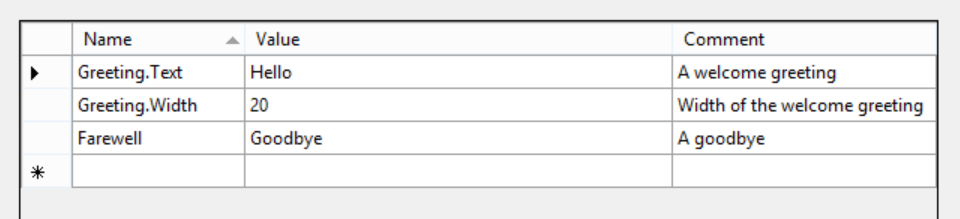

# Unpackaged Windows App SDK apps

## Table of Contents

- [Background](#background)
- [Terminology](#terminology)
- [Objective](#objective)
- [Activating Windows App SDK classes in an unpackaged app](#activating-windows-app-sdk-classes-in-an-unpackaged-app)
  - [Deploying Windows App SDK as a framework package](#deploying-windows-app-sdk-as-a-framework-package)
    - [Details: deploying Windows App SDK as a framework package](#details-deploying-windows-app-sdk-as-a-framework-package)
    - [Details about calling MddBootstrapInitialize](#details-about-calling-mddbootstrapinitialize)
  - [Deploying WindowsApp SDK AppLocal](#deploying-windowsapp-sdk-applocal)
    - [Registration-free activation of WinRT types](#registration-free-activation-of-winrt-types)
    - [Manifest-free activation of WinRT types](#manifest-free-activation-of-winrt-types)
    - [Details: deploying Windows App SDK AppLocal](#details-deploying-windows-app-sdk-applocal)
- [Resources](#resources)
  - [Resources details](#resources-details)
- [CRT](#crt)
  - [CRT details](#crt-details)

## Background

A _packaged_ Windows app, aka an MSIX app, is an app that's been zipped up into an .msix (or .appx) file.
([More info](https://docs.microsoft.com/en-us/windows/msix/overview))

Inside that file are the app's binaries and resources etc, plus a manifest file. After you
[create your packaged app](https://docs.microsoft.com/en-us/windows/msix/package/packaging-uwp-apps)
you can either upload it to the Store and install from there,
or you can double-click to sideload install it (once you've installed the
[App Installer](https://www.microsoft.com/en-us/p/app-installer/9nblggh4nns1?activetab=pivot:overviewtab)).

The app gets installed to a system location on the disk (not the User directory).
It shows up in the Start menu, shows up in Settings (can be uninstalled from there),
shows up in Powershell (`get-appxpackage *myapp*`), etc.

Packaged apps can take dependencies on Framework Packages, such as Windows App SDK and VCLibs.

All UWP apps are packaged apps, but not the reverse;
any app can be made into a packaged app but that doesn't mean it's UWP.
MSIX supports multiple types of activation: UWP, Desktop Bridge (aka Centennial), Win32 and more.

An _unpackaged_ Windows app is a traditional .exe file. Maybe you run it just by double-clicking on it,
maybe you install it with an MSI or setup.exe.
A typical WPF or WinForms app is an unpackaged app, unless you take extra steps to package it.

Unpackaged apps haven't been able to take a dependency on a Framework Package, such as Windows App SDK.
But in Windows App SDK 1.0 an
[unpackaged app can use a framework package](https://github.com/microsoft/WindowsAppSDK/blob/main/specs/dynamicdependencies/DynamicDependencies.md).

Unpackaged apps will use this to still get Windows App SDK as a framework package. Typically:

* An unpackaged app's installer installs Windows App SDK
  * The installer can use use WindowsAppSDKInstaller.exe to install Windows App SDK,
    or directly install Windows App SDK's MSIX's (via 
    [PackageManager](https://docs.microsoft.com/uwp/api/Windows.Management.Deployment.PackageManager)
    APIs) as preferred.
* When the app runs it calls `MddBootstrapInitialize()` to make Windows App SDK's APIs available to the process,
  and to indicate Windows App SDK is in use so it doesn't get serviced out from under the app.

## Terminology

**AppLocal**

AppLocal means that an unpackaged application carries all the parts of the Windows App SDK along with itself during installation,
and puts those components alongside its main application binaries in a way compatible with the mechanisms described here.
Components deployed AppLocal are usable only by the components of the app that carried it.
If, for instance, you have multiple parts within a single deployment,
you may need to do additional work to ensure those parts can access your AppLocal copy.

## Objective

Allow an unpackaged app to use Windows App SDK.

Non goals:

* For 1.0 timeframe: AppLocal deploy of Windows App SDK
  * This scenario is described here but will be post 1.0.
* APIs that require identity that's provided by the packaging architecture
  ([more info)](https://docs.microsoft.com/en-us/windows/apps/desktop/modernize/desktop-to-uwp-supported-api#apis-that-require-package-identity)).
* APIs that assume a system-wide singleton shared between a user's running apps
  (aka the Windows App SDK 'Main' package).

## Activating Windows App SDK classes in an unpackaged app

The WinRT class activation mechanism works differently for an unpackaged app.
"Class activation" means creating an instance of a class (as in: `new Button()`),
or calling one of its static members (as in: `PointerPoint.GetCurrentPoint()`).

The WinRT API to activate a class or call a static member starts with some form of the
[RoGetActivationFactory](https://docs.microsoft.com/en-us/windows/win32/api/roapi/nf-roapi-rogetactivationfactory)
or related API.
That API takes the class name as a string parameter, for example "`Microsoft.UI.Xaml.Controls.Button`".
Given that string it needs to find the DLL with that class' factory implementation.
`RoGetActivationFactory` can find that DLL in a packaged app,
because the package has an AppxManifest file in it,
which has a list of all the WinRT classes and what DLL they're in.
Framework packages, such as Windows App SDK, similarly have an AppxManifest,
so `RoGetActivationFactory` still knows what to do.

Supporting Windows App SDK class activation in unpackaged apps, where there is no AppxManifest, comes in two scenarios:
* Windows App SDK is deployed as a framework package (default)
* Windows App SDK is AppLocal deployed

(This focuses on activation of Windows App SDK classes, but Windows App SDK isn't special;
other framework packages can do what Windows App SDK is doing.)

### Deploying Windows App SDK as a framework package

[Spec](https://github.com/microsoft/WindowsAppSDK/blob/main/specs/dynamicdependencies/DynamicDependencies.md)

For an unpackaged app to use Windows App SDK as a framework package,
so that it can have better perf and automatic servicing,
first it has to install Windows App SDK.
It can do this by calling the WindowsAppSDKInstaller.exe from its app install,
for example the app's setup.exe.

Then every time the app starts, in order to be able to activate Windows App SDK classes,
the app calls the `MddBootstrapInitialize()` C API on startup.

This solves the class activation problem because 
* The `MddBootstrapInitialize()` call makes Windows App SDK available to the app
* Windows App SDK, like all framework packages, has an AppxManifest

This system is all the same if the unpackaged app wants to activate a non-Windows App SDK (3rd party) class
which is part of a framework package.
To make the 3rd party framework package available to the app,
the framework would need to provide its own equivalent to `MddBootstrapInitialize`,
using the same public APIs internally.
Or the app could manually do this work.

To activate WinRT classes from outside of Windows App SDK - and not installed as a framework package -
see the below AppLocal case (the 3rd party type is AppLocal).

#### Details: deploying Windows App SDK as a framework package

* DynDep will provide
  * WindowsAppSDKInstaller.exe
  * `MddBootstrapInitialize` API as part of the WindowsAppSDK.Foundation package
  * For C++, props/targets that will add the include path to the compiler options
    and the lib path to the linker options
  * For C#, a managed wrapper assembly for the C API.
* Build targets will add initialization code to the app project to make the call
  to `MddBootstrapInitialize` (more details below this list).
* VS diagnostics updates
  * Need to do some prototyping to understand the necessary tooling work.
    (During debugging of a WinUI app, VS is known to use some APIs that don't work in an unpackaged app.)
* To build an unpackaged WinAppSDK app, use the new (1.0) "single-project" build tooling
  * This is enabled by setting a property currently named `EnableMsixTooling`.
    One thing this tooling does is allow you to build a _packaged_ app with a single-project solution.
    (Prior to 0.8 you neeeded two projects: the app project and the
    [Windows Application Packaging (WAP) project](https://docs.microsoft.com/en-us/windows/msix/desktop/desktop-to-uwp-packaging-dot-net#:~:text=%20Setup%20the%20Windows%20Application%20Packaging%20Project%20in,make%20sure%20to%20set%20the%20Minimum...%20More%20).)
  * For an unpackaged app, set the `WindowsPackageType` project property to `None`.
    For now this will be a manual step, but later there will be a UI for the experience using
    [CPS rules](https://github.com/microsoft/VSProjectSystem/blob/master/doc/extensibility/property_pages.md).


#### Details about calling MddBootstrapInitialize

`MdBootstrapInitialize` needs to be called on app startup before any attempt is made to call
an API in the Windows App SDK.

Windows App SDK will doe this  build targets that generate code in the form of module initializers for the app.
For C# this is done using the
[module initializer attribute](https://docs.microsoft.com/en-us/dotnet/csharp/language-reference/proposals/csharp-9.0/module-initializers),
for C++ this is using a static module member with an initializer.

C# example:

```csharp
using System.Runtime.CompilerServices;
class MddInitializer
{
    [ModuleInitializer]
    internal static void Initialize()
    {
        MddBootstrapInitialize();
    }
}
```

C++ example:

```cpp
static struct MddInitializer
{
  MddInitializer()
  { 
    MddBootstrapInitialize(...); 
  }
} _MddInitializer;
```

Both of these will execute the `MddBootstrapInitialize` call before the app `Main` runs.
They won't run under the loader lock; for C++ the loader lock applies to DLLs, not EXEs.

These auto-generated files can be disabled by setting the `WindowsAppSdkEnableMdd` project property to `false`.

**Alternative approach (rejected)**

Another way to get this method called would be to put it into the `Main` function of a WinUI app.
`Main` is code that's generated automatically as part of the XamlCompiler:

```cs
public static class Program
{
    [global::System.CodeDom.Compiler.GeneratedCodeAttribute("Microsoft.UI.Xaml.Markup.Compiler"," 0.0.0.0")]
    [global::System.Diagnostics.DebuggerNonUserCodeAttribute()]
    [global::System.STAThreadAttribute]
    static void Main(string[] args)
    {
        // vvv
        MmdBootstrapInitialize();
        // ^^^

        global::WinRT.ComWrappersSupport.InitializeComWrappers();
        global::Microsoft.UI.Xaml.Application.Start((p) => {
            var context = new global::Microsoft.UI.Dispatching.DispatcherQueueSynchronizationContext(global::Microsoft.UI.Dispatching.DispatcherQueue.GetForCurrentThread());
            global::System.Threading.SynchronizationContext.SetSynchronizationContext(context);
            new App();
        });
    }
}
```

The problem with this is that it would be a WinUI-only solution.

**Implementation details**

We'll make the `WindowsPackageType` available to the build task to pass to the XamlCompiler (see 'PriInitialPath' for precedence).
The XamlCompiler won't add the new line if it's `None`.
(It also won't add the line for an AppLocal deploy of Windows App SDK, indicated by the `WindowsAppSDKInApp` property.)

### Deploying WindowsApp SDK AppLocal

As mentioned above, when activating a class from a framework package,
the framework package provides the AppxManifest, whether the app is packaged or unpackaged.
Therefore activation is different when Windows App SDK is deployed _not_ as a framework package
but as part of the app.

When a _packaged_ app deploys Windows App SDK or any WinRT DLL AppLocal,
part of the app build process it to create an AppxManifest for the app, which includes all DLLs.
So AppLocal deploy of Windows App SDK with a packaged app means that all of Windows App SDK's activatable classes
are listed in the app's AppxManifest.

When an _unpackaged_ app AppLocal deploys Windows App SDK, the app doesn't have an AppxManfest.
There are then two ways to activate the types:
RegFreeWinRT or manfest-free activation.

#### Registration-free activation of WinRT types

In addition to the AppxManifest used in packaged apps and framework packages, there is also the 
[Fusion manifest](https://docs.microsoft.com/en-us/windows/win32/sbscs/application-manifests),
aka side-by-side or SxS manifest.
Also aka and formally called an 'Application Manifest', but that's confusing in the world of AppX and its AppxManifest.xml.
For clartity purposes we'll use the common 'Fusion' term for the underlying technology.
Fusion is available on Desktop and Server SKUs, not XBox or Hololens,
for downlevel versions of Windows low enough for all of Windows App SDK (Win7?).

`RoGetActivationFactory` knows how to use a Fusion manifest, starting in Windows 19h1 (Vb).
This is called "Registration-Free WinRT" (RegFreeWinRT).

More info:
[Enhancing Non-packaged Desktop Apps using Windows Runtime Components](https://blogs.windows.com/windowsdeveloper/2019/04/30/enhancing-non-packaged-desktop-apps-using-windows-runtime-components/)

#### Manifest-free activation of WinRT types

`RoGetActivationFactory` and similar APIs use a manifest to find the DLL that holds the 
implementation of a class, then it calls `DLLGetActivationFactory` exported by that DLL.
You don't need a manifest if you have some other way of finding out what the DLL is.

When you `new` a WinRT type in C# or C++, the C#/WinRT or C++/WinRT projection internally
calls `RoGetActivationFactory`.
If that doesn't work, they follow an algorithm of probing for the DLL based on its name.
For example to find the class named `Acme.Controls.Widget`,
look for a DLL named `Acme.Controls.Widget.dll`, then `Acme.Controls.dll`, etc.
([C#/WinRT code](https://github.com/microsoft/CsWinRT/blob/ad6adcb997b40cea649cf4156451316e714bc3ea/src/cswinrt/strings/WinRT.cs#L269),
[C++/WinRT code](https://github.com/microsoft/cppwinrt/blob/464e59198c2046125d8ee5a8cc6ff1739097345f/strings/base_activation.h#L29)).

#### Details: deploying Windows App SDK AppLocal

* Create a Fusion manifest for all Windows App SDK types
  * The manifests will be part of each feeder's transport package,
    then the aggregate pipeline will put them together.
  * Detailed spec forthcoming
* Support for RegFreeWinRT on RS5 using (using Detours)
* TBD: allow a 3rd party WinRT component to ship its own Fusion manifest
  * mt.exe does the work to merge manifests, might require some build targets in Reunion to find them in the component package?

These are both for providing application (sxs) manifest & msbuild support for AppLocal deployment.

(WinUI3 currently has some initial support
in the project tooling to generate a Fusion manifest for WinUI's types.
The above will do this at the all-Windows App SDK level.)

## Resources

For a packaged app, resources, aka "MRT Resources", aka
[ResourceManager](https://learn.microsoft.com/en-us/uwp/api/Windows.ApplicationModel.Resources.Core.ResourceManager),
are combined at build time to a single PRI file,
and put during deployment to a well known location in the app's package directory (a file named `resources.pri`).
Strings, images, and the compiled Xaml file (.xbf) are stored in the PRI.

> Consider for future: search the whole package graph, not just the Main package.
Both for the packaged case and the unpackaged case.
(An unpackaged app can still have a package graph due to dynamic dependencies and Sparse packages.)

Xaml markup can also reference MRT resources, which is used for localization using the 
[x:Uid](https://docs.microsoft.com/en-us/dotnet/desktop/xaml-services/xuid-directive)
feature.
([More info](https://docs.microsoft.com/en-us/windows/uwp/app-resources/localize-strings-ui-manifest))

For example, this markup

```xml
<TextBlock x:Uid="Greeting"/>
```

and this resw file (shown here in VS)



will cause the Xaml loader to set the `TextBlock.Text` property to "Hello".

Another resource-related feature in packaged apps is the app's list of supported languages in the Appx manfifest
([more info](https://docs.microsoft.com/en-us/windows/apps/design/globalizing/manage-language-and-region)).
At runtime, when the MRT is determining the language to use, it compares the app language list with the list specified by the user.
(The user specifies this in the Settings app, and it's exposed with the 
[ApplicationLanguages.Languages](https://docs.microsoft.com/uwp/api/Windows.Globalization.ApplicationLanguages.Languages)
API.)

You can reference resources in a URI syntax using the 
[`ms-resource`](https://docs.microsoft.com/en-us/windows/uwp/app-resources/uri-schemes#ms-resource)
scheme. Related schemes:
* [`ms-appx`](https://docs.microsoft.com/en-us/windows/uwp/app-resources/uri-schemes#ms-appx-and-ms-appx-web)
  is actually translated (by Xaml, also by AppxManfest?) into an `ms-resource` scheme.
  If that's not found it looks into the package's deployment directory for the resource.
* [`ms-appdata`](https://docs.microsoft.com/en-us/windows/uwp/app-resources/uri-schemes#ms-appdata)
  is a reference to the application data that's also exposed by the 
  [ApplicationData](https://docs.microsoft.com/uwp/api/Windows.Storage.ApplicationData) API.

### Resources details

* Since there is no app language list for an unpackaged app,
  the MRT will probe the app's resources to see if it can find a language.
  (If there is no user language list, the display language will be used.)
* The new
  [ResourceManager.ResourceManager ()](https://docs.microsoft.com/uwp/api/Microsoft.ApplicationModel.Resources.ResourceManager.-ctor)
  constructor will locate the PRI file by naming convention.
  * The app is responsible for putting the one PRI file into the same directory as the EXE.
    It must be named `resources.pri` or `[module name].pri`.
  * Xaml will use the new `ResourceManager()` constructor to 
* Xaml will move all code to WAS MRT (it currently uses both system MRT and Windows App SDK MRT).
* The 
  [`ms-appdata`](https://docs.microsoft.com/en-us/windows/uwp/app-resources/uri-schemes#ms-appdata)
  scheme will not be supported for unpackaged apps, just as the
  [ApplicationData](https://docs.microsoft.com/uwp/api/Windows.Storage.ApplicationData)
  API is not supported.
* The
  [`ms-appx`](https://docs.microsoft.com/en-us/windows/uwp/app-resources/uri-schemes#ms-appx-and-ms-appx-web)
  scheme _will_ still be supported.
  It will continue to attempt to find the resource by translating to `ms-resource`.
  If that's not found, since the app has no deployment directory, it will search the app's module path,
  the same as the location of the `resources.pri` file.
* Just like a packaged app, in an unpackaged app there are build targets that merge PRI files into 
  a single `resources.pri` file.
  * The typical case is a PRI file for the app and PRI files for components that it uses.
  * This is enabled by the `EnableMsixTooling` project property described earlier.

(MRT work: MUXC.dll uses System MRT. It should be using Lifted MRT (MRTCore))

## CRT

C++ code needs some form of the CRT (C++ Runtime).
C# apps don't necessarily need the CRT, for example in a WPF or WinForms app, because they have no C++.
But C# apps that use C++ components, such as Windows App SDK, _do_ need the CRT.

There's a version of the CRT named VCLibs that is a framework package in the Store.
So a packaged app can resolve the CRT dependency with a framework package reference.
System Xaml apps use VCLibs. This is also the behavior in Windows App SDK 0.5 and 0.8.

When you build a WinUI app (using the props/targets that come from the Windows App SDK nuget package),
part of the build process creates your AppxManifest,
and that includes a references to the VCLibs framework package.
When building an _unpackaged_ app that's not going to happen; there is no AppxManifest.

One possibility is to rely on the app to provide a CRT using the VCRedist(ributable).
An issue with that is the complexity being placed on the app.
Another issue is ensuring that the versions line up,
between what the C++ components each expect and what the app provides.

[More info on the CRT](https://docs.microsoft.com/en-us/cpp/c-runtime-library/crt-library-features?view=msvc-160&viewFallbackFrom=vs-2019#c-run-time-libraries-crt)

### CRT details

All Windows App SDK components will use the Hybrid CRT model:
* Use the UCRT (Universal CRT) as a DLL. This ships with (or is serviced to) the OS back to Win7,
  and provides the most fundamental and stable layer of the CRT.
* Statically link the rest of the CRT: msvcrt.lib and vcruntime.lib

For more information see
[Use the Universal C Runtime](https://github.com/microsoft/WindowsAppSDK/pull/888).

Components using any amount of the static CRT means some amount of duplication per DLL.
This is expected to be small.
A future optimization though would be to add a component to Windows App SDK with an internal
DLL with the remainder of the static portions of the CRT.
This DLL could be used by all components of Windows App SDK and ensure only one copy in reference set.
