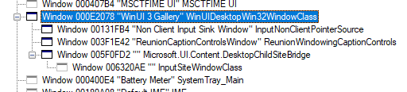

# Xaml Islands Overview

A **Xaml Island** is a chunk of Xaml content hosted in a different UI framework.

The main APIs are:
* **XamlIsland**, a new API in WinAppSDK 1.7 (2025 March).
* **DesktopWindowXamlSource**, available in System Xaml in 2019 and WinAppSDK 1.4.  

In WinUI3, **XamlIsland** will replace **DesktopWindowXamlSource**.

Click on a topic to dig in further:

* Why Xaml Islands?
* [xaml-islands](xaml-islands.md) - A working document that describes a bunch of the XamlIslands-related work
over time and some thoughts about the future.
* [desktopwindowxamlsource](desktopwindowxamlsource.md) - API spec for the `DesktopWindowXamlSource` type.
* [xaml-island-type](xaml-island-type.md) - API spec for the `XamlIsland` API.
* Information about the Xaml app model and lifetime:
  * [startup-overview](../startup-overview.md) 
  * [xaml-shutdown](../xaml-shutdown.md) 
  * [xaml-islands-and-dispatcher-queue](./xaml-islands-and-dispatcherqueue.md)

### Spy++ tree
It can be enlightening to use the Spy++ tool (public tool) to look at the HWND tree of a Xaml app.
Here's what WinUI Gallery looks like in Spy++:

Only the highlighed "WinUIDesktopWin32WindowClass" is created and owned by the Xaml runtime (see DesktopWindowImpl.cpp).
The others are created and owned by components lower in the stack (the titles and class names give you good clues about
where they come from and how to find that code).

### Further Reading

* Bridges -- A bridge is a sort of wrapper for a Site. The API surface typically has "SiteBridges", as in DesktopChildSiteBridge.
Note when you see "Desktop", that means "HWND", and so "DesktopChild" means "child HWND".  So "DesktopChildSiteBridge" means you're going to set up a ContentSite.
that's connected to a child HWND.
* Input -- divide up into categories:
  * Spatial input (mouse and touch).  Touch gets into DirectManipulation, which helps Xaml respond to touch input without waiting for the UI thread, and InteractionTracker, which helps Xaml recognize gestures like Tapped.
  * Keyboard (app is capturing specific keystrokes)
  * Text (user is typing text, generally into some kind of text box)
* ChildSiteLink -- A ChildSiteLink is an API that lets you host a ContentIsland inside another ContentIsland.
* How is this better than child HWNDs? -- It's possible to animate them and to synchronize commits, for example.  It also allows for hosting in scenarios
where HWNDs aren't available.
* Cross-proc? -- The islands APIs don't yet support this.
* Accelerators -- See [xaml-islands](xaml-islands.md)
* Access Key -- See [xaml-islands](xaml-islands.md)
* message pumps -- Same as "message loop".  A windows programming concept going back to Windows 3.0 (or earlier?).  See [docs](https://learn.microsoft.com/en-us/windows/win32/learnwin32/window-messages)
* UIA providers -- See [uia](../Uia.md)
* Code walk through for:
  * Island APIs
  * Navigate focus
  * Tab focus
* How to look at a WinUI3 app in spyxx -- what do the windows do?
* WindowsXamlHost and WindowsXamlHostWrapper - these are test class helpers that wrap DesktopWindowXamlSource
  * This repo has copies of WindowsXamlHost.cs for the community toolkit.  It versions for WPF and Forms.
* AppWindow: Xaml creates the top-level HWND, and then AppWindow subclasses the wndproc, so AppWindow will see
the messages first.

