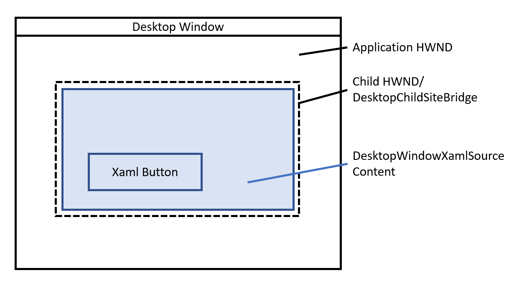
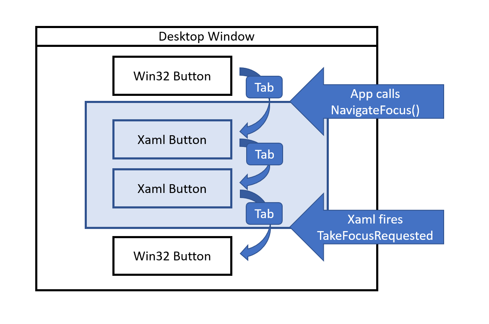

DesktopWindowXamlSource API spec
===

# Background

**This is the reviewed API spec for DesktopWindowXamlSource (with some updates for accuracy).  It was made public for WinAppSDK 1.4.**

We created System Xaml as a part of Windows 8, and at that time we only allowed it to run in a UWP context.  In the 19h1 timeframe, we
introduced "Xaml Islands" to System Xaml.  Xaml Islands a set of APIs that allows win32 apps to host Xaml content in a desktop
(non-UWP) application by attaching Xaml content to an HWND. 

The Xaml Island APIs have been in WinAppSDK and since its inception, but we've kept them marked as experimental.  As of
WinAppSDK 1.3, the only supported way to use WinAppSDK Xaml is in a "WinUI 3 Desktop app".

# Conceptual pages (How To)

The **DesktopWindowXamlSource** class allows you to put a fragment of Xaml content in your Win32 desktop application.

When you use **DesktopWindowXamlSource**, the WinAppSDK runtime will create an HWND as a child of your app's HWND.  
The **DesktopWindowXamlSource**'s content will be hosted in that child HWND.  It creates a **DesktopChildSiteBridge**,
which is the component that creates and manages the hosting child HWND.




Here's how you can use **DesktopWindowXamlSource** to display Xaml text on an HWND:

```c++
DesktopWindowXamlSource desktopWindowXamlSource {nullptr};

void ShowXamlInWindow(HWND appHwnd) 
{
  desktopWindowXamlSource = DesktopWindowXamlSource{};
  WindowId mainWindowId = ::GetWindowIdFromWindow(appHwnd);
  auto siteBridge = desktopWindowXamlSource.Initialize(mainWindowId);

  TextBlock textBlock;
  textBlock.Text(L"Hello, world!");

  desktopWindowXamlSource.Content(textBlock);

  RectInt32 rect {10, 10, 400, 400};
  siteBridge.MoveAndResize(rect);
}
```

### Starting and Shutting Down the Xaml Framework
If you attempt to create or use most Xaml objects on a thread where the Xaml framework isn't running, you'll get
a "wrong thread" error.

To start the Xaml framework on a given thread:
1. Create and start a **DispatcherQueue**.
2. On the **DispatcherQueue** thread, create a **DesktopWindowXamlSource** or call **WindowsXamlManager.InitializeForCurrentThread**.

To shut down the Xaml framework on a given thread:
1. Shut down the **DispatcherQueue** on that thread.  (You can do this by calling **DispatcherQueueController.ShutdownQueue**).

When a **DispatcherQueue** is shutting down, the best time to clean up your own objects is when the
**DispatcherQueue.ShutdownStarting** event is raised.  Xaml won't be shut down yet at this point.
After this event is raised and any remaining work in the **DispatcherQueue** is processed, the Xaml
framework will finish any of its remaining work and shut down on that thread.

The Xaml framework doesn't support being restarted.  Once the Xaml framework is shut down on all threads on which
it was running, it can't be started up again in that process.

### Using a custom Xaml Application object with DesktopWindowXamlSource
You may want to subclass the **Microsoft.UI.Xaml.Application** object to customize important aspects of your application
(you'll need to do this to use controls implemented in Microsoft.UI.Xaml.Controls.dll, for example). When you use your
own Application object, you'll need to create this object before starting the Xaml framework in the process. It's
important to create a **WindowsXamlManager** object in your custom Application object's constructor.  After it's
successfully constructed, you can create and use **DesktopWindowXamlSource** objects.

Only one **Application** object is allowed in a process, so all components using Xaml in a process will share the
first **Application** object created.

# API Pages

## DesktopWindowXamlSource class
_System Xaml DesktopWindowXamlSource documentation is [here](https://learn.microsoft.com/en-us/uwp/api/windows.ui.xaml.hosting.desktopwindowxamlsource?view=winrt-22621)._

Enables a win32 (non-UWP) application to host Xaml content in a child HWND.

## Samples

Public Samples:
* "SimpleIslandApp"
  * https://learn.microsoft.com/en-us/samples/microsoft/windowsappsdk-samples/simpleislandapp/
  * https://github.com/microsoft/windowsappsdk-samples/tree/main/Samples/Islands

### Constructors
| Name | Description |
|-|-|
| DesktopWindowXamlSource | Initializes a new instace of the DesktopWindowXamlSource class. |

### Properties
| Name | Description |
|-|-|
| Content | Gets or sets the Xaml content to be hosted by the DesktopWindowXamlSource. |
| HasFocus | Returns true if the child HWND associated with the DesktopWindowXamlSource currently has focus. |
| SiteBridge | Gets the SiteBridge associated with the DesktopWindowXamlSource, created when Initialize() is called.  Returns null if Initialize() has not been called. |
| SystemBackdrop | Gets or sets the SystemBackdrop for the DesktopWindowXamlSoruce. |

### Methods
| Name | Description |
|-|-|
| Initialize(WindowId) | Creates a DesktopChildSiteBridge object that attaches the DesktopWindowXamlSource to a given WindowId. |
| NavigateFocus(XamlSourceFocusNavigationRequest) | Tells the DesktopWindowXamlSource it should take win32 focus with a description of the nature of the focus change.  For example, when the user presses the tab key and you want to move focus to the Xaml content, call this method. |

### Events
| Name | Description |
|-|-|
| GotFocus | Raised when the DeskopWindowXamlSource has received win32 focus.  |
| TakeFocusRequested | Raised when Xaml requests that your app take focus from the DesktopWindowXamlSource.  For example, it's raised when the last tab stop in the Xaml content has focus and the user presses the tab key. |

### Remarks
Before creating a **DesktopWindowXamlSource**, a **DispatcherQueue** must already be running on the current thread.

When you create a DesktopWindowXamlSource, it will ensure Xaml framework is running on the current thread.  (To create most Xaml
objects, the Xaml framework must already be running on the thread.)

#### DesktopWindowXamlSource Focus APIs
You may want to allow the user to tab (and shift-tab) between the Xaml content and other controls in your app.  Call the 
**NavigateFocus** method to tell Xaml the user is moving focus to a Xaml control in the **DesktopWindowXamlSource**'s content.
Subscribe to the **TakeFocusRequested** event to be notified that the user is moving focus from the **DesktopWindowXamlSource**
content, and that focus should move to another control in your application.



If you call **DesktopWindowXamlSource.NavigateFocus()** with a XamlSourceFocusNavigationReason such as "First", and the
DesktopWindowXamlSource doesn't have any focusable content, the **TakeFocusRequested** event will be raised
synchronously during that call to NavigateFocus. In this case, the
**DesktopWindowXamlSourceTakeFocusRequestedEventArgs.Request** object will have the same **CorrelationId** as the one
you gave to the **NavigateFocus()** function.

To prevent possible infinite recursion, you may want to keep track of the **CorrelationId** you used for each call to
**NavigateFocus()**. When you handle a **TakeFocusRequested** event, you can test the CorrelationId to determine if the
navigation is one you initiated.  If it is, you can stop the recursion by calling **NavigateFocus()** with a
XamlSourceFocusNavigationReason of "Restore" and a new CorrelationId.  This will stop the navigation from propagating
further.  The code calling **NavigateFocus()** can detect this situation by noticing that the **WasFocusMoved** property
is false (because focus was not successfully moved for that navigation).  

#### APIs removed from WinAppSDK Xaml
The IDesktopWindowXamlSourceNative interface has been removed from WinAppSDK.  Below are the replacement APIs an
app can call to get the same behavior.

|Removed Xaml API|WinAppSDK Replacement|
|-|-|
|~~IDesktopWindowXamlSourceNative.AttachToWindow~~|Call DesktopWindowXamlSource.Initialize().|
|~~IDesktopWindowXamlSourceNative.get_WindowHandle~~|Query DesktopWindowXamlSource.SiteBridge.WindowId, and call GetWindowFromWindowId().|
|~~IDesktopWindowXamlSourceNative.PreTranslateMessage~~|Call ContentPreTranslateMessage in your message pump.|

## WindowsXamlManager class
_System WindowsXamlManager is documented [here](https://learn.microsoft.com/en-us/uwp/api/windows.ui.xaml.hosting.windowsxamlmanager?view=winrt-22621)_.

Represents the Xaml framework running on the thread, and allows you to control its lifetime.

### Methods
| Name | Description |
|-|-|
| InitializeForCurrentThread() | Initializes the Xaml framework on the curent thread. |

### Remarks
Before initializing a **WindowsXamlManager**, a **DispatcherQueue** must already be running on the current thread.

You can call **WindowsXamlManager.InitializeForCurrentThread** to ensure the Xaml framework is running on the current thread.
For more information about the Xaml framework's lifetime, see "Conceptual pages (How To)".

## XamlSourceFocusNavigationRequest class
_System XamlSourceFocusNavigationRequest is documented [here](https://learn.microsoft.com/en-us/uwp/api/windows.ui.xaml.hosting.xamlsourcefocusnavigationrequest?view=winrt-22621)._

Provides information about a request to give focus to a **DesktopWindowXamlSource** object.

### Constructors
|Name|Description|
|-|-|
|XamlSourceFocusNavigationRequest(XamlSourceFocusNavigationReason)|Initializes a new instance of the XamlSourceFocusNavigationRequest class with the reason for the navigation request.|
|XamlSourceFocusNavigationRequest(XamlSourceFocusNavigationReason, Rect)|Initializes a new instance of the XamlSourceFocusNavigationRequest class with the reason for the navigation request and the bounding rectangle for the element that is losing focus.|
|XamlSourceFocusNavigationRequest(XamlSourceFocusNavigationReason, Rect, Guid)|Initializes a new instance of the XamlSourceFocusNavigationRequest class with the reason for the navigation request, the bounding rectangle for the element that is losing focus, and the unique correlation ID for the request.|

### Properties
|Name|Description|
|-|-|
|CorrelationId|Gets the unique identifier for the navigation request. You can use this value for logging purposes, or if you have an existing correlation ID from an in-progress focus movement already in progress and you want to connect that focus movement with a new navigation request.  If you did not specify a correlation ID when constructing the object, the correlation ID will be set to a new, random GUID.|
|HintRect|Gets the bounding rectangle of the element in the desktop application that is losing focus (that is, the element that had focus before the DesktopWindowXamlSource received focus).|
|Reason	| Gets a XamlSourceFocusNavigationReason value that indicates the reason for the navigation request.|

## XamlSourceFocusNavigationResult class
_System XamlSourceFocusNavigationResult is documented [here](https://learn.microsoft.com/en-us/uwp/api/windows.ui.xaml.hosting.xamlsourcefocusnavigationresult?view=winrt-22621)_.

Provides data for a request to navigate focus to a **DesktopWindowXamlSource** object by using the **NavigateFocus** method.

### Constructors
|Name|Description|
|-|-|
|XamlSourceFocusNavigationResult(Boolean)|Initializes a new instance of the XamlSourceFocusNavigationResult class.|

### Properties
|Name|Description|
|-|-|
|WasFocusMoved|Gets a value that indicates whether the focus successfully moved to the DesktopWindowXamlSource object.|

## XamlRoot class
_The XamlRoot class already exists in WinAppSDK 1.3 and is docuemnted [here](https://learn.microsoft.com/en-us/windows/windows-app-sdk/api/winrt/microsoft.ui.xaml.xamlroot?view=windows-app-sdk-1.3).
See that documented for infomration about existing members._

Represents a tree of XAML content and information about the context in which it is hosted.

### Properties
|Name|Description|
|-|-|
|ContentEnvironment|Gets the ContentEnvrionment associated with this XamlRoot.  You can use this, for example, to get the WindowId of the top-level window.|

# API Details

The APIs are similar to the System Xaml versions of these APIs.  Apps migrating from System Xaml Islands to WinAppSDK
Xaml Islands can do so by changing very little code.

```c# (but really MIDL3)
namespace Microsoft.UI.Xaml.Hosting
{
  enum XamlSourceFocusNavigationReason
  {
    Programmatic,
    Restore,
    First = 3,
    Last,
    Left = 7,
    Up,
    Right,
    Down,
  }

  runtimeclass DesktopWindowXamlSource : Windows.Foundation.IClosable
  {
    // Constructors
    DesktopWindowXamlSource();

    // Properties
    Microsoft.UI.Xaml.UIElement Content;
    Microsoft.UI.Xaml.Media.SystemBackdrop SystemBackdrop;
    Microsoft.UI.Content.DesktopChildSiteBridge SiteBridge{ get; };
    Boolean HasFocus{ get; };

    // Methods
    Microsoft.UI.Content.DesktopChildSiteBridge Initialize(Microsoft.UI.WindowId parentWindowId);
    XamlSourceFocusNavigationResult NavigateFocus(XamlSourceFocusNavigationRequest request);

    // Events
    event Windows.Foundation.TypedEventHandler<
      DesktopWindowXamlSource,
      DesktopWindowXamlSourceTakeFocusRequestedEventArgs> 
        TakeFocusRequested;

    event Windows.Foundation.TypedEventHandler<
      DesktopWindowXamlSource,
      DesktopWindowXamlSourceGotFocusEventArgs>
        GotFocus;        
  }

  runtimeclass DesktopWindowXamlSourceGotFocusEventArgs
  {
    XamlSourceFocusNavigationRequest Request{ get; };
  }

  runtimeclass DesktopWindowXamlSourceTakeFocusRequestedEventArgs
  {
    XamlSourceFocusNavigationRequest Request{ get; };
  }

  runtimeclass XamlSourceFocusNavigationRequest
  {
    // Constructors
    XamlSourceFocusNavigationRequest(XamlSourceFocusNavigationReason reason);
    XamlSourceFocusNavigationRequest(XamlSourceFocusNavigationReason reason, Windows.Foundation.Rect hintRect);
    XamlSourceFocusNavigationRequest(
      XamlSourceFocusNavigationReason reason,
      Windows.Foundation.Rect hintRect,
      Guid correlationId);

    // Properties
    XamlSourceFocusNavigationReason Reason{ get; };
    Windows.Foundation.Rect HintRect{ get; };
    Guid CorrelationId{ get; };
  }

  runtimeclass XamlSourceFocusNavigationResult
  {
      XamlSourceFocusNavigationResult(Boolean focusMoved);
      Boolean WasFocusMoved{ get; };
  };

  runtimeclass WindowsXamlManager : Windows.Foundation.IClosable
  {
      static WindowsXamlManager InitializeForCurrentThread();
  };

  runtimeclass XamlRoot
  {
    // New:
    Microsoft.UI.Content.ContentIslandEnvironment ContentIslandEnvironment{ get; };
    
    // Existing:
    event Windows.Foundation.TypedEventHandler<XamlRoot,XamlRootChangedEventArgs> Changed;
    Microsoft.UI.Xaml.UIElement Content{ get; };
    Boolean IsHostVisible{ get; };
    Double RasterizationScale{ get; };
    Windows.Foundation.Size Size{ get; };
  };
}
```

