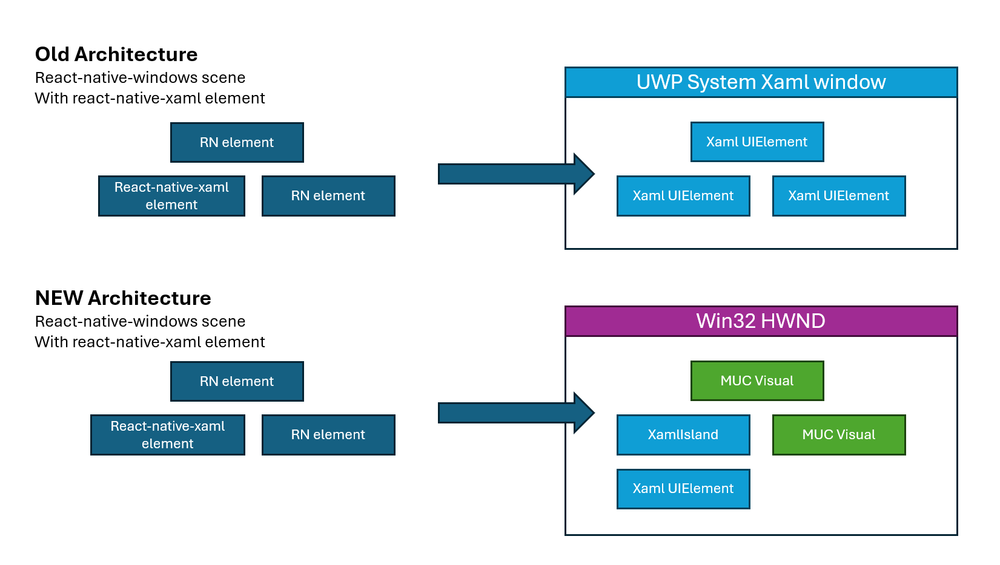

# React Native Windows and Xaml

## Table of Contents

- [What is React Native Windows?](#what-is-react-native-windows)
  - [React Native "Old Architecture" (Paper rendering)](#react-native-old-architecture-paper-rendering)
  - [React Native "New Architecture" (Fabric rendering)](#react-native-new-architecture-fabric-rendering)
  - [Who's using React Native Windows?](#whos-using-react-native-windows)


## What is React Native Windows?

Here's a brief sketch of the roadmap to React Native Windows:

| Framework | Description | Link |
|--|--|--|
| **React**               | React or "React JS" is a Javascript-based web-based framework created by Meta.                                                                                                                              | [react.dev](https://react.dev/)           |
| **React Native**        | React Native is built on the same ideas as React, but instead of rendering with HTML, it renders with primitives that look "at home" on their target OS. For example, if I use React Native to make an Android app, it will look more like an Android app -- not like a webpage. | [reactnative.dev](https://reactnative.dev/) |
| **React Native Windows**| React Native Windows is Microsoft's implementation of React Native for the Windows operating system.  Microsoft teams on both Windows and Office work with Meta to support their latest React Native releases on Windows.  |  [react-native-windows](https://microsoft.github.io/react-native-windows/) |

React Native Windows allows you to write an app in Javascript and JSX that 

JSX is a component that allows you to put Xml describing your UI inline in a Javascript or TypeScript app:

``` tsx
import React from 'react';
import {Text, View} from 'react-native';

const YourApp = () => {
  return (
    <View
      style={{
        flex: 1,
        justifyContent: 'center',
        alignItems: 'center',
      }}>
      <Text>Try editing me! 🎉</Text>
    </View>
  );
};

export default YourApp;
```

React Native Windows is currently working on a transition from what Meta calls the **Old Architecture** to the **New Architecture**.

### React Native "Old Architecture" (Paper rendering)

A React Native Windows "Old Architecture" app is a System Xaml UWP app.  RNW creates and arranges Xaml elements to implement
the scene under the covers.  

Mircosoft also created a **react-native-xaml** library that allows apps to create and use arbitrary
Xaml elements.


**React-Native-Xaml** allows RNW apps to put Xaml elements in their JSX files like this:

``` tsx
function App(): JSX.Element {
[isOpen, setIsOpen] = useState(false);

return (
<TextBox text="this is a textbox with a menuFlyout" foreground="red">
  <MenuFlyout isOpen={isOpen} onClosed={() => {
    setIsOpen(false);
    }} >
    <MenuFlyoutItem text="option 1" onClick={(x) => { alert(JSON.stringify(x.nativeEvent)); setOption("option 1"); }} />
    <MenuFlyoutItem text="option 2" onClick={() => { alert("clicked 2"); setOption("option 2"); }}/>
  </MenuFlyout>
</TextBox>)
}

```


### React Native "New Architecture" (Fabric rendering)

For the ["New Architecture"](https://reactnative.dev/architecture/landing-page), Meta made some changes that allows more work
to happen off-thread.  This doesn't work well with Xaml, which is highly thread-affinitive.  

So, for New Architecture apps, RNW uses Scene Graph Visuals for its UI rather than Xaml elements.

But, Xaml is still on the roadmap.  We think folks will want to use the more complex Xaml controls like CalendarView, MediaPlayer,
etc.

So, we're working to allowing apps to create Xaml elements and use Xaml Islands to host them inside their React Native Windows apps.

We're doing this by using [Windowless XamlIslands](./windowless-xaml-islands.md).  When RNW has a chunk of Xaml to display,
we're going to host it in a XamlIsland using a ChildSiteLink.

In the below demo example, the app is able to import the Xaml CalendarView control and use it along with the other React Native Xml
content:

``` tsx
import {CalendarView} from 'sample-custom-component';

const XamlContentExample = () => {
  const [selectedDate, setSelectedDate] = useState(true);

  return (
    <ScrollView>
      <View
        style={{
          margin: 20,
          flexDirection: 'column',
          gap: 5,
        }}>
        <Button
          title="Before Button"
          onPress={() => Alert.alert('Before button pressed')}
        />
        <Text>Xaml CalendarView control. Selected date: {selectedDate}</Text>
        <CalendarView
          style={{
            width: 400,
            height: 400,
            minWidth: 400,
            minHeight: 400,
          }}
          onSelectedDatesChanged={e => {
            setSelectedDate(e.nativeEvent.startDate);
          }}
        />
        <Button
          title="After Button"
          onPress={() => Alert.alert('After button pressed')}
        />
      </View>
    </ScrollView>
  );
};
```

We're currently working on extending **react-native-xaml** to work for New Architecture.

Here's a high-level picture of out the two architectures differ:



A few other notes:
* React Native Windows has a type called **ReactNativeIsland** that can be hosted in any site bridge (because it exposes a ContentIsland).
In the future, we expect Xaml to be able to host a ContentIsland, and so it should be able to host a ReactNativeIsland.
* Office is using a series of WASDK Scene Graph objects to attach a site bridge to their existing Win32 window.


### Who's using React Native Windows?
Some relevant React Native Windows customers
* Office.
* The Start Menu has a section that uses RNW.
* You can also look for Microsoft.ReactNative.dll to see what processes have it loaded (`tasklist -m Microsoft.ReactNative.dll`)

