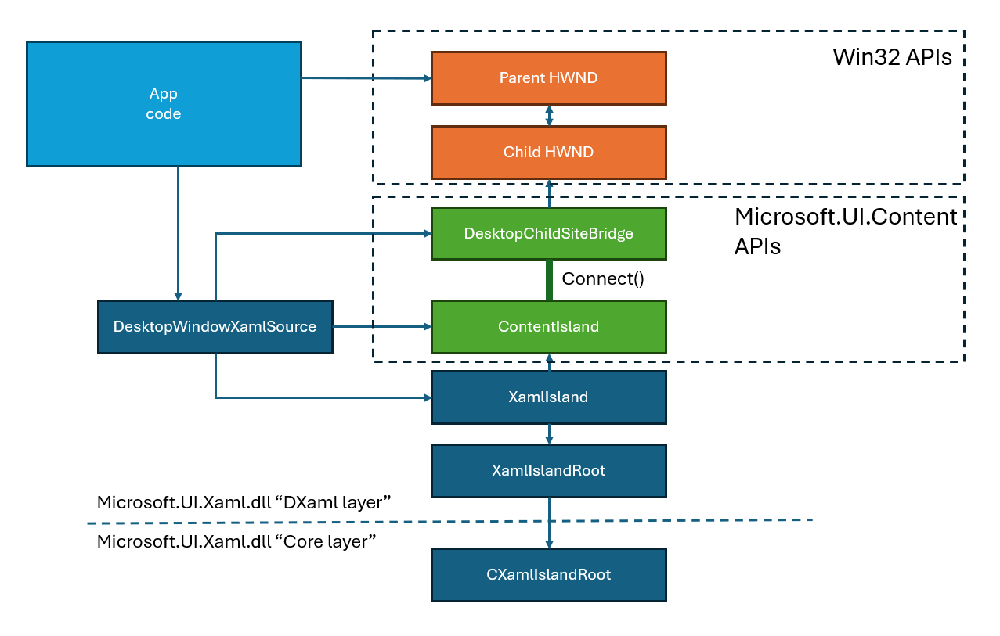
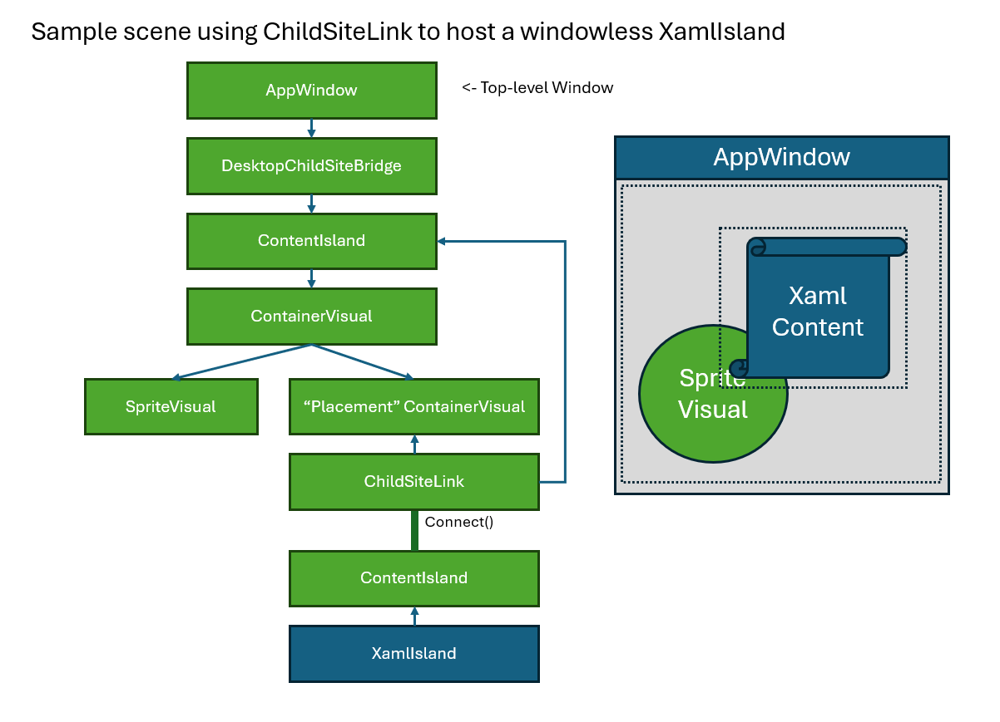

# Windowless XamlIslands

## Table of Contents

- [Backstory: From DesktopWindowXamlSource to XamlIsland](#backstory-from-desktopwindowxamlsource-to-xamlisland)
- [Can we do this without an HWND?  Enter: ChildSiteLink](#can-we-do-this-without-an-hwnd--enter-childsitelink)
  - [WindowlessXamlIslandTests](#windowlessxamlislandtests)
- [We're making changes to Xaml so it's less dependent on HWNDs](#were-making-changes-to-xaml-so-its-less-dependent-on-hwnds)

## Backstory: From DesktopWindowXamlSource to XamlIsland

At first, the only way to make a Xaml Island was to use the **DesktopWindowXamlSource** API.  This API is
specifically for connecting Xaml content to an HWND ("DesktopWindow" means "HWND" in WinRT API names).

But, we knew we eventually wanted islands to work without using an HWND at the island boundary.  For a 
while, we called this "VisualXamlSource", because this API would connect Xaml to a "Visual" instead of a
"DesktopWindow".  But we decided to just call it **XamlIsland**.

* **DesktopWindowXamlSource** is an API that lets you put Xaml into an HWND.
* **XamlIsland** is a _new_ API that lets you put Xaml into a **WinAppSDK Scene Graph**.

Wait, what's a **WinAppSDK Scene Graph**?  This is a term we're using to describe a tree of lifted Visuals and islands.

A "lifted Visual" is specifically a **Microsoft.UI.Composition.Visual**, and is only available in WindowsAppSDK.

Fun breakpoints:
```
In DesktopWindowXamlSource_partial.cpp:
  Microsoft_UI_Xaml!DirectUI::DesktopWindowXamlSource::InitializeImpl // Called by app to initialize
  Microsoft_UI_Xaml!DirectUI::DesktopWindowXamlSource::AttachToWindow // DWXS gets attached to HWND tree
  Microsoft_UI_Xaml!DirectUI::XamlIsland::Initialize // XamlIsland getting set up
  Microsoft_UI_Xaml!CXamlIslandRoot::InitializeCommon // XamlIsland's ContentIsland is created
```

* **XamlIsland** will eventually replace **DesktopWindowXamlSource** -- which can then be deprecated.

The idea is that XamlIsland can do everything a DesktopWindowXamlSource can do, so we won't really need
DesktopWindowXamlSource anymore.  DesktopWindowXamlSource connects Xaml content to HWNDs.  You can do
this with a XamlIsland by creating your own **DesktopChildSiteBridge**.

In fact, that's exactly what DesktopWindowXamlSource does:

``` cpp
_Check_return_ HRESULT DesktopWindowXamlSource::ConnectToHwndIslandSite(_In_ HWND parentHwnd)
{
    // Create / access composition island
    DirectUI::XamlIslandRoot* xamlIslandRoot = m_spXamlIslandRoot.Cast<XamlIslandRoot>();

    // Get the XamlIslandRoot
    CXamlIslandRoot* pXamlIslandCore = static_cast<CXamlIslandRoot*>(xamlIslandRoot->GetHandle());

    ctl::ComPtr<ixp::IDesktopChildSiteBridgeStatics> bridgeStatics;
    IFC_RETURN(ActivationFactoryCache::GetActivationFactoryCache()->GetDesktopChildSiteBridgeStatics(&bridgeStatics));

    DCompTreeHost* dcompTreeHost = pXamlIslandCore->GetDCompTreeHost();
    WUComp::ICompositor* compositor = dcompTreeHost->GetCompositor();
    FAIL_FAST_ASSERT(compositor);

    // Create DesktopChildSiteBridgeFactory
    ABI::Microsoft::UI::WindowId parentWindowId;
    IFC_RETURN(Windowing_GetWindowIdFromWindow(parentHwnd, &parentWindowId));
    IFC_RETURN(bridgeStatics->Create(
        compositor,
        parentWindowId,
        m_contentBridgeDW.ReleaseAndGetAddressOf()));
```

Here's a diagram of how DesktopWindowXamlSource uses a XamlIsland and a DesktopWindowSiteBridge to
do its job:



* The app owns the "parent HWND".  It might be the app's main window, for example.
* The app creates the DesktopWindowXamlSource and calls **Initialize**, passing in its HWND's WindowId.
* This causes the other objects to be created.

## Can we do this without an HWND?  Enter: ChildSiteLink

So, now that we have the XamlIsland API, we can certainly use it with a DesktopChildSiteBridge to host
Xaml in an HWND.  But we could already do that.  What else can we do?

* A "Windowless XamlIsland" (or "HWND-less XamlIsland") is a XamlIsland that's _not_ connected to a HWND-based object!
* We can use the new **ChildSiteLink** API to connect a XamlIsland to a lifted Visual.

A ChildSiteLink will connect three different objects:
* The parent ContentIsland that will be the host island,
* A "placement visual" that is a lifted Visual which is part of the parent ContentIsland's content tree,
* The child ContentIsland -- this is the one being hosted.

Here's how it might look in a diagram:



This app is displaying a lifted Sprite Visual and a XamlIsland, which will be placed at the same position as the
"placement Visual".  However we move the placement Visual around the scene graph, the XamlIsland goes with it.

> The AppWindow is a WindowsAppSDK type that wraps an HWND.  You can create and AppWindow and call Show on it
to make a new top-level window.  The AppWindow can _also_ wrap an existing HWND (Xaml does this in
DesktopWindowImpl -- see `DesktopWindowImpl::get_AppWindowImpl`).

> Note there's also a System API called AppWindow, this is an entirely different type.

### WindowlessXamlIslandTests

We added the **WindowlessXamlIslandTests** to test this scenario, see WindowlessXamlIslandTests.cpp.

> Warning: this test code uses C++/Cx, which is basically a dead language.  Prefer C# or cpp/WinRt where possible.

We create and show an AppWindow like this:

``` cpp
        appWindow = AppWindow::Create();
        appWindow->Title = L"WindowlessXamlIslandTest";
        appWindow->MoveAndResize({ 50, 50, 800, 600 });
        appWindow->AssociateWithDispatcherQueue(dq);
        appWindow->Destroying += ref new TypedEventHandler<AppWindow^, Object^>([&](AppWindow^ sender, Object^ args) {
            // This will cause DispatcherQueue->RunEventLoop to return.
            dq->EnqueueEventLoopExit();
        });

        appWindow->Show();
```

Notice that we subscribe to the Destroying event and call EnqueueEventLoopExit when the window's getting
destroyed.  That will make the event loop exit, which will make the process exit.

Later we create our XamlIsland and give it some Xaml content:

``` cpp
        xamlIsland = ref new XamlIsland();
        auto grid = ref new Grid();
        grid->Background = ref new SolidColorBrush(::Windows::UI::ColorHelper::FromArgb(255, 180, 180, 255));
        auto b = ref new Button();
        b->Content = "I am a xaml button.";
        b->Margin = ThicknessHelper::FromLengths(0, 150.0, 0, 0); // push button downward.
        grid->Children->Append(b);
        xamlIsland->Content = grid;
```

and then use a ChildSiteLink to connect the XamlIsland:

``` cpp
        link = ChildSiteLink::Create(rootIsland, placementVisual);
        link->ActualSize = ::Windows::Foundation::Numerics::float2(300, 200);
        link->AutomationTreeOption = Microsoft::UI::Content::AutomationTreeOptions::FragmentBased;
        // ...
        link->Connect(xamlIsland->ContentIsland);
```

This is a bit awkward, but we also need to tell the ChildSiteLink where it is relative to the parent
ContentIsland so that UIA will work correctly:

``` cpp
        link->LocalToParentTransformMatrix = ::Windows::Foundation::Numerics::make_float3x2_translation(100, 140);
```

## We're making changes to Xaml so it's less dependent on HWNDs

Historically, Xaml has had an HWND at its root.  Windowless XamlIslands is a new concept, and we have had
many places in the code that assume/expect there will be an HWND directly hosting Xaml.   Any place Xaml
uses HWNDs could now be a bug.  So we've been gradually removing HWNDs from Xaml as we're able.


