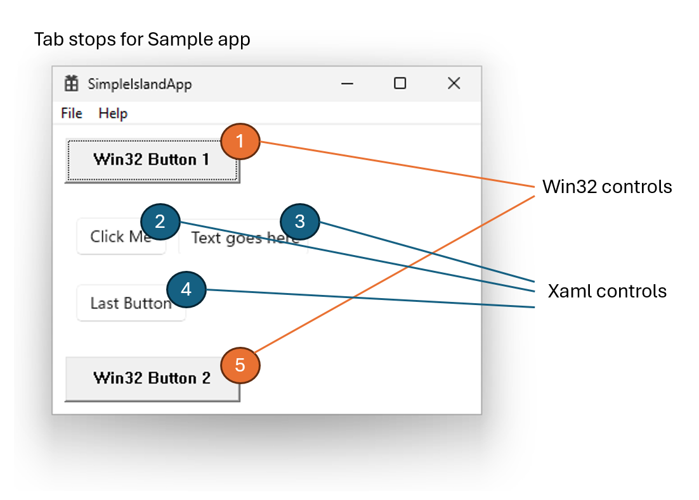
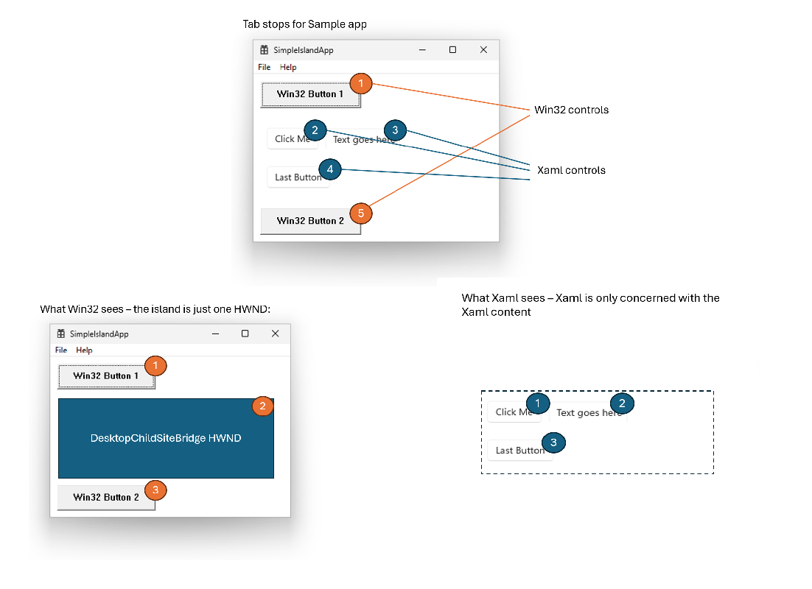
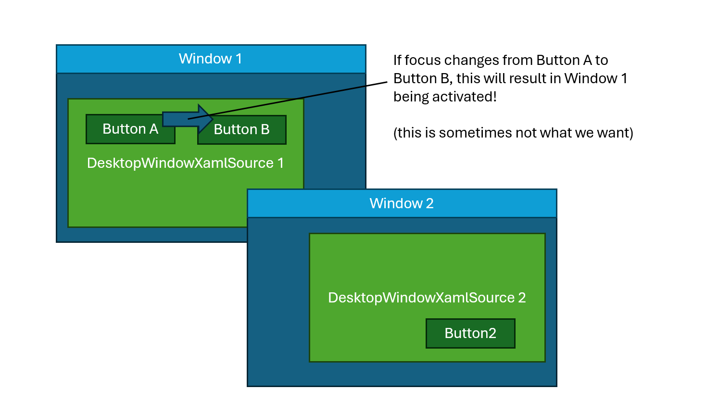

# Xaml Island Focus Navigation

## Table of Contents

  - [SimpleIslandApp Sample App](#simpleislandapp-sample-app)
  - [How the first tab into Xaml works](#how-the-first-tab-into-xaml-works)
    - [ProcessMessageForTabNavigation (App)](#processmessagefortabnavigation-app)
    - [DesktopWindowXamlSource.NavigateFocus](#desktopwindowxamlsourcenavigatefocus)
    - [FocusObserver::ProcessNavigateFocusRequest](#focusobserverprocessnavigatefocusrequest)
      - [SetLastInputDeviceType and Focus Rectangles](#setlastinputdevicetype-and-focus-rectangles)
    - [CFocusManager::UpdateFocus](#cfocusmanagerupdatefocus)
      - [Aside: Why ShouldSetWindowFocus?](#aside-why-shouldsetwindowfocus)
  - [CXamlIslandRoot::TrySetFocus](#cxamlislandroottrysetfocus)
  - [The Win32 set focus](#the-win32-set-focus)
  - [Xaml gets the GotFocus event](#xaml-gets-the-gotfocus-event)
- [TODO](#todo)
  - [How does Xaml know what the first control is?](#how-does-xaml-know-what-the-first-control-is)

## SimpleIslandApp Sample App

Let's start with a public sample we have for putting a DesktopWindowXamlSource in a simple win32 app.

You can find it in the [WindowsAppSDK-Samples](https://github.com/microsoft/WindowsAppSDK-Samples)
repo.

Here's how to download the sample and build it:

``` cmd
rem Clone the repo:
git clone https://github.com/microsoft/WindowsAppSDK-Samples.git

rem Open the sln (requires Visual Studio)
start Samples\Islands\cpp-win32-unpackaged\SimpleIslandApp.sln

rem Now just build and run.  The first time you run it, it may prompt you to install the WindowsAppRuntime.
rem Follow the link and install the version it asks for.
```

The sample has a WebView2 in it.  That's fine, but it will give us an annoying number of tab stops, so
let's comment that out:

``` xml
<!-- MainPage.xaml : Let's comment out the WebView2. -->

            <TextBox Text="Text goes here" Margin="10" />
        </StackPanel>
        <!--<WebView2 Grid.Row="1" Source="http://bing.com" />-->
        <Button Grid.Row="2">Last Button</Button>
    </Grid>
```

Once you've done that, build and run the app.

You should see that you can press tab to move between these tab stops:



Note:
* You can also shift+tab to go in reverse!
* Some of these are Win32 controls and some are Xaml controls, but as the user tabs through the controls,
this isn't obvious to the user.
* If you do keep the WebView2 in the scene, the user can tab through the WebView2 tab stops as well.

Also remember that from a Win32 perspective, the Xaml content is just one HWND.  And the Xaml runtime
is only aware of its own content:



So, we need to figure out how to stitch these together.

**Xaml needs the app's help to understand what's going on!**

The app is going to use these APIs to stitch things together:
* **DesktopWindowXamlSource.NavigateFocus** -- the app calls this when it needs to move focus into the Xaml island.
* **DesktopWindowXamlSource.TakeFocusRequested** -- the app handles this event when Xaml needs to move focus
out of the island.

## How the first tab into Xaml works

Let's look at what's happening when the user first tabs from the Win32 button to the Xaml button.

Let's try this breakpoint:

```
// This function is called when a Xaml island in the process gets focused:
bp Microsoft_UI_Xaml!CXamlIslandRoot::OnIslandGotFocus
```

Here's where Xaml is subscribing to the `IInputFocusController.GotFocus` event:

``` cpp
// CXamlIslandRoot::SubscribeToInputKeyboardSourceEvents (XamlIslandRoot.cpp)
    IFCFAILFAST(m_inputFocusController->add_GotFocus(
        WRLHelper::MakeAgileCallback<wf::ITypedEventHandler<ixp::InputFocusController*, ixp::FocusChangedEventArgs*>>(
            [weakXamlIslandRoot](ixp::IInputFocusController* inputFocusController, ixp::IFocusChangedEventArgs* args) -> HRESULT
    {
        auto spXamlIslandRoot = weakXamlIslandRoot.lock();
        if(spXamlIslandRoot == nullptr) { return S_OK; }

        args->put_Handled(true);
        return spXamlIslandRoot->OnIslandGotFocus();
    }).Get(), &m_gotFocusToken));
```

Note the InputFocusController is associated with the contentIsland, here's where we create it:

``` cpp
// In CXamlIslandRoot::InitInputObjects (XamlIslandRoot.cpp)
IFCFAILFAST(inputFocusControllerStaticsNoRef->GetForIsland(contentIsland, &m_inputFocusController));
```

Note:
* DesktopWindowXamlSource uses a DesktopChildSiteBridge to host its ContentIsland.
* DesktopChildSiteBridge uses a child HWND fo this.
* This GotFocus event will be raised when the DCSB's HWND gets focused.
* If we were using a XamlIsland without a DesktopChildSiteBridge/HWND here, the behavior should be the same --
except this wouldn't be based on an HWND getting focus.  _TODO: Might be interesting to show that callstack_

OK, we've got our breakpoint set.  Let's activate the app window again and press tab to move focus into the first
Xaml button, "Click Me".

When you press tab, you'll see the breakpoint get hit at a callstack like this:

```
// Callstack is edited for clarity
0:000> kc
 # Call Site
00 Microsoft_UI_Xaml!CXamlIslandRoot::OnIslandGotFocus
01 Microsoft_UI_Xaml!CXamlIslandRoot::SubscribeToInputKeyboardSourceEvents::__l44::<lambda_6>::operator()
02 Microsoft_UI_Xaml!...
03 Microsoft_UI_Input!...
0c Microsoft_UI_Input!InputFocusControllerWinRT::OnGotFocusEvent_Callback   // Input is processing WM_GOTFOCUS
0d Microsoft_UI_Input!InputFocusControllerWinRT::OnWindowMessage_Callback
0e Microsoft_UI_Input!...
19 USER32!UserCallWinProcCheckWow
1a USER32!CallWindowProcAorW
1b USER32!CallWindowProcW
1c Microsoft_UI_Windowing_Core!...
2e USER32!UserCallWinProcCheckWow
2f USER32!DispatchClientMessage
30 USER32!__fnDWORD
...
32 <Win32 SetFocus system call>        // Win32 SetFocus is happening
33 Microsoft_UI_Input!...
39 Microsoft_UI_Input!InputFocusControllerWinRT::Api::TrySetFocus
3a Microsoft_UI_Xaml!CXamlIslandRoot::TrySetFocus
3b Microsoft_UI_Xaml!ContentRootAdapters::FocusManagerXamlIslandAdapter::SetFocus
3c Microsoft_UI_Xaml!CFocusManager::UpdateFocus
3d Microsoft_UI_Xaml!CFocusManager::SetFocusedElement
3e Microsoft_UI_Xaml!FocusObserver::ProcessNavigateFocusRequest
3f Microsoft_UI_Xaml!FocusController::NavigateFocus
40 Microsoft_UI_Xaml!DirectUI::DesktopWindowXamlSource::NavigateFocusImpl
41 Microsoft_UI_Xaml!DirectUI::DesktopWindowXamlSourceGenerated::NavigateFocus
42 SimpleIslandApp!winrt::impl::consume_IDesktopWindowXamlSource<IDesktopWindowXamlSource>::NavigateFocus
43 SimpleIslandApp!ProcessMessageForTabNavigation
44 SimpleIslandApp!wWinMain
45 SimpleIslandApp!...
```

There's a lot going on in this callstack, we'll use it as a map to see how things work.


### ProcessMessageForTabNavigation (App)
```
43 SimpleIslandApp!ProcessMessageForTabNavigation
```
In this function, the app is looking at the keyboard message to see if it's a tab key.

**Win32 apps normally don't need to do this**, they get tab and shift+tab behavior for free.
We could use Win32's normal tab navigation, and the DesktopWindowXamlSource HWND would
get focus.  But if we did that, the DesktopWindowXamlSource wouldn't know if it was
a forward "tab" focus or backward "shift+tab" focus.

We need to know if the user is pressing tab or shift+tab so we can pass that information along to Xaml.

And then the app calls the Xaml [DesktopWindowXamlSource.NavigateFocus](https://learn.microsoft.com/en-us/windows/windows-app-sdk/api/winrt/microsoft.ui.xaml.hosting.desktopwindowxamlsource.navigatefocus?view=windows-app-sdk-1.6)
API to move focus into Xaml.

Here's that function:

``` cpp
// SampleIslandApp.cpp
// Returns "true" if the function handled the message and it shouldn't be processed any further.
// Intended to be called from the main message loop.
bool ProcessMessageForTabNavigation(const HWND topLevelWindow, MSG* msg)
{
    if (msg->message == WM_KEYDOWN && msg->wParam == VK_TAB)
    {
        // The user is pressing the "tab" key.  We want to handle this ourselves so we can pass information into Xaml
        // about the tab navigation.  Specifically, we need to tell Xaml whether this is a forward tab, or a backward
        // shift+tab, so Xaml will know whether to put focus on the first Xaml element in the island or the last
        // Xaml element.  (This is done in the call to DesktopWindowXamlSource.NavigateFocus()).
        const HWND currentFocusedWindow = ::GetFocus();
        if (::GetAncestor(currentFocusedWindow, GA_ROOT) != topLevelWindow)
        {
            // This is a window outside of our top-level window, let the system process it.
            return false;
        }

        const bool isShiftKeyDown = ((HIWORD(::GetKeyState(VK_SHIFT)) & 0x8000) != 0);
        const HWND nextFocusedWindow = ::GetNextDlgTabItem(topLevelWindow, currentFocusedWindow, isShiftKeyDown /*bPrevious*/);

        WindowInfo* windowInfo = reinterpret_cast<WindowInfo*>(::GetWindowLongPtr(topLevelWindow, GWLP_USERDATA));
        const HWND dwxsWindow = winrt::GetWindowFromWindowId(windowInfo->DesktopWindowXamlSource.SiteBridge().WindowId());
        if (dwxsWindow == nextFocusedWindow)
        {
            // Focus is moving to our DesktopWindowXamlSource.  Instead of just calling SetFocus on it, we call NavigateFocus(),
            // which allows us to tell Xaml which direction the keyboard focus is moving.
            // If your app has multiple DesktopWindowXamlSources in the window, you'll want to loop over them and check to
            // see if focus is moving to each one.
            winrt::XamlSourceFocusNavigationRequest request{
                isShiftKeyDown ?
                    winrt::XamlSourceFocusNavigationReason::Last :
                    winrt::XamlSourceFocusNavigationReason::First };

            windowInfo->DesktopWindowXamlSource.NavigateFocus(request);
            return true;
        }

        // Focus isn't moving to our DesktopWindowXamlSource.  IsDialogMessage will automatically do the tab navigation
        // for us for this msg.
        const bool handled = (::IsDialogMessage(topLevelWindow, msg) == TRUE);
        return handled;
    }
    return false;
}
```


### DesktopWindowXamlSource.NavigateFocus
```
3f Microsoft_UI_Xaml!FocusController::NavigateFocus
40 Microsoft_UI_Xaml!DirectUI::DesktopWindowXamlSource::NavigateFocusImpl
41 Microsoft_UI_Xaml!DirectUI::DesktopWindowXamlSourceGenerated::NavigateFocus
42 SimpleIslandApp!winrt::impl::consume_IDesktopWindowXamlSource<IDesktopWindowXamlSource>::NavigateFocus
```

Here's where the app is calling Xaml's DesktopWindowXamlSource.NavigateFocus API.

(I shortened the name of frame 42 for clarity)

Let's walk from the bottom up:
* Frame 42: this is the cpp/winrt projection for calling into DesktopWindowXamlSource.NavigateFocus
* Frame 41: the code generated by codegen
* Frame 40: the Xaml implementation (not code-genned)
* Frame 3f: FocusController helps us handle the focus change.

### FocusObserver::ProcessNavigateFocusRequest
```
3e Microsoft_UI_Xaml!FocusObserver::ProcessNavigateFocusRequest
```
In this function we see some logic to figure out what Xaml control we should put focus on.

* If the navigation reason is "first", we call **GetFirstFocusableElement** to find hte Xaml element to focus.
* If it's "last" we call **GetLastFocusableElement**.

``` cpp
    if (reason == xaml_hosting::XamlSourceFocusNavigationReason::XamlSourceFocusNavigationReason_First ||
        reason == xaml_hosting::XamlSourceFocusNavigationReason::XamlSourceFocusNavigationReason_Last)
    {
        m_contentRoot->GetInputManager().SetLastInputDeviceType(GetInputDeviceTypeFromDirection(direction));
        const bool bReverse = (reason == xaml_hosting::XamlSourceFocusNavigationReason::XamlSourceFocusNavigationReason_Last);

        if (!pRoot)
        {
            // No content has been loaded, bail out
            return S_OK;
        }

        CDependencyObject* pCandidateElement = nullptr;
        if(bReverse)
        {
            pCandidateElement = m_contentRoot->GetFocusManagerNoRef()->GetLastFocusableElement(pRoot);
        }
        else
        {
            pCandidateElement = m_contentRoot->GetFocusManagerNoRef()->GetFirstFocusableElement(pRoot);
        }
```

#### SetLastInputDeviceType and Focus Rectangles

Also note this call to **SetLastInputDeviceType**.  When this is set to "Keyboard" or "GamepadOrRemote",
Xaml shows a focus rectangle on the element that has focus.

In ProcessNavigateFocusRequest above, Xaml assumes that if the reason is "first" or "last", it should start showing the
focus rectangle because the app is processing a tab navigation.

🐞 This could be a source of bugs?  

```
// To learn more about focus rects:
CFocusManager::UpdateFocusRect
CFocusRectManager::UpdateFocusRect
/dxaml/xcp/components/FocusRect
```

### CFocusManager::UpdateFocus
```
3c Microsoft_UI_Xaml!CFocusManager::UpdateFocus
```
Update focus gets called whenever Xaml focus changes internally.

**It's a handy place to set a breakpoint!**

``` cpp
_Check_return_ FocusMovementResult
CFocusManager::UpdateFocus(_In_ const FocusMovement& movement)
{ ...
```

The "movement" object has all the information about the focus movement.

We can use "!xamltree" to see where focus is moving:

```
0:000> dt movement pTarget
Local var @ r14 Type Focus::FocusMovement*
   +0x000 pTarget : 0x00000183`8de52870 CDependencyObject
0:000> !xamltree /parent 0x00000183`8de52870
Dirty flags marked with [!]
CRootVisual 0x000001838dec77d0
  CXamlIslandRootCollection 0x000001838de2af00
    CXamlIslandRoot 0x000001838de25980, comp node 0x000001838deae790
      CRootScrollViewer 0x000001838de62eb0
        CScrollContentPresenter 0x000001838ddff580
          CBorder 0x000001838de63980, comp node 0x000001838deaea60
            CPage 0x000001838de2b250
              CGrid 0x000001838de06740
                CStackPanel 0x000001838de52680
                  CButton 0x000001838de52870 "Button"
```

Let's look at this part of the function:

``` cpp
// focusmgr.cpp CFocusManager::UpdateFocus
// ...
    // Update the focused control
    m_pFocusedElement = pNewFocus;
    AddRefInterface(m_pFocusedElement);
    m_realFocusStateForFocusedElement = nonCoercedFocusState;

    if (ShouldSetWindowFocus(movement))
    {
        // Note: This ultimately calls IInputKeyboardSource2::TrySetFocus. We need to verify that we don't already have
        // focus to avoid an infinite loop from reentrancy.
        m_contentRoot.GetFocusAdapter().SetFocus();
    }
```

At the top of this snippet, we set `m_pFocusedElement`, which is Xaml's source-of-truth for which control has focus
on this island.

> Note: there is one CFocusManager per island.  Each island has zero or one focused elements, tracked by its CFocusManager.

As the comment says, this "SetFocus" call will end up setting win32 focus to the DCSB's HWND.

#### Aside: Why ShouldSetWindowFocus?

🐞 This is a source of bugs.

That above call to **SetFocus** can cause problems!

Here's the scenario:
* We have two top-level windows on the same thread.
* Each top-level window has its own DesktopWindowXamlSource.
* In the non-activated window, Xaml focus moves to a different element.
* If we make this call to SetFocus(), that window will get activated.  (if the app author isn't expecting this,
it's usually not a good user experience!)



> Recall that when Xaml started in Windows 8, it was not possible to have multiple top-level windows containing
Xaml on the same thread.  This is technical debt we have as a result of breaking this assumption.

To mitigate this problem for _some_ situations, we created this **ShouldSetWindowFocus** function that runs
some logic to figure out if we should really set win32 focus:

``` cpp
// Returns true if we should set Win32 focus to the containing HWND based on the FocusMovement.
// This can cause our top-level window to be activated, so there are some cases where we want to skip it.
bool CFocusManager::ShouldSetWindowFocus(const FocusMovement& movement) const
{
    // If we're updating the state to Unfocused, we don't want to set focus to our HWND.
    if (movement.GetFocusState() == FocusState::Unfocused)
    {
        return false;
    }

    // Don't set window focus if the movement hasn't requested input activation (such as because
    // this was an "emergency/correction" of which element should have focus when the focused
    // element is hidden or removed from the tree).
    if (movement.requestInputActivation == false)
    {
        return false;
    }

    // When an element gets light-dismissed, XAML sets focus back to the previously-focused element (CPopup::Close).
    // If the light-dismiss is due to the focus moving away from our window, we don't want this focus change to
    // activate our window again.
    const bool focusIsForLightDismissOnInactiveWindow = movement.isForLightDismiss && !m_contentRoot.GetIsInputActive();
    if (focusIsForLightDismissOnInactiveWindow)
    {
        return false;
    }

    // If focused element is hwnd-based component hosted inside the Xaml island (aka WebView2), don't set focus to the hwnd,
    // to avoid Xaml stealing focus back after the user interacts with the component hwnd, and focus is already there.
    // ... snip ...

    return true;
}
```

Internal Xaml controls can usually set that `requestInputActivation` field to say that for a particular focus change,
they don't want to take win32 focus.

BUT, there's no public API for this today, so there's no way for an app to do this.

There is ongoing work to add a public API for this:
create a public API to allow apps to set focus without triggering window activation.

## CXamlIslandRoot::TrySetFocus
```
3a Microsoft_UI_Xaml!CXamlIslandRoot::TrySetFocus
```
Here's where Xaml calls the InputFocusController (in Microsoft.UI.Input.dll) to actually set focus to its ContentIsland.

``` cpp
// CXamlIslandRoot::TrySetFocus (XamlIslandRoot.cpp)
IFC_RETURN(m_inputFocusController->TrySetFocus(pHasFocusNow));
```

## The Win32 set focus
```
0c Microsoft_UI_Input!InputFocusControllerWinRT::OnGotFocusEvent_Callback   // Input is processing WM_SETFOCUS
0d Microsoft_UI_Input!InputFocusControllerWinRT::OnWindowMessage_Callback
0e Microsoft_UI_Input!...
19 USER32!UserCallWinProcCheckWow
1a USER32!CallWindowProcAorW
1b USER32!CallWindowProcW
1c Microsoft_UI_Windowing_Core!...
2e USER32!UserCallWinProcCheckWow
2f USER32!DispatchClientMessage
30 USER32!__fnDWORD
...
32 <Win32 SetFocus system call>        // Win32 SetFocus is happening
```

Recall that since we're using DesktopWindowXamlSource, when we call TrySetFocus this will cause the input stack
to do a win32 SetFocus to our DWXS's HWND.

Above is the part of the stack where we can see that happening.

Eventually, InputFocusControllerWinRT gets that WM_SETFOCUS.

## Xaml gets the GotFocus event
```
00 Microsoft_UI_Xaml!CXamlIslandRoot::OnIslandGotFocus
01 Microsoft_UI_Xaml!CXamlIslandRoot::SubscribeToInputKeyboardSourceEvents::__l44::<lambda_6>::operator()
```
OK, so now the HWND has gotten window focus -- and now, Xaml is being notified.