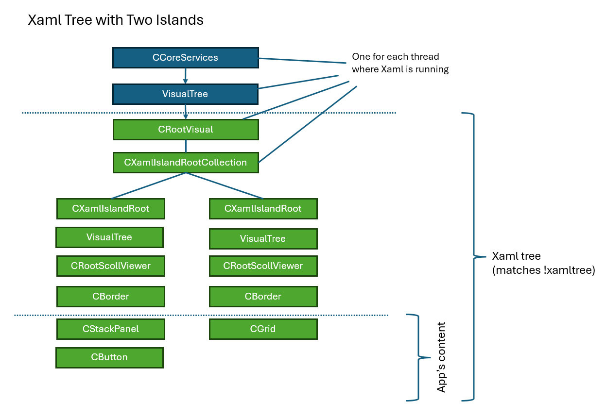
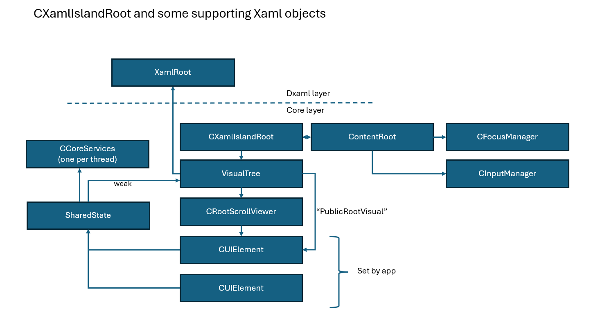

# XamlIsland implementation

## Table of Contents

- [Background](#background)
- [The Xaml Tree](#the-xaml-tree)
  - [Xaml Tree Basics  (UPDATED)](#xaml-tree-basics--updated)
  - [CXamlIslandRootCollection](#cxamlislandrootcollection)
- [What Xaml Island am I in?](#what-xaml-island-am-i-in)
- [XamlRoot object and property](#xamlroot-object-and-property)
- [How Xaml keeps track of which island an element is on](#how-xaml-keeps-track-of-which-island-an-element-is-on)

## Background

There's a lot about Xaml (and islands) that's due to historical reasons, so sometimes knowing the history
can really help folks understand.

* At first, Xaml had one Xaml tree per thread.

This flavor of Xaml first shipped with Windows 8, which had a new app model called UAP.  At this time,
Xaml only ran in UAP, and Xaml could only be hosted on a CoreWindow, and only one CoreWindow could
run on a thread.  So, on any given thread, there could only be one tree of Xaml.

* To support Xaml Islands (DesktopWindowXamlSource), we had to support multiple Xaml trees on a thread.

Our scenarios wouldn't be satisfied if we only allowed apps to have one XamlIsland on a thread.
We also had a scenario where we had Xaml content in a CoreWindow _and_ islands at the same time, all
on the same thread.

> Xaml has historically been very careful about backward compatibility -- we want to make sure not
to break existing Xaml apps. 

## The Xaml Tree

### Xaml Tree Basics  (UPDATED)

Every thread using Xaml has exactly one **Xaml Tree**.  This is how Xaml keeps track of its scene.

Let's say we have two islands with Xaml content like this:

```
Island 1:
<StackPanel>
  <Button/>
</StackPanel>

Island 2:
<Grid/>

```

In memory, Xaml will have an object graph looking something like this:



A few notes about the Xaml tree:
* It's always rooted by a **CRootVisual**.
* All nodes on the tree derive from **CDependencyObject**.
* Technically, it's a **graph**, not a tree, because some **DependencyObjects** can be children of more
than one node (we can call these "shareable" dependency objects, look for places where
the DoesAllowMultipleAssociation function is overridden to return "true").

### CXamlIslandRootCollection

Remember that before Xaml 

To support multiple trees of Xaml on the thread, while still maintaining a "main" tree for the CoreWindow's
Xaml content, we decided to graft new "XamlIsland" nodes into the main tree so we'd only need to work
with one big tree.

* CXamlIslandRootCollection maintains our collection of CXamlIslandRoot objects in the Xaml tree.

This is easiest to see with !xamltree.  Here's a !xamltree dump of WinUI3 Gallery with two active windows:

```
0:022> !xamltree
------------------------------------------------------------------------------
UIEXT debugger extension.  Use '!uiext help' for help.
Dirty flags marked with [!]
[Current DXamlCore (0x000002105ed90f00)]
[Current CCoreServices (0x000002105ed91840)]
[DCompTreeHost Pointer (0x000002105ed93500)]
[VisualTree Root Pointer (0x000002105ed97450)]
[Public Root Visual (0x000002105ef58020)]
CRootVisual 0x000002105ed977d0    <- This is always the root of the whole tree
  CGrid 0x000002105ef21480        <- (purpose of this grid is unclear)
  CXamlIslandRootCollection 0x000002105ef5af00    <- The only CXamlIslandRootCollection on the thread
    CXamlIslandRoot 0x000002105ef55980, comp node 0x000002105ef8f930
      CGrid 0x000002105ef1d960
      CConnectedAnimationRoot 0x000002105ef1db60
      CPopupRoot 0x000002105ef1dd30
      CTransitionRoot 0x000002105ef1e0d0
      CRootScrollViewer 0x000002105ef1ca80
        CScrollContentPresenter 0x000002105ef1d310
          CBorder 0x000002105ef1d750, comp node 0x000002105ef8fc00
            CStackPanel 0x000002105ef367a0
              CButton 0x000002105ef82bd0
                CContentPresenter 0x000002105ef314d0 "ContentPresenter"
    CXamlIslandRoot 0x000002105ef363f0, comp node 0x000002105ef8f390
      CGrid 0x000002105ef206c0
      CConnectedAnimationRoot 0x000002105ef20a50
      CPopupRoot 0x000002105ef20d80
      CTransitionRoot 0x000002105ef21120
      CRootScrollViewer 0x000002105ef1e7c0
        CScrollContentPresenter 0x000002105ef1f050
          CBorder 0x000002105ef1fca0, comp node 0x000002105ef8f660
            CGrid 0x000002105ef1e430
  CConnectedAnimationRoot 0x000002105ef21810
  CPopupRoot 0x000002105ef21b40
  CPrintRoot 0x000002105ef21ee0
  CTransitionRoot 0x000002105ef248d0
  CFullWindowMediaRoot 0x000002105ef24aa0
  CRootScrollViewer 0x000002105ef181d0
    CScrollContentPresenter 0x000002105ef22680
      CBorder 0x000002105ef35850
        CGrid 0x000002105ef58020    <-- This is where the CoreWindow content goes if we had any. (UWP-only)
```


> Recall that UWP (and therefore CoreWindow) is not supported in WinAppSDK / WinUI3.

Notes about some of these objects:
* CRootVisual -- always the root of the tree on the thread
* CXamlIslandRootCollection -- always one in the tree
* CXamlIslandRoot (XamlIslandRoot.h/.cpp) -- does most of the heavy lifting for islands.  Creates lots
of IXP objects, subscribes to the event handlers, manages the layout, etc.
* VisualTree -- manages the Xaml content of each CXamlIslandRoot. It creates, for example, the
CPopupRoot/CRootScrollViewer/etc objects and goes through the process of how they enter the tree.

```
Interesting breakpoints:
Microsoft_UI_Xaml!CXamlIslandRoot::SetPublicRootVisual // This is how we set the user's Xaml content
Microsoft_UI_Xaml!CXamlIslandRoot::InitializeCommon // Sets up input and IXP event handlers
Microsoft_UI_Xaml!CXamlIslandRoot::PreTranslateMessage // When the app calls ContentPreTranslateMessage
```

## What Xaml Island am I in?

Let's say we write an app that has this code:

``` c#
  var popup = new Microsoft.UI.Xaml.Controls.Primitives.Popup();
```

Some things happen:
* WinRT will activate an object of the type DirectUI::Popup (Popup_partial.h/.cpp)
* This will create the core peer object of type CPopup (Popup.h/.cpp)
* The CPopup has a pointer to the CCoreServices object on the thread (there is one at most per thread)

But what if we do this?

``` c#
  popup.IsOpen = true;
```

The app wants to open the popup, but the Xaml runtime has no way to tell what Xaml Island it should show
the popup on!

> Today, Xaml raises an error in this case.  This isn't ideal, it's sometimes hard for folks to understand
the problem.

Sometimes Xaml can figure out what island it should be using based on context.  For example,
in this call to MenuFlyout.ShowAt:

``` c#
  var flyout = new MenuFlyout();
  flyout.ShowAt(button, new Point(10,10));
```

If "button" is in the live Xaml tree, Xaml can assume that the app wants the flyout to be in the same
island as the button.  We might even be able to assume that if the flyout was recently opened in some island,
the app probably wants to use that same island.

* Xaml has developed some logic to figure out what island an element should be associated with.

This function is particularly important: `VisualTree::GetForElementNoRef`. 

Each CDependencyObject has a m_sharedState field that keeps track of what VisualTree the object is associated
with, if any.  Recall that each CXamlIslandRoot object has a VisualTree to help it manage its tree, so 
if we know the VisualTree that an object is part of, we also know the CXamlIslandRoot.

## XamlRoot object and property

You can explicitly tell Xaml which VisualTree an object should belong to by setting the XamlRoot property.
Sometimes you _must_ do this so that Xaml knows what island you want to be using.

We can fix our popup example from above:

``` c#
  var popup = new Microsoft.UI.Xaml.Controls.Primitives.Popup();
  popup.XamlRoot = myPage.XamlRoot;
  popup.IsOpen = true;
```

This tells Xaml, "this Popup should be on the same island as myPage is".

You can think of the **XamlRoot** object as an abstraction of whatever object is hosting a Xaml element.
Historically, a Xaml element could be hosted by a CoreWindow, a DesktopWindowXamlSource, or even a
XamlPresenter (deprecated).  If someone is just writing a control, we don't want that person to have
to be aware of all the possible ways the app using her control could be hosted, so we exposed a
generic object with some common properties and events.

Recall the VisualTree object manages the tree of Xaml elements for the CXamlIslandRoot.  Here's
a diagram of CXamlIslandRoot and some of its supporting Xaml objects:



## How Xaml keeps track of which island an element is on

The function `CDependencyObject::Enter` is called on a DependencyObject whenever it enters the live Xaml tree.
In this code, as the enter is happening, we call SetVisualTree to remember which VisualTree the object is
on:

``` cpp
// File: depends.cpp
// In this function: microsoft_ui_xaml!CDependencyObject::Enter 
    if (params.fIsLive && params.visualTree)
    {
        // As the DO enters the live tree, we call SetVisualTree to remember which one it's associated with
        SetVisualTree(params.visualTree);
    }
```

Let's look at the function this calls, `CDependencyObject::SetVisualTree` ([link](../../../dxaml/xcp/core/core/elements/depends.cpp)).