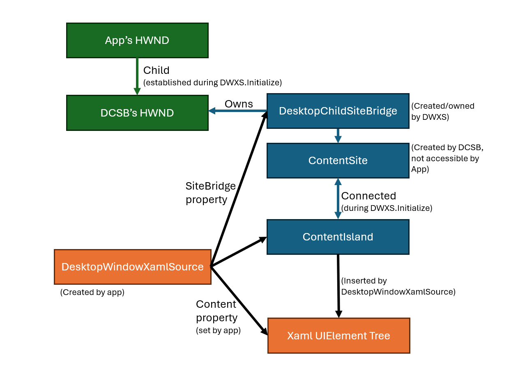
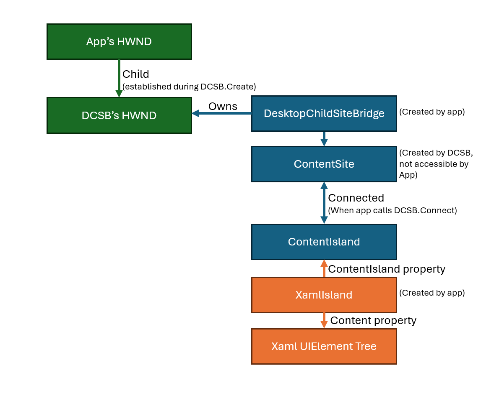

# XamlIsland

Enables an application to host Xaml content within a SiteBridge.

## Constructors

| Name | Description |
|-|-|
| XamlIsland | Initializes a new instance of the XamlIsland class. |

## Properties

| Name | Description |
|-|-|
| Content | Gets or sets the Xaml content to be hosted by the XamlIsland. |
| ContentIsland | Gets the internal ContentIsland associated with the XamlIsland. |
| SystemBackdrop | Gets or sets the SystemBackdrop for the XamlIsland. |

## Overview

A `XamlIsland` is an object similar to a `DesktopWindowXamlSource` that allows fragments of Xaml
content to be hosted inside of an application. When a `XamlIsland` is created, it internally creates
and manages a `ContentIsland`, which is exposed by the `XamlIsland`. This allows developers to
connect to the `ContentIsland` with their own `SiteBridge` and host Xaml content set on the
`XamlIsland`.

## DesktopWindowXamlSource vs XamlIsland classes



The `DesktopWindowXamlSource` enables hosting a fragment of Xaml content inside of an application.
It creates its own `DesktopChildSiteBridge` using a parent HWND, then hosts the Xaml content in a
connected `ContentIsland` created by Xaml. Because the `DesktopWindowXamlSource` handles both the bridge and island
side of the hosting scenario, it only works with an HWND and does not allow access to the underlying
`ContentIsland` for scenarios like cross-thread or cross-process hosting.



The `XamlIsland` works similarly to the `DesktopWindowXamlSource` in that it allows for fragments of Xaml content
to be hosted inside an application. However, it does not create its own `DesktopChildSiteBridge`. Instead,
it exposes the `ContentIsland` created by Xaml, allowing the developer to
host the island inside a bridge that the app creates. In the future, this will enable
cross-thread and cross-process hosting.

## Remarks

Before creating a `XamlIsland`, a `DispatcherQueue` must already be running on the current thread.
When you create a `XamlIsland`, it will ensure Xaml is running on the current thread.  (To create
most Xaml objects, the Xaml framework must already be running on the thread.) To ensure that Xaml is
properly uninitialized on shutdown, `ShutdownQueue` should be called on the
`DispatcherQueueController`. Because `XamlIsland` is controlled by a SiteBridge outside of Xaml, it
prepares future support for cross-thread and cross-process hosting. This structure also means that
functionality like focus should be handled using `ContentIsland` APIs.

## Examples

### Using a `DesktopWindowXamlSource` vs. using a `XamlIsland` to display Xaml text with an HWND

The following example shows a minimum scenario to host Xaml content inside of a
`DesktopWindowaXamlSource` and a `XamlIsland`. This example highlights the internal process of the
`DesktopWindowXamlSource`, where it creates a `DesktopChildSiteBridge` and connects it to a `ContentIsland`
created by Xaml. Because the `XamlIsland` allows developers to host the content inside of a created
bridge, this connection must be established manually in the `XamlIsland` case.

#### `DesktopWindowXamlSource` Scenario

```c++
DesktopWindowXamlSource desktopSource {nullptr};

// A DispatcherQueue should already be running before this method is called.
void ShowXamlWithDesktopWindowXamlSource(HWND appHwnd) 
{
  // A reference to the DesktopWindowXamlSource must be held to keep the underlying ContentIsland alive.
  desktopSource = desktopSource{};

  WindowId mainWindowId = ::GetWindowIdFromWindow(appHwnd);

  // When the DesktopWindowXamlSource is initialized, it internally creates its own
  // DesktopChildSiteBridge and connects it to a ContentIsland created by Xaml.
  desktopSource.Initialize(mainWindowId);

  // Create and set the Xaml content on the DesktopWindowXamlSource.
  TextBlock textBlock;
  textBlock.Text(L"Hello, world!");

  desktopSource.Content(textBlock);

  RectInt32 rect {10, 10, 400, 400};
  desktopSource.SiteBridge().MoveAndResize(rect);
}
```

#### `XamlIsland` Scenario

```c++
XamlIsland xamlIsland {nullptr};
DesktopChildSiteBridge siteBridge {nullptr};

// A DispatcherQueue should already be running before this method is called.
void ShowXamlWithXamlIsland(HWND appHwnd) 
{
  // A reference to the XamlIsland must be held to keep the underlying ContentIsland alive.
  xamlIsland = XamlIsland{};
  auto contentIsland = xamlIsland.ContentIsland();

  WindowId mainWindowId = ::GetWindowIdFromWindow(appHwnd);
  
  // Create a DesktopChildSiteBridge, which creates a child HWND of the main window's HWND.
  siteBridge = DesktopChildSiteBridge::Create(contentIsland.Compositor(), mainWindowId);

  // Connect the bridge and the XamlIsland's underlying ContentIsland. This is performed interally
  // by a DesktopWindowXamlSource.
  siteBridge.Connect(contentIsland);

  // Create and set the Xaml content on the XamlIsland.
  TextBlock textBlock;
  textBlock.Text(L"Hello, world!");

  xamlIsland.Content(textBlock);

  RectInt32 rect {10, 10, 400, 400};
  siteBridge.MoveAndResize(rect);
}
```

## API Details

```cs
namespace Microsoft.UI.Xaml
{
    [contract(Microsoft.UI.Xaml.WinUIContract, 6)]
    runtimeclass XamlIsland:
        Windows.Foundation.IClosable,
        Microsoft.UI.Composition.ICompositionSupportsSystemBackdrop
    {
        XamlIsland();

        UIElement Content;

        Microsoft.UI.Content.ContentIsland ContentIsland { get; };

        Microsoft.UI.Xaml.Media.SystemBackdrop SystemBackdrop;
    }
}
```
