# Xaml Island and Multi-Window Plans/Design

## Table of Contents

- [Background](#background)
- [Terminology](#terminology)
- [Related art](#related-art)
  - [Xaml islands sample](#xaml-islands-sample)
  - [Office](#office)
  - [WPF](#wpf)
- [The zebra problem](#the-zebra-problem)
- [Xaml Islands primitives](#xaml-islands-primitives)
  - [Object Lifetime/Threading Improvements](#object-lifetimethreading-improvements)
- [Island tooling for creating an islands app](#island-tooling-for-creating-an-islands-app)
  - [Toolset for creating an islands app](#toolset-for-creating-an-islands-app)
  - [Diagnostics](#diagnostics)
  - [Work required](#work-required)
- [Keyboard Accelerators](#keyboard-accelerators)
  - [Accelerator scenarios](#accelerator-scenarios)
    - [Scenario: Full-window island (existing)](#scenario-full-window-island-existing)
    - [Scenario: Host and focused island accelerators (P1)](#scenario-host-and-focused-island-accelerators-p1)
    - [Two islands and a host with accelerators (P2)](#two-islands-and-a-host-with-accelerators-p2)
    - [Island accelerators that should be out of scope (P3)](#island-accelerators-that-should-be-out-of-scope-p3)
  - [Background: Accelerators in Xaml (WinUI)](#background-accelerators-in-xaml-winui)
- [Background: Accelerators in classic Win32](#background-accelerators-in-classic-win32)
  - [Background: Accelerators in Xaml islands](#background-accelerators-in-xaml-islands)
  - [Accelerators design](#accelerators-design)
  - [Accelerators work](#accelerators-work)
- [Access keys (mnemonics)](#access-keys-mnemonics)
  - [Access key modes and scopes](#access-key-modes-and-scopes)
  - [Access key duplication](#access-key-duplication)
  - [Access chords and key tips](#access-chords-and-key-tips)
  - [Dismissing keyboard cues](#dismissing-keyboard-cues)
  - [How Xaml access keys are different from traditional desktop apps](#how-xaml-access-keys-are-different-from-traditional-desktop-apps)
  - [Access Key Xaml details](#access-key-xaml-details)
  - [Access Key Requirements](#access-key-requirements)
  - [Access keys design](#access-keys-design)
    - [New APIs](#new-apis)
    - [Phase 1](#phase-1)
    - [Phase 2](#phase-2)
  - [Task](#task)
- [Xaml Application object](#xaml-application-object)
  - [Problem with the Application in islands](#problem-with-the-application-in-islands)
  - [IXMP Design](#ixmp-design)
  - [IXMP work](#ixmp-work)
- [Special keys](#special-keys)
  - [Special keys design](#special-keys-design)
- [Nested message pumps](#nested-message-pumps)
  - [Nested pumps in Xaml today](#nested-pumps-in-xaml-today)
  - [Two sides to a nested pump](#two-sides-to-a-nested-pump)
  - [Xaml issues with nested pumps](#xaml-issues-with-nested-pumps)
    - [Xaml running in a nested pump](#xaml-running-in-a-nested-pump)
    - [Running a nested pump within Xaml](#running-a-nested-pump-within-xaml)
    - [Hardening Xaml to nesting of pumps](#hardening-xaml-to-nesting-of-pumps)
  - [Other issues with nested message pumps](#other-issues-with-nested-message-pumps)
  - [Nested pump scenarios](#nested-pump-scenarios)
  - [Nested pump design notes](#nested-pump-design-notes)
    - [Xaml in a nested pump](#xaml-in-a-nested-pump)
    - [Xaml nesting a pump](#xaml-nesting-a-pump)
- [Tab navigation](#tab-navigation)
- [Popups](#popups)
- [IsEnabled](#isenabled)
- [Input routing / Scroll-chaining](#input-routing--scroll-chaining)
- [Random Xaml details](#random-xaml-details)
- [Archive: Multiple windows (islands) on a thread](#archive-multiple-windows-islands-on-a-thread)
  - [Multi-window design notes](#multi-window-design-notes)
  - [Multi-window work required](#multi-window-work-required)
    - [Ideas for future work](#ideas-for-future-work)
- [Archive: Multiple windows on multiple threads](#archive-multiple-windows-on-multiple-threads)

## Background

> This is a working document that's been updated as the product changes.

WinUI2 ("system Xaml") runs on top of
[CoreWindow](https://docs.microsoft.com/uwp/api/Windows.UI.Core.CoreWindow)
and [ApplicationView](https://docs.microsoft.com/uwp/api/Windows.UI.ViewManagement.ApplicationView)
and [CoreDispatcher](https://docs.microsoft.com/uwp/api/Windows.UI.Core.CoreDispatcher)
and all of these require a single window per thread. You can create multiple windows though,
using [CoreApplication.CreateNewView](https://docs.microsoft.com/uwp/api/Windows.ApplicationModel.Core.CoreApplication.CreateNewView).
But that creates a new thread for the window, so you're still a single window per thread.

For WinUI3: In WinAppSDK 1.0 we supported only WinUI3 Desktop apps.
Here, a window runs on top of a Desktop hwnd and message pump.
At first it was limited to a single window for the process;
the [Window](https://docs.microsoft.com/uwp/api/Windows.UI.Xaml.Window)
class has a constructor, but there was a runtime check to prevent it from being called more than once.
That restriction has since been removed, apps may now create multiple Window objects on the same thread.

A WinUI3 Window is actually a Xaml Island that fills up all the (non-client) space of its an hwnd.
(The Xaml Window implementation acts as a host for a `DesktopWindowXamlSource`, just like the
WPF [`WindowsXamlHost`](https://docs.microsoft.com/en-us/windows/communitytoolkit/controls/wpf-winforms/windowsxamlhost)
element hosts a `DesktopWindowXamlSource`.)

The `DesktopWindowXamlSource` API was added to WindowsAppSDK in version 1.4.

This spec describes some past islands-related work, and also a wish-list of things we may do in the future
regarding:
* islands
* multiple windows on the same thread
* multiple windows on separate threads
* multiple-islands in a single host


Much of this spec discusses on the WPF case as a host of Xaml,
but Xaml Islands aren't specific to WPF, it's just convenient to use as examples.
(It's also has available, debuggable code.)

>Historical note: Much of this work was tracked with a deliverable

## Terminology

**Top level window and Islands**

For discussion, there are two cases we talk about for hosting Xaml content:
* In the built-in `Window`
* In some island/host

The former is referred to as the top level Window case, the latter as the Islands case.
(Note that in the top-level Window case, the Xaml Source is technically using a
`WS_CHILD` hwnd.)

**Islands vs sources vs hosts**

The code name for the feature that we use is Xaml Islands, and this term shows up a lot, even publicly.

But, there are two Xaml types for using Xaml Islands, and it's confusing that one is named XamlIsland and one is not.
The types are:

* [DesktopWindowXamlSource](https://docs.microsoft.com/uwp/api/Windows.UI.Xaml.Hosting.DesktopWindowXamlSource)
(DWXS).  This is supported in System Xaml, and in WinUI3 as of WinAppSDK 1.4.  It creates a child HWND at the island
boundary.  There's some difference in the API surfaces of the System Xaml version, but its function and purpose is the same.
The name `DesktopWindowXamlSource` is more easily understood as `HwndXamlSource`, but elsewhere we're trying to
standardize on the term "Desktop Window" rather than "hwnd".
* [XamlIsland](xaml-island-type.md).  This is a new API we're adding in WinAppSDK 1.7.  It may or may not be
backed by a child HWND like a DesktopWindowXamlSource is.  When it's not backed by a child HWND, we sometimes
call this a "HWnd-less XamlIsland" or a "Windowless XamlIsland".

>Historical node: There is a component in the community toolkit to wrap System Xaml's DesktopWindowXamlSource 
[WindowsXamlHost](https://docs.microsoft.com/en-us/windows/communitytoolkit/controls/wpf-winforms/windowsxamlhost),
but we no longer recommend apps use this.

We plan to deprecate `DesktopWindowXamlSource`.
Once the `XamlIsland` type is in our stable builds, it will be able to do everything the `DesktopWindowXamlSource` can,
so there's no reason to keep `DesktopWindowXamlSource`.

## Related art

### Xaml islands sample

WinUI3 islands sample: https://github.com/microsoft/WindowsAppSDK-Samples/tree/main/Samples/Islands/cpp-win32-unpackaged


### Office

A fundamental approach to the islands scenario in Office is
[IMsoComponent](https://docs.microsoft.com/en-us/previous-versions/office/developer/office-2007/ff518955(v=office.12)),
and on the host side
[IMsoComponentManager](https://docs.microsoft.com/en-us/previous-versions/office/developer/office-2007/ff518963(v=office.12)).

(This content is outdated and is no longer being maintained, it's only here for historical reasons.)

### WPF

WPF's version of `DesktopWindowXamlSource` is
[HwndSource](https://docs.microsoft.com/dotnet/api/System.Windows.Interop.HwndSource).

The abstract portion of this is the interfaces
[IKeyboardInputSink](https://docs.microsoft.com/dotnet/api/System.Windows.Interop.IKeyboardInputSink)
(the island side) and
[IKeyboardInputSite](https://docs.microsoft.com/dotnet/api/System.Windows.Interop.IKeyboardInputSite)
(the host side).

(The Site is a way for the component to call the host, which `DesktopWindowXamlSource` does with events.)

```cs
public interface IKeyboardInputSink
{
    public abstract IKeyboardInputSite KeyboardInputSite { get;  set; }

    public abstract bool HasFocusWithin ()
    public abstract bool OnMnemonic (MSG& msg, ModifierKeys modifiers)
    public abstract IKeyboardInputSite RegisterKeyboardInputSink (IKeyboardInputSink sink)
    public abstract bool TabInto (TraversalRequest request)
    public abstract bool TranslateAccelerator (MSG& msg, ModifierKeys modifiers)
    public abstract bool TranslateChar (MSG& msg, ModifierKeys modifiers)
}

public interface IKeyboardInputSite
{
    public abstract IKeyboardInputSink Sink { get; }

    public abstract bool OnNoMoreTabStops (TraversalRequest request)
    public abstract void Unregister ()
}
```


## The zebra problem

Different UI frameworks have different default visualizations.
So if you have a Xaml island as only a portion of a window,
with UI from the host framework surrounding it,
the user gets mixed visualizations and potentially experiences.
(You see alternating visualizations across the UI, like stripes on a zebra.)

For example, even within Xaml-land, WPF and Xaml buttons have different fonts,
colors, and spacing:


Or for example access keys are displayed differently (underlines in most frameworks, key tips in Xaml):


There are behavior differences too. For example, again in the above access key example:
* The WPF underline shows up on Alt-Down, whereas the Xaml key tip doesn't show up until Alt-Up.
* Both WPF and Xaml support the user gesture of `Alt+C`,
but only Xaml also supports the user gesture of: `Alt-Down, Alt-Up, C`.

Zebra UI isn't always an issue.
An analogy is Office today, where the main canvas has been updated and refreshed and modernized,
but many of the dialogs have not received all of those updates.

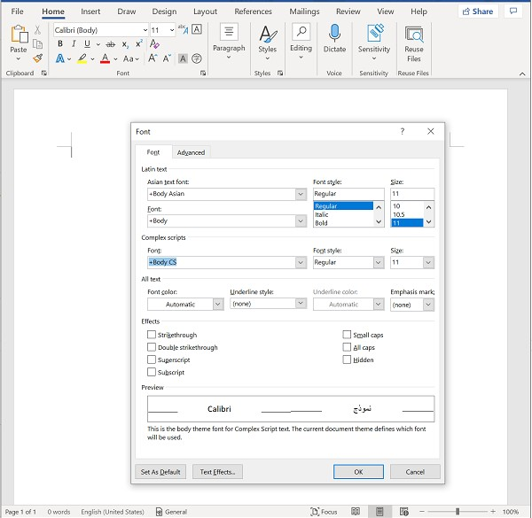

It wouldn't make sense to change for example just one combo box in that dialog,
but changing the whole dialog might be reasonable.

To  more generally address the zebra problem we either need to update hosts
to look more like Xaml (to look like the Fluent design pattern),
or update Xaml to look like common hosts (to look like the Aero design pattern).
Either of these would probably leave some differences.
There's no schedule plan at this point to do either.

Note that some of the visual differences are controllable.
For example you can turn off the uniquely-WinUI keyboard accelerator tooltips by setting
[UIElement.KeyboardAcceleratorPlacementMode](https://docs.microsoft.com/uwp/api/Windows.UI.Xaml.UIElement.KeyboardAcceleratorPlacementMode).


## Xaml Islands primitives

`DesktopWindowXamlSource` is public and stable as of the WinAppSDK 1.4 release.

In System Xaml, clients must call `IDesktopWindowXamlSourceNative.PreTranslateMessage` in their message loop.

In WinUI3, apps must call `ContentPreTranslateMessage` in their message loop.  If an app uses `DispatcherQueue.RunEventLoop`,
this will call `ContentPreTranslateMessage` automatically.

Accessibility doesn't require any new work for WinUI3 islands <mark>??</mark>
For more info on accessibility see this
[UIA design note](../uia.md).

Xaml uses the StateChanged, ThemeChanged, and SettingsChanged events from the IXP TopLevelHost
to avoid relying on messages from the top-level HWND.


### Object Lifetime/Threading Improvements

See also: [xaml-shutdown](../xaml-shutdown.md)

**Issue #1:  WindowsXamlManager instance creation order (FIXED)**

* WindowsXamlManager is a public API and can be explicitly created via WindowsXamlManagerFactory::InitializeForCurrentThread().
* WindowsXamlManager instances are also created implicitly through creating DesktopWindowXamlSource instances
(ie through DesktopWindowXamlSourceFactory::CreateInstance()).
* To be clear, DesktopWindowXamlSource::Initialize() also creates WindowsXamlManager instances.
* **System Xaml**: Apps must Close or release all references to all WindowXamlManagers on the thread to trigger Xaml
to shut down, which it will do asynchronously.
* **WinUI3**: There is at most one WindowsXamlManager per thread.  When the DispatcherQueue on the thread is shut down, the WindowsXamlManager is closed, which shuts down the Xaml core on the thread.

In the past, apps were required to ensure that the first WindowsXamlManager created was also the last one destroyed.

This was fixed in System Xaml and in Lifed Xaml


**Issue #2:  WindowsXamlManager destruction is asynchronous (FIXED in WinUI3)**

WindowsXamlManager manages the XAML Core and so, indirectly manages everything the Core manages (this is a lot of stuff!).  When WindowsXamlManager is being destroyed, it de-initializes the XAML Core, freeing all the resources managed by that core.  There is a problem in today’s design that this tear down of the XAML Core is asynchronous.  The process is triggered either by releasing the last reference on WindowsXamlManager or by calling Close() on it.  This only starts the asynchronous shutdown.  To complete the shutdown, apps are required to drain the DispatcherQueue, which will process the asynchronous message to perform the actual teardown.  Here’s some sample code that does the required rundown:

``` cpp
ComPtr<IWindowsXamlManager> windowsXamlManager = CreateWindowsXamlManager(); // Helper function that calls WindowsXamlManagerFactory::InitializeForCurrentThread()
windowsXamlManager = nullptr;

// After releasing the final reference, we need to drain the DispatcherQueue to process the async shutdown
MSG msg;
while (PeekMessage(&msg, nullptr, 0, 0, PM_REMOVE))
{
    DispatchMessage(&msg);
}
```

This pattern is error-prone and unintuitive.  App authors are not likely to know they need to perform the additional rundown code after releasing the WindowsXamlManager.  The consequence is severe – the entire XAML Core is leaked.

* WinUI3: This is no longer an issue because Xaml shutdown happens during DispatcherQueue shutdown.


**Issue #3:  Cannot reuse thread to host more XAML Islands once WindowsXamlManager is shutdown**

The scenario goes like this:
* Create a WindowsXamlManager => Initializes a XAML Core
* Destroy the WindowsXamlManager and drain the DispatcherQueue => Tears down the XAML Core
* Create another WindowsXamlManager => Unpredictable results

This is a known limitation in system XAML, mostly due to per-thread singleton objects that aren't robust to re-creating the XAML Core.  It’s unclear how many of these exist in lifted XAML (eg we don’t have a CoreWindow, CoreApplicationView, etc). TBD:  We need to do some experimentation in lifted XAML to find out what state this code is in.  As a first step, we need to write a sample that performs the above steps and see what happens.

* WinUI3: The situation is slightly better outside of UWP, but we still have the problem that if Xaml shuts
down on all threads, the app can't start Xaml up again.  This can be mitigated by keeping Xaml alive on
*some* thread at all times.

## Island tooling for creating an islands app

### Toolset for creating an islands app

* **System Xaml**: You can create a WPF or WinForms app with system Xaml islands using VS.
See this [sample walkthrough for WPF](https://docs.microsoft.com/en-us/windows/apps/desktop/modernize/host-custom-control-with-xaml-islands#add-a-reference-to-the-uwp-project-in-your-wpf-project).

* **WinUI3**: We point folks to this sample:
https://github.com/microsoft/WindowsAppSDK-Samples/tree/main/Samples/Islands/cpp-win32-unpackaged

You can see from the sample that it's not super easy or simple to use islands.

Previous versions of this doc contained a plan here for how we might improve our story (see git history).
One key pain point is that apps must define and create their own Xaml Application object.  For
a while we've wanted to make this automatic or simpler in some way, but we haven't designed a solution.

### Diagnostics

VS has built-in support for Xaml which is actually a combination of VS code and Xaml code:
* Hot Reload, which allows you to edit your markup and update the app without rebuilding
* Live Visual Tree, which shows the Xaml element tree in a tree UI.
  This includes hit-testing to point at an element in the running app and select that element in the tree.
* Live Property Explorer, which lets you see and edit properties on an element.
* A toolbar located in the running app providing access to these tools

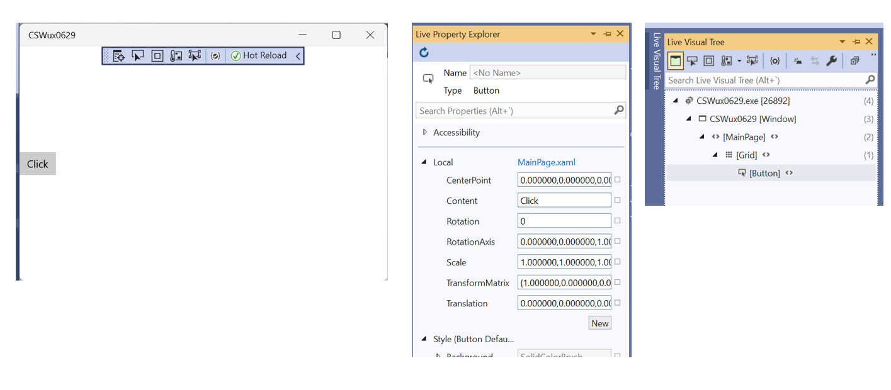

### Work required

* Scenario: Developers can use Xaml Islands without a Xaml Application
  * This would make it easier to use the Xaml Islands APIs.

## Keyboard Accelerators

### Accelerator scenarios

#### Scenario: Full-window island (existing)

The island occupies the whole client area of the window,
the host is Xaml's Window implementation which has nothing of its own
(caveat the custom title bar scenario)

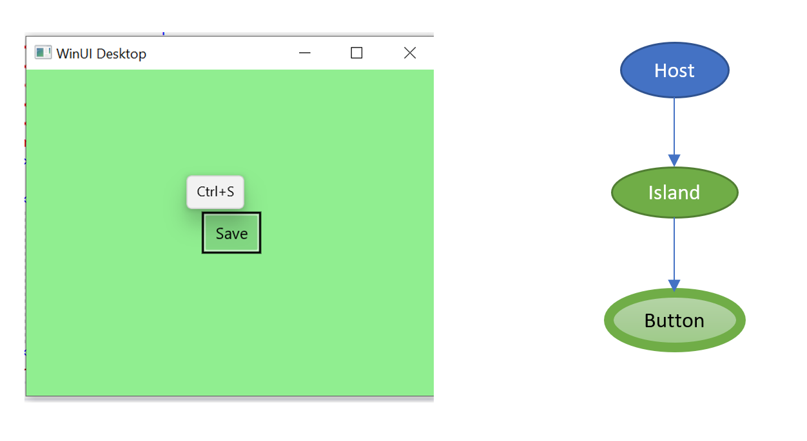

#### Scenario: Host and focused island accelerators (P1)

The host has accelerators (Control+O in the below image),
and the island has an accelerator (text box editing like Control+A).
The host accelerator is always available, the island accelerator is only available
when the island has focus (and even then, in this example, only when the text box is focused).

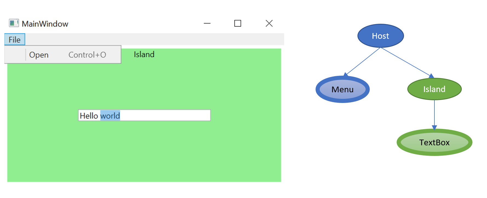

#### Two islands and a host with accelerators (P2)

There are two islands in this example, each with its own accelerator.
The host has an accelerator too.

Wherever focus is, the island Button accelerator should work.
For example if keyboard focus is on the TextBox, pressing Control+S should invoke Save.
Note however that if focus is on the Save Button, Control+A should not be invoked on the TextBox.

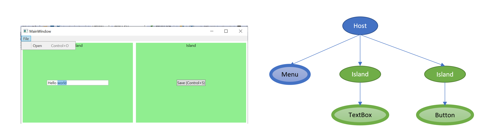


#### Island accelerators that should be out of scope (P3)

Sometimes accelerators at the root scope of an unfocused-island maybe shouldn't
be invoked. For example the button on the second tab of this example.

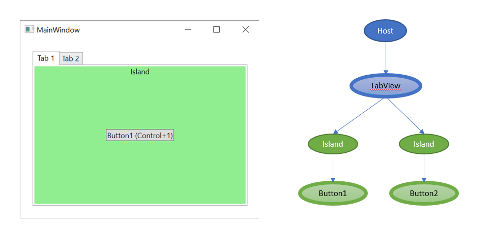

This scenario is a non-goal for now, but see the `IsEnabled` section.

### Background: Accelerators in Xaml (WinUI)

Keyboard Accelerators are specified in Xaml using the
[UIElement.KeyboardAccelerators](https://docs.microsoft.com/uwp/api/Windows.UI.Xaml.UIElement.KeyboardAccelerators)
property.

```xml
<Button Content="Jump" Click="Button_Click">
    <Button.KeyboardAccelerators>
        <KeyboardAccelerator Modifiers="Control" Key="J" />
    </Button.KeyboardAccelerators>
</Button>
```

In Xaml and WPF, accelerators are processed as part of input routing,
which is different than the Win32 accelerator tables (shown later).
So accelerators are invoked as input routes up the tree.

This example shows a mix of nested accelerators and key handlers and the order in which they're invoked.

```xml
<Grid>
    <Grid.KeyboardAccelerators>
        <!-- 5 -->
        <KeyboardAccelerator Modifiers="Control" Key="J" Invoked="GridAccelerator_Invoked"/>
    </Grid.KeyboardAccelerators>

    <StackPanel
        KeyDown="StackPanel_KeyDown"> <!-- 4 -->
        <StackPanel.KeyboardAccelerators>
            <!-- 3 -->
            <KeyboardAccelerator Modifiers="Control" Key="J" Invoked="StackPanelAccelerator_Invoked"/>
        </StackPanel.KeyboardAccelerators>

        <Button Content="Jump"
            KeyDown="Button_KeyDown"> <!-- 2 -->
            <Button.KeyboardAccelerators>
                <!-- 1 -->
                <KeyboardAccelerator Modifiers="Control" Key="J" Invoked="ButtonAccelerator_Invoked"/>
            </Button.KeyboardAccelerators>

        </Button>
    </StackPanel>

</Grid>
```

Xaml and WPF differ in that, for Xaml, accelerators have global scope (to the Xaml root).
For WPF this isn't true; an accelerator is only active if the 
[KeyBinding](https://docs.microsoft.com/dotnet/api/System.Windows.Input.KeyBinding)
is in the input route of the key event.

For example in the following Xaml case, even if keyboard focus is on the left button,
pressing `Control+R` will invoke the right button.

```xml
<StackPanel>
    <Button Content="Left">
        <Button.KeyboardAccelerators>
            <KeyboardAccelerator Modifiers="Control" Key="L"/>
        </Button.KeyboardAccelerators>
    </Button>

    <Button Content="Right">
        <Button.KeyboardAccelerators>
            <KeyboardAccelerator Modifiers="Control" Key="R"/>
        </Button.KeyboardAccelerators>
    </Button>

</StackPanel>
```

## Background: Accelerators in classic Win32

In classic Win32, accelerators are defined in your RC file, stored in a table,
and then at runtime you load the table into the thread using
[LoadAccelerators](https://docs.microsoft.com/windows/win32/api/winuser/nf-winuser-loadacceleratorsa).
Then in the message pump,
[TranslateAccelerator](https://docs.microsoft.com/windows/win32/api/winuser/nf-winuser-translateacceleratora)
is called to send a `WM_COMMAND` to the WinProc.

For example:

```cpp
hAccelTable = LoadAccelerators(hInstance, MAKEINTRESOURCE(IDC_...));

while (GetMessage(&msg, NULL, 0, 0))
{
  if (!TranslateAccelerator(msg.hwnd, hAccelTable, &msg))
  {
    TranslateMessage(&msg);
    DispatchMessage(&msg);
  }
}
```

An important key here is that the relative priorities of accelerators and keyboard messages. If a key down message
triggers an accelerator, the accelerator is dispatched and the keyboard input is not (since `TranslateAccelerator` finds
an entry in the table, it return `true` and `DispatchMessage` isn't called). So this is a fundamental behavior
difference between Win32 and Xaml/WPF. (What does WF do?)

### Background: Accelerators in Xaml islands

When a Xaml island has focus today, accelerators are invoked as part of regular input processing.
When an island is _not_ focused, acclerators are processed in the call
from the host to the `ContentPreTranslateMessage` function
during the message pump's pre-translate stage.

> In System Xaml, apps call `IDesktopWindowXamlSourceNative.PreTranslateMessage` instead of `ContentPreTranslateMessage`.

An unfocused Xaml island processes root accelerators during the `ContentPreTranslateMessage` call.
The focused Xaml island today ignores this and processes its accelerators when/if the keyboard input shows up.
This is due to Xaml's design that accelerators be processed as part of input routing.

> This means that accelerators in an unfocused island take precedence over
both accelerators and keyboard input in the focused island.

Misc notes:
* In the WPF/WF hosts, accelerators are processed during pre-translate, on WM_KEYDOWN.
* In Xaml, accelerators are processed as part of KeyboardInput.KeyDown.


### Accelerators design

> Non-goal: multi-key accelerators, like you can do in VS.

Rather than the `XamlSource` deciding on its own to process accelerators when `ContentPreTranslateMessage` is called,
the host will tell it when to invoke accelerators explicitly.
This API could either be on the Xaml Island, like WPF's
[IKeyboardInputSink.TranslateAccelerator](https://docs.microsoft.com/dotnet/api/System.Windows.Interop.IKeyboardInputSink.TranslateAccelerator):

```cs
bool TranslateAccelerator(key,modifiers);
```

Or (preferred), raised using the existing API (which would require some new API that the host could call):

[ExpKeyboardInput.AcceleratorKeyActivated](http://msdn.microsoft.com/library/Microsoft.UI.Input.Experimental.ExpKeyboardInput.AcceleratorKeyActivated)

The host can determine the order in which it calls the islands,
but if an island is focused it should be called first.

> **Design change:** 
When a _focused_ `XamlSource's` `TranslateAccelerator` or `AcceleratorKeyActivated` is called,
it should process its accelerators from the focused element up the tree,
rather than only looking at the root-level accelerators.
Otherwise an unfocused island's `Control+A` would override the Select-All
accelerator of the focused island's `ListView`.
Xaml's accelerator behavior should match this whether it's in an island or a top level XamlWindow.
This is a design change because in system Xaml, accelerators are processed as part of input routing.

The WPF host elements will coordinate such that accelerators are invoked in an
order that depends on where focus is:
* If focus is in WPF content, invoke normally (WPF routes up the element tree),
  then invoke `TranslateAccelerator` on each island (preferably in tree order).
* If focus is in an Island, invoke `TranslateAccelerator` on it first,
  then route through the tree normally from the point of the host element.

The WinForms element will ... <mark>TBD</mark>.

### Accelerators work

* Deliverable: XAML Islands for Shell - accelerator keys support

* Implement `XamlSource.TranslateAccelerator` API or move to handling `AcceleratorKeyActivated`
* Update XamlWindow case too to process accelerators before keyboard input
  * But _don't_ call when the host isn't the active window
* Call `TranslateAccelerator` from WPF host controls
* Call `TranslateAccelerator` from WinForms host controls
* Call `TranslateAccelerator` from MFC host controls


## Access keys (mnemonics)

An access key is different than an accelerator, although they overlap a lot,
which causes some confusion, particularly amongst developers.

**Accelerators** (aka keyboard shortcuts) typically correspond to a menu item
but can be invoked without opening the menu.
These are a power user feature to avoid having to lift your hands off the keyboard.

**Access keys** serve much the same purpose.
They use the `Alt` key as a modifier,
while accelerators typically use any other combination of modifiers.
(Xaml doesn't allow accelerators to use just `Alt` as a modifier for an accelerator.)
For example `Alt-S` in Outlook sends a mail, like clicking the Send button.
Access keys also have 'menu mode', where you can navigate a menu with the letters on the keyboard,
after a press/release of the `Alt` key.

The general scenario for access keys in islands are very similar to accelerators;
a Xaml Window, a Xaml island in a host, multiple Xaml islands in the host,
any or all of which could have access keys.

### Access key modes and scopes

Access keys generally have two modes or usages:
* "Dialog" mode
  * This was originally in Win32 a dialog feature, but now it's used in other UIs,
    especially forms scenarios
  * Pressing the `Alt` key shows visual "cues" (underlines)
  * Pressing `Alt` and the access key invokes it.
    For a button this usually means clicking the button.
    For a text label this usually means focusing the text box or other input control
    next to the label.

* Menu mode
  * Pressing and releasing the `Alt` key focuses the menu and underlines the menu bar's access keys
  * Submenus similarly have access keys
    (scoped to each menu, so there can be duplication between menus)
  * Pressing the access key typically invokes the menu item
  * Ribbon has the same behavior as a menu in menu mode

Note that Xaml access keys _only_ support menu mode (more on this later)

This WPF example demonstrates both the dialog and menu modes.
In this first screenshot the user has pressed (but not released) the `Alt` key,
and the underlines now visualize the four available access keys for
File, Edit, Left, and Right.
(Pressing `Alt+L` will focus the text box, pressing `Alt+R` will click the right button,
pressing `Alt+F` will open the File menu.)

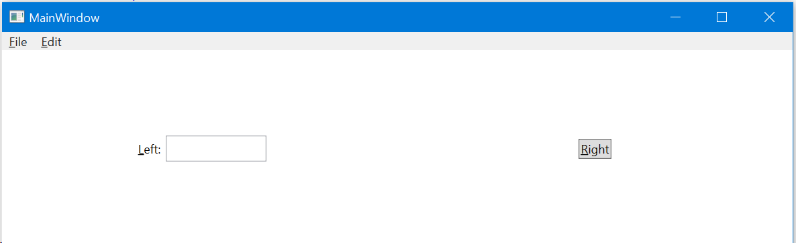

Now, instead, the user presses `Alt+F` or `Alt,F`, opening the File menu.
Now the user can type 'O' or 'X' to access those two File menu items.
The user _cannot_ type 'L' or 'R' anymore, but can use the arrow keys to move around the menus.

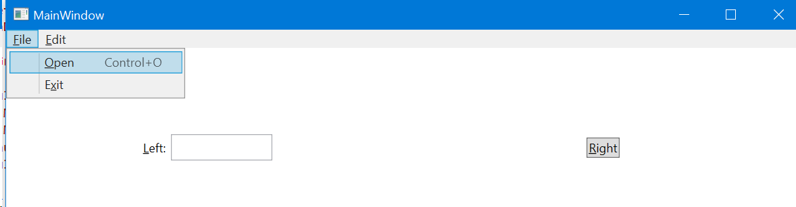

The target scenarios are then the same as for Accelerators,
the classic case being that of a host with multiple islands,
any or all of which could have access keys.

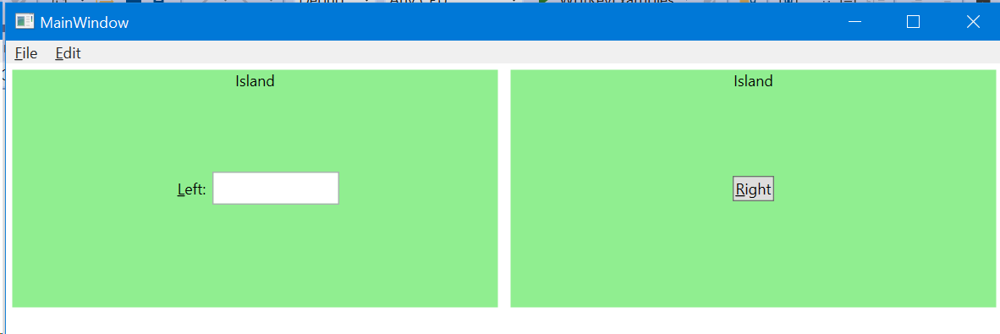

Access keys have scopes. The page is a global scope, such as you'd see on a form.
Dialogs are a scope, and menus (and submenus) are a scope.
The same access key being used in different scopes isn't a conflict.
When in an inner scope, the outer scope's access keys are not available.

### Access key duplication

When two controls in the same scope have the same access key,
pressing the key focuses the item, rather than invoking it.
For example in this WPF code, repeatedly pressing `Alt+C` simply moves
focus back and forth between the two buttons, it doesn't invoke anything:

```xml
<Button Content="_Click" />
<Button Content="_Clack" />
```

### Access chords and key tips

An alternative to menus is a Ribbon. For example in Word:

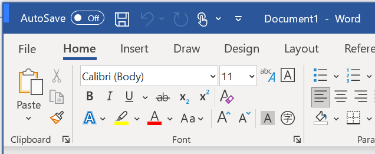

This introduces a couple of problems for access keys:
* The "commands" (buttons and such) don't always have a lable on which to underline a letter
* There can be a lot of commands visible at once, and you start to run out of room in the alphabet

The solution is to show the keys as tooltips ("key tips"), and allow allow multi-letter access keys.

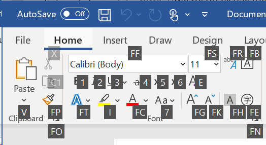

This looks at first like a whole new model, but it's actually almost identical for access keys.
Walking through an example, first the user presses and releases `Alt`.
This shows key tips that let you pick which tab will be shown.

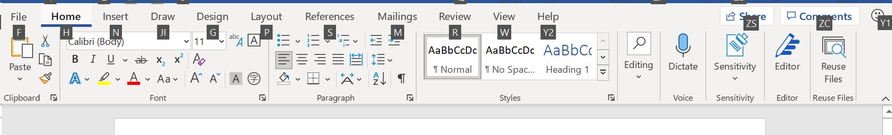

Press 'H' and now you've selected the Home tab,
and it's showing the key tips for all the commands on that tab.
(You can get here in one step by pressing `Alt+H` rather than `Alt,H`.)

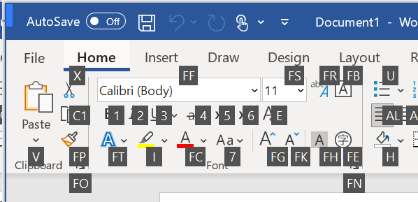

Now press `F`, and you see all the access keys that begin with an "F".

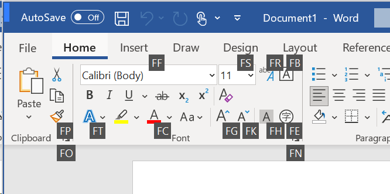


Press `F` again and now you've moved focus to the Font Family control.

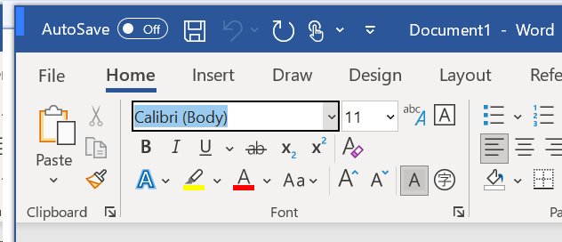


That looks very different from menus, but logically it's equivalent to a menu UX;
whether a Ribbon or a menu, this key sequence gets you to this font family selector:
`Alt,H,F,F` (or `Alt+H,F,F`).

There are some observable differences between menus and ribbons to a user of a screen reader;
you can use arrow keys to navigate the ribbon as it appears visually, which is different from a menu.
But this access key behavior is unchanged.

### Dismissing keyboard cues

When the user presses `Alt`, keyboard cues should be displayed.
When the user takes an action they should be removed again.
Sometimes, keyboard cues should always be displayed
(determined by the Shell, for example when the app is launched using the keyboard).

### How Xaml access keys are different from traditional desktop apps

Xaml's access key experience differs from traditional desktop apps in two ways:
* Visualized with key tips
* There's only menu mode; buttons on the page behave like menu items.

For example, the following shows a Xaml window after pressing and releasing `Alt`;
unlikely traditional Desktop behavior, both the top level menus and the button
can be invoked by pressing a letter.
But _like_ traditional desktop apps, pressing `Alt+F` or `Alt+E` will open menus,
and pressing `Alt+C` will click the button.

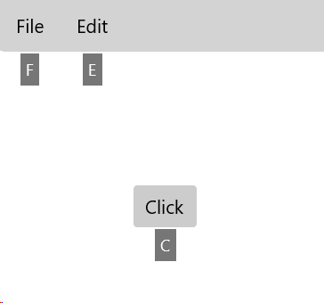

### Access Key Xaml details

In Xaml, access keys are processed as part of
[InputKeyboardSource.SystemKeyDown](http://msdn.microsoft.com/library/Microsoft.UI.Input.Experimental.ExpKeyboardInput.SysKeyDown)
or [InputKeyboardSource.CharacterReceived](http://msdn.microsoft.com/library/Microsoft.UI.Input.Experimental.ExpKeyboardInput.CharacterReceived).  Search Xaml for `add_SystemKeyDown` and `add_CharacterReceived` to see it in the code.
(In WPF, access keys are processed similarly as part of WM_SYSCHAR, in PreTranslateMessage.)
Access keys can't be intercepted as part of input routing
(the key events aren't seen, or are seen after the access key has been invoked).

System `DesktopWindowXamlSource` today only processes access keys on the focused island.
There's no API for the host to trigger the island to do access key processing,
and the Source only does out-of-focus _accelerator_ processing today in PreProcess.

WPF/WinForms notes:
* When WPF goes into menu mode, it inserts itself at the front of the preprocess-message handlers
  (HwndSource.OnEnterMenuMode).
* But WPF exposes
  [InputManager.IsInMenuMode](https://docs.microsoft.com/dotnet/api/System.Windows.Input.InputManager.IsInMenuMode)
  (plus events) which allows XamlHost to notify the XamlSource to go into menu mode.
* A WPF element can get its Window by calling
  [Window.GetWindow](https://docs.microsoft.com/dotnet/api/System.Windows.Window.GetWindow)
  on itself.
* A WF control can get its From by calling 
  [Control.FindForm](https://docs.microsoft.com/dotnet/api/System.Windows.Forms.Control.FindForm)
  on itself.

### Access Key Requirements

Across all islands and their host:
* Pressing an access key (`Alt`+`letter`) will invoke its target,
  whether that access key is in a host or island, whether the host/island is focused or not.
  * Access key targets in an island will only be invoked if the island is in the host's current scope.
  * For example, while in a host menu, an island in the page content will not be invoked for access keys.

* If there are conflicting access keys, targets will be focused rather than invoked.
  Repeatedly pressing the key moves focus through all the matching targets.

* Press/release `Alt` puts host and all islands into menu mode
  * In menu mode, Xaml makes all of root scope available
  * Includes key tips

Non-goal:
* Dialog mode. So there's no need to support showing a key cue on `Alt` down

### Access keys design

#### New APIs

```cs

// Host calls this when user has pressed/released Alt key somewhere
// Xaml will show root key tips for this
// ?? Nesting? WPF has [InputManager.PushMenuMode](https://docs.microsoft.com/dotnet/api/System.Windows.Input.InputManager.PushMenuMode)
public void EnterMenuMode();
public void LeaveMenuMode();

// Host calls this on an island to if it has one or more handlers for this access key
public int GetAccessKeyCount(key);

// User has pressed Alt+S, this island returned one for GetAccessKeyCount("S"),
// and every other island returned zero, and host also has none
public void InvokeAccessKey(key);

// User has pressed Alt+S, and there are multiple handlers for the "S" key.
// There could be one or more in this island, one or more in other islands, plus the host.
// If the user presses Alt+S again, this island might be called again with index+1
public void NavigateFocusToAccessKey(key, index);
```


**Non-goal**, because Xaml only supports menu mode:

```cs
// Tell the island to show key cues (Xaml would ignore this because it only uses key tips)
// This might be called by the host on startup and never cleared
public void ShowKeyboardCues(bool);

// Raised by an island when it thinks cues should be removed, based on input
// ?? Is there a way the host could figure this out and drive?
public event EventHandler KeyboardCuesCompleted;
```


#### Phase 1

Scenarios:
* Xaml app (Xaml running the pump), multiple windows per thread
* Multiple islands, any island or host having access keys (non conflicting)

Existing code:
* Top level focused Xaml window goes into menu mode and handles `Alt+Key`
* Focused Xaml island behaves the same way, unless key input is intercepted by the host
  * WPF does this, <mark>WF does too?</mark>
  * (This is the desired behavior for 1.0; all access keys are in a host menu)

[task]
Tasks:

* Implement `EnterMenuMode` in Xaml
  * Xaml shows access keys at the same time the host is showing its menus
  * Call this in WPF host based on
    [InputManager.EnterMenuMode](https://docs.microsoft.com/dotnet/api/System.Windows.Input.InputManager.EnterMenuMode)
  * Call this in WF based on ?

* Implement `GetAccessKeyCount` and `InvokeAccessKey` in Xaml
  * Support for `Alt+Letter` case
  * Remove current Xaml code that invokes menu mode
  * This wouldn't be enough yet to support the duplicate access key scenario

* Call `GetAccessKeyCount` and `InvokeAccessKey` in hosts
  * Implement in WPF host using
    [HwndHost.OnMnemonicCore](https://docs.microsoft.com/dotnet/api/System.Windows.Interop.HwndHost.OnMnemonicCore)
    to determine when to call this on `XamlSource`
  * Implement in WF host using ?
  * Implement in Xaml Window, porting the code from existing Xaml


#### Phase 2

_WIP_

* Create a mode of Xaml where its access keys look and behave like existing frameworks
  * So access keys on the form are underlined and displayed on key down
  * At this point Xaml responds to `ShowKeyboardCues` etc

* Handle access key conflict scenario

### Task
* Deliverable: XAML Islands for Shell - access keys support

## Xaml Application object

In a Xaml application there is always a Xaml
[Application](https://docs.microsoft.com/uwp/api/Windows.UI.Xaml.Application)
object.
An important feature of this class is that it implements
[IXamlMetadataProvider](https://docs.microsoft.com/uwp/api/Windows.UI.Xaml.Markup.IXamlMetadataProvider)
(aka IXMP).
The implementation of this interface is generated by the Xaml Compiler and
written to the app's code behind
(XamlTypeInfo.g.cs/cpp in the app's obj directory).
So the app author has a class named App.xaml.cs,
but they don't realize that much of the implementation of it is in their App class.

The purpose of IXMP is to create objects, set properties, attach event handlers, all on behalf of the
runtime Xaml parser.
It does the things that the app can do but the parser cannot (things that can be done with reflection).
It's implemented on the App object because it's something the parser knows how to find,
since there's only one, and there's a global static API that gets it
([Application.Current](https://docs.microsoft.com/uwp/api/Windows.UI.Xaml.Application.Current)).

For example, the XamlCompiler generates code so that the app's `App` class implements IXMP:

```cs
public partial class App : global::Windows.UI.Xaml.Markup.IXamlMetadataProvider
{
  ...
```

Using that, the parser can call
[IXamlMetadataProvider.GetXamlType](https://docs.microsoft.com/uwp/api/Windows.UI.Xaml.Markup.IXamlMetadataProvider.GetXamlType)
to get an `IXamlType` given the type's name, then
[IXamlType.ActivateInstance](https://docs.microsoft.com/uwp/api/Windows.UI.Xaml.Markup.IXamlType.ActivateInstance)
to get an instance of the type.

### Problem with the Application in islands

The problem in islands is that it doesn't make sense for there to be an "app";
islands are components in some host app.
You shouldn't have both a WPF app and a Xaml app.
But because of IXMP we currently require a Xaml Application object that implements IXMP,
which makes it too difficult and messy to use Xaml islands.

### IXMP Design

Rather than rely on the App object to implicitly provide IXMP
it will now be possible to register an IXMP explicitly.
Calling Register more than once will be an error.
Calling Register after app startup will be an error.

```cs
public sealed class WindowsXamlManager : IClosable
{
    // Existing
    public void Close ()
    static public WindowsXamlManager InitializeForCurrentThread ()

    // New
    void RegisterMetadataProvider(IXamlMetadataProvider provider);
}
```

### IXMP work

* Design+implement replacement API for IXamlMetadataProvider not tied to XamlApplication
* Implement IXamlMetadataProvider replacement API in Xaml compiler codegen

* Add API to [WindowsXamlManager](https://docs.microsoft.com/uwp/api/Windows.UI.Xaml.Hosting.WindowsXamlManager)

* Update Xaml loader to use the registered IXMP, but fall back to App if none is registered
  * After app startup, calling Register is an error

* <mark>??</mark> Build targets so that e.g. a WPF/WF app can generate the call sites.


## Special keys

WPF and/or WinForms have logic where tabbing-related input is intercepted at the message pump level,
and not routed or dispatched to the focused element.
In the case of Xaml islands, that means that the host is blocking keyboard input to the focused island.
That made it impossible to tab out of a Xaml island (it was never seeing the tab key).

So Xaml islands today require the host to hook it into the message pump,
by calling `ContentPreTranslateMessage` before this handling
(presumably, in the thread's message pump, prior to calling
[TranslateMessage](https://docs.microsoft.com/en-us/windows/win32/api/winuser/nf-winuser-translatemessage).)

The special keys handled are:
* `Tab`
* `Left`
* `Right`
* `Up`
* `Down`

> Note for System Xaml, apps call a function named IDesktopWindowXamlSourceNative.PreTranslateMessage
instead of ContentPreTranslateMessage.  [docs](https://learn.microsoft.com/en-us/windows/win32/api/windows.ui.xaml.hosting.desktopwindowxamlsource/nf-windows-ui-xaml-hosting-desktopwindowxamlsource-idesktopwindowxamlsourcenative2-pretranslatemessage)

**System Xaml**

If one of these keys appears in the call to the system XamlSource's `PreTranslateMessage`,
it does a SendMessage to its input hwnd,
to allow it to be processed normally (not get intercepted by the host).

```cpp
if (isFocusMessage) // Tab/Left/Right/etc
{
    if (!hasFocus)
    {
        return S_OK;
    }

    auto result = ::SendMessage(inputWindow, message->message, message->wParam, message->lParam);
    if (result == 0)
    {
        *pValue = TRUE;
    }
}
```

### Special keys design

> We removed the design in this section because it's outdated.  See git history if you're curious.

## Nested message pumps

If you open Visual Studio and create a new WinUI3 app, you'll have what we call a 
WinUI3 Desktop app.  It's a simple single-Window app with Xaml content inside.
There's code in App.Xaml.* to create the Window, and a `Main` method generated
by the XamlCompiler to run the pump (the pump runs inside `Application.Start`):

```cs
protected override void OnLaunched(Microsoft.UI.Xaml.LaunchActivatedEventArgs args)
{
    m_window = new MainWindow();
    m_window.Activate();
}
```

```cs
static void Main(string[] args)
{
    global::WinRT.ComWrappersSupport.InitializeComWrappers();
    global::Microsoft.UI.Xaml.Application.Start((p) => {
        var context = new global::Microsoft.System.DispatcherQueueSynchronizationContext(global::Microsoft.System.DispatcherQueue.GetForCurrentThread());
        global::System.Threading.SynchronizationContext.SetSynchronizationContext(context);
        new App();
    });
}
```

From here, you can create a second Window if you wish.  Apps might try running a second window
in a nested message pump, like a Win32 modal dialog, but this is not something we recommend
and it will likely not work well.

For System Xaml, nested message pumps aren't possible in UWP apps because:
* GetMessage/PeekMessage/DispatchMessage APIs aren't available in UWP
* The roughly equivalent [CoreDispatcher.ProcessEvents](https://docs.microsoft.com/uwp/api/Windows.UI.Core.CoreDispatcher.ProcessEvents)
  method fails if you call it simultaneously on the same thread.
* The ASTA threading model mostly prevents a thread from going into what is esesentially a nested pump (a MsgWait)
  while waiting for a response to a COM call.

Nested pumps enable reentrancy issues.
For example, while a message is being procsssed, the code goes into
a nested pump, and  a new unrelated message comes in which also gets processed.
Now the call stack is processing two messages simultaneously, but the code isn't necessarily written to handle the case.
There's opportunity for reentrancy issues both in the app and in frameworks like Xaml.

In Desktop apps such as Win32, WPF, WinForms you can run a nested pump, and it's a common programming pattern.
For example, in the middle of an operation, deep in a call stack, you need to ask the user a question.
An easy/common pattern in these frameworks is to show a MessageBox,
which goes into a nested pump so that the Show() method doesn't return until the interaction is complete.
That way you don't have to unwind your call stack, show the dialog, then try to get back into the right context.

Async programming (the await` or `co_await` keywords) tries to solve this same problem, without the nested pump,
by capturing and than re-creating the call stack. But that pattern has its own complications, and it's
too difficult or unnatural for many programmers.

### Nested pumps in Xaml today

System Xaml has been mostly isolated from this because UWP blocks it.
But system Xaml running in an island _is_ exposed to it today.
For example [this Xaml island sample walkthrough](https://docs.microsoft.com/en-us/windows/communitytoolkit/controls/wpf-winforms/windowsxamlhost)
creates a nested pump by running a `MessageBox` dialog in the call stack of the WPF host's message pump:

```cs
private void Island_Click(object sender, Windows.UI.Xaml.RoutedEventArgs e)
{
    MessageBox.Show("This is a UWP button.");
}
```

(The preferred way to show a message dialog in Xaml is to use
[ContentDialog](https://docs.microsoft.com/uwp/api/Windows.UI.Xaml.Controls.ContentDialog)
and it's async mechanism).

Nested pumps aren't entirely new to the Xaml code base either.
* The Xaml code has its origins in Silverlight, which supported nested pumps
  (such as [MessageBox](https://docs.microsoft.com/en-us/previous-versions/windows/silverlight/dotnet-windows-silverlight/ms602949(v=vs.95))),
  though likely there are issues.
* Xaml also has origins in WPF, which as mentioned supports nested message pumps
  (and likely there are also issues there).
* And in both Silverlight and WPF the code is running on an STA thread,
  which is more prone to message reentrancy than an ASTA thread.

### Two sides to a nested pump

There are two sides to a nested pump: **nesting** and **nested**.
Nesting is when you run a pump, nested is when you're running in a nested pump.

In this stack, the outer pump is nesting, the inner pump is nested:

```cs
NestedFunction()
ProcessEvents() // Inner pump (nested in an outer pump)
NestingFunction()
ProcessEvents() // Outer pump (nesting an inner pump)
```

### Xaml issues with nested pumps

#### Xaml running in a nested pump

This is the case where Xaml is _not_ on the stack when a nested message pump is running.

> _Xaml code has little trouble being nested_

For example if a WPF app runs a Xaml island in a MessageBox,
Xaml will be running in a nested pump, but will be unaware and should not be ill affected.

There are restrictions on CoreMessaging and lifted input, however, that impact Xaml when nested.
So Xaml code not having an issue doesn't mean the full Xaml Island stack works.

> _Xaml Window is more complicated_


#### Running a nested pump within Xaml

This is the case where Xaml _is_ on the stack when a nested message pump is running.

The problem Xaml has with nesting a pump is that that can bringing in reentrant messages.
For example, the outer pump invokes Xaml's WinProc with a message,
it goes into a nested pump, which sends a different message to the same WinProc.

This is a problem no matter what is otherwise running in the nested pump,
but it could even be Xaml itself in the nested pump.
This would result in two independent Xaml stack frame sets running on the same call stack.

For example the following call stack shows Xaml in the middle processing an input message,
and then at the same time processing a second unrelated input message.
The inner `HandleKeyDown` might alter state in the `InputManager`
in a way unexpected by the outer `HandleKeyDown` when the call stack returns to it.

```cs
...
HandleKeyDown // Input manager
ProcessEvents
MessageBox.Show
... app code ...
InvokeButtonClick
HandleKeyDown // Input manager
ProcessEvents 
```

The inner pump could even allow the user to click a button that's already
being clicked in the outer pump.
The Button code might not be able to accommodate that today,
nor any number of button click handlers.

> So the scenarios where Xaml is at risk of a nested pump issue is when it calls out to the app,
and the app goes into a pump (calls WPF `MessageBox` for example).

#### Hardening Xaml to nesting of pumps

Any time Xaml raises an event it's at risk of reentrancy, because the event handler can call back to the sender.
So Xaml is already exposed to a lot of reentrancy.

Silverlight tried to deal with this by never calling out to the app synchronously.
For example, when the FocusManager moves focus it raises `GotFocus` and `LostFocus` events,
but in Silverlight those would get queued (posted) until after the FocusManager completed the focus change.
It became problematic, though, because it led to a programming model that was difficult for app code.
For example, an app would call `Focus()`, but when it returned, the app's `GotFocus` handler hadn't been run yet.
So over time Silverlight allowed more and more reentrancy, and that has continued in the current Xaml code.

What's significant about nested pumps is the _kind_ of reentrancy it causes;
calls into Xaml that originate with windows messages.
For example:
* Input
* Theme changes?
* <mark>??</mark>

So the way to harden Xaml and ensure it doesn't have issues with nesting of a pump
is to ensure that any time it calls out to the app, it's in a known reenter-able state.

Xaml currently doesn't support nesting, and has some detection in place to block it.
During the processing of the following messages,
if the WinProc is called again with one of these messages, it will fail fast:
* `WM_INTERNAL_TICK`
* `WM_APPLICATION_STARTUP_EVENT_COMPLETE`
* `WM_SCRIPT_SYNC_CALL_BACK`
* `WM_EXECUTE_ON_UI_CALLBACK`

The `WM_SCRIPT_SYNC_CALL_BACK` is an implementation detail in the core layer of Xaml event raising code.
This is used mostly for input events, meaning that it detects if input comes in to the thread in
the process of handling another input.
So nested input will fail fast.

### Other issues with nested message pumps

It may not be enough for just Xaml to be hardened for message pump nesting.  Other WinAppSDK components
that Xaml depends on, like the input, composition, and content APIs, may also need to be hardened.

### Nested pump scenarios

* An app calls `GetMessage`/`DispatchMessage` with Xaml on the call stack
  * I.e. nesting a pump within Xaml
  * E.g. modal dialogs such as the `MessageBox` APIs and comctl dialogs.

* Cross apartment COM calls from a Xaml stack
  * Since non-UWP apps run on an STA thread, rather than ASTA,
    while waiting for a response to a COM call the thread is in a nested pump.

* The implementation of .Net's
  [Monitor.Enter](https://docs.microsoft.com/dotnet/api/System.Threading.Monitor.Enter),
  -- which is the implementation behind the C# `lock` keyword -- runs a nested pump.
  (This can be disabled though, which WPF frequently does on  UI threads.)

Note that if an app finds itself in a situation where it needs to show a modal dialog,
but it's in a call Xaml call stack that doesn't support it,
there is a workaround where the app does some async code.
But CoreMessaging might not support this.
For example:

```cs
this.DispatcherQueue.TryEnqueue(() =>
{
    MessageBox.Show("Hello world");
});
```

### Nested pump design notes

> 2024 December: This work has not been prioritized.

#### Xaml in a nested pump

* Task: Nested message pump design/Prepare Xaml for running inside a nested message pump
* Deliverable: XAML Islands for Shell - run inside nested message pump

If CoreMessaging is updated to allow nested pumps,
add test coverage to Xaml for the nested case.
For example, show a Xaml dialog from WPF code and go into a nested pump until it completes.

#### Xaml nesting a pump

* Reentrancy guard to protect against Xaml nesting a message pump
* XAML Islands - Host a nested message pump

To harden Xaml against nested pump issues, harden areas of the Xaml code that
are triggered by windows messages:
* Input
* Everything that handles input
* ... ??


## Tab navigation

In System Xaml and as of WinAppSDK 1.6, we you will need to use the `DesktopWindowXamlSource` to create your xaml island
because the `XamlIsland` API is not yet available.  Here's how tab navigation works for `DesktopWindowXamlSource`:
* When the host wants to move keyboard focus to an island
  (for example when focus is on the element preview to the island and the user presses `tab`),
  it calls
  [DesktopWindowXamlSource.NavigateFocus](https://docs.microsoft.com/uwp/api/Windows.UI.Xaml.Hosting.DesktopWindowXamlSource.NavigateFocus)
* When the `XamlSource` wants to give keyboard focus back to the host
  (for example when focus is on the last island element and the user presses `tab`),
  it raises the
  [DesktopWindowXamlSource.TakeFocusRequested](https://docs.microsoft.com/uwp/api/Windows.UI.Xaml.Hosting.DesktopWindowXamlSource.TakeFocusRequested)
  event.

When the XamlIsland API is fully available, we will recommend apps use these APIs instead (which will have the same
behavior):
* `InputFocusNavigationHost.NavigateFocus`
* `InputFocusNavigationHost.DepartFocusRequested`

There's also a
[GotFocus](https://docs.microsoft.com/uwp/api/Windows.UI.Xaml.Hosting.DesktopWindowXamlSource.GotFocus)
event and a
[HasFocus](https://docs.microsoft.com/uwp/api/Windows.UI.Xaml.Hosting.DesktopWindowXamlSource.HasFocus)
property.

2D navigation is currently a non-goal.
An example of 2D navigation would be an element in the host having focus,
and the user presses DPad right, towards an Island.
Tab navigation moves focus to the first tab stop in the Island,
2D navigation moves focus to the tab stop in the island that's at the
approximately same root Y offset.
More information:
[2D directional navigation for keyboard](https://docs.microsoft.com/en-us/windows/apps/design/input/focus-navigation#2d-directional-navigation-for-keyboard).


## Popups

Popup work isn't specific to islands and is tracked separately.


## IsEnabled

<mark>TBD</mark>

(The Host should be able to disable an island,
for example if WPF is hosting and IsEnabled is set to false in the tree.)


## Input routing / Scroll-chaining

<mark>Interesting?</mark>

Scenario: keyboard focus is in an island, the island is in a scroller of the host, and the user presses page-up.

There's no support for that scenario today.
We could support it by allowing an island to notify of unhandled input.
Conceptually, the island calling DefWinProc would route to the parent hwnd.
For example we could expose the InputSite or some of its events/args from the XamlSource.


## Random Xaml details

* Multiple windows on a thread doesn't create multiple cores (CCoreServices);
it's still one core just as in the multi-island case.

* When there are multiple islands/windows on a thread, there's still one Xaml tree internally,
similarly one focus manager and input manager and access key manager (AccessKeyExport).

* Accelerator handling depends on the order that the host calls PreTranslate
  * (Appears to have a bug if there are conflicts where the focused island gets preempted.)

* Mnemonics (access keys) are only processed for the focused island, plus the host
  * In WPF only the host mnemonics are working.
  * So works for example if you have mnemonic-free islands in a WPF app that has a menu across the top.

* On the same thread, Xaml objects can be moved between islands (it's all one tree internally),
  and shareable objects (like brushes) can be shared between islands.
  * Exception: AcrylicBrush (and RevealBrush?) can only be used in one island (just the first?).


## Archive: Multiple windows (islands) on a thread

Multi-window (same thread) and multi-island (same window) overlap a lot.
This section talks about multi-window.
The additional issues for multi-islands are things like accelerators and access keys,
which are covered in other sections.

A basic scenario: creating a new window on the current thread in response to a Button.Click:

```csharp
private void OpenNewWindow(object sender, RoutedEventArgs e)
{
    var window = new Window();
    window.Content = new TextBlock() { Text = "Hello world" };
    window.Activate();
}
```

Running multiple windows on the same thread creates the risk that when one window
hangs the others will hang as well. That's the appeal of running separate windows
on separate threads, though apps that take advantage of that don't necessarily
test the scenario well.

An appeal of running all your windows on a single thread is that it's easier to 
get "back onto the UI thread". This has been common feedback on UWP apps, where
it's not possible to run multiple windows on a thread.

For example, initialize a global in your app startup:

```csharp
public App()
{
    this.InitializeComponent();
}

static internal DispatcherQueue DQ = DispatcherQueue.GetForCurrentThread();
```

And then you can get back onto the UI thread from a notification that raises
on the MTA thread:

```csharp
(new Geolocator()).PositionChanged += (_, __) =>
{
    App.DQ.TryEnqueue(() =>
    {
        MainWindow.Instance.UpdatePosition();
    });
};
```

### Multi-window design notes

The primary difference between the single window case and multi-window case
is that ultimately there are now two hwnds.
So code will be broken if an assumption is made that there's a single hwnd.

The Xaml code is already running as an island and so not taking any dependencies on CoreWindow.
The underlying hwnd is also already mostly unavailable, for example CJupiterWindow has no hwnd.
But in the Desktop window case, JupiterControl (DXamlCore::GetControl) _does_ have an hwnd (where does this get used??)

### Multi-window work required

#### Ideas for future work

* Enumerate windows
  * Like WPF's 
    [Application.Windows](https://docs.microsoft.com/dotnet/api/System.Windows.Application.Windows).

* Main window
  * Do we need a main window concept like WPF's
    [Application.MainWindow](https://docs.microsoft.com/dotnet/api/System.Windows.Application.MainWindow)?
  * In WPF, the significance of the `MainWindow` is that closing it shuts down the app if
    [Application.ShutdownMode](https://docs.microsoft.com/dotnet/api/System.Windows.Application.ShutdownMode)
    is set to `OnMainWindowClose`.
  * Does `AppWindow` have a main window concept?
  * Win32/hwnd does not have a formal concept, just a typical pattern.
  * Multi-threaded windows (windows on separate threads)
    * Need to create a core when you 'new' a Window on a new thread

* Issues/bugs to be fixed:
  * Page.AppBar (or cut?)


## Archive: Multiple windows on multiple threads

_Potential future work_

This creates a new Xaml Window on a new thread in a UWP app (UWP is only supported in System Xaml):

```CS
_ = CoreApplication.CreateNewView().DispatcherQueue.TryEnqueue(() =>
{
    // This code runs on the new thread
    Window.Current.Content = new TextBlock() { Text = "Hello" };
    Window.Current.Activate();
});
```

To create a new Window on a new thread in a Desktop app, create the thread and run a message pump on it:

```CS
var controller = DispatcherQueueController.CreateOnDedicatedThread();
controller.DispatcherQueue.TryEnqueue(() =>
{
    Window window = new Window();
    window.Content = new TextBlock() { Text = "Hello" };
    window.Activate();
    window.Closed += (_, __) => window.DispatcherQueue.InvokeShutdown();

    var syncContext = new DispatcherQueueSynchronizationContext();
    SynchronizationContext.SetSynchronizationContext(syncContext);

    Thread.CurrentThread.SetApartmentState(ApartmentState.STA);
});
```
