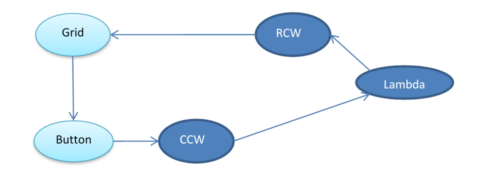
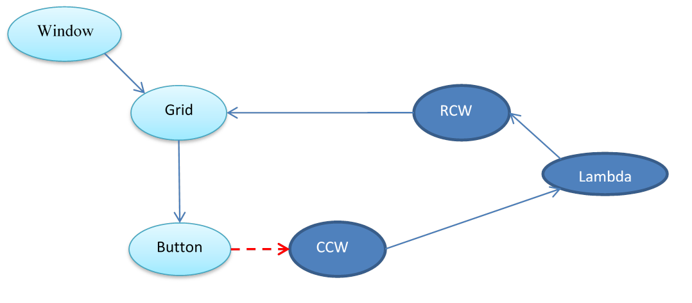
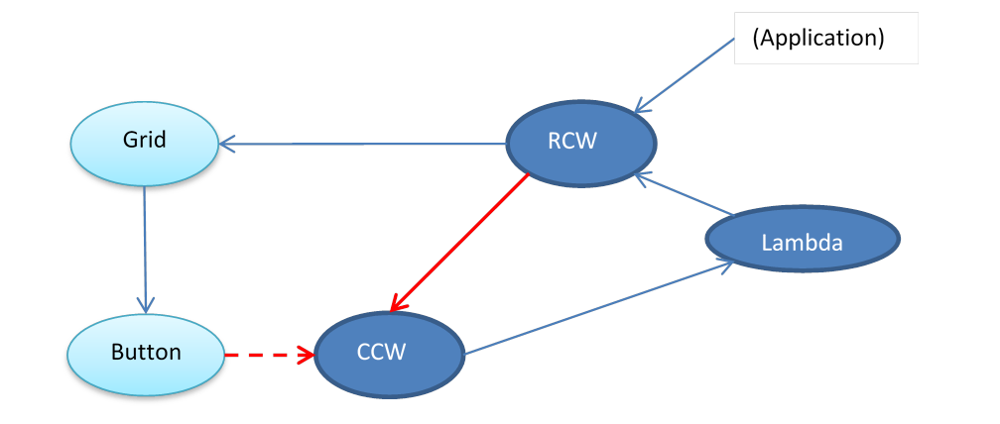
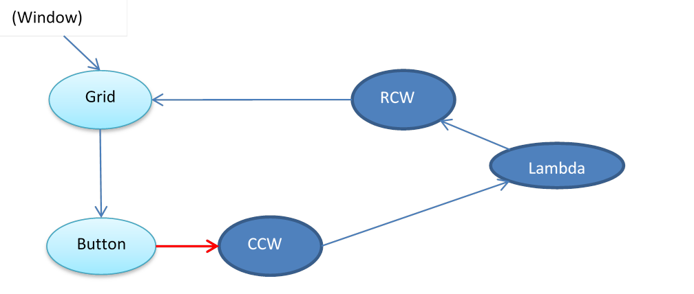
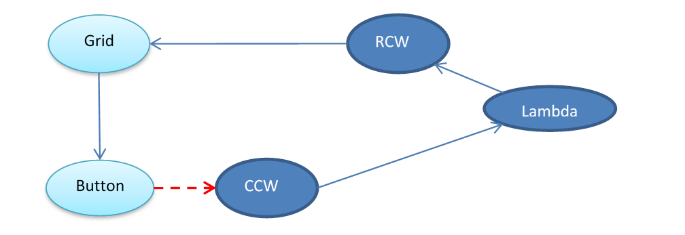

# Xaml/C\# Object Lifetime Design

## Table of Contents

- [Overview](#overview)
- [The problem](#the-problem)
- [The solution](#the-solution)

That document describes the basic approach, and then design and implementation details.
The portion below is a subset of that document

##	Overview

In a C++ Xaml application, reference cycles typically cause memory leaks.  Each object in the cycle has a ref count of at least one, so even when nothing in the application or system is referencing the objects any longer, none of them go away.

Leaks can be avoided with appropriately placed weak references, and Xaml provides the DisconnectChildrenRecursive API to help.  But cycles are really easy to create inadvertently, more so now with lambda capture, and nearly impossible to debug.
Leaks from cycles has been an issue since the beginning of COM, so this isn't an unexpected problem in a C++ application.  However, in a .Net application, there is no such problem, because the garbage collector doesn't get confused by cycles.
Consequently, a developer creating a UWP application in C# doesn't expect to have to worry about leaks.  A UWP C# application, though, isn't .Net, as the Windows runtime is written to WinRT (which is built on COM).  So even in C#, creating a cycle that involves at least one WinRT object will leak by default.

Since it's particularly easy to create cycles involving Xaml objects, which are WinRT objects, Xaml has been integrated into the CLR's GC.  So despite Xaml being in WinRT, if a C# app creates a cycle that only involves C# objects and Xaml objects, the cycle won't cause a leak.

##	The problem

C# applications use the Garbage Collector to avoid cycle-induced leaks, but GC only works if it understands all inter-object references and static (root) references.  Roots and references are known by GC for C# objects, but not for WinRT objects.
This is a sample of code that creates a cycle between C# objects and WinRT objects:

```cs
var grid = new Grid();
var button = new Button();
grid.Children.Add(button);
button.Click += (s, a) => { grid.ToString(); };
```

… creating this object graph:


(An RCW is a Runtime Callable Wrapper; a CLR object that acts as a proxy to a WinRT object.  
A CCW is a Com Callable Wrapper; a COM object that acts as a proxy to a CLR object.)

Notice that nothing is referencing this set of objects; the application isn't referencing any of the C# objects, and the Xaml framework isn't referencing any of the Xaml objects.  Using the standard COM interop, this cycle would leak.  

To understand why, a quick description of how garbage collection works.   
The basic algorithm of a GC system:
1.	Go to every object in the process and clear a flag.
2.	From every “root” object, set the flag, and walk the transitive closure of every object that it references, setting the flag on each one.
(A “root” object in a C# application is any static field or stack variable.)
3.	Go to every object again, and if the flag isn't set, delete the object.

In the CLR's standard COM interop, the CCW is a root.  So in the above diagram it keeps the lambda alive, which keeps the RCW alive, which keeps the Grid alive (via a COM ref), which keeps the Button alive.  That is, all the C# objects in the above diagram get their flag set, indicating that they're reachable from a root, and thus protecting them from being deleted by GC.  So there's no external references to any of these objects, but they don't ever get GC'd.
This leak could be fixed by weakening the reference to the CCW.  For example, update that in the above example (and also add the Grid to the main Window):



But now there's a new problem; a premature collection.  That is, since there's no COM ref on the CCW, it will be deleted.  And then since nothing is protecting the Lambda, it will be collected by GC, which will allow the RCW to be collected.  Now the Grid and the Button are still in place, but all the CLR objects are gone.  And that means that the Button.Click handler is gone; the user clicks on the Button and the app no longer responds.   
So the goal is to not leak, but also not prematurely collect:
* If there's a Jupiter runtime reference on the Grid, all objects need to be kept alive
* If there's a C# application reference on the RCW (or lambda), all objects need to be kept alive 
* If neither reference exists, the objects can be deleted in the next GC

##	The solution

The solution is to allow Xaml to:
* Identify which CCWs should not be considered a root (preventing the leak).
* Identify which CCWs can be reached via Xaml references from an RCW (preventing the premature collection).
Walking this through an example, take the previous diagrams and add a reference to the RCW from the application:



In this example, Xaml is effectively keeping only a weak reference on the CCW; i.e. telling it that it should not be a GC root.  But Xaml told the CLR that there's a reference path from the RCW to the CCW.  This causes the RCW to create a reference (a “dependent handle”) to the CCW.  So the Button's not protecting the CCW, but the RCW is, and the app has a reference on the RCW, so the whole graph is protected from GC.
Now say the application is not keeping a reference on the RCW, but the Grid is in the live tree.  The graph becomes:



Note now that the Button is keeping a strong reference on the CCW.  Because of this, the Lambda and RCW are still protected from GC.
Now remove the Grid from the live tree:



Now the Button's reference on the CCW is weak again.  And nothing in the application is referencing any of the CLR objects.  At this point, GC will correctly collect the CLR objects.  Even though the RCW still has a reference on the CCW, it doesn't protect the CCW from GC, because the RCW gets removed by GC.  So GC will collect all of the managed objects, the RCW will Release() the Grid, which will Release() the Button.  The whole graph will be correctly destroyed.

The mechanism for this interaction between Xaml and the CLR is a group of interfaces starting with IReferenceTracker and IReferenceTrackerManager.  These interfaces allow Xaml to indicate:
* Which CCWs should be considered weak (not roots).
* Which CCWs can be reached from a given RCW.
  
At the beginning of a (gen 2) GC cycle, these interfaces are used to establish the red links in the diagrams above, enabling the remainder of GC process to collect unreachable objects.
