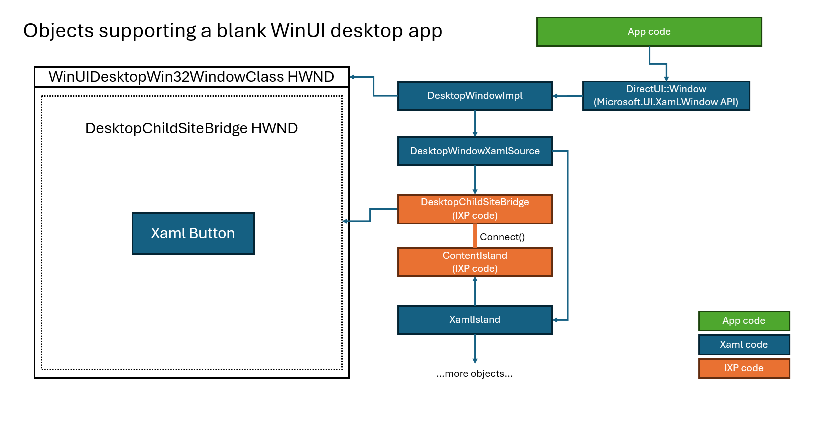

# Xaml Window

## Table of Contents

- [Overview](#overview)
- [How Window works](#how-window-works)
- [The window's redirection surface](#the-windows-redirection-surface)
- [What is AppWindow and how does it relate to Xaml Window?](#what-is-appwindow-and-how-does-it-relate-to-xaml-window)

## Overview

This is about the **Microsoft.UI.Xaml.Window** class.  [API page](https://learn.microsoft.com/en-us/windows/windows-app-sdk/api/winrt/microsoft.ui.xaml.window?view=windows-app-sdk-1.6)

This class lets you easily show your own Xaml content in a top-level window:

``` cs
    // (assume Xaml is already initialized on this thread)
    // Create some basic Xaml content and show it on a new Window.
    var button = new Button() { Content = "Hello world!" };
    var root = new Grid();
    root.Children.Add(button);

    Window window = new Window();
    window.Content = root;

    // Now, show the window!
    window.Activate();
```

When you create a new WinUI3 desktop app in Visual Studio, it'll make an app for you that uses Window to show your Xaml content.

## How Window works

When the app creates and shows a Xaml Window, internally Xaml creates a new top-level window and places a DesktopWindowXamlSource
to cover the entire client area.



Notes:
* The **DirectUI::Window** object (Window_partial.h/cpp, plus some generated code) implements the API surface for Window.
* The **DesktopWindowImpl** object does much of the implementation.
* In UWP (only supported for tests), **DirectUI::Window** will use a **UWPWindowImpl** instead for its implementation.
* **DesktopWindowImpl** also uses a **WindowChrome** object for some of its work (not pictured).

DXamlCore keeps a map of top-level HWNDs to the DirectUI::Window implementation:
``` cpp
// DXamlCore.h
containers::vector_map<HWND, DirectUI::Window*> m_handleToDesktopWindowMap;
```

Here's some breakpoints:
```
// The DesktopWindowImpl ctor is where we'll actually create the top-level hwnd:
Microsoft_UI_Xaml!DirectUI::DesktopWindowImpl::DesktopWindowImpl
// As the top-level window is created, the DesktopWindowImpl::OnCreate function gets called:
Microsoft_UI_Xaml!DirectUI::DesktopWindowImpl::OnCreate
// Here's the wndproc for Xaml's top-level window:
Microsoft_UI_Xaml!BaseWindow<DirectUI::DesktopWindowImpl>::WndProc
// That BaseWindow forwards the messages here:
Microsoft_UI_Xaml!directui::DesktopWindowImpl::OnMessage
```

## The window's redirection surface

By default every top-level window gets a GDI redirection surface: a full-window bitmap that GDI painting on the
HWND lands in, which the compositor then composes as part of the window. A Xaml `Window` barely uses it. The
content island covers the whole client area and renders through the compositor, so the only thing the surface
really shows is the themed background painted on `WM_ERASEBKGND`, which exists to stop the window flashing
unpainted content before the island's first frame.

That surface is not free. It costs one 32-bit bitmap the size of the window, and the compositor blends it on
every frame even though it contributes nothing once the island is up. The memory is charged to the compositor
process rather than to the app, so it doesn't show up in the app's own memory counters.

`WS_EX_NOREDIRECTIONBITMAP` tells the system not to create the surface at all. Xaml passes it when
`XamlChangeId.SkipWindowRedirectionSurface` is enabled:

``` cpp
// DesktopWindowImpl.cpp
const DWORD extendedStyle = OptionalChangeState::IsSkipWindowRedirectionSurfaceEnabled() ? WS_EX_NOREDIRECTIONBITMAP : 0;
```

Two things make this opt-in rather than the default:

* **The window can no longer paint with GDI.** The `WM_ERASEBKGND` themed fill stops having any effect, as does
  any GDI painting an app does on the Xaml HWND. That is a behavior change as much as an optimization, so it is
  a `XamlChangeId` and is deliberately not folded into the general perf opt-in.
* **It has to be decided when the window is created.** The style is only honored when passed to
  `CreateWindowEx`; adding it afterwards through `SetWindowLongPtr` is silently dropped, and the style bit
  doesn't even read back as set. So it cannot be turned on later in response to anything the app does.

## What is AppWindow and how does it relate to Xaml Window?
Microsoft.UI.Windowing.AppWindow is an interesting type.  You can create one to create a standalone top-level window
(similar to Xaml Window).  OR, you can use it to wrap an _existing_ HWND.

Xaml Window wraps its HWND with an AppWindow and exposes that AppWindow object to the app.

This allows the app to use AppWindow APIs on a Xaml Window:
``` cs
// App code: you can use the AppWindow object, which wraps the Xaml Window's HWND, to do more HWND things:
window.AppWindow.Resize(new Windows.Graphics.SizeInt32(300, 300));
```

AppWindow actually works by subclassing the HWND [more info](https://learn.microsoft.com/en-us/windows/win32/winmsg/using-window-procedures#subclassing-a-window).

To make sure we consistently subclass at the right time, we create an AppWindow wrapper right as the Window
is first created:

``` cpp
// DesktopWindowImpl.cpp (microsoft.ui.xaml.dll)
void DesktopWindowImpl::OnCreate() noexcept
{
    //...
    // calling this api first time creates an appwindow object in ixp layer
    // we call it here so that the newly created appwindow object can subclass desktopwindow during init itself
    // instead of whenever user code calls appwindow api, providing subclassing consistency
    ctl::ComPtr<ixp::IAppWindow> appWindow;
    IFCFAILFAST(get_AppWindowImpl(&appWindow));
}
```