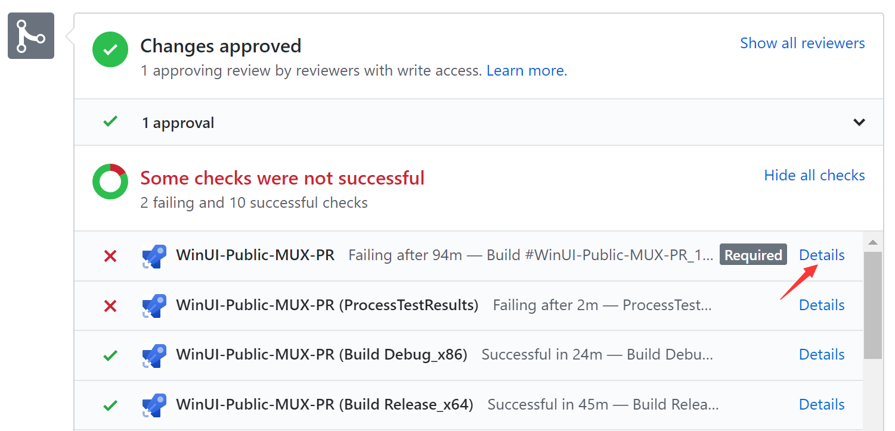
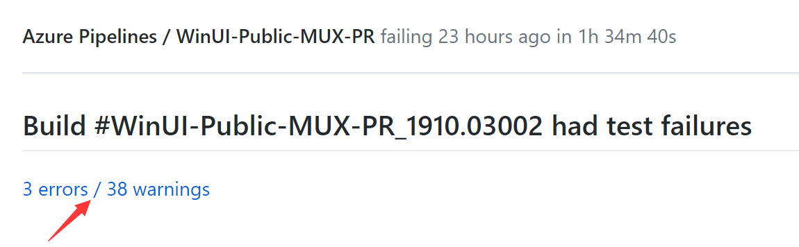
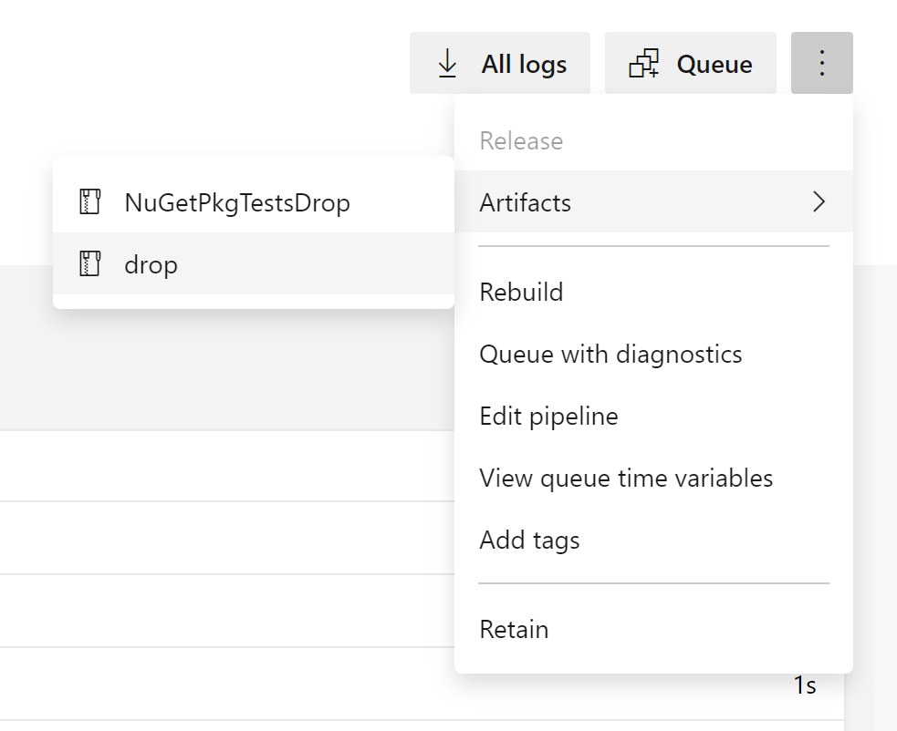
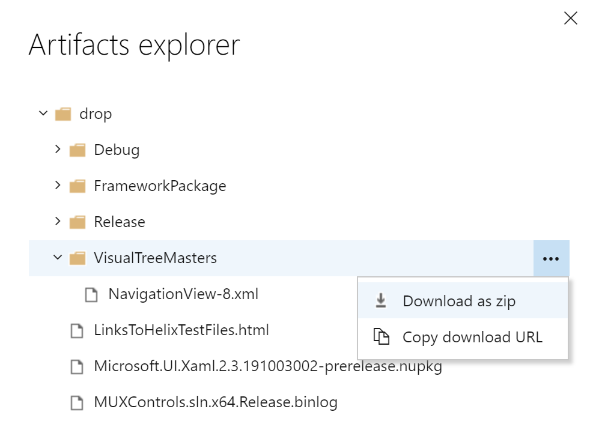

# Developer Guide

This guide provides instructions on how to build the repo and implement 
improvements.

* [Prerequisites](developer_guide.md#Prerequisites)
* [Building the repository](developer_guide.md#Building-the-repository)
* [Testing](developer_guide.md#Testing)
* [Telemetry](developer_guide.md#Telemetry)

Additional reading:

* [Source code structure](source_code_structure.md)
* [Coding style and conventions](code_style_and_conventions.md)


## Prerequisites
#### Visual Studio

Install latest VS2019 (16.1 or later) from here: http://visualstudio.com/downloads

Include the following workloads:
* .NET desktop development
* Desktop Development with C++
* Universal Windows Platform development

#### SDK

While WinUI is designed to work against many versions of Windows, you will need 
a fairly recent SDK in order to build WinUI. It's required that you install the 
17763 and 18362 SDKs. You can download these via Visual Studio (check 
all the boxes when prompted), or you can manually download them from here: 
https://developer.microsoft.com/en-US/windows/downloads/windows-10-sdk


## Building the repository

Building the solution **MUXControls.sln** will build all projects. 
Generally you will want to set your configuration to **Debug**, **x64**, and 
select **MUXControlsTestApp** as your startup project in Visual Studio.
If you want to work on a single control/project instead of using the **MUXControls.sln** you can open the **MUXControlsInnerLoop.sln**.

#### Working with the MUXControlsInnerLoop solution
To work on a specific feature or control using the **MUXControlInnerLoop.sln** you will need to modify **InnerLoopAreas.props** to include the desired controls and projects. For example, to work in the ItemsRepeater using the InnerLoop, you will need to add
```xml
<FeatureRepeaterEnabled>true</FeatureRepeaterEnabled>
```
to the **InnerLoopAreas.props** file.

A full list of all areas can be found in the **FeatureArea.props** files. To include a component in the `Microsoft.UI.Xaml.dll` but not add it to the MUXControlsTestApp, you add it with `productOnly` instead of `true`: 
```xml
<FeatureRepeaterEnabled>productOnly</FeatureRepeaterEnabled>
```


If you use the inner loop solution, please avoid pushing changes to the inner loop solution or **InnerLoopAreas.props** files.
This can be avoided by running the following commands in git:
```
git update-index --skip-worktree InnerLoopAreas.props
git update-index --skip-worktree MUXControlsInnerLoop.sln
```

### Creating a NuGet package

> More information will be coming on this soon

## Testing

### Validating UI and accessibility requirements

> More information will be coming on this soon

### Manual testing

#### Test app

The WinUI solution project has a test app that is useful for validating common 
scenarios affected by the presence of the WinUI package.  Set 
**MUXControlsTestApp** as your startup project in Visual Studio and you can F5 
to start debugging that app and validate your changes.

##### Organization

MUXControlsTestApp is a no frills test app built for on demand developer 
scenarios and also to be automation friendly. As such it's perhaps not as 
friendly to navigate as something similarly control-centric like the 
[Xaml Controls Gallery](https://github.com/Microsoft/Xaml-Controls-Gallery/). 
That's a great potential area for future improvement, although 
MUXControlsTestApp must continue to function as an automation test target. 

#### Standalone app targeting custom NuGet package

In the end developers will consume WinUI as a NuGet package in their own apps. 
So it's important to keep in mind that scenario when validating changes.

To enable **automated** NuGet package testing there is a separate solution at 
test\MUXControlsReleaseTest\MUXControlsReleaseTest.sln, which contains
MUXControls.ReleaseTest, NugetPackageTestApp (C#) and NugetPackageTestAppCX 
(C++).

Test classes for this are in MUXControls.ReleaseTest, and they share test 
infrastructure with MUX so you can write tests in the same way as in MUX. 
The only difference is you'll have to specify the TestType in ClassInitialize 
and TestCleanup (TestType.Nuget for NugetPackageTestApp and TestType.NugetCX 
for NugetPackageTestAppCX). 
```
public static void ClassInitialize(TestContext testContext)
{
    TestEnvironment.Initialize(testContext, TestType.Nuget);
}

public void TestCleanup()
{
    TestEnvironment.AssemblyCleanup(TestType.Nuget);
}
```
The test apps are using released versions of MUX NuGet package locally. In [CI](https://dev.azure.com/ms/microsoft-ui-xaml/_build?definitionId=20), 
the test pipeline will generate a NuGet package for each build, and there's a 
separate pipeline configured to consume the generated package from latest 
build and run MUXControl.ReleaseTest.

#### Downlevel testing

One of the core values of WinUI is the way that it brings controls to a wide 
variety of versions of Windows, handling version compatibility differences so 
that developers using WinUI don't have to. As such, testing WinUI changes on 
different versions is sometimes necessary. To accomplish this you will need to 
at times set up older versions of Windows for testing. To get these earlier 
versions you can make use of a Visual Studio subscription [as described here](https://docs.microsoft.com/azure/virtual-machines/windows/client-images).

### Automated testing

You can run the test suite from within Visual Studio by using the Test top 
level menu. For targeting indivual tests you can use [Test Explorer](https://docs.microsoft.com/en-us/visualstudio/test/run-unit-tests-with-test-explorer?view=vs-2019) 
(found under the Test->Windows sub menu).

This same suite of tests will be run as part of your Pull Request validation 
[check](contribution_workflow.md#Checks).

#### Creating a new test

For your test to be discovered it needs to be a method tagged as [\[TestMethod\]](https://docs.microsoft.com/en-us/dotnet/api/microsoft.visualstudio.testtools.unittesting.testmethodattribute?view=mstest-net-1.2.0) 
on a class tagged with as [\[TestClass\]](https://docs.microsoft.com/en-us/dotnet/api/microsoft.visualstudio.testtools.unittesting.testclassattribute?view=mstest-net-1.2.0). 
With that metadata in place your new test method will be picked up by Test 
Explorer.

There are two types of tests you can use to validate your scenarios:
* **API Tests**: Run in the context of an app and validate the behaviors of our 
APIs. 
* **Interaction Tests**: Drive the UI on an external app and validate the 
results using UI Automation.

Keep in mind that your test will be executed on many different versions of 
Windows, not just the most recent version. Your tests may need version or 
[IsApiPresent](https://docs.microsoft.com/en-us/uwp/api/windows.foundation.metadata.apiinformation.istypepresent) 
checks in order to pass on all versions.

#### Visual tree verification tests

##### Update visual tree masters
Visual tree dumps are stored [here](https://github.com/microsoft/microsoft-ui-xaml/tree/master/test/MUXControlsTestApp/master) and we use them as the baseline (master) for visual tree verifications. If you make UI changes, visual tree verification tests may fail since the new dump no longer matches with masters. The master files need to be updated to include your latest changes. Visual verification test automatically captures the new visual tree and uploads the dump to test pipeline artifacts. Here are the steps to replace existing masters with the new ones.

1. Find your test run.

    

    

2. Download new masters.

    
    
    

3. Diff & replace

    Diff the [old](https://github.com/microsoft/microsoft-ui-xaml/tree/master/test/MUXControlsTestApp/master) and new masters, make sure the changes are intended, replace the files and commit your changes.

##### Create new visual tree tests
1. Write new test

    Write a new test using [VisualTreeTestHelper](https://github.com/microsoft/microsoft-ui-xaml/blob/master/test/MUXControlsTestApp/VisualTreeTestHelper.cs). Quick example [here](https://github.com/microsoft/microsoft-ui-xaml/blob/master/dev/AutoSuggestBox/APITests/AutoSuggestBoxTests.cs#L69-L74).

2. Run the test locally

    Run the test locally and make sure everything looks right. The test will fail, which is expected since the test is new and there's no master to compare against. A new master file should be generated in your Pictures folder (The test app doesn't have write access to other arbitrary folders ☹).

3. Queue a test run in pipeline

    Local test run only gives you the visual tree dump for your host OS version. Some controls have different visual behaviors on different versions. To get master files for all supported OS versions, you'll need to start a test run in test pipeline.

    Go to the [build page](https://dev.azure.com/ms/microsoft-ui-xaml/_build?definitionId=21) and select `WinUI-Public-MUX-PR` pipeline. Click the `Queue` button on top right corner, update `Branch/tag` TextBlock to be your working branch then click on `Run`.

    Outside contributors may not have permission to do this, just open a PR and one of our team members will queue a test run for you.

4. Get the new master files.

    The new masters will be uploaded to pipeline artifacts folder when test finishes. Continue the steps in `Update visual tree masters` section above to download and commit the new files.


## Telemetry

This project collects usage data and sends it to Microsoft to help improve our 
products and services. Note however that no data collection is performed
when using your private builds.
                                                                                                                                                                                                                                                                                                                                                                                                                                                                                                                                                                                                                                                                                                                                                                                                                                                                                                                                                                                                                                                                                                                                                                                                                                                                                                                                                                                                                                                                                                                                                                                                                                                                                                                                                                                                                                                                                                                                                                                                                                                                                                                                                                                                                                                                                                                                                                                                                                                                                                                                                                                                                                                                                                                                                                                                                                                                                                                                                                                                                                                                                                                                                                                                                                                                                                                                                                                                                                                                                                                                                                                                                                                                                                                                                                                                                                                                                                                                                                                                                                                                                                                                                                                                                                                                                                                                                                                                                                                                                                                                                                                                