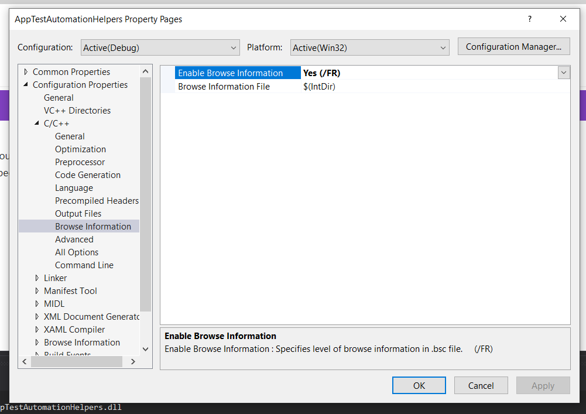
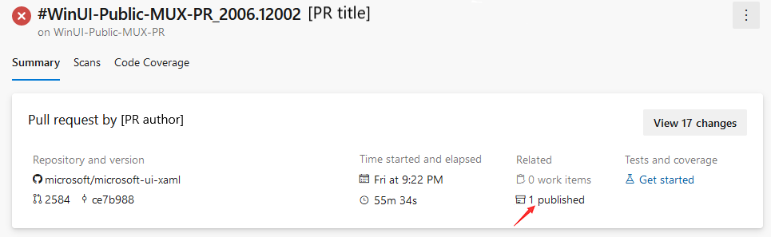

# Developer Guide

This guide provides instructions on how to build the repository and test your changes.

* [Prerequisites](developer_guide.md#Prerequisites)
* [Building the repository](developer_guide.md#Building-the-repository)
* [Testing](developer_guide.md#Testing)
* [Telemetry](developer_guide.md#Telemetry)

Additional reading:

* [Source code structure](source_code_structure.md)
* [Coding style and conventions](code_style_and_conventions.md)


## Prerequisites
#### Visual Studio

Install latest VS2019 (16.1 or later) from here: http://visualstudio.com/downloads

Include the following workloads:
* .NET desktop development
* Desktop Development with C++
* Universal Windows Platform development

#### SDK

While WinUI is designed to work against many versions of Windows, you will need 
a fairly recent SDK in order to build WinUI. It's required that you install the 
17763 and 18362 SDKs. You can download these via Visual Studio (check 
all the boxes when prompted), or you can manually download them from here: 
https://developer.microsoft.com/windows/downloads/windows-10-sdk


## Building the repository

The **MUXControls.sln** solution is used to build all feature areas (such as controls, layout panels and composition elements). The **MUXControlsInnerLoop.sln** solution can be used to build only select feature areas.
Generally, you will want to set your configuration to **Debug**, **x64**, and 
select **MUXControlsTestApp** as your startup project in Visual Studio. To retrieve the appropriate dependencies, right click on the solution in the Solution Explorer and select "Restore NuGet Packages". 

If you get the following error while building the project:
```
BSCMAKE : error BK1520: internal limit exceeded; cannot generate source database file; please consider removing option /FR or /Fr from compiler command line
```
You will need to disable Browse Information in Visual Studio here: 

 

#### Working with the MUXControlsInnerLoop solution
To work on a specific feature or control using the MUXControlsInnerLoop solution you will need to modify the **InnerLoopAreas.props** file to include the desired controls and projects. For example, to work on the ItemsRepeater control you will need to add
```xml
<FeatureRepeaterEnabled>true</FeatureRepeaterEnabled>
```
to the **InnerLoopAreas.props** file. 

A list of all areas can be found in the **FeatureArea.props** file. To include a component in the `Microsoft.UI.Xaml.dll` without adding it to the MUXControlsTestApp, you add it with `productOnly` instead of `true`: 
```xml
<FeatureRepeaterEnabled>productOnly</FeatureRepeaterEnabled>
```

Both files are located at the root of the repository.

When switching between the **MUXControls** and **MUXControlsInnerLoop** solutions, make sure you either delete the **BuildOutput** folder in the solution's root directory or run `git clean -dfx` in order to delete some build files which are incorrectly determined to be up to date by MSBuild after the switch.
Note that `git clean -dfx` deletes all untracked files, so it may also delete any changes you made. To see what would be deleted by that command without actually deleting anything, run `git clean -dfxn`.


If you use the inner loop solution, please avoid pushing changes to the inner loop solution or **InnerLoopAreas.props** files.
This can be accomplished by running the following commands in git:
```
git update-index --skip-worktree InnerLoopAreas.props
git update-index --skip-worktree MUXControlsInnerLoop.sln
```

### Creating a NuGet package

To create a NuGet package for a given build flavor (release/debug) and build arch (x64/x86/ARM/ARM64), you first need to build the solution in that configuration.

After building the solution in the desired configuration, you can run the `build-nupkg.ps1` script that will run the required steps.
The script takes the following arguments:
#### -BuildOutput
The path to the microsoft-ui-xaml BuildOutput folder
#### -BuildFlavor
The flavor to use for nuget build (`debug` or `release`). Defaults to `release`.
#### -BuildArch
The build arch to use for the `.winmd` and `generic.xaml` file, one of: `x64`, `x86`, `ARM`, `ARM64`. Defaults to `x86`.
#### -OutputDir
The folder in which the NuGet package will be generated.
#### -SkipFrameworkPackage
Can be specified to skip building a framework package. Defaults to `False`.
In order to generate framework packages, you need to generate package appx files. 
This can be done using the `MakeAllAppx.cmd` located in the same folder as `build-nupkg.ps1`.


Example usage (running from the root of the repository folder):
```
// Builds a NuGet package with debug binaries and arch x64 into the folder "NuGetPackage"
.\build\NuSpecs\build-nupkg.ps1 -BuildOutput "..\..\BuildOutput" -BuildFlavor "debug" -BuildArch "x64" -OutputDir "..\..\NugetPackage"
```

> Note: To use debug build outputs as a NuGet package, you need to change [this line](https://github.com/microsoft/microsoft-ui-xaml/blob/7d2cd793a0154580f1dd0c9685c461198e05f207/dev/dll/Microsoft.UI.Xaml.vcxproj#L35) in `microsoft-ui-xaml/dev/dll/Microsoft.UI.Xaml.vcxproj` from
> ```xml
> <DisableEmbeddedXbf Condition="'$(Configuration)'=='Release'">false</DisableEmbeddedXbf> 
> ``` 
> to 
> ```xml
> <DisableEmbeddedXbf>false</DisableEmbeddedXbf> 
> ```
> to allow building of .pri files in debug mode, which are needed for the NuGet package.


## Testing

### Validating UI and accessibility requirements

> More information will be coming on this soon

### Manual testing

#### Test app

The WinUI solution project has a test app that is useful for validating common 
scenarios affected by the presence of the WinUI NuGet package. Set 
**MUXControlsTestApp** as your startup project in Visual Studio and you can F5 
to start debugging that app and validate your changes.

##### Organization

MUXControlsTestApp is a no frills test app built specifically for on demand developer 
testing scenarios and to be UI automation friendly. As such it's perhaps not as 
friendly to navigate as something similarly control-centric like the 
[Xaml Controls Gallery](https://github.com/Microsoft/Xaml-Controls-Gallery/). 
That's a great potential area for future improvement, although 
MUXControlsTestApp must continue to function as an automation test target. 

#### Standalone app targeting custom NuGet package

In the end developers will consume WinUI as a NuGet package in their own apps. 
So it's important to keep in mind that scenario when validating changes.

To enable **automated** NuGet package testing there is a separate solution at 
test\MUXControlsReleaseTest\MUXControlsReleaseTest.sln, which contains
MUXControls.ReleaseTest, NugetPackageTestApp (C#) and NugetPackageTestAppCX 
(C++).

Test classes for this are in **MUXControls.ReleaseTest**, and they share test 
infrastructure with MUX so you can write tests in the same way as in MUX. 
The only difference is you'll have to specify the TestType in ClassInitialize 
and TestCleanup (TestType.Nuget for NugetPackageTestApp and TestType.NugetCX 
for NugetPackageTestAppCX). 
```
public static void ClassInitialize(TestContext testContext)
{
    TestEnvironment.Initialize(testContext, TestType.Nuget);
}

public void TestCleanup()
{
    TestEnvironment.AssemblyCleanup(TestType.Nuget);
}
```
The test apps are using released versions of the WinUI NuGet package locally. In [CI](https://dev.azure.com/ms/microsoft-ui-xaml/_build?definitionId=20), 
the test pipeline will generate a NuGet package for each build, and there's a 
separate pipeline configured to consume the generated package from the latest 
build and run MUXControl.ReleaseTest.

#### Downlevel testing

One of the core features of WinUI is that it maintains down-level compatibility with earlier versions of Windows 10, handling version compatibility differences so 
that developers using WinUI don't have to. As such, testing your changes on 
different Windows versions is sometimes necessary. Windows versions can be acquired using a Visual Studio subscription [as described here](https://docs.microsoft.com/azure/virtual-machines/windows/client-images), if required.

### Automated testing

You can run the test suite from within Visual Studio by using the `Test` top 
level menu. To target individual tests you can use the [Test Explorer](https://docs.microsoft.com/visualstudio/test/run-unit-tests-with-test-explorer?view=vs-2019) 
(found under the Test->Windows sub menu).

This same suite of tests will be run as part of your Pull Request validation 
[check](contribution_workflow.md#Checks).

#### Creating a new test

For your test to be discovered it needs to be a method tagged as [\[TestMethod\]](https://docs.microsoft.com/dotnet/api/microsoft.visualstudio.testtools.unittesting.testmethodattribute?view=mstest-net-1.2.0) 
in a class tagged with as [\[TestClass\]](https://docs.microsoft.com/dotnet/api/microsoft.visualstudio.testtools.unittesting.testclassattribute?view=mstest-net-1.2.0). 
With that metadata in place your new test method will be picked up by Test 
Explorer.

There are two types of tests you can use to validate your scenarios:
* **API Tests**: Run in the context of an app and validate the behaviors of our 
APIs. 
* **Interaction Tests**: Drive the UI on an external app and validate the 
results using UI Automation.

Keep in mind that your test will be run on many different versions of 
Windows, not just the most recent version. Your tests may need version or 
[IsApiPresent](https://docs.microsoft.com/uwp/api/windows.foundation.metadata.apiinformation.istypepresent) 
checks in order to pass on all versions.

#### Visual tree verification tests

##### Update visual tree verification files
Visual tree dumps are stored [here](https://github.com/microsoft/microsoft-ui-xaml/tree/master/test/MUXControlsTestApp/verification) and we use them as the baseline for visual tree verifications. If you make UI changes, visual tree verification tests may fail since the new dump no longer matches with previous verification files. The verification files need to be updated to include your latest changes. A visual verification test automatically captures the new visual tree and uploads the dump to the test pipeline's artifacts. Below are the steps to replace existing verification files with the updated ones.

1. Find your test run

    

    

2. Download new verification files

    First, open the published build artifacts:
    
    
    
    ###### [For Microsoft employees]
    
    If you are a Microsoft employee, you can directly view the content of the created `drop` folder containing the updated verification files in Azure Pipelines. From here download the `UpdatedVisualTreeVerificationFiles` folder and extract it locally.
    
    ###### [For external contributors]
    
    If you are an external contributor, you cannot directly download the new verification files but instead have to download the entire generated **drop** archive and unpack it (its size can be around 1 GB):

     

3. Diff & replace

    Open a powershell command prompt and navigate to the `tools` directory of your Winui 2 project.  Call the `GenerateVisualVerificationUpdates` script passing in the `UpdatedVisualTreeVerificationFiles` folder that you downloaded in step two (make sure this folder contains only .xml verification files).

    This script does the logic for determining the required verification file updates and publishes them to the VerificationFiles folder within the project. If preferred, they can be published to a different location by passing the desired location as a second optional argument.

     Now use your preferred file comparison tool (VisualStudio,...) to compare the updated files with their unchanged versions prior to your contribution and verify that the changes are as expected.

    Finally commit the updated viual verification files to your pull request.

##### Create new visual tree tests
1. Write a new test

    Write a new test using [VisualTreeTestHelper](https://github.com/microsoft/microsoft-ui-xaml/blob/master/test/MUXControlsTestApp/VisualTreeTestHelper.cs). Quick example [here](https://github.com/microsoft/microsoft-ui-xaml/blob/master/dev/AutoSuggestBox/APITests/AutoSuggestBoxTests.cs#L69-L74).

2. Run the test locally

    Run the test locally and make sure everything looks right. The test will fail, which is expected since the test is new and there's no verification file to compare against. A new verification file should be generated in your `Pictures` folder (The test app doesn't have write access to other arbitrary folders ☹).

3. Queue a test run in pipeline

    A local test run only gives you the visual tree dump for your host OS version. However, some controls have different visual behaviors depending on the Windows version used. To get verification files for all supported OS versions, you'll need to start a test run in test pipeline.

    Go to the [build page](https://dev.azure.com/ms/microsoft-ui-xaml/_build?definitionId=21) and select the `WinUI-Public-MUX-PR` pipeline. Click the `Queue` button on the top right corner, update the `Branch/tag` TextBlock to be your working branch and then click on `Run`.

    Outside contributors may not have permission to do this. In this case, just open a PR and one of our team members will queue a test run for you.

4. Get the new verification files

    The new verification files will be uploaded to the test pipeline's artifacts folder when the test finishes. Follow the steps outlined in the [Update visual tree verification files](#update-visual-tree-verification-files) section above to download and commit the new files.


## Telemetry

This project collects usage data and sends it to Microsoft to help improve our 
products and services. Note, however, that no data collection is performed 
when using your private builds.
