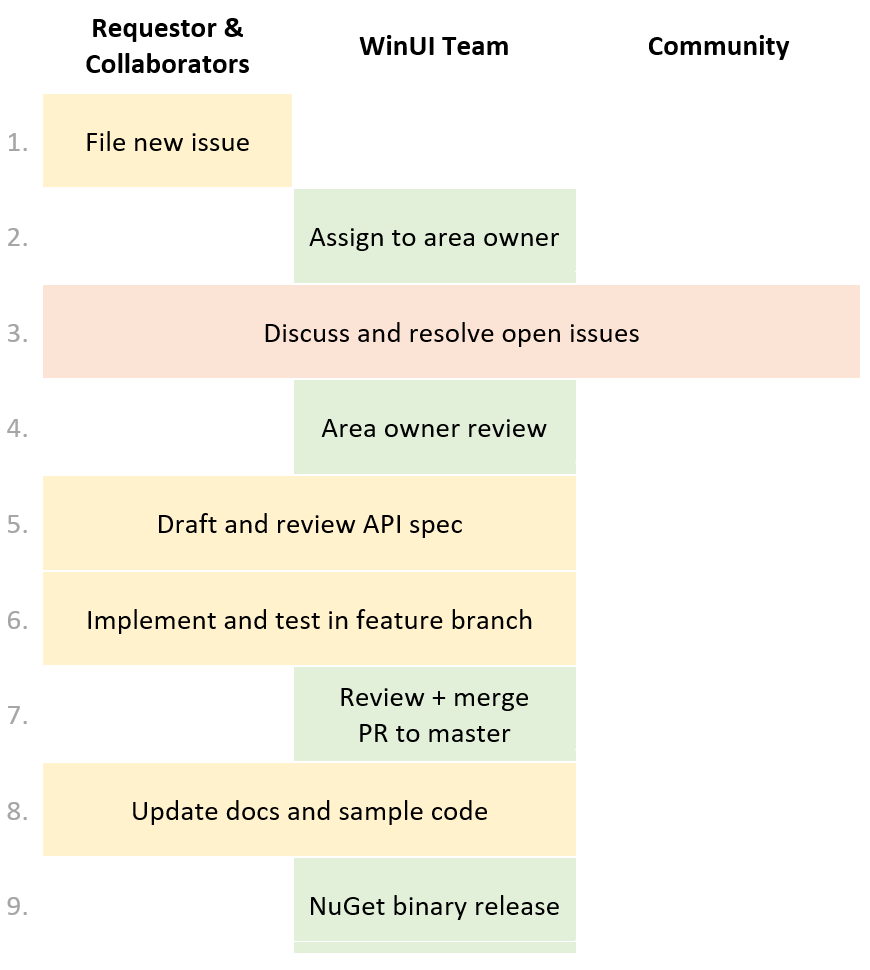

# New Feature or API Process

We welcome community contributions and input to the WinUI Library, including feature ideas and code contributions. 

This document outlines the process for how you can propose or contribute new features. 

### You need to follow this process for:

* Code changes that add, remove, or alter public API 
* Features that add or alter the user experience (e.g. new visual designs)
* Changing any core functionality documented on docs.microsoft.com

### You don't need to follow this process for:

* Fixing bugs
* Submitting PRs that don't alter major functionality or public API  
(e.g. internal performance improvements) 

## Process summary

## Process details

0. Please search the [issue tracker](https://github.com/microsoft/microsoft-ui-xaml/issues) for a similar idea first: there may already be an issue you can contribute to.

1. **Create Issue**  
All code changes must be tied to an Issue. 
To propose a new feature or API please start by filing a new issue in the [issue tracker](https://github.com/microsoft/microsoft-ui-xaml/issues) using the [Feature Proposal template](https://github.com/Microsoft/microsoft-ui-xaml/issues/new?template=feature_proposal.md).  
Include as much detail as you have. It's fine if it's not a complete design: just a summary and rationale is a good starting point.

2. **Wait for Team Owner**  
We will assign a WinUI team owner to your issue. The WinUI team regularly triages all incoming issues.  

3. **Discussion**  
We'll keep the issue open for community discussion until the team owner decides it's ready or should be closed.  
Note that if an issue isn't a high priority or has many open questions then it might stay open for a long time.

4. **Owner Review**  
The WinUI team will review the proposal and either approve or close the issue based on whether it broadly aligns with the [WinUI roadmap](roadmap.md) and [contribution guidelines](../CONTRIBUTING.md).

5. **API Review**  
If the feature adds new APIs then we'll start an API review in the [WinUI API review repo](https://github.com/microsoft/microsoft-ui-xaml-specs). All new public APIs must be reviewed before merging.  

6. **Implementation**  
A feature can be implemented by you, the WinUI team, or other community members.  
Code contributions are greatly appreciated: feel free to work on any reviewed feature you proposed, or choose one in the backlog and send us a PR. Please let us know in the issue comments if you are actively working on implementing a feature so we can ensure it's assigned to you.   
Our contribution guidelines can be found [here](../CONTRIBUTING.md).

7. **Merge**  
Once a feature is complete and tested according to the [contribution guidelines](../CONTRIBUTING.md) you can send us a PR to merge it to master.  

8. **Documentation and sample updates**  
We will update the [documentation on docs.microsoft.com](https://docs.microsoft.com/windows/uwp) and if applicable add a sample to the [Xaml Controls Gallery](https://github.com/Microsoft/Xaml-Controls-Gallery) app.  
Feel free to also contribute to docs and samples!  
Once the docs and samples are updated we'll close the issue.

9. **Binaries**  
We periodically produce signed prerelease binaries from the master branch which are published to [NuGet](https://www.nuget.org/profiles/winui): see the [Roadmap](roadmap.md) for info on build frequency.   
After the feature has been sufficiently validated as part of a prerelease package we will include it in the next stable binary release on NuGet.
