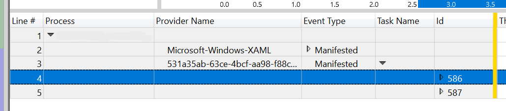
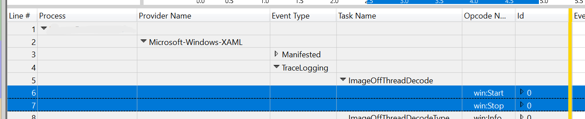

# Performance ETW

This document describes how to add ETW events to WinUI.

## Table of Contents

- [Manifest-based ETW](#manifest-based-etw)
- [TraceLogging ETW](#tracelogging-etw)

## Manifest-based ETW

**Manifest-based events are the old way that system Xaml used to log ETW events. We shouldn't use them anymore. This section only exists to document history.**

A manifest maps GUIDs and IDs back to event providers (e.g. Microsoft-Windows-XAML) and event names (e.g. RenderWalk). Without the right manifest, WPA can't resolve event IDs back to event names, and can't display the logged events.



Here, new events are showing up as events number 586 and 587. Without a way to resolve them, WPA won't be able to display the event names or any of the fields associated with these events. Interestingly, the provider for these events are showing as a GUID (531a35ab-63ce-4bcf-aa98-f88c7a89e455), even though this is the same GUID as Microsoft-Windows-XAML which WPA recognizes.

Xaml generated these manifests based on codegen (under [dxaml\xcp\tools\XCPTypesAutoGen\XamlGen\EtwEvents.man](../../dxaml/xcp/tools/XCPTypesAutoGen/XamlGen/EtwEvents.man)), which gets combined with string resources and turned into a manifest under [dxaml\xcp\plat\win\desktop\Microsoft-Windows-XAML-ETW.man](../../dxaml/xcp/win/desktop/Microsoft-Windows-XAML-ETW), which then gets built into the WinUI binary. The manifest file can also be used to manually install events using the wevtutil tool.

The manifest file defines tasks (e.g. RenderWalk), events associated with those tasks (e.g. RenderWalkBegin/RenderWalkEnd), and templates for the payload associated with an event (e.g. RenderWalkElementCounts, which contains a pair of integers). An event also contains its opcode (e.g. win:Start, win:Stop, or win:Info) and level (e.g. win:Informational or win:Verbose). You have to update several places in this file to add a new event.

Xaml's build also takes the manifest file and produces a C++ header that contains functions for logging each ETW event. Xaml code then includes this header (`Microsoft-Windows-XAML-ETWEvents.h`) and calls these functions (e.g. `TraceRenderWalkBegin`) when it wants to log an event. These functions all begin with "Trace", and they end with "Begin", "End", or "Info" depending on the type of event that gets logged.

These trace functions know to check whether the Xaml provider is enabled (i.e. someone is taking a trace and has selected Xaml as one of the things to trace), and if not then they don't log anything. The events themselves are logged as a provider GUID, a task/event ID, and other data associated with the event. When the trace is opened, there must be a manifest available to interpret these IDs, otherwise you get the picture above where the event shows up as an uninterpretable number.

The greatest drawback of manifest-based ETW events is the necessity of having a manifest. A machine that doesn't have the right manifest effectively can't look at a trace.

[MSDN](https://docs.microsoft.com/en-us/windows/win32/etw/writing-manifest-based-events)

## TraceLogging ETW

TraceLogging is an alternative way of writing ETW events that has been used by components like Shell for years. It doesn't require a manifest at all, so the traces that are generated can be opened anywhere without messing with a .man file. TraceLogging events don't show up in the Event Viewer, which is a limitation that WinUI can live with for most of the events that we want to log. This is the way to add new ETW events into Xaml. We should also gradually convert existing manifest-based events to TraceLogging.

WIL TraceLogging documentation has detailed documentation for TraceLogging. This document covers the basics.

TraceLogging needs a GUID corresponding to the provider. For now, use the same provider as system Xaml. To create new providers, generate the GUID with `TldGuid.exe`.

TraceLogging has an associated header, `wil\TraceLogging.h`, that contains macros for logging ETW events. WinUI has a copy of this header under `xcp\inc\TraceLogging.h`. From there, you define a telemetry class that contains methods that log events using these macros. For example,

```cpp
// GUID for "Microsoft-Windows-Xaml": {531a35ab-63ce-4bcf-aa98-f88c7a89e455}
// Generate the uuid via the TlgGuid.exe: TlgGuid.exe Microsoft.Windows.MyComponent.MyProvider
DECLARE_TRACELOGGING_CLASS(ImagingTelemetryLogging, "Microsoft-Windows-XAML", (0x531a35ab, 0x63ce, 0x4bcf, 0xaa, 0x98, 0xf8, 0x8c, 0x7a, 0x89, 0xe4, 0x55));

class ImagingTelemetry final : public TelemetryBase
{
    IMPLEMENT_TELEMETRY_CLASS(ImagingTelemetry, ImagingTelemetryLogging);

public:
    DEFINE_TRACELOGGING_ACTIVITY(StartEndPair_NoParams);

    DEFINE_TRACELOGGING_EVENT_PARAM1(ImageOffThreadDecodeType, bool, IsHardwareDecode, TraceLoggingLevel(WINEVENT_LEVEL_VERBOSE));

    BEGIN_COMPLIANT_TRACELOGGING_ACTIVITY_CLASS_WITH_LEVEL(ImageOffThreadDecode, PDT_ProductAndServicePerformance, WINEVENT_LEVEL_VERBOSE)
        DEFINE_ACTIVITY_START(XUINT64 imageId, PCWSTR uri)
        {
            TraceLoggingClassWriteStart(ImageOffThreadDecode,
                TraceLoggingValue(imageId),
                TraceLoggingValue(uri));
        }

    END_ACTIVITY_CLASS();
};
```

This class can then be used to log TraceLogging events:

```cpp
auto activity = ImagingTelemetry::ImageOffThreadDecode::Start(decodeParams.GetImageId(), decodeParams.GetStrSource().GetBuffer());

...

activity.Stop();
```

These events then show up in WPA:



Note that the type of the new events is TraceLogging. WPA can interpret these events without installing anything, and there's also no associated event ID to interpret.

The important bits in the code are:
* Define a base that derives from `TelemetryBase` (defined in `TraceLogging.h`).
* Use `DEFINE_TRACELOGGING_EVENT` macros to define win:Info events. The params to the macro are in (type, paramName) pairs.
* Call the static telemetry class method to log a win:Info event from code (e.g. `ImagingTelemetry::ImageOffThreadDecodeType(true)`).
* Use the `BEGIN_TRACELOGGING_ACTIVITY_CLASS` and `DEFINE_ACTIVITY_START` macros to define win:Start/win:Stop event pairs with fields in the events. If you just need a simple Start/Stop pair, use the `DEFINE_TRACELOGGING_ACTIVITY` macro instead.
* Call the activity class's Start method to get an instance that logs a win:Start event (e.g. `auto activity = ImagingTelemetry::ImageOffThreadDecode::Start(...)`). Call the Stop method on that instance to log the corresponding win:Stop method (e.g. `activity.Stop()`).

There's also a whole set of TELEMETRY/MEASURES/CRITICAL macros that upload data to the cloud, and CALLCONTEXT activities which only log telemetry on failure.

[MSDN](https://docs.microsoft.com/en-us/windows/win32/tracelogging/trace-logging-portal)
