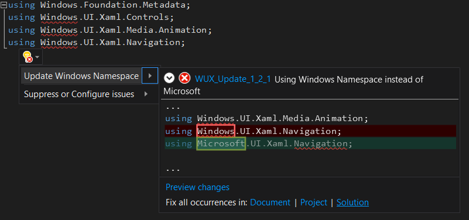

# Converting To WinUI3 Using C# Conversion Analyzers
**Note: `Microsoft.WinUI.Convert` NuGet Package is Currently Unavailable During Prerelease**

**It is recommended to use the  [try-convert](https://github.com/dotnet/try-convert/blob/feature/winui/WinUIConvert.md) tool for the full conversion process.**

# Background

The purpose of the Microsoft.WinUI.Convert Nuget Package is to create a porting solution to allow Developers to convert WinUI2 projects to the new WinUI3 format.

- WinUI is a native user experience (UX) framework for both Windows Desktop and UWP applications. WinUI ships as part of the Windows OS. 
[More on WinUI](https://microsoft.github.io/microsoft-ui-xaml/), [Docs](https://docs.microsoft.com/en-us/windows/apps/winui/)
- WinUI3 is the next version of WinUI. It runs on the native Windows 10 UI platform and supports both Windows Desktop and UWP apps. WinUI3 ships as a NuGet package.
[More on WinUI3](https://docs.microsoft.com/en-us/windows/apps/winui/winui3/)

Converting an existing WinUI C# App to WinUI3 requires some changes to the C# source code. Most notably namespace changes from Windows.UI.* to Microsoft.UI.*

This porting assistance is provided in the form of Code Analyzers and Code Fixes. 
- A Code Analyzer extends the Visual Studio experience and provides on the fly code inspections for C#. For most inspections these Code Analyzers provide light bulb quick fixes that can be applied to users code in the form of a Code Fix. 
- A Code Fix consumes the diagnostics created by the Code Analyzer and modifies the C# file in-line. Users may choose to apply Code Fixes one at a time or resolve all instances of a Code Fix across a File, Project, or Solution.

# What The Conversion Analyzers Do:
Analyze/Convert C# files and apply the following changes:

## Changes Common to All Projects:

### Namespace Analyzer/Codefix

- Updates Type Namespaces from `Windows.*` to `Microsoft.*`
- Types moving from `Windows` to `Microsoft`:
    - `Windows.UI.Xaml`
    - `Windows.UI.Colors`
    - `Windows.UI.ColorHelper` 
    - `Windows.UI.Composition`
    - `Windows.UI.Input`
    - `Windows.UI.Text`
    - `Windows.System.DispatcherQueue*` 

### EventArgs Analyzer/Codefix

- Converts `App.OnLaunched` Method
    - Two updates need to be made to the `App.OnLaunched` method when converting to WinUI3:
    1. Target `Microsoft.UI.Xaml.LaunchactivatedEvenArgs` as the method parameter type
    2. Instances of the parameter name in the `App.OnLaunched` method body must invoke `UWPLaunchActivatedEventArgs`

## Changes Specific to UWP (.NET Native) Projects:

### UWP Projection Analyzer/Codefix

- Some types are moving in UWP and projects need to target the new projected types.
- .Net Projections moving to `Microsoft.UI.Xaml` :
    - `System.ComponentModel.INotifyPropertyChanged` -> `Microsoft.UI.Xaml.Data.INotifyPropertyChanged`
    - `System.ComponentModel.PropertyChangedEventArgs`-> `Microsoft.UI.Xaml.Data.PropertyChangedEventArgs`
    - `System.Windows.Input.ICommand` -> `Microsoft.UI.Xaml.Input.ICommand`

### ObservableCollection Analyzer/Codefix

- `ObservableCollection<T>` is being removed and users will have to provide their own implementation targeting `INotifyCollectionChanged`.
- If the analyzer cannot find an implementation it will provide its own helper class.
    - `System.Collections.ObjectModel.ObservableCollection` -> `Microsoft.UI.Xaml.Interop.INotifyCollectionChanged`
        
### UWP Struct Analyzer/Codefix

- UWP Projects cannot use struct constructors. 
The analyzer replaces these constructors with their associated WinRT Helper classes.
    - `Windows.UI.Xaml.CornerRadius` -> `Microsoft.UI.Xaml.CornerRadiusHelper`
    - `Windows.UI.Xaml.Duration`-> `Microsoft.UI.Xaml.DurationHelper`
    - `Windows.UI.Xaml.GridLength`-> `Microsoft.UI.Xaml.GridLengthHelper`
    - `Windows.UI.Xaml.Thickness`-> `Microsoft.UI.Xaml.ThicknessHelper` ->
    - `Windows.UI.Xaml.Controls.Primitives.GeneratorPosition` -> `Microsoft.UI.Xaml.Controls.Primitives.GeneratorPositionHelper`
    - `Windows.UI.Xaml.Media.Matrix` -> `Microsoft.UI.Xaml.Media.MatrixHelper` 
    - `Windows.UI.Xaml.Media.Animation.KeyTime` -> `Microsoft.UI.Xaml.Media.Animation.KeyTimeHelper`
    - `Windows.UI.Xaml.Media.Animation.RepeatBehavior` -> `Microsoft.UI.Xaml.Media.Animation.RepeatBehaviorHelper`

# What The Conversion Analyzers Do Not Do:

 - Modify .csproj files or modify/resolve conflicting NuGet packages
 - Remove deprecated code:
    - Some types such as `Windows.UI.Input.Inking`, and `Windows.UI.Xaml.Media.AcrylicBackgroundSource` are not supported in WinUI3. 
    These may be identified and highlighted by the analyzer as deprecated but cannot be converted automatically, users will have to address these issues manually.
 - Analyze/Convert .xaml files

# Examples

#### Namespaces Before Running Analyzers:
```csharp
using Windows.UI;
using Windows.UI.ViewManagement;
using Windows.UI.Xaml;
using Windows.UI.Xaml.Controls;
```

#### Namespaces After Running Analyzers:
```csharp
using Microsoft.UI;
using Microsoft.UI.ViewManagement;
using Microsoft.UI.Xaml;
using Microsoft.UI.Xaml.Controls;
```

#### OnLaunched Method Before Running Analyzers:
```c#
protected override async void OnLaunched(LaunchActivatedEventArgs args)
{
    await EnsureWindow(args)
}
```

#### OnLaunched Method After Running Analyzers:
```csharp
protected override async void OnLaunched(Microsoft.UI.Xaml.LaunchActivatedEventArgs args)
{
    await EnsureWindow(args.UWPLaunchActivatedEventArgs)
}
```

#### .Net Projections Before Running Analyzers:
```csharp
public sealed partial class CommandBarPage : INotifyPropertyChanged
```

#### .Net Projections After Running Analyzers:
```csharp
 public sealed partial class CommandBarPage : Microsoft.UI.Xaml.Data.INotifyPropertyChanged
```

#### .Net Struct Constructor Before Running Analyzers:
```csharp
CornerRadius c1 = new CornerRadius(4);
CornerRadius c2 = new CornerRadius(4, 2, 2 4);
```

#### .Net Struct Constructor After Running Analyzers:
```csharp
CornerRadius c1  = CornerRadiusHelper.FromUniformRadius(4);
CornerRadius c2  = CornerRadiusHelper.FromRadii(4, 2, 2, 4);
```

# Conversion Process

**Note: `Microsoft.WinUI.Convert` NuGet Package is Currently Unavailable During Prerelease**

**It is recommended to use the  [try-convert](https://github.com/dotnet/try-convert/blob/feature/winui/WinUIConvert.md) tool for the full conversion process.**

Necessary steps for converting a WinUI C# App to WinUI3: 

1. Install `Microsoft.WinUI` and `Microsoft.WinUI.Convert` NuGet packages in your app using the NuGet package manager: see the [Install WinUI 3 Preview](https://docs.microsoft.com/en-us/windows/apps/winui/winui3/#install-winui-3-preview-2) page for more information.
    
    

2. If installed, uninstall the Microsoft.UI.Xaml NuGet package from your solution. Additional conflicting packages such as `Microsoft.Xaml.Behaviors.*` may also need to be removed.
    
    

3. Light Bulb suggestions should highlight issues that need to be updated for WinUI3 conversion. 

    

4. Click the down arrow by the lightbulb, Convert to WinUI3 and select Fix all occurences in project. 

    

5. All namespace changes should be fixed in your project!

6. The Analyzer can only parse C# code and not Xaml. WebView is now WebView2 and should be updated: see the [Getting Started](https://docs.microsoft.com/en-us/windows/apps/winui/winui3/) page for more information.

7. (Optional) These Analyzers serve little purpose outside of converting A WinUI C# App. After verifying the conversion is complete you might consider uninstalling the `Microsoft.WinUI.Convert` NuGet Package.

---

Note: some WinUI2 resources are not compatible with WinUI3. These issues may be highlighted in code but cannot be fixed by the converter. 


