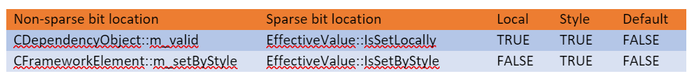

# Property System

## Table of Contents

- [Overview](#overview)
- [Entry points](#entry-points)
  - [External API](#external-api)
  - [Parser](#parser)
- [Kinds of properties](#kinds-of-properties)
- [Property indices](#property-indices)
- [Layered property system and effective values](#layered-property-system-and-effective-values)
- [Source of effective value and fast presence check](#source-of-effective-value-and-fast-presence-check)
- [Where are effective values stored](#where-are-effective-values-stored)
- [Sparse](#sparse)
- [Field-backed / storage groups](#field-backed--storage-groups)
- [Method](#method)
- [Attached](#attached)
- [Inherited properties](#inherited-properties)
- [Simple](#simple)
- [Associative](#associative)
- [Property changed notification and side-effects](#property-changed-notification-and-side-effects)
- [Value validation](#value-validation)
- [CValue](#cvalue)

## Overview

* Property system’s main role is to provide storage for properties exposed by public API surface as well as accessing this state internally.
  * It provides storage infrastructure for services layered on top of it, e.g. animations, styles, bindings. Along with Metadata API, it allows run-time extensibility by means of custom dependency properties.

## Entry points

### External API

* App interacts with the property system by accessing property values. Built-in properties are exposed by `get_PropertyName` and `put_PropertyName` methods on subtyped framework peer and custom properties are accessible by `SetValue`/`GetValue` exposed on `DependencyObject` (this API can also be used for built-ins).
* In the first case, our CodeGen system generates get/put accessors which call into appropriate `DependencyObject::SetValueByKnownIndex` overload.
* This is where typed value exposed by public API is boxed into appropriate `CValue` (work done by `CValueBoxer`) which is passed around until it finally reaches its storage.
* `GetValue`/`SetValue` methods exposed on `DependencyObject` use an argument of type `IDependencyProperty` for property identification.
* By convention, most dependency properties have a static member variable `DeclaringClass.PropertyNameProperty` of type `IDependencyObject`.
* Internally, the class implementing this interface is `DependencyPropertyHandle` and it carries a reference to `CDependencyProperty` used to resolve property.

### Parser

* Parser has a dependency on property system.
  * For core properties it can take a shortcut and set them directly by calling into CDependencyObject’s `SetValue` / `GetValue` methods without going through framework peer.
  * For custom / framework properties it still goes through framework layer.

## Kinds of properties

* There are a couple ways to partition the space of all properties our system can deal with:
  * Underlying concept – dependency properties vs. simple properties.
    * Dependency properties are generally the ones are thought of when referring to property system. They have the richest support of XAML services (e.g. animation, styling, bindings, etc.) and property system currently knows only how to deal with them.
    * In RS4 there was an effort to bring low-overhead properties which might not need all functionality of dependency properties. These are called simple properties.
  * Declaration layer – XAML vs. custom.  
    * XAML declared properties are declared on XAML built-in types and custom properties are declared in app code.                   

## Property indices

* Internally, XAML uses `KnownPropertyIndex` enum to identify properties. These indices are generated from XAML Object Model. The ordering of values in this enum matters and they are assigned in the following manner:

## Layered property system and effective values

* XAML property system is layered, meaning for every property there are multiple sources for the value and the effective value is calculated based on precedence rules. Precedence rules are applied when value is set and storage contains effective value until another set operation overwrites it. There’s not much logic in getters, as they only read a value from value store.  
* This is a list of sources in decreasing order of precedence:
  * Active animations: Animated values are set from animations and VSM. They are set by a call to `CDependencyObject::SetAnimatedValue` and will stay active until `CDependencyObject::ClearAnimatedValue` is called. On the first call to set animated value, a `CModifiedValue` object is created. It stores current animated value and value which would be active if animation was not running (base value). Stored effective value is updated with animated value. Since it is possible to have multiple properties of `CDependencyObject` being targeted by animations, `CDependencyObject` stores a list of those with keys being `KnownPropertyIndices`.
  * Local value: Local value is set by a call to `SetValue` (from external API that means either assigning value to `obj.property` or a call to `DependencyObject.SetValue`). If this call is made when this property is animated, the local value will be cached in `CModifiedValue`. Otherwise, it will be routed to appropriate effective value storage.
  * Style setters: If there are no higher precedence values, for `CFrameworkElements`, `CDependencyObject::EvaluateBaseValue` will try to pull a value from associated style.
  * Built-in style: If there’s no local style, `CDependencyObject::EvaluateBaseValue` will try built-in styles.
  * Default values: Finally, if none of above values exists, a default values is provided. For custom dependency properties, a callout is made to `ICreateDefaultValueCallback` which was registered with a custom dependency property. Objects whose properties’ state lives in framework layer get a chance to provide a value by overriding `DirectUI::DependencyObject::GetDefaultValue2`. Other properties can provide a value by piling on a massive switch statement in `CDependencyProperty::GetDefaultValue`. If they choose not to, a type default can be provided. If there’s no type default, a null value is returned.
  * Inherited value defaults come from a less impressive switch statement in `CCoreServices::GetDefaultInheritedPropertyValue`.

## Source of effective value and fast presence check

* To be able to distinguish between where the value is coming from, a concept of value source exists.
* Animated values are implemented as `CModifiedValue` object and presence of it indicates value is animated.
* Non-animated sources are called base values and the system distinguishes three sources: local, style and default.
* There are two bits needed to store that information. Where this information is kept depends on storage location of property.
* For sparse properties, it lives along with the value on `EffectiveValue`. For properties stored in other locations, for each instance of `CDependencyObject` there is a chunk of memory with a bit for each declared property (note, that whether value is stored in instance or heap allocated depends on number of properties for that type).
* The number of bits (a.k.a slots) per type and property bit-index are pre-calculated by CodeGen and stored in `MetaDataTypeProperties::m_nPropertySlotCount` and `c_aPropertySlot` array respectively.
  * Note that each type allocates only the number of bits as large as the number of properties declared on type. Since styles can only be applied to `CFrameworkElement` derived types, it would be wasteful to allocate this bit for types which would never set it. For that reason, the bits are split and `CFrameworkElement` allocates a second bit-per-property chunk.
* A secondary purpose for this mechanism is that on hot code-paths, before searching for a value, we can check a bit to avoid a cost of searching for non-existing value.

## Where are effective values stored

* The storage location used for a property is determined based on how it’s declared in Object Model. This in turn generates appropriate `MetaDataPropertyInfoFlags` flags in `MetadataProperty`.
* For built-in properties, the initial value type passed from one of `SetValue` methods via `CValue` is not necessarily what is being stored in property system.
  * `ValueBuffer` class performs conversion to type expected by property system. Storage type is derived from properties’ type index in `CDependencyProperty::GetStorageType` and it drives the conversion process.
  * Generally, `ValueBuffer` will parse strings and try to extract values from `CDependencyObject` value wrappers (e.g. `CDouble`, `CType`, etc.) for intrinsic types and X* types, or if storage type is `valueObject`, it will create a necessary `CDependencyObject` wrapper.

## Sparse

* Properties become sparse by default if they are not attributed as field-backed, method calls, simple properties or as content property. In such case, `MetadataProperty` will have `MetaDataPropertyInfoFlags::IsSparse` bit set.
* Sparse property values are stored in a `vector_map` of `KnownPropertyIndex` / `EffectiveValue` pairs instantiated on demand for CDepedencyObjects using them. `EffectiveValue` is a wrapper around `CValue` which adds data about where the value is coming from (e.g. local, set from style). As a space optimization, these flags are actually stored in `CValue`, but practically are only used in context of `EffectiveValue`.

## Field-backed / storage groups

* If class in Object Model is attributed with `NativeName` and a property on it has `OffsetFieldName` attribute, it becomes a field-backed property.
* It is developer’s responsibility to declare and initialize member variable of appropriate type. Code-gen will generate `MetaDataDependencyPropertyRuntimeData` with offset to member variable and, as of RS4, it will validate variable’s declared field size against declared type in Object Model.
  * This is important because property system will access memory location of size declared in Object Model, and if this size is different from what is declared it can cause invalid data to be read or data corruption.
* Certain groups of properties tend to be used together. If this group is sufficiently large, instead of declaring all properties as members, declaring class can store a pointer to such a storage group.
  * In such case in addition to field-backed attributes, property needs to have `StorageGroupNames` attribute taking name of method used for on-demand instantiation of storage group, storage group type and name of property within storage group.
* See property-system-fig3-mapping (note: namespaces should begin with microsoft.ui not windows.foundation)
  * Class member type can be figured out based on this mapping

## Method

* There are a few scenarios where property access needs to execute custom code:
  * Value is derived from stored state and is not cached.
  * Passed value needs additional validation.
  * Stored type is different than the type exposed, e.g. storing a weak reference from strong reference.
  * There are side-effects to setting a value.
* Please note, that apart from the first scenario, in most cases others can be achieved by other means agnostic of property storage location.
* Property system will call an accessor method stored in `MetaDataDependencyPropertyRuntimeData:: m_pfn` when value needs to be read or written. Since there is only one method, access kind is determined by the number of arguments parameter.

## Attached

* Attached properties are more of a modifier to other storage classes rather than a class on its own and they are largely treated as regular properties. Depending on declaration, they can be stored in sparse storage, storage groups or be on-demand properties.

## Inherited properties

* Inherited properties values are propagated to descendants from an element which has one set. They are marked with `PropertyValue` attribute `IsValueInherited` set to true in Object Model.  There are two implementations depending whether values are stored in sparse storage or in storage group.
* In sparse storage value inheritance is implemented by modifying getter behavior. Instead of going directly to element’s sparse storage, it traverses element and its parent chain until it finds one which has the value set locally. If no value is found, a default from `CCoreServices::GetDefaultInheritedPropertyValue` is returned.
* The other mechanism, used for text properties (attached and instance), is the following. Properties are stored in storage groups which also contain a generation counter. Core contains a global generation counter, which is incremented on tree modification (element enter / leave, parent set), theme change or inherited property value change. Property read will first check if element’s associated storage group generation counter is up to date. If it’s not, it will recursively update all inherited property values on parent inheritance chain before returning a value. In case of instance properties, storage groups are not shared. Attached text properties implement copy-on-write optimization to allow storage group sharing. If an inherited property is set on `CControl` or `CContentPresenter` and it affects measure, it will cause tree walk on descendants to invalidate them.

## Simple

* Simple properties were designed for data which does not need most of services of dependency properties and therefore can have lower overhead. As of RS4 they only have parser support, but there are plans to expose them via Visual Diagnostics. There is still uncertainty what other services might be needed.
* They can be used as backing for public properties as well as private state and are not tied to any particular class hierarchy (although there’s some glue code which assumes CDepedencyObjects). They rely heavily on C++ templates and CodeGen to provide compile-time type safety and keep access fast. Current implementation supports access to field member variables, sparse vectors of values typed by object address and sparse vector of storage groups also typed by address.

* For more detailed information, refer to: [T4 Text Templating](https://msdn.microsoft.com/en-us/library/bb126445.aspx)

## Associative

* Technically associative storage is not a part of property system but it is included in this document because it does deal with data storage and is non-trivial. As such, it does not use `KnownPropertyIndex` to identify properties. The motivation for associative storage was to remove rarely used fields from base class hierarchy to decrease the size of objects. Instead of being fields, a heterogenous structure of only fields in use is allocated on heap. Setting a value which was previously not set causes new allocation and old values moved. Currently, only `CDependencyObject` uses this storage.

## Property changed notification and side-effects

* There are cases where setting a property value should trigger an action. There are multiple mechanisms which are used for this purpose (executed in following order).  
  * `CDepdendencyObject::SetValue` is a virtual overridden by a number of subclasses. Many will create their own property changed detection logic by saving a value before a call and comparing it against value after the call.  This is not a recommended approach, as it unnecessarily duplicates logic already present in the property system.
  * `CDependencyObject::OnPropertySetImpl` is declared specifically for subclasses to provide behavior. It is called on each call to `SetValue`, regardless if value has changed. It provides previous, current values and value changed flag as parameters.
  * If value has changed, `CDependencyObject::OnPropertyChanged` virtual override is called next.
  * For custom dependency properties, public property changed callback is executed.
  * Framework `DependencyObject::OnPropertyChanged2` is called.
  * Finally, public dependency property changed is raised.

## Value validation

* Before a value is stored, it is validated against constraints. Validation code is located in a few places (in order of execution):
* `CDepdendencyObject::SetValue` is a virtual overridden by a number of subclasses and many of them perform per-property validation there.  
* `CDependencyObject::ValidateCValue` does per-property validation.

## CValue

* `CValue` is an abstraction used in property system to represent data with type assigned at run-time. As such, it allows property system to be ignorant of type of values it’s working on, and only interested methods need to know the actual type. `CValue` is implemented as a tagged union of supported types. As `CValue` is so widely used through the system, it was a good target for class layout optimization. Unfortunately, automation code uses CValue’s union fields directly and does not perform much type validation, so replacing it would be risky. A decision has been made to fork the implementations into `Automation::CValue` used in automation code and `CValue` everywhere else. `Automation::CValue` was left as was and `CValue` was refactored to be more efficient and type-safe. Conversion is isolated to 2 methods in `Automation::CValue: ConvertFrom` and `ConvertTo`.
