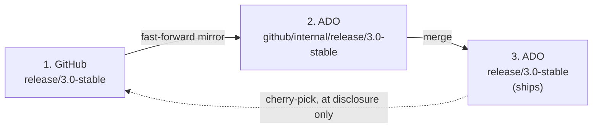

# Security fix developer guide: servicing branches

## Table of Contents

- [Who this is for](#who-this-is-for)
- [The three branches](#the-three-branches)
- [Ground rules](#ground-rules)
- [Does my fix need a public counterpart?](#does-my-fix-need-a-public-counterpart)
- [Phase 1, during embargo: land the fix internally](#phase-1-during-embargo-land-the-fix-internally)
- [Phase 2, at disclosure: publish the fix](#phase-2-at-disclosure-publish-the-fix)
- [Phase 3, afterwards: let the mirror reconcile](#phase-3-afterwards-let-the-mirror-reconcile)
- [Checklist](#checklist)
- [FAQ](#faq)

## Who this is for

You have been assigned an MSRC case against a shipped WinUI release and you need to know where to write the fix, how to
get it into the release, and what you owe the public repository afterwards.

This guide uses `release/3.0-stable` as the running example. Substitute the servicing branch you were asked to fix.

Read this end to end before you write code. The fix itself is usually the straightforward part. The step worth planning
for is [Phase 2](#phase-2-at-disclosure-publish-the-fix), which comes later, once the embargo lifts, and is driven by
you rather than by automation.

## The three branches

| # | Branch | Where | What lives there | Do you commit here? |
|---|--------|-------|------------------|---------------------|
| 1 | `release/3.0-stable` | GitHub `origin` | Public servicing history only | Yes, at disclosure |
| 2 | `github/internal/release/3.0-stable` | ADO `ado` | Exact fast-forward mirror of branch 1 | No, mirror only |
| 3 | `release/3.0-stable` | ADO `ado` | Branch 2 + internal-only changes + embargoed security fixes. **This is what ships.** | Yes, during embargo |



Branch 2 exists solely so the public history has an exact, byte-identical presence inside ADO. It is maintained by
`scripts/MirrorGitRepositoryWithHistory.ps1`, which is fast-forward-only and will fail the pipeline rather than
force-push. Keeping branch 2 free of direct commits is what lets that mirror stay exact, so treat it as read-only.

Branch 3 receives branch 2 through `scripts/MergePublicMirrorIntoInternalBranch.ps1`, which makes an ordinary
no-fast-forward merge commit.

## Ground rules

1. **The fix lands in branch 3 first.** Public pushes wait for the MSRC release date.
2. **Branch 2 is read-only.** It is a mirror rather than a working branch.
3. **You own the public disclosure commit.** It is a manual step, which is why it is worth tracking.
4. **Your internal topic branch stays on `ado`.** Draft PRs on `origin` are public too.
5. **The public commit carries only the fix**, free of internal-only content and internal identifiers.

## Does my fix need a public counterpart?

Answer this before you start, because it changes how you write the fix, not just what you do later.

| The vulnerable code is... | Public counterpart? | What that means while you write the fix |
|---|---|---|
| In code that exists on GitHub `release/3.0-stable` | Yes | Keep the change confined to these files. It will replay publicly as-is. |
| In internal-only code that never ships publicly | No | This fix stays internal, so there is no disclosure commit to plan for. |
| Both: a shared file plus an internal-only file | Partially | Separate the public part into its own commit **now**, so Phase 2 is a clean cherry-pick instead of a hand split. |

Your answer here decides whether you owe a public commit at all, and how much work that commit will be. The actions
themselves are in [Phase 2](#phase-2-at-disclosure-publish-the-fix).

If you are unsure whether a file is public, check whether it exists on `origin/release/3.0-stable`:

```powershell
git fetch origin release/3.0-stable
git cat-file -e origin/release/3.0-stable:path/to/file.cpp 2>$null; if ($LASTEXITCODE -eq 0) { "public" } else { "internal-only" }
```

## Phase 1, during embargo: land the fix internally

### 1. Cut your topic branch from branch 3

```powershell
git fetch ado
git checkout -b user/<alias>/msrc-<case>-<short-description> ado/release/3.0-stable
```

Always cut from **branch 3**. It is what ships, so it is the only branch where you can build and validate the fix
against the code that will actually be released.

### 2. Write the fix

Keep the change as small and as surgical as the vulnerability allows. You will be replaying this commit into a public
repository later, and a tight diff is far easier to review and to explain in the advisory.

Where you have a choice, put the fix in a file that already exists publicly. A fix confined to public files replays
cleanly, whereas one that reaches into internal-only files needs splitting by hand at disclosure.

### 3. Write tests, and keep them with the fix

Add regression tests in the same PR. Security tests frequently describe the vulnerability precisely enough to serve as
a proof of concept, so they stay embargoed exactly as long as the fix does and are published alongside it.

### 4. Open the PR against branch 3

Target `release/3.0-stable` in ADO. Follow the normal servicing review and approval bar for that branch, plus MSRC
sign-off on the case.

Although this PR is private, the commit message travels with the commit and you will reuse it in Phase 2. Write it as
though it were already public:

- Describe what was fixed, at a level of detail that stops short of a how-to.
- Reference the CVE if it has been assigned.
- Leave out MSRC case numbers, ADO work items, ADO PR numbers, and internal URLs.

### 5. Record the disclosure obligation before you close the case

Create the tracking item for Phase 2 **now**, while the context is fresh, and link it to the MSRC case. It is the step
most worth protecting.

This is the one part of the three-branch model that relies on people rather than tooling. Once the fix ships and the
case closes, the public step can easily slip, which would leave the public branch exposed. A linked tracking item is
what keeps it visible.

## Phase 2, at disclosure: publish the fix

Do this once the MSRC case is released and the embargo has lifted. Confirm the release status with the case owner
before pushing anything public.

What you do here depends on the answer you reached in
[Does my fix need a public counterpart?](#does-my-fix-need-a-public-counterpart):

| Your fix was... | Do this |
|---|---|
| Fully public | Cherry-pick the fix to branch 1, then fix `main`. Continue below. |
| Fully internal-only | No public commit is needed. Record that determination on the case, close the tracking item, and stop here. |
| Mixed | Publish **only** the public-file portion. If you have not already split it in Phase 1, split it now before step 3. |

### 1. Cherry-pick onto the public branch

```powershell
git fetch origin
git checkout -b user/<alias>/<cve>-public origin/release/3.0-stable
git cherry-pick <internal-commit-sha>
```

**Use plain `cherry-pick` rather than `-x`.** The `-x` flag appends a `cherry picked from commit <sha>` trailer, which
would publish an internal commit hash.

The result is a new commit. Call it `S1'`. It is a different object from the internal `S1`, with a different SHA, even
when the content is identical. That is expected and is the accepted cost of this model: the same fix lives in the
history as two commits forever.

### 2. Review the change before you push

Read the full diff the way an external reviewer would:

```powershell
git show --stat
git show
```

Satisfy yourself that everything in it, including context lines, commit message, comments, and test names, is content
we already ship publicly. If any of it is internal-only, drop it and amend the commit so the public change stands on
its own and still builds.

If you are unsure about a particular file or identifier, ask before you push rather than after.

### 3. Open the public PR

Target `release/3.0-stable` on GitHub. Use a normal merge or squash per repository policy. Either works, since `S1'`
is already a distinct commit and nothing downstream depends on its SHA.

### 4. Fix `main` as well

A servicing-only fix regresses the moment the next release branches. Port the same change to public `main`, either in
the same PR series or as a companion PR, but before you close the tracking item.

If `main` has diverged enough that the cherry-pick no longer applies, fix it forward there properly rather than forcing
the patch.

## Phase 3, afterwards: let the mirror reconcile

This phase runs on automation. It is still worth understanding, and worth confirming that it completed.

1. The mirror pipeline fast-forwards branch 2 to include `S1'`. This is a plain fast-forward, since `S1'` is an ordinary
   child of the public tip, so the fast-forward-only invariant holds and nothing special happens.
2. The integration pipeline merges branch 2 into branch 3, producing merge commit `M`.

After `M`, branch 3 contains **both** `S1` (yours, from Phase 1) and `S1'` (the public replay). The fix still applies
only once: git merges by content rather than by patch, so a change already present contributes nothing the second time.

### Will `M` conflict?

`M` behaves predictably:

| Situation | Result at `M` |
|---|---|
| `S1'` is content-identical to `S1` | **Clean merge.** The normal case. |
| `S1'` was edited or reworded relative to `S1` | Conflict in the edited region |
| Another internal commit changed the same lines after `S1` | Conflict in that region |

So the practical rule: **the closer `S1'` is to `S1`, the lighter Phase 3 is.** That is the concrete reason step 2 of
Phase 2 asks you to change as little as possible when you review it, and the reason Phase 1 asks you to keep the fix in
public files wherever you can.

### If `M` conflicts

Resolve in favour of the content that is already correct on branch 3, your original fix, while keeping any public
changes that arrived in the same merge. Keep `S1'` in the history as you resolve: it needs to remain an ancestor,
otherwise the next mirror merge raises the same conflict again.

If the conflict is larger than a few lines, loop in the author of the conflicting internal change to resolve it with
you.

## Checklist

Phase 1, during embargo:

- [ ] Topic branch cut from ADO `release/3.0-stable` (branch 3)
- [ ] Fix is minimal and, where possible, confined to files that exist publicly
- [ ] Regression tests included in the same PR
- [ ] Commit message is already publishable: free of MSRC case, work item, ADO PR, and internal URLs
- [ ] PR approved per servicing bar, plus MSRC sign-off
- [ ] Topic branch kept on `ado`
- [ ] **Disclosure tracking item created and linked to the case**

Phase 2, at disclosure:

- [ ] Release confirmed with the case owner
- [ ] Cherry-picked to public `release/3.0-stable` using plain `cherry-pick`
- [ ] Full diff reviewed: publicly shipping content only
- [ ] Public PR merged
- [ ] Same fix landed in public `main`

Phase 3, confirm:

- [ ] Mirror fast-forwarded branch 2
- [ ] Branch 2 merged into branch 3 cleanly, or conflict resolved
- [ ] Tracking item closed

## FAQ

**Why not just merge the internal branch to GitHub instead of cherry-picking?**

Branch 3 also carries internal-only changes that do not ship publicly, so merging it would publish those alongside the
fix. Cherry-picking is what lets us publish the fix on its own.

**Why does the same fix exist as two commits forever?**

That is the deliberate trade-off of this model. `S1` is the commit we shipped from, and `S1'` is the commit the public
sees. They have different SHAs because a cherry-pick produces a new object. Both remain in the history permanently.

**Can I skip branch 3 and fix it on GitHub if the code is fully public?**

Best to wait for the release date. A public commit is a public disclosure, however innocuous the diff looks.

**The vulnerability is in a file that only exists internally. Do I still do Phase 2?**

In that case there is nothing to publish. Record that determination on the case so the decision stays auditable, and
close the tracking item with that reason.

**I found the fix also needs to go to an older servicing branch.**

Treat each servicing branch as its own run of this guide, with its own internal fix and its own disclosure commit.
